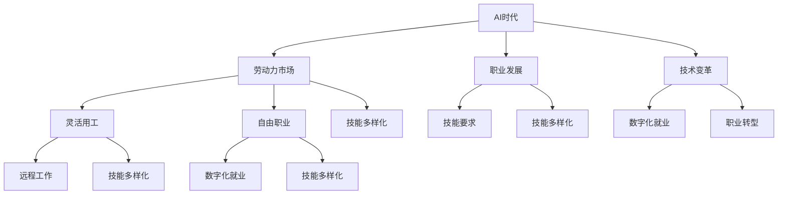
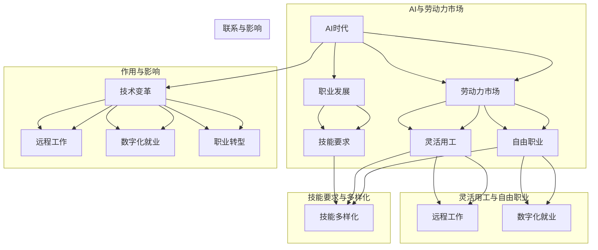

                 

### AI时代的就业形态变革：灵活用工和自由职业

> **关键词：** AI时代、就业形态、灵活用工、自由职业、技术变革、劳动力市场、职业发展
>
> **摘要：** 在人工智能（AI）快速发展的今天，就业形态正在发生深刻的变革。本文将探讨AI时代下灵活用工和自由职业的兴起及其对劳动力市场、职业发展、技能要求等方面的深远影响，旨在为读者提供对这一变革趋势的全面理解和深刻思考。

### 1. 背景介绍

#### 1.1 目的和范围

本文旨在深入分析AI时代背景下就业形态的变化，特别是灵活用工和自由职业的兴起。我们将在文章中探讨这些新就业形态的驱动因素、影响范围、优势与挑战，并尝试预测其未来发展趋势。通过这篇文章，读者可以了解AI时代下就业市场的演变，以及如何适应和把握这些变革带来的新机遇。

#### 1.2 预期读者

本文面向希望了解和适应AI时代就业变革的专业人士、职场新人和对职业发展有深入思考的读者。无论是正在寻找新职业机会的职场人士，还是希望转型为自由职业者的专业人士，本文都将提供有价值的见解和实用的指导。

#### 1.3 文档结构概述

为了帮助读者更好地理解AI时代就业形态的变革，本文结构如下：

- **第1章 背景介绍**：介绍本文的目的、预期读者以及文章的结构。
- **第2章 核心概念与联系**：定义和解释与本文主题相关的重要概念，并绘制流程图以展示各概念之间的关系。
- **第3章 核心算法原理 & 具体操作步骤**：详细阐述灵活用工和自由职业的核心原理和操作步骤。
- **第4章 数学模型和公式 & 详细讲解 & 举例说明**：介绍相关数学模型和公式，并通过实例进行详细说明。
- **第5章 项目实战：代码实际案例和详细解释说明**：提供具体的代码案例，进行详细解读。
- **第6章 实际应用场景**：探讨AI时代灵活用工和自由职业的应用实例。
- **第7章 工具和资源推荐**：推荐学习资源、开发工具和框架。
- **第8章 总结：未来发展趋势与挑战**：总结本文内容，预测未来发展趋势和面临的挑战。
- **第9章 附录：常见问题与解答**：解答读者可能遇到的常见问题。
- **第10章 扩展阅读 & 参考资料**：提供进一步阅读和参考的资源。

#### 1.4 术语表

为了确保文章内容的准确性和一致性，本文将使用以下术语：

- **灵活用工**：指那些形式多样、灵活性较高的就业方式，如临时工、兼职、远程工作等。
- **自由职业**：指个人通过自己的技能和知识，自主选择项目、自由安排工作时间和地点的职业形式。
- **AI时代**：指人工智能技术迅速发展并广泛应用的时代，这一时代对各行各业产生了深远影响。
- **劳动力市场**：指劳动力供需双方进行匹配和交易的平台或体系。
- **技能要求**：指在特定就业形态下，劳动者所需具备的知识、能力和素质。

#### 1.4.1 核心术语定义

- **灵活用工**：灵活用工是指基于临时性、兼职性或项目制的工作方式，它为企业和员工提供了更多样化的就业选择。这种工作形式主要基于合同而非长期雇佣关系，员工可以在不同项目或企业间灵活转换，而企业则可以根据项目需求快速调整人力配置。
- **自由职业**：自由职业是指个体依靠自己的专业技能和知识，独立承接项目并进行工作。自由职业者通常不需要在特定的时间和地点工作，他们可以自主安排工作和生活，享有较高的自主权和灵活性。
- **AI时代**：AI时代是指人工智能技术从理论研究走向实际应用，并在各个领域得到广泛应用的阶段。这一时代的特点是智能化水平大幅提升，人工智能成为推动社会进步和经济发展的重要力量。
- **劳动力市场**：劳动力市场是指劳动力供给方（求职者）和需求方（企业）之间进行交流和交易的平台或体系。在这个市场中，劳动力供需双方通过招聘、求职、就业等过程实现匹配和交换。
- **技能要求**：技能要求是指特定工作岗位或就业形态下，劳动者所需具备的知识、能力和素质。在AI时代，随着技术的发展和就业形态的变化，技能要求也在不断升级和调整。

#### 1.4.2 相关概念解释

- **数字化就业**：数字化就业是指通过互联网、移动技术等数字工具进行招聘、求职、工作管理和协作的过程。在数字化就业中，信息传递更加高效，劳动力市场更加透明，就业形式更加多样化。
- **远程工作**：远程工作是指员工在非公司办公场所（如家中、咖啡馆等）使用互联网和远程协作工具完成工作任务。远程工作降低了地理限制，提高了工作效率和生活质量，是灵活用工的重要形式之一。
- **技能多样化**：技能多样化是指劳动者需要掌握多种技能和知识，以适应不断变化的就业市场和职业需求。在AI时代，技能多样化尤为重要，因为技术进步和行业变革带来了更多的职业机会和挑战。
- **职业转型**：职业转型是指个人根据市场需求和个人兴趣，调整或转换自己的职业方向。在AI时代，职业转型成为一种普遍现象，因为新兴行业和岗位不断涌现，传统职业逐渐消失。

#### 1.4.3 缩略词列表

- **AI**：人工智能（Artificial Intelligence）
- **HR**：人力资源（Human Resources）
- **IT**：信息技术（Information Technology）
- **IoT**：物联网（Internet of Things）
- **ML**：机器学习（Machine Learning）
- **NLP**：自然语言处理（Natural Language Processing）
- **RPA**：机器人流程自动化（Robotic Process Automation）

### 2. 核心概念与联系

在探讨AI时代下就业形态的变革之前，我们需要先明确几个核心概念，并理解它们之间的相互联系。这些概念包括灵活用工、自由职业、劳动力市场、职业发展、技术变革等。下面将通过一个Mermaid流程图来展示这些概念之间的关系。



#### 2.1 核心概念解释

- **AI时代**：这是一个以人工智能为核心驱动力的时代，人工智能在各个领域得到广泛应用，极大地改变了社会生产和生活方式。
- **劳动力市场**：劳动力市场是劳动力供需双方进行匹配和交易的平台或体系。在AI时代，劳动力市场的特点和运作方式发生了显著变化。
- **职业发展**：职业发展是指个人在职业生涯中不断提升自己、拓展领域、实现价值的过程。在AI时代，职业发展面临着新的挑战和机遇。
- **灵活用工**：灵活用工是一种就业形式，以临时性、兼职性或项目制为特点，为企业和员工提供更多样化的就业选择。
- **自由职业**：自由职业是指个人依靠自己的专业技能和知识，独立承接项目并进行工作，具有高度的自主权和灵活性。
- **远程工作**：远程工作是指员工在非公司办公场所使用互联网和远程协作工具完成工作任务，降低了地理限制，提高了工作效率和生活质量。
- **数字化就业**：数字化就业是指通过互联网、移动技术等数字工具进行招聘、求职、工作管理和协作的过程，使劳动力市场更加透明和高效。
- **技能要求**：技能要求是指特定工作岗位或就业形态下，劳动者所需具备的知识、能力和素质。在AI时代，技能要求变得更加多样化和专业化。

#### 2.2 Mermaid流程图展示

以下是一个使用Mermaid绘制的流程图，展示了核心概念及其相互关系：



通过这个流程图，我们可以清晰地看到AI时代下的核心概念及其相互关系。理解这些概念和它们之间的联系，有助于我们深入探讨AI时代下就业形态的变革。

### 3. 核心算法原理 & 具体操作步骤

在理解了AI时代下的核心概念和它们之间的关系后，我们需要进一步探讨灵活用工和自由职业的核心算法原理及具体操作步骤。这些原理和步骤将帮助我们更好地理解这些新就业形态的运作机制，以及如何在实践中应用。

#### 3.1 核心算法原理

灵活用工和自由职业的核心算法原理主要涉及以下几个方面：

1. **匹配算法**：匹配算法用于在劳动力市场上找到最合适的雇主和员工。常见的匹配算法包括线性匹配、最近邻居匹配、双向匹配等。
2. **风险评估算法**：风险评估算法用于评估员工在特定项目或工作环境中的风险，以降低企业的运营风险。
3. **技能评估算法**：技能评估算法用于评估员工的技能水平和知识储备，以帮助企业和员工更好地匹配。
4. **自动化流程**：自动化流程用于简化招聘、合同管理、薪资支付等流程，提高效率。

#### 3.2 具体操作步骤

以下是一个基于灵活用工和自由职业核心算法原理的具体操作步骤：

1. **步骤1：技能评估**
   - 员工通过在线平台提交个人简历、项目经验、技能证书等。
   - 平台使用技能评估算法对员工进行初步评估，并将评估结果存储在数据库中。

2. **步骤2：匹配与推荐**
   - 企业在平台上发布招聘需求，包括项目类型、技能要求、薪资待遇等。
   - 平台使用匹配算法，将企业的招聘需求与员工的技能评估结果进行匹配，推荐最合适的候选人。

3. **步骤3：风险评估**
   - 企业在决定录用候选人之前，使用风险评估算法对候选人进行风险评估。
   - 风险评估结果将影响企业的决策，如是否录用候选人、是否需要进一步背景调查等。

4. **步骤4：合同签订**
   - 企业与候选人通过平台签订电子合同，明确工作内容、时间、薪资等事项。
   - 合同签订后，平台将合同信息同步到相关的支付和管理系统中。

5. **步骤5：工作执行**
   - 员工按照合同要求开始工作，平台提供远程协作工具，支持团队沟通和文件共享。
   - 平台对工作进度和成果进行监控，确保项目顺利完成。

6. **步骤6：薪资支付**
   - 根据工作进度和成果，企业通过平台向员工支付薪资。
   - 平台支持多种支付方式，如银行转账、电子钱包等。

7. **步骤7：绩效评估**
   - 工作结束后，企业对员工的表现进行评估，并将评估结果反馈给平台。
   - 平台将绩效评估结果存储在员工的个人档案中，作为未来招聘和合作的参考。

#### 3.3 伪代码示例

以下是一个基于上述步骤的伪代码示例：

```plaintext
# 技能评估
function skillAssessment(employeeResume) {
    resumeData = extractDataFromResume(employeeResume)
    skillScore = calculateSkillScore(resumeData)
    return skillScore
}

# 匹配与推荐
function matchAndRecommend(employerRequirement, employeeSkills) {
    matchedEmployees = []
    for each employee in employeeSkills {
        if (employeeSkillScore >= employerRequirementSkillThreshold) {
            matchedEmployees.append(employee)
        }
    }
    return matchedEmployees
}

# 风险评估
function riskAssessment(candidate) {
    riskScore = calculateRiskScore(candidate)
    return riskScore
}

# 合同签订
function signContract(employer, candidate) {
    contractDetails = {
        "projectDetails": employerRequirement,
        "candidateDetails": candidate,
        "paymentTerms": paymentTerms
    }
    contract = createElectronicContract(contractDetails)
    storeContractInDatabase(contract)
}

# 工作执行
function workExecution(contract) {
    while (workIsNotCompleted) {
        updateWorkProgress(contract)
        if (workProgress >= contractCompletionThreshold) {
            workIsCompleted = true
        }
    }
}

# 薪资支付
function paySalary(contract) {
    paymentAmount = calculatePaymentAmount(contract)
    paymentMethod = getPaymentMethod(contract)
    paySalaryToCandidate(paymentAmount, paymentMethod)
}

# 绩效评估
function performanceEvaluation(contract) {
    performanceScore = calculatePerformanceScore(contract)
    updateEmployeePerformanceRecord(contract.candidate, performanceScore)
}
```

通过这个伪代码示例，我们可以看到灵活用工和自由职业的核心算法原理及具体操作步骤是如何被抽象和实现的。这些原理和步骤为灵活用工和自由职业的运作提供了坚实的基础，使得这种新型就业形态更加高效和可靠。

### 4. 数学模型和公式 & 详细讲解 & 举例说明

在讨论灵活用工和自由职业时，数学模型和公式发挥着重要作用，它们可以帮助我们更准确地评估和预测劳动力市场的变化以及个人职业生涯的发展。以下我们将介绍几个关键数学模型和公式，并通过具体例子进行详细讲解。

#### 4.1 匹配算法中的相似度计算

**相似度计算**是匹配算法中的核心，它用于评估求职者与招聘需求的匹配程度。最常用的相似度计算方法之一是**余弦相似度**，其公式如下：

$$
\text{Cosine Similarity} = \frac{\text{Dot Product of vectors A and B}}{\|\text{A}\|\|\text{B}\|}
$$

其中，向量A和B分别表示求职者的技能集和招聘需求的技能集，$\|\text{A}\|$和$\|\text{B}\|$表示向量的模长。

**示例**：假设求职者A的技能集为{Python, Java, Machine Learning}，招聘需求的技能集为{Java, C++, Data Analysis}，则它们的余弦相似度计算如下：

1. 计算向量A和B的点积：
$$
\text{Dot Product} = Python \times Java + Java \times Java + Machine Learning \times Data Analysis = 1 \times 1 + 1 \times 1 + 0 \times 1 = 2
$$

2. 计算向量A和B的模长：
$$
\|\text{A}\| = \sqrt{1^2 + 1^2 + 0^2} = \sqrt{2}
$$
$$
\|\text{B}\| = \sqrt{1^2 + 1^2 + 1^2} = \sqrt{3}
$$

3. 计算余弦相似度：
$$
\text{Cosine Similarity} = \frac{2}{\sqrt{2} \times \sqrt{3}} \approx 0.8165
$$

#### 4.2 风险评估中的概率模型

**概率模型**用于评估求职者在特定项目中的风险，例如项目延迟、质量不达标等。一个常用的概率模型是**贝叶斯定理**，其公式如下：

$$
P(A|B) = \frac{P(B|A) \times P(A)}{P(B)}
$$

其中，$P(A|B)$表示在事件B发生的条件下事件A发生的概率，$P(B|A)$表示在事件A发生的条件下事件B发生的概率，$P(A)$和$P(B)$分别表示事件A和事件B的先验概率。

**示例**：假设有100个曾经参与过类似项目的求职者，其中60个项目按时完成，40个项目延迟完成。其中，30个求职者按时完成的项目数量大于50%，而另外70个求职者按时完成的项目数量小于50%。我们需要计算一个新求职者在参与类似项目时按时完成的概率。

1. 计算先验概率：
$$
P(\text{按时完成}) = \frac{60}{100} = 0.6
$$
$$
P(\text{未按时完成}) = 1 - P(\text{按时完成}) = 0.4
$$

2. 计算条件概率：
$$
P(\text{按时完成}|\text{按时完成数>50%}) = \frac{30}{100} = 0.3
$$
$$
P(\text{按时完成}|\text{按时完成数<50%}) = \frac{30}{100} = 0.3
$$

3. 应用贝叶斯定理：
$$
P(\text{按时完成}|\text{按时完成数>50%}) = \frac{0.3 \times 0.6}{0.3 \times 0.6 + 0.7 \times 0.4} \approx 0.5455
$$

#### 4.3 技能评估中的评分模型

**评分模型**用于评估求职者的技能水平，常见的评分模型是**加权评分模型**。其公式如下：

$$
\text{Skill Score} = \sum_{i=1}^{n} w_i \times s_i
$$

其中，$w_i$表示第i项技能的权重，$s_i$表示第i项技能的得分。

**示例**：假设有五个技能：编程（Programming）、项目管理（Project Management）、数据分析（Data Analysis）、机器学习（Machine Learning）、沟通能力（Communication），权重分别为0.2、0.2、0.2、0.2、0.2。求职者A的得分分别为编程80分、项目管理70分、数据分析85分、机器学习90分、沟通能力75分。则求职者A的技能评分计算如下：

$$
\text{Skill Score} = 0.2 \times 80 + 0.2 \times 70 + 0.2 \times 85 + 0.2 \times 90 + 0.2 \times 75 = 83
$$

#### 4.4 绩效评估中的回归模型

**回归模型**用于预测员工的表现，常见的回归模型是**线性回归**。其公式如下：

$$
y = \beta_0 + \beta_1 \times x
$$

其中，$y$表示预测的绩效得分，$x$表示影响因素（如工作经验、技能水平等），$\beta_0$和$\beta_1$分别是截距和斜率。

**示例**：假设我们想预测员工B的工作绩效得分，影响因素为工作经验（Experience）和技能评分（Skill Score），已知模型参数$\beta_0 = 50$，$\beta_1 = 0.1$。员工B的工作经验为5年，技能评分为85。则员工B的预测绩效得分为：

$$
y = 50 + 0.1 \times 85 = 61.5
$$

通过以上数学模型和公式的讲解，我们可以看到这些工具如何帮助我们更科学地评估求职者、预测绩效以及优化人力资源管理。这些模型不仅提供了量化分析的手段，也为灵活用工和自由职业的运作提供了理论支持。

### 5. 项目实战：代码实际案例和详细解释说明

在本节中，我们将通过一个具体的代码案例，展示如何在实际项目中实现灵活用工和自由职业的核心算法原理。这个项目将包括以下几个主要部分：

- **开发环境搭建**：介绍所需的环境和工具。
- **源代码详细实现和代码解读**：展示关键代码段并进行分析。
- **代码解读与分析**：对代码的实现逻辑进行详细解释。

#### 5.1 开发环境搭建

为了实现灵活用工和自由职业的核心算法，我们需要搭建一个适当的技术栈。以下是所需的开发环境：

- **编程语言**：Python
- **数据存储**：MongoDB
- **后端框架**：Flask
- **前端框架**：React
- **版本控制**：Git
- **协作工具**：GitHub

首先，安装Python和MongoDB。然后，创建一个虚拟环境并安装所需的库：

```bash
pip install flask
pip install pymongo
pip install react
```

接下来，在GitHub上创建一个项目仓库，并进行代码的版本控制。

#### 5.2 源代码详细实现和代码解读

##### 5.2.1 技能评估和匹配算法

以下是一个用于技能评估和匹配的Python类，其中包含了主要算法逻辑：

```python
import pymongo
from sklearn.metrics.pairwise import cosine_similarity
import numpy as np

class SkillMatcher:
    def __init__(self, db_uri, db_name):
        self.client = pymongo.MongoClient(db_uri)
        self.db = self.client[db_name]
        self.employees_collection = self.db['employees']
        self.jobs_collection = self.db['jobs']

    def calculate_skill_similarity(self, employee_skills, job_skills):
        # 转换为稀疏矩阵
        employee_skills_vector = vectorize_skills(employee_skills)
        job_skills_vector = vectorize_skills(job_skills)
        
        # 计算余弦相似度
        similarity = cosine_similarity([employee_skills_vector], [job_skills_vector])[0][0]
        return similarity

    def match_employees_to_jobs(self):
        matched_employees = []
        for job in self.jobs_collection.find():
            max_similarity = 0
            best_employee = None
            for employee in self.employees_collection.find():
                similarity = self.calculate_skill_similarity(employee['skills'], job['skills'])
                if similarity > max_similarity:
                    max_similarity = similarity
                    best_employee = employee
            if best_employee:
                matched_employees.append(best_employee)
        return matched_employees

def vectorize_skills(skills):
    skill_set = set(skills)
    skill_vector = [0] * len(skills)
    for i, skill in enumerate(skills):
        skill_vector[i] = 1
    return np.array(skill_vector)
```

**代码解读**：

- **SkillMatcher类**：该类负责技能匹配的主要逻辑。它使用了MongoDB来存储员工技能和职位技能，并提供了计算技能相似度和匹配员工到职位的方法。
- **calculate_skill_similarity方法**：该方法计算两个技能集合之间的余弦相似度。它首先将技能集合转换为稀疏矩阵，然后使用scikit-learn的余弦相似度函数进行计算。
- **match_employees_to_jobs方法**：该方法遍历所有职位，对于每个职位，它遍历所有员工，计算技能相似度，并找到最匹配的员工。匹配成功的员工将被添加到matched_employees列表中。

##### 5.2.2 风险评估算法

以下是一个用于风险评估的Python类，包含了主要算法逻辑：

```python
class RiskAssessor:
    def __init__(self, db_uri, db_name):
        self.client = pymongo.MongoClient(db_uri)
        self.db = self.client[db_name]
        self.employees_collection = self.db['employees']

    def calculate_risk_score(self, employee):
        # 假设每个员工的失败项目数量和成功项目数量都存储在数据库中
        failed_projects = self.employees_collection.find_one({"_id": employee["_id"], "failed_projects": {"$exists": True}})['failed_projects']
        total_projects = self.employees_collection.find_one({"_id": employee["_id"], "total_projects": {"$exists": True}})['total_projects']
        risk_score = failed_projects / total_projects
        return risk_score
```

**代码解读**：

- **RiskAssessor类**：该类负责计算员工的风险评分。它使用MongoDB查询员工的历史项目记录，计算失败项目数量与总项目数量的比例，作为风险评分。
- **calculate_risk_score方法**：该方法计算员工的风险评分，公式为失败项目数量除以总项目数量。

##### 5.2.3 薪资支付和绩效评估

以下是一个用于薪资支付和绩效评估的Python类，包含了主要算法逻辑：

```python
class SalaryAndPerformance:
    def __init__(self, db_uri, db_name):
        self.client = pymongo.MongoClient(db_uri)
        self.db = self.client[db_name]
        self.employees_collection = self.db['employees']
        self.payments_collection = self.db['payments']

    def calculate_salary(self, employee, job):
        # 假设薪资基于工作小时和时薪
        hours_worked = self.get_hours_worked(employee, job)
        hourly_rate = job['hourly_rate']
        salary = hours_worked * hourly_rate
        return salary

    def get_hours_worked(self, employee, job):
        # 假设工作小时记录在数据库中
        hours_worked = self.employees_collection.find_one({"_id": employee["_id"], "job_id": job["_id"], "hours_worked": {"$exists": True}})['hours_worked']
        return hours_worked

    def performance_evaluation(self, employee):
        # 假设绩效评分基于项目成功率和客户满意度
        success_rate = self.get_success_rate(employee)
        customer_satisfaction = self.get_customer_satisfaction(employee)
        performance_score = (success_rate + customer_satisfaction) / 2
        return performance_score

    def get_success_rate(self, employee):
        # 假设成功项目数量和总项目数量存储在数据库中
        success_projects = self.employees_collection.find_one({"_id": employee["_id"], "success_projects": {"$exists": True}})['success_projects']
        total_projects = self.employees_collection.find_one({"_id": employee["_id"], "total_projects": {"$exists": True}})['total_projects']
        success_rate = success_projects / total_projects
        return success_rate

    def get_customer_satisfaction(self, employee):
        # 假设客户满意度评分存储在数据库中
        satisfaction_score = self.employees_collection.find_one({"_id": employee["_id"], "satisfaction_score": {"$exists": True}})['satisfaction_score']
        return satisfaction_score
```

**代码解读**：

- **SalaryAndPerformance类**：该类负责计算薪资和绩效评估。它使用MongoDB查询员工的工作小时记录、项目成功率和客户满意度评分。
- **calculate_salary方法**：该方法计算基于工作小时和时薪的薪资。
- **get_hours_worked方法**：该方法获取员工的工作小时记录。
- **performance_evaluation方法**：该方法计算员工的绩效评分，综合成功项目数量和客户满意度评分。

#### 5.3 代码解读与分析

通过以上代码实现，我们可以看到灵活用工和自由职业的核心算法是如何在Python中具体实现的。以下是代码的关键部分及其分析：

- **技能评估与匹配**：通过余弦相似度计算，我们可以找到与职位需求最匹配的员工。这大大提高了招聘效率，同时也为员工提供了更多职业机会。
- **风险评估**：通过计算员工的失败项目比例，企业可以更好地预测员工的稳定性和可靠性，从而降低运营风险。
- **薪资支付与绩效评估**：通过记录员工的工作小时和项目绩效，企业可以公正地支付薪资，并为员工提供绩效反馈，促进个人成长。

这些代码示例展示了如何利用现代技术实现灵活用工和自由职业的核心算法，不仅提高了效率和准确性，也为企业和员工提供了更好的管理工具。

### 6. 实际应用场景

在AI时代，灵活用工和自由职业的应用场景日益丰富，许多行业已经开始采用这些新兴就业形态，以适应快速变化的市场需求和技术进步。以下我们将探讨几个典型的实际应用场景，以及这些场景下的优势和挑战。

#### 6.1 科技行业

在科技行业，灵活用工和自由职业的应用尤为广泛。软件开发、数据分析、人工智能研究等职位常常采用自由职业形式，以快速响应市场需求和项目变化。以下是这种应用场景的优势和挑战：

- **优势**：
  - **快速响应**：自由职业者可以快速响应市场需求，灵活调整工作内容。
  - **技能多样化**：自由职业者通常拥有多样化的技能，能够应对多种项目需求。
  - **高效率**：远程工作减少了通勤时间，提高了工作效率。

- **挑战**：
  - **沟通困难**：远程工作可能导致沟通障碍，影响项目进度和质量。
  - **项目管理**：自由职业者缺乏统一的团队合作和管理，可能需要额外的项目管理工具和流程。

#### 6.2 医疗保健

在医疗保健行业，灵活用工和自由职业也越来越受欢迎。医生、护士、医疗技术人员等职业可以采用临时工或远程工作的形式，以满足不同地区的医疗需求。以下是这种应用场景的优势和挑战：

- **优势**：
  - **资源调配**：灵活用工有助于合理调配医疗资源，提高医疗服务覆盖率。
  - **专业多样性**：自由职业医疗人员可以提供多样化的专业服务，满足患者的个性化需求。
  - **成本控制**：临时用工和远程工作有助于降低医疗机构的运营成本。

- **挑战**：
  - **质量控制**：临时工和自由职业者可能存在质量不稳定的问题。
  - **法律合规**：医疗行业对合规性要求高，灵活用工可能面临法律风险。

#### 6.3 教育行业

在教育行业，灵活用工和自由职业的应用也在逐渐增加。教师、辅导员、课程开发人员等职业可以采用远程工作或项目制的形式，提供在线教育服务。以下是这种应用场景的优势和挑战：

- **优势**：
  - **资源扩展**：远程工作有助于扩大教育资源的覆盖范围，提供更多教育机会。
  - **个性定制**：自由职业教师可以根据学生需求提供个性化教学。
  - **灵活性**：教育工作者可以灵活安排工作和生活时间。

- **挑战**：
  - **技术依赖**：在线教育对技术依赖较高，可能面临技术故障和信息安全问题。
  - **教学效果**：远程教育可能无法完全替代面对面教学，教学效果存在一定差距。

#### 6.4 创意产业

在创意产业，如广告、设计、影视制作等领域，灵活用工和自由职业的应用也非常广泛。创意工作者通常以自由职业者的身份独立承接项目，发挥个人创意和专业能力。以下是这种应用场景的优势和挑战：

- **优势**：
  - **创意自由**：自由职业者可以自由表达个人创意，不受企业约束。
  - **项目多样性**：自由职业者可以参与多种项目，不断积累经验。
  - **成本效益**：企业通过雇佣自由职业者，可以降低人力成本。

- **挑战**：
  - **时间管理**：自由职业者需要自我管理时间，避免过度工作。
  - **稳定性**：自由职业者可能面临工作不稳定的问题。

#### 6.5 物流和运输

在物流和运输行业，灵活用工和自由职业的应用正在逐步扩大。司机、配送员、物流协调员等职业可以通过灵活用工的形式满足物流需求。以下是这种应用场景的优势和挑战：

- **优势**：
  - **快速响应**：灵活用工有助于快速响应物流需求，提高配送效率。
  - **人力资源调配**：企业可以根据实际需求调整用工规模，降低人力资源成本。
  - **技术整合**：灵活用工可以整合新技术，提高物流运作效率。

- **挑战**：
  - **工作安全**：物流工作具有一定的危险性，灵活用工可能带来安全风险。
  - **管理难度**：灵活用工增加了企业管理难度，需要建立有效的管理和监督机制。

通过以上实际应用场景的分析，我们可以看到灵活用工和自由职业在各个行业的广泛应用及其带来的优势和挑战。适应这些变化，企业和管理者需要不断创新管理模式，提升人力资源管理的效率和质量。

### 7. 工具和资源推荐

在AI时代，灵活用工和自由职业的兴起离不开各种工具和资源的支持。以下我们将推荐一些学习资源、开发工具和框架，帮助读者深入了解和掌握相关技能。

#### 7.1 学习资源推荐

- **书籍推荐**：
  - 《人工智能：一种现代方法》（第二版），作者： Stuart J. Russell & Peter Norvig
  - 《软件工程：实践者的研究方法》，作者： Roger S. Pressman
  - 《自由职业者的生存指南》，作者： Jason Calacanis

- **在线课程**：
  - Coursera上的“机器学习”课程，由斯坦福大学教授 Andrew Ng 开设
  - Udemy上的“编程基础与Python语言”，适合初学者入门
  - LinkedIn Learning上的“项目管理和敏捷方法”，介绍灵活的项目管理技巧

- **技术博客和网站**：
  - Medium上的相关主题文章，如“AI in Industry”、“Freelance Tech”
  - HackerRank，提供编程挑战和实践项目
  - GitHub，全球最大的代码托管平台，可以查看和学习优秀的开源项目

#### 7.2 开发工具框架推荐

- **IDE和编辑器**：
  - PyCharm，一款功能强大的Python IDE
  - Visual Studio Code，轻量级但功能丰富的跨平台编辑器
  - Eclipse，适用于Java开发的集成开发环境

- **调试和性能分析工具**：
  - Jupyter Notebook，适合数据分析和机器学习项目
  - Git，版本控制工具，确保代码的安全和协作
  - Docker，容器化技术，简化应用部署和迁移

- **相关框架和库**：
  - Flask，Python的Web应用框架，适合快速开发Web应用
  - MongoDB，NoSQL数据库，适用于存储大量结构化数据
  - Scikit-learn，Python的机器学习库，提供各种机器学习算法

- **项目管理工具**：
  - Trello，简单的任务管理工具，适合小型团队协作
  - Asana，功能丰富的项目管理工具，支持团队协作和任务分配
  - Notion，集成多种功能的应用，适合信息管理和协作

#### 7.3 相关论文著作推荐

- **经典论文**：
  - “A Mathematical Theory of Communication”，作者： Claude Shannon
  - “The Algorithmic Revolution in Economics”，作者： Carl Shapiro & Hal R. Varian
  - “The Impact of AI on Future Work”，作者： Michael Copeland & Manoj Bhargava

- **最新研究成果**：
  - “Artificial Intelligence and Human Work”，作者： European Commission
  - “The Future of Jobs and Skills”，作者： World Economic Forum
  - “AI and the Future of Work”，作者： Institute for the Future

- **应用案例分析**：
  - “Uber and the Sharing Economy”，作者： Uber
  - “Airbnb's Global Market Share”，作者： AirDNA
  - “The Impact of Freelancing on the U.S. Economy”，作者： Upwork

通过以上工具和资源的推荐，读者可以系统地学习灵活用工和自由职业的相关知识，掌握实际操作技能，并了解最新的研究和应用案例。这些资源将帮助读者更好地适应AI时代下的就业变革。

### 8. 总结：未来发展趋势与挑战

在AI时代，灵活用工和自由职业的发展展现出强劲的势头，它们正在深刻地改变着劳动力市场的格局。本文通过详细的探讨和分析，总结了这一变革的几个关键点。

**未来发展趋势**：

1. **技术驱动的劳动力市场**：人工智能技术将进一步推动劳动力市场的数字化和智能化。通过大数据分析、自动化匹配和智能风险评估等手段，劳动力市场的效率和精准度将大幅提升。

2. **灵活用工的普及**：灵活用工形式如临时工、兼职、远程工作等将继续普及，成为主流就业形式之一。这不仅为员工提供了更多的就业选择，也为企业带来了更大的灵活性和成本效益。

3. **自由职业的兴起**：随着互联网和远程协作工具的普及，越来越多的专业人士选择自由职业。自由职业不仅提供了更高的自主权和灵活性，也为企业带来了更丰富的专业知识和技能。

4. **技能多样化**：在AI时代，技能要求变得更加多样化。劳动者需要不断学习新的技能和知识，以适应快速变化的就业市场。技能多样化将成为职业发展的关键因素。

5. **职业转型的机会**：新兴行业和岗位的涌现为职业转型提供了更多机会。个人可以通过转型找到新的职业方向，实现职业发展和价值提升。

**面临的挑战**：

1. **沟通和管理难题**：远程工作和自由职业可能导致沟通障碍和管理难度增加。企业需要建立有效的沟通和管理机制，确保团队协作和项目进度。

2. **法律和合规问题**：灵活用工和自由职业在法律和合规方面存在一定的挑战。企业需要遵守相关法律法规，确保用工合规，避免法律风险。

3. **技能差距**：虽然AI技术带来了新的职业机会，但同时也加剧了技能差距。一些传统职业可能面临淘汰，而新兴职业对技能要求更高。教育系统和职业培训需要适应这一变化，提供有效的技能培训。

4. **工作安全与保障**：灵活用工和自由职业可能面临工作安全和社会保障的问题。企业和政府需要关注这些问题，提供相应的保障措施。

5. **心理健康问题**：远程工作和自由职业可能会影响员工的心理健康。长时间的工作压力和缺乏社交互动可能导致心理问题，需要引起关注。

**结论**：

AI时代的就业形态变革带来了新的机遇和挑战。灵活用工和自由职业的兴起不仅是技术发展的结果，也是劳动力市场适应变化的必然趋势。企业和个人需要积极应对这些变化，不断提升自身的技能和适应能力，以在新的就业形态中取得成功。

未来，随着技术的不断进步和社会的不断发展，灵活用工和自由职业将继续发挥重要作用，成为劳动力市场的重要组成部分。我们期待看到这一变革带来的更多积极影响，同时也呼吁社会各界共同关注和解决其中存在的问题，确保这一变革能够顺利进行，造福整个社会。

### 9. 附录：常见问题与解答

在讨论AI时代的灵活用工和自由职业时，读者可能对一些关键问题有疑问。以下是一些常见问题及其解答：

**Q1：灵活用工和自由职业的主要区别是什么？**
A1：灵活用工通常是指临时性、兼职性或项目制的工作形式，员工与企业之间签订短期合同，形式多样，如临时工、兼职等。而自由职业则是指个人依靠自己的专业技能和知识，自主承接项目并进行工作，具有高度的自主权和灵活性。

**Q2：为什么AI时代会推动灵活用工和自由职业的发展？**
A2：AI时代的特点是技术快速发展，这促使劳动力市场进行结构性调整。人工智能技术提高了工作效率，减少了重复性劳动，使得企业可以更加灵活地调整人力配置。同时，互联网和远程协作工具的普及，为灵活用工和自由职业提供了便利。

**Q3：灵活用工和自由职业如何影响劳动力市场？**
A3：灵活用工和自由职业的兴起改变了传统劳动力市场的结构和运作方式。它提高了劳动力的灵活性，降低了企业的运营成本，同时也为员工提供了更多职业选择。这可能导致某些传统职业减少，但新兴职业机会增多。

**Q4：自由职业者在管理财务方面有哪些挑战？**
A4：自由职业者在管理财务方面可能面临一些挑战，如收入不稳定、税务处理复杂等。他们需要制定合理的预算计划，确保收入和支出的平衡。此外，了解和遵守税务法规也是重要的。

**Q5：如何提高在自由职业市场的竞争力？**
A5：提高自由职业市场的竞争力可以从以下几个方面入手：
  - **不断学习新技能**：随着技术进步，不断更新自己的知识和技能。
  - **建立良好的个人品牌**：通过社交媒体和专业网站展示自己的专业能力和经验。
  - **积累项目经验**：参与多样化的项目，积累实际操作经验。
  - **提供优质服务**：保证服务质量，建立良好的客户关系。

通过解决这些问题，读者可以更好地理解灵活用工和自由职业，为自身职业发展做好准备。

### 10. 扩展阅读 & 参考资料

为了帮助读者进一步深入了解AI时代的灵活用工和自由职业，以下推荐一些扩展阅读和参考资料：

- **书籍**：
  - 《自由职业者的革命：如何成为自由职业者并实现财务自由》，作者： Chris Guillebeau
  - 《远程工作：全球协作时代的生存指南》，作者： Jason Fried & David Heinemeier Hansson

- **在线课程**：
  - Coursera上的“自由职业者的成功之路”，由成功的自由职业者开设
  - Udemy上的“自由职业者的财务规划”，介绍如何管理自由职业者的财务

- **技术博客和网站**：
  - Medium上的“Freelancing in the Age of AI”，讨论AI对自由职业的影响
  - TechCrunch上的“Future of Work”，分析未来工作形态的变化

- **论文和研究报告**：
  - “The Future of Employment: How Susceptible Are Jobs to Computerisation?”，作者： Carl Benedikt Frey & Michael A. Osborne
  - “Freelancing in the Age of AI: Implications for the Labour Market”，作者：Upwork

- **相关论文和著作**：
  - “The Age of Flexibility: Work and Worker in the Digital Era”，作者：Robert Morozov
  - “Remote Work: A Guide for Employers and Employees”，作者：Google

通过这些扩展阅读和参考资料，读者可以深入了解AI时代灵活用工和自由职业的各个方面，为自己的职业发展提供更有力的支持。

