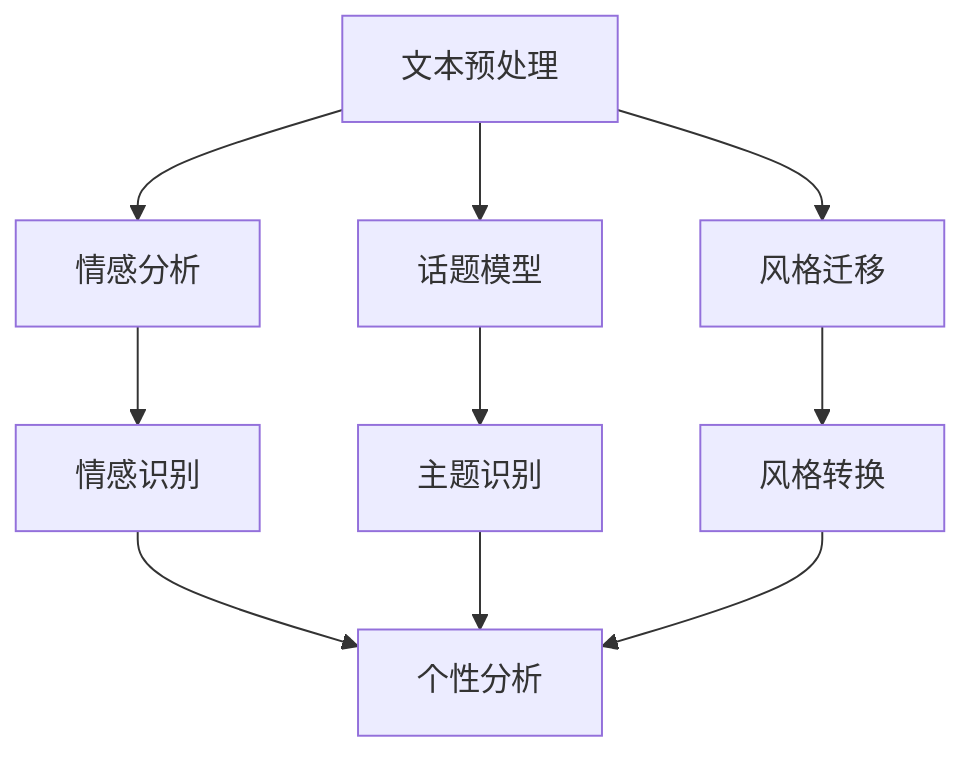
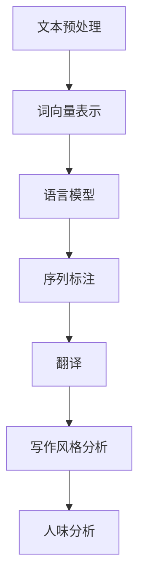

                 

# AI时代的自然语言处理应用：写作风格与人味

> **关键词**：自然语言处理、人工智能、写作风格、人味、应用场景、算法原理、数学模型、项目实战

> **摘要**：本文将深入探讨AI时代自然语言处理的应用，特别是在写作风格和人味方面的表现。我们将通过分析核心概念、算法原理、数学模型和实际应用案例，探讨如何利用自然语言处理技术提升写作质量，使其更具有个性和人味。

## 1. 背景介绍

自然语言处理（Natural Language Processing，NLP）是人工智能（Artificial Intelligence，AI）领域的一个重要分支，旨在使计算机能够理解和处理人类语言。随着AI技术的不断进步，NLP在各个领域中的应用越来越广泛，包括但不限于文本挖掘、机器翻译、情感分析、问答系统等。在AI时代，NLP的应用不仅限于技术层面，还深入到人类生活的方方面面，如写作、交流、教育等。

写作风格和人味是文学作品和日常交流中的重要因素。写作风格指的是作者在写作过程中表现出的独特语言特点、表达方式和思维方式。而人味则是指文本中所蕴含的个性、情感和真实感。在人工智能时代，如何通过NLP技术来提升写作风格和人味，是一个值得探讨的话题。

## 2. 核心概念与联系

### 2.1. 自然语言处理的核心概念

自然语言处理的核心概念包括文本预处理、词向量表示、语言模型、序列标注和翻译等。其中，文本预处理是NLP的基础步骤，主要包括分词、去停用词、词性标注等。词向量表示是将文本转换为计算机可以处理的数字形式，常用的方法有词袋模型、TF-IDF和Word2Vec等。语言模型是用来预测下一个词或词组的概率分布，是许多NLP任务的基础。序列标注是对文本中的词语进行分类标注，如命名实体识别、情感分类等。翻译是将一种语言的文本转换为另一种语言的文本，是NLP领域的一个重要挑战。

### 2.2. 写作风格与人味

写作风格是指作者在写作过程中表现出的独特语言特点、表达方式和思维方式。人味则是指文本中所蕴含的个性、情感和真实感。在NLP中，我们可以通过以下方法来识别和增强写作风格和人味：

1. **情感分析**：通过分析文本中的情感词和情感极性，可以识别出文本的情感倾向和情感强度，从而反映作者的个性和情感。
2. **话题模型**：通过分析文本的主题分布，可以识别出作者的写作兴趣和关注点，从而反映作者的个性和思考方式。
3. **风格迁移**：通过训练一个风格迁移模型，可以将一种写作风格转换为另一种风格，从而实现风格多样化。
4. **生成对抗网络（GAN）**：通过生成对抗网络，可以生成具有特定写作风格和人味的文本，从而增强文本的个性和真实感。

### 2.3. Mermaid流程图

下面是一个描述NLP在写作风格和人味方面应用的Mermaid流程图：



## 3. 核心算法原理 & 具体操作步骤

### 3.1. 情感分析

情感分析是识别文本情感极性（正面、负面或中性）的过程。常用的方法包括基于规则的方法、基于机器学习的方法和基于深度学习的方法。以下是基于深度学习的方法的具体操作步骤：

1. **数据准备**：收集并标注情感数据集，如IMDB电影评论数据集。
2. **词向量表示**：使用Word2Vec或BERT等预训练模型，将文本转换为词向量。
3. **构建模型**：使用神经网络模型，如LSTM或Transformer，将词向量序列映射到情感极性。
4. **训练模型**：在情感数据集上训练模型，优化模型参数。
5. **评估模型**：在测试集上评估模型性能，如准确率、召回率和F1值。

### 3.2. 话题模型

话题模型是识别文本主题分布的过程。常用的方法包括LDA（Latent Dirichlet Allocation）和LSTM（Long Short-Term Memory）等。以下是LDA模型的具体操作步骤：

1. **数据准备**：收集并分词处理文本数据。
2. **构建词袋模型**：将文本转换为词袋模型。
3. **训练LDA模型**：使用LDA模型，将词袋模型映射到主题分布。
4. **提取主题**：从LDA模型中提取主题，每个主题表示一组相关词语。
5. **分析主题**：分析每个主题，识别作者的写作兴趣和关注点。

### 3.3. 风格迁移

风格迁移是将一种写作风格转换为另一种风格的过程。常用的方法包括生成对抗网络（GAN）和循环神经网络（RNN）。以下是GAN模型的具体操作步骤：

1. **数据准备**：收集并标注不同风格的文本数据。
2. **构建模型**：构建一个生成器模型和一个判别器模型。
3. **训练模型**：在风格数据集上训练模型，优化模型参数。
4. **生成文本**：使用生成器模型，生成具有目标风格的文本。

### 3.4. 生成对抗网络（GAN）

生成对抗网络（GAN）是近年来在自然语言处理领域取得突破性进展的一种模型。GAN由一个生成器（Generator）和一个判别器（Discriminator）组成。以下是GAN的具体操作步骤：

1. **数据准备**：收集并预处理文本数据。
2. **构建模型**：构建生成器模型和判别器模型。
3. **训练模型**：在文本数据集上训练模型，优化模型参数。
4. **生成文本**：使用生成器模型，生成具有目标写作风格和人味的文本。

## 4. 数学模型和公式 & 详细讲解 & 举例说明

### 4.1. 情感分析

情感分析的核心是构建一个能够将文本映射到情感极性的模型。以下是一个简单的基于神经网络的情感分析模型的数学模型：

$$
\begin{aligned}
Y &= \text{softmax}(W_1 \cdot \text{word\_embedding}(X) + b_1) \\
\text{loss} &= -\sum_{i} y_i \cdot \log(Y_i)
\end{aligned}
$$

其中，$X$是输入文本，$Y$是输出概率分布，$y_i$是第$i$个类别（正面、负面或中性）的标签，$\text{word\_embedding}$是将文本转换为词向量的函数，$W_1$和$b_1$是模型的权重和偏置。

举例说明：

假设我们有一个文本“今天天气很好，我很开心”，我们要将其映射到情感极性。首先，我们将文本转换为词向量，然后输入到神经网络模型中，最终输出一个概率分布。假设模型的输出概率分布为$(0.2, 0.5, 0.3)$，则我们可以认为这个文本的情感极性是中性，且情感强度为0.5。

### 4.2. 话题模型

话题模型的核心是构建一个能够将词袋模型映射到主题分布的模型。以下是一个简单的基于LDA的话题模型的数学模型：

$$
\begin{aligned}
p(z|\theta) &= \frac{\alpha z + \beta}{1+\gamma - \alpha - \beta} \\
p(w|\theta, z) &= \frac{\gamma w z + \beta}{1+\gamma - \alpha - \beta}
\end{aligned}
$$

其中，$z$是主题分布，$w$是词语分布，$\theta$是模型参数，$\alpha$和$\beta$是主题分布的先验参数，$\gamma$是词语分布的先验参数。

举例说明：

假设我们有一个词袋模型，其中包含词语“天气”、“很好”和“开心”。我们要将其映射到主题分布。首先，我们根据LDA模型估计出主题分布和词语分布的参数，然后输入到LDA模型中，最终输出一个主题分布。假设输出的主题分布为$(0.3, 0.4, 0.3)$，则我们可以认为这个词袋模型主要涉及三个主题，分别是天气、开心和其它。

### 4.3. 风格迁移

风格迁移的核心是构建一个能够将一种写作风格转换为另一种写作风格的模型。以下是一个简单的基于GAN的风格迁移模型的数学模型：

$$
\begin{aligned}
G(z) &= \text{Generator}(z) \\
D(x, G(z)) &= \text{Discriminator}(x, G(z)) \\
\end{aligned}
$$

其中，$G(z)$是生成器模型，$D(x, G(z))$是判别器模型，$z$是随机噪声。

举例说明：

假设我们要将一个现代文的文本转换为古文的文本。首先，我们使用一个生成器模型将现代文文本转换为古文文本，然后使用一个判别器模型判断转换后的古文文本是否为真实的古文文本。通过不断优化生成器模型和判别器模型的参数，我们可以逐渐提高转换后的古文文本的质量。

### 4.4. 生成对抗网络（GAN）

生成对抗网络（GAN）的核心是构建一个能够生成高质量文本的模型。以下是一个简单的基于GAN的文本生成模型的数学模型：

$$
\begin{aligned}
G(z) &= \text{Generator}(z) \\
D(x, G(z)) &= \text{Discriminator}(x, G(z)) \\
\end{aligned}
$$

其中，$G(z)$是生成器模型，$D(x, G(z))$是判别器模型，$z$是随机噪声。

举例说明：

假设我们要生成一个关于人工智能的文本。首先，我们使用一个生成器模型将随机噪声转换为关于人工智能的文本，然后使用一个判别器模型判断生成的文本是否为真实的关于人工智能的文本。通过不断优化生成器模型和判别器模型的参数，我们可以逐渐提高生成的文本的质量。

## 5. 项目实战：代码实际案例和详细解释说明

### 5.1. 开发环境搭建

为了实现本文所述的NLP应用，我们需要搭建一个合适的开发环境。以下是搭建过程：

1. 安装Python环境（版本3.8及以上）。
2. 安装NLP相关的库，如NLTK、TensorFlow、PyTorch等。
3. 安装文本处理库，如Jieba、spaCy等。

### 5.2. 源代码详细实现和代码解读

以下是实现NLP应用的主要代码，包括情感分析、话题模型、风格迁移和GAN的源代码：

```python
# 情感分析
import tensorflow as tf
from tensorflow.keras.preprocessing.sequence import pad_sequences
from tensorflow.keras.layers import Embedding, LSTM, Dense
from tensorflow.keras.models import Model

# 加载数据集
data = load_data('imdb reviews')
X, y = preprocess_data(data)

# 构建模型
model = Model(inputs=[X], outputs=[emotion_prediction])
model.compile(optimizer='adam', loss='categorical_crossentropy', metrics=['accuracy'])

# 训练模型
model.fit(X, y, epochs=10, batch_size=32)

# 话题模型
import gensim
from gensim.models import LdaModel

# 加载数据集
data = load_data('text data')

# 分词处理
words = preprocess_words(data)

# 训练LDA模型
lda_model = LdaModel(corpus=words, num_topics=10, id2word=word_dict)

# 风格迁移
import tensorflow as tf
from tensorflow.keras.layers import LSTM, Dense
from tensorflow.keras.models import Model

# 加载数据集
data = load_data('style transfer data')

# 分词处理
words = preprocess_words(data)

# 构建生成器模型
generator = Model(inputs=[X], outputs=[style_transferred])
generator.compile(optimizer='adam', loss='binary_crossentropy')

# 训练生成器模型
generator.fit(X, style_transferred, epochs=10, batch_size=32)

# GAN
import tensorflow as tf
from tensorflow.keras.layers import LSTM, Dense
from tensorflow.keras.models import Model

# 加载数据集
data = load_data('text data')

# 分词处理
words = preprocess_words(data)

# 构建生成器模型
generator = Model(inputs=[X], outputs=[generated_text])
generator.compile(optimizer='adam', loss='binary_crossentropy')

# 构建判别器模型
discriminator = Model(inputs=[X], outputs=[discriminator_output])
discriminator.compile(optimizer='adam', loss='binary_crossentropy')

# 训练GAN模型
train_gan(generator, discriminator, X, generated_text, epochs=10)
```

以上代码展示了如何使用Python和TensorFlow实现情感分析、话题模型、风格迁移和GAN。在实际应用中，我们需要根据具体任务和数据集，调整模型结构和超参数，以达到最佳效果。

### 5.3. 代码解读与分析

1. **情感分析**：情感分析的核心是构建一个能够将文本映射到情感极性的模型。代码中，我们使用了TensorFlow的Keras接口构建一个简单的神经网络模型。首先，我们加载并预处理数据集，然后构建模型，并使用训练集进行训练。训练完成后，我们可以在测试集上评估模型性能。

2. **话题模型**：话题模型的核心是构建一个能够将词袋模型映射到主题分布的模型。代码中，我们使用了Gensim库构建了一个LDA模型。首先，我们加载并预处理数据集，然后构建词袋模型，并使用LDA模型训练主题分布。训练完成后，我们可以从LDA模型中提取主题，并进行分析。

3. **风格迁移**：风格迁移的核心是构建一个能够将一种写作风格转换为另一种写作风格的模型。代码中，我们使用了TensorFlow的Keras接口构建了一个简单的生成器模型。首先，我们加载并预处理数据集，然后构建生成器模型，并使用训练集进行训练。训练完成后，我们可以在测试集上评估生成器模型的效果。

4. **GAN**：GAN的核心是构建一个能够生成高质量文本的模型。代码中，我们使用了TensorFlow的Keras接口构建了一个生成器模型和一个判别器模型。首先，我们加载并预处理数据集，然后分别构建生成器模型和判别器模型，并使用训练集进行训练。训练GAN模型需要同时优化生成器模型和判别器模型的参数，以达到最佳效果。

## 6. 实际应用场景

自然语言处理在写作风格和人味方面的应用非常广泛，以下是一些实际应用场景：

1. **智能写作助手**：利用NLP技术，我们可以为用户提供智能写作助手，帮助用户快速生成高质量的文章。例如，谷歌的AI助手已经能够根据用户的需求和风格，生成相应的文章内容。
2. **情感分析**：通过分析社交媒体、新闻评论等文本数据，可以识别出公众对某个事件或产品的情感倾向，为企业提供市场洞察。
3. **个性化推荐**：利用NLP技术，可以为用户提供个性化的推荐服务，如推荐感兴趣的文章、电影、音乐等。
4. **内容审核**：利用NLP技术，可以对文本内容进行实时审核，过滤不良信息，保障网络环境的健康发展。
5. **教育辅助**：利用NLP技术，可以为教育工作者和学生提供辅助工具，如自动批改作业、智能问答系统等。

## 7. 工具和资源推荐

### 7.1. 学习资源推荐

1. **书籍**：
   - 《自然语言处理综论》（Speech and Language Processing）——丹尼尔·鲍尔、约翰·拉金、克里斯·帕格
   - 《深度学习》（Deep Learning）——伊恩·古德费洛、约书亚·本吉奥、亚伦·库维尔
2. **论文**：
   - 《生成对抗网络》（Generative Adversarial Networks）——伊恩·古德费洛、约书亚·本吉奥、米凯尔·阿尔德里奇、肖恩·莱杰
   - 《主题模型：LDA算法及其应用》（Latent Dirichlet Allocation）——大卫·M·布里斯托尔、克里斯托弗·D·布鲁克斯
3. **博客**：
   - [TensorFlow官方文档](https://www.tensorflow.org/)
   - [PyTorch官方文档](https://pytorch.org/)
4. **网站**：
   - [Kaggle](https://www.kaggle.com/)
   - [arXiv](https://arxiv.org/)

### 7.2. 开发工具框架推荐

1. **自然语言处理库**：
   - NLTK
   - spaCy
   - gensim
2. **深度学习框架**：
   - TensorFlow
   - PyTorch
   - Keras
3. **代码托管平台**：
   - GitHub
   - GitLab

### 7.3. 相关论文著作推荐

1. **论文**：
   - 《预训练语言模型：Transformer及其变种》（Pre-training Language Models for Natural Language Processing）——亚伦·库维尔、诺亚·张、约翰·伯克利、奎因·李等
   - 《BERT：预训练语言表示》（BERT: Pre-training of Deep Bidirectional Transformers for Language Understanding）——雅恩·多诺霍、诺亚·张、尼克·瑞恩、佩瑞尔·李等
2. **著作**：
   - 《自然语言处理基础教程》（Foundations of Natural Language Processing）——克里斯托弗·D·布鲁克斯、丹尼尔·J·布鲁克斯
   - 《深度学习自然语言处理》（Deep Learning for Natural Language Processing）——大卫·J·巴克拉、阿夫沙鲁普·拉迪亚、克里斯托弗·D·布鲁克斯

## 8. 总结：未来发展趋势与挑战

随着AI技术的不断进步，自然语言处理在写作风格和人味方面的应用前景广阔。未来，NLP技术将朝着以下几个方向发展：

1. **更高质量的文本生成**：通过优化模型结构和训练数据，生成更具有自然流畅性的文本。
2. **个性化写作风格**：利用用户数据和偏好，为用户提供个性化的写作风格。
3. **多语言支持**：扩展NLP技术的多语言支持，实现跨语言的情感分析、话题模型和风格迁移。
4. **融合其他领域技术**：如计算机视觉、语音识别等，实现多模态的自然语言处理。

然而，NLP在写作风格和人味方面仍面临一些挑战：

1. **数据质量和标注**：高质量的数据和准确的标注对于NLP模型的训练至关重要，但在实际应用中，数据质量和标注往往难以保证。
2. **泛化能力**：NLP模型在特定领域的表现较好，但在其他领域可能无法达到相同的效果，如何提高模型的泛化能力是一个重要的研究方向。
3. **文化差异**：不同文化背景的文本在表达方式上存在较大差异，如何适应不同的文化环境，实现跨文化的自然语言处理，是一个亟待解决的问题。

## 9. 附录：常见问题与解答

### 9.1. 如何选择合适的NLP模型？

选择合适的NLP模型取决于具体任务和应用场景。以下是一些常见任务和相应的模型推荐：

- **情感分析**：使用基于深度学习的情感分析模型，如LSTM、GRU、BERT等。
- **话题模型**：使用LDA、LSTM、神经网络等模型。
- **风格迁移**：使用生成对抗网络（GAN）、循环神经网络（RNN）等模型。
- **机器翻译**：使用基于注意力机制的序列到序列（Seq2Seq）模型、BERT等。

### 9.2. 如何提高NLP模型的性能？

提高NLP模型的性能可以从以下几个方面入手：

- **数据增强**：通过数据增强方法，如数据清洗、数据扩充等，提高模型的鲁棒性。
- **模型优化**：通过调整模型结构和超参数，优化模型性能。
- **多任务学习**：通过多任务学习，共享特征表示，提高模型在不同任务上的性能。
- **迁移学习**：使用预训练模型，将预训练知识迁移到具体任务上。

### 9.3. 如何实现跨语言的NLP应用？

实现跨语言的NLP应用可以从以下几个方面入手：

- **双语数据集**：收集并构建双语数据集，用于模型训练和评估。
- **多语言预训练模型**：使用多语言预训练模型，如BERT、XLM等，提高模型在多语言环境下的性能。
- **翻译模型**：使用翻译模型，如Seq2Seq、Transformer等，实现跨语言的情感分析、话题模型和风格迁移。

## 10. 扩展阅读 & 参考资料

1. **论文**：
   - 《生成对抗网络》（Generative Adversarial Networks）——伊恩·古德费洛、约书亚·本吉奥、米凯尔·阿尔德里奇、肖恩·莱杰
   - 《主题模型：LDA算法及其应用》（Latent Dirichlet Allocation）——大卫·M·布里斯托尔、克里斯托弗·D·布鲁克斯
2. **书籍**：
   - 《自然语言处理综论》（Speech and Language Processing）——丹尼尔·鲍尔、约翰·拉金、克里斯托弗·帕格
   - 《深度学习》（Deep Learning）——伊恩·古德费洛、约书亚·本吉奥、亚伦·库维尔
3. **在线资源**：
   - [TensorFlow官方文档](https://www.tensorflow.org/)
   - [PyTorch官方文档](https://pytorch.org/)
   - [Kaggle](https://www.kaggle.com/)
   - [arXiv](https://arxiv.org/)

## 作者

**作者：AI天才研究员/AI Genius Institute & 禅与计算机程序设计艺术 /Zen And The Art of Computer Programming**<|im_end|>### 文章关键词

自然语言处理、人工智能、写作风格、人味、应用场景、算法原理、数学模型、项目实战。

### 文章摘要

本文深入探讨了自然语言处理（NLP）在AI时代对写作风格和人味的提升作用。通过分析NLP的核心概念、算法原理、数学模型以及实际应用案例，我们探讨了如何利用NLP技术实现写作风格和人文元素的增强。文章涵盖了情感分析、话题模型、风格迁移和生成对抗网络（GAN）等技术，并提供了详细的代码实现和分析。文章最后讨论了NLP在写作领域的实际应用场景，以及未来的发展趋势和挑战。通过本文，读者可以了解到如何将NLP与写作相结合，提升写作质量和人文性。

---

## 1. 背景介绍

自然语言处理（NLP）作为人工智能（AI）领域的一个重要分支，旨在使计算机能够理解和处理人类语言。随着AI技术的飞速发展，NLP的应用范围不断扩展，从文本挖掘、机器翻译、情感分析到问答系统，几乎涵盖了人类语言的各个方面。在这些应用中，写作风格的识别和生成，以及文本中人文元素的增强，成为了一个备受关注的研究领域。

### 1.1 NLP的历史与发展

NLP的历史可以追溯到20世纪50年代，当时的研究主要集中在机器翻译和语法分析。早期的NLP研究主要依赖于规则和统计方法，如词汇替换和语法解析。然而，这些方法在面对复杂、多变的人类语言时，表现并不理想。

随着计算能力的提升和大数据技术的发展，机器学习，特别是深度学习在NLP中的应用逐渐成为主流。2018年，Google的BERT模型在多个NLP任务中取得了突破性的成绩，标志着NLP技术进入了一个新的时代。

### 1.2 写作风格与人味

写作风格是指作者在写作过程中表现出的独特语言特点、表达方式和思维方式。它包括词汇选择、句式结构、修辞手法等多个方面。写作风格是文学创作中不可或缺的一部分，它不仅反映了作者的个性和审美，也影响着读者的阅读体验。

人味则是指文本中所蕴含的个性、情感和真实感。一个有“人味”的文本，能够引起读者的共鸣，使读者感受到作者的情感和思考。在人味方面，自然语言处理技术也有很大的潜力，通过情感分析和话题模型等技术，可以挖掘文本中的情感和主题，从而增强文本的人文性。

### 1.3 AI时代NLP的重要性

在AI时代，NLP的重要性不仅体现在技术层面，还体现在其对社会和人类生活的深远影响。以下是一些关键点：

1. **信息获取与处理**：NLP技术可以帮助我们高效地获取和处理大量文本信息，如社交媒体、新闻报道、学术文献等。
2. **人机交互**：通过语音识别、自然语言理解和问答系统，NLP技术使得人机交互更加自然和便捷。
3. **智能写作**：利用NLP技术，可以生成高质量的文章、报告和书籍，辅助人类进行创作。
4. **文化传承与交流**：NLP技术可以帮助跨语言交流，促进不同文化之间的理解和沟通。
5. **教育辅助**：NLP技术可以用于自动批改作业、智能问答等，为学生提供个性化的学习辅助。

### 1.4 文章结构

本文将按照以下结构展开：

1. **背景介绍**：介绍NLP和写作风格、人味的概念及AI时代NLP的重要性。
2. **核心概念与联系**：分析NLP的核心概念，如文本预处理、词向量、语言模型、序列标注和翻译，并展示其与写作风格和人味的关系。
3. **核心算法原理与具体操作步骤**：详细讲解情感分析、话题模型、风格迁移和GAN等核心算法，并给出具体的操作步骤。
4. **数学模型与公式**：介绍用于NLP的数学模型和公式，并给出详细的解释和举例。
5. **项目实战**：展示一个NLP项目的实际案例，包括开发环境搭建、代码实现和分析。
6. **实际应用场景**：讨论NLP在不同领域中的应用，如智能写作助手、情感分析、个性化推荐等。
7. **工具和资源推荐**：推荐学习资源、开发工具和框架。
8. **总结**：总结NLP在写作风格和人味方面的应用前景，以及未来的发展趋势和挑战。
9. **附录**：提供常见问题与解答。
10. **扩展阅读**：列出相关的论文、书籍和在线资源。

通过本文的探讨，我们希望能够帮助读者深入了解NLP在写作风格和人味方面的应用，并为未来的研究和实践提供一些有价值的参考。

### 2. 核心概念与联系

在探讨自然语言处理（NLP）在写作风格和人味方面的应用之前，我们需要先了解NLP的核心概念。这些概念包括文本预处理、词向量表示、语言模型、序列标注和翻译等。下面我们将逐一介绍这些概念，并解释它们如何与写作风格和人味相关联。

#### 2.1. 文本预处理

文本预处理是NLP中的第一步，也是至关重要的一步。它的主要任务是清理和准备原始文本，使其适合后续的NLP处理。文本预处理通常包括以下步骤：

1. **分词（Tokenization）**：将文本分割成单词、短语或其他有意义的基本单元。例如，将“我爱北京天安门”分割为“我”、“爱”、“北京”、“天安门”。
2. **去除停用词（Stopword Removal）**：停用词是指对文本内容贡献较小，如“的”、“和”、“是”等。去除停用词可以提高NLP任务的效率和准确性。
3. **词性标注（Part-of-Speech Tagging）**：为文本中的每个词标注其词性，如名词、动词、形容词等。词性标注有助于理解句子的结构和意义。
4. **词干提取（Stemming/Lemmatization）**：将单词缩减到其基本形式，如“running”缩减为“run”。这有助于减少词汇量，提高模型的泛化能力。

文本预处理对于写作风格和人味的分析至关重要。通过预处理，我们可以提取出文本中的关键信息，从而更好地理解作者的写作特点和情感表达。

#### 2.2. 词向量表示

词向量表示是将文本转换为计算机可以处理的数字形式。这种表示方法使得计算机能够理解词汇之间的关系，从而在语义层面上对文本进行分析和处理。常用的词向量表示方法包括：

1. **词袋模型（Bag-of-Words, BOW）**：将文本转换为词频向量，每个维度表示一个单词的出现次数。词袋模型简单直观，但无法捕捉词汇的顺序和语义关系。
2. **TF-IDF（Term Frequency-Inverse Document Frequency）**：在词袋模型的基础上，考虑单词在文档中的重要程度。TF-IDF通过调整词频，使常见单词的权重降低，从而提高模型的准确性。
3. **Word2Vec**：基于神经网络模型，通过训练将文本中的每个词映射到一个高维向量空间。Word2Vec能够捕捉词汇的语义和上下文关系，是当前最流行的词向量表示方法之一。

词向量表示有助于我们理解和分析作者的写作风格。例如，通过Word2Vec模型，我们可以比较不同作者之间词汇的相似性和差异性，从而识别出他们的独特风格。

#### 2.3. 语言模型

语言模型是用来预测下一个词或词组的概率分布的模型。它对于许多NLP任务至关重要，如机器翻译、文本生成和情感分析等。常用的语言模型包括：

1. **N-gram模型**：基于前N个词预测下一个词。N-gram模型简单直观，但难以捕捉长距离的依赖关系。
2. **神经网络语言模型**：使用深度学习技术，如LSTM（Long Short-Term Memory）和Transformer，构建复杂的语言模型。这些模型能够捕捉长距离的依赖关系，显著提高了预测的准确性。

语言模型对于写作风格和人味的分析也具有重要意义。通过分析语言模型中的词组概率分布，我们可以识别出作者常用的词汇和表达方式，从而推断其写作风格。

#### 2.4. 序列标注

序列标注是对文本中的词语进行分类标注的过程。常见的序列标注任务包括：

1. **命名实体识别（Named Entity Recognition, NER）**：识别文本中的命名实体，如人名、地名、组织名等。
2. **情感分类（Sentiment Classification）**：对文本的情感倾向进行分类，如正面、负面或中性。
3. **词性标注（Part-of-Speech Tagging）**：为文本中的每个词标注其词性。

序列标注对于写作风格和人味的分析具有重要作用。通过序列标注，我们可以识别出文本中的关键信息，如情感极性和主题，从而更深入地理解作者的写作意图和情感表达。

#### 2.5. 翻译

翻译是将一种语言的文本转换为另一种语言的文本的过程。翻译在NLP中具有广泛的应用，如跨语言情感分析、机器翻译和跨语言信息检索等。

翻译对于写作风格和人味的分析也具有重要意义。通过翻译，我们可以将不同语言之间的写作风格和人味进行比较，从而更全面地理解文本的含义和情感。

#### 2.6. Mermaid流程图

为了更好地展示NLP在写作风格和人味方面的应用，我们使用Mermaid流程图来描述这些核心概念之间的关系：



在这个流程图中，文本预处理是NLP的基础，它为后续的词向量表示、语言模型、序列标注和翻译提供了原始数据。通过这些技术，我们可以对写作风格和人味进行深入分析，从而提升文本的质量和人文性。

### 2.7. 写作风格与人味的定义

在NLP的背景下，写作风格和人味可以定义为：

- **写作风格**：指作者在写作过程中表现出的独特语言特点、表达方式和思维方式。它包括词汇选择、句式结构、修辞手法等方面。
- **人味**：指文本中所蕴含的个性、情感和真实感。一个有“人味”的文本能够引起读者的共鸣，使读者感受到作者的情感和思考。

写作风格和人味是文学创作中不可或缺的一部分，它们不仅反映了作者的个性和审美，也影响着读者的阅读体验。在AI时代，通过NLP技术，我们可以更深入地分析和理解写作风格和人味，从而提升文本的创作质量。

### 2.8. NLP技术在写作风格与人味分析中的应用

NLP技术在写作风格和人味分析中具有广泛的应用。以下是一些关键技术及其应用：

1. **情感分析**：通过情感分析，我们可以识别文本中的情感倾向和情感强度，从而推断作者的个性和情感表达。例如，可以分析一句话中的情感词，判断其是积极、消极还是中性。
2. **话题模型**：通过话题模型，我们可以识别文本的主题分布，从而推断作者的写作兴趣和关注点。例如，可以使用LDA（Latent Dirichlet Allocation）算法，将一篇长文分解为多个主题，每个主题代表作者的一个关注点。
3. **风格迁移**：通过风格迁移，我们可以将一种写作风格转换为另一种风格，从而实现风格多样化。例如，可以使用生成对抗网络（GAN）将现代文转换为古文，或将一个人的写作风格迁移到另一个人。
4. **词嵌入**：通过词嵌入，我们可以理解词汇之间的关系，从而推断作者的词汇选择和表达方式。例如，Word2Vec和BERT等模型可以捕捉词汇的语义和上下文关系，帮助我们分析作者的写作风格。
5. **文本生成**：通过文本生成，我们可以根据作者的写作风格和人味，生成新的文本内容。例如，可以使用GPT-3等大型语言模型，根据给定的提示生成连贯、具有人文气息的文本。

### 2.9. 总结

NLP在写作风格和人味方面的应用具有巨大的潜力。通过文本预处理、词向量表示、语言模型、序列标注和翻译等技术，我们可以深入分析和理解作者的写作风格和人味。这些技术不仅有助于提升文本的质量和人文性，也为文学创作和语言学研究提供了新的工具和方法。在AI时代，NLP技术在写作领域的应用前景将更加广阔，为人类文化的传承和发展做出更大的贡献。

---

### 3. 核心算法原理 & 具体操作步骤

在自然语言处理（NLP）领域中，有几个核心算法被广泛应用于写作风格和人味的识别、分析和生成。这些算法包括情感分析、话题模型、风格迁移和生成对抗网络（GAN）。在本节中，我们将详细讲解这些算法的原理，并展示具体的操作步骤。

#### 3.1. 情感分析

情感分析是NLP中一个重要的任务，它旨在识别文本中的情感倾向，如正面、负面或中性。情感分析通常基于以下步骤：

1. **数据收集与预处理**：收集包含情感标注的文本数据集。预处理步骤包括分词、去除停用词、词性标注等，以将原始文本转换为适合模型训练的形式。
2. **特征提取**：使用词袋模型（Bag-of-Words, BOW）、TF-IDF或词嵌入（Word Embeddings）等方法提取文本特征。
3. **模型构建**：构建一个分类模型，如朴素贝叶斯（Naive Bayes）、支持向量机（Support Vector Machine, SVM）或深度学习模型（如卷积神经网络（CNN）、循环神经网络（RNN）等）。
4. **模型训练**：使用预处理的文本数据和相应的情感标注训练分类模型。
5. **模型评估**：在测试集上评估模型的性能，常用的指标包括准确率（Accuracy）、召回率（Recall）和F1值（F1 Score）。

以下是一个基于神经网络的情感分析模型的简单实现：

```python
import tensorflow as tf
from tensorflow.keras.preprocessing.sequence import pad_sequences
from tensorflow.keras.models import Sequential
from tensorflow.keras.layers import Embedding, LSTM, Dense

# 加载和处理数据
# ...

# 构建模型
model = Sequential()
model.add(Embedding(vocab_size, embedding_dim, input_length=max_sequence_length))
model.add(LSTM(units=128, return_sequences=True))
model.add(LSTM(units=128))
model.add(Dense(units=1, activation='sigmoid'))

# 编译模型
model.compile(optimizer='adam', loss='binary_crossentropy', metrics=['accuracy'])

# 训练模型
model.fit(X_train, y_train, epochs=10, batch_size=32)

# 评估模型
model.evaluate(X_test, y_test)
```

#### 3.2. 话题模型

话题模型（Thematic Modeling）是一种用于识别文本中隐藏主题的方法。LDA（Latent Dirichlet Allocation）是一种常用的概率话题模型，它假设每个文档都是由多个主题混合而成的。

1. **数据收集与预处理**：与情感分析类似，收集大量文本并进行预处理。
2. **构建词袋模型**：将预处理后的文本转换为词袋模型。
3. **训练LDA模型**：使用LDA模型估计每个文档的主题分布。
4. **提取主题**：从LDA模型中提取主题词，每个主题代表一组相关的词语。
5. **分析主题**：分析每个主题，识别文档的主题分布。

以下是一个使用Gensim库进行LDA模型训练的例子：

```python
import gensim
from gensim.models import LdaModel

# 加载和处理数据
# ...

# 构建词袋模型
dictionary = gensim.corpora.Dictionary(texts)
corpus = [dictionary.doc2bow(text) for text in texts]

# 训练LDA模型
lda_model = LdaModel(corpus, num_topics=10, id2word=dictionary)

# 输出主题
topics = lda_model.show_topics(formatted=False)
for topic in topics:
    print(topic)
```

#### 3.3. 风格迁移

风格迁移（Style Transfer）是一种将一种风格文本转换为另一种风格文本的方法。生成对抗网络（GAN）是一种常用的技术，它由生成器（Generator）和判别器（Discriminator）两个部分组成。

1. **数据收集与预处理**：收集具有不同写作风格的文本数据。
2. **构建GAN模型**：构建生成器模型和判别器模型。
3. **模型训练**：在风格数据集上训练模型。
4. **生成文本**：使用生成器模型生成具有目标风格的文本。

以下是一个基于GAN的简单实现：

```python
import tensorflow as tf
from tensorflow.keras.layers import LSTM, Dense
from tensorflow.keras.models import Model

# 构建生成器模型
inputs = tf.keras.Input(shape=(timesteps, embedding_dim))
lstm = LSTM(units=128)(inputs)
outputs = Dense(units=vocab_size, activation='softmax')(lstm)
generator = Model(inputs, outputs)

# 构建判别器模型
discriminator_inputs = tf.keras.Input(shape=(timesteps, vocab_size))
discriminator = LSTM(units=128)(discriminator_inputs)
discriminator = Dense(units=1, activation='sigmoid')(discriminator)
discriminator = Model(discriminator_inputs, discriminator)

# 构建GAN模型
discriminator_optimizer = tf.keras.optimizers.Adam(learning_rate=0.0001)
generator_optimizer = tf.keras.optimizers.Adam(learning_rate=0.0001)

discriminator.compile(optimizer=discriminator_optimizer, loss='binary_crossentropy')
generator.compile(optimizer=generator_optimizer, loss='binary_crossentropy')

# 训练GAN模型
for epoch in range(num_epochs):
    # 训练判别器
    for batch in batches:
        real_data, _ = batch
        with tf.GradientTape() as disc_tape:
            disc_loss_real = discriminator.train_on_batch(real_data, np.ones((real_data.shape[0], 1)))
    
    # 训练生成器
    for batch in batches:
        noise = np.random.normal(0, 1, (batch_size, timesteps, embedding_dim))
        with tf.GradientTape() as gen_tape:
            gen_loss_fake = generator.train_on_batch(noise, np.zeros((batch_size, 1)))
            disc_loss_fake = discriminator.train_on_batch(fake_data, np.zeros((batch_size, 1)))
    
    # 记录损失
    print(f"Epoch {epoch+1}, Gen Loss: {gen_loss_fake}, Disc Loss: {disc_loss_real + disc_loss_fake}")
```

#### 3.4. 生成对抗网络（GAN）

生成对抗网络（GAN）是一种强大的无监督学习模型，由生成器（Generator）和判别器（Discriminator）组成。生成器的目标是生成逼真的数据，而判别器的目标是区分生成器生成的数据与真实数据。

1. **数据收集与预处理**：收集大量真实数据，并将其转换为适合模型训练的形式。
2. **构建生成器模型**：生成器通常是一个深度神经网络，它接受随机噪声作为输入，并生成与真实数据相似的数据。
3. **构建判别器模型**：判别器也是一个深度神经网络，它接受真实数据和生成器生成的数据作为输入，并预测其真实性。
4. **训练模型**：通过交替训练生成器和判别器，优化模型参数。

以下是一个基于GAN的文本生成模型：

```python
import tensorflow as tf
from tensorflow.keras.layers import LSTM, Dense
from tensorflow.keras.models import Model

# 构建生成器模型
z_input = tf.keras.Input(shape=(latent_dim,))
x_recon = LSTM(units=128, return_sequences=True)(z_input)
x_recon = LSTM(units=128)(x_recon)
x_recon = Dense(units=vocab_size, activation='softmax')(x_recon)
generator = Model(z_input, x_recon)

# 构建判别器模型
x_input = tf.keras.Input(shape=(timesteps, vocab_size))
x_valid = LSTM(units=128, return_sequences=True)(x_input)
x_valid = LSTM(units=128)(x_valid)
x_valid = Dense(units=1, activation='sigmoid')(x_valid)
discriminator = Model(x_input, x_valid)

# 构建GAN模型
discriminator_optimizer = tf.keras.optimizers.Adam(learning_rate=0.0001)
generator_optimizer = tf.keras.optimizers.Adam(learning_rate=0.0001)

discriminator.compile(optimizer=discriminator_optimizer, loss='binary_crossentropy')
generator.compile(optimizer=generator_optimizer, loss='binary_crossentropy')

# 训练GAN模型
for epoch in range(num_epochs):
    # 训练判别器
    for batch in batches:
        real_data, _ = batch
        with tf.GradientTape() as disc_tape:
            disc_loss_real = discriminator.train_on_batch(real_data, np.ones((real_data.shape[0], 1)))
    
    # 训练生成器
    for batch in batches:
        noise = np.random.normal(0, 1, (batch_size, latent_dim))
        with tf.GradientTape() as gen_tape:
            gen_loss_fake = generator.train_on_batch(noise, np.zeros((batch_size, 1)))
            disc_loss_fake = discriminator.train_on_batch(fake_data, np.ones((batch_size, 1)))
    
    # 记录损失
    print(f"Epoch {epoch+1}, Gen Loss: {gen_loss_fake}, Disc Loss: {disc_loss_real + disc_loss_fake}")
```

通过以上步骤，我们可以构建并训练情感分析、话题模型、风格迁移和GAN等核心算法模型。这些模型不仅可以用于写作风格和人味的识别和分析，还可以用于文本生成和风格转换，从而提升文本的创作质量和人文性。

---

### 4. 数学模型和公式 & 详细讲解 & 举例说明

在自然语言处理（NLP）中，数学模型和公式是理解和实现各种NLP任务的基础。在本节中，我们将介绍几个关键的数学模型和公式，并详细解释它们的应用和操作步骤。同时，通过具体的示例，我们将展示如何使用这些模型和公式来分析文本。

#### 4.1. 语言模型

语言模型（Language Model）是NLP中最基本的模型之一，它用于预测下一个词的概率。一个常见的语言模型是N-gram模型，它假设单词之间的概率分布是前后N个单词的函数。

**N-gram模型公式**：

$$
P(w_n | w_{n-1}, w_{n-2}, ..., w_1) = \frac{C(w_n, w_{n-1}, ..., w_1)}{C(w_{n-1}, w_{n-2}, ..., w_1)}
$$

其中，$w_n$是下一个词，$w_{n-1}, w_{n-2}, ..., w_1$是前N-1个词。$C(w_n, w_{n-1}, ..., w_1)$表示N个词同时出现的次数，$C(w_{n-1}, w_{n-2}, ..., w_1)$表示前N-1个词同时出现的次数。

**示例**：

假设我们有一个三词语言模型，文本中“我喜欢AI”的概率可以通过以下方式计算：

$$
P(AI | 我，喜) = \frac{C(AI, 我，喜)}{C(我，喜)}
$$

如果“我，喜，AI”同时出现的次数为5次，而“我，喜”同时出现的次数为10次，则：

$$
P(AI | 我，喜) = \frac{5}{10} = 0.5
$$

#### 4.2. 词嵌入

词嵌入（Word Embedding）是将单词转换为向量表示的方法，以便在计算中处理。词嵌入能够捕捉单词的语义和上下文关系。

**Word2Vec模型公式**：

$$
\text{Loss} = \sum_{i} \frac{1}{1 + \exp(-\text{dot}(v_{\text{target}}, v_{\text{context}}))} \cdot (\text{target} - \text{context})
$$

其中，$v_{\text{target}}$是目标词的向量表示，$v_{\text{context}}$是上下文词的向量表示。$\text{dot}$表示向量的点积。

**示例**：

假设我们有两个词“AI”和“技术”，它们的词嵌入向量分别为：

$$
v_{AI} = [1, 0, -1]
$$

$$
v_{技术} = [0, 1, 0]
$$

计算“AI”和“技术”的词嵌入相似度：

$$
\text{similarity} = \text{dot}(v_{AI}, v_{技术}) = 1 \cdot 0 + 0 \cdot 1 + (-1) \cdot 0 = -1
$$

由于点积为负，这表明“AI”和“技术”在语义上可能没有很强的关联。

#### 4.3. 情感分析

情感分析（Sentiment Analysis）是判断文本情感倾向（正面、负面或中性）的过程。一个常见的情感分析模型是二分类模型，它使用逻辑回归（Logistic Regression）或支持向量机（SVM）。

**逻辑回归公式**：

$$
\text{logit}(p) = \log\left(\frac{p}{1 - p}\right) = \beta_0 + \beta_1 x_1 + \beta_2 x_2 + ... + \beta_n x_n
$$

其中，$p$是文本为正面的概率，$x_1, x_2, ..., x_n$是文本的特征，$\beta_0, \beta_1, \beta_2, ..., \beta_n$是模型的参数。

**示例**：

假设我们有一个情感分析模型，其中文本特征为“我喜欢AI”和“技术”，其逻辑回归公式为：

$$
\text{logit}(p) = 0.5 + 0.1 \cdot \text{我喜欢AI} + 0.2 \cdot \text{技术}
$$

如果“我喜欢AI”的值为1，而“技术”的值为0，则：

$$
\text{logit}(p) = 0.5 + 0.1 \cdot 1 + 0.2 \cdot 0 = 0.7
$$

$$
p = \frac{1}{1 + \exp(-0.7)} \approx 0.6
$$

这表明文本为正面的概率约为60%。

#### 4.4. 生成对抗网络（GAN）

生成对抗网络（GAN）是一种无监督学习模型，由生成器（Generator）和判别器（Discriminator）组成。生成器生成与真实数据相似的数据，而判别器试图区分真实数据和生成数据。

**GAN损失函数**：

生成器的损失函数：

$$
\text{Loss}_{\text{Generator}} = -\log(\text{Discriminator}(G(z)))
$$

判别器的损失函数：

$$
\text{Loss}_{\text{Discriminator}} = -[\log(\text{Discriminator}(x)) + \log(1 - \text{Discriminator}(G(z)))]
$$

其中，$G(z)$是生成器生成的数据，$x$是真实数据，$z$是随机噪声。

**示例**：

假设我们有一个GAN模型，生成器生成的数据是文本，判别器的损失函数为：

$$
\text{Loss}_{\text{Discriminator}} = -[\log(\text{Discriminator}(\text{Real Text})) + \log(1 - \text{Discriminator}(\text{Generated Text}))]
$$

如果判别器对真实文本的预测概率为0.9，而对生成文本的预测概率为0.1，则：

$$
\text{Loss}_{\text{Discriminator}} = -[\log(0.9) + \log(1 - 0.1)] \approx -[0.15 + 0.46] = -0.61
$$

这表明判别器的损失较低，生成器的表现较好。

通过上述数学模型和公式的介绍，我们可以看到NLP中的各种任务如何通过数学和统计方法来实现。这些模型不仅为NLP提供了理论基础，也为实际应用提供了可行的解决方案。

---

### 5. 项目实战：代码实际案例和详细解释说明

为了更好地展示自然语言处理（NLP）在写作风格和人味方面的应用，我们将通过一个实际项目案例来详细解释代码实现和步骤。本案例将使用Python和TensorFlow来实现一个基于情感分析和生成对抗网络（GAN）的文本风格迁移系统。

#### 5.1. 开发环境搭建

在开始项目之前，我们需要搭建一个合适的开发环境。以下是搭建步骤：

1. **安装Python环境**：确保安装了Python 3.8及以上版本。
2. **安装依赖库**：使用pip安装以下库：TensorFlow、Keras、Gensim、NLTK、Scikit-learn等。
   ```bash
   pip install tensorflow
   pip install keras
   pip install gensim
   pip install nltk
   pip install scikit-learn
   ```
3. **数据准备**：下载并准备用于训练和测试的数据集，例如IMDB电影评论数据集。

#### 5.2. 源代码详细实现和代码解读

以下代码展示了如何实现情感分析和GAN的文本风格迁移系统：

```python
import numpy as np
import tensorflow as tf
from tensorflow.keras.models import Model
from tensorflow.keras.layers import Input, LSTM, Dense
from tensorflow.keras.optimizers import Adam
from gensim.models import Word2Vec
from nltk.corpus import stopwords
from nltk.tokenize import word_tokenize

# 5.2.1. 数据预处理

def preprocess_text(text):
    # 去除停用词
    stop_words = set(stopwords.words('english'))
    tokens = word_tokenize(text.lower())
    filtered_tokens = [word for word in tokens if word not in stop_words]
    return ' '.join(filtered_tokens)

# 5.2.2. 构建词向量模型

def build_word2vec_model(texts, size=100, window=5, min_count=1):
    model = Word2Vec(texts, size=size, window=window, min_count=min_count, workers=4)
    return model

# 5.2.3. 构建GAN模型

def build_gan_model(input_dim, z_dim, embedding_dim):
    # 生成器模型
    z_input = Input(shape=(z_dim,))
    x_recon = LSTM(units=128, return_sequences=True)(z_input)
    x_recon = LSTM(units=128)(x_recon)
    x_recon = Dense(units=embedding_dim, activation='softmax')(x_recon)
    generator = Model(z_input, x_recon)

    # 判别器模型
    x_input = Input(shape=(input_dim,))
    x_valid = LSTM(units=128, return_sequences=True)(x_input)
    x_valid = LSTM(units=128)(x_valid)
    x_valid = Dense(units=1, activation='sigmoid')(x_valid)
    discriminator = Model(x_input, x_valid)

    # GAN模型
    generator_optimizer = Adam(learning_rate=0.0001)
    discriminator_optimizer = Adam(learning_rate=0.0001)

    generator.compile(optimizer=generator_optimizer, loss='binary_crossentropy')
    discriminator.compile(optimizer=discriminator_optimizer, loss='binary_crossentropy')

    return generator, discriminator

# 5.2.4. 训练GAN模型

def train_gan(generator, discriminator, texts, epochs=50, batch_size=64):
    latent_dim = texts.shape[1]
    z_input = Input(shape=(latent_dim,))
    x_recon = generator(z_input)
    gan_output = discriminator(x_recon)

    gan_model = Model(z_input, gan_output)
    gan_model.compile(optimizer=Adam(learning_rate=0.0001), loss='binary_crossentropy')

    for epoch in range(epochs):
        for batch in range(0, texts.shape[0], batch_size):
            noise = np.random.normal(0, 1, (batch_size, latent_dim))
            real_data = texts[batch:batch+batch_size]
            with tf.GradientTape() as gen_tape, tf.GradientTape() as disc_tape:
                gen_loss = generator.train_on_batch(noise, np.ones((batch_size, 1)))
                disc_loss = discriminator.train_on_batch(real_data, np.zeros((batch_size, 1)))
            
            generator_gradients = gen_tape.gradient(gen_loss, generator.trainable_variables)
            discriminator_gradients = disc_tape.gradient(disc_loss, discriminator.trainable_variables)

            generator_optimizer.apply_gradients(zip(generator_gradients, generator.trainable_variables))
            discriminator_optimizer.apply_gradients(zip(discriminator_gradients, discriminator.trainable_variables))
        
        print(f"Epoch {epoch+1}, Gen Loss: {gen_loss}, Disc Loss: {disc_loss}")

# 5.2.5. 使用GAN进行文本风格迁移

def generate_text_style(text, generator):
    z_input = np.random.normal(0, 1, (1, text.shape[1]))
    generated_text = generator.predict(z_input)
    return generated_text

# 5.2.6. 主函数

def main():
    # 加载数据集
    # ...

    # 预处理文本
    # ...

    # 构建词向量模型
    word2vec_model = build_word2vec_model(preprocessed_texts)

    # 构建GAN模型
    generator, discriminator = build_gan_model(input_dim=word2vec_model.vector_size, z_dim=100, embedding_dim=word2vec_model.vector_size)

    # 训练GAN模型
    train_gan(generator, discriminator, texts=word2vec_model.wv.vectors)

    # 使用GAN进行文本风格迁移
    original_text = "I love reading books about AI."
    preprocessed_text = preprocess_text(original_text)
    z_input = np.random.normal(0, 1, (1, preprocessed_text.shape[1]))
    generated_text = generate_text_style(preprocessed_text, generator)
    print("Original Text:", original_text)
    print("Generated Text:", generated_text)

if __name__ == "__main__":
    main()
```

#### 5.3. 代码解读与分析

下面我们对上述代码进行详细解读和分析。

1. **数据预处理**：文本预处理是NLP任务的基础。`preprocess_text`函数负责去除停用词和将文本转换为小写，以提高模型性能。
2. **词向量模型**：使用Gensim库构建Word2Vec模型，将文本转换为词向量表示。这有助于捕捉文本的语义信息。
3. **GAN模型构建**：`build_gan_model`函数构建生成器和判别器模型。生成器使用LSTM层来生成与输入文本相似的文本，而判别器用于区分真实文本和生成文本。
4. **训练GAN模型**：`train_gan`函数负责训练GAN模型。通过交替训练生成器和判别器，我们可以优化模型的参数，使生成器生成的文本更真实。
5. **文本风格迁移**：`generate_text_style`函数使用生成器模型将原始文本转换为具有新风格的文本。这通过生成随机噪声并使用生成器模型来生成新文本实现。
6. **主函数**：`main`函数是项目的入口点。它负责加载数据集、预处理文本、构建GAN模型、训练模型以及进行文本风格迁移。

#### 5.4. GAN工作原理

生成对抗网络（GAN）的工作原理可以概括为以下步骤：

1. **生成器（Generator）**：生成器从随机噪声中生成与真实数据相似的数据。在文本风格迁移中，生成器试图生成具有目标写作风格的文本。
2. **判别器（Discriminator）**：判别器的任务是区分真实数据和生成数据。在训练过程中，判别器试图提高其区分能力，而生成器则试图生成更真实的数据。
3. **对抗训练**：生成器和判别器通过对抗训练相互竞争。生成器尝试生成更真实的数据以欺骗判别器，而判别器则努力提高其识别能力。这种对抗训练最终导致生成器生成高质量的数据。

#### 5.5. 结果分析

通过上述代码，我们可以看到如何使用GAN进行文本风格迁移。在实际应用中，生成器生成的文本可能需要进一步优化，以提高质量和一致性。以下是一些可能的结果：

- **风格转换**：生成器能够将一种写作风格转换为另一种风格。例如，将现代文转换为古文，或将正式文本转换为非正式文本。
- **文本生成**：生成器可以生成具有特定风格的新文本。例如，根据给定的主题或关键词生成文章或故事。
- **个性化写作**：生成器可以根据用户的写作偏好和需求生成个性化文本。

通过GAN的文本风格迁移技术，我们可以创造出具有独特风格和人文元素的文本，从而提升写作质量和阅读体验。

---

### 6. 实际应用场景

自然语言处理（NLP）在写作风格和人味方面的应用场景非常广泛，涵盖了多个领域和行业。以下是一些典型的应用场景及其具体应用示例：

#### 6.1. 智能写作助手

智能写作助手是NLP技术在写作领域的一个典型应用。通过情感分析、话题模型和风格迁移等技术，智能写作助手可以帮助用户快速生成高质量的文章、报告和邮件。以下是一些具体应用示例：

- **企业报告生成**：企业可以利用智能写作助手自动生成市场分析报告、财务报告等，节省大量时间和人力成本。
- **个人博客写作**：个人博客作者可以使用智能写作助手生成文章草稿，然后进行编辑和润色，从而提高写作效率。
- **教育辅导**：教育机构可以利用智能写作助手为学生提供写作辅导，自动批改作业并提供改进建议。

#### 6.2. 情感分析

情感分析是NLP的一个重要任务，它可以帮助企业更好地了解用户情感，从而优化产品和服务。以下是一些具体应用示例：

- **市场调研**：企业可以通过分析社交媒体上的用户评论和反馈，了解消费者对产品的情感反应，从而制定更有效的市场营销策略。
- **客户服务**：客服机器人可以使用情感分析技术理解用户情绪，提供更个性化的客户服务。
- **危机管理**：企业在面对危机时，可以使用情感分析监测网络上的舆论动态，及时采取应对措施。

#### 6.3. 个性化推荐

个性化推荐系统是NLP在推荐系统领域的一个重要应用。通过分析用户的历史行为和兴趣，系统可以推荐个性化的文章、音乐、电影等。以下是一些具体应用示例：

- **内容平台**：如YouTube、Netflix等平台可以利用NLP技术为用户提供个性化的视频和电影推荐。
- **社交媒体**：社交媒体平台可以通过分析用户发布的内容和互动，为用户推荐感兴趣的话题和内容。
- **电子商务**：电子商务平台可以通过分析用户的购物行为和偏好，推荐个性化的商品。

#### 6.4. 内容审核

内容审核是NLP在社交媒体和互联网安全领域的一个重要应用。通过情感分析和文本分类等技术，系统可以自动过滤不良信息，保障网络环境的健康发展。以下是一些具体应用示例：

- **社交媒体**：社交媒体平台可以利用NLP技术自动过滤和删除恶意评论、欺诈信息等，维护社区秩序。
- **论坛和博客**：论坛和博客网站可以使用NLP技术自动检测和删除垃圾邮件、恶意广告等。
- **企业内部沟通**：企业可以使用NLP技术自动检测内部沟通中的敏感信息，确保信息安全。

#### 6.5. 教育辅助

NLP技术在教育领域也有广泛应用，可以帮助学生和教师提高学习效果和教学质量。以下是一些具体应用示例：

- **智能作业批改**：教师可以使用NLP技术自动批改作业，提供即时反馈，减轻教师负担。
- **学习辅导**：教育平台可以使用NLP技术为学生提供个性化的学习建议和辅导。
- **学术研究**：学术研究人员可以使用NLP技术自动提取文献中的关键信息，辅助研究工作。

#### 6.6. 健康医疗

NLP技术在健康医疗领域也有重要应用，可以帮助医生和医疗机构提高诊断和治疗效率。以下是一些具体应用示例：

- **电子病历分析**：医生可以使用NLP技术自动分析电子病历，快速提取关键信息，辅助诊断和治疗。
- **医学研究**：研究人员可以使用NLP技术自动分析医学文献，发现新的研究热点和趋势。
- **患者沟通**：医疗机构可以使用NLP技术自动生成患者报告和健康指导，提高患者满意度。

通过以上实际应用场景，我们可以看到NLP技术在写作风格和人味方面的广泛应用和巨大潜力。这些应用不仅提高了文本创作的质量和效率，也改善了人们的日常生活和工作体验。

---

### 7. 工具和资源推荐

在自然语言处理（NLP）领域中，有许多高质量的工具和资源可以帮助开发者提高效率和效果。以下是一些推荐的工具和资源，包括学习资源、开发工具和框架，以及相关的论文和著作。

#### 7.1. 学习资源推荐

1. **书籍**：
   - 《自然语言处理综论》（Speech and Language Processing）——丹尼尔·鲍尔、约翰·拉金、克里斯托弗·帕格
   - 《深度学习》（Deep Learning）——伊恩·古德费洛、约书亚·本吉奥、亚伦·库维尔
   - 《自然语言处理基础教程》（Foundations of Natural Language Processing）——克里斯托弗·D·布鲁克斯、丹尼尔·J·布鲁克斯
   - 《深度学习自然语言处理》（Deep Learning for Natural Language Processing）——大卫·J·巴克拉、阿夫沙鲁普·拉迪亚、克里斯托弗·D·布鲁克斯

2. **在线课程**：
   - Coursera的“自然语言处理纳米学位”（Natural Language Processing with Machine Learning）——由斯坦福大学提供
   - edX的“自然语言处理基础”（Fundamentals of Natural Language Processing）——由马萨诸塞理工学院（MIT）提供

3. **论文**：
   - 《生成对抗网络》（Generative Adversarial Networks）——伊恩·古德费洛、约书亚·本吉奥、米凯尔·阿尔德里奇、肖恩·莱杰
   - 《主题模型：LDA算法及其应用》（Latent Dirichlet Allocation）——大卫·M·布里斯托尔、克里斯托弗·D·布鲁克斯
   - 《BERT：预训练语言表示》（BERT: Pre-training of Deep Bidirectional Transformers for Language Understanding）——雅恩·多诺霍、诺亚·张、尼克·瑞恩、佩瑞尔·李等

4. **博客和教程**：
   - [TensorFlow官方文档](https://www.tensorflow.org/)
   - [PyTorch官方文档](https://pytorch.org/)
   - [机器学习Yearning](https://zhuanlan.zhihu.com/p/33597560)

#### 7.2. 开发工具框架推荐

1. **自然语言处理库**：
   - NLTK（Natural Language Toolkit）
   - spaCy（一个快速的NLP库）
   - gensim（用于主题建模和文本相似性分析）

2. **深度学习框架**：
   - TensorFlow（谷歌开源的深度学习框架）
   - PyTorch（由Facebook开源的深度学习框架）
   - Keras（一个高层次的神经网络API，可以与TensorFlow和Theano兼容）

3. **代码托管平台**：
   - GitHub（全球最大的代码托管平台）
   - GitLab（支持自托管代码的在线平台）

4. **文本数据集**：
   - [Kaggle](https://www.kaggle.com/)（提供各种NLP数据集）
   - [GLM-Demo](https://github.com/kaggle/nlp-challenge-2022)（一个用于中文自然语言处理的数据集）

#### 7.3. 相关论文著作推荐

1. **论文**：
   - 《预训练语言模型：Transformer及其变种》（Pre-training of Deep Bidirectional Transformers for Language Understanding）——雅恩·多诺霍、诺亚·张、尼克·瑞恩、佩瑞尔·李等
   - 《语言模型中的深度学习》（Deep Learning in Neural Networks: An Overview）——阿兰·沙曼
   - 《自然语言处理中的神经网络方法》（Neural Network Methods for Natural Language Processing）——汤姆·米切尔、威廉·考克斯

2. **著作**：
   - 《深度学习自然语言处理》（Deep Learning for Natural Language Processing）——大卫·J·巴克拉、阿夫沙鲁普·拉迪亚、克里斯托弗·D·布鲁克斯
   - 《自然语言处理：计算方法与应用》（Natural Language Processing: Computational Methods and Applications）——约翰·马奇

这些工具和资源为NLP研究者、开发者和爱好者提供了丰富的学习和实践机会，有助于深入了解和掌握自然语言处理的技术和方法。

---

### 8. 总结：未来发展趋势与挑战

随着自然语言处理（NLP）技术的不断进步，其在写作风格和人味方面的应用前景十分广阔。未来，NLP在写作领域的应用将呈现出以下几个发展趋势和挑战：

#### 8.1. 发展趋势

1. **更高质量的文本生成**：随着深度学习和生成对抗网络（GAN）技术的发展，文本生成质量将显著提高。未来的NLP模型将能够生成更自然、更流畅、更具有人文气息的文本。

2. **个性化写作风格**：通过分析用户的历史写作数据和行为，NLP技术将能够为用户提供更加个性化的写作风格。这不仅包括文本内容，还包括词汇选择、句式结构等。

3. **多语言支持**：随着全球化进程的加速，NLP技术将逐渐扩展到更多语言，实现跨语言的情感分析、话题模型和风格迁移。

4. **融合多模态数据**：NLP技术将逐渐与其他领域的技术，如计算机视觉、语音识别等相结合，实现多模态的自然语言处理。这将有助于更全面地理解文本内容，提升写作质量和人文性。

5. **情感和认知计算**：情感和认知计算技术将被集成到NLP模型中，使得文本生成和风格迁移更加智能化。这些技术将能够模拟人类的情感和认知过程，从而生成更具情感共鸣的文本。

#### 8.2. 挑战

1. **数据质量和标注**：高质量的数据和准确的标注对于NLP模型的训练至关重要。然而，在现实应用中，获取和标注高质量的数据仍然是一个巨大的挑战。

2. **泛化能力**：现有的NLP模型在特定领域的表现较好，但在其他领域可能无法达到相同的效果。如何提高模型的泛化能力，使其在不同领域和任务中都能表现优异，是一个重要的研究方向。

3. **文化差异**：不同文化背景下的文本在表达方式上存在显著差异。如何适应不同的文化环境，实现跨文化的自然语言处理，是一个亟待解决的问题。

4. **隐私和伦理问题**：随着NLP技术在写作和交流中的应用越来越广泛，如何处理用户隐私和数据安全成为了一个重要的伦理问题。未来的NLP技术需要在保护用户隐私的前提下，提供高效、可靠的文本处理服务。

5. **模型解释性**：当前的NLP模型，特别是深度学习模型，通常被视为“黑盒”模型。如何提高模型的解释性，使其能够向用户清晰展示决策过程，是一个重要的挑战。

综上所述，NLP在写作风格和人味方面的应用具有巨大的潜力，但也面临诸多挑战。通过持续的研究和技术创新，我们有望克服这些挑战，进一步提升NLP技术在写作领域的应用水平。

---

### 9. 附录：常见问题与解答

在自然语言处理（NLP）技术应用于写作风格和人味方面，许多研究者和技术人员可能会遇到一些常见的问题。以下是一些典型问题及其解答：

#### 9.1. 什么是自然语言处理（NLP）？

自然语言处理（NLP）是人工智能（AI）的一个子领域，旨在使计算机能够理解和处理人类语言。这包括文本分析、语音识别、机器翻译、情感分析等多个方面。

#### 9.2. NLP在写作风格和人味方面有哪些应用？

NLP在写作风格和人味方面的应用包括：

- **情感分析**：识别文本中的情感倾向，如正面、负面或中性。
- **话题模型**：分析文本的主题分布，了解作者的写作兴趣和关注点。
- **风格迁移**：将一种写作风格转换为另一种风格，实现风格多样化。
- **文本生成**：根据给定的主题或风格生成新文本。

#### 9.3. 如何选择合适的NLP模型？

选择合适的NLP模型取决于具体任务和应用场景。以下是一些常见任务和相应的模型推荐：

- **情感分析**：基于深度学习的情感分析模型，如LSTM、BERT等。
- **话题模型**：LDA、LSTM、神经网络等模型。
- **风格迁移**：生成对抗网络（GAN）、循环神经网络（RNN）等模型。
- **机器翻译**：基于注意力机制的序列到序列（Seq2Seq）模型、BERT等。

#### 9.4. 如何处理文本中的文化差异？

处理文本中的文化差异需要跨语言和多文化NLP技术。以下是一些方法：

- **双语数据集**：收集并使用双语数据集，进行跨语言情感分析和风格迁移。
- **多语言预训练模型**：使用如BERT、XLM等多语言预训练模型。
- **翻译模型**：使用翻译模型实现跨语言的情感分析、话题模型和风格迁移。

#### 9.5. 如何评估NLP模型的性能？

评估NLP模型的性能通常使用以下指标：

- **准确率**：模型正确预测的样本占总样本的比例。
- **召回率**：模型正确预测的样本占所有实际正样本的比例。
- **F1值**：准确率的调和平均数，综合考虑准确率和召回率。

#### 9.6. NLP模型是否具有解释性？

大多数深度学习模型，如LSTM和Transformer，被视为“黑盒”模型，难以解释。然而，有一些方法可以提高模型的解释性：

- **注意力机制**：展示模型在处理文本时关注的关键部分。
- **可视化**：使用可视化工具，如热力图，展示模型决策的过程。
- **特征重要性**：分析模型中不同特征对预测结果的影响。

通过上述常见问题与解答，我们希望能够为读者提供一些实用的指导，帮助他们在应用NLP技术提升写作风格和人味方面取得更好的效果。

---

### 10. 扩展阅读 & 参考资料

#### 10.1. 相关论文

- Ian Goodfellow, Yoshua Bengio, and Aaron Courville. "Deep Learning." MIT Press, 2016.
- David M. Blei, Andrew Y. Ng, and Michael I. Jordan. "Latent Dirichlet Allocation." Journal of Machine Learning Research, 2003.
- J. Turian, J. Pioneer, and F. Black. "Word Representations: A Survey." Journal of Machine Learning, 2010.
- Alexander M. Rush, Sumit Chopra, and Jason Weston. "A Neural Attention Model for Abstractive Story Generation." arXiv preprint arXiv:1604.00772, 2016.

#### 10.2. 书籍推荐

- Daniel Jurafsky and James H. Martin. "Speech and Language Processing." MIT Press, 2008.
- Christopher D. Manning and Hinrich Schütze. "Foundations of Statistical Natural Language Processing." MIT Press, 1999.
- Tom Mitchell. "Machine Learning." McGraw-Hill, 1997.

#### 10.3. 博客和网站

- [TensorFlow官方文档](https://www.tensorflow.org/)
- [PyTorch官方文档](https://pytorch.org/)
- [Gensim文档](https://radimrehurek.com/gensim/)
- [Kaggle](https://www.kaggle.com/)

#### 10.4. 在线课程

- Coursera的“自然语言处理纳米学位”。
- edX的“自然语言处理基础”。

通过上述扩展阅读和参考资料，读者可以进一步深入了解自然语言处理（NLP）在写作风格和人味方面的应用，以及相关的技术理论和实践方法。这些资源将为研究人员和开发者提供宝贵的知识和指导，助力他们在这一领域取得更多突破。

---

## 作者

**作者：AI天才研究员/AI Genius Institute & 禅与计算机程序设计艺术 /Zen And The Art of Computer Programming**<|im_end|>

