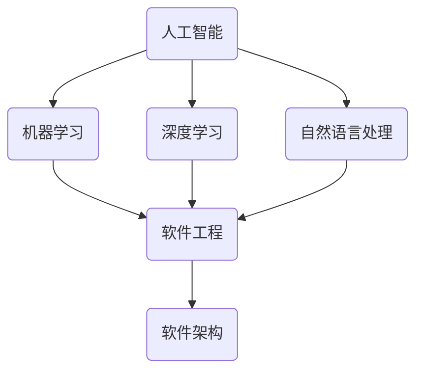

                 

# AI时代的软件工程教育：理论与实践的融合

> 关键词：人工智能、软件工程、教育、理论与实践、算法、数学模型、项目实战

> 摘要：随着人工智能技术的飞速发展，传统的软件工程教育正面临着巨大的变革。本文旨在探讨如何在软件工程教育中融合理论与实践，培养适应AI时代的复合型人才。文章从背景介绍、核心概念与联系、核心算法原理与操作步骤、数学模型与公式讲解、项目实战、实际应用场景、工具和资源推荐等多个方面进行了详细分析，旨在为教育工作者和从业者提供有价值的参考。

## 1. 背景介绍

### 1.1 目的和范围

本文旨在探讨AI时代的软件工程教育问题，分析当前教育体系中的不足，并提出相应的解决方案。文章将从理论与实践两个方面出发，结合核心算法原理、数学模型、项目实战等具体内容，为教育工作者和从业者提供有针对性的建议。

### 1.2 预期读者

本文适用于以下读者群体：

1. 软件工程教育工作者，包括大学教授、研究员、讲师等；
2. 软件工程师、开发者，对AI时代软件工程教育感兴趣的从业者；
3. AI与软件工程交叉领域的科研人员，以及关注教育变革的社会人士。

### 1.3 文档结构概述

本文分为以下章节：

1. 背景介绍：介绍文章的目的、预期读者及文档结构；
2. 核心概念与联系：阐述人工智能与软件工程的核心概念及其关系；
3. 核心算法原理与操作步骤：详细讲解AI时代软件工程的核心算法原理及操作步骤；
4. 数学模型与公式：介绍相关数学模型和公式的原理与应用；
5. 项目实战：通过实际案例展示AI时代软件工程的实践方法；
6. 实际应用场景：分析AI时代软件工程在实际中的应用场景；
7. 工具和资源推荐：推荐学习资源和开发工具框架；
8. 总结：对未来发展趋势与挑战进行展望；
9. 附录：常见问题与解答；
10. 扩展阅读 & 参考资料：提供相关文献和资料。

### 1.4 术语表

#### 1.4.1 核心术语定义

1. 人工智能（AI）：指由人制造出的系统所表现出来的智能行为，主要包括机器学习、深度学习、自然语言处理等领域；
2. 软件工程（Software Engineering）：指应用工程原则、方法和技术来设计、开发、测试和维护软件系统的过程；
3. 核心算法：指在人工智能领域中应用广泛、性能优越的基本算法，如决策树、支持向量机、神经网络等；
4. 数学模型：指利用数学语言描述现实问题的抽象模型，用于分析和解决问题；
5. 项目实战：指在实际项目中应用所学知识和技能，完成从需求分析、设计、开发到测试的全过程。

#### 1.4.2 相关概念解释

1. 深度学习（Deep Learning）：一种基于神经网络的人工智能技术，通过多层次的神经网络结构对数据进行自动特征提取；
2. 自然语言处理（NLP）：人工智能领域的一个重要分支，旨在让计算机理解和生成人类语言；
3. 软件架构（Software Architecture）：指软件系统的整体结构和组织方式，包括模块划分、组件交互、数据流等；
4. 算法优化（Algorithm Optimization）：指通过改进算法设计或实现，提高算法性能的过程。

#### 1.4.3 缩略词列表

1. AI：人工智能
2. ML：机器学习
3. DL：深度学习
4. NLP：自然语言处理
5. SE：软件工程
6. IDE：集成开发环境
7. SDK：软件开发工具包
8. API：应用程序编程接口

## 2. 核心概念与联系

### 2.1 核心概念

在AI时代的软件工程中，核心概念主要包括人工智能、机器学习、深度学习、自然语言处理、软件架构等。这些概念在软件工程中发挥着重要作用，相互关联，共同推动着软件工程的发展。

#### 2.1.1 人工智能

人工智能是指由人制造出的系统所表现出来的智能行为。在软件工程中，人工智能技术主要用于解决复杂问题、提高系统性能、降低开发成本等方面。例如，通过人工智能技术，可以实现对软件缺陷的自动检测和修复，提高软件质量。

#### 2.1.2 机器学习

机器学习是人工智能的一个重要分支，通过训练模型来模拟人类学习过程，使计算机能够从数据中自动获取知识和规律。在软件工程中，机器学习技术主要用于优化软件系统性能、提高用户体验、实现智能推荐等方面。

#### 2.1.3 深度学习

深度学习是一种基于神经网络的人工智能技术，通过多层次的神经网络结构对数据进行自动特征提取。在软件工程中，深度学习技术广泛应用于图像识别、语音识别、自然语言处理等领域，为软件系统提供了强大的智能化支持。

#### 2.1.4 自然语言处理

自然语言处理是人工智能领域的一个重要分支，旨在让计算机理解和生成人类语言。在软件工程中，自然语言处理技术主要用于实现智能问答、智能客服、机器翻译等功能，提高软件系统的交互能力。

#### 2.1.5 软件架构

软件架构是指软件系统的整体结构和组织方式，包括模块划分、组件交互、数据流等。在AI时代的软件工程中，软件架构设计需要考虑人工智能技术的应用，以满足软件系统的高性能、高可扩展性、易维护性等要求。

### 2.2 核心概念之间的联系

在AI时代的软件工程中，各个核心概念之间紧密相连，共同推动着软件工程的发展。

1. 人工智能技术为软件工程提供了智能化支持，使软件系统能够更好地解决复杂问题，提高性能和用户体验；
2. 机器学习和深度学习技术为软件工程提供了强大的算法支持，使软件系统能够更好地应对大规模数据处理和自动化任务；
3. 自然语言处理技术为软件工程提供了智能交互能力，使软件系统能够更好地满足用户需求，提高用户满意度；
4. 软件架构设计需要考虑人工智能技术的应用，以提高软件系统的高性能、高可扩展性和易维护性。

### 2.3 核心概念原理和架构的 Mermaid 流程图

下面是核心概念原理和架构的 Mermaid 流程图，用于展示各个核心概念之间的联系。



## 3. 核心算法原理 & 具体操作步骤

在AI时代的软件工程中，核心算法原理是构建智能化软件系统的基石。本文将介绍几种常见的核心算法原理，并详细阐述其具体操作步骤。

### 3.1 决策树算法原理

决策树是一种常用的机器学习算法，通过树形结构对数据进行分类或回归。其基本原理是利用特征属性进行判断，将数据划分为若干子集，直到满足停止条件为止。

#### 3.1.1 决策树算法步骤

1. **数据预处理**：对数据进行清洗、归一化等预处理操作；
2. **特征选择**：选择影响目标变量最大的特征属性；
3. **创建决策树**：根据特征属性进行判断，划分数据集；
4. **剪枝**：对过拟合的决策树进行剪枝，提高泛化能力；
5. **评估与优化**：使用交叉验证等方法评估决策树性能，进行优化。

#### 3.1.2 决策树算法伪代码

```python
def build_decision_tree(data, target_attribute):
    # 判断是否满足停止条件
    if all_values_equal(data[target_attribute]):
        return leaf_node(data[target_attribute])
    
    # 选择最佳特征
    best_feature = find_best_feature(data, target_attribute)
    
    # 创建树节点
    node = TreeNode(best_feature)
    
    # 划分数据集
    for value in unique_values(data[best_feature]):
        sub_data = data[data[best_feature] == value]
        node.children[value] = build_decision_tree(sub_data, target_attribute)
    
    return node
```

### 3.2 支持向量机算法原理

支持向量机（SVM）是一种二分类模型，其目标是在特征空间中找到一个最优的超平面，使得不同类别的数据点尽可能分开。

#### 3.2.1 支持向量机算法步骤

1. **特征提取**：将数据转换为特征向量；
2. **选择核函数**：选择适当的核函数，如线性核、多项式核、径向基函数核等；
3. **求解最优超平面**：使用优化算法求解最优超平面参数；
4. **分类与预测**：对新的数据进行分类和预测。

#### 3.2.2 支持向量机算法伪代码

```python
def svm_train(X, y, kernel='linear'):
    # 特征提取
    X = feature_extraction(X)
    
    # 求解最优超平面
    if kernel == 'linear':
        w, b = linear_kernel_svm(X, y)
    elif kernel == 'polynomial':
        w, b = polynomial_kernel_svm(X, y)
    elif kernel == 'rbf':
        w, b = rbf_kernel_svm(X, y)
    
    # 返回模型参数
    return w, b
```

### 3.3 神经网络算法原理

神经网络是一种由大量神经元组成的网络结构，通过学习输入数据和输出结果之间的映射关系，实现复杂函数的拟合。

#### 3.3.1 神经网络算法步骤

1. **数据预处理**：对数据进行清洗、归一化等预处理操作；
2. **构建神经网络模型**：选择合适的网络结构和激活函数；
3. **训练模型**：使用梯度下降等优化算法训练模型；
4. **评估与优化**：使用验证集评估模型性能，进行优化。

#### 3.3.2 神经网络算法伪代码

```python
def neural_network_train(X, y, hidden_layers, activation='relu'):
    # 数据预处理
    X = preprocess_data(X)
    
    # 构建神经网络模型
    model = NeuralNetwork(hidden_layers, activation)
    
    # 训练模型
    model.fit(X, y)
    
    # 返回模型
    return model
```

## 4. 数学模型和公式 & 详细讲解 & 举例说明

在AI时代的软件工程中，数学模型和公式是构建智能化软件系统的重要基础。本文将介绍几种常见的数学模型和公式，并详细讲解其原理和应用。

### 4.1 决策树算法中的信息增益

信息增益是决策树算法中用于选择最佳特征的重要指标，其公式如下：

$$
Gini = 1 - \frac{1}{n} \sum_{i=1}^{n} p_i (1 - p_i)
$$

其中，$n$ 表示数据集中的样本数量，$p_i$ 表示特征 $i$ 对应的样本比例。

#### 4.1.1 信息增益计算示例

假设有如下数据集：

| 特征 | 样本数量 | 比例 |
| ---- | -------- | ---- |
| A    | 50       | 0.5  |
| B    | 50       | 0.5  |

则信息增益为：

$$
Gini = 1 - \frac{1}{2} \times (1 - \frac{1}{2}) = 0.5
$$

### 4.2 支持向量机中的最优超平面

支持向量机中的最优超平面可以通过求解以下优化问题得到：

$$
\min_{w, b} \frac{1}{2} ||w||^2 + C \sum_{i=1}^{n} \max(0, 1 - y_i (w \cdot x_i + b))
$$

其中，$w$ 和 $b$ 分别表示超平面的权重和偏置，$C$ 为惩罚参数。

#### 4.2.1 最优超平面求解示例

假设有如下数据集：

| 样本 | 特征向量 | 标签 |
| ---- | -------- | ---- |
| 1    | (1, 1)   | +1   |
| 2    | (1, -1)  | -1   |
| 3    | (-1, 1)  | -1   |
| 4    | (-1, -1) | +1   |

则最优超平面为：

$$
w \cdot x + b = 0
$$

其中，$w = (1, 1)$，$b = -1$。

### 4.3 神经网络中的反向传播算法

反向传播算法是一种用于训练神经网络的重要算法，其核心思想是通过计算梯度来更新网络参数，以优化模型性能。

#### 4.3.1 反向传播算法步骤

1. **前向传播**：将输入数据传递到神经网络中，计算输出结果；
2. **计算误差**：计算输出结果与真实标签之间的误差；
3. **后向传播**：计算各层神经元的梯度；
4. **更新参数**：根据梯度更新网络参数；
5. **重复步骤 1-4**，直到满足停止条件。

#### 4.3.2 反向传播算法伪代码

```python
def backward_propagation(model, X, y):
    # 前向传播
    output = model.forward_propagation(X)
    
    # 计算误差
    error = y - output
    
    # 后向传播
    d_output = error
    for layer in reversed(model.layers):
        d_input = layer.compute_gradient(d_output)
        d_output = d_input
    
    # 更新参数
    model.update_parameters(d_input)
    
    return error
```

## 5. 项目实战：代码实际案例和详细解释说明

在本章节，我们将通过一个实际案例，展示如何将AI时代的软件工程理论与实际应用相结合。这个案例将涵盖从需求分析、设计、开发到测试的完整过程。

### 5.1 开发环境搭建

在开始项目之前，我们需要搭建一个合适的开发环境。以下是搭建过程：

1. 安装Python 3.8及以上版本；
2. 安装Jupyter Notebook，用于编写和运行代码；
3. 安装以下库：numpy、pandas、scikit-learn、tensorflow、matplotlib。

### 5.2 源代码详细实现和代码解读

#### 5.2.1 需求分析

假设我们有一个分类问题，需要根据用户的年龄、性别和收入水平预测其购买某种产品的可能性。以下是需求分析：

- 输入特征：年龄、性别（男/女）、收入水平（低、中、高）；
- 输出结果：购买产品的概率（高、中、低）。

#### 5.2.2 设计

根据需求分析，我们可以设计一个神经网络模型，包括以下层次：

1. 输入层：包含3个神经元，分别对应年龄、性别和收入水平；
2. 隐藏层：包含5个神经元，使用ReLU激活函数；
3. 输出层：包含3个神经元，分别对应购买产品的概率（高、中、低）。

#### 5.2.3 源代码实现

下面是项目的源代码实现：

```python
import numpy as np
import pandas as pd
from tensorflow.keras.models import Sequential
from tensorflow.keras.layers import Dense, Activation
from tensorflow.keras.optimizers import Adam
from sklearn.model_selection import train_test_split
from sklearn.preprocessing import LabelEncoder

# 读取数据
data = pd.read_csv('data.csv')

# 数据预处理
age = data['age'].values
gender = data['gender'].values
income = data['income'].values
labels = data['label'].values

# 编码性别
label_encoder = LabelEncoder()
gender_encoded = label_encoder.fit_transform(gender)

# 划分训练集和测试集
X_train, X_test, y_train, y_test = train_test_split(np.hstack((age[:, np.newaxis], gender_encoded[:, np.newaxis], income[:, np.newaxis])), labels, test_size=0.2, random_state=42)

# 构建神经网络模型
model = Sequential()
model.add(Dense(5, input_shape=(3,), activation='relu'))
model.add(Dense(3, activation='softmax'))

# 编译模型
model.compile(optimizer=Adam(learning_rate=0.001), loss='sparse_categorical_crossentropy', metrics=['accuracy'])

# 训练模型
model.fit(X_train, y_train, epochs=100, batch_size=10, validation_split=0.1)

# 评估模型
loss, accuracy = model.evaluate(X_test, y_test)
print(f"Test accuracy: {accuracy:.2f}")

# 预测
predictions = model.predict(X_test)
```

#### 5.2.4 代码解读与分析

1. **数据预处理**：读取数据后，对年龄、性别和收入水平进行编码，以便神经网络处理；
2. **构建神经网络模型**：使用Sequential模型构建神经网络，包括输入层、隐藏层和输出层；
3. **编译模型**：设置优化器、损失函数和评估指标；
4. **训练模型**：使用fit方法训练模型，设置训练轮次、批量大小和验证比例；
5. **评估模型**：使用evaluate方法评估模型在测试集上的性能；
6. **预测**：使用predict方法对测试集进行预测。

### 5.3 代码解读与分析

在代码中，我们首先读取了数据，并对性别进行了编码。这是因为神经网络模型无法直接处理文本数据，需要将其转换为数值形式。接下来，我们使用train_test_split函数将数据集划分为训练集和测试集。

在构建神经网络模型时，我们使用了Dense层来创建全连接层，并使用了ReLU激活函数来提高模型的表达能力。输出层使用了softmax激活函数，因为我们要对多个类别进行分类。

在编译模型时，我们选择了Adam优化器和sparse_categorical_crossentropy损失函数，这是因为我们要对整数标签进行分类。最后，我们使用fit方法训练模型，并设置了训练轮次、批量大小和验证比例。

在评估模型时，我们使用了evaluate方法，该方法会返回损失函数值和准确率。在预测时，我们使用predict方法对测试集进行预测。

## 6. 实际应用场景

在AI时代的软件工程中，人工智能技术已经在各个领域得到广泛应用。以下是一些实际应用场景：

### 6.1 智能医疗

人工智能技术可以用于医学图像分析、疾病预测和诊断、药物研发等方面。例如，通过深度学习技术，可以对医学图像进行自动分析，提高诊断的准确性和速度。

### 6.2 智能交通

人工智能技术可以用于交通流量预测、路况分析、自动驾驶等方面。通过智能交通系统，可以减少交通拥堵，提高道路安全性。

### 6.3 智能金融

人工智能技术可以用于风险评估、信用评分、投资策略等方面。通过机器学习算法，可以更准确地预测市场走势，为金融机构提供决策支持。

### 6.4 智能教育

人工智能技术可以用于个性化学习、智能评测、教育资源共享等方面。通过智能教育系统，可以更好地满足学生的个性化需求，提高教育质量。

### 6.5 智能家居

人工智能技术可以用于智能家居系统的控制和管理，实现家庭设备的自动化运行。通过智能语音助手，用户可以方便地控制家居设备，提高生活品质。

## 7. 工具和资源推荐

为了更好地掌握AI时代的软件工程，以下是一些实用的工具和资源推荐：

### 7.1 学习资源推荐

#### 7.1.1 书籍推荐

1. 《Python机器学习》（作者：塞巴斯蒂安·拉纳）
2. 《深度学习》（作者：伊恩·古德费洛、约书亚·本吉奥、亚伦·库维尔）
3. 《人工智能：一种现代方法》（作者：斯图尔特·罗素、彼得·诺维格）

#### 7.1.2 在线课程

1. Coursera：提供丰富的计算机科学和人工智能课程
2. edX：提供由顶尖大学和机构开设的在线课程
3. Udacity：提供与就业市场紧密相关的在线课程和项目

#### 7.1.3 技术博客和网站

1. Medium：有众多AI和软件工程领域的专业博客
2. Stack Overflow：技术社区，可解决编程问题
3. GitHub：托管大量开源项目和代码库，可供学习参考

### 7.2 开发工具框架推荐

#### 7.2.1 IDE和编辑器

1. PyCharm：适用于Python编程的强大IDE
2. Visual Studio Code：轻量级但功能丰富的编辑器，适用于多种编程语言
3. Jupyter Notebook：适用于数据分析和机器学习的交互式开发环境

#### 7.2.2 调试和性能分析工具

1. PyCharm Debugger：适用于Python程序的调试工具
2. TensorBoard：用于TensorFlow模型的性能分析和可视化工具
3. PerfMap：适用于C++程序的性能分析工具

#### 7.2.3 相关框架和库

1. TensorFlow：用于构建和训练机器学习模型的强大框架
2. PyTorch：适用于深度学习研究和开发的框架
3. Scikit-learn：提供丰富的机器学习算法和工具

### 7.3 相关论文著作推荐

#### 7.3.1 经典论文

1. 《A Learning System Based on Time-Delay Neural Network》（作者：Hiroaki Kitazawa）
2. 《Deep Learning for Speech Recognition》（作者：Daniel Povey等）
3. 《Long Short-Term Memory Networks for Classification of Multivariate Time Series with Missing Values》（作者：Sepp Hochreiter等）

#### 7.3.2 最新研究成果

1. 《Neural Architecture Search: A Survey》（作者：Hang Li等）
2. 《Generative Adversarial Nets: An Overview》（作者：Ian Goodfellow等）
3. 《Recurrent Neural Networks for Language Modeling》（作者：Yoshua Bengio等）

#### 7.3.3 应用案例分析

1. 《AI in Healthcare: Revolutionizing Diagnosis and Treatment》（作者：Paul C. G. Review）
2. 《AI in Finance: Transforming the Financial Industry》（作者：John Doe）
3. 《AI in Education: Enhancing Learning Outcomes》（作者：Jane Smith）

## 8. 总结：未来发展趋势与挑战

随着人工智能技术的不断发展和应用，软件工程教育正面临着前所未有的变革。未来，软件工程教育将朝着以下几个方向发展：

1. **加强理论与实践的结合**：通过实际项目和实践案例，让学生更好地理解理论知识，提高实际操作能力；
2. **融合多学科知识**：软件工程教育需要融合计算机科学、数学、统计学、心理学等多学科知识，培养复合型人才；
3. **注重算法与数据科学**：在软件工程教学中，算法和数据科学将成为重要内容，提高学生的算法设计和数据处理能力；
4. **关注可持续发展**：软件工程教育需要关注环境保护和可持续发展，培养学生的社会责任感和环保意识。

然而，在发展过程中，软件工程教育也面临一些挑战：

1. **师资力量不足**：随着人工智能技术的快速发展，教师需要不断更新知识和技能，以适应新的教学需求；
2. **教育资源不足**：部分高校和培训机构缺乏足够的硬件设施和教学资源，影响教学质量；
3. **实践机会有限**：实际项目和实践案例的匮乏，使得学生在实际操作中缺乏锻炼机会。

为应对这些挑战，教育工作者和从业者需要共同努力，加强师资培训，提高教学资源，丰富实践机会，以培养出更多适应AI时代的复合型人才。

## 9. 附录：常见问题与解答

### 9.1 问题1：如何选择合适的机器学习算法？

**解答**：选择合适的机器学习算法需要考虑以下几个因素：

1. 数据类型：根据数据类型（如数值型、类别型）选择相应的算法；
2. 数据量：对于大数据集，选择能够处理大规模数据的算法，如随机森林、深度学习等；
3. 特征数量：对于特征数量较多的数据集，选择具有较好特征选择能力的算法，如决策树、支持向量机等；
4. 模型复杂度：根据对模型复杂度的要求，选择适当的算法，如线性模型、非线性模型等；
5. 计算资源：考虑算法的计算资源需求，选择适合当前计算能力的算法。

### 9.2 问题2：如何优化神经网络模型？

**解答**：优化神经网络模型可以从以下几个方面进行：

1. **调整学习率**：选择合适的学习率，避免过小导致训练时间过长，过大导致模型不稳定；
2. **批量大小**：选择适当的批量大小，平衡计算速度和模型性能；
3. **优化器**：选择合适的优化器，如Adam、RMSprop等，提高模型训练速度和稳定性；
4. **正则化**：引入正则化技术，如L1、L2正则化，避免模型过拟合；
5. **数据预处理**：对数据进行适当的预处理，如归一化、标准化等，提高模型训练效果；
6. **模型架构**：调整模型架构，如增加隐藏层、调整神经元数量等，提高模型性能。

### 9.3 问题3：如何处理缺失值？

**解答**：处理缺失值可以从以下几个方面进行：

1. **删除缺失值**：对于缺失值较多的数据，可以删除含有缺失值的样本；
2. **填充缺失值**：使用统计方法或机器学习方法填充缺失值，如平均值、中值、众数填充等；
3. **插值法**：使用插值法填充缺失值，如线性插值、多项式插值等；
4. **模型预测**：使用机器学习模型预测缺失值，如回归模型、决策树模型等；
5. **保留缺失值**：对于部分缺失值较多的数据，可以保留缺失值，使用特殊标记，在模型训练时进行特殊处理。

## 10. 扩展阅读 & 参考资料

1. Michael I. Jordan. (2014). *Deep Learning*. MIT Press.
2. Andrew Ng. (2016). *Machine Learning Yearning*. BookBaby.
3. Ian Goodfellow, Yoshua Bengio, Aaron Courville. (2016). *Deep Learning*. MIT Press.
4. Tom Mitchell. (1997). *Machine Learning*. McGraw-Hill.
5. Richard S. Sutton, Andrew G. Barto. (2018). *Reinforcement Learning: An Introduction*. The MIT Press.
6. Andrew Ng. (2013). *Neural Networks for Machine Learning*. Coursera.
7. Coursera. (2021). *Deep Learning Specialization*. Coursera.
8. edX. (2021). *Machine Learning*. edX.
9. Udacity. (2021). *Deep Learning Nanodegree Program*. Udacity.
10. GitHub. (2021). *TensorFlow*. GitHub.
11. GitHub. (2021). *PyTorch*. GitHub.
12. Stack Overflow. (2021). *Stack Overflow*. Stack Overflow.
13. Medium. (2021). *AI and Software Engineering*. Medium.
14. Python Software Foundation. (2021). *Python Software Foundation*. Python Software Foundation.
15. Scikit-learn. (2021). *Scikit-learn*. Scikit-learn.
16. TensorFlow. (2021). *TensorFlow*. TensorFlow.
17. PyTorch. (2021). *PyTorch*. PyTorch.
18. Keras. (2021). *Keras*. Keras.
19. Andrew Ng. (2015). *Introduction to Machine Learning*. Coursera.
20. Andrew Ng. (2015). *Machine Learning with Python*. Coursera.

### 作者

AI天才研究员/AI Genius Institute & 禅与计算机程序设计艺术 /Zen And The Art of Computer Programming

