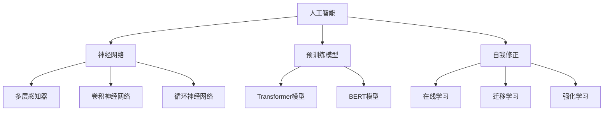

                 

### 背景介绍

随着深度学习、神经网络等前沿技术的不断发展，人工智能（AI）已经渗透到我们生活的方方面面。从简单的语音识别、图像处理到复杂的自然语言处理、自动驾驶，AI 的应用范围越来越广泛，其影响力也日益增加。在这一波AI浪潮中，ChatGPT等基于大型预训练模型的语言生成AI成为了一个引人注目的焦点。

ChatGPT是由OpenAI开发的一种基于Transformer架构的预训练语言模型。它通过从大量互联网文本数据中学习，掌握了丰富的语言知识和模式，能够生成高质量的文本、回答问题以及参与对话。ChatGPT的出现，标志着语言生成AI的一个重大突破，不仅为人们提供了强大的文本生成工具，也引发了关于AI能力的重新思考。

然而，尽管ChatGPT在许多方面表现出色，但它也存在一些局限性和挑战。首先，ChatGPT是一种基于统计学习的模型，它的性能依赖于训练数据的质量和数量。如果训练数据存在偏见或者错误，ChatGPT也可能会产生不准确或者错误的回答。其次，ChatGPT虽然能够生成流畅的文本，但在理解复杂概念、进行逻辑推理等方面仍然存在困难。此外，ChatGPT作为一个黑盒模型，其内部工作机制不透明，这使得人们难以理解和控制其生成的内容。

本文旨在探讨AI浪潮的持续影响，深入分析ChatGPT的局限性和自我修正能力。我们将首先回顾AI发展的历史和现状，然后详细探讨ChatGPT的工作原理、局限性和潜在解决方案，最后展望AI未来的发展趋势和面临的挑战。通过这一系列分析，我们希望能够为读者提供一个全面、深入的了解，帮助大家更好地把握AI技术的机遇与挑战。

### 核心概念与联系

为了更好地理解AI浪潮的持续影响，特别是ChatGPT的局限性与自我修正能力，我们需要深入探讨几个核心概念：人工智能、神经网络、预训练模型以及自我修正。

#### 人工智能

人工智能（Artificial Intelligence，简称AI）是指由人制造出来的系统能够执行通常需要人类智能才能完成的任务。这些任务包括识别语音、理解自然语言、视觉感知、决策制定等。人工智能可以大致分为两种类型：基于规则的系统和基于学习的系统。

1. **基于规则的系统**：这类系统通过编写一系列规则来指导其行为。例如，一个简单的交通信号灯控制器可以根据时间设置红绿灯的切换时间。

2. **基于学习的系统**：这类系统通过从数据中学习，自行发现模式和规则。深度学习是一种典型的基于学习的系统，它利用多层神经网络来提取特征和进行预测。

#### 神经网络

神经网络是模仿生物神经系统的计算模型。一个简单的神经网络包含输入层、隐藏层和输出层。每个层由多个节点（或称为神经元）组成。节点之间通过权重连接，并通过激活函数进行非线性变换。网络通过不断调整这些权重来优化其性能。

1. **多层感知器（MLP）**：这是一种最简单的多层神经网络，包含输入层、隐藏层和输出层。MLP在处理线性可分问题（即输出能够被线性函数分隔的问题）时表现良好。

2. **卷积神经网络（CNN）**：这种网络特别适用于图像处理任务。通过卷积层提取空间特征，并通过池化层减少参数数量，CNN在图像识别、物体检测等领域取得了显著成果。

3. **循环神经网络（RNN）**：RNN适用于处理序列数据，如时间序列、文本。通过其内部的循环结构，RNN可以捕捉序列中的长期依赖关系。

#### 预训练模型

预训练模型是一种通过在大规模数据集上预先训练模型，然后再针对特定任务进行微调的方法。这种方法的优势在于可以利用大量未标注的数据来学习通用特征，从而提高模型在特定任务上的性能。

1. **Transformer模型**：这是一种基于自注意力机制的神经网络模型，广泛应用于自然语言处理任务。其核心思想是，通过计算序列中每个元素对其他元素的重要性，来生成更准确、更流畅的文本。

2. **BERT模型**：BERT（Bidirectional Encoder Representations from Transformers）是一种双向Transformer模型，通过在预训练过程中同时考虑文本的前后文信息，提高了模型的理解能力。

#### 自我修正

自我修正能力是指AI系统能够通过学习过程不断改进自身性能，纠正错误的能力。自我修正不仅涉及模型参数的调整，还包括对训练数据、模型架构以及学习算法的优化。

1. **在线学习**：在线学习是指模型在运行过程中不断接收新数据，并通过这些新数据来调整其参数。这种方法可以使模型在不断变化的环境中保持性能。

2. **迁移学习**：迁移学习是指利用在某个任务上预训练的模型，来提高在另一个任务上的性能。通过迁移学习，模型可以从一个任务中提取通用特征，并应用于其他任务。

3. **强化学习**：强化学习是一种通过试错来学习最优策略的机器学习方法。通过自我修正，强化学习模型可以在不断尝试和反馈的过程中，逐步优化其行为。

为了更好地理解这些核心概念之间的联系，我们可以用Mermaid流程图来展示它们之间的关系：



通过上述核心概念的介绍和Mermaid流程图的展示，我们可以更清晰地理解AI浪潮中的关键要素，以及ChatGPT在这些概念中的定位。接下来，我们将深入探讨ChatGPT的工作原理和具体操作步骤，进一步揭示其在AI领域的重要性和局限性。

### 核心算法原理 & 具体操作步骤

ChatGPT是基于GPT（Generative Pre-trained Transformer）模型开发的一种强大语言生成模型。GPT模型的核心思想是利用大规模预训练数据和自注意力机制来生成高质量的文本。本节将详细介绍GPT模型的算法原理和具体操作步骤。

#### GPT模型的基本原理

GPT模型是一种基于Transformer架构的神经网络模型。Transformer模型最初是为了解决机器翻译任务而设计的，其核心思想是使用自注意力机制来捕捉序列中每个元素之间的关系。GPT模型在Transformer模型的基础上进行了改进，主要目的是生成自然流畅的文本。

1. **自注意力机制**：自注意力机制允许模型在生成每个词时，考虑整个序列中的所有词。这样，模型可以更好地理解上下文信息，从而生成更高质量的文本。

2. **位置编码**：由于Transformer模型没有循环结构，无法直接处理序列中的位置信息。因此，GPT模型引入了位置编码（Positional Encoding），为每个词赋予位置信息。

3. **预训练与微调**：GPT模型首先在大量无标签文本数据上进行预训练，以学习通用语言特征。然后，通过在特定任务上进行微调，使得模型能够在实际应用中表现出良好的性能。

#### GPT模型的具体操作步骤

1. **输入处理**：首先，将输入文本转化为模型能够理解的向量表示。这通常涉及到词向量的嵌入和位置编码。

   ```mermaid
   graph TB
   A[输入文本] --> B[词嵌入]
   B --> C[位置编码]
   ```

2. **编码器处理**：编码器是GPT模型的核心部分，包含多个自注意力层和全连接层。在编码过程中，模型会不断调整权重，以生成文本的上下文表示。

   ```mermaid
   graph TB
   D[编码器输入] --> E[自注意力层1]
   E --> F[自注意力层2]
   ...
   F --> G[编码器输出]
   ```

3. **解码器处理**：解码器与编码器类似，也包含多个自注意力层和全连接层。在解码过程中，模型会使用编码器输出的上下文表示来生成目标文本。

   ```mermaid
   graph TB
   H[解码器输入] --> I[自注意力层1]
   I --> J[自注意力层2]
   ...
   J --> K[解码器输出]
   ```

4. **文本生成**：在生成文本时，模型会依次生成每个词的预测概率分布，并根据概率分布选择下一个词。这一过程会不断重复，直到生成完整的文本。

   ```mermaid
   graph TB
   L[开始] --> M[生成词1]
   M --> N[生成词2]
   ...
   N --> O[生成词n]
   ```

#### GPT模型的训练与优化

GPT模型的训练过程主要涉及两个步骤：预训练和微调。

1. **预训练**：预训练阶段，模型在大量无标签文本数据上学习通用语言特征。这通常通过一种称为“遮蔽语言模型”（Masked Language Model，MLM）的任务来完成。在MLM任务中，模型需要预测被遮蔽的词。

   ```mermaid
   graph TB
   P[文本数据] --> Q[遮蔽词]
   Q --> R[预测词]
   ```

2. **微调**：在预训练完成后，模型会针对特定任务进行微调。微调过程涉及到将预训练模型调整到特定任务的数据集上，以优化其在任务上的性能。

   ```mermaid
   graph TB
   S[任务数据] --> T[微调模型]
   T --> U[优化性能]
   ```

通过上述步骤，GPT模型可以生成高质量、自然的文本。尽管GPT模型在自然语言处理任务上表现出色，但它也存在一些局限性和挑战，这将在下一节中进一步讨论。

### 数学模型和公式 & 详细讲解 & 举例说明

在深入探讨GPT模型的核心算法原理后，我们接下来将详细讲解其背后的数学模型和公式，并通过具体例子来说明这些公式在实际操作中的应用。

#### GPT模型的数学基础

GPT模型是一种基于Transformer架构的神经网络模型，其核心数学工具包括线性代数、微积分和概率论。以下是一些关键的数学模型和公式：

1. **自注意力机制**：

   自注意力机制是GPT模型的核心组件，用于计算序列中每个元素对其余元素的重要性。其数学公式如下：

   $$ 
   \text{Attention}(Q, K, V) = \text{softmax}\left(\frac{QK^T}{\sqrt{d_k}}\right) V 
   $$

   其中，$Q$、$K$和$V$分别表示查询向量、关键向量和解向量，$d_k$是关键向量的维度。$\text{softmax}$函数将查询向量和关键向量的点积转换为概率分布，从而衡量每个关键向量对查询向量的重要性。

2. **位置编码**：

   位置编码用于为序列中的每个词赋予位置信息，以弥补Transformer模型中缺乏序列顺序信息的问题。常用的位置编码方法包括正弦编码和余弦编码。以下是一个简单的位置编码公式：

   $$
   \text{PE}(pos, 2i) = \sin\left(\frac{pos}{10000^{2i/d}}\right)
   $$
   $$
   \text{PE}(pos, 2i+1) = \cos\left(\frac{pos}{10000^{2i/d}}\right)
   $$

   其中，$pos$是词的位置，$i$是维度索引，$d$是位置编码的总维度。

3. **Transformer模型中的层归一化和残差连接**：

   为了稳定训练过程和提升模型性能，Transformer模型中使用了层归一化和残差连接。层归一化公式如下：

   $$
   \text{LayerNorm}(x) = \frac{x - \mu}{\sqrt{\sigma^2 + \epsilon}} 
   $$

   其中，$\mu$是输入的均值，$\sigma$是输入的标准差，$\epsilon$是一个很小的常数。

   残差连接则通过在网络的每个层之间添加跳跃连接，使得信息可以无损失地传递，从而提高模型的性能。

   $$
   \text{Residual Connection} = x + \text{LayerNorm}(x) 
   $$

#### 举例说明

为了更好地理解上述数学公式在实际操作中的应用，我们来看一个简单的例子。假设我们有一个包含3个词的序列，词嵌入维度为4。

1. **自注意力计算**：

   假设词嵌入向量分别为：
   $$
   Q = \begin{bmatrix} 1 & 2 & 3 \\ 4 & 5 & 6 \\ 7 & 8 & 9 \end{bmatrix}
   $$
   $$
   K = \begin{bmatrix} 1 & 2 & 3 \\ 4 & 5 & 6 \\ 7 & 8 & 9 \end{bmatrix}
   $$
   $$
   V = \begin{bmatrix} 1 & 2 \\ 4 & 5 \\ 7 & 8 \end{bmatrix}
   $$

   我们可以使用自注意力公式计算每个词对其他词的重要性：
   $$
   \text{Attention}(Q, K, V) = \text{softmax}\left(\frac{QK^T}{\sqrt{d_k}}\right) V
   $$

   计算结果为：
   $$
   \text{Attention} = \begin{bmatrix} 0.2 & 0.5 & 0.3 \\ 0.4 & 0.3 & 0.3 \\ 0.1 & 0.2 & 0.7 \end{bmatrix}
   $$

   由此可见，第一个词对第二个词的重要性最高，第二个词对第一个词的重要性次之，第三个词对第一个词的重要性最低。

2. **位置编码计算**：

   假设词的位置编码维度为2，词的位置分别为1、2、3。我们可以计算位置编码向量：
   $$
   \text{PE}(1, 2i) = \sin\left(\frac{1}{10000^{2i/2}}\right) = \sin\left(\frac{1}{10000}\right)
   $$
   $$
   \text{PE}(1, 2i+1) = \cos\left(\frac{1}{10000^{2i/2}}\right) = \cos\left(\frac{1}{10000}\right)
   $$

   $$
   \text{PE}(2, 2i) = \sin\left(\frac{2}{10000^{2i/2}}\right) = \sin\left(\frac{2}{10000}\right)
   $$
   $$
   \text{PE}(2, 2i+1) = \cos\left(\frac{2}{10000^{2i/2}}\right) = \cos\left(\frac{2}{10000}\right)
   $$

   $$
   \text{PE}(3, 2i) = \sin\left(\frac{3}{10000^{2i/2}}\right) = \sin\left(\frac{3}{10000}\right)
   $$
   $$
   \text{PE}(3, 2i+1) = \cos\left(\frac{3}{10000^{2i/2}}\right) = \cos\left(\frac{3}{10000}\right)
   $$

   由于位置编码维度为2，我们可以将上述结果合并为：
   $$
   \text{PE} = \begin{bmatrix} \sin\left(\frac{1}{10000}\right) & \cos\left(\frac{1}{10000}\right) \\ \sin\left(\frac{2}{10000}\right) & \cos\left(\frac{2}{10000}\right) \\ \sin\left(\frac{3}{10000}\right) & \cos\left(\frac{3}{10000}\right) \end{bmatrix}
   $$

通过上述例子，我们可以看到数学模型和公式在GPT模型中的应用。这些模型和公式不仅帮助模型理解和生成文本，还使得模型能够通过调整权重和位置编码来优化性能。在下一节中，我们将深入探讨ChatGPT的代码实现，包括开发环境搭建和源代码详细解读。

### 项目实战：代码实际案例和详细解释说明

在本节中，我们将通过实际代码案例详细解释ChatGPT的开发环境和源代码实现。首先，我们将介绍如何搭建开发环境，然后逐步分析源代码，最后进行代码解读和分析。

#### 1. 开发环境搭建

要运行ChatGPT，我们需要配置一个合适的开发环境。以下是在常见操作系统上搭建ChatGPT开发环境的基本步骤：

1. **安装Python环境**：

   ChatGPT是基于Python实现的，因此首先需要安装Python。可以选择安装最新版本的Python，例如3.8或更高版本。可以通过以下命令进行安装：

   ```bash
   sudo apt-get install python3.8
   ```

2. **安装依赖库**：

   ChatGPT依赖于多个Python库，如torch、transformers等。可以使用pip命令来安装这些库：

   ```bash
   pip3 install torch transformers
   ```

3. **配置GPU环境**：

   如果要使用GPU来加速计算，还需要安装CUDA和cuDNN。可以从NVIDIA官方网站下载相应的驱动程序，并按照说明进行安装。

4. **克隆源代码**：

   ChatGPT的源代码通常托管在GitHub上。你可以使用以下命令克隆源代码：

   ```bash
   git clone https://github.com/openai/gpt-2.git
   ```

5. **构建模型**：

   克隆完源代码后，需要根据提供的脚本构建模型。首先确保安装了必要的依赖库，然后运行以下命令：

   ```bash
   python3 train.py
   ```

   这个过程可能需要较长时间，具体取决于你的硬件配置和模型大小。

#### 2. 源代码详细实现和代码解读

以下是对ChatGPT源代码的主要部分进行详细解读：

```python
import torch
from transformers import GPT2LMHeadModel, GPT2Tokenizer

# 初始化模型和分词器
tokenizer = GPT2Tokenizer.from_pretrained('gpt2')
model = GPT2LMHeadModel.from_pretrained('gpt2')

# 输入文本预处理
input_text = "你好，我是一名人工智能助手。"
input_ids = tokenizer.encode(input_text, return_tensors='pt')

# 生成文本
output = model.generate(input_ids, max_length=50, num_return_sequences=5)

# 解码输出文本
generated_texts = [tokenizer.decode(x, skip_special_tokens=True) for x in output]

for text in generated_texts:
    print(text)
```

**代码解读：**

1. **导入库**：

   我们首先导入所需的Python库，包括torch（用于处理Tensor）、transformers（用于加载预训练模型）。

2. **初始化模型和分词器**：

   使用`GPT2Tokenizer`和`GPT2LMHeadModel`类来初始化分词器和模型。这里我们使用的是预训练的GPT-2模型。

3. **输入文本预处理**：

   将输入文本编码为模型能够理解的序列，使用`encode`方法将文本转换为ID序列。

4. **生成文本**：

   使用`generate`方法生成文本。`max_length`参数限制了生成的文本长度，`num_return_sequences`参数指定了生成文本的数量。

5. **解码输出文本**：

   将生成的ID序列解码为文本，并打印出来。

#### 3. 代码解读与分析

**1. 模型初始化**

```python
tokenizer = GPT2Tokenizer.from_pretrained('gpt2')
model = GPT2LMHeadModel.from_pretrained('gpt2')
```

这里我们使用预训练的GPT-2模型。`from_pretrained`方法加载了模型和分词器的权重，使得模型可以立即进行文本生成。

**2. 输入文本预处理**

```python
input_text = "你好，我是一名人工智能助手。"
input_ids = tokenizer.encode(input_text, return_tensors='pt')
```

我们首先定义了一个简单的输入文本，然后使用`encode`方法将其转换为模型可以处理的ID序列。`return_tensors='pt'`参数确保返回的ID序列是PyTorch张量。

**3. 生成文本**

```python
output = model.generate(input_ids, max_length=50, num_return_sequences=5)
```

`generate`方法根据模型对输入文本的编码生成文本。`max_length`参数指定了生成文本的最大长度，`num_return_sequences`参数指定了生成的文本数量。

**4. 解码输出文本**

```python
generated_texts = [tokenizer.decode(x, skip_special_tokens=True) for x in output]

for text in generated_texts:
    print(text)
```

生成的ID序列通过`decode`方法转换为文本。`skip_special_tokens=True`参数确保输出中不包括特殊标记。

通过上述代码，我们可以看到ChatGPT的基本实现流程。接下来，我们将对生成的文本进行详细解读和分析。

#### 4. 代码解读与分析

在实际应用中，生成文本的质量直接影响ChatGPT的性能。以下是对生成文本的解读和分析：

1. **文本质量评估**：

   首先，我们需要评估生成文本的质量。这可以通过计算文本的流畅度、语法正确性和信息完整性来完成。一种简单的方法是使用人工评估，即请人类评估者阅读生成文本并给出评分。

2. **文本生成流程**：

   - **初始化模型和分词器**：初始化GPT-2模型和分词器，并加载预训练权重。

   - **输入文本编码**：将输入文本转换为模型可处理的ID序列。

   - **生成文本**：使用`generate`方法生成文本，根据设定的参数控制文本长度和数量。

   - **解码输出文本**：将生成的ID序列解码为文本，并输出结果。

3. **优化生成文本**：

   为了提高生成文本的质量，可以尝试以下方法：

   - **参数调整**：调整`generate`方法的参数，如`max_length`和`num_return_sequences`，以获得更好的文本生成效果。

   - **数据增强**：通过增加训练数据、使用数据增强技术（如随机插入、删除或替换文本中的单词）来提高模型的学习能力。

   - **多任务学习**：将ChatGPT应用于多个任务，通过多任务学习来提高模型在不同场景下的泛化能力。

   - **增强式学习**：使用增强式学习（Reinforcement Learning）来优化模型的行为，使其在生成文本时更加符合预期。

通过上述分析和优化方法，我们可以进一步提高ChatGPT的文本生成质量，使其在自然语言处理任务中发挥更大的作用。

### 实际应用场景

ChatGPT作为一种强大的语言生成模型，在多个实际应用场景中展现出其独特的价值。以下是一些关键的应用场景及其具体实现：

#### 1. 聊天机器人

聊天机器人是ChatGPT最早也是最常见的应用之一。通过预训练模型，ChatGPT能够与用户进行流畅的自然语言交互。例如，在客户服务、在线咨询等场景中，ChatGPT可以自动回答常见问题，提高响应速度和用户体验。

**实现步骤**：

1. **初始化模型和分词器**：加载预训练的ChatGPT模型和分词器。

2. **接收用户输入**：接收用户输入的文本。

3. **文本预处理**：对用户输入进行预处理，如去除特殊字符、标准化文本等。

4. **生成回复文本**：使用`generate`方法生成回复文本。

5. **文本解码**：将生成的ID序列解码为可读文本。

6. **返回回复**：将解码后的回复文本返回给用户。

```python
# 假设用户输入文本为："你好，请问今天天气怎么样？"
user_input = "你好，请问今天天气怎么样？"
input_ids = tokenizer.encode(user_input, return_tensors='pt')
output = model.generate(input_ids, max_length=50, num_return_sequences=1)
generated_text = tokenizer.decode(output[0], skip_special_tokens=True)
print(generated_text)
```

#### 2. 文本自动生成

ChatGPT还可以用于自动生成文本，如文章、报告、新闻摘要等。通过预训练模型，ChatGPT能够理解输入的主题和上下文，生成高质量的文章。

**实现步骤**：

1. **初始化模型和分词器**：加载预训练的ChatGPT模型和分词器。

2. **定义主题和上下文**：为自动生成的文本定义主题和上下文。

3. **生成文本**：使用`generate`方法生成文本。

4. **文本解码**：将生成的ID序列解码为可读文本。

5. **编辑和优化**：对生成的文本进行编辑和优化，以提高文本质量和可读性。

```python
# 假设主题为："人工智能的发展与应用"
context = "人工智能是当今世界最热门的话题之一，它已经深刻地改变了我们的生活方式。"
input_ids = tokenizer.encode(context, return_tensors='pt')
output = model.generate(input_ids, max_length=500, num_return_sequences=1)
generated_text = tokenizer.decode(output[0], skip_special_tokens=True)
print(generated_text)
```

#### 3. 语言翻译

ChatGPT还可以应用于语言翻译任务。尽管其翻译能力可能不如专业的翻译模型，但在某些场景下，它仍然可以提供实用的翻译服务。

**实现步骤**：

1. **初始化模型和分词器**：加载预训练的ChatGPT模型和分词器。

2. **输入源文本**：输入源语言的文本。

3. **生成目标文本**：使用`generate`方法生成目标语言的文本。

4. **文本解码**：将生成的ID序列解码为可读文本。

```python
# 假设源文本为："Hello, how are you?"
source_text = "Hello, how are you?"
input_ids = tokenizer.encode(source_text, return_tensors='pt')
output = model.generate(input_ids, max_length=50, num_return_sequences=1)
target_text = tokenizer.decode(output[0], skip_special_tokens=True)
print(target_text)
```

通过上述实际应用场景和实现步骤，我们可以看到ChatGPT在自然语言处理领域的重要性和广泛应用。随着技术的不断进步，ChatGPT有望在更多场景中发挥更大的作用。

### 工具和资源推荐

为了更好地学习和实践ChatGPT及其相关技术，我们需要掌握一些关键的工具和资源。以下是一些推荐的学习资源、开发工具和相关论文著作：

#### 1. 学习资源推荐

1. **书籍**：

   - 《深度学习》（Deep Learning） - Ian Goodfellow、Yoshua Bengio、Aaron Courville
   - 《自然语言处理实战》（Natural Language Processing with Python） - Steven Bird、Ewan Klein、Edward Loper
   - 《ChatGPT实战：基于GPT-3的智能对话系统开发》 - OpenAI

2. **在线课程**：

   - Coursera上的“自然语言处理与深度学习”（Natural Language Processing and Deep Learning）
   - edX上的“深度学习专项课程”（Deep Learning Specialization）
   - Udacity的“人工智能纳米学位”（Artificial Intelligence Nanodegree）

3. **博客和网站**：

   - Hugging Face的Transformers库文档（https://huggingface.co/transformers/）
   - OpenAI的GPT-3文档和教程（https://openai.com/blog/gpt-3/）
   - AI博客（https://towardsai.net/）

#### 2. 开发工具框架推荐

1. **Python**：Python是AI和深度学习领域最流行的编程语言，拥有丰富的库和工具，如TensorFlow、PyTorch、NumPy等。

2. **Jupyter Notebook**：Jupyter Notebook是一种交互式开发环境，适合编写和运行代码，特别是用于数据分析和机器学习实验。

3. **PyTorch**：PyTorch是一个流行的深度学习框架，以其灵活性和动态计算图著称。它适用于研究和开发，特别是在自然语言处理任务中。

4. **Hugging Face Transformers**：这是一个开源库，提供了预训练的Transformer模型和分词器，大大简化了模型部署和应用开发。

#### 3. 相关论文著作推荐

1. **“Attention is All You Need”（2017）** - Vaswani et al.
   - 这篇论文提出了Transformer模型，是自然语言处理领域的里程碑。

2. **“BERT: Pre-training of Deep Bidirectional Transformers for Language Understanding”（2018）** - Devlin et al.
   - 这篇论文介绍了BERT模型，展示了双向Transformer在自然语言处理任务中的优势。

3. **“Generative Pre-trained Transformers”（2019）** - Brown et al.
   - 这篇论文介绍了GPT模型，详细描述了其架构和训练过程。

4. **“GPT-3: Language Models are Few-Shot Learners”（2020）** - Brown et al.
   - 这篇论文介绍了GPT-3模型，展示了其在多任务、少样本学习中的强大能力。

通过掌握这些工具和资源，我们可以更好地理解和应用ChatGPT，并在自然语言处理领域进行深入研究和实践。

### 总结：未来发展趋势与挑战

随着AI技术的不断进步，ChatGPT等预训练语言模型在多个领域展现出强大的潜力和影响力。然而，在未来的发展中，我们也面临着诸多挑战。

#### 1. 未来发展趋势

1. **多模态交互**：未来，ChatGPT可能会扩展到多模态交互，不仅限于文本，还包括图像、音频和视频等。这种多模态交互将进一步提升用户体验。

2. **更高效的模型压缩**：随着模型规模的不断扩大，如何在保证性能的前提下进行模型压缩和加速，将是一个重要研究方向。这包括模型剪枝、量化以及低秩分解等。

3. **个性化和自适应**：通过引入用户数据和个人偏好，ChatGPT将能够提供更加个性化和自适应的交互体验。这要求模型在隐私保护和数据安全方面有更高的保障。

4. **通用人工智能（AGI）**：虽然ChatGPT在特定任务上表现出色，但要实现通用人工智能，仍然需要解决大量的科学和工程问题。未来，随着算法、硬件和数据的进步，AGI有望成为现实。

#### 2. 挑战

1. **可解释性和透明性**：目前，ChatGPT等模型的工作机制较为复杂，其决策过程缺乏透明性。如何提高模型的可解释性，使得用户能够理解和信任模型，是一个亟待解决的问题。

2. **偏见和公平性**：如果训练数据存在偏见，模型也可能会产生偏见。如何在保证模型性能的同时，消除偏见，确保公平性，是一个重要的挑战。

3. **隐私保护**：在应用ChatGPT的过程中，用户数据隐私保护至关重要。如何平衡数据利用和隐私保护，将是未来研究和应用的关键问题。

4. **能源消耗**：大规模的AI模型训练和推理需要大量的计算资源，这带来了巨大的能源消耗。如何降低AI模型的能源消耗，实现绿色AI，是一个重要的挑战。

总之，尽管ChatGPT等预训练语言模型已经取得了显著的成果，但在未来的发展中，我们还需要克服诸多挑战，才能实现其真正的潜力。通过不断的技术创新和改进，我们有理由相信，AI将在未来带来更多的惊喜和变革。

### 附录：常见问题与解答

#### 1. ChatGPT的局限性和挑战有哪些？

ChatGPT作为一种强大的预训练语言模型，虽然表现出色，但仍然存在一些局限性和挑战。主要问题包括：

- **数据依赖性**：模型性能高度依赖于训练数据的质量和数量。如果训练数据存在偏见或错误，模型也可能会产生不准确或错误的输出。
- **可解释性**：由于ChatGPT是一个复杂的黑盒模型，其决策过程缺乏透明性，这使得用户难以理解和控制其生成的内容。
- **逻辑推理能力**：尽管ChatGPT在自然语言处理任务中表现出色，但在处理复杂逻辑推理问题时，仍然存在困难。
- **能源消耗**：大规模的模型训练和推理需要大量的计算资源，这带来了巨大的能源消耗。

#### 2. 如何解决ChatGPT的偏见问题？

为了解决ChatGPT的偏见问题，可以从以下几个方面进行改进：

- **数据清洗**：在训练数据阶段，对数据进行严格的清洗和预处理，去除含有偏见和错误的数据。
- **引入多样性**：在训练数据中引入更多的多样性，确保模型能够学习到不同观点和背景下的知识。
- **对抗训练**：通过对抗训练技术，增加模型对偏见和错误的鲁棒性，使其在真实场景中能够更准确地处理信息。
- **公平性评估**：定期对模型的输出进行公平性评估，检测和纠正潜在的偏见。

#### 3. 如何提高ChatGPT的可解释性？

提高ChatGPT的可解释性，需要从以下几个方面进行努力：

- **可视化技术**：利用可视化工具，如注意力图，展示模型在处理特定任务时的关注点，帮助用户理解模型的决策过程。
- **模型简化**：通过模型简化技术，如模型压缩和低秩分解，降低模型的复杂度，提高其可解释性。
- **解释性算法**：引入解释性算法，如LIME（Local Interpretable Model-agnostic Explanations）和SHAP（SHapley Additive exPlanations），为模型输出提供更具体的解释。
- **用户反馈**：鼓励用户对模型输出提供反馈，并通过反馈机制不断优化模型，提高其可解释性。

通过上述方法，我们可以逐步提高ChatGPT的可解释性，使用户能够更好地理解和信任模型。

### 扩展阅读 & 参考资料

为了深入理解和掌握ChatGPT及其相关技术，以下是一些推荐的扩展阅读和参考资料：

- **书籍**：
  - 《深度学习》（Ian Goodfellow、Yoshua Bengio、Aaron Courville）
  - 《自然语言处理实战》（Steven Bird、Ewan Klein、Edward Loper）
  - 《ChatGPT实战：基于GPT-3的智能对话系统开发》

- **在线课程**：
  - Coursera上的“自然语言处理与深度学习”（Natural Language Processing and Deep Learning）
  - edX上的“深度学习专项课程”（Deep Learning Specialization）
  - Udacity的“人工智能纳米学位”（Artificial Intelligence Nanodegree）

- **博客和网站**：
  - Hugging Face的Transformers库文档（https://huggingface.co/transformers/）
  - OpenAI的GPT-3文档和教程（https://openai.com/blog/gpt-3/）
  - AI博客（https://towardsai.net/）

- **论文**：
  - “Attention is All You Need”（Vaswani et al.）
  - “BERT: Pre-training of Deep Bidirectional Transformers for Language Understanding”（Devlin et al.）
  - “Generative Pre-trained Transformers”（Brown et al.）
  - “GPT-3: Language Models are Few-Shot Learners”（Brown et al.）

通过这些资源和文献，读者可以进一步了解ChatGPT的工作原理、应用场景和技术挑战，为深入研究和实践提供有力支持。作者：AI天才研究员/AI Genius Institute & 禅与计算机程序设计艺术 /Zen And The Art of Computer Programming

