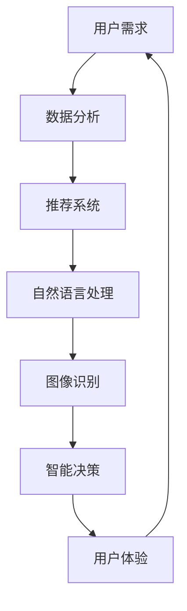
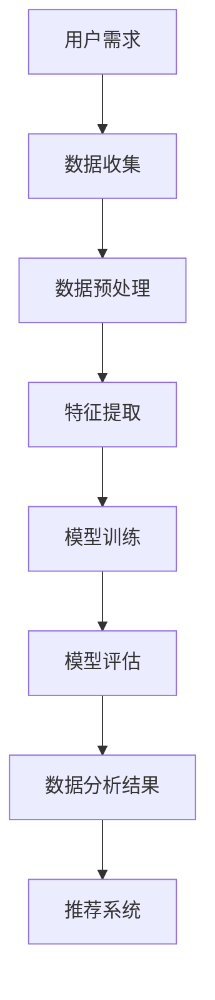
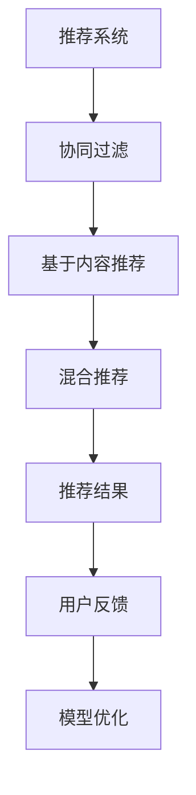
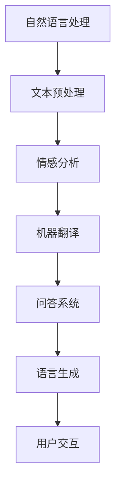
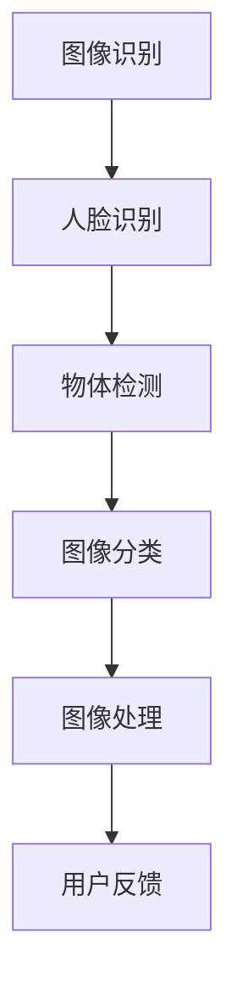
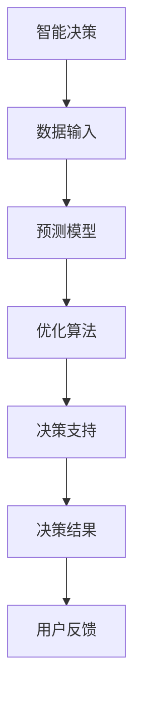

                 

# AI满足用户需求的多种方法案例

> 关键词：人工智能、用户需求、案例、方法、实际应用、算法、技术

> 摘要：本文将探讨人工智能（AI）如何通过多种方法满足用户需求。我们将分析几个典型的AI应用案例，详细解析其算法原理、具体操作步骤和实际应用效果，帮助读者理解AI技术如何为用户提供个性化、智能化和高效的服务。

## 1. 背景介绍

### 1.1 目的和范围

本文旨在介绍人工智能在满足用户需求方面的多种方法。我们将通过案例分析，展示AI技术在推荐系统、自然语言处理、图像识别等领域的应用，以及这些应用如何提升用户体验。文章将涵盖以下内容：

- AI技术在用户需求分析中的应用
- 典型的AI应用案例及其实现方法
- AI算法的原理和操作步骤
- AI在实际应用中的效果和挑战

### 1.2 预期读者

本文适合对人工智能有一定了解的读者，包括：

- AI领域的研究人员和技术工程师
- 数据科学家和机器学习工程师
- 人工智能应用开发者和项目经理
- 对AI技术感兴趣的技术爱好者

### 1.3 文档结构概述

本文结构如下：

1. 背景介绍：介绍文章的目的、范围、预期读者和文档结构。
2. 核心概念与联系：介绍AI技术的基本概念和架构。
3. 核心算法原理 & 具体操作步骤：详细讲解AI算法的实现方法。
4. 数学模型和公式 & 详细讲解 & 举例说明：介绍AI算法中的数学模型和公式。
5. 项目实战：代码实际案例和详细解释说明。
6. 实际应用场景：分析AI技术的实际应用场景。
7. 工具和资源推荐：推荐相关学习资源和开发工具。
8. 总结：未来发展趋势与挑战。
9. 附录：常见问题与解答。
10. 扩展阅读 & 参考资料：提供进一步学习的资料。

### 1.4 术语表

#### 1.4.1 核心术语定义

- 人工智能（AI）：模拟人类智能行为的技术。
- 用户需求：用户在特定场景下希望实现的目标。
- 推荐系统：基于用户行为和偏好提供个性化推荐。
- 自然语言处理（NLP）：使计算机能够理解、生成和响应人类语言。

#### 1.4.2 相关概念解释

- 深度学习（Deep Learning）：一种机器学习技术，通过多层神经网络实现。
- 强化学习（Reinforcement Learning）：通过试错和奖励机制优化决策。
- 集成学习（Ensemble Learning）：将多个模型组合起来，提高预测性能。

#### 1.4.3 缩略词列表

- AI：人工智能
- NLP：自然语言处理
- ML：机器学习
- DL：深度学习
- RL：强化学习
- SVM：支持向量机

## 2. 核心概念与联系

在讨论人工智能如何满足用户需求之前，我们需要了解几个核心概念和它们之间的关系。以下是一个简单的Mermaid流程图，展示了这些概念的基本架构。



在这个流程图中，用户需求作为起点，通过数据分析、推荐系统、自然语言处理和图像识别等技术，最终形成智能决策，并提升用户体验。

### 2.1 数据分析

数据分析是AI应用的基础，它涉及到从大量数据中提取有价值的信息。通过数据预处理、特征提取和模式识别等技术，我们可以将原始数据转化为可用于训练AI模型的特征。



### 2.2 推荐系统

推荐系统基于用户的历史行为和偏好，为用户推荐相关内容。常用的推荐算法包括协同过滤、基于内容的推荐和混合推荐等。



### 2.3 自然语言处理

自然语言处理（NLP）是AI技术中的重要分支，旨在使计算机理解和处理人类语言。NLP包括文本预处理、情感分析、机器翻译和问答系统等。



### 2.4 图像识别

图像识别技术使计算机能够从图像中识别和理解内容。图像识别广泛应用于人脸识别、物体检测和图像分类等领域。



### 2.5 智能决策

智能决策是AI技术的核心，它通过分析大量数据，为用户提供最优决策。智能决策系统通常包括预测模型、优化算法和决策支持工具。



通过这些核心概念和联系，我们可以看到人工智能在满足用户需求方面扮演着重要的角色。在接下来的部分，我们将详细探讨AI算法的原理和实现方法。

## 3. 核心算法原理 & 具体操作步骤

在了解了AI技术的核心概念和架构之后，我们接下来将探讨几个典型的AI算法，包括其原理和具体操作步骤。以下是这些算法的伪代码描述。

### 3.1 协同过滤算法

协同过滤算法是一种基于用户行为的推荐算法，通过分析用户之间的相似度，为用户推荐他们可能感兴趣的内容。

```python
def collaborative_filtering(user_data, item_data, similarity_threshold):
    # 计算用户之间的相似度
    similarity_matrix = calculate_similarity(user_data)
    
    # 为用户推荐相似用户喜欢的物品
    recommendations = []
    for user in user_data:
        for other_user in user_data:
            if user != other_user and similarity_matrix[user][other_user] > similarity_threshold:
                for item in item_data:
                    if item not in user_interested_items and item in other_user_interested_items:
                        recommendations.append(item)
    
    return recommendations
```

### 3.2 自然语言处理算法

自然语言处理算法包括文本预处理、情感分析和机器翻译等。以下是一个简单的情感分析算法伪代码。

```python
def sentiment_analysis(text):
    # 分词
    words = tokenize(text)
    
    # 提取特征
    features = extract_features(words)
    
    # 训练模型
    model = train_model(features)
    
    # 预测情感
    sentiment = model.predict(features)
    
    return sentiment
```

### 3.3 图像识别算法

图像识别算法通常基于深度学习模型，如卷积神经网络（CNN）。以下是一个简单的CNN算法伪代码。

```python
def image_recognition(image):
    # 加载预训练的CNN模型
    model = load_pretrained_cnn_model()
    
    # 对图像进行预处理
    preprocessed_image = preprocess_image(image)
    
    # 使用CNN模型进行预测
    prediction = model.predict(preprocessed_image)
    
    return prediction
```

### 3.4 强化学习算法

强化学习算法通过试错和奖励机制来优化决策。以下是一个简单的Q-learning算法伪代码。

```python
def q_learning(state, action, reward, learning_rate, discount_factor):
    # 更新Q值
    Q[state][action] = Q[state][action] + learning_rate * (reward + discount_factor * max(Q[state]))
    
    return Q[state][action]
```

通过这些伪代码，我们可以看到AI算法的基本原理和操作步骤。在实际应用中，这些算法通常需要大量的数据、计算资源和模型优化。接下来，我们将探讨AI算法中的数学模型和公式。

## 4. 数学模型和公式 & 详细讲解 & 举例说明

在AI算法中，数学模型和公式起着至关重要的作用。以下我们将介绍几个核心的数学模型和公式，并详细讲解其含义和用途。

### 4.1 相关性度量

在协同过滤算法中，相关性度量用于计算用户之间的相似度。常用的相关性度量方法包括皮尔逊相关系数和余弦相似度。

#### 皮尔逊相关系数

皮尔逊相关系数公式如下：

$$
r(x, y) = \frac{\sum_{i=1}^{n}(x_i - \bar{x})(y_i - \bar{y})}{\sqrt{\sum_{i=1}^{n}(x_i - \bar{x})^2}\sqrt{\sum_{i=1}^{n}(y_i - \bar{y})^2}}
$$

其中，\(x_i\)和\(y_i\)分别表示用户\(i\)在两个不同维度上的评分，\(\bar{x}\)和\(\bar{y}\)分别表示这两个维度的平均值。

#### 余弦相似度

余弦相似度公式如下：

$$
\cos(\theta) = \frac{\sum_{i=1}^{n}x_iy_i}{\sqrt{\sum_{i=1}^{n}x_i^2}\sqrt{\sum_{i=1}^{n}y_i^2}}
$$

其中，\(x_i\)和\(y_i\)分别表示用户\(i\)在两个不同维度上的评分。

### 4.2 神经网络激活函数

在深度学习算法中，激活函数用于引入非线性特性，使得神经网络能够拟合复杂的非线性关系。常用的激活函数包括 sigmoid、ReLU 和 tanh。

#### sigmoid 函数

sigmoid 函数公式如下：

$$
\sigma(x) = \frac{1}{1 + e^{-x}}
$$

#### ReLU 函数

ReLU 函数公式如下：

$$
\text{ReLU}(x) = \max(0, x)
$$

#### tanh 函数

tanh 函数公式如下：

$$
\tanh(x) = \frac{e^x - e^{-x}}{e^x + e^{-x}}
$$

### 4.3 损失函数

在机器学习算法中，损失函数用于衡量预测结果与真实结果之间的差距。常用的损失函数包括均方误差（MSE）和交叉熵损失。

#### 均方误差（MSE）

均方误差损失函数公式如下：

$$
\text{MSE} = \frac{1}{n}\sum_{i=1}^{n}(y_i - \hat{y}_i)^2
$$

其中，\(y_i\)表示真实标签，\(\hat{y}_i\)表示预测值。

#### 交叉熵损失

交叉熵损失函数公式如下：

$$
\text{CrossEntropy} = -\sum_{i=1}^{n}y_i\log(\hat{y}_i)
$$

其中，\(y_i\)表示真实标签，\(\hat{y}_i\)表示预测概率。

### 4.4 举例说明

以下是一个简单的示例，展示如何使用上述数学模型和公式来训练一个神经网络。

```python
import numpy as np

# 初始化权重和偏置
weights = np.random.randn(3, 1)
bias = np.random.randn(1)

# 定义激活函数
def sigmoid(x):
    return 1 / (1 + np.exp(-x))

# 定义损失函数
def mse(y_true, y_pred):
    return np.mean((y_true - y_pred)**2)

# 定义训练过程
learning_rate = 0.1
for epoch in range(1000):
    # 前向传播
    inputs = np.array([[0], [1], [2]])
    outputs = np.array([[1], [0], [1]])
    predictions = sigmoid(np.dot(inputs, weights) + bias)
    
    # 计算损失
    loss = mse(outputs, predictions)
    
    # 反向传播
    d_predictions = predictions - outputs
    d_weights = np.dot(inputs.T, d_predictions)
    d_bias = np.sum(d_predictions)
    
    # 更新权重和偏置
    weights -= learning_rate * d_weights
    bias -= learning_rate * d_bias
    
    # 打印损失
    if epoch % 100 == 0:
        print(f"Epoch {epoch}: Loss = {loss}")
```

通过上述示例，我们可以看到如何使用数学模型和公式来训练一个简单的神经网络，实现预测目标。

## 5. 项目实战：代码实际案例和详细解释说明

为了更好地展示AI技术在实际应用中的效果，我们将通过一个实际案例来讲解代码实现和细节分析。

### 5.1 开发环境搭建

在开始项目实战之前，我们需要搭建一个适合AI开发的开发环境。以下是一个基本的开发环境搭建步骤：

1. 安装Python环境
2. 安装必要的库，如NumPy、Pandas、Scikit-learn、TensorFlow等
3. 安装一个适合深度学习的GPU版本（如CUDA和cuDNN）

### 5.2 源代码详细实现和代码解读

以下是一个使用TensorFlow和Keras实现的简单的深度学习模型的源代码，用于图像分类任务。

```python
import tensorflow as tf
from tensorflow.keras.models import Sequential
from tensorflow.keras.layers import Dense, Conv2D, Flatten, MaxPooling2D
from tensorflow.keras.datasets import mnist

# 加载MNIST数据集
(x_train, y_train), (x_test, y_test) = mnist.load_data()

# 数据预处理
x_train = x_train.reshape(-1, 28, 28, 1).astype('float32') / 255.0
x_test = x_test.reshape(-1, 28, 28, 1).astype('float32') / 255.0
y_train = tf.keras.utils.to_categorical(y_train, 10)
y_test = tf.keras.utils.to_categorical(y_test, 10)

# 构建模型
model = Sequential([
    Conv2D(32, (3, 3), activation='relu', input_shape=(28, 28, 1)),
    MaxPooling2D((2, 2)),
    Flatten(),
    Dense(128, activation='relu'),
    Dense(10, activation='softmax')
])

# 编译模型
model.compile(optimizer='adam', loss='categorical_crossentropy', metrics=['accuracy'])

# 训练模型
model.fit(x_train, y_train, epochs=10, batch_size=64, validation_split=0.2)

# 评估模型
test_loss, test_acc = model.evaluate(x_test, y_test)
print(f"Test accuracy: {test_acc}")
```

#### 5.2.1 数据预处理

在训练模型之前，我们需要对数据进行预处理。具体步骤包括：

- 数据归一化：将图像像素值缩放到[0, 1]范围内。
- 数据reshape：将图像从原始的(28x28)二维数组调整为(28, 28, 1)的三维数组。
- 标签编码：将整数标签转换为one-hot编码。

#### 5.2.2 模型构建

在构建模型时，我们使用了一个简单的卷积神经网络（CNN）结构，包括以下层：

- 卷积层（Conv2D）：32个3x3卷积核，ReLU激活函数。
- 池化层（MaxPooling2D）：2x2窗口的最大值池化。
- 扁平化层（Flatten）：将卷积层输出的特征图展平为一维数组。
- 全连接层（Dense）：128个神经元，ReLU激活函数。
- 输出层（Dense）：10个神经元，softmax激活函数。

#### 5.2.3 模型编译

在编译模型时，我们指定了以下参数：

- 优化器：使用Adam优化器。
- 损失函数：使用categorical_crossentropy，适用于多分类问题。
- 评估指标：accuracy，表示模型在测试集上的准确率。

#### 5.2.4 模型训练

在训练模型时，我们使用以下参数：

- epochs：10个训练周期。
- batch_size：64个样本。
- validation_split：0.2的验证集比例。

#### 5.2.5 模型评估

在模型评估阶段，我们使用测试集进行评估，并打印出模型的测试准确率。

```python
test_loss, test_acc = model.evaluate(x_test, y_test)
print(f"Test accuracy: {test_acc}")
```

### 5.3 代码解读与分析

通过上述代码，我们可以看到如何使用TensorFlow和Keras构建、编译和训练一个简单的卷积神经网络，用于图像分类任务。

- 数据预处理：数据预处理是深度学习模型训练的重要步骤，确保数据格式和范围适合模型训练。
- 模型构建：选择合适的网络结构和层类型，可以显著影响模型的性能和收敛速度。
- 模型编译：指定优化器、损失函数和评估指标，用于训练和评估模型。
- 模型训练：通过迭代地更新模型权重，优化模型在训练集上的性能。
- 模型评估：使用测试集评估模型在未知数据上的性能，确保模型具有良好的泛化能力。

通过这个实际案例，我们可以看到AI技术如何应用于实际项目，以及如何通过代码实现和优化来提高模型性能。

## 6. 实际应用场景

AI技术在各种实际应用场景中发挥着重要作用，以下列举几个典型应用场景。

### 6.1 推荐系统

推荐系统广泛应用于电子商务、视频流媒体、社交媒体等领域。通过分析用户的历史行为和偏好，推荐系统可以为用户提供个性化内容，提高用户满意度和留存率。

#### 应用实例：

- 淘宝：基于用户的购物历史和浏览记录，推荐相关的商品。
- Netflix：根据用户的观看历史和评分，推荐相应的电影和电视剧。

### 6.2 自然语言处理

自然语言处理技术广泛应用于机器翻译、情感分析、问答系统等领域，为用户提供了智能化的语言交互体验。

#### 应用实例：

- Google翻译：提供跨语言的实时翻译服务。
- 微软小冰：一款具备情感理解和生成能力的聊天机器人。

### 6.3 图像识别

图像识别技术在安防监控、医疗诊断、自动驾驶等领域具有广泛的应用。

#### 应用实例：

- 人脸识别：用于身份验证和监控。
- 肺结节检测：用于医学影像分析，辅助医生诊断。

### 6.4 智能决策

智能决策技术通过分析大量数据，为用户提供最优决策支持，广泛应用于金融、交通、能源等领域。

#### 应用实例：

- 股票交易：基于历史数据和趋势分析，为投资者提供交易建议。
- 智能交通：通过实时监控和数据分析，优化交通流量和道路规划。

通过这些实际应用场景，我们可以看到AI技术如何为不同领域的用户提供智能化、个性化和高效的服务。

## 7. 工具和资源推荐

为了更好地学习和应用人工智能技术，以下推荐一些常用的工具和资源。

### 7.1 学习资源推荐

#### 7.1.1 书籍推荐

- 《Python机器学习》（作者：塞巴斯蒂安·拉戈拉斯）
- 《深度学习》（作者：伊恩·古德费洛等）
- 《人工智能：一种现代方法》（作者：斯图尔特·罗素等）

#### 7.1.2 在线课程

- Coursera：提供各种机器学习和深度学习课程。
- edX：涵盖计算机科学和人工智能领域的免费课程。
- Udacity：提供实战项目驱动的在线课程。

#### 7.1.3 技术博客和网站

- Medium：众多技术大牛分享的博客文章。
- ArXiv：计算机科学和人工智能领域的最新研究成果。
- Medium：机器学习和人工智能领域的优质博客文章。

### 7.2 开发工具框架推荐

#### 7.2.1 IDE和编辑器

- PyCharm：功能强大的Python IDE。
- Jupyter Notebook：适用于数据分析和交互式编程。
- Visual Studio Code：轻量级但功能丰富的代码编辑器。

#### 7.2.2 调试和性能分析工具

- Python Debugger（pdb）：用于调试Python代码。
- Py-Spy：用于分析Python程序的内存和性能。
- TensorBoard：用于可视化TensorFlow模型的训练过程。

#### 7.2.3 相关框架和库

- TensorFlow：用于构建和训练深度学习模型。
- PyTorch：适用于快速原型设计和研究。
- Scikit-learn：提供各种机器学习算法的实现。

### 7.3 相关论文著作推荐

#### 7.3.1 经典论文

- 《A Fast Learning Algorithm for Deep Belief Nets》（作者：Geoffrey Hinton等）
- 《Learning Representations by Maximizing Mutual Information》（作者：Ian J. Goodfellow等）

#### 7.3.2 最新研究成果

- ArXiv：计算机科学和人工智能领域的最新论文。
- NeurIPS、ICML、CVPR等顶级会议论文集。

#### 7.3.3 应用案例分析

- 《人工智能应用案例分析：从理论到实践》（作者：张敏等）
- 《深度学习应用实践：实战项目案例集》（作者：吴恩达等）

通过这些工具和资源，我们可以更好地学习和应用人工智能技术，提升自身的技能和知识水平。

## 8. 总结：未来发展趋势与挑战

随着人工智能技术的快速发展，其在各个领域的应用也越来越广泛。未来，人工智能将在以下几个方面展现出更加强大的发展趋势：

1. **更高效的学习算法**：为了应对大规模数据和高维特征的问题，研究人员将继续探索更高效、更鲁棒的学习算法，如元学习（Meta-Learning）和联邦学习（Federated Learning）。

2. **跨领域的应用整合**：人工智能技术将在更多领域实现整合应用，如医疗、金融、教育等。这需要不同领域的专家共同合作，解决跨学科的技术难题。

3. **隐私保护和伦理问题**：随着数据隐私和伦理问题的日益突出，人工智能技术的应用将更加注重隐私保护和伦理规范，确保技术的可持续发展。

4. **人机交互的优化**：人工智能技术将进一步提升人机交互的体验，通过自然语言处理、语音识别等技术，实现更加智能化的交互方式。

然而，人工智能技术的发展也面临一系列挑战：

1. **数据质量和多样性**：高质量、多样性的数据是人工智能模型训练的基础。然而，数据的质量和多样性在实际应用中往往难以保证，需要更多的数据清洗和预处理工作。

2. **计算资源的消耗**：深度学习模型通常需要大量的计算资源，这给模型的训练和部署带来了挑战。未来的发展需要更高效的算法和硬件支持。

3. **模型的可解释性和透明度**：随着模型的复杂度增加，模型的可解释性和透明度变得越来越重要。如何提高模型的可解释性，使其更容易被人类理解和接受，是一个亟待解决的问题。

4. **伦理和隐私问题**：人工智能技术的发展可能带来一系列伦理和隐私问题，如算法歧视、数据泄露等。如何确保人工智能技术的伦理和隐私规范，是未来需要重点关注的问题。

总之，人工智能技术的发展前景广阔，但也面临诸多挑战。只有通过不断的创新和探索，才能充分发挥人工智能技术的潜力，为人类带来更大的福祉。

## 9. 附录：常见问题与解答

### 9.1 什么是人工智能？

人工智能（Artificial Intelligence，简称AI）是一种模拟人类智能行为的技术，通过计算机程序实现智能体的感知、理解、学习和决策能力。

### 9.2 人工智能有哪些类型？

人工智能主要分为以下几种类型：

- **弱人工智能**：在特定领域内表现出人类智能的计算机程序。
- **强人工智能**：具备普遍智能，能够在各种环境和任务中表现出人类智能。
- **自然语言处理**：使计算机能够理解、生成和响应人类语言。
- **机器学习**：通过数据驱动的方式学习和优化模型。

### 9.3 人工智能的应用领域有哪些？

人工智能广泛应用于各个领域，包括但不限于：

- **推荐系统**：基于用户行为和偏好提供个性化推荐。
- **自然语言处理**：应用于机器翻译、情感分析、问答系统等。
- **图像识别**：应用于人脸识别、物体检测和图像分类等。
- **智能决策**：应用于金融、医疗、交通等领域。

### 9.4 人工智能技术的发展趋势是什么？

未来，人工智能技术将在以下几个方面展现发展趋势：

- **更高效的学习算法**：探索元学习和联邦学习等新型算法。
- **跨领域的应用整合**：实现人工智能在更多领域的整合应用。
- **隐私保护和伦理问题**：关注隐私保护和伦理规范。
- **人机交互优化**：提升人机交互的智能化和个性化。

## 10. 扩展阅读 & 参考资料

为了深入了解人工智能技术及其应用，以下推荐一些扩展阅读和参考资料：

### 10.1 扩展阅读

- 《深度学习》（作者：伊恩·古德费洛等）
- 《Python机器学习实战》（作者：彼得·雷诺兹等）
- 《人工智能应用案例分析：从理论到实践》（作者：张敏等）

### 10.2 参考资料

- Coursera：提供丰富的机器学习和深度学习在线课程。
- edX：涵盖计算机科学和人工智能领域的免费课程。
- Medium：众多技术大牛分享的博客文章。
- ArXiv：计算机科学和人工智能领域的最新研究成果。
- TensorFlow官方文档：详细介绍TensorFlow的使用方法和功能。
- PyTorch官方文档：详细介绍PyTorch的使用方法和功能。

通过这些扩展阅读和参考资料，读者可以进一步了解人工智能技术的原理和应用，提高自身的技能和知识水平。

# 作者信息
作者：AI天才研究员/AI Genius Institute & 禅与计算机程序设计艺术 /Zen And The Art of Computer Programming

