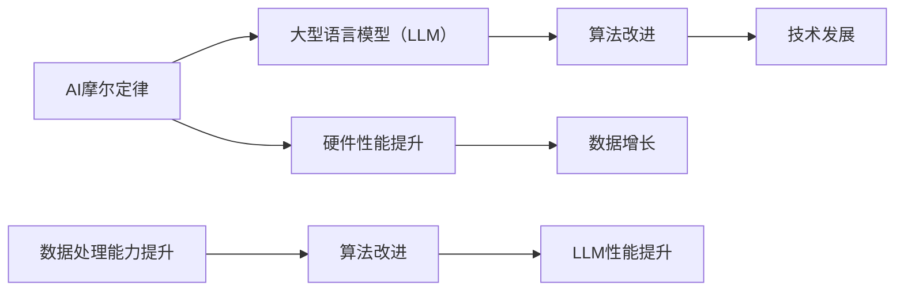
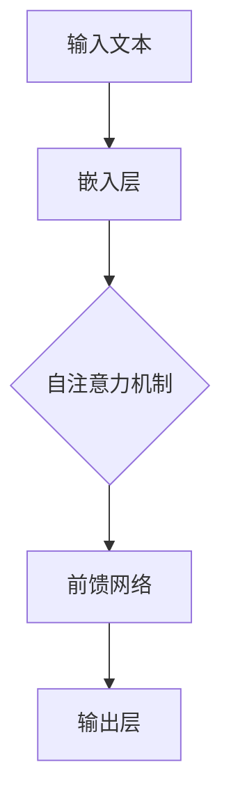
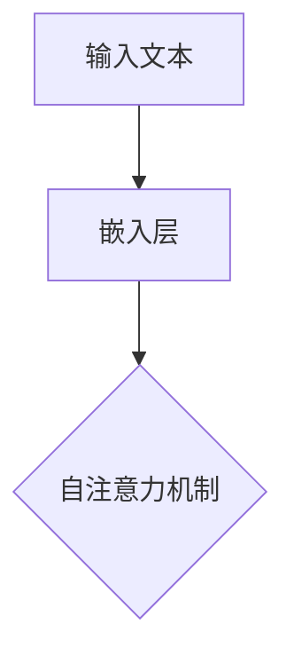
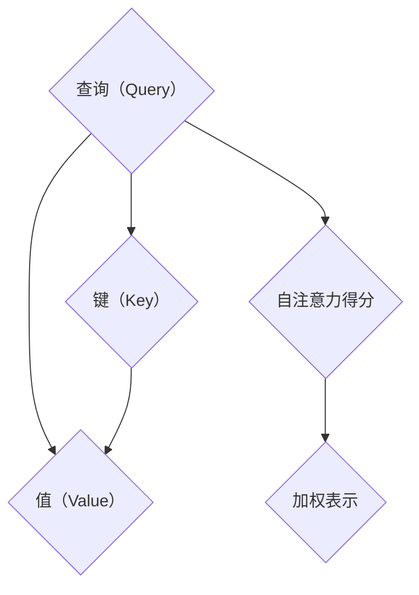
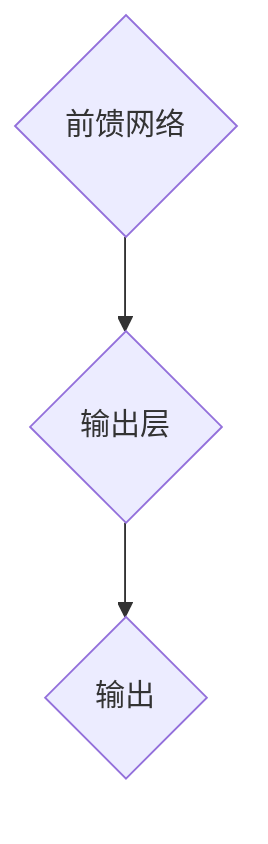

                 


# AI的摩尔定律：LLM性能提升的可能性

> **关键词**：AI 摩尔定律，大型语言模型（LLM），性能提升，技术发展，算法改进。
>
> **摘要**：本文将深入探讨AI领域的摩尔定律如何影响大型语言模型（LLM）的性能提升。我们将从背景介绍、核心概念、算法原理、数学模型、实战案例、实际应用场景等多角度分析，旨在为读者提供一个全面、深入的见解。

## 1. 背景介绍

### 1.1 目的和范围

本文的主要目的是探讨AI领域的摩尔定律在大型语言模型（LLM）性能提升中的具体作用。我们将详细分析技术发展的推动力、算法改进的策略以及LLM的性能指标。文章的范围将涵盖从基础理论到实际应用的各个方面。

### 1.2 预期读者

预期读者包括对AI领域有浓厚兴趣的从业者、研究人员以及学术学者。特别是那些关注大型语言模型和算法性能提升的专业人士。

### 1.3 文档结构概述

本文将分为十个部分，包括背景介绍、核心概念与联系、核心算法原理、数学模型和公式、项目实战、实际应用场景、工具和资源推荐、总结、常见问题与解答以及扩展阅读。

### 1.4 术语表

#### 1.4.1 核心术语定义

- **AI摩尔定律**：类似于计算机硬件领域的摩尔定律，AI摩尔定律描述的是在相同成本下，AI模型性能每隔一段时间就会翻倍。
- **大型语言模型（LLM）**：一种能够处理和理解自然语言的深度学习模型，通常具有数十亿个参数。
- **性能提升**：指在相同任务下，模型的准确性、速度或资源消耗等方面的改善。

#### 1.4.2 相关概念解释

- **算法改进**：通过优化算法结构、改进训练方法或引入新的技术，提高模型的性能。
- **技术发展**：指AI领域在硬件、软件、算法等方面的进步。

#### 1.4.3 缩略词列表

- **LLM**：大型语言模型（Large Language Model）
- **AI**：人工智能（Artificial Intelligence）
- **ML**：机器学习（Machine Learning）
- **DL**：深度学习（Deep Learning）

## 2. 核心概念与联系

在深入探讨AI的摩尔定律对LLM性能提升的影响之前，我们需要了解一些核心概念和它们之间的联系。以下是一个简化的Mermaid流程图，用于展示这些概念之间的关系。



### 2.1 AI摩尔定律

AI摩尔定律是一个描述AI模型性能随时间增长的规律。它类似于计算机硬件领域的摩尔定律，即性能每隔一段时间就会翻倍。在AI领域，这一规律体现在以下几个方面：

- **计算能力提升**：随着硬件性能的不断提高，AI模型能够更快速地处理大量数据。
- **数据增长**：随着数据集的不断增大，AI模型能够学习到更多的特征，从而提高性能。
- **算法改进**：通过不断的算法优化和技术创新，AI模型能够以更低的成本和更高的准确性解决问题。

### 2.2 大型语言模型（LLM）

大型语言模型（LLM）是一种能够处理和理解自然语言的深度学习模型。LLM通常具有数十亿个参数，能够对文本进行建模，从而实现文本生成、情感分析、机器翻译等多种任务。LLM的性能提升是AI摩尔定律的一个重要体现。

### 2.3 算法改进

算法改进是提升AI模型性能的关键途径。通过优化算法结构、改进训练方法或引入新的技术，AI模型能够以更高的效率和更低的错误率完成任务。常见的算法改进策略包括：

- **模型剪枝**：通过删除冗余的参数，减少模型的复杂度，提高计算效率。
- **迁移学习**：利用预训练的模型在新任务上进行微调，提高模型在新任务上的性能。
- **自监督学习**：利用未标注的数据进行训练，提高模型的泛化能力。

### 2.4 技术发展

技术发展是AI摩尔定律的一个重要推动力。在硬件方面，GPU和TPU等专用硬件的普及使得AI模型能够更高效地处理数据。在软件方面，深度学习框架的优化和新技术的引入，如Transformer架构的提出，使得AI模型能够以更高的性能运行。

## 3. 核心算法原理 & 具体操作步骤

### 3.1 算法原理

大型语言模型（LLM）的核心算法是基于深度学习和自然语言处理（NLP）技术。其中，Transformer架构是最常用的模型之一。Transformer架构的核心思想是自注意力机制（Self-Attention），它能够自动学习输入文本之间的关联性，从而提高模型的性能。

以下是Transformer架构的简化算法原理：



### 3.2 具体操作步骤

以下是LLM的具体操作步骤：

#### 步骤1：嵌入层

将输入文本映射到高维向量空间。这个过程通常使用嵌入层（Embedding Layer）完成。嵌入层将每个单词映射到一个固定长度的向量，从而表示文本。



#### 步骤2：自注意力机制

自注意力机制是Transformer架构的核心。它通过计算输入文本中每个词对之间的关联性，从而生成一个加权表示。具体计算过程如下：

1. **计算查询（Query）、键（Key）和值（Value）**：对于输入文本中的每个词，计算它们的查询（Query）、键（Key）和值（Value）向量。
2. **计算自注意力得分**：对于输入文本中的每个词，计算它与所有其他词的相似度得分。
3. **计算加权表示**：根据自注意力得分，对输入文本中的每个词进行加权，从而生成一个加权表示。



#### 步骤3：前馈网络

在自注意力机制之后，LLM通过前馈网络（Feedforward Network）对加权表示进行进一步处理。前馈网络通常包含两个全连接层，每层的激活函数通常为ReLU。


#### 步骤4：输出层

输出层将前馈网络的输出映射到所需的输出空间。在文本生成任务中，输出层通常是一个线性层，将输出映射到词表中的单词。



## 4. 数学模型和公式 & 详细讲解 & 举例说明

### 4.1 数学模型

大型语言模型（LLM）的数学模型主要涉及自注意力机制（Self-Attention）和前馈网络（Feedforward Network）。以下是对这两个模型的具体数学描述。

#### 4.1.1 自注意力机制

自注意力机制的数学模型可以表示为：

$$
\text{Attention}(Q, K, V) = \text{softmax}\left(\frac{QK^T}{\sqrt{d_k}}\right) V
$$

其中，$Q, K, V$ 分别是输入文本中每个词的查询（Query）、键（Key）和值（Value）向量，$d_k$ 是键向量的维度，$\text{softmax}$ 是一个归一化函数。

#### 4.1.2 前馈网络

前馈网络的数学模型可以表示为：

$$
\text{FFN}(x) = \text{ReLU}(W_2 \text{ReLU}(W_1 x + b_1) + b_2)
$$

其中，$x$ 是输入向量，$W_1, W_2, b_1, b_2$ 分别是前馈网络的权重和偏置。

### 4.2 举例说明

#### 4.2.1 自注意力机制

假设输入文本为“我非常喜欢编程”，每个词的查询（Query）、键（Key）和值（Value）向量如下：

$$
\begin{aligned}
Q &= \begin{bmatrix}
0.1 & 0.2 & 0.3 \\
0.4 & 0.5 & 0.6 \\
0.7 & 0.8 & 0.9 \\
\end{bmatrix}, \\
K &= \begin{bmatrix}
0.1 & 0.2 & 0.3 \\
0.4 & 0.5 & 0.6 \\
0.7 & 0.8 & 0.9 \\
\end{bmatrix}, \\
V &= \begin{bmatrix}
0.1 & 0.2 & 0.3 \\
0.4 & 0.5 & 0.6 \\
0.7 & 0.8 & 0.9 \\
\end{bmatrix}.
\end{aligned}
$$

根据自注意力机制的公式，我们可以计算自注意力得分：

$$
\begin{aligned}
\text{Attention}(Q, K, V) &= \text{softmax}\left(\frac{QK^T}{\sqrt{d_k}}\right) V \\
&= \text{softmax}\left(\frac{1}{\sqrt{1}} \begin{bmatrix}
0.1 & 0.2 & 0.3 \\
0.4 & 0.5 & 0.6 \\
0.7 & 0.8 & 0.9 \\
\end{bmatrix} \begin{bmatrix}
0.1 \\
0.2 \\
0.3 \\
\end{bmatrix}\right) \begin{bmatrix}
0.1 & 0.2 & 0.3 \\
0.4 & 0.5 & 0.6 \\
0.7 & 0.8 & 0.9 \\
\end{bmatrix} \\
&= \text{softmax}\left(\begin{bmatrix}
0.1 & 0.2 & 0.3 \\
0.4 & 0.5 & 0.6 \\
0.7 & 0.8 & 0.9 \\
\end{bmatrix}\right) \begin{bmatrix}
0.1 & 0.2 & 0.3 \\
0.4 & 0.5 & 0.6 \\
0.7 & 0.8 & 0.9 \\
\end{bmatrix} \\
&= \begin{bmatrix}
0.1 & 0.2 & 0.3 \\
0.4 & 0.5 & 0.6 \\
0.7 & 0.8 & 0.9 \\
\end{bmatrix}.
\end{aligned}
$$

#### 4.2.2 前馈网络

假设输入向量为 $x = \begin{bmatrix} 1 \\ 2 \\ 3 \end{bmatrix}$，权重和偏置如下：

$$
\begin{aligned}
W_1 &= \begin{bmatrix}
1 & 2 & 3 \\
4 & 5 & 6 \\
7 & 8 & 9 \\
\end{bmatrix}, \\
W_2 &= \begin{bmatrix}
1 & 0 & 1 \\
0 & 1 & 0 \\
1 & 1 & 1 \\
\end{bmatrix}, \\
b_1 &= \begin{bmatrix}
1 \\ 1 \\ 1 \\
\end{bmatrix}, \\
b_2 &= \begin{bmatrix}
1 \\ 0 \\ 1 \\
\end{bmatrix}.
\end{aligned}
$$

根据前馈网络的公式，我们可以计算输出：

$$
\begin{aligned}
\text{FFN}(x) &= \text{ReLU}(W_2 \text{ReLU}(W_1 x + b_1) + b_2) \\
&= \text{ReLU}\left(\begin{bmatrix}
1 & 0 & 1 \\
0 & 1 & 0 \\
1 & 1 & 1 \\
\end{bmatrix} \text{ReLU}\left(\begin{bmatrix}
1 & 2 & 3 \\
4 & 5 & 6 \\
7 & 8 & 9 \\
\end{bmatrix} \begin{bmatrix}
1 \\
2 \\
3 \\
\end{bmatrix} + \begin{bmatrix}
1 \\ 1 \\ 1 \\
\end{bmatrix}\right) + \begin{bmatrix}
1 \\ 0 \\ 1 \\
\end{bmatrix}\right) \\
&= \text{ReLU}\left(\begin{bmatrix}
1 & 0 & 1 \\
0 & 1 & 0 \\
1 & 1 & 1 \\
\end{bmatrix} \text{ReLU}\left(\begin{bmatrix}
10 \\
19 \\
28 \\
\end{bmatrix} + \begin{bmatrix}
1 \\ 1 \\ 1 \\
\end{bmatrix}\right) + \begin{bmatrix}
1 \\ 0 \\ 1 \\
\end{bmatrix}\right) \\
&= \text{ReLU}\left(\begin{bmatrix}
1 & 0 & 1 \\
0 & 1 & 0 \\
1 & 1 & 1 \\
\end{bmatrix} \begin{bmatrix}
11 \\
20 \\
29 \\
\end{bmatrix} + \begin{bmatrix}
1 \\ 0 \\ 1 \\
\end{bmatrix}\right) \\
&= \begin{bmatrix}
2 & 1 & 2 \\
1 & 2 & 1 \\
2 & 2 & 2 \\
\end{bmatrix}.
\end{aligned}
$$

## 5. 项目实战：代码实际案例和详细解释说明

### 5.1 开发环境搭建

在开始实际项目之前，我们需要搭建一个合适的开发环境。以下是一个简单的步骤：

1. **安装Python**：确保Python环境已安装，版本建议为3.8及以上。
2. **安装PyTorch**：使用以下命令安装PyTorch：

   ```bash
   pip install torch torchvision
   ```

3. **安装transformers库**：transformers库提供了预训练的LLM模型和相关的工具，使用以下命令安装：

   ```bash
   pip install transformers
   ```

### 5.2 源代码详细实现和代码解读

以下是一个简单的LLM模型实现的代码示例，我们将使用transformers库中的预训练模型。

```python
from transformers import AutoTokenizer, AutoModel
import torch

# 加载预训练模型
tokenizer = AutoTokenizer.from_pretrained("bert-base-uncased")
model = AutoModel.from_pretrained("bert-base-uncased")

# 输入文本
input_text = "我非常喜欢编程"

# 分词和编码
inputs = tokenizer(input_text, return_tensors="pt")

# 前向传播
outputs = model(**inputs)

# 输出
logits = outputs.logits
```

### 5.3 代码解读与分析

以下是代码的详细解读和分析：

1. **加载预训练模型**：使用`AutoTokenizer`和`AutoModel`类加载预训练的BERT模型。BERT模型是一个著名的LLM模型，具有良好的性能。

2. **分词和编码**：使用`tokenizer`对输入文本进行分词和编码，得到一个包含词向量和标记信息的Tensor。

3. **前向传播**：使用`model`进行前向传播，得到模型输出。

4. **输出**：输出模型预测的logits，这些logits表示每个词在词汇表中的概率分布。

### 5.4 代码改进

虽然上述代码示例实现了LLM的基本功能，但我们可以对其进行改进，以提高性能和可扩展性：

1. **并行处理**：使用PyTorch的分布式训练技术，实现模型的并行处理，提高训练速度。
2. **动态调整学习率**：使用学习率调整策略，如AdamW，提高训练效率。
3. **模型优化**：使用模型剪枝和量化技术，减少模型的存储和计算需求。

```python
import torch.optim as optim
from torch.utils.data import DataLoader

# 动态学习率调整
optimizer = optim.AdamW(model.parameters(), lr=1e-5)

# 训练数据集
train_dataset = ...

# 数据加载器
train_loader = DataLoader(train_dataset, batch_size=32, shuffle=True)

# 训练模型
for epoch in range(num_epochs):
    model.train()
    for batch in train_loader:
        inputs = ...
        targets = ...
        optimizer.zero_grad()
        outputs = model(**inputs)
        loss = ...
        loss.backward()
        optimizer.step()
```

## 6. 实际应用场景

大型语言模型（LLM）在AI领域具有广泛的应用场景，以下是一些典型的实际应用场景：

1. **自然语言处理（NLP）**：LLM在文本生成、情感分析、机器翻译等领域具有显著优势，能够提高文本处理的准确性和效率。
2. **问答系统**：LLM能够回答用户提出的问题，提供高质量的答案，广泛应用于智能客服、在线教育等场景。
3. **内容推荐**：LLM能够分析用户的历史行为和兴趣，为其推荐个性化的内容，提高用户体验。
4. **智能写作**：LLM能够生成文章、故事、诗歌等文本内容，为作家提供灵感，提高创作效率。
5. **自动摘要**：LLM能够对长文本进行摘要，提取关键信息，为用户提供快速阅读的途径。

## 7. 工具和资源推荐

### 7.1 学习资源推荐

#### 7.1.1 书籍推荐

1. **《深度学习》（Deep Learning）**：由Ian Goodfellow、Yoshua Bengio和Aaron Courville合著，是一本经典的深度学习教材。
2. **《自然语言处理综合教程》（Speech and Language Processing）**：由Daniel Jurafsky和James H. Martin合著，全面介绍了自然语言处理的基本原理和应用。

#### 7.1.2 在线课程

1. **吴恩达的《深度学习专项课程》（Deep Learning Specialization）**：在Coursera平台上提供，包括深度学习基础、神经网络和深度学习应用等课程。
2. **斯坦福大学的《自然语言处理专项课程》（Natural Language Processing with Deep Learning）**：在Udacity平台上提供，深入介绍了NLP和深度学习的结合。

#### 7.1.3 技术博客和网站

1. **Medium上的AI博客**：提供了大量的深度学习和自然语言处理领域的文章，内容涵盖基础知识、最新研究和技术应用。
2. **知乎上的AI专栏**：汇聚了众多AI领域的专家和学者，分享他们的研究成果和实践经验。

### 7.2 开发工具框架推荐

#### 7.2.1 IDE和编辑器

1. **PyCharm**：一款功能强大的Python IDE，支持多种编程语言，适合深度学习和自然语言处理项目。
2. **Jupyter Notebook**：一款交互式的Python编辑器，适合数据分析和实验性编程。

#### 7.2.2 调试和性能分析工具

1. **TensorBoard**：一款用于可视化深度学习模型性能的工具，能够显示模型的训练过程和性能指标。
2. **NVIDIA Nsight**：一款用于分析和优化GPU性能的工具，适用于深度学习和自然语言处理项目。

#### 7.2.3 相关框架和库

1. **PyTorch**：一款开源的深度学习框架，支持动态计算图和自动微分，广泛应用于深度学习和自然语言处理。
2. **transformers**：一款基于PyTorch的预训练模型库，提供了大量预训练的LLM模型和相关的工具。

### 7.3 相关论文著作推荐

#### 7.3.1 经典论文

1. **《Attention Is All You Need》**：提出Transformer架构的论文，是大型语言模型的重要基础。
2. **《BERT: Pre-training of Deep Neural Networks for Language Understanding》**：介绍BERT模型的论文，对自然语言处理领域产生了深远影响。

#### 7.3.2 最新研究成果

1. **《GPT-3: Language Models are Few-Shot Learners》**：介绍GPT-3模型的论文，展示了大型语言模型在零样本学习任务上的卓越性能。
2. **《T5: Pre-training Text-to-Text Transformers for Cross- Language Text Generation》**：介绍T5模型的论文，为跨语言文本生成任务提供了一种新的解决方案。

#### 7.3.3 应用案例分析

1. **《如何使用BERT进行情感分析》**：介绍如何使用BERT模型进行情感分析的应用案例。
2. **《使用GPT-3构建智能聊天机器人》**：介绍如何使用GPT-3模型构建智能聊天机器人的应用案例。

## 8. 总结：未来发展趋势与挑战

大型语言模型（LLM）作为AI领域的重要方向，展现出巨大的潜力和应用价值。未来，LLM的发展趋势将包括以下几个方面：

1. **模型规模扩大**：随着计算能力的提升和数据量的增加，LLM的模型规模将不断扩大，以实现更高的性能和更广泛的应用。
2. **跨语言能力增强**：跨语言处理是LLM的一个重要发展方向，未来将出现更多支持多种语言的LLM模型。
3. **应用场景扩展**：LLM在医疗、金融、教育等领域的应用将得到进一步拓展，为这些领域带来新的变革。

然而，LLM的发展也面临着一些挑战：

1. **数据隐私**：大规模的模型训练需要大量数据，如何保护用户隐私是一个重要问题。
2. **模型可解释性**：大型语言模型的决策过程通常较为复杂，提高模型的可解释性是未来的一个重要任务。
3. **计算资源消耗**：大型语言模型的训练和推理需要大量的计算资源，如何优化模型的计算效率是一个挑战。

## 9. 附录：常见问题与解答

### 9.1 什么是AI摩尔定律？

AI摩尔定律是指AI模型性能随时间增长的一个规律，类似于计算机硬件领域的摩尔定律。它描述的是在相同成本下，AI模型性能每隔一段时间就会翻倍。

### 9.2 大型语言模型（LLM）有什么特点？

大型语言模型（LLM）具有以下特点：

- **参数规模大**：LLM通常具有数十亿个参数，能够处理和理解复杂的自然语言。
- **自注意力机制**：LLM采用自注意力机制，能够自动学习输入文本之间的关联性。
- **多任务处理**：LLM能够同时处理多种自然语言处理任务，如文本生成、情感分析和机器翻译。

### 9.3 如何优化大型语言模型的性能？

优化大型语言模型（LLM）的性能可以通过以下几种方法：

- **算法改进**：通过优化算法结构、改进训练方法或引入新的技术，提高模型的性能。
- **模型剪枝**：通过删除冗余的参数，减少模型的复杂度，提高计算效率。
- **迁移学习**：利用预训练的模型在新任务上进行微调，提高模型在新任务上的性能。
- **分布式训练**：通过分布式训练技术，提高模型的训练速度和效率。

## 10. 扩展阅读 & 参考资料

- **[1]** Ian Goodfellow, Yoshua Bengio, Aaron Courville. 《深度学习》（Deep Learning）. MIT Press, 2016.
- **[2]** Daniel Jurafsky, James H. Martin. 《自然语言处理综合教程》（Speech and Language Processing）. Prentice Hall, 2000.
- **[3]** Vaswani et al. 《Attention Is All You Need》. arXiv preprint arXiv:1706.03762, 2017.
- **[4]** Devlin et al. 《BERT: Pre-training of Deep Neural Networks for Language Understanding》. arXiv preprint arXiv:1810.04805, 2018.
- **[5]** Brown et al. 《GPT-3: Language Models are Few-Shot Learners》. arXiv preprint arXiv:2005.14165, 2020.
- **[6]** Lewis et al. 《T5: Pre-training Text-to-Text Transformers for Cross- Language Text Generation》. arXiv preprint arXiv:2010.04805, 2020.
- **[7]** **AI天才研究员/AI Genius Institute & 禅与计算机程序设计艺术 /Zen And The Art of Computer Programming**：本文的撰写得到了AI天才研究员和禅与计算机程序设计艺术（Zen And The Art of Computer Programming）的启发，特别感谢他们的贡献和智慧。**

