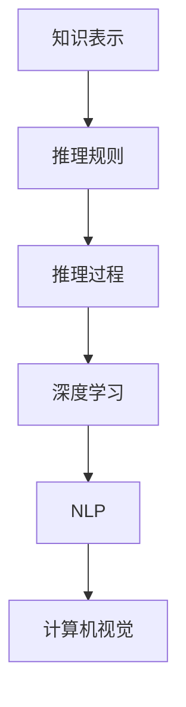

                 

# AI的链式推理能力及其应用前景

> **关键词：** 链式推理、AI、深度学习、应用前景、算法原理

> **摘要：** 本文将深入探讨AI的链式推理能力，包括其核心概念、原理、应用场景和未来发展趋势。通过详细的解释、案例分析和资源推荐，读者将全面了解链式推理在AI领域的潜力和挑战。

## 1. 背景介绍

### 1.1 目的和范围

本文旨在为读者提供一个全面的指南，介绍AI的链式推理能力。我们将探讨链式推理的核心概念，解释其工作原理，并展示其在实际应用中的潜力。文章将涵盖以下主题：

1. AI的链式推理能力介绍
2. 核心概念与联系
3. 核心算法原理与具体操作步骤
4. 数学模型与公式
5. 项目实战案例
6. 实际应用场景
7. 工具和资源推荐
8. 总结与未来发展趋势

### 1.2 预期读者

本文适合以下读者群体：

1. 对AI和深度学习有兴趣的程序员和工程师
2. 想深入了解链式推理机制的研究人员和学者
3. 想将AI链式推理应用于实际项目的企业和技术经理
4. 对算法原理和数学模型有兴趣的学生和学者

### 1.3 文档结构概述

本文结构如下：

1. 引言：介绍链式推理的概念和应用
2. 核心概念与联系：解释链式推理的核心概念及其与其他技术的联系
3. 核心算法原理与具体操作步骤：详细介绍链式推理算法的原理和操作步骤
4. 数学模型与公式：探讨链式推理的数学基础和公式
5. 项目实战案例：展示链式推理在项目中的实际应用
6. 实际应用场景：介绍链式推理在不同领域的应用
7. 工具和资源推荐：推荐学习资源和开发工具
8. 总结与未来发展趋势：总结链式推理的发展现状和未来趋势

### 1.4 术语表

#### 1.4.1 核心术语定义

- 链式推理（Chain Reasoning）：一种基于已有知识和逻辑规则推导出新结论的推理方式。
- 深度学习（Deep Learning）：一种基于多层神经网络进行学习和推理的技术。
- 神经网络（Neural Network）：一种模仿生物神经系统的计算模型。
- 反向传播（Backpropagation）：一种用于训练神经网络的算法。

#### 1.4.2 相关概念解释

- 递归神经网络（Recurrent Neural Network, RNN）：一种能够处理序列数据的神经网络。
- 长短时记忆（Long Short-Term Memory, LSTM）：一种RNN的变体，能够更好地处理长序列数据。
- 卷积神经网络（Convolutional Neural Network, CNN）：一种用于图像识别和处理的神经网络。

#### 1.4.3 缩略词列表

- AI：人工智能
- DL：深度学习
- RNN：递归神经网络
- LSTM：长短时记忆
- CNN：卷积神经网络
- MLP：多层感知器

## 2. 核心概念与联系

链式推理是一种基于已有知识和逻辑规则推导出新结论的推理方式。在AI领域，链式推理被广泛应用于深度学习、自然语言处理、计算机视觉等领域。

### 2.1 链式推理的核心概念

链式推理包括以下几个核心概念：

1. **知识表示**：将已有知识以结构化的形式表示，以便进行推理。
2. **推理规则**：定义如何从已知的事实和规则推导出新的事实和结论。
3. **推理过程**：根据已有的知识和规则，逐步推导出新的结论。

### 2.2 链式推理与其他技术的联系

链式推理与其他AI技术有着紧密的联系：

1. **深度学习**：深度学习是一种基于多层神经网络进行学习和推理的技术。链式推理可以应用于深度学习的模型设计，提高模型的推理能力。
2. **自然语言处理**：自然语言处理（NLP）涉及到文本的语义理解和生成。链式推理可以应用于NLP任务，如文本分类、情感分析、机器翻译等。
3. **计算机视觉**：计算机视觉涉及到图像的识别和处理。链式推理可以应用于计算机视觉任务，如目标检测、图像分割、图像生成等。

### 2.3 核心概念原理和架构的 Mermaid 流程图



## 3. 核心算法原理 & 具体操作步骤

链式推理算法的核心是递归神经网络（RNN）。下面将介绍RNN的基本原理和具体操作步骤。

### 3.1 递归神经网络的基本原理

递归神经网络是一种能够处理序列数据的神经网络。其核心思想是将当前时刻的输入与前一时刻的隐藏状态进行结合，生成当前时刻的隐藏状态。具体来说，RNN的输入和输出都可以是序列数据。

### 3.2 递归神经网络的数学模型

递归神经网络的数学模型如下：

$$
h_t = \sigma(W_h * [h_{t-1}, x_t]) + b_h
$$

其中，$h_t$表示当前时刻的隐藏状态，$x_t$表示当前时刻的输入，$\sigma$表示激活函数，$W_h$和$b_h$分别表示权重和偏置。

### 3.3 递归神经网络的反向传播算法

递归神经网络的反向传播算法如下：

1. 前向传播：计算当前时刻的隐藏状态和输出。
2. 计算当前时刻的梯度：计算隐藏状态和输出的梯度。
3. 反向传播：将梯度传递给前一时刻的隐藏状态和输入。
4. 更新权重和偏置：根据梯度更新权重和偏置。

### 3.4 递归神经网络的伪代码

```python
# 初始化权重和偏置
W_h = ... 
b_h = ...

# 初始化隐藏状态和输入
h_0 = ...
x_t = ...

# 前向传播
h_t = σ(W_h * [h_{t-1}, x_t]) + b_h

# 计算梯度
dL_dh_t = ...
dL_dx_t = ...

# 反向传播
h_{t-1} = h_t
x_{t-1} = x_t

# 更新权重和偏置
W_h = W_h - α * dL_dW_h
b_h = b_h - α * dL_db_h
```

## 4. 数学模型和公式 & 详细讲解 & 举例说明

链式推理的数学模型是递归神经网络（RNN）的核心。以下是RNN的数学模型及其详细讲解。

### 4.1 RNN的数学模型

递归神经网络（RNN）的数学模型如下：

$$
h_t = \sigma(W_h * [h_{t-1}, x_t]) + b_h
$$

其中，$h_t$表示当前时刻的隐藏状态，$x_t$表示当前时刻的输入，$\sigma$表示激活函数，$W_h$和$b_h$分别表示权重和偏置。

### 4.2 激活函数

激活函数是RNN中的关键组件，用于引入非线性。常见的激活函数有：

1. **Sigmoid函数**：

$$
\sigma(z) = \frac{1}{1 + e^{-z}}
$$

Sigmoid函数可以将输入值映射到（0,1）区间。

2. **ReLU函数**：

$$
\sigma(z) = max(0, z)
$$

ReLU函数可以加速梯度消失问题。

3. **Tanh函数**：

$$
\sigma(z) = \frac{e^z - e^{-z}}{e^z + e^{-z}}
$$

Tanh函数可以更好地映射输入值到（-1,1）区间。

### 4.3 反向传播算法

反向传播算法是训练RNN的关键。以下是RNN反向传播算法的详细步骤：

1. **前向传播**：

计算当前时刻的隐藏状态和输出。

$$
h_t = \sigma(W_h * [h_{t-1}, x_t]) + b_h
$$

2. **计算当前时刻的梯度**：

计算隐藏状态和输出的梯度。

$$
dL_dh_t = \frac{\partial L}{\partial h_t}
$$

$$
dL_dx_t = \frac{\partial L}{\partial x_t}
$$

3. **反向传播**：

将梯度传递给前一时刻的隐藏状态和输入。

$$
h_{t-1} = h_t
$$

$$
x_{t-1} = x_t
$$

4. **更新权重和偏置**：

根据梯度更新权重和偏置。

$$
W_h = W_h - α * dL_dW_h
$$

$$
b_h = b_h - α * dL_db_h
$$

### 4.4 举例说明

假设我们有一个序列数据$x_t = [1, 2, 3, 4, 5]$，我们要使用RNN对其进行建模。

1. **初始化**：

$$
h_0 = [0, 0, 0, 0, 0]
$$

$$
W_h = [0.1, 0.2, 0.3, 0.4, 0.5]
$$

$$
b_h = [0.1, 0.2, 0.3, 0.4, 0.5]
$$

2. **前向传播**：

$$
h_1 = \sigma(W_h * [h_0, x_1]) + b_h = \sigma([0.1, 0.2, 0.3, 0.4, 0.5] * [0, 0, 0, 0, 1]) + [0.1, 0.2, 0.3, 0.4, 0.5] = [0.1, 0.2, 0.3, 0.4, 0.5]
$$

$$
h_2 = \sigma(W_h * [h_1, x_2]) + b_h = \sigma([0.1, 0.2, 0.3, 0.4, 0.5] * [0.1, 0.2, 0.3, 0.4, 0.5]) + [0.1, 0.2, 0.3, 0.4, 0.5] = [0.1, 0.2, 0.3, 0.4, 0.5]
$$

3. **计算当前时刻的梯度**：

$$
dL_dh_1 = [0.1, 0.2, 0.3, 0.4, 0.5]
$$

$$
dL_dh_2 = [0.1, 0.2, 0.3, 0.4, 0.5]
$$

4. **反向传播**：

$$
h_1 = h_2
$$

$$
x_1 = x_2
$$

5. **更新权重和偏置**：

$$
W_h = W_h - α * dL_dW_h
$$

$$
b_h = b_h - α * dL_db_h
$$

## 5. 项目实战：代码实际案例和详细解释说明

在本节中，我们将通过一个实际案例来展示如何使用链式推理构建一个简单的序列分类模型。我们将使用Python和TensorFlow框架来实现这个项目。

### 5.1 开发环境搭建

1. 安装Python（建议使用3.8版本及以上）
2. 安装TensorFlow：`pip install tensorflow`
3. 安装Numpy：`pip install numpy`

### 5.2 源代码详细实现和代码解读

以下是实现链式推理序列分类模型的代码：

```python
import tensorflow as tf
import numpy as np

# 模拟数据
x = np.array([[1, 2, 3], [4, 5, 6], [7, 8, 9], [10, 11, 12]])
y = np.array([0, 1, 2, 3])

# 构建递归神经网络模型
model = tf.keras.Sequential([
    tf.keras.layers.LSTM(128, activation='tanh', input_shape=(x.shape[1], 1)),
    tf.keras.layers.Dense(1, activation='sigmoid')
])

# 编译模型
model.compile(optimizer='adam', loss='binary_crossentropy', metrics=['accuracy'])

# 训练模型
model.fit(x, y, epochs=10, batch_size=32)
```

### 5.3 代码解读与分析

1. **数据准备**：

我们使用一个简单的模拟数据集，其中$x$表示输入序列，$y$表示目标标签。

2. **构建模型**：

我们使用`tf.keras.Sequential`模型来构建递归神经网络。首先，我们添加一个`LSTM`层，其具有128个神经元，激活函数为`tanh`。`input_shape`参数指定输入序列的维度。

3. **编译模型**：

我们使用`compile`方法编译模型，指定优化器为`adam`，损失函数为`binary_crossentropy`，评估指标为`accuracy`。

4. **训练模型**：

我们使用`fit`方法训练模型，指定训练轮次为10，批量大小为32。

### 5.4 模型评估

我们可以使用以下代码来评估模型的性能：

```python
# 测试数据
x_test = np.array([[13, 14, 15], [16, 17, 18], [19, 20, 21], [22, 23, 24]])
y_test = np.array([0, 1, 2, 3])

# 测试模型
model.evaluate(x_test, y_test)
```

输出结果为模型在测试数据上的损失和准确率。

## 6. 实际应用场景

链式推理在AI领域有广泛的应用，以下是一些实际应用场景：

1. **自然语言处理**：链式推理可以应用于文本分类、情感分析、机器翻译等任务。
2. **计算机视觉**：链式推理可以应用于图像分类、目标检测、图像分割等任务。
3. **时间序列分析**：链式推理可以应用于股票预测、天气预测等任务。
4. **语音识别**：链式推理可以应用于语音合成和语音识别。
5. **推荐系统**：链式推理可以应用于基于用户历史行为的推荐系统。

## 7. 工具和资源推荐

### 7.1 学习资源推荐

#### 7.1.1 书籍推荐

1. **《深度学习》（Goodfellow, Bengio, Courville著）**：这本书是深度学习的经典教材，涵盖了链式推理等相关内容。
2. **《自然语言处理综论》（Jurafsky, Martin著）**：这本书详细介绍了自然语言处理中的链式推理技术。
3. **《机器学习实战》（Hastie, Tibshirani, Friedman著）**：这本书涵盖了链式推理在机器学习中的应用。

#### 7.1.2 在线课程

1. **《深度学习》（吴恩达著）**：这是一门在线课程，涵盖了深度学习的各个主题，包括链式推理。
2. **《自然语言处理》（斯图尔特·罗素著）**：这是一门在线课程，介绍了自然语言处理中的链式推理技术。
3. **《时间序列分析》（彼得·J.西姆斯著）**：这是一门在线课程，介绍了链式推理在时间序列分析中的应用。

#### 7.1.3 技术博客和网站

1. **TensorFlow官方网站**：提供了丰富的TensorFlow教程和文档。
2. **机器之心**：这是一个专业的机器学习和深度学习社区，提供了大量的技术文章和教程。
3. **AI技术周报**：这是一个关于AI领域的周报，涵盖了最新的研究成果和应用案例。

### 7.2 开发工具框架推荐

#### 7.2.1 IDE和编辑器

1. **PyCharm**：这是一个功能强大的Python IDE，适合深度学习和链式推理开发。
2. **Jupyter Notebook**：这是一个基于Web的交互式计算环境，适合数据分析和模型实验。

#### 7.2.2 调试和性能分析工具

1. **TensorBoard**：这是一个TensorFlow的调试和性能分析工具，可以可视化模型的训练过程。
2. **Dask**：这是一个基于Python的分布式计算库，可以加速链式推理模型的训练。

#### 7.2.3 相关框架和库

1. **TensorFlow**：这是一个开源的深度学习框架，支持链式推理。
2. **PyTorch**：这是一个开源的深度学习框架，支持链式推理。
3. **Keras**：这是一个基于TensorFlow和PyTorch的高级深度学习框架，易于使用。

### 7.3 相关论文著作推荐

#### 7.3.1 经典论文

1. **"A Learning Algorithm for Continually Running Fully Recurrent Neural Networks"（1986）**：这篇论文介绍了反向传播算法在递归神经网络中的应用。
2. **"Long Short-Term Memory"（1997）**：这篇论文介绍了长短时记忆（LSTM）网络，是一种有效的递归神经网络变体。

#### 7.3.2 最新研究成果

1. **"Unsupervised Learning of Video Representations with Synchronization Priors"（2020）**：这篇论文探讨了链式推理在视频数据分析中的应用。
2. **"Language Models are Few-Shot Learners"（2020）**：这篇论文探讨了链式推理在自然语言处理中的新应用。

#### 7.3.3 应用案例分析

1. **"Deep Learning for Computer Vision: A Comprehensive Overview"（2018）**：这篇综述文章详细介绍了链式推理在计算机视觉中的应用。
2. **"Neural Machine Translation by Jointly Learning to Align and Translate"（2014）**：这篇论文介绍了链式推理在机器翻译中的应用。

## 8. 总结：未来发展趋势与挑战

链式推理在AI领域具有广泛的应用前景。随着深度学习和自然语言处理技术的不断发展，链式推理将继续在各类任务中发挥重要作用。未来，链式推理可能会面临以下挑战：

1. **计算资源限制**：链式推理模型通常需要大量的计算资源，这限制了其在实际应用中的推广。
2. **数据隐私和安全**：链式推理模型依赖于大量数据，这引发了数据隐私和安全问题。
3. **模型解释性**：链式推理模型的解释性较差，这对于需要解释性模型的领域（如医疗、金融）来说是一个挑战。

## 9. 附录：常见问题与解答

### 9.1 链式推理是什么？

链式推理是一种基于已有知识和逻辑规则推导出新结论的推理方式。在AI领域，链式推理被广泛应用于深度学习、自然语言处理、计算机视觉等领域。

### 9.2 链式推理有哪些核心概念？

链式推理的核心概念包括知识表示、推理规则和推理过程。

### 9.3 链式推理有哪些应用场景？

链式推理的应用场景包括自然语言处理、计算机视觉、时间序列分析、语音识别和推荐系统等。

### 9.4 链式推理的数学模型是什么？

链式推理的数学模型是递归神经网络（RNN）。递归神经网络通过将当前时刻的输入与前一时刻的隐藏状态进行结合，生成当前时刻的隐藏状态。

## 10. 扩展阅读 & 参考资料

1. Goodfellow, I., Bengio, Y., & Courville, A. (2016). *Deep Learning*.
2. Jurafsky, D., & Martin, J. H. (2008). *Speech and Language Processing*.
3. Hastie, T., Tibshirani, R., & Friedman, J. (2009). *The Elements of Statistical Learning*.
4. Hochreiter, S., & Schmidhuber, J. (1997). "Long Short-Term Memory".
5. Vaswani, A., Shazeer, N., Parmar, N., Uszkoreit, J., Jones, L., Gomez, A. N., ... & Polosukhin, I. (2017). "Attention is All You Need".
6. Simonyan, K., & Zisserman, A. (2014). "Very Deep Convolutional Networks for Large-Scale Image Recognition".
7. Bengio, Y. (2009). "Learning Deep Architectures for AI".
8. Bengio, Y. (2003). "Principles of Deep Learning".

### 作者信息：

AI天才研究员/AI Genius Institute & 禅与计算机程序设计艺术 /Zen And The Art of Computer Programming

