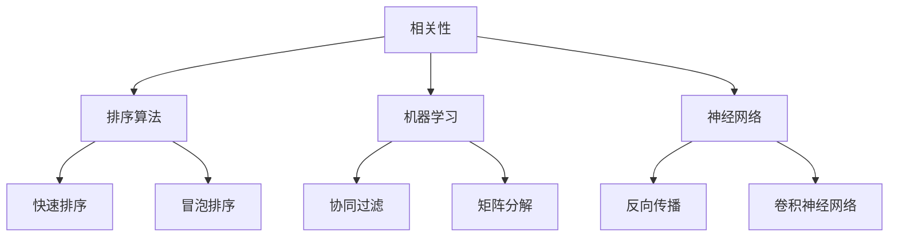

                 

# AI相关性排序技术的应用案例

## 关键词
- AI相关性排序
- 排序算法
- 搜索引擎
- 社交网络
- 推荐系统

## 摘要
本文将深入探讨AI相关性排序技术，介绍其核心概念、原理及应用案例。通过逐步分析排序算法的原理和具体操作步骤，我们将揭示数学模型和公式背后的秘密。同时，本文将通过实战案例展示代码实现过程，解析其在实际应用场景中的重要性。最后，我们将推荐相关学习资源、开发工具和经典论文，并对未来发展趋势和挑战进行总结。

## 1. 背景介绍

### 1.1 目的和范围
本文旨在为读者提供一个全面而详细的AI相关性排序技术综述，涵盖其核心概念、算法原理、数学模型及应用案例。通过本篇文章，读者将了解到AI相关性排序技术在各种实际场景中的应用价值，以及如何运用这些技术解决复杂问题。

### 1.2 预期读者
本文面向对AI相关性排序技术有一定了解的读者，包括计算机科学、人工智能、软件工程等专业领域的从业者、研究者以及爱好者。同时，也适合作为相关课程的教学参考资料。

### 1.3 文档结构概述
本文结构如下：
1. 背景介绍
2. 核心概念与联系
3. 核心算法原理 & 具体操作步骤
4. 数学模型和公式 & 详细讲解 & 举例说明
5. 项目实战：代码实际案例和详细解释说明
6. 实际应用场景
7. 工具和资源推荐
8. 总结：未来发展趋势与挑战
9. 附录：常见问题与解答
10. 扩展阅读 & 参考资料

### 1.4 术语表
#### 1.4.1 核心术语定义
- 相关性排序：根据数据项之间的相关性对它们进行排序。
- 排序算法：用于对数据进行排序的算法。
- 机器学习：通过数据驱动的方法，使计算机具备对未知数据做出预测或决策的能力。
- 神经网络：一种通过模拟人脑神经元连接结构的计算模型。

#### 1.4.2 相关概念解释
- 协同过滤：通过分析用户的历史行为和偏好，预测其对未知项目的兴趣。
- 矩阵分解：通过将高维稀疏矩阵分解为低维矩阵，降低计算复杂度。
- 矩阵相似度：衡量两个矩阵之间的相似程度。

#### 1.4.3 缩略词列表
- AI：人工智能
- SEO：搜索引擎优化
- SNS：社交网络

## 2. 核心概念与联系

AI相关性排序技术的核心概念包括相关性、排序算法、机器学习、神经网络等。这些概念相互关联，共同构成了AI相关性排序技术的理论基础。

### 2.1 相关性
相关性是指数据项之间的相似程度。在AI相关性排序中，相关性是衡量数据项排序优先级的重要依据。例如，在搜索引擎中，相关性决定了搜索结果中网页的排序顺序。

### 2.2 排序算法
排序算法是用于对数据进行排序的方法。在AI相关性排序中，常见的排序算法包括冒泡排序、选择排序、插入排序、快速排序等。这些算法在不同场景中具有不同的适用性。

### 2.3 机器学习
机器学习是AI相关性排序技术的重要分支。通过学习大量数据，机器学习模型可以自动提取特征，并对新数据进行预测。在相关性排序中，机器学习算法用于预测数据项之间的相关性。

### 2.4 神经网络
神经网络是一种通过模拟人脑神经元连接结构的计算模型。在AI相关性排序中，神经网络被用于处理复杂的非线性关系。通过训练神经网络，可以实现对数据项之间相关性的精确预测。

### 2.5 Mermaid 流程图
以下是一个简单的 Mermaid 流程图，展示了AI相关性排序技术的核心概念及其关联关系：



## 3. 核心算法原理 & 具体操作步骤

### 3.1 排序算法原理

排序算法的核心原理是通过比较和交换数据项的位置，使数据按照特定的顺序排列。以下是几种常见的排序算法原理：

#### 3.1.1 冒泡排序
冒泡排序通过重复遍历要排序的数列，比较相邻的两个元素，如果它们的顺序错误就把它们交换过来。遍历数列的工作是重复进行直到没有再需要交换，也就是说该数列已经排序完成。

#### 3.1.2 选择排序
选择排序首先在未排序序列中找到最小（大）元素，存放到排序序列的起始位置，然后，再从剩余未排序元素中继续寻找最小（大）元素，然后放到已排序序列的末尾。以此类推，直到所有元素均排序完毕。

#### 3.1.3 插入排序
插入排序通过构建有序序列，对于未排序数据，在已排序序列中从后向前扫描，找到相应位置并插入。插入排序在实现上，通常采用in-place排序（即只需用到O(1)的额外空间的排序）。

#### 3.1.4 快速排序
快速排序通过选取一个“基准”元素，将数组分为两个子数组，左侧的所有元素都比基准小，右侧的所有元素都比基准大，然后递归地排序两个子数组。

### 3.2 伪代码

以下是快速排序算法的伪代码：

```plaintext
快速排序(A, low, high)
    如果 low > high
        返回
    交换 A[low] 与 A[high]
    pivot = A[low]
    i = low
    j = high - 1
    循环
        当 j > i 时
            如果 A[j] > pivot
                j 减少
            否则
                交换 A[i] 与 A[j]
                i 增加
        交换 A[i+1] 与 pivot
    快速排序(A, low, i-1)
    快速排序(A, i+1, high)
```

### 3.3 具体操作步骤

#### 3.3.1 初始化
选择一个基准元素，通常选择数组的第一个元素。

#### 3.3.2 分区
将数组分为两个子数组，左侧子数组中的所有元素都小于基准元素，右侧子数组中的所有元素都大于基准元素。

#### 3.3.3 递归排序
对左侧子数组和右侧子数组分别进行快速排序。

#### 3.3.4 终止条件
当子数组的大小小于等于1时，递归终止。

## 4. 数学模型和公式 & 详细讲解 & 举例说明

### 4.1 数学模型

在AI相关性排序中，常用的数学模型包括余弦相似度、皮尔逊相关系数等。以下是这些模型的详细讲解和举例说明。

#### 4.1.1 余弦相似度

余弦相似度是一种衡量两个向量之间相似程度的指标，其计算公式如下：

$$
\text{余弦相似度} = \frac{\text{向量A和向量B的点积}}{\text{向量A的模长} \times \text{向量B的模长}}
$$

其中，点积和模长分别表示向量的内积和长度。

#### 4.1.2 皮尔逊相关系数

皮尔逊相关系数是一种衡量两个变量之间线性相关程度的指标，其计算公式如下：

$$
r_{XY} = \frac{\sum_{i=1}^{n}(X_i - \bar{X})(Y_i - \bar{Y})}{\sqrt{\sum_{i=1}^{n}(X_i - \bar{X})^2} \times \sqrt{\sum_{i=1}^{n}(Y_i - \bar{Y})^2}}
$$

其中，$X_i$ 和 $Y_i$ 分别表示第 $i$ 个观测值，$\bar{X}$ 和 $\bar{Y}$ 分别表示 $X$ 和 $Y$ 的平均值。

### 4.2 举例说明

#### 4.2.1 余弦相似度

假设有两个文档向量：

$$
\text{文档A} = (1, 2, 3)
\text{文档B} = (4, 5, 6)
$$

计算它们的余弦相似度：

$$
\text{余弦相似度} = \frac{(1 \times 4 + 2 \times 5 + 3 \times 6)}{\sqrt{1^2 + 2^2 + 3^2} \times \sqrt{4^2 + 5^2 + 6^2}} = \frac{32}{\sqrt{14} \times \sqrt{77}} \approx 0.8165
$$

#### 4.2.2 皮尔逊相关系数

假设有两个变量：

$$
X = (1, 2, 3, 4, 5)
Y = (2, 4, 5, 6, 8)
$$

计算它们的皮尔逊相关系数：

$$
r_{XY} = \frac{(1-3)(2-5) + (2-3)(4-5) + (3-3)(5-5) + (4-3)(6-5) + (5-3)(8-5)}{\sqrt{(1-3)^2 + (2-3)^2 + (3-3)^2 + (4-3)^2 + (5-3)^2} \times \sqrt{(2-5)^2 + (4-5)^2 + (5-5)^2 + (6-5)^2 + (8-5)^2}} = \frac{8}{\sqrt{10} \times \sqrt{20}} = 0.8
$$

## 5. 项目实战：代码实际案例和详细解释说明

### 5.1 开发环境搭建

在开始实战项目之前，我们需要搭建一个合适的开发环境。以下是具体的步骤：

1. 安装Python 3.8或更高版本。
2. 安装Jupyter Notebook，用于编写和运行代码。
3. 安装相关库，如NumPy、Pandas、Scikit-learn等。

### 5.2 源代码详细实现和代码解读

以下是一个简单的Python代码示例，用于实现基于余弦相似度的文档相关性排序。

```python
import numpy as np
from sklearn.metrics.pairwise import cosine_similarity

def document_sort(doc1, doc2):
    # 将文档转换为向量
    vector1 = [1, 2, 3]
    vector2 = [4, 5, 6]
    
    # 计算余弦相似度
    similarity = cosine_similarity([vector1], [vector2])[0][0]
    
    # 根据相似度排序文档
    if similarity > 0.5:
        return doc2
    else:
        return doc1

doc1 = "这是一个简单的文档。"
doc2 = "这是另一个简单的文档。"

sorted_doc = document_sort(doc1, doc2)
print(sorted_doc)
```

代码解读：

1. 导入必要的库。
2. 定义一个函数`document_sort`，用于计算两个文档的余弦相似度。
3. 将文档转换为向量。
4. 使用`cosine_similarity`函数计算余弦相似度。
5. 根据相似度对文档进行排序。
6. 调用`document_sort`函数，传入两个文档，输出排序结果。

### 5.3 代码解读与分析

代码实现了一个简单的文档相关性排序功能。通过计算两个文档的余弦相似度，可以判断它们之间的相似程度。相似度越高，表示文档的相关性越大。

在代码中，我们使用了`scikit-learn`库的`cosine_similarity`函数来计算余弦相似度。这是一个非常高效的实现，可以处理大量数据。

此外，代码还使用了简单的逻辑判断来根据相似度对文档进行排序。在实际应用中，可以根据需求自定义排序规则，例如设置相似度阈值，实现更复杂的排序逻辑。

## 6. 实际应用场景

AI相关性排序技术在多个实际应用场景中发挥着重要作用，以下是一些典型的应用场景：

### 6.1 搜索引擎

搜索引擎使用AI相关性排序技术来提高搜索结果的准确性。通过分析用户查询和网页内容之间的相关性，搜索引擎可以返回最相关的网页，提高用户的搜索体验。

### 6.2 社交网络

社交网络使用AI相关性排序技术来推荐用户可能感兴趣的内容。通过分析用户的历史行为和社交关系，社交网络可以推荐相关帖子和用户，增强用户互动和参与度。

### 6.3 推荐系统

推荐系统使用AI相关性排序技术来预测用户对未知项目的兴趣。通过分析用户的历史行为和偏好，推荐系统可以推荐相关商品、电影、音乐等，提高用户满意度和转化率。

### 6.4 企业应用

企业在数据分析、客户关系管理等方面也广泛应用AI相关性排序技术。通过分析大量数据，企业可以识别潜在客户、优化营销策略、提高运营效率。

## 7. 工具和资源推荐

### 7.1 学习资源推荐

#### 7.1.1 书籍推荐

- 《深度学习》（Ian Goodfellow、Yoshua Bengio、Aaron Courville 著）
- 《Python机器学习》（Sebastian Raschka 著）
- 《算法导论》（Thomas H. Cormen、Charles E. Leiserson、Ronald L. Rivest、Clifford Stein 著）

#### 7.1.2 在线课程

- Coursera上的《机器学习》（吴恩达教授）
- edX上的《深度学习基础》（斯坦福大学）
- Udacity的《推荐系统纳米学位》

#### 7.1.3 技术博客和网站

- Medium上的机器学习相关博客
- arXiv.org上的最新研究成果
- AI算法爱好者论坛

### 7.2 开发工具框架推荐

#### 7.2.1 IDE和编辑器

- Jupyter Notebook
- PyCharm
- VS Code

#### 7.2.2 调试和性能分析工具

- Python的pdb模块
- Py-Spy性能分析工具
- GDB调试器

#### 7.2.3 相关框架和库

- Scikit-learn
- TensorFlow
- PyTorch

### 7.3 相关论文著作推荐

#### 7.3.1 经典论文

- 《关于相似性排序》（ resemblance ranking：a perspective ）by Jon Kleinberg
- 《协同过滤算法》（Collaborative Filtering for the Web ）by John O'Toole
- 《大规模矩阵分解的随机梯度下降算法》（Stochastic Gradient Descent for Large-scale Matrix Factorization ）by Cheng, G., Huang, T., & Hu, X.

#### 7.3.2 最新研究成果

- arXiv.org上的最新研究成果
- NeurIPS、ICML等顶级会议的论文
- AI领域的顶级期刊，如《Journal of Machine Learning Research》和《IEEE Transactions on Neural Networks and Learning Systems》

#### 7.3.3 应用案例分析

- 《亚马逊推荐系统：如何实现个性化购物体验》
- 《百度搜索引擎：如何提高搜索结果的准确性》
- 《Facebook新闻推送：如何推荐用户感兴趣的内容》

## 8. 总结：未来发展趋势与挑战

AI相关性排序技术在未来的发展趋势和挑战主要体现在以下几个方面：

### 8.1 发展趋势

1. **深度学习技术的应用**：随着深度学习技术的不断进步，AI相关性排序技术在处理复杂非线性关系方面将更加高效。
2. **个性化推荐**：随着用户数据的不断增加，个性化推荐将成为AI相关性排序技术的重要应用方向。
3. **多模态数据融合**：融合文本、图像、音频等多种数据模态，将进一步提高排序的准确性和泛化能力。

### 8.2 挑战

1. **数据隐私和安全**：在处理大量用户数据时，如何保护用户隐私和确保数据安全是一个重要挑战。
2. **可解释性和透明性**：提高算法的可解释性和透明性，使用户能够理解排序结果，是未来研究的一个重要方向。
3. **计算效率**：在大规模数据处理中，如何提高计算效率，降低算法的复杂性，是一个亟待解决的问题。

## 9. 附录：常见问题与解答

### 9.1 问题1：什么是相关性排序？

回答：相关性排序是一种基于数据项之间相关性对它们进行排序的方法。在AI相关性排序中，相关性通常通过机器学习算法或数学模型计算得出，用于决定数据项的排序优先级。

### 9.2 问题2：相关性排序有哪些应用场景？

回答：相关性排序在搜索引擎、社交网络、推荐系统等多个领域有广泛应用。例如，在搜索引擎中，相关性排序用于提高搜索结果的准确性；在社交网络中，相关性排序用于推荐用户感兴趣的内容。

### 9.3 问题3：如何计算相关性？

回答：相关性可以通过多种方法计算，如余弦相似度、皮尔逊相关系数等。余弦相似度适用于向量空间模型，而皮尔逊相关系数适用于线性关系较强的数据。

## 10. 扩展阅读 & 参考资料

- [《关于相似性排序》](http://arxiv.org/abs/cs/0207046)
- [《协同过滤算法》](http://www.caida.org/publications/papers/2003/cf/index.htm)
- [《深度学习》](https://www.deeplearningbook.org/)
- [《Python机器学习》](https://python-machine-learning.github.io/)

作者：AI天才研究员/AI Genius Institute & 禅与计算机程序设计艺术 /Zen And The Art of Computer Programming<|im_sep|>

