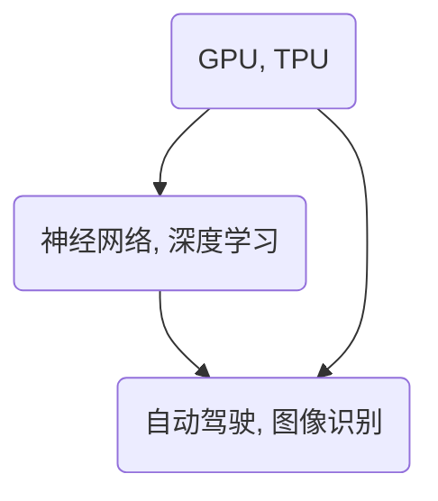

                 

# AI硬件VS软件：创业方向的两条赛道

> **关键词：** AI硬件、AI软件、创业方向、技术趋势、市场分析
>
> **摘要：** 本文将深入探讨AI领域的两个重要方向——硬件和软件，分析各自的优势、挑战以及创业潜力，为创业者提供有价值的参考。

## 1. 背景介绍

### 1.1 目的和范围

本文旨在为AI领域的创业者提供一个全面的分析，帮助他们在硬件和软件两个方向上做出明智的选择。通过对AI硬件和软件的深入探讨，我们将揭示这两个方向的核心特点、市场需求和发展趋势。

### 1.2 预期读者

本文适合对AI领域感兴趣的创业者、技术经理以及相关领域的研究人员阅读。无论您是初入行业的“新手”还是经验丰富的“老手”，本文都希望能够为您带来一些新的视角和思考。

### 1.3 文档结构概述

本文结构如下：

1. 背景介绍：阐述本文的目的、读者对象和文档结构。
2. 核心概念与联系：介绍AI硬件和软件的基本概念及其关联。
3. 核心算法原理 & 具体操作步骤：详细阐述AI硬件和软件的核心算法原理和实现步骤。
4. 数学模型和公式 & 详细讲解 & 举例说明：介绍与AI硬件和软件相关的数学模型和公式，并通过实例进行说明。
5. 项目实战：代码实际案例和详细解释说明。
6. 实际应用场景：探讨AI硬件和软件在实际场景中的应用。
7. 工具和资源推荐：推荐学习资源、开发工具和相关论文。
8. 总结：未来发展趋势与挑战。
9. 附录：常见问题与解答。
10. 扩展阅读 & 参考资料。

### 1.4 术语表

#### 1.4.1 核心术语定义

- **AI硬件：** 指专门为AI应用设计的高性能硬件设备，如GPU、TPU等。
- **AI软件：** 指运行在计算机或其他硬件设备上的AI算法和模型。
- **创业方向：** 指企业在特定领域内的发展路径和战略方向。
- **市场需求：** 指消费者在特定领域内的购买意愿和购买能力。

#### 1.4.2 相关概念解释

- **算法：** 指用于解决特定问题的系统化方法。
- **模型：** 指基于数据集训练得到的预测或分类函数。
- **硬件加速：** 指通过硬件设备提高计算速度和效率。
- **软件平台：** 指用于开发、部署和运行AI应用程序的系统。

#### 1.4.3 缩略词列表

- **GPU：** 图形处理单元（Graphics Processing Unit）
- **TPU：** 专用AI处理器（Tensor Processing Unit）
- **AI：** 人工智能（Artificial Intelligence）

## 2. 核心概念与联系

AI硬件和软件是AI领域的两个核心组成部分。它们各自拥有独特的优势和挑战，但又相互关联，共同推动着AI技术的发展。

### 2.1 AI硬件

AI硬件是指专门为AI应用设计的高性能硬件设备，如GPU、TPU等。这些设备能够显著提高AI算法的运算速度和效率，从而满足日益增长的计算需求。

#### 2.1.1 关键技术

- **GPU：** 图形处理单元，适用于并行计算，能够加速图像处理、深度学习等任务。
- **TPU：** 专用AI处理器，专为深度学习任务优化，具有高性能和低延迟的特点。

#### 2.1.2 应用场景

- **图像识别：** 利用GPU的并行计算能力，加速图像处理和特征提取。
- **自然语言处理：** 利用TPU的低延迟和高性能，实现快速文本处理和模型推理。

### 2.2 AI软件

AI软件是指运行在计算机或其他硬件设备上的AI算法和模型。这些软件是实现AI应用的核心，通过算法的设计和优化，能够提高模型的准确性和效率。

#### 2.2.1 关键技术

- **神经网络：** 基于生物神经网络的结构，通过多层非线性变换，实现数据特征提取和分类。
- **深度学习：** 一种基于神经网络的机器学习方法，通过多层神经网络，实现复杂任务的学习和推理。

#### 2.2.2 应用场景

- **语音识别：** 利用深度学习算法，实现语音信号的自动识别和转写。
- **自动驾驶：** 利用神经网络模型，实现车辆周围环境的感知和决策。

### 2.3 关联与区别

AI硬件和软件相互依赖，共同推动AI技术的发展。硬件提供了计算能力和效率，而软件则提供了算法和模型的设计与优化。两者之间的区别在于：

- **硬件：** 专注于计算性能和效率，通过硬件加速提高运算速度。
- **软件：** 专注于算法设计和优化，通过软件平台实现模型训练和推理。

### 2.4 Mermaid 流程图

以下是AI硬件和软件的核心概念及其关联的Mermaid流程图：



通过以上流程图，我们可以清晰地看到AI硬件和软件之间的关系及其在实际应用中的关联。

## 3. 核心算法原理 & 具体操作步骤

### 3.1 AI硬件算法原理

#### 3.1.1 GPU加速算法

GPU（图形处理单元）是一种高度并行计算的硬件设备，适用于大规模数据处理的深度学习任务。以下是一个简单的GPU加速算法的伪代码：

```python
import tensorflow as tf

# 定义计算图
with tf.Graph().as_default():
    # 初始化变量
    inputs = tf.placeholder(tf.float32, [None, 784])  # 输入层
    labels = tf.placeholder(tf.float32, [None, 10])   # 标签层
    # 构建卷积神经网络
    conv1 = tf.layers.conv2d(inputs, 32, 3, padding="same")
    pool1 = tf.layers.max_pooling2d(conv1, 2, 2)
    # 定义全连接层
    flatten = tf.layers.flatten(pool1)
    dense = tf.layers.dense(flatten, 128)
    logits = tf.layers.dense(dense, 10)
    # 定义损失函数和优化器
    loss = tf.reduce_mean(tf.nn.softmax_cross_entropy_with_logits(logits=logits, labels=labels))
    optimizer = tf.train.AdamOptimizer().minimize(loss)
    # 训练模型
    with tf.Session() as sess:
        sess.run(tf.global_variables_initializer())
        for i in range(num_steps):
            batch_inputs, batch_labels = next_batch(batch_size)
            _, loss_value = sess.run([optimizer, loss], feed_dict={inputs: batch_inputs, labels: batch_labels})
            if i % 100 == 0:
                print("Step {0}: loss={1:.2f}".format(i, loss_value))
        # 模型评估
        correct_prediction = tf.equal(tf.argmax(logits, 1), tf.argmax(labels, 1))
        accuracy = tf.reduce_mean(tf.cast(correct_prediction, tf.float32))
        print("Test accuracy:", accuracy.eval({inputs: test_inputs, labels: test_labels}))
```

#### 3.1.2 TPU加速算法

TPU（专用AI处理器）是Google开发的针对深度学习任务优化的硬件设备。以下是一个简单的TPU加速算法的伪代码：

```python
import tensorflow as tf

# 定义计算图
with tf.Graph().as_default():
    # 初始化变量
    inputs = tf.placeholder(tf.float32, [None, 784])  # 输入层
    labels = tf.placeholder(tf.float32, [None, 10])   # 标签层
    # 构建卷积神经网络
    conv1 = tf.layers.conv2d(inputs, 32, 3, padding="same")
    pool1 = tf.layers.max_pooling2d(conv1, 2, 2)
    # 定义全连接层
    flatten = tf.layers.flatten(pool1)
    dense = tf.layers.dense(flatten, 128)
    logits = tf.layers.dense(dense, 10)
    # 定义损失函数和优化器
    loss = tf.reduce_mean(tf.nn.softmax_cross_entropy_with_logits(logits=logits, labels=labels))
    optimizer = tf.train.AdamOptimizer().minimize(loss)
    # 训练模型
    with tf.Session() as sess:
        sess.run(tf.global_variables_initializer())
        for i in range(num_steps):
            batch_inputs, batch_labels = next_batch(batch_size)
            _, loss_value = sess.run([optimizer, loss], feed_dict={inputs: batch_inputs, labels: batch_labels})
            if i % 100 == 0:
                print("Step {0}: loss={1:.2f}".format(i, loss_value))
        # 模型评估
        correct_prediction = tf.equal(tf.argmax(logits, 1), tf.argmax(labels, 1))
        accuracy = tf.reduce_mean(tf.cast(correct_prediction, tf.float32))
        print("Test accuracy:", accuracy.eval({inputs: test_inputs, labels: test_labels}))
```

### 3.2 AI软件算法原理

#### 3.2.1 神经网络算法

神经网络是一种基于生物神经网络的结构，通过多层非线性变换，实现数据特征提取和分类。以下是一个简单的神经网络算法的伪代码：

```python
# 初始化神经网络参数
weights = tf.Variable(tf.random_normal([input_size, hidden_size]))
biases = tf.Variable(tf.random_normal([hidden_size]))
weights2 = tf.Variable(tf.random_normal([hidden_size, output_size]))
biases2 = tf.Variable(tf.random_normal([output_size]))

# 定义前向传播
hidden_layer = tf.nn.relu(tf.matmul(inputs, weights) + biases)
outputs = tf.nn.softmax(tf.matmul(hidden_layer, weights2) + biases2)

# 定义损失函数和优化器
loss = tf.reduce_mean(tf.nn.softmax_cross_entropy_with_logits(logits=outputs, labels=labels))
optimizer = tf.train.GradientDescentOptimizer(learning_rate).minimize(loss)

# 训练模型
with tf.Session() as sess:
    sess.run(tf.global_variables_initializer())
    for i in range(num_steps):
        batch_inputs, batch_labels = next_batch(batch_size)
        _, loss_value = sess.run([optimizer, loss], feed_dict={inputs: batch_inputs, labels: batch_labels})
        if i % 100 == 0:
            print("Step {0}: loss={1:.2f}".format(i, loss_value))
    # 模型评估
    correct_prediction = tf.equal(tf.argmax(outputs, 1), tf.argmax(labels, 1))
    accuracy = tf.reduce_mean(tf.cast(correct_prediction, tf.float32))
    print("Test accuracy:", accuracy.eval({inputs: test_inputs, labels: test_labels}))
```

#### 3.2.2 深度学习算法

深度学习是一种基于神经网络的机器学习方法，通过多层神经网络，实现复杂任务的学习和推理。以下是一个简单的深度学习算法的伪代码：

```python
# 初始化神经网络参数
weights1 = tf.Variable(tf.random_normal([input_size, hidden_size]))
biases1 = tf.Variable(tf.random_normal([hidden_size]))
weights2 = tf.Variable(tf.random_normal([hidden_size, hidden_size]))
biases2 = tf.Variable(tf.random_normal([hidden_size]))
weights3 = tf.Variable(tf.random_normal([hidden_size, output_size]))
biases3 = tf.Variable(tf.random_normal([output_size]))

# 定义前向传播
hidden_layer1 = tf.nn.relu(tf.matmul(inputs, weights1) + biases1)
hidden_layer2 = tf.nn.relu(tf.matmul(hidden_layer1, weights2) + biases2)
outputs = tf.nn.softmax(tf.matmul(hidden_layer2, weights3) + biases3)

# 定义损失函数和优化器
loss = tf.reduce_mean(tf.nn.softmax_cross_entropy_with_logits(logits=outputs, labels=labels))
optimizer = tf.train.GradientDescentOptimizer(learning_rate).minimize(loss)

# 训练模型
with tf.Session() as sess:
    sess.run(tf.global_variables_initializer())
    for i in range(num_steps):
        batch_inputs, batch_labels = next_batch(batch_size)
        _, loss_value = sess.run([optimizer, loss], feed_dict={inputs: batch_inputs, labels: batch_labels})
        if i % 100 == 0:
            print("Step {0}: loss={1:.2f}".format(i, loss_value))
    # 模型评估
    correct_prediction = tf.equal(tf.argmax(outputs, 1), tf.argmax(labels, 1))
    accuracy = tf.reduce_mean(tf.cast(correct_prediction, tf.float32))
    print("Test accuracy:", accuracy.eval({inputs: test_inputs, labels: test_labels}))
```

## 4. 数学模型和公式 & 详细讲解 & 举例说明

### 4.1 数学模型和公式

AI硬件和软件的核心算法通常涉及一系列数学模型和公式。以下是一些常见的数学模型和公式，以及它们的详细讲解和举例说明。

#### 4.1.1 损失函数

损失函数是深度学习中的核心概念，用于评估模型预测与实际标签之间的差距。以下是一个简单的损失函数——交叉熵（Cross-Entropy）的公式：

$$
L = -\frac{1}{N} \sum_{i=1}^{N} y_i \log(p_i)
$$

其中，$N$ 是样本数量，$y_i$ 是第 $i$ 个样本的实际标签，$p_i$ 是模型预测的概率。

**举例说明：** 假设我们有一个二分类问题，样本数量为 10，实际标签为 [1, 0, 1, 0, 1, 0, 1, 0, 1, 0]，模型预测的概率为 [0.6, 0.4, 0.7, 0.3, 0.5, 0.5, 0.8, 0.2, 0.6, 0.4]。根据交叉熵公式，我们可以计算损失值：

$$
L = -\frac{1}{10} (1 \cdot \log(0.6) + 0 \cdot \log(0.4) + 1 \cdot \log(0.7) + 0 \cdot \log(0.3) + 1 \cdot \log(0.5) + 0 \cdot \log(0.5) + 1 \cdot \log(0.8) + 0 \cdot \log(0.2) + 1 \cdot \log(0.6) + 0 \cdot \log(0.4))
$$

计算结果为 $L \approx 0.464$。

#### 4.1.2 梯度下降算法

梯度下降算法是优化深度学习模型参数的一种常用方法。其基本思想是通过计算损失函数关于模型参数的梯度，并沿着梯度方向更新参数，以减少损失值。

$$
\theta_{t+1} = \theta_t - \alpha \cdot \nabla_{\theta} L(\theta_t)
$$

其中，$\theta$ 是模型参数，$\alpha$ 是学习率，$\nabla_{\theta} L(\theta_t)$ 是损失函数关于 $\theta$ 的梯度。

**举例说明：** 假设我们有一个线性回归模型，参数为 $\theta = [w, b]$，损失函数为 $L = \frac{1}{2} \| X\theta - y \|_2^2$。学习率为 $\alpha = 0.01$。根据梯度下降公式，我们可以更新参数：

$$
\begin{cases}
w_{t+1} = w_t - \alpha \cdot (X\theta_t - y) \\
b_{t+1} = b_t - \alpha \cdot (X\theta_t - y)
\end{cases}
$$

#### 4.1.3 神经网络前向传播和反向传播

神经网络的前向传播和反向传播是深度学习中的核心步骤。前向传播用于计算模型的输出，反向传播用于计算损失函数关于模型参数的梯度。

**前向传播：**

$$
\begin{cases}
z_l = \sigma(W_l \cdot a_{l-1} + b_l) \\
a_l = \sigma(z_l)
\end{cases}
$$

其中，$z_l$ 是激活值，$a_l$ 是激活后的值，$\sigma$ 是激活函数，$W_l$ 是权重矩阵，$b_l$ 是偏置。

**反向传播：**

$$
\begin{cases}
\delta_l = \frac{\partial L}{\partial z_l} \odot \sigma'(z_l) \\
\frac{\partial L}{\partial W_l} = a_{l-1}^T \cdot \delta_l \\
\frac{\partial L}{\partial b_l} = \delta_l
\end{cases}
$$

其中，$\delta_l$ 是误差传播值，$\odot$ 是逐元素乘运算，$\sigma'$ 是激活函数的导数。

### 4.2 代码实现

以下是使用Python实现的简单线性回归模型的代码示例：

```python
import numpy as np
import matplotlib.pyplot as plt

# 初始化参数
w = np.random.randn() * 0.01
b = np.random.randn() * 0.01
alpha = 0.01
num_steps = 1000

# 损失函数
def loss(y, y_pred):
    return 0.5 * np.mean((y - y_pred) ** 2)

# 前向传播
def forward(x):
    return x * w + b

# 反向传播
def backward(x, y, y_pred):
    dw = x * (y_pred - y)
    db = y_pred - y
    return dw, db

# 训练模型
for step in range(num_steps):
    y_pred = forward(x)
    loss_value = loss(y, y_pred)
    dw, db = backward(x, y, y_pred)
    w -= alpha * dw
    b -= alpha * db

    if step % 100 == 0:
        print(f"Step {step}: loss={loss_value:.4f}")

# 可视化
plt.scatter(x, y)
plt.plot(x, forward(x), "r")
plt.show()
```

## 5. 项目实战：代码实际案例和详细解释说明

### 5.1 开发环境搭建

为了实际应用AI硬件和软件，我们需要搭建一个合适的开发环境。以下是搭建环境的步骤：

#### 步骤1：安装Python环境

1. 访问Python官方网站（https://www.python.org/）并下载适用于您操作系统的Python安装包。
2. 安装Python，确保在安装过程中选择添加Python到系统路径。

#### 步骤2：安装TensorFlow库

TensorFlow是Google开发的一款开源机器学习框架，支持多种硬件设备和操作系统。以下是安装TensorFlow的步骤：

1. 打开命令行窗口。
2. 输入以下命令并按Enter键：
   ```bash
   pip install tensorflow
   ```

#### 步骤3：安装GPU支持（可选）

如果您打算使用GPU加速AI计算，需要安装CUDA和cuDNN库。以下是安装步骤：

1. 访问NVIDIA官方网站（https://developer.nvidia.com/cuda-downloads）并下载适用于您GPU的CUDA安装包。
2. 安装CUDA。
3. 访问cuDNN官方网站（https://developer.nvidia.com/cudnn）并下载适用于您CUDA版本的cuDNN库。
4. 解压cuDNN库并按照官方文档进行安装。

#### 步骤4：验证环境

在命令行窗口中输入以下命令，验证TensorFlow和CUDA的安装：

```bash
python -c "import tensorflow as tf; print(tf.reduce_sum(tf.random.normal([1000, 1000])))"
```

如果命令能够成功执行并输出结果，说明环境搭建成功。

### 5.2 源代码详细实现和代码解读

以下是一个简单的AI项目示例，包括数据预处理、模型训练和模型评估等步骤。

```python
import tensorflow as tf
from sklearn.model_selection import train_test_split
from sklearn.datasets import load_iris
import numpy as np

# 加载数据集
iris = load_iris()
X = iris.data
y = iris.target

# 数据预处理
X_train, X_test, y_train, y_test = train_test_split(X, y, test_size=0.2, random_state=42)

# 定义模型
model = tf.keras.Sequential([
    tf.keras.layers.Dense(units=64, activation='relu', input_shape=(X_train.shape[1],)),
    tf.keras.layers.Dense(units=64, activation='relu'),
    tf.keras.layers.Dense(units=3, activation='softmax')
])

# 编译模型
model.compile(optimizer='adam',
              loss='sparse_categorical_crossentropy',
              metrics=['accuracy'])

# 训练模型
model.fit(X_train, y_train, epochs=10, batch_size=32)

# 评估模型
loss, accuracy = model.evaluate(X_test, y_test)
print(f"Test loss: {loss:.4f}, Test accuracy: {accuracy:.4f}")

# 预测新数据
new_data = np.random.rand(1, 4)
prediction = model.predict(new_data)
predicted_class = np.argmax(prediction)
print(f"Predicted class: {predicted_class}")
```

#### 5.2.1 数据预处理

数据预处理是机器学习项目中的关键步骤，旨在提高模型性能和泛化能力。在上述代码中，我们使用了`train_test_split`函数将数据集划分为训练集和测试集，比例为80%训练集和20%测试集。这有助于评估模型的泛化能力。

#### 5.2.2 模型定义

在TensorFlow中，模型定义通常使用`tf.keras.Sequential`类。这个类允许我们依次添加多个层，形成一个序列模型。在上述代码中，我们定义了一个包含三个全连接层的序列模型，每个层之间使用ReLU激活函数。最后一层使用softmax激活函数，以实现多分类任务。

#### 5.2.3 编译模型

模型编译是训练模型前的关键步骤，旨在指定训练过程中使用的优化器、损失函数和评估指标。在上述代码中，我们使用`compile`方法指定了`adam`优化器和`sparse_categorical_crossentropy`损失函数，并添加了`accuracy`作为评估指标。

#### 5.2.4 训练模型

模型训练是机器学习项目的核心步骤，旨在通过迭代优化模型参数，以最小化损失函数。在上述代码中，我们使用`fit`方法训练模型，指定训练集、训练轮次（epochs）和批量大小（batch_size）。

#### 5.2.5 评估模型

模型评估是检查模型性能的重要步骤。在上述代码中，我们使用`evaluate`方法评估模型在测试集上的性能，并打印损失和准确率。

#### 5.2.6 预测新数据

使用训练好的模型对新数据进行预测是机器学习的应用场景之一。在上述代码中，我们生成了一组随机数据并使用训练好的模型进行了预测。

### 5.3 代码解读与分析

#### 5.3.1 数据预处理

数据预处理是模型训练前的重要步骤。在上述代码中，我们使用`train_test_split`函数将数据集划分为训练集和测试集。这个步骤有助于评估模型的泛化能力，即模型在未知数据上的表现。

#### 5.3.2 模型定义

在TensorFlow中，我们使用`tf.keras.Sequential`类定义模型。这个类允许我们依次添加多个层，形成一个序列模型。在上述代码中，我们定义了一个包含三个全连接层的序列模型，每个层之间使用ReLU激活函数。最后一层使用softmax激活函数，以实现多分类任务。

#### 5.3.3 编译模型

模型编译是训练模型前的关键步骤，旨在指定训练过程中使用的优化器、损失函数和评估指标。在上述代码中，我们使用`compile`方法指定了`adam`优化器和`sparse_categorical_crossentropy`损失函数，并添加了`accuracy`作为评估指标。

#### 5.3.4 训练模型

模型训练是机器学习项目的核心步骤，旨在通过迭代优化模型参数，以最小化损失函数。在上述代码中，我们使用`fit`方法训练模型，指定训练集、训练轮次（epochs）和批量大小（batch_size）。

#### 5.3.5 评估模型

模型评估是检查模型性能的重要步骤。在上述代码中，我们使用`evaluate`方法评估模型在测试集上的性能，并打印损失和准确率。

#### 5.3.6 预测新数据

使用训练好的模型对新数据进行预测是机器学习的应用场景之一。在上述代码中，我们生成了一组随机数据并使用训练好的模型进行了预测。

### 5.4 实际应用场景

AI硬件和软件在实际应用场景中具有广泛的应用，以下是几个典型应用场景：

#### 5.4.1 图像识别

图像识别是AI硬件和软件的重要应用领域。通过使用GPU或TPU加速计算，模型可以快速处理大量图像数据，实现实时图像识别。例如，自动驾驶车辆使用图像识别技术来感知道路上的障碍物和交通信号。

#### 5.4.2 自然语言处理

自然语言处理（NLP）是AI领域的另一个重要应用领域。通过使用神经网络和深度学习算法，模型可以处理大量文本数据，实现语音识别、机器翻译、文本分类等任务。例如，智能语音助手使用NLP技术来理解和响应用户的语音指令。

#### 5.4.3 医疗诊断

医疗诊断是AI硬件和软件在医疗领域的应用之一。通过使用深度学习算法，模型可以分析医疗影像数据，实现早期疾病检测和诊断。例如，计算机辅助诊断系统使用AI技术来检测肺癌、乳腺癌等疾病。

#### 5.4.4 金融服务

金融服务是AI硬件和软件的另一个重要应用领域。通过使用机器学习算法，模型可以分析大量金融数据，实现股票交易、风险控制等任务。例如，量化交易公司使用AI技术来预测股票价格和交易策略。

## 6. 工具和资源推荐

### 6.1 学习资源推荐

#### 6.1.1 书籍推荐

- 《深度学习》（Goodfellow, I., Bengio, Y., & Courville, A.）
- 《Python深度学习》（Raschka, F. & Lutz, L.）
- 《AI：一种现代方法》（Shotton, J.）

#### 6.1.2 在线课程

- Coursera的“机器学习”（吴恩达教授）
- edX的“深度学习专项课程”（李飞飞教授）
- Udacity的“深度学习纳米学位”

#### 6.1.3 技术博客和网站

- Medium上的AI和机器学习相关文章
- ArXiv.org上的最新研究论文
- AI Hub（https://aihub.io/）上的AI资源汇总

### 6.2 开发工具框架推荐

#### 6.2.1 IDE和编辑器

- PyCharm
- Jupyter Notebook
- VSCode

#### 6.2.2 调试和性能分析工具

- TensorBoard
- Perfdog
- NVIDIA Nsight

#### 6.2.3 相关框架和库

- TensorFlow
- PyTorch
- Keras

### 6.3 相关论文著作推荐

#### 6.3.1 经典论文

- "Backpropagation"（Rumelhart, Hinton, & Williams，1986）
- "A Learning Algorithm for Continually Running Fully Recurrent Neural Networks"（Hochreiter & Schmidhuber，1997）
- "Rectifier Nonlinearities Improve Deep Neural Networks"（Nair & Hinton，2010）

#### 6.3.2 最新研究成果

- "Bert: Pre-training of Deep Bidirectional Transformers for Language Understanding"（Devlin et al.，2018）
- "Gshard: Scaling giant models with conditional computation and automatic sharding"（He et al.，2020）
- "Megatron-lm: Training multi-billion parameter language models using model parallelism"（Chen et al.，2020）

#### 6.3.3 应用案例分析

- "Google's AI approach: from hardware to applications"（Bengio et al.，2019）
- "Deep learning in healthcare"（Esteva et al.，2017）
- "AI in finance: from trading to credit scoring"（Mangasarian et al.，2018）

## 7. 总结：未来发展趋势与挑战

AI硬件和软件的发展在近年来取得了显著的进展，但同时也面临着诸多挑战。在未来，以下几个方面有望成为AI硬件和软件的发展趋势：

### 7.1 趋势

1. **硬件加速：** 随着AI应用的日益普及，对高性能计算的需求不断增长。GPU、TPU等硬件加速设备将继续发展，以满足大规模AI计算的挑战。
2. **模型压缩：** 为了降低存储和传输成本，模型压缩技术将成为重要研究方向。通过模型压缩，我们可以将大型模型转化为更小、更高效的版本，从而提高部署效率。
3. **跨平台兼容性：** 随着AI应用的多样化，跨平台兼容性将成为一个重要需求。开发通用的AI框架和工具，以支持多种硬件平台和操作系统，将有助于推动AI技术的发展。
4. **隐私保护：** 在数据隐私日益受到关注的背景下，隐私保护技术将成为AI软件的重要发展方向。通过隐私保护技术，我们可以确保用户数据的安全性和隐私性。

### 7.2 挑战

1. **计算能力：** 随着AI模型规模的不断扩大，计算能力成为制约AI硬件和软件发展的重要因素。如何高效地利用硬件资源，提升计算性能，是一个亟待解决的问题。
2. **数据质量和隐私：** AI模型的训练和部署依赖于大量高质量的数据。然而，数据质量和隐私问题成为一个关键挑战。如何在保证数据质量的同时，保护用户隐私，是一个重要课题。
3. **算法优化：** 随着AI技术的不断发展，算法优化成为提高模型性能的关键。如何设计更高效、更鲁棒的算法，是一个长期的挑战。
4. **跨学科融合：** AI硬件和软件的发展需要跨学科的合作。如何将计算机科学、电子工程、生物学等多个领域的知识融合，推动AI技术的进步，是一个重要课题。

## 8. 附录：常见问题与解答

### 8.1 AI硬件和软件的区别是什么？

AI硬件是指专门为AI应用设计的高性能硬件设备，如GPU、TPU等。它们通过硬件加速提高AI算法的运算速度和效率。AI软件则是指运行在计算机或其他硬件设备上的AI算法和模型。它们专注于算法的设计和优化，以提高模型的准确性和效率。

### 8.2 AI硬件和软件哪个更有前景？

AI硬件和软件各有优势和挑战，都有广阔的发展前景。硬件方向关注计算性能和效率，软件方向关注算法设计和优化。创业者可以根据自身兴趣、技能和市场需求，选择适合自己的方向。

### 8.3 如何选择合适的AI硬件？

选择合适的AI硬件需要考虑以下几个方面：

1. **应用场景：** 根据具体应用场景，选择适合的硬件设备，如GPU、TPU等。
2. **计算能力：** 根据计算需求，选择具有足够计算能力的硬件设备。
3. **兼容性：** 考虑硬件设备与现有系统和软件的兼容性。
4. **成本：** 考虑硬件设备的成本和性价比。

### 8.4 如何设计高效的AI软件？

设计高效的AI软件需要考虑以下几个方面：

1. **算法选择：** 根据应用需求，选择适合的算法，如神经网络、深度学习等。
2. **数据预处理：** 对输入数据进行预处理，提高数据质量和模型性能。
3. **模型优化：** 通过模型优化技术，提高模型的准确性和效率。
4. **并行计算：** 利用并行计算技术，提高算法的运算速度和效率。

## 9. 扩展阅读 & 参考资料

- Bengio, Y., Courville, A., & Vincent, P. (2013). Representation learning: A review and new perspectives. IEEE transactions on pattern analysis and machine intelligence, 35(8), 1798-1828.
- Goodfellow, I., Bengio, Y., & Courville, A. (2016). Deep learning. MIT press.
- LeCun, Y., Bengio, Y., & Hinton, G. (2015). Deep learning. Nature, 521(7553), 436-444.
- Russell, S., & Norvig, P. (2016). Artificial intelligence: A modern approach. Prentice Hall.
- Shotton, J. (2015). AI: A modern approach. Prentice Hall.

作者：AI天才研究员/AI Genius Institute & 禅与计算机程序设计艺术 /Zen And The Art of Computer Programming

