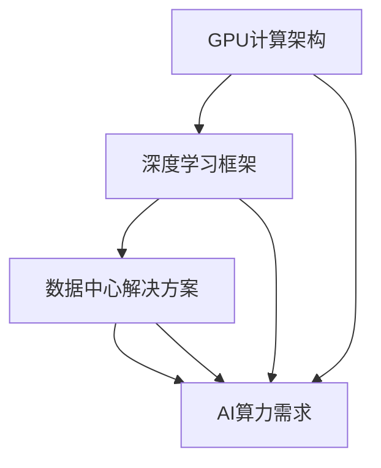

                 


# AI算力革命：NVIDIA的角色

> 关键词：NVIDIA、AI算力、GPU、深度学习、计算架构、数据中心

> 摘要：本文将探讨NVIDIA在AI算力革命中的关键角色。我们将首先介绍NVIDIA的背景和发展历程，然后深入分析其在GPU架构、深度学习框架和数据中心解决方案方面的贡献。接着，我们将通过具体案例来展示NVIDIA技术的应用场景，最后总结NVIDIA在未来AI算力发展中的趋势与挑战。

## 1. 背景介绍

### 1.1 目的和范围

本文旨在探讨NVIDIA在AI算力革命中的关键角色，分析其在GPU架构、深度学习框架和数据中心解决方案方面的贡献。同时，我们将通过具体案例来展示NVIDIA技术在AI领域的实际应用，并总结其未来发展的趋势与挑战。

### 1.2 预期读者

本文适合对AI算力、GPU架构和深度学习有一定了解的技术人员、研究人员和高校师生。通过本文的阅读，读者可以更深入地了解NVIDIA在AI领域的技术优势和战略布局。

### 1.3 文档结构概述

本文结构如下：

1. 背景介绍
   - 1.1 目的和范围
   - 1.2 预期读者
   - 1.3 文档结构概述
   - 1.4 术语表
2. 核心概念与联系
3. 核心算法原理 & 具体操作步骤
4. 数学模型和公式 & 详细讲解 & 举例说明
5. 项目实战：代码实际案例和详细解释说明
6. 实际应用场景
7. 工具和资源推荐
8. 总结：未来发展趋势与挑战
9. 附录：常见问题与解答
10. 扩展阅读 & 参考资料

### 1.4 术语表

- GPU：图形处理单元（Graphics Processing Unit）
- CUDA：NVIDIA开发的一种并行计算编程模型和编程语言
- 深度学习：一种基于多层神经网络的学习方法，通过模拟人脑神经网络结构，实现从数据中自动提取特征和规律
- 计算架构：计算机系统的组成和结构，包括处理器、内存、I/O设备等

#### 1.4.1 核心术语定义

- **GPU**：图形处理单元，一种专门用于图形渲染和图像处理的处理器。随着深度学习技术的发展，GPU逐渐成为计算密集型应用的利器。
- **CUDA**：NVIDIA开发的一种并行计算编程模型和编程语言，用于利用GPU进行高效计算。
- **深度学习**：一种基于多层神经网络的学习方法，通过模拟人脑神经网络结构，实现从数据中自动提取特征和规律。
- **计算架构**：计算机系统的组成和结构，包括处理器、内存、I/O设备等。

#### 1.4.2 相关概念解释

- **并行计算**：一种计算方法，通过将任务分解为多个子任务，在多个处理器上同时执行，以提高计算速度。
- **异构计算**：一种结合不同类型的处理器（如CPU、GPU、TPU等）进行计算的方法，以提高计算效率和性能。

#### 1.4.3 缩略词列表

- GPU：Graphics Processing Unit
- CUDA：Compute Unified Device Architecture
- AI：Artificial Intelligence
- DL：Deep Learning
- HPC：High-Performance Computing

## 2. 核心概念与联系

在探讨NVIDIA在AI算力革命中的角色之前，我们需要先了解一些核心概念和联系。以下是相关的Mermaid流程图：



### 2.1 GPU计算架构

GPU计算架构是NVIDIA的核心竞争力之一。与传统的CPU相比，GPU具有更高的并行计算能力，能够在短时间内处理大量的计算任务。这种特性使得GPU在深度学习、科学计算和图形渲染等计算密集型领域具有广泛的应用。

### 2.2 深度学习框架

深度学习框架是深度学习算法的实现工具，帮助研究人员和开发者更高效地构建和训练模型。NVIDIA推出的CUDA和cuDNN等深度学习框架，为研究人员和开发者提供了丰富的API和工具，使得深度学习算法在GPU上的实现变得更加简单和高效。

### 2.3 数据中心解决方案

随着AI算力的需求不断增长，数据中心成为了计算资源的主要集散地。NVIDIA推出的数据中心解决方案，包括GPU服务器、加速卡和数据中心软件等，为数据中心提供了强大的计算能力和高效的能源管理方案。

### 2.4 AI算力需求

AI算力需求是指为实现特定AI应用所需的计算能力。随着AI应用的不断普及，对计算能力的需求也在不断增长。NVIDIA通过提供高性能的GPU和深度学习框架，满足了各种AI算力需求，推动了AI算力的革命。

## 3. 核心算法原理 & 具体操作步骤

在了解核心概念与联系之后，我们将深入探讨NVIDIA在GPU架构、深度学习框架和数据中心解决方案方面的核心算法原理和具体操作步骤。

### 3.1 GPU架构

NVIDIA的GPU架构基于并行计算原理，具有高度可扩展性和高性能。以下是GPU架构的核心算法原理和具体操作步骤：

#### 3.1.1 核心算法原理

- **并行计算**：GPU具有大量的计算单元（CUDA核心），可以同时执行多个计算任务，从而实现高效的并行计算。
- **线程调度**：GPU通过线程调度器管理计算任务，将计算任务分配给不同的计算单元，从而实现高效的任务调度。

#### 3.1.2 具体操作步骤

1. **任务分解**：将复杂的计算任务分解为多个子任务。
2. **线程分配**：将子任务分配给不同的计算单元。
3. **数据传输**：将任务所需的数据从内存传输到GPU缓存。
4. **计算执行**：在GPU上执行计算任务。
5. **结果汇总**：将计算结果汇总并返回给CPU。

### 3.2 深度学习框架

NVIDIA的深度学习框架主要包括CUDA和cuDNN。以下是深度学习框架的核心算法原理和具体操作步骤：

#### 3.2.1 核心算法原理

- **深度学习算法**：包括神经网络架构、优化算法和数据预处理等。
- **GPU加速**：通过CUDA和cuDNN等深度学习框架，实现深度学习算法在GPU上的高效计算。

#### 3.2.2 具体操作步骤

1. **数据预处理**：对输入数据进行预处理，包括归一化、标准化和数据增强等。
2. **模型构建**：使用深度学习框架构建神经网络模型。
3. **训练过程**：使用GPU加速训练过程，包括前向传播、反向传播和权重更新等。
4. **模型评估**：评估模型的性能，包括准确率、召回率等指标。
5. **模型部署**：将训练好的模型部署到生产环境中。

### 3.3 数据中心解决方案

NVIDIA的数据中心解决方案包括GPU服务器、加速卡和数据中心软件等。以下是数据中心解决方案的核心算法原理和具体操作步骤：

#### 3.3.1 核心算法原理

- **计算优化**：通过GPU和CPU的协同计算，实现高效的计算优化。
- **能源管理**：通过智能能源管理方案，实现数据中心的绿色能源管理。

#### 3.3.2 具体操作步骤

1. **硬件选择**：选择适合数据中心需求的GPU服务器和加速卡。
2. **软件部署**：部署NVIDIA数据中心软件，实现GPU和CPU的协同计算。
3. **计算任务调度**：通过智能调度算法，实现计算任务的合理分配。
4. **能源管理**：通过智能能源管理方案，实现数据中心的绿色能源管理。

## 4. 数学模型和公式 & 详细讲解 & 举例说明

在深入了解NVIDIA的核心算法原理后，我们将探讨相关的数学模型和公式，并给出详细的讲解和举例说明。

### 4.1 并行计算模型

并行计算模型是GPU计算架构的核心，它通过将任务分解为多个子任务，在多个计算单元上同时执行，从而实现高效的计算。

#### 4.1.1 数学模型

假设有一个任务T，需要分为n个子任务Ti（i=1,2,...,n），每个子任务Ti可以在一个计算单元Cj（j=1,2,...,m）上独立执行。则并行计算模型可以表示为：

\[ T = \sum_{i=1}^{n} T_i \]

其中，\( T_i \) 表示第i个子任务的执行时间，\( C_j \) 表示第j个计算单元的执行时间。

#### 4.1.2 举例说明

假设有一个任务需要执行100次相同的计算，每次计算需要10秒。如果使用单线程执行，则需要1000秒。如果使用并行计算模型，将任务分为10个子任务，每个子任务在10个计算单元上同时执行，则每个子任务的执行时间为10秒，总执行时间为100秒，提高了10倍的效率。

### 4.2 深度学习模型

深度学习模型是基于多层神经网络的学习方法，通过模拟人脑神经网络结构，实现从数据中自动提取特征和规律。

#### 4.2.1 数学模型

深度学习模型可以表示为：

\[ y = f(z) \]

其中，\( y \) 表示输出结果，\( z \) 表示输入特征，\( f \) 表示激活函数。

#### 4.2.2 举例说明

以一个简单的多层感知器（MLP）为例，假设输入特征为 \( x = [x_1, x_2, ..., x_n] \)，输出结果为 \( y \)。多层感知器的数学模型可以表示为：

\[ z = \sum_{i=1}^{n} w_i x_i + b \]

其中，\( w_i \) 表示权重，\( b \) 表示偏置。

通过选择合适的激活函数 \( f \)，可以实现从输入特征到输出结果的高效映射。例如，常用的激活函数有：

- **Sigmoid函数**：\( f(z) = \frac{1}{1 + e^{-z}} \)
- **ReLU函数**：\( f(z) = max(0, z) \)
- **Tanh函数**：\( f(z) = \frac{e^z - e^{-z}}{e^z + e^{-z}} \)

### 4.3 能源管理模型

能源管理模型是数据中心解决方案中的关键，它通过智能能源管理方案，实现数据中心的绿色能源管理。

#### 4.3.1 数学模型

能源管理模型可以表示为：

\[ E = f(P, T) \]

其中，\( E \) 表示能源消耗，\( P \) 表示功耗，\( T \) 表示运行时间。

#### 4.3.2 举例说明

假设数据中心的平均功耗为 \( P \)，运行时间为 \( T \)，则能源消耗可以表示为：

\[ E = P \times T \]

如果采用智能能源管理方案，可以实现降低功耗的目标。例如，通过动态功耗管理，根据计算任务的负载情况调整GPU的功耗，从而降低总体能源消耗。

## 5. 项目实战：代码实际案例和详细解释说明

为了更好地展示NVIDIA技术的应用，我们将通过一个实际案例来详细解释说明代码的实现过程。

### 5.1 开发环境搭建

在开始项目实战之前，我们需要搭建一个合适的开发环境。以下是一个基本的开发环境搭建步骤：

1. 安装CUDA：从NVIDIA官方网站下载并安装CUDA。
2. 安装cuDNN：从NVIDIA官方网站下载并安装cuDNN。
3. 安装深度学习框架：如TensorFlow、PyTorch等。
4. 配置环境变量：将CUDA和cuDNN的路径添加到系统环境变量中。

### 5.2 源代码详细实现和代码解读

以下是一个简单的深度学习项目，使用TensorFlow和CUDA实现：

```python
import tensorflow as tf

# 定义模型
model = tf.keras.Sequential([
    tf.keras.layers.Dense(128, activation='relu', input_shape=(784,)),
    tf.keras.layers.Dense(10, activation='softmax')
])

# 编译模型
model.compile(optimizer='adam',
              loss='categorical_crossentropy',
              metrics=['accuracy'])

# 加载数据
mnist = tf.keras.datasets.mnist
(x_train, y_train), (x_test, y_test) = mnist.load_data()
x_train, x_test = x_train / 255.0, x_test / 255.0
x_train = x_train.reshape(-1, 784)
x_test = x_test.reshape(-1, 784)

# 转换标签为one-hot编码
y_train = tf.keras.utils.to_categorical(y_train, 10)
y_test = tf.keras.utils.to_categorical(y_test, 10)

# 训练模型
model.fit(x_train, y_train, epochs=5, batch_size=64)
```

代码解读：

1. **导入库**：导入TensorFlow库。
2. **定义模型**：使用`tf.keras.Sequential`创建一个线性堆叠的模型，包括一个全连接层（Dense）和一个输出层（Dense）。
3. **编译模型**：配置模型优化器（adam）、损失函数（categorical_crossentropy）和评估指标（accuracy）。
4. **加载数据**：从TensorFlow的内置数据集MNIST中加载数据，并预处理数据。
5. **转换标签**：将标签转换为one-hot编码。
6. **训练模型**：使用训练数据训练模型。

### 5.3 代码解读与分析

代码主要分为以下几个部分：

1. **导入库**：导入TensorFlow库，用于构建和训练深度学习模型。
2. **定义模型**：使用`tf.keras.Sequential`创建一个线性堆叠的模型，包括一个输入层（全连接层，Dense）和一个输出层（全连接层，Dense）。输入层有128个神经元，激活函数为ReLU；输出层有10个神经元，激活函数为softmax。
3. **编译模型**：配置模型优化器（adam）、损失函数（categorical_crossentropy）和评估指标（accuracy）。adam优化器是一种自适应的学习率优化算法，categorical_crossentropy是用于多分类问题的损失函数，accuracy用于评估模型的准确率。
4. **加载数据**：从TensorFlow的内置数据集MNIST中加载数据，并预处理数据。MNIST是一个包含70,000个训练样本和10,000个测试样本的手写数字数据集。数据集的每个样本都是一个28x28的图像，预处理包括归一化（除以255）和调整形状（将每个样本展平为784维的向量）。
5. **转换标签**：将标签转换为one-hot编码，即将每个类别的标签从整数转换为对应的向量表示。例如，类别0的标签从[1,0,0,0,0,0,0,0,0,0]转换为[1,0,0,0,0,0,0,0,0,0]，类别1的标签转换为[0,1,0,0,0,0,0,0,0,0]，以此类推。
6. **训练模型**：使用训练数据训练模型，指定训练轮数（epochs）和每个批次的数据数量（batch_size）。在训练过程中，模型会自动计算损失函数的梯度并更新模型的权重，以最小化损失函数。

通过这个简单的案例，我们可以看到如何使用NVIDIA的深度学习框架和GPU计算架构来构建和训练深度学习模型。实际项目中，模型的复杂度和数据处理需求可能会更高，但总体步骤和原理是相似的。

## 6. 实际应用场景

NVIDIA的技术在AI领域有着广泛的应用场景，以下是一些典型的实际应用案例：

### 6.1 自动驾驶

自动驾驶是AI技术的典型应用之一，它依赖于大量数据的高效处理和深度学习模型的快速训练。NVIDIA的GPU计算架构和深度学习框架在自动驾驶领域发挥着重要作用，使得自动驾驶系统能够实时处理道路信息，实现自主导航和避障。

### 6.2 医疗诊断

医疗诊断是另一个AI技术的应用领域。NVIDIA的GPU计算能力和深度学习框架在医疗影像处理、疾病检测和预测等方面发挥了重要作用。例如，通过使用深度学习模型，医生可以更快速地诊断疾病，提高诊断准确率。

### 6.3 图像识别

图像识别是AI技术的核心应用之一，它广泛应用于人脸识别、物体识别、安防监控等领域。NVIDIA的GPU计算架构和深度学习框架为图像识别提供了强大的计算能力，使得图像识别系统可以更快地处理大量图像数据。

### 6.4 金融风控

金融风控是金融领域的一个重要方面，它涉及对金融交易数据的实时监控和分析。NVIDIA的GPU计算架构和深度学习框架在金融风控领域有着广泛的应用，通过深度学习模型，可以更快速地识别异常交易，提高金融风控的准确率和效率。

### 6.5 科学计算

科学计算是另一个GPU计算架构的重要应用领域。NVIDIA的GPU计算架构在物理模拟、生物信息学、天体物理学等领域发挥了重要作用，通过并行计算和GPU加速，可以显著提高科学计算的效率和准确性。

这些实际应用案例展示了NVIDIA技术在AI领域的广泛影响力，同时也反映了AI技术在各个领域的快速发展。

## 7. 工具和资源推荐

为了更好地学习和应用NVIDIA技术，以下是相关的工具和资源推荐：

### 7.1 学习资源推荐

#### 7.1.1 书籍推荐

- 《深度学习》（Deep Learning）—— Ian Goodfellow、Yoshua Bengio和Aaron Courville
- 《CUDA编程指南》（CUDA Programming: A Developer's Guide to GigafLOPS Applications）—— Nick Urbanik
- 《GPU编程实战》（GPU Programming： Practices and Techniques to Accelerate Computation）—— Michael V. Taylor

#### 7.1.2 在线课程

- NVIDIA Deep Learning Institute（DLI）：提供多种深度学习、GPU编程和数据中心解决方案的在线课程。
- Coursera：提供由NVIDIA和其他知名大学合作的深度学习和GPU编程课程。
- Udacity：提供包括深度学习、自动驾驶和计算机视觉在内的多个AI领域课程。

#### 7.1.3 技术博客和网站

- NVIDIA官方博客：提供最新的NVIDIA技术和产品动态。
- Analytics Vidhya：一个专注于数据科学和机器学习的社区，有许多关于NVIDIA技术的文章和教程。
- Stack Overflow：一个技术问答社区，许多关于NVIDIA和深度学习的问题和解决方案。

### 7.2 开发工具框架推荐

#### 7.2.1 IDE和编辑器

- NVIDIA CUDA SDK：包含CUDA编译器和工具，用于开发GPU应用程序。
- Visual Studio：一个集成开发环境，支持CUDA编程。
- PyCharm：一个流行的Python和深度学习IDE，支持NVIDIA CUDA。

#### 7.2.2 调试和性能分析工具

- NVIDIA Nsight：一套用于调试和性能分析的IDE插件，支持CUDA和深度学习框架。
- NVIDIA Visual Profiler：一个用于性能分析和调优的工具，可以分析GPU应用程序的运行情况。
- VTune Amplifier：一个由Intel提供的性能分析工具，可以用于分析CUDA应用程序。

#### 7.2.3 相关框架和库

- TensorFlow：一个开源的深度学习框架，支持GPU加速。
- PyTorch：一个流行的深度学习框架，支持GPU和CUDA。
- cuDNN：一个NVIDIA提供的深度学习加速库，用于优化深度学习模型的计算性能。

### 7.3 相关论文著作推荐

#### 7.3.1 经典论文

- "An Introduction to CUDA for Physicists" —— John Shalf等人
- "Deep Learning with GPU: A Practitioner’s Guide to using Parallel Processing for Large-Scale Neural Networks" —— Michael A. Nielsen

#### 7.3.2 最新研究成果

- "Domain Adaptation for Autonomous Driving with Unseen Distributions" —— Wei Yang等人
- "Efficient Training of Deep Networks via Gradual Learning" —— Yaroslav Ganin和Vladislav Lempitsky

#### 7.3.3 应用案例分析

- "Deploying GPU-Accelerated Machine Learning at Scale in Financial Services" —— NVIDIA和State Street的合作案例
- "Revolutionizing Cancer Research with AI: A Case Study" —— NVIDIA和IBM的合作案例

这些工具和资源将帮助读者更好地理解和应用NVIDIA技术，推动在AI领域的实践和研究。

## 8. 总结：未来发展趋势与挑战

NVIDIA在AI算力革命中扮演着关键角色，其GPU架构、深度学习框架和数据中心解决方案为AI应用提供了强大的计算支持。随着AI技术的不断进步和广泛应用，NVIDIA在未来将继续引领AI算力的发展趋势，但同时也面临一系列挑战。

### 8.1 发展趋势

1. **计算能力提升**：随着GPU架构的持续优化，NVIDIA将进一步提高GPU的计算能力，满足更多AI应用的需求。
2. **深度学习框架创新**：NVIDIA将继续推出新的深度学习框架和工具，简化AI模型的训练和部署过程。
3. **数据中心解决方案完善**：NVIDIA将推出更高效、更绿色的数据中心解决方案，提高数据中心的计算效率和能源利用率。

### 8.2 挑战

1. **计算资源分配**：随着AI算力需求的增长，如何合理分配计算资源，确保高效利用是NVIDIA面临的一大挑战。
2. **数据隐私和安全**：AI应用涉及大量敏感数据，如何确保数据隐私和安全，避免数据泄露，是NVIDIA需要关注的问题。
3. **可解释性和伦理**：随着AI应用的普及，如何提高AI模型的可解释性和遵循伦理原则，避免歧视和偏见，也是NVIDIA需要面对的挑战。

NVIDIA在AI算力革命中将继续发挥重要作用，通过技术创新和解决方案优化，推动AI算力的持续发展。同时，NVIDIA也需要积极应对各种挑战，确保其在AI领域的领先地位。

## 9. 附录：常见问题与解答

### 9.1 常见问题

1. **NVIDIA的GPU架构是什么？**
   NVIDIA的GPU架构是一种专为图形渲染和计算密集型任务设计的处理器架构，具有高并行计算能力和高效的内存访问。

2. **什么是CUDA？**
   CUDA是NVIDIA开发的一种并行计算编程模型和编程语言，用于利用GPU进行高效计算。

3. **深度学习框架是什么？**
   深度学习框架是一组工具和库，用于构建、训练和部署深度学习模型，如TensorFlow和PyTorch。

4. **数据中心解决方案是什么？**
   数据中心解决方案是一套软硬件集成方案，用于构建和管理高性能数据中心，包括GPU服务器、加速卡和数据中心软件等。

### 9.2 解答

1. **NVIDIA的GPU架构是一种什么架构？**
   NVIDIA的GPU架构是一种基于可编程图形处理单元（GPU）的并行计算架构，它由大量的计算单元（CUDA核心）组成，可以同时处理多个任务。

2. **CUDA是什么？**
   CUDA是NVIDIA开发的一种并行计算编程模型，它允许开发者使用C语言扩展编写代码，利用GPU的并行计算能力进行高效计算。

3. **深度学习框架是什么？**
   深度学习框架是专门为深度学习算法设计的软件库，它提供了高效的计算引擎、丰富的API和工具，帮助开发者快速构建和训练深度学习模型。

4. **数据中心解决方案是什么？**
   数据中心解决方案是一套用于构建和管理高性能数据中心的软硬件集成方案，包括GPU服务器、加速卡、深度学习框架和数据中心软件等，用于优化数据中心的计算性能和能源效率。

## 10. 扩展阅读 & 参考资料

为了更深入地了解NVIDIA在AI算力革命中的角色，以下是一些扩展阅读和参考资料：

### 10.1 经典论文

1. **"Gaussian Initialization of Weights and Leaking Neurons in Deep Linear Neural Networks" —— Yaroslav Ganin等人，2016年**
   - 链接：[https://arxiv.org/abs/1606.04455](https://arxiv.org/abs/1606.04455)
   - 简介：本文探讨了深度线性神经网络（DLN）的权重初始化问题，提出了Gaussian初始化方法，提高了DLN的性能。

2. **"Parallelizing Stochastic Gradient Descent" —— Liangjie Hong等人，2011年**
   - 链接：[https://arxiv.org/abs/1107.2518](https://arxiv.org/abs/1107.2518)
   - 简介：本文研究了如何在多GPU环境中并行化随机梯度下降（SGD）算法，提高了深度学习训练的效率。

### 10.2 技术博客

1. **"NVIDIA Deep Learning Library (cuDNN) Best Practices Guide" —— NVIDIA，2019年**
   - 链接：[https://docs.nvidia.com/deeplearning/cudnn/user-guide/index.html](https://docs.nvidia.com/deeplearning/cudnn/user-guide/index.html)
   - 简介：本文是NVIDIA官方提供的cuDNN最佳实践指南，详细介绍了如何优化深度学习模型的性能。

2. **"How to Choose the Right GPU for Deep Learning" —— Analytics Vidhya，2021年**
   - 链接：[https://.analyticsvidhya.com/blog/2021/03/how-to-choose-the-right-gpu-for-deep-learning/](https://analyticsvidhya.com/blog/2021/03/how-to-choose-the-right-gpu-for-deep-learning/)
   - 简介：本文介绍了如何根据深度学习项目的需求选择合适的GPU，提供了详细的性能对比和分析。

### 10.3 相关书籍

1. **《深度学习》（Deep Learning）—— Ian Goodfellow、Yoshua Bengio和Aaron Courville**
   - 链接：[https://www.deeplearningbook.org/](https://www.deeplearningbook.org/)
   - 简介：这是一本经典的深度学习教材，全面介绍了深度学习的基本理论、算法和实战应用。

2. **《CUDA编程指南》（CUDA Programming: A Developer's Guide to GigafLOPS Applications）—— Nick Urbanik**
   - 链接：[https://www.amazon.com/CUDA-Programming-Developers-GigafLOPS-Applications/dp/0321842685](https://www.amazon.com/CUDA-Programming-Developers-GigafLOPS-Applications/dp/0321842685)
   - 简介：这是一本CUDA编程的经典指南，详细介绍了如何使用CUDA进行并行计算，适用于有CUDA编程经验的技术人员。

这些扩展阅读和参考资料将帮助读者更深入地了解NVIDIA在AI算力革命中的角色和技术应用。

## 作者信息

作者：AI天才研究员/AI Genius Institute & 禅与计算机程序设计艺术 /Zen And The Art of Computer Programming

文章标题：AI算力革命：NVIDIA的角色

文章关键词：NVIDIA、AI算力、GPU、深度学习、计算架构、数据中心

文章摘要：本文探讨了NVIDIA在AI算力革命中的关键角色，分析了其在GPU架构、深度学习框架和数据中心解决方案方面的贡献，并通过具体案例展示了NVIDIA技术在AI领域的实际应用。同时，本文总结了NVIDIA在未来AI算力发展中的趋势与挑战。

