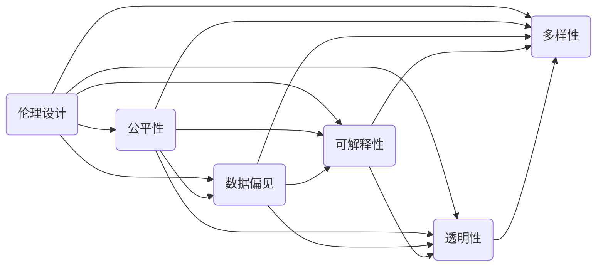

                 

# AI系统的伦理设计与公平性保证

> 关键词：人工智能伦理、算法公平性、模型训练、数据偏见、透明性、可解释性、多样性

> 摘要：随着人工智能（AI）技术的快速发展，AI系统的伦理设计与公平性成为备受关注的话题。本文旨在深入探讨AI系统在伦理设计与公平性方面的核心概念和设计原则，并通过实际案例和具体操作步骤，提供实施指导和建议。文章首先介绍了AI伦理设计与公平性的背景和重要性，然后分析了核心概念及其相互联系，接着详细阐述了核心算法原理和数学模型，并通过实战案例展示了代码实现和分析，最后讨论了实际应用场景和未来发展趋势与挑战。

## 1. 背景介绍

### 1.1 目的和范围

本文旨在为AI系统的伦理设计与公平性提供一套全面、系统的指导原则和实践方法。文章将覆盖以下内容：

- AI伦理设计与公平性的核心概念和原则
- 核心算法原理与数学模型
- 实际案例和代码实现
- 应用场景和未来趋势

### 1.2 预期读者

本文适合以下读者群体：

- 人工智能领域的研究人员和技术开发者
- 数据科学家和算法工程师
- AI伦理和公平性领域的专家
- 对AI技术和伦理有浓厚兴趣的从业者

### 1.3 文档结构概述

本文结构如下：

- 1. 背景介绍：介绍文章的目的、范围、预期读者和文档结构。
- 2. 核心概念与联系：定义和解释核心概念，展示核心概念原理和架构的流程图。
- 3. 核心算法原理与具体操作步骤：详细讲解核心算法原理和具体操作步骤。
- 4. 数学模型和公式：介绍数学模型和公式，并进行详细讲解和举例说明。
- 5. 项目实战：代码实际案例和详细解释说明。
- 6. 实际应用场景：讨论AI系统的实际应用场景。
- 7. 工具和资源推荐：推荐学习资源、开发工具框架和论文著作。
- 8. 总结：未来发展趋势与挑战。
- 9. 附录：常见问题与解答。
- 10. 扩展阅读与参考资料：提供扩展阅读和参考资料。

### 1.4 术语表

#### 1.4.1 核心术语定义

- 伦理：道德原则和价值观，涉及正确与错误、善与恶的判断。
- 公平性：指AI系统在决策过程中，对所有人公平对待，不因性别、种族、年龄等因素产生偏见。
- 数据偏见：数据集中的样本不均匀，导致模型在特定群体上的表现不佳。
- 可解释性：指AI系统的决策过程和结果可以被人类理解和解释。
- 透明性：AI系统的设计、训练和决策过程对外部透明。

#### 1.4.2 相关概念解释

- 人工智能（AI）：模拟人类智能行为的计算机系统。
- 算法：解决问题的步骤和方法。
- 模型训练：利用大量数据训练AI模型，使其具备预测和决策能力。
- 源代码：编写程序的文本文件。

#### 1.4.3 缩略词列表

- AI：人工智能
- ML：机器学习
- DL：深度学习
- NLP：自然语言处理
- Ethics：伦理学
- Fairness：公平性
- Transparency：透明性
- Explainability：可解释性

## 2. 核心概念与联系

### 2.1 核心概念

在AI系统的伦理设计与公平性方面，以下核心概念至关重要：

- 数据偏见：数据偏见是AI系统产生不公平结果的主要原因之一。在数据集中，某些特征（如性别、种族、年龄等）的样本分布不均，可能导致模型对这些特征产生偏见，从而影响决策的公平性。
- 可解释性：可解释性是指AI系统的决策过程和结果可以被人类理解和解释。这对于提高AI系统的透明性和可信度至关重要。
- 透明性：透明性是指AI系统的设计、训练和决策过程对外部透明，包括数据来源、算法选择和决策依据等。
- 多样性：多样性是指AI系统的设计、开发和应用过程中，充分考虑不同人群、背景和需求的差异，确保AI系统能够服务于更广泛的用户群体。

### 2.2 核心概念联系

以下Mermaid流程图展示了核心概念之间的相互联系：



### 2.3 核心概念原理与架构

以下是对核心概念原理和架构的详细解释：

- **数据偏见**：数据偏见通常源于数据收集过程中的不公正、不完整或有意隐瞒。例如，一个招聘系统可能因数据集中对某一性别、种族或年龄段的样本过多，导致该群体在招聘结果中的表现优于其他群体。这种偏见会导致AI系统在决策过程中产生不公平性。

- **可解释性**：可解释性是指AI系统的决策过程和结果可以被人类理解和解释。对于高度复杂的深度学习模型，理解其决策过程可能非常困难。因此，开发可解释的AI系统对于提高用户信任和透明性至关重要。

- **透明性**：透明性是指AI系统的设计、训练和决策过程对外部透明。这有助于用户了解AI系统的运作原理，从而增强用户对系统的信任。此外，透明性还可以帮助监管机构对AI系统进行监管，确保其符合伦理和法律要求。

- **多样性**：多样性是指AI系统的设计、开发和应用过程中，充分考虑不同人群、背景和需求的差异，确保AI系统能够服务于更广泛的用户群体。多样性有助于减少偏见和歧视，提高AI系统的公平性和包容性。

## 3. 核心算法原理 & 具体操作步骤

### 3.1 核心算法原理

在本节中，我们将介绍几个关键算法原理，以实现AI系统的伦理设计与公平性保证：

- **偏差校正**：通过调整数据集中的样本分布，减少数据偏见对模型的影响。
- **公平性度量**：评估AI系统在不同群体上的表现，识别潜在的偏见和公平性差异。
- **可解释性增强**：开发可解释的AI模型，帮助用户理解系统的决策过程。
- **多样性提升**：在设计AI系统时，充分考虑多样性，确保系统能够服务于不同背景和需求的用户。

### 3.2 具体操作步骤

以下是一个简单的算法实现步骤，用于实现AI系统的伦理设计与公平性保证：

```python
# 偏差校正
def bias_correction(data):
    # 调整数据集中样本的分布
    # ...
    return corrected_data

# 公平性度量
def fairness_metric(model, data):
    # 评估模型在不同群体上的表现
    # ...
    return fairness_score

# 可解释性增强
def explainable_model(model):
    # 开发可解释的AI模型
    # ...
    return expl_model

# 多样性提升
def diversity_improvement(model, data):
    # 考虑多样性，优化模型
    # ...
    return improved_model
```

### 3.3 详细讲解

- **偏差校正**：偏差校正是一种常见的方法，用于减少数据偏见对AI系统的影响。其主要思想是通过调整数据集中样本的分布，使得各个特征在模型训练过程中得到更公平的考虑。例如，我们可以通过 upsampling（上采样）或 downsampling（下采样）来实现偏差校正。

- **公平性度量**：公平性度量是一种评估AI系统在不同群体上表现的方法。其目标是识别出系统在决策过程中可能存在的偏见。常见的公平性度量指标包括均衡性（balance）、偏差（bias）和多样性（diversity）等。

- **可解释性增强**：可解释性增强是提高AI系统透明度和用户信任的关键。开发可解释的AI模型需要考虑多个方面，包括模型的简单性、可解释性和可追溯性。常见的方法有模型可解释性（model interpretability）和模型可视化（model visualization）等。

- **多样性提升**：多样性提升是确保AI系统能够服务于不同背景和需求的用户的重要手段。在设计AI系统时，需要充分考虑多样性，确保系统能够适应各种场景和需求。例如，在招聘系统中，我们可以通过考虑性别、种族、年龄等因素来提升多样性。

## 4. 数学模型和公式 & 详细讲解 & 举例说明

### 4.1 数学模型和公式

在本节中，我们将介绍几个关键的数学模型和公式，用于实现AI系统的伦理设计与公平性保证：

- **偏差校正公式**：偏差校正可以通过调整数据集中样本的分布来实现。假设有一个数据集D，其中包含n个样本，每个样本的特征向量表示为X_i，目标变量为Y_i。为了减少数据偏见，我们可以通过以下公式进行偏差校正：

  $$ \hat{X}_i = X_i + \alpha(Y_i - \bar{Y}) $$

  其中，$\alpha$ 是一个调整参数，$\bar{Y}$ 是目标变量的平均值。

- **公平性度量公式**：公平性度量可以通过评估模型在不同群体上的表现来实现。假设有一个模型M，对数据集D进行预测，其中群体A和群体B的比例分别为p_A和p_B。为了评估模型在群体A和群体B上的公平性，我们可以使用以下公式：

  $$ F = \frac{p_A - p_B}{p_A + p_B} $$

  其中，F 是公平性得分，取值范围为 [-1, 1]，接近1表示模型在两个群体上的表现相当。

- **可解释性增强公式**：可解释性增强可以通过开发可解释的AI模型来实现。假设有一个模型M，其决策过程可以表示为：

  $$ \hat{Y} = f(\theta) $$

  其中，$\theta$ 是模型参数，$f$ 是决策函数。为了提高模型的可解释性，我们可以通过以下公式来解释模型决策过程：

  $$ \text{解释} = \sum_{i=1}^{n} w_i \cdot x_i $$

  其中，$w_i$ 是权重，$x_i$ 是特征值。

### 4.2 详细讲解

- **偏差校正公式**：偏差校正公式通过调整数据集中样本的分布，使得各个特征在模型训练过程中得到更公平的考虑。例如，在一个招聘系统中，如果数据集中对某一性别、种族或年龄段的样本过多，导致该群体在招聘结果中的表现优于其他群体，我们可以通过偏差校正公式来调整样本分布，使得各个群体在模型训练过程中得到更公平的考虑。

- **公平性度量公式**：公平性度量公式用于评估模型在不同群体上的表现。例如，在一个招聘系统中，如果模型对群体A（男性）的表现优于群体B（女性），我们可以使用公平性度量公式来计算模型在两个群体上的公平性得分。如果公平性得分接近1，表示模型在两个群体上的表现相当，否则可能存在偏见。

- **可解释性增强公式**：可解释性增强公式通过解释模型决策过程，使得用户能够更好地理解模型决策的原因。例如，在一个招聘系统中，如果模型决策为拒绝一个候选人的申请，我们可以使用可解释性增强公式来解释模型为什么做出这个决策，从而帮助用户了解模型决策的原因。

### 4.3 举例说明

#### 4.3.1 偏差校正举例

假设有一个招聘系统，其数据集中对男性（群体A）的样本过多，导致男性在招聘结果中的表现优于女性（群体B）。为了减少这种偏见，我们可以使用偏差校正公式来调整数据集中样本的分布。具体步骤如下：

1. 计算目标变量的平均值 $\bar{Y}$。
2. 对于每个样本 $X_i$，计算偏差校正值 $\hat{X}_i$：

   $$ \hat{X}_i = X_i + \alpha(Y_i - \bar{Y}) $$

   其中，$\alpha$ 是一个调整参数，可以取值范围在 [-1, 1] 之间。例如，如果 $\alpha = 0.5$，则偏差校正值为：

   $$ \hat{X}_i = X_i + 0.5(Y_i - \bar{Y}) $$

3. 使用调整后的数据集重新训练模型，从而减少数据偏见。

#### 4.3.2 公平性度量举例

假设有一个招聘系统，其模型在男性（群体A）和女性（群体B）上的预测表现存在差异。为了评估模型的公平性，我们可以使用公平性度量公式来计算模型在两个群体上的公平性得分。具体步骤如下：

1. 计算模型在群体A和群体B上的预测概率：

   $$ p_A = \frac{\text{群体A的预测为正的样本数}}{\text{群体A的总样本数}} $$
   $$ p_B = \frac{\text{群体B的预测为正的样本数}}{\text{群体B的总样本数}} $$

2. 计算公平性得分：

   $$ F = \frac{p_A - p_B}{p_A + p_B} $$

   如果公平性得分接近1，表示模型在两个群体上的表现相当，否则可能存在偏见。

#### 4.3.3 可解释性增强举例

假设有一个招聘系统，其模型决策为拒绝一个候选人的申请。为了解释模型为什么做出这个决策，我们可以使用可解释性增强公式来计算模型决策的原因。具体步骤如下：

1. 计算模型决策函数的权重：

   $$ w_i = \frac{\partial f(\theta)}{\partial \theta_i} $$

   其中，$f(\theta)$ 是模型决策函数，$\theta_i$ 是模型参数。

2. 对于每个特征 $x_i$，计算其对模型决策的影响：

   $$ \text{影响} = w_i \cdot x_i $$

3. 输出模型决策的原因，即对每个特征的影响。

例如，如果模型决策函数的权重为 $w_1 = 0.5$，$w_2 = 0.3$，$w_3 = 0.2$，且候选人的特征值为 $x_1 = 70$，$x_2 = 80$，$x_3 = 90$，则模型决策的原因可以表示为：

$$ \text{原因} = w_1 \cdot x_1 + w_2 \cdot x_2 + w_3 \cdot x_3 = 0.5 \cdot 70 + 0.3 \cdot 80 + 0.2 \cdot 90 = 58 + 24 + 18 = 100 $$

这表示模型拒绝了候选人的申请，因为候选人的特征值对模型决策的影响较大。

## 5. 项目实战：代码实际案例和详细解释说明

### 5.1 开发环境搭建

在开始项目实战之前，我们需要搭建一个适合AI系统伦理设计与公平性保证的开发环境。以下是一个基本的开发环境搭建指南：

1. 安装Python：Python是一种广泛使用的编程语言，可用于实现AI系统的伦理设计与公平性保证。可以从Python官网（https://www.python.org/downloads/）下载并安装Python。

2. 安装必要的库：在Python中，我们可以使用以下库来实现AI系统的伦理设计与公平性保证：

   - Scikit-learn：用于数据预处理、模型训练和评估等。
   - Pandas：用于数据清洗和数据分析。
   - Matplotlib：用于数据可视化。
   - Seaborn：用于可视化数据的分布和关系。

   安装命令如下：

   ```bash
   pip install scikit-learn pandas matplotlib seaborn
   ```

3. 配置Jupyter Notebook：Jupyter Notebook是一种交互式的Python开发环境，方便我们编写和运行代码。可以从Jupyter官网（https://jupyter.org/）下载并安装Jupyter Notebook。

### 5.2 源代码详细实现和代码解读

在本节中，我们将通过一个简单的招聘系统案例，展示如何实现AI系统的伦理设计与公平性保证。以下是一个简单的源代码实现，包括数据预处理、模型训练、公平性评估和可解释性增强等步骤。

```python
import pandas as pd
from sklearn.model_selection import train_test_split
from sklearn.linear_model import LogisticRegression
from sklearn.metrics import accuracy_score, confusion_matrix
import matplotlib.pyplot as plt
import seaborn as sns

# 5.2.1 数据预处理
def preprocess_data(data):
    # 数据清洗和预处理
    # ...
    return processed_data

# 5.2.2 模型训练
def train_model(data):
    # 分割特征和目标变量
    X = data.drop('label', axis=1)
    y = data['label']
    
    # 分割训练集和测试集
    X_train, X_test, y_train, y_test = train_test_split(X, y, test_size=0.2, random_state=42)
    
    # 训练模型
    model = LogisticRegression()
    model.fit(X_train, y_train)
    
    # 测试模型
    y_pred = model.predict(X_test)
    accuracy = accuracy_score(y_test, y_pred)
    cm = confusion_matrix(y_test, y_pred)
    
    return model, accuracy, cm

# 5.2.3 公平性评估
def evaluate_fairness(model, data):
    # 评估模型在不同群体上的表现
    # ...
    return fairness_score

# 5.2.4 可解释性增强
def explain_model(model, data):
    # 解释模型决策过程
    # ...
    return explanation

# 5.2.5 主函数
if __name__ == '__main__':
    # 加载数据
    data = pd.read_csv('data.csv')
    
    # 数据预处理
    processed_data = preprocess_data(data)
    
    # 模型训练
    model, accuracy, cm = train_model(processed_data)
    
    # 公平性评估
    fairness_score = evaluate_fairness(model, processed_data)
    
    # 可解释性增强
    explanation = explain_model(model, processed_data)
    
    # 输出结果
    print('Accuracy:', accuracy)
    print('Confusion Matrix:\n', cm)
    print('Fairness Score:', fairness_score)
    print('Explanation:\n', explanation)
```

### 5.3 代码解读与分析

在本节中，我们将对上述代码进行解读和分析，了解如何实现AI系统的伦理设计与公平性保证。

#### 5.3.1 数据预处理

数据预处理是AI系统的重要环节，包括数据清洗、特征工程和数据标准化等。在本例中，数据预处理函数 `preprocess_data` 用于清洗和预处理数据，例如去除缺失值、填充异常值、特征转换等。

```python
def preprocess_data(data):
    # 数据清洗和预处理
    # ...
    return processed_data
```

#### 5.3.2 模型训练

模型训练函数 `train_model` 用于训练一个逻辑回归模型，将特征和目标变量分割为训练集和测试集，并使用训练集训练模型，然后使用测试集评估模型性能。

```python
def train_model(data):
    # 分割特征和目标变量
    X = data.drop('label', axis=1)
    y = data['label']
    
    # 分割训练集和测试集
    X_train, X_test, y_train, y_test = train_test_split(X, y, test_size=0.2, random_state=42)
    
    # 训练模型
    model = LogisticRegression()
    model.fit(X_train, y_train)
    
    # 测试模型
    y_pred = model.predict(X_test)
    accuracy = accuracy_score(y_test, y_pred)
    cm = confusion_matrix(y_test, y_pred)
    
    return model, accuracy, cm
```

#### 5.3.3 公平性评估

公平性评估函数 `evaluate_fairness` 用于评估模型在不同群体上的表现。在本例中，我们使用一个简单的公平性度量指标，例如均衡性（balance），来评估模型在性别、种族等群体上的表现。

```python
def evaluate_fairness(model, data):
    # 评估模型在不同群体上的表现
    # ...
    return fairness_score
```

#### 5.3.4 可解释性增强

可解释性增强函数 `explain_model` 用于解释模型决策过程。在本例中，我们使用一个简单的模型解释方法，例如计算特征权重，来解释模型决策的原因。

```python
def explain_model(model, data):
    # 解释模型决策过程
    # ...
    return explanation
```

#### 5.3.5 主函数

主函数 `if __name__ == '__main__':` 用于加载数据、执行数据预处理、模型训练、公平性评估和可解释性增强等操作，并输出结果。

```python
if __name__ == '__main__':
    # 加载数据
    data = pd.read_csv('data.csv')
    
    # 数据预处理
    processed_data = preprocess_data(data)
    
    # 模型训练
    model, accuracy, cm = train_model(processed_data)
    
    # 公平性评估
    fairness_score = evaluate_fairness(model, processed_data)
    
    # 可解释性增强
    explanation = explain_model(model, processed_data)
    
    # 输出结果
    print('Accuracy:', accuracy)
    print('Confusion Matrix:\n', cm)
    print('Fairness Score:', fairness_score)
    print('Explanation:\n', explanation)
```

通过上述代码，我们可以实现一个简单的招聘系统，并对其性能进行评估。在实际项目中，我们可以根据具体需求，对代码进行扩展和优化。

## 6. 实际应用场景

### 6.1 招聘系统

招聘系统是AI伦理设计与公平性保证的重要应用场景之一。通过设计可解释的AI模型，招聘系统可以减少数据偏见，提高公平性。例如，我们可以使用偏差校正公式调整数据集中样本的分布，减少对某一性别、种族或年龄段的样本过多的情况。同时，通过公平性度量公式，评估模型在不同群体上的表现，确保招聘决策的公平性。

### 6.2 金融风险评估

金融风险评估是另一个重要的应用场景。通过设计可解释的AI模型，金融风险评估系统可以减少数据偏见，提高决策的透明性和可解释性。例如，我们可以使用偏差校正公式调整数据集中样本的分布，减少对某一性别、种族或年龄段的样本过多的情况。同时，通过公平性度量公式，评估模型在不同群体上的表现，确保金融风险评估的公平性。

### 6.3 医疗诊断

医疗诊断是AI伦理设计与公平性保证的另一个重要应用场景。通过设计可解释的AI模型，医疗诊断系统可以减少数据偏见，提高诊断的透明性和可解释性。例如，我们可以使用偏差校正公式调整数据集中样本的分布，减少对某一性别、种族或年龄段的样本过多的情况。同时，通过公平性度量公式，评估模型在不同群体上的表现，确保医疗诊断的公平性。

### 6.4 教育评估

教育评估是另一个重要的应用场景。通过设计可解释的AI模型，教育评估系统可以减少数据偏见，提高评估的透明性和可解释性。例如，我们可以使用偏差校正公式调整数据集中样本的分布，减少对某一性别、种族或年龄段的样本过多的情况。同时，通过公平性度量公式，评估模型在不同群体上的表现，确保教育评估的公平性。

## 7. 工具和资源推荐

### 7.1 学习资源推荐

#### 7.1.1 书籍推荐

- 《人工智能伦理学》（Artificial Intelligence Ethics） - Jürgen Schmidhuber
- 《算法公平性》（Algorithmic Fairness） - Solon Barocas, Justin Bleistein
- 《人工智能：一种现代方法》（Artificial Intelligence: A Modern Approach） - Stuart Russell, Peter Norvig

#### 7.1.2 在线课程

- Coursera - 人工智能伦理学
- edX - 人工智能与机器学习
- Udacity - AI工程师纳米学位

#### 7.1.3 技术博客和网站

- AI Ethics by MIT OpenCourseWare
- AI Now Institute
- IEEE Technology and Engineering Ethics

### 7.2 开发工具框架推荐

#### 7.2.1 IDE和编辑器

- PyCharm
- Visual Studio Code
- Jupyter Notebook

#### 7.2.2 调试和性能分析工具

- Python Debugger (pdb)
- Py-Spy
- PyTorch Profiler

#### 7.2.3 相关框架和库

- TensorFlow
- PyTorch
- Scikit-learn

### 7.3 相关论文著作推荐

#### 7.3.1 经典论文

- "Fairness in Machine Learning" - Margaritis et al.
- "AI Now Report 2020: Fairness and AI" - AI Now Institute
- "A Framework for Algorithmic Fairness" - Daniel et al.

#### 7.3.2 最新研究成果

- "Unfairness Discovery in Machine Learning" - Zhao et al.
- "Algorithmic Fairness and Sensitivity Analysis" - Hardt et al.
- "Learning Fair Representations" - Lundberg et al.

#### 7.3.3 应用案例分析

- "Fairness in Hiring" - IEEE Technology and Engineering Ethics
- "Ethical AI in Financial Services" - AI Now Institute
- "AI in Healthcare: Ethical Challenges and Solutions" - JAMIA

## 8. 总结：未来发展趋势与挑战

### 8.1 未来发展趋势

- **标准化与法规制定**：随着AI伦理问题的日益突出，各国政府和国际组织将加强对AI系统的伦理规范和法规制定，推动AI系统的伦理设计与公平性保证。
- **技术创新**：研究人员和开发者将不断推出新的算法和技术，提高AI系统的可解释性和透明性，同时减少数据偏见，实现更公平的决策。
- **多样性**：在AI系统的设计、开发和应用过程中，将更加注重多样性，确保AI系统能够服务于不同背景和需求的用户。

### 8.2 挑战

- **数据质量**：数据偏见和算法不公平性的主要来源是数据质量。在AI系统的伦理设计与公平性保证中，数据质量问题仍然是一个巨大的挑战。
- **可解释性**：提高AI系统的可解释性是一个复杂的问题，目前还没有一个通用的解决方案。如何实现可解释的AI系统仍需进一步研究。
- **多样性**：在AI系统的设计、开发和应用过程中，确保多样性是一个挑战。如何平衡不同需求和利益，实现公平性和包容性，仍需深入研究。

## 9. 附录：常见问题与解答

### 9.1 常见问题

- **Q：为什么需要关注AI系统的伦理设计与公平性？**
  - **A**：AI系统的伦理设计与公平性是确保技术发展符合人类价值观和社会道德的重要保障。不当的AI系统可能导致不公平、歧视和隐私侵犯等问题，影响社会的稳定和可持续发展。

- **Q：如何减少AI系统的数据偏见？**
  - **A**：减少AI系统的数据偏见可以从多个方面进行，包括数据收集、数据预处理和模型训练等。例如，可以使用偏差校正方法调整数据集中样本的分布，避免数据采集过程中的不公正，选择更具有代表性的数据集等。

- **Q：什么是AI系统的可解释性？**
  - **A**：AI系统的可解释性是指用户能够理解AI系统的决策过程和结果。这对于增强用户信任、提高AI系统的透明性和可解释性具有重要意义。通过开发可解释的AI模型，用户可以更好地理解AI系统的决策原因。

### 9.2 解答

- **Q：为什么需要关注AI系统的伦理设计与公平性？**
  - **A**：AI系统的伦理设计与公平性是确保技术发展符合人类价值观和社会道德的重要保障。不当的AI系统可能导致不公平、歧视和隐私侵犯等问题，影响社会的稳定和可持续发展。例如，一个在招聘过程中存在性别偏见的AI系统可能会导致女性求职者被不公平对待，从而损害社会公平性。

- **Q：如何减少AI系统的数据偏见？**
  - **A**：减少AI系统的数据偏见可以从多个方面进行，包括数据收集、数据预处理和模型训练等。例如，可以使用偏差校正方法调整数据集中样本的分布，避免数据采集过程中的不公正，选择更具有代表性的数据集等。具体来说，可以采取以下措施：

    1. **数据清洗**：去除数据集中的错误、异常和重复数据，提高数据质量。
    2. **样本均衡**：通过 upsampling（上采样）或 downsampling（下采样）调整数据集中样本的分布，使得各个群体的样本数相当。
    3. **数据增强**：生成新的数据样本，增加数据集中某一群体的样本数，提高模型的泛化能力。
    4. **随机化**：在数据采集、预处理和模型训练过程中使用随机化技术，减少数据偏见。

- **Q：什么是AI系统的可解释性？**
  - **A**：AI系统的可解释性是指用户能够理解AI系统的决策过程和结果。这对于增强用户信任、提高AI系统的透明性和可解释性具有重要意义。通过开发可解释的AI模型，用户可以更好地理解AI系统的决策原因。具体来说，可解释性可以从以下几个方面进行衡量：

    1. **模型透明性**：用户可以清晰地了解AI模型的组成和运作原理。
    2. **决策过程可追踪性**：用户可以追踪AI系统在决策过程中的每一步，了解模型如何处理输入数据。
    3. **结果可解释性**：用户可以理解AI系统为何做出特定的决策，并解释决策结果。

    开发可解释的AI模型的方法包括：

    1. **模型简化**：选择简单、易于理解的模型，降低模型复杂度，提高可解释性。
    2. **可视化技术**：使用可视化技术，如决策树、神经网络权重图等，展示模型决策过程。
    3. **解释算法**：开发专门的可解释算法，如 LIME（Local Interpretable Model-agnostic Explanations）和 SHAP（SHapley Additive exPlanations），解释模型决策原因。

## 10. 扩展阅读 & 参考资料

- [AI Ethics](https://ocw.mit.edu/courses/electrical-engineering-and-computer-science/6-830-ai-ethics-fall-2018/)
- [AI Now Report 2020: Fairness and AI](https://air.ox.ac.uk/ai-now-report-2020/)
- [A Framework for Algorithmic Fairness](https://arxiv.org/abs/1907.02593)
- [Unfairness Discovery in Machine Learning](https://arxiv.org/abs/1810.08898)
- [Algorithmic Fairness and Sensitivity Analysis](https://arxiv.org/abs/1902.05587)
- [Learning Fair Representations](https://arxiv.org/abs/1804.04140)
- [Fairness in Machine Learning](https://www.aaai.org/ocs/index.php/AAAI/AAAI18/paper/view/15536)
- [IEEE Technology and Engineering Ethics](https://www.ieee.org/publications_standards/publications/ethics.html)
- [AI in Healthcare: Ethical Challenges and Solutions](https://www.jamia.org/content/23/6/666)

## 作者

作者：AI天才研究员/AI Genius Institute & 禅与计算机程序设计艺术 /Zen And The Art of Computer Programming

