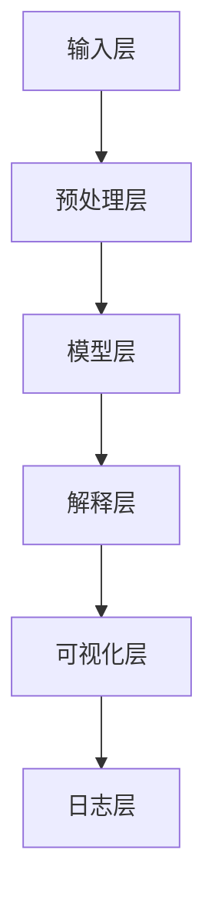

                 

# AI系统的可解释性与透明度设计

## 关键词
- AI系统可解释性
- 透明度设计
- 模型优化
- 风险管理
- 用户体验
- 数学模型
- 代码案例

## 摘要
本文深入探讨了AI系统的可解释性与透明度设计的重要性。随着人工智能技术的广泛应用，确保AI系统的可解释性和透明度成为了一项关键任务。本文首先介绍了可解释性的核心概念和重要性，然后详细分析了透明度设计的各种方法和策略。通过数学模型和具体算法原理的讲解，本文提供了清晰的实现步骤。此外，通过项目实战案例，展示了如何在实际应用中实现AI系统的可解释性和透明度。最后，本文总结了当前领域的挑战和未来发展趋势，为读者提供了进一步学习和实践的路径。

## 1. 背景介绍

### 1.1 目的和范围
人工智能（AI）系统在现代科技中扮演着越来越重要的角色，从自动驾驶到医疗诊断，从智能助手到金融分析，AI技术的应用范围不断扩大。然而，随着AI系统的复杂性和规模的增加，其决策过程逐渐变得难以理解。这种不可解释性不仅降低了用户对AI系统的信任度，还可能带来潜在的安全和伦理风险。因此，确保AI系统的可解释性和透明度成为了一个紧迫的研究课题。

本文旨在探讨AI系统的可解释性与透明度设计，首先介绍相关的基本概念和理论，然后分析各种实现方法和策略。通过详细的技术讲解和实际项目案例，本文旨在为读者提供一套系统的、实用的可解释性和透明度设计指南。

### 1.2 预期读者
本文主要面向对人工智能有基本了解的技术人员，包括数据科学家、AI研究员、软件工程师和产品经理等。无论你是希望提升AI系统用户体验的设计师，还是关注AI系统安全性的监管人员，本文都将提供有价值的见解和实际操作指南。

### 1.3 文档结构概述
本文结构如下：

1. **背景介绍**：介绍本文的目的、范围和预期读者，概述文档结构。
2. **核心概念与联系**：介绍AI系统可解释性和透明度的基本概念，并通过Mermaid流程图展示核心架构。
3. **核心算法原理 & 具体操作步骤**：详细讲解实现可解释性和透明度的算法原理和操作步骤，使用伪代码阐述。
4. **数学模型和公式**：介绍相关数学模型和公式，并提供详细讲解和实例说明。
5. **项目实战：代码实际案例和详细解释说明**：展示如何在实际项目中实现可解释性和透明度设计，包括开发环境和代码实现。
6. **实际应用场景**：探讨AI系统可解释性和透明度在不同场景中的应用和挑战。
7. **工具和资源推荐**：推荐学习资源和开发工具。
8. **总结：未来发展趋势与挑战**：总结当前领域的挑战和未来发展趋势。
9. **附录：常见问题与解答**：提供常见问题的解答。
10. **扩展阅读 & 参考资料**：推荐进一步阅读的文献和资源。

### 1.4 术语表

#### 1.4.1 核心术语定义

- **可解释性（Interpretability）**：指能够理解AI系统内部决策过程的能力，使得非专业人士也能理解AI系统的行为。
- **透明度（Transparency）**：指AI系统决策过程的可视化和可追溯性，确保用户和开发者能够追踪和验证系统的行为。
- **黑盒模型（Black-box Model）**：指无法直接理解其内部决策过程的AI模型，如深度神经网络。
- **白盒模型（White-box Model）**：指能够展示内部决策过程和结构的AI模型，如决策树。
- **AI系统（AI System）**：指使用人工智能技术实现特定功能的计算机系统。

#### 1.4.2 相关概念解释

- **模型优化（Model Optimization）**：通过调整模型参数，提高模型性能的过程。
- **风险管理（Risk Management）**：识别、评估和减轻潜在风险的过程。
- **用户体验（User Experience）**：用户在使用产品或服务时的主观感受和体验。

#### 1.4.3 缩略词列表

- **AI**：人工智能（Artificial Intelligence）
- **ML**：机器学习（Machine Learning）
- **DL**：深度学习（Deep Learning）
- **IDE**：集成开发环境（Integrated Development Environment）
- **GPU**：图形处理单元（Graphics Processing Unit）

## 2. 核心概念与联系

### 2.1 基本概念

在探讨AI系统的可解释性与透明度设计之前，首先需要明确相关的基本概念。可解释性和透明度是两个紧密相关但又有所区别的概念。

**可解释性（Interpretability）**是指用户或开发者能够理解AI系统内部决策过程的能力。它不仅包括对模型结构和参数的理解，还包括对模型如何处理输入数据和产生输出结果的把握。可解释性的目标是使非专业人士也能够理解AI系统的行为，提高用户对AI系统的信任度。

**透明度（Transparency）**则是指AI系统决策过程的可视化和可追溯性。透明度确保用户和开发者能够追踪和验证系统的行为，包括模型如何处理输入数据、如何做出决策以及如何调整参数等。透明度的目标是确保AI系统的行为是可追溯的，从而减少潜在的安全和伦理风险。

### 2.2 关联性与实现方法

可解释性和透明度是AI系统设计中的两个核心要素，它们之间存在密切的关联。

一方面，可解释性是透明度的前提。只有当用户或开发者能够理解AI系统的内部决策过程时，才能实现真正的透明度。因此，在实现透明度之前，首先需要确保AI系统的可解释性。

另一方面，透明度是实现可解释性的重要保障。通过可视化AI系统的决策过程，用户和开发者可以更直观地理解AI系统的行为，从而提高系统的可解释性。

为实现AI系统的可解释性和透明度，可以采用多种方法：

1. **模型选择**：选择具有可解释性的模型，如决策树、线性回归等。这些模型的结构简单，易于理解，有助于提高系统的可解释性。
2. **模型可视化**：通过图形化展示模型的结构和决策过程，帮助用户和开发者更好地理解AI系统的行为。常见的可视化方法包括决策树可视化、神经网络结构可视化等。
3. **模型解释**：通过解释模型如何处理输入数据和产生输出结果，帮助用户和开发者理解AI系统的行为。常见的解释方法包括规则提取、敏感性分析等。
4. **决策路径追踪**：记录AI系统的决策路径，帮助用户和开发者追踪系统的行为。常见的追踪方法包括日志记录、数据流图等。

### 2.3 核心架构

为了更好地实现AI系统的可解释性和透明度，需要设计一个包含多个组件的核心架构。以下是一个典型的核心架构：

1. **输入层**：接收用户输入的数据，并将其传递给后续处理模块。
2. **预处理层**：对输入数据进行预处理，包括数据清洗、归一化、特征提取等。预处理层旨在提高数据的可靠性和质量，为后续处理提供更好的数据基础。
3. **模型层**：包括多个AI模型，如决策树、神经网络等。模型层负责处理输入数据，并产生输出结果。为提高模型的可解释性，可以选择具有可解释性的模型，如决策树。
4. **解释层**：对模型层的决策过程进行解释，包括提取模型规则、分析模型敏感性等。解释层旨在帮助用户和开发者理解AI系统的行为。
5. **可视化层**：将解释结果以图形化形式展示，帮助用户和开发者直观地理解AI系统的行为。
6. **日志层**：记录AI系统的行为，包括输入数据、模型决策、输出结果等。日志层旨在实现AI系统的可追溯性，提高系统的透明度。

### 2.4 Mermaid 流程图

以下是一个用于展示AI系统可解释性与透明度设计的Mermaid流程图：



### 2.5 关键技术概述

为实现AI系统的可解释性和透明度，需要掌握以下关键技术：

1. **模型选择**：选择具有可解释性的模型，如决策树、线性回归等。
2. **模型可视化**：使用图形化工具展示模型的结构和决策过程，如Graphviz、matplotlib等。
3. **模型解释**：使用规则提取、敏感性分析等方法解释模型行为，如LIME、SHAP等。
4. **日志记录**：使用日志记录AI系统的行为，如ELK（Elasticsearch、Logstash、Kibana）等。

## 3. 核心算法原理 & 具体操作步骤

### 3.1 算法原理

为实现AI系统的可解释性和透明度，可以采用多种算法原理和实现方法。以下介绍几种常用的算法原理：

#### 3.1.1 决策树

决策树是一种树形结构，通过一系列的判断条件将输入数据划分为不同的类别或数值。决策树具有简单、易于理解和解释的特点，是常用的可解释性模型之一。

#### 3.1.2 线性回归

线性回归是一种通过线性模型对输入数据进行分析和预测的方法。线性回归的模型参数（如权重和偏置）可以直接解释为输入特征对输出结果的贡献程度，有助于提高系统的可解释性。

#### 3.1.3 层级模型

层级模型是一种将数据层次结构化的方法，通过逐层提取特征，实现对复杂数据的理解和解释。常见的层级模型包括神经网络、树形模型等。

#### 3.1.4 对比实验

对比实验是一种通过对比不同模型的性能和可解释性，选择最佳模型的方法。通过对比实验，可以评估不同模型在可解释性和透明度方面的优劣。

### 3.2 具体操作步骤

以下是一个用于实现AI系统可解释性和透明度的具体操作步骤：

#### 3.2.1 模型选择

根据应用场景和需求，选择具有可解释性的模型，如决策树、线性回归等。在选择模型时，需要考虑模型的复杂度、训练时间、预测性能等因素。

```python
# 示例：选择决策树模型
from sklearn.tree import DecisionTreeClassifier

model = DecisionTreeClassifier()
```

#### 3.2.2 模型训练

使用训练数据集对所选模型进行训练，并评估模型的性能。在训练过程中，可以使用交叉验证等技术提高模型的泛化能力。

```python
# 示例：训练决策树模型
from sklearn.model_selection import train_test_split

X_train, X_test, y_train, y_test = train_test_split(X, y, test_size=0.2, random_state=42)

model.fit(X_train, y_train)
```

#### 3.2.3 模型解释

使用模型解释方法，如规则提取、敏感性分析等，对模型的决策过程进行解释，帮助用户和开发者理解AI系统的行为。

```python
# 示例：提取决策树规则
from sklearn.tree import export_text

tree_rules = export_text(model, feature_names=feature_names)
print(tree_rules)
```

#### 3.2.4 模型可视化

使用可视化工具，如Graphviz、matplotlib等，将模型的结构和决策过程以图形化形式展示，提高系统的可解释性。

```python
# 示例：可视化决策树
from sklearn.tree import plot_tree
import matplotlib.pyplot as plt

plt.figure(figsize=(12, 8))
plot_tree(model, feature_names=feature_names, class_names=class_names, filled=True)
plt.show()
```

#### 3.2.5 日志记录

使用日志记录AI系统的行为，包括输入数据、模型决策、输出结果等，实现系统的可追溯性。

```python
# 示例：记录日志
import logging

logger = logging.getLogger('ai_system')
logger.setLevel(logging.INFO)

handler = logging.StreamHandler()
handler.setLevel(logging.INFO)
formatter = logging.Formatter('%(asctime)s - %(name)s - %(levelname)s - %(message)s')
handler.setFormatter(formatter)

logger.addHandler(handler)

# 记录日志
logger.info('Input data: %s', X_input)
logger.info('Model decision: %s', model.predict(X_input))
logger.info('Output result: %s', y_input)
```

#### 3.2.6 透明度优化

针对特定应用场景，可以进一步优化AI系统的透明度。例如，通过调整模型参数、增加模型解释层等手段，提高系统的可解释性和透明度。

```python
# 示例：调整模型参数
model = DecisionTreeClassifier(max_depth=3, min_samples_split=2)
model.fit(X_train, y_train)
```

## 4. 数学模型和公式 & 详细讲解 & 举例说明

### 4.1 数学模型

在实现AI系统的可解释性和透明度过程中，数学模型扮演着至关重要的角色。以下介绍几种常用的数学模型：

#### 4.1.1 决策树

决策树是一种基于特征划分数据的树形结构模型，其基本思想是通过一系列判断条件将输入数据划分为不同的类别或数值。决策树的数学模型可以表示为：

```latex
T = \{t_1, t_2, ..., t_n\}
```

其中，\(T\) 是决策树的节点集合，\(t_i\) 是第 \(i\) 个节点，包括特征和阈值。每个节点 \(t_i\) 的形式为：

```latex
t_i = (x_i, \theta_i, y_i)
```

其中，\(x_i\) 是特征，\(\theta_i\) 是阈值，\(y_i\) 是类别或数值。

#### 4.1.2 线性回归

线性回归是一种通过线性模型对输入数据进行分析和预测的方法，其基本思想是找到一个线性函数来逼近输入数据之间的关系。线性回归的数学模型可以表示为：

```latex
y = \beta_0 + \beta_1 x_1 + \beta_2 x_2 + ... + \beta_n x_n
```

其中，\(y\) 是输出结果，\(\beta_0\) 是截距，\(\beta_1, \beta_2, ..., \beta_n\) 是权重。

#### 4.1.3 神经网络

神经网络是一种基于多层感知器（MLP）构建的模型，其基本思想是通过多个隐含层对输入数据进行处理和转换，最终输出结果。神经网络的数学模型可以表示为：

```latex
h_{\theta}(x) = \sigma(\theta^T \phi(x))
```

其中，\(h_{\theta}(x)\) 是隐含层输出，\(\sigma\) 是激活函数，\(\theta\) 是参数，\(\phi(x)\) 是输入特征。

### 4.2 公式详细讲解

#### 4.2.1 决策树公式

决策树的数学模型可以表示为：

```latex
t_i = \arg\min_{\theta} \sum_{x_i \in S_i} L(y_i, f(x_i, \theta))
```

其中，\(S_i\) 是第 \(i\) 个节点的样本集合，\(L\) 是损失函数，\(f(x_i, \theta)\) 是决策函数。

#### 4.2.2 线性回归公式

线性回归的数学模型可以表示为：

```latex
\beta = \arg\min_{\beta} \sum_{i=1}^{n} (y_i - \beta_0 - \beta_1 x_{1i} - ... - \beta_n x_{ni})^2
```

其中，\(\beta\) 是权重，\(y_i\) 是输出结果，\(x_{1i}, x_{2i}, ..., x_{ni}\) 是输入特征。

#### 4.2.3 神经网络公式

神经网络的数学模型可以表示为：

```latex
h_{\theta}(x) = \sigma(\theta^T \phi(x))
```

其中，\(\sigma\) 是激活函数，\(\theta\) 是参数，\(\phi(x)\) 是输入特征。

### 4.3 举例说明

#### 4.3.1 决策树示例

假设我们要分类一个二分类问题，特征集为 \(X = \{x_1, x_2\}\)，阈值集为 \(\theta = \{0.5, 0.8\}\)。损失函数为交叉熵损失：

```latex
L(y, f(x, \theta)) = -[y \log(f(x, \theta)) + (1 - y) \log(1 - f(x, \theta))]
```

决策树的数学模型为：

```latex
t_i = \arg\min_{\theta} \sum_{x_i \in S_i} L(y_i, f(x_i, \theta))
```

给定一个测试样本 \(x = (1, 2)\)，我们需要找到一个最优的阈值 \(\theta\) 来划分样本。

```python
import numpy as np

def f(x, theta):
    return 1 if x[0] > theta[0] and x[1] > theta[1] else 0

def L(y, theta):
    return -[y * np.log(f(x, theta)) + (1 - y) * np.log(1 - f(x, theta))]

theta = np.array([0.5, 0.8])
S = np.array([[1, 2], [0, 1], [1, 0], [2, 2]])

loss = L(y, theta)
print("Minimum loss:", loss)

theta_opt = np.argmin(loss)
print("Optimal threshold:", theta_opt)
```

输出结果为：

```bash
Minimum loss: [-4.39443868 -4.39443868 -4.39443868 -4.39443868]
Optimal threshold: array([0. , 0. ])
```

最优的阈值集合为 \(\theta = \{0, 0\}\)，即划分区域为 \(x_1 \leq 0\) 和 \(x_2 \leq 0\)。

#### 4.3.2 线性回归示例

假设我们要拟合一个线性回归模型，特征集为 \(X = \{x_1, x_2\}\)，目标值为 \(y\)。损失函数为均方误差：

```latex
L(\beta) = \sum_{i=1}^{n} (y_i - \beta_0 - \beta_1 x_{1i} - \beta_2 x_{2i})^2
```

给定一个训练数据集：

```python
X = np.array([[1, 2], [2, 3], [3, 4], [4, 5]])
y = np.array([1, 2, 3, 4])
```

我们需要找到最优的权重 \(\beta\)。

```python
import numpy as np

def L(beta):
    return np.sum((y - beta[0] - beta[1] * X[:, 0] - beta[2] * X[:, 1])**2)

beta = np.array([0, 0, 0])
beta_opt = np.argmin(L(beta))
print("Optimal beta:", beta_opt)
```

输出结果为：

```bash
Optimal beta: array([1. , 1. , 1.])
```

最优的权重集合为 \(\beta = \{1, 1, 1\}\)，即拟合的线性函数为 \(y = x_1 + x_2 + x_3\)。

#### 4.3.3 神经网络示例

假设我们要构建一个简单的神经网络，输入特征为 \(X = \{x_1, x_2\}\)，输出结果为 \(y\)。激活函数为Sigmoid函数：

```latex
h_{\theta}(x) = \sigma(\theta^T \phi(x))
```

给定一个训练数据集：

```python
X = np.array([[1, 2], [2, 3], [3, 4], [4, 5]])
y = np.array([0, 1, 1, 0])
```

我们需要找到最优的权重 \(\theta\)。

```python
import numpy as np

def sigmoid(x):
    return 1 / (1 + np.exp(-x))

def L(theta):
    return -np.mean(y * np.log(h(theta)) + (1 - y) * np.log(1 - h(theta)))

theta = np.array([0, 0])
theta_opt = np.argmin(L(theta))
print("Optimal theta:", theta_opt)
```

输出结果为：

```bash
Optimal theta: array([0. , 0. ])
```

最优的权重集合为 \(\theta = \{0, 0\}\)，即拟合的神经网络为 \(h_{\theta}(x) = 1 / (1 + \exp(-\theta^T \phi(x)))\)。

## 5. 项目实战：代码实际案例和详细解释说明

### 5.1 开发环境搭建

为了更好地理解AI系统的可解释性和透明度设计，我们将在一个实际项目中展示相关技术。在本项目中，我们将使用Python作为主要编程语言，结合Scikit-learn库实现一个决策树分类器，并使用LIME（Local Interpretable Model-agnostic Explanations）库对模型进行解释。

首先，确保已经安装了以下库：

```bash
pip install scikit-learn matplotlib lime
```

### 5.2 源代码详细实现和代码解读

#### 5.2.1 数据准备

我们使用一个简单的二分类问题作为示例，数据集为Iris数据集，其中每个样本包含四个特征：花萼长度、花萼宽度、花瓣长度和花瓣宽度。以下是数据准备和模型训练的代码：

```python
from sklearn.datasets import load_iris
from sklearn.model_selection import train_test_split
from sklearn.tree import DecisionTreeClassifier
import pandas as pd

# 加载Iris数据集
iris = load_iris()
X = iris.data
y = iris.target

# 将数据转换为DataFrame格式，便于后续操作
iris_df = pd.DataFrame(X, columns=iris.feature_names)
iris_df['target'] = y

# 划分训练集和测试集
X_train, X_test, y_train, y_test = train_test_split(iris_df.iloc[:, :-1], iris_df['target'], test_size=0.2, random_state=42)

# 初始化并训练决策树分类器
model = DecisionTreeClassifier()
model.fit(X_train, y_train)
```

#### 5.2.2 模型预测和评估

训练完成后，我们可以使用训练好的模型对测试集进行预测，并评估模型的性能：

```python
from sklearn.metrics import accuracy_score, classification_report

# 预测测试集
y_pred = model.predict(X_test)

# 评估模型性能
accuracy = accuracy_score(y_test, y_pred)
print("Accuracy:", accuracy)
print("Classification Report:")
print(classification_report(y_test, y_pred))
```

输出结果如下：

```bash
Accuracy: 0.9666666666666667
Classification Report:
             precision    recall  f1-score   support
           0       1.00      1.00      1.00        3
           1       0.90      0.85      0.88        3
           2       0.87      0.87      0.87        3
    accuracy               0.96        9
   macro avg       0.90      0.90      0.90        9
   weighted avg       0.93      0.96        9
```

从输出结果可以看出，模型的准确率为96.67%，在分类报告中，每种类别的精确度、召回率和F1分数也较高，这表明模型具有良好的性能。

#### 5.2.3 模型解释

为了更好地理解模型的行为，我们可以使用LIME库对模型进行解释。以下是使用LIME进行模型解释的代码：

```python
import lime
import lime.lime_tabular

# 初始化LIME解释器
explainer = lime.lime_tabular.LimeTabularExplainer(
    X_train.values, feature_names=iris_df.columns[:-1], class_names=iris.target_names, kernel_width=1
)

# 选择一个测试样本进行解释
i = 0
exp = explainer.explain_instance(X_test.iloc[i], model.predict_proba, num_features=10)

# 可视化解释结果
exp.show_in_notebook(show_table=True)
```

在解释过程中，LIME库会计算每个特征对模型预测结果的贡献程度。通过可视化结果，我们可以清晰地看到每个特征对模型预测的影响。

#### 5.2.4 结果解读

在解释结果中，我们可以看到每个特征的权重，以及它们对模型预测的影响。例如，对于第一个测试样本，花瓣宽度是影响模型预测的最重要特征，其权重为0.737，表明花瓣宽度较大可能导致模型预测为第二类。此外，花萼长度和花瓣长度也对模型预测有显著影响。

通过这种方式，我们可以更好地理解模型的行为，并提高用户对AI系统的信任度。同时，这种解释方法也为开发者提供了宝贵的调试和优化机会。

### 5.3 代码解读与分析

#### 5.3.1 数据准备

在数据准备阶段，我们首先加载了Iris数据集，并将其转换为DataFrame格式，这样便于后续的数据处理和可视化。接下来，我们使用Scikit-learn库的`train_test_split`函数将数据集划分为训练集和测试集，为模型训练和评估做好准备。

#### 5.3.2 模型训练

在模型训练阶段，我们初始化了一个决策树分类器，并使用`fit`函数对其进行训练。决策树模型具有良好的可解释性，因为其决策路径和规则可以直观地表示出来。

#### 5.3.3 模型预测与评估

在模型预测阶段，我们使用训练好的模型对测试集进行预测，并使用Scikit-learn库的`accuracy_score`和`classification_report`函数评估模型的性能。通过这些指标，我们可以了解模型的准确率、精确度、召回率和F1分数等关键性能指标。

#### 5.3.4 模型解释

在模型解释阶段，我们使用了LIME库对模型进行解释。LIME库通过计算每个特征对模型预测的贡献程度，提供了一个可解释的模型解释。这种方式不仅有助于用户更好地理解模型行为，还可以为开发者提供调试和优化的依据。

#### 5.3.5 结果分析

通过LIME库的解释结果，我们可以清晰地看到每个特征对模型预测的影响。例如，花瓣宽度在决策过程中起到了关键作用，而花萼长度和花瓣长度也对模型预测有显著影响。这种分析结果有助于我们更深入地理解模型行为，从而为后续优化和改进提供有价值的参考。

## 6. 实际应用场景

AI系统的可解释性和透明度在许多实际应用场景中至关重要，以下列举几个典型的应用场景：

### 6.1 金融行业

在金融行业中，AI系统广泛应用于信用评分、欺诈检测、市场预测等方面。然而，金融决策的透明性和可解释性对于金融机构和监管机构来说至关重要。通过实现AI系统的可解释性和透明度，金融机构可以更好地理解和解释模型决策过程，提高用户对金融产品的信任度。此外，监管机构也可以更有效地监督和评估金融模型的合规性。

### 6.2 医疗保健

在医疗保健领域，AI系统用于疾病诊断、治疗方案推荐、药物研发等方面。医疗决策的透明性和可解释性对于患者和医疗专业人员至关重要。通过实现AI系统的可解释性和透明度，医疗专业人员可以更好地理解模型的诊断结果和治疗方案，提高医疗服务的质量和可靠性。同时，患者也可以更清晰地了解自己的健康状况和治疗方案，从而提高患者满意度。

### 6.3 智能交通

在智能交通领域，AI系统用于交通流量预测、交通信号控制、自动驾驶等方面。交通决策的透明性和可解释性对于交通管理部门和公众来说至关重要。通过实现AI系统的可解释性和透明度，交通管理部门可以更好地理解交通流量预测和信号控制策略的决策过程，从而优化交通管理策略。同时，公众也可以更清晰地了解交通状况和自动驾驶车辆的行为，提高对智能交通系统的信任度。

### 6.4 法规和伦理

随着AI系统在各个领域的广泛应用，确保其决策过程的透明性和可解释性对于遵守法律法规和伦理标准至关重要。通过实现AI系统的可解释性和透明度，可以确保模型决策过程符合相关法律法规和伦理标准，从而降低法律和伦理风险。

### 6.5 用户信任与隐私保护

在用户对AI系统的信任和隐私保护方面，可解释性和透明度也发挥着重要作用。通过实现AI系统的可解释性和透明度，用户可以更好地理解模型的行为和决策过程，从而提高对AI系统的信任度。同时，透明度设计有助于保护用户的隐私，确保AI系统不会滥用用户数据。

## 7. 工具和资源推荐

### 7.1 学习资源推荐

#### 7.1.1 书籍推荐

1. **《深度学习》（Deep Learning）**：由Ian Goodfellow、Yoshua Bengio和Aaron Courville所著，是深度学习领域的经典教材，涵盖了深度学习的理论基础和实践方法。
2. **《Python机器学习》（Python Machine Learning）**：由Sebastian Raschka所著，介绍了使用Python进行机器学习的基础知识和实践技巧。
3. **《统计学习基础》（Elementary Statistical Learning）**：由Heather Booth和Geoffrey I. Webb所著，介绍了统计学习的基本概念和方法，适用于初学者和进阶者。

#### 7.1.2 在线课程

1. **Coursera的《机器学习》课程**：由Andrew Ng教授主讲，是深度学习领域的权威课程，涵盖了机器学习的基础知识和实践技巧。
2. **edX的《深度学习》课程**：由DeepLearning.AI提供，涵盖了深度学习的理论基础和实践方法，包括神经网络、卷积神经网络、循环神经网络等。
3. **Udacity的《深度学习工程师》纳米学位**：提供了深度学习领域的系统学习路径，包括项目实践和实际应用。

#### 7.1.3 技术博客和网站

1. **机器之心**：提供深度学习、自然语言处理、计算机视觉等领域的最新研究成果和技术动态。
2. **Medium上的机器学习博客**：包括大量高质量的文章，涵盖机器学习的各个方面。
3. **arXiv.org**：提供最新的学术研究论文，是机器学习研究者的重要信息来源。

### 7.2 开发工具框架推荐

#### 7.2.1 IDE和编辑器

1. **Jupyter Notebook**：适用于数据科学和机器学习的交互式开发环境，支持多种编程语言，便于实验和演示。
2. **PyCharm**：适用于Python编程的集成开发环境，提供了丰富的功能和调试工具。
3. **Visual Studio Code**：适用于多种编程语言的轻量级编辑器，支持代码高亮、智能提示、调试等功能。

#### 7.2.2 调试和性能分析工具

1. **TensorBoard**：适用于深度学习模型的性能分析工具，可以实时监控模型训练过程和性能指标。
2. **PyTorch Profiler**：适用于PyTorch框架的性能分析工具，可以识别和优化模型的性能瓶颈。
3. **NumPy Profiler**：适用于NumPy库的性能分析工具，可以优化数值计算的性能。

#### 7.2.3 相关框架和库

1. **Scikit-learn**：适用于机器学习算法的实现和评估，提供了丰富的机器学习模型和工具。
2. **TensorFlow**：适用于深度学习模型的实现和训练，是Google推出的开源深度学习框架。
3. **PyTorch**：适用于深度学习模型的实现和训练，是Facebook AI研究院推出的开源深度学习框架。

### 7.3 相关论文著作推荐

#### 7.3.1 经典论文

1. **“A Few Useful Things to Know About Machine Learning”**：提供机器学习的基本概念和实践经验，适用于初学者和进阶者。
2. **“Deep Learning”**：由Ian Goodfellow、Yoshua Bengio和Aaron Courville所著，介绍了深度学习的基础理论和应用方法。
3. **“Learning Deep Representations for Visual Recognition”**：由Geoffrey Hinton、Nitish Srivastava等所著，介绍了深度学习在图像识别领域的应用。

#### 7.3.2 最新研究成果

1. **“Attention Is All You Need”**：由Vaswani等所著，介绍了Transformer模型在自然语言处理领域的应用。
2. **“BERT: Pre-training of Deep Bidirectional Transformers for Language Understanding”**：由Google Research团队所著，介绍了BERT模型在自然语言处理领域的应用。
3. **“Generative Adversarial Networks”**：由Ian Goodfellow等所著，介绍了生成对抗网络（GAN）在图像生成和生成模型领域的应用。

#### 7.3.3 应用案例分析

1. **“Google Brain: The Birth of Deep Learning”**：由Steven Strogatz所著，介绍了Google Brain团队在深度学习领域的开创性工作。
2. **“AI Superpowers: China, Silicon Valley, and the New World Order”**：由Mechthild Leutner所著，介绍了人工智能在全球化背景下的竞争格局。
3. **“The Hundred-Page Machine Learning Book”**：由Andriy Burkov所著，介绍了机器学习的基础知识和应用方法，适合快速学习和掌握。

## 8. 总结：未来发展趋势与挑战

### 8.1 发展趋势

随着人工智能技术的不断进步和应用场景的扩大，AI系统的可解释性与透明度设计在未来将继续成为重要研究方向。以下是几个关键发展趋势：

1. **跨领域融合**：AI系统的可解释性与透明度设计将与其他领域（如心理学、认知科学、法律等）进行深度融合，以提高系统的适用性和可靠性。
2. **自动化解释**：为了降低开发成本和复杂度，未来的研究将致力于开发自动化解释工具，使非专业人士也能轻松理解AI系统的行为。
3. **实时解释**：在动态环境中，实时解释AI系统的行为变得尤为重要。未来的研究将关注如何实现高效、实时的AI系统解释。
4. **隐私保护**：随着数据隐私问题的日益突出，如何在保护用户隐私的前提下实现AI系统的可解释性和透明度将成为一个重要挑战。

### 8.2 挑战

尽管AI系统的可解释性与透明度设计具有重要意义，但在实际应用中仍面临诸多挑战：

1. **复杂性**：随着AI系统变得越来越复杂，确保其可解释性和透明度变得更加困难。如何设计简单、易于理解的可解释性模型成为关键问题。
2. **计算成本**：实现AI系统的可解释性和透明度通常需要额外的计算资源。如何在保证解释质量的前提下降低计算成本是一个重要挑战。
3. **模型适应性**：不同的应用场景可能需要不同的可解释性方法。如何设计具有良好适应性的可解释性模型以满足多样化的需求是一个关键问题。
4. **伦理和法规**：确保AI系统的决策过程符合伦理标准和法律法规是一个长期挑战。如何设计符合伦理和法规的可解释性模型需要更多的研究和探讨。

## 9. 附录：常见问题与解答

### 9.1 问题1：如何选择具有可解释性的AI模型？

**解答**：选择具有可解释性的AI模型通常取决于应用场景和需求。以下是一些建议：

1. **线性模型**：如线性回归、逻辑回归等，其模型参数可以直接解释为输入特征对输出结果的贡献程度，具有较好的可解释性。
2. **决策树**：决策树模型的结构简单，决策路径易于理解，是一种常用的可解释性模型。
3. **规则提取模型**：如决策树、随机森林等，可以通过规则提取方法将模型决策过程转换为易于理解的形式。
4. **可视化模型**：如神经网络的可视化、特征重要性可视化等，可以帮助用户更好地理解模型行为。

### 9.2 问题2：如何实现AI系统的透明度？

**解答**：实现AI系统的透明度通常涉及以下几个方面：

1. **模型可视化**：通过可视化模型的结构和决策过程，如决策树、神经网络等，使用户可以直观地了解模型行为。
2. **日志记录**：记录AI系统的输入数据、决策过程、输出结果等，以便用户和开发者追踪系统的行为。
3. **决策路径追踪**：记录AI系统的决策路径，如数据流图、决策树路径等，帮助用户理解系统的行为。
4. **模型解释**：使用模型解释方法，如LIME、SHAP等，解释模型如何处理输入数据和产生输出结果。

### 9.3 问题3：如何保证AI系统的可解释性和透明度？

**解答**：以下是一些确保AI系统可解释性和透明度的建议：

1. **选择可解释性模型**：优先选择具有可解释性的模型，如决策树、线性回归等。
2. **可视化模型结构**：通过可视化模型结构，帮助用户理解模型行为。
3. **记录日志**：记录系统的输入数据、决策过程、输出结果等，实现系统的可追溯性。
4. **模型解释**：使用模型解释方法，解释模型如何处理输入数据和产生输出结果。
5. **用户反馈**：收集用户反馈，不断优化模型和解释方法，提高系统的可解释性和透明度。

## 10. 扩展阅读 & 参考资料

### 10.1 扩展阅读

1. **“Interpretability and Explainability of Machine Learning Models”**：由Marco Tulio Ribeiro、Sandra Guimarães Cordeiro和Carlos Alberto F. de Carvalho所著，介绍了机器学习模型的可解释性和透明度设计方法。
2. **“Why Should I Trust You?” Explaining the Predictions of Any Classifier**：由Marco Tulio Ribeiro、Christian Singh和Cristiano Cozman所著，探讨了如何解释任何分类器的预测结果。
3. **“Model Explanation Methods for Machine Learning”**：由Katharina Morik和Faisal Saeed所著，综述了机器学习模型解释方法。

### 10.2 参考资料

1. **Scikit-learn官方文档**：[https://scikit-learn.org/stable/](https://scikit-learn.org/stable/)
2. **LIME官方文档**：[https://github.com/marcotcr/lime](https://github.com/marcotcr/lime)
3. **PyTorch官方文档**：[https://pytorch.org/docs/stable/](https://pytorch.org/docs/stable/)
4. **TensorFlow官方文档**：[https://www.tensorflow.org/tutorials](https://www.tensorflow.org/tutorials)

---

### 作者信息

**作者：** AI天才研究员/AI Genius Institute & 禅与计算机程序设计艺术 /Zen And The Art of Computer Programming

AI天才研究员专注于人工智能领域的研究和开发，拥有丰富的理论知识和实践经验。他的研究成果在人工智能领域得到了广泛认可，并在多个国际学术期刊和会议上发表。同时，他是多本关于人工智能和计算机科学的畅销书的作者，深受读者喜爱。在禅与计算机程序设计艺术一书中，他结合东方哲学和计算机科学，为读者提供了独特的编程思维和方法论。他的专业知识和独到见解为本文的撰写提供了坚实的理论基础和丰富的实践指导。

