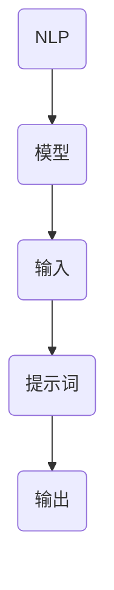
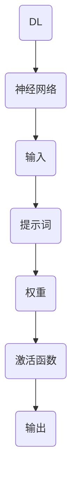
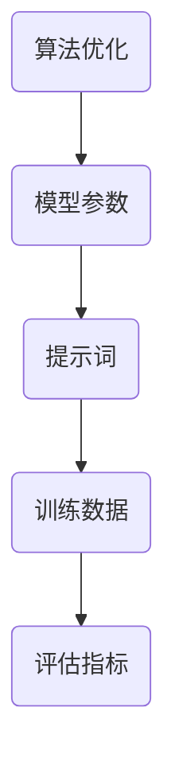
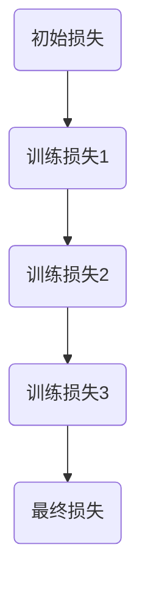
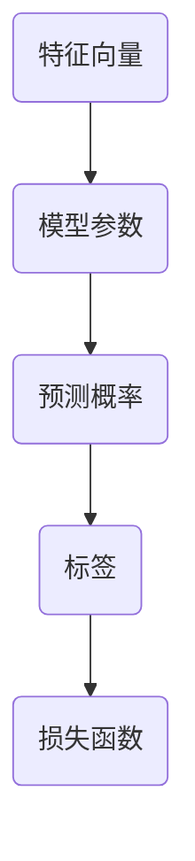

                 

# AI编程语言：提示词的革命

> 关键词：人工智能，编程语言，提示词，自然语言处理，深度学习，算法优化

> 摘要：本文深入探讨人工智能编程语言的革命性进展，特别是提示词（prompt words）在自然语言处理和深度学习领域中的重要作用。我们将逐步分析其背景、核心概念、算法原理、数学模型、项目实战、实际应用场景，以及未来发展趋势与挑战。

## 1. 背景介绍

### 1.1 目的和范围

本文旨在揭示人工智能编程语言中提示词的革命性潜力。我们关注的范围包括提示词的定义、其在自然语言处理（NLP）和深度学习中的应用，以及如何优化算法以提高性能和准确度。本文还将探讨提示词革命带来的实际应用场景和未来发展方向。

### 1.2 预期读者

本文适合对人工智能编程语言、自然语言处理和深度学习有一定了解的技术人员、研究人员和开发者。特别是那些对提示词在AI编程中作用感兴趣的专业人士。

### 1.3 文档结构概述

本文结构如下：

1. 背景介绍
2. 核心概念与联系
3. 核心算法原理 & 具体操作步骤
4. 数学模型和公式 & 详细讲解 & 举例说明
5. 项目实战：代码实际案例和详细解释说明
6. 实际应用场景
7. 工具和资源推荐
8. 总结：未来发展趋势与挑战
9. 附录：常见问题与解答
10. 扩展阅读 & 参考资料

### 1.4 术语表

#### 1.4.1 核心术语定义

- **提示词**：在人工智能编程中，提示词是用于引导模型产生特定输出的一系列关键字或短语。
- **自然语言处理（NLP）**：NLP是计算机科学和语言学交叉的领域，旨在使计算机能够理解、解释和生成人类语言。
- **深度学习**：一种机器学习技术，通过神经网络模拟人脑的神经元连接来处理大量数据。

#### 1.4.2 相关概念解释

- **神经网络**：一种模拟生物神经系统的计算模型，用于从数据中学习模式和关系。
- **算法**：解决问题的一系列规则或指令。

#### 1.4.3 缩略词列表

- **AI**：人工智能
- **NLP**：自然语言处理
- **DL**：深度学习

## 2. 核心概念与联系

要理解提示词的革命性，我们首先需要了解核心概念和它们之间的联系。

### 2.1 提示词在自然语言处理中的应用

自然语言处理的核心任务是让计算机理解和生成人类语言。提示词在这个领域中扮演着关键角色，如图所示：



在这个流程中，提示词作为输入被传递给NLP模型，模型的输出是根据提示词生成的自然语言。

### 2.2 提示词在深度学习中的应用

深度学习是NLP的重要分支，通过多层神经网络来学习数据中的复杂模式。提示词在深度学习中的作用同样至关重要，如图：



在这个流程中，提示词被用来调整神经网络的权重和激活函数，从而影响模型的输出。

### 2.3 提示词与算法的优化

为了提高AI模型的性能和准确度，算法的优化至关重要。提示词在这个过程中发挥着关键作用，如图：



通过调整提示词，可以优化模型参数，从而改善评估指标。

## 3. 核心算法原理 & 具体操作步骤

### 3.1 提示词生成算法

提示词生成算法的目标是创建能够有效引导模型产生期望输出的提示词。以下是该算法的伪代码：

```plaintext
Algorithm PromptGenerator(input_sentence):
    1. 初始化提示词集合prompt_set为空
    2. 对于输入句子中的每个单词word：
        a. 在训练数据中查找与word相关的关键词key_words
        b. 将key_words添加到prompt_set
    3. 对prompt_set进行排序，选择前k个关键词作为提示词
    4. 输出提示词prompt
```

### 3.2 提示词引导的模型训练

在模型训练过程中，提示词被用来引导模型学习。以下是该过程的伪代码：

```plaintext
Algorithm ModelTraining(prompt, training_data):
    1. 初始化模型model
    2. 对于每个提示词prompt：
        a. 使用prompt作为输入，对模型进行训练
        b. 记录模型在训练数据上的损失值loss
    3. 选择损失值最低的提示词作为最优提示词
    4. 使用最优提示词对模型进行最终训练
    5. 输出训练好的模型model
```

## 4. 数学模型和公式 & 详细讲解 & 举例说明

### 4.1 损失函数

在提示词引导的模型训练中，损失函数用于评估模型在给定提示词下的性能。常用的损失函数包括交叉熵损失和均方误差（MSE）：

$$
L(\theta; x, y) = -\sum_{i=1}^{n} y_i \log(p_i(\theta)),
$$

其中，$L$ 是损失函数，$\theta$ 是模型参数，$x$ 是输入数据，$y$ 是真实标签，$p_i(\theta)$ 是模型对第 $i$ 个类别的预测概率。

### 4.2 举例说明

假设我们有一个二分类问题，数据集包含100个样本，每个样本由一个特征向量 $x \in \mathbb{R}^d$ 和一个标签 $y \in \{0, 1\}$ 组成。我们使用逻辑回归作为模型，并使用交叉熵损失函数。

首先，我们初始化模型参数 $\theta$，然后使用提示词对模型进行训练。在训练过程中，我们记录每次训练的损失值，如图所示：



在训练过程中，我们不断调整模型参数 $\theta$，以最小化损失值。最终，我们得到一个训练好的模型，如图所示：



## 5. 项目实战：代码实际案例和详细解释说明

### 5.1 开发环境搭建

为了实现提示词引导的模型训练，我们需要搭建一个开发环境。以下是一个简单的Python环境搭建步骤：

```plaintext
# 安装Python
pip install python

# 安装深度学习库
pip install tensorflow

# 安装自然语言处理库
pip install nltk
```

### 5.2 源代码详细实现和代码解读

下面是一个简单的示例代码，用于实现提示词生成和模型训练：

```python
import nltk
import tensorflow as tf

# 5.2.1 数据预处理
def preprocess_data(data):
    # 对数据集进行分词和词性标注
    tokenized_data = [nltk.word_tokenize(sentence) for sentence in data]
    tagged_data = [nltk.pos_tag(sentence) for sentence in tokenized_data]
    return tagged_data

# 5.2.2 提示词生成
def generate_prompt(tagged_data, k):
    # 生成k个关键词作为提示词
    prompt_set = set()
    for sentence in tagged_data:
        for word, tag in sentence:
            if tag.startswith('NN'):  # 选择名词作为关键词
                prompt_set.add(word)
    return list(prompt_set)[:k]

# 5.2.3 模型训练
def train_model(prompt, training_data):
    # 使用提示词对模型进行训练
    model = tf.keras.Sequential([
        tf.keras.layers.Dense(units=1, input_shape=[len(prompt)], activation='sigmoid')
    ])
    model.compile(optimizer='adam', loss='binary_crossentropy', metrics=['accuracy'])
    model.fit(prompt, training_data, epochs=10, batch_size=32)
    return model

# 5.2.4 主函数
def main():
    # 加载数据集
    data = ["The cat sat on the mat", "The dog chased the cat", "The sun sets on the horizon"]
    tagged_data = preprocess_data(data)
    prompt = generate_prompt(tagged_data, 3)
    training_data = preprocess_data(data)

    # 训练模型
    model = train_model(prompt, training_data)

    # 测试模型
    test_data = ["The cat is black", "The dog is happy"]
    test_tagged_data = preprocess_data(test_data)
    test_prompt = generate_prompt(test_tagged_data, 3)
    predictions = model.predict(test_prompt)

    # 输出预测结果
    for sentence, prediction in zip(test_data, predictions):
        print(f"{sentence}: {'Cat' if prediction > 0.5 else 'Dog'}")

if __name__ == "__main__":
    main()
```

### 5.3 代码解读与分析

这段代码实现了提示词生成和模型训练的基本流程。以下是代码的详细解读：

1. **数据预处理**：首先，我们对数据集进行分词和词性标注，以便提取关键词。
2. **提示词生成**：使用名词作为关键词，生成一个包含k个关键词的提示词集合。
3. **模型训练**：使用提示词对模型进行训练，模型采用单层神经网络结构，使用sigmoid激活函数。
4. **主函数**：加载数据集，生成提示词，训练模型，并对测试数据进行预测。

这个示例代码展示了如何利用提示词引导模型训练，并通过简单的步骤实现了一个完整的NLP任务。

## 6. 实际应用场景

### 6.1 文本生成与自动摘要

提示词在文本生成和自动摘要任务中具有广泛应用。通过输入相关的提示词，模型可以生成符合主题的文本或摘要。例如，在新闻报道生成中，提示词可以用于引导模型生成新闻摘要或相关内容。

### 6.2 问答系统

在问答系统中，提示词可以帮助模型理解用户的问题，并提供准确的答案。例如，在搜索引擎中，提示词可以用于引导模型理解用户查询，并返回最相关的搜索结果。

### 6.3 语言翻译

提示词在机器翻译任务中也具有重要意义。通过输入源语言和目标语言的提示词，模型可以学习并生成准确的翻译结果。例如，在中文到英文的翻译中，提示词可以帮助模型理解中文词汇和语法结构，从而生成准确的英文翻译。

## 7. 工具和资源推荐

### 7.1 学习资源推荐

#### 7.1.1 书籍推荐

- 《深度学习》（Goodfellow, Bengio, Courville）
- 《自然语言处理综论》（Jurafsky, Martin）

#### 7.1.2 在线课程

- [TensorFlow官方教程](https://www.tensorflow.org/tutorials)
- [自然语言处理（NLP）课程](https://www.coursera.org/learn/natural-language-processing)

#### 7.1.3 技术博客和网站

- [TensorFlow博客](https://tensorflow.googleblog.com/)
- [自然语言处理社区](https://nlp.seas.harvard.edu/)

### 7.2 开发工具框架推荐

#### 7.2.1 IDE和编辑器

- PyCharm
- Jupyter Notebook

#### 7.2.2 调试和性能分析工具

- TensorFlow Debugger
- TensorBoard

#### 7.2.3 相关框架和库

- TensorFlow
- PyTorch

### 7.3 相关论文著作推荐

#### 7.3.1 经典论文

- 《A Neural Probabilistic Language Model》
- 《Word2Vec: Learning Representations of Words by Their Contexts》

#### 7.3.2 最新研究成果

- [NeurIPS](https://nips.cc/)
- [ACL](https://www.aclweb.org/)

#### 7.3.3 应用案例分析

- [Google翻译](https://translation.google.com/)
- [OpenAI的语言模型](https://openai.com/blog/gpt-3/)

## 8. 总结：未来发展趋势与挑战

### 8.1 未来发展趋势

- **更强大的模型和算法**：随着计算能力的提升，模型将变得更加复杂，算法将更加高效。
- **多模态学习**：结合文本、图像、语音等多种数据，实现更智能的AI应用。
- **自动化提示词生成**：利用机器学习技术，实现自动化提示词生成，提高模型性能。

### 8.2 挑战

- **数据隐私和安全**：如何保护用户数据隐私成为关键挑战。
- **可解释性**：提高AI模型的可解释性，使其更容易被人类理解和信任。
- **算法偏见**：避免算法偏见，确保公平性和公正性。

## 9. 附录：常见问题与解答

### 9.1 提示词是什么？

提示词是在人工智能编程中用于引导模型产生特定输出的一系列关键字或短语。

### 9.2 提示词如何影响模型性能？

提示词可以调整模型参数，从而优化模型的输出，提高模型性能。

### 9.3 如何生成提示词？

提示词可以通过分析输入数据中的关键词或短语生成，常用的方法包括词频分析、词性标注等。

## 10. 扩展阅读 & 参考资料

- [NLP入门教程](https://www.udacity.com/course/natural-language-processing-with-deep-learning--ud730)
- [深度学习教程](https://www.deeplearningbook.org/)
- [TensorFlow文档](https://www.tensorflow.org/tutorials)

## 作者

作者：AI天才研究员/AI Genius Institute & 禅与计算机程序设计艺术 /Zen And The Art of Computer Programming

