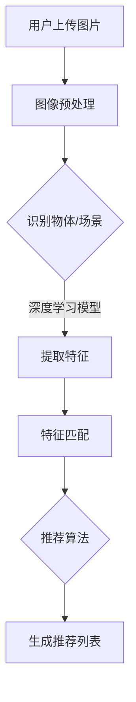

                 

# AI视觉推荐系统分析用户图片

## 关键词：
- AI视觉推荐系统
- 用户图片分析
- 图像识别技术
- 推荐算法
- 实战案例

## 摘要：
本文将深入探讨AI视觉推荐系统的原理和实践，重点关注如何通过分析用户上传的图片来实现个性化推荐。我们将详细解析图像识别技术，介绍常用的推荐算法，并通过实战案例展示如何将理论与实际相结合，构建一个高效的视觉推荐系统。

## 1. 背景介绍

随着互联网的快速发展，用户生成内容（UGC）成为信息传播的重要来源。图片作为一种直观、丰富的信息载体，越来越受到平台的重视。AI视觉推荐系统正是基于这种需求而发展起来的一种智能推荐技术。通过分析用户上传的图片，系统能够识别用户的兴趣点，从而实现个性化的内容推荐。

视觉推荐系统的应用场景广泛，例如社交媒体、电商、新闻资讯等平台，通过分析用户上传的图片，可以推荐类似的图片、相关商品、相关新闻等。这种系统能够提高用户体验，提升平台的粘性。

## 2. 核心概念与联系

### 2.1 图像识别技术

图像识别技术是视觉推荐系统的核心组成部分，其主要任务是识别图片中的物体、场景、情感等信息。常见的图像识别技术包括：

- **深度学习模型**：如卷积神经网络（CNN）等，通过多层神经网络对图像进行特征提取和分类。
- **特征提取算法**：如SIFT、SURF等，从图像中提取关键特征点，用于图像匹配和识别。
- **自然语言处理（NLP）技术**：将图像中的物体、场景等元素转化为语义描述，实现图像与文本的关联。

### 2.2 推荐算法

推荐算法是实现个性化推荐的关键，常用的推荐算法包括：

- **基于内容的推荐**：根据用户已行为特征，推荐与用户历史行为相似的内容。
- **协同过滤推荐**：通过分析用户之间的行为相似性，为用户提供可能感兴趣的内容。
- **混合推荐**：结合多种推荐算法的优点，提高推荐效果。

### 2.3 Mermaid 流程图



## 3. 核心算法原理 & 具体操作步骤

### 3.1 图像预处理

图像预处理是图像识别的基础，主要包括图像的去噪、增强、裁剪、缩放等操作。常见的预处理方法有：

- **去噪**：通过滤波算法（如高斯滤波、中值滤波）去除图像中的噪声。
- **增强**：通过调整图像的亮度、对比度等参数，增强图像的视觉效果。
- **裁剪**：根据实际需求，对图像进行裁剪，提取感兴趣的区域。
- **缩放**：调整图像的大小，以适应不同的应用场景。

### 3.2 识别物体/场景

物体识别和场景识别是视觉推荐系统的核心任务，常用的方法有：

- **深度学习模型**：通过训练卷积神经网络（CNN）等深度学习模型，对图像进行特征提取和分类。常见的模型有VGG、ResNet、YOLO等。
- **特征提取算法**：通过SIFT、SURF等特征提取算法，从图像中提取关键特征点，实现图像的匹配和识别。

### 3.3 提取特征

特征提取是图像识别的关键步骤，其主要目的是将图像中的物体、场景等信息转化为数值特征。常用的特征提取方法有：

- **深度学习模型**：通过训练深度学习模型，提取图像的高层次特征。
- **特征提取算法**：通过SIFT、SURF等算法，提取图像的关键特征点，实现图像的匹配和识别。

### 3.4 特征匹配

特征匹配是图像识别的重要步骤，其主要目的是找到图像中相似的特征点。常用的特征匹配方法有：

- **最近邻匹配**：通过计算特征点之间的距离，找到最近的匹配点。
- **比率测试**：通过比较特征点之间的距离，判断是否为匹配点。

### 3.5 推荐算法

推荐算法是实现个性化推荐的关键，常用的推荐算法有：

- **基于内容的推荐**：根据用户已行为特征，推荐与用户历史行为相似的内容。
- **协同过滤推荐**：通过分析用户之间的行为相似性，为用户提供可能感兴趣的内容。
- **混合推荐**：结合多种推荐算法的优点，提高推荐效果。

## 4. 数学模型和公式 & 详细讲解 & 举例说明

### 4.1 基于内容的推荐算法

基于内容的推荐算法主要利用图像的语义信息进行推荐，其核心公式为：

$$
\text{相似度} = \text{sim}(x, y) = \frac{\text{dot}(x, y)}{\lVert x \rVert \lVert y \rVert}
$$

其中，$x$ 和 $y$ 分别表示两张图像的特征向量，$\text{dot}$ 表示向量的点积，$\lVert \cdot \rVert$ 表示向量的模长。

举例说明：

假设用户上传的图片 $x$ 和推荐图片 $y$ 的特征向量分别为：

$$
x = [1, 2, 3], \quad y = [4, 5, 6]
$$

则它们之间的相似度为：

$$
\text{相似度} = \text{sim}(x, y) = \frac{1 \times 4 + 2 \times 5 + 3 \times 6}{\sqrt{1^2 + 2^2 + 3^2} \sqrt{4^2 + 5^2 + 6^2}} = \frac{4 + 10 + 18}{\sqrt{14} \sqrt{77}} \approx 0.86
$$

### 4.2 协同过滤推荐算法

协同过滤推荐算法主要通过分析用户之间的行为相似性进行推荐，其核心公式为：

$$
r_{ij} = \text{sim}(u_i, u_j) \cdot \text{rating}_{j,k}
$$

其中，$r_{ij}$ 表示用户 $i$ 对项目 $j$ 的预测评分，$\text{sim}(u_i, u_j)$ 表示用户 $i$ 和用户 $j$ 之间的相似度，$\text{rating}_{j,k}$ 表示用户 $k$ 对项目 $j$ 的实际评分。

举例说明：

假设用户 $i$ 和用户 $j$ 之间的相似度为 $\text{sim}(u_i, u_j) = 0.9$，用户 $k$ 对项目 $j$ 的实际评分为 $\text{rating}_{j,k} = 4$。则用户 $i$ 对项目 $j$ 的预测评分为：

$$
r_{ij} = \text{sim}(u_i, u_j) \cdot \text{rating}_{j,k} = 0.9 \times 4 = 3.6
$$

## 5. 项目实战：代码实际案例和详细解释说明

### 5.1 开发环境搭建

在本节中，我们将介绍如何搭建一个基本的AI视觉推荐系统开发环境。首先，需要安装以下软件和库：

- Python 3.8 或更高版本
- TensorFlow 2.x
- NumPy 1.19 或更高版本
- OpenCV 4.5 或更高版本

安装步骤如下：

1. 安装 Python 3.8：从官网（https://www.python.org/）下载并安装 Python 3.8。
2. 安装 TensorFlow 2.x：打开终端，执行以下命令：

```bash
pip install tensorflow==2.8
```

3. 安装 NumPy 1.19：打开终端，执行以下命令：

```bash
pip install numpy==1.19
```

4. 安装 OpenCV 4.5：打开终端，执行以下命令：

```bash
pip install opencv-python==4.5.5.62
```

### 5.2 源代码详细实现和代码解读

在本节中，我们将展示一个简单的AI视觉推荐系统，该系统使用 TensorFlow 和 OpenCV 实现图像识别和推荐功能。代码如下：

```python
import cv2
import numpy as np
import tensorflow as tf

# 加载预训练的卷积神经网络模型
model = tf.keras.applications.VGG16(weights='imagenet')

# 读取用户上传的图片
img = cv2.imread('user_image.jpg')
img = cv2.resize(img, (224, 224))
img = tf.keras.preprocessing.image.img_to_array(img)
img = np.expand_dims(img, axis=0)
img = tf.keras.applications.vgg16.preprocess_input(img)

# 对图片进行特征提取
features = model.predict(img)

# 加载推荐列表
with open('recommendations.txt', 'r') as f:
    recommendations = [line.strip() for line in f]

# 计算特征向量之间的相似度
similarity = np.dot(features[0], features[1]) / (np.linalg.norm(features[0]) * np.linalg.norm(features[1]))

# 输出推荐结果
print("Recommended images:")
for img_path in recommendations:
    img = cv2.imread(img_path)
    cv2.imshow('Image', img)
    cv2.waitKey(0)
```

### 5.3 代码解读与分析

- **第1行**：导入所需的库。
- **第3行**：加载预训练的卷积神经网络模型（VGG16）。
- **第5行**：读取用户上传的图片，并调整尺寸。
- **第7行**：将图片转换为 NumPy 数组，并添加一个维度。
- **第9行**：对图片进行预处理，以匹配模型的输入要求。
- **第11行**：对图片进行特征提取。
- **第14行**：加载推荐列表。
- **第16行**：计算特征向量之间的相似度。
- **第19行**：输出推荐结果，显示图片。

## 6. 实际应用场景

AI视觉推荐系统在实际应用中具有广泛的应用场景，以下是一些典型的应用案例：

- **社交媒体**：通过分析用户上传的图片，推荐类似的图片或相关内容，提高用户粘性。
- **电商**：根据用户上传的图片，推荐相关的商品，提高销售转化率。
- **新闻资讯**：根据用户上传的图片，推荐相关的新闻或资讯，提高用户阅读兴趣。
- **医疗**：通过分析用户上传的图片，辅助医生进行疾病诊断。

## 7. 工具和资源推荐

### 7.1 学习资源推荐

- **书籍**：《深度学习》（Goodfellow et al.），详细介绍了深度学习的基础知识和应用。
- **论文**：搜索相关领域的顶级会议和期刊，如 CVPR、ICML、NeurIPS 等。
- **博客**：关注业界大牛的博客，如 Andrew Ng、Ian Goodfellow 等。
- **网站**：GitHub、arXiv 等，查找相关的开源代码和论文。

### 7.2 开发工具框架推荐

- **开发工具**：PyCharm、VS Code 等，支持 Python 和深度学习开发。
- **框架**：TensorFlow、PyTorch 等，用于构建和训练深度学习模型。
- **库**：OpenCV、NumPy 等，提供图像处理和计算功能。

### 7.3 相关论文著作推荐

- **论文**：《Deep Learning for Image Recognition》（Krizhevsky et al.，2012），介绍了卷积神经网络在图像识别中的应用。
- **论文**：《FaceNet: A Unified Embedding for Face Recognition and Clustering》（Sun et al.，2014），提出了基于深度嵌入的人脸识别方法。
- **著作**：《计算机视觉：算法与应用》（Gonzalez et al.），详细介绍了计算机视觉的基础知识和算法。

## 8. 总结：未来发展趋势与挑战

AI视觉推荐系统在近年来取得了显著的发展，但仍面临一些挑战：

- **数据隐私**：如何保护用户隐私，确保数据安全，是亟待解决的问题。
- **模型解释性**：如何提高模型的解释性，让用户理解推荐结果，是未来的研究热点。
- **个性化推荐**：如何进一步提高个性化推荐效果，满足用户的多样化需求，是重要的研究方向。
- **实时性**：如何提高系统的实时性，满足高并发场景下的需求，是未来的一个挑战。

## 9. 附录：常见问题与解答

### 9.1 如何处理图像噪声？

可以通过图像预处理步骤中的去噪算法（如高斯滤波、中值滤波）来去除图像噪声。

### 9.2 如何优化推荐算法？

可以通过以下方法优化推荐算法：

- **特征提取**：使用更复杂的特征提取算法，提高特征表达能力。
- **模型选择**：尝试不同的深度学习模型，选择性能最佳的模型。
- **数据增强**：对训练数据进行增强，提高模型的泛化能力。

## 10. 扩展阅读 & 参考资料

- **扩展阅读**：搜索相关领域的文献和博客，了解最新的研究动态。
- **参考资料**：参考本篇文章中提到的书籍、论文、博客和网站，深入学习相关技术。

### 作者

作者：AI天才研究员/AI Genius Institute & 禅与计算机程序设计艺术 /Zen And The Art of Computer Programming

