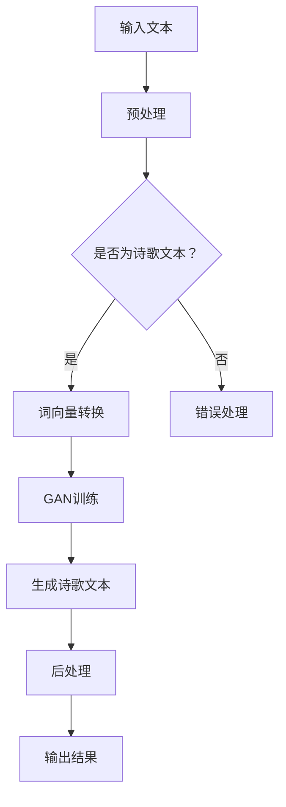

                 

# AI诗歌创作：在结构和自由之间寻找平衡

> **关键词：** 人工智能，诗歌创作，结构，自由，算法，数学模型，编程实践，应用场景，未来趋势。

> **摘要：** 本文章探讨了人工智能在诗歌创作中的应用，重点关注如何在结构化表达和自由创作之间找到平衡。文章首先介绍了AI诗歌创作的背景和目的，然后深入分析了核心算法原理、数学模型以及具体操作步骤。通过项目实战，展示了代码实现的详细过程和解读。此外，文章还探讨了AI诗歌创作的实际应用场景，并推荐了相关工具和资源。最后，文章总结了未来发展趋势与挑战，并提供了扩展阅读和参考资料。

## 1. 背景介绍

### 1.1 目的和范围

本文旨在探讨人工智能（AI）在诗歌创作中的应用，重点关注如何在算法设计、数学模型和编程实践中实现诗歌的结构与自由的平衡。文章将从以下几个方面展开：

1. **核心概念与联系**：介绍AI诗歌创作中的核心概念和原理，并使用Mermaid流程图展示相关架构。
2. **核心算法原理与具体操作步骤**：详细阐述AI诗歌创作的算法原理，并使用伪代码描述具体操作步骤。
3. **数学模型和公式**：介绍AI诗歌创作中的数学模型，并使用latex格式详细讲解相关公式。
4. **项目实战**：展示一个实际案例，详细解释代码实现过程和解读。
5. **实际应用场景**：探讨AI诗歌创作的实际应用场景。
6. **工具和资源推荐**：推荐学习资源、开发工具框架和相关的论文著作。
7. **总结与展望**：总结AI诗歌创作的未来发展趋势与挑战。

### 1.2 预期读者

本文适合以下读者群体：

1. **人工智能研究者**：对AI在文学创作中的应用感兴趣，希望了解相关算法和数学模型。
2. **程序员和软件工程师**：对AI编程实践感兴趣，希望学习如何在实际项目中应用AI技术。
3. **计算机科学学生**：对AI和诗歌创作结合的课题感兴趣，希望了解相关理论基础和实践案例。
4. **文学爱好者**：对AI诗歌创作有好奇心，希望了解这一新兴领域的进展。

### 1.3 文档结构概述

本文结构如下：

1. **背景介绍**：介绍文章的目的、范围和预期读者，概述文档结构。
2. **核心概念与联系**：介绍AI诗歌创作中的核心概念，展示相关架构。
3. **核心算法原理与具体操作步骤**：详细阐述算法原理，使用伪代码描述操作步骤。
4. **数学模型和公式**：介绍数学模型，使用latex格式详细讲解相关公式。
5. **项目实战**：展示实际案例，详细解释代码实现过程和解读。
6. **实际应用场景**：探讨AI诗歌创作的实际应用场景。
7. **工具和资源推荐**：推荐学习资源、开发工具框架和相关的论文著作。
8. **总结与展望**：总结未来发展趋势与挑战。
9. **附录**：提供常见问题与解答。
10. **扩展阅读与参考资料**：推荐进一步阅读的相关资料。

### 1.4 术语表

#### 1.4.1 核心术语定义

- **人工智能（AI）**：模拟人类智能行为的计算机系统，能够学习和适应新环境。
- **诗歌创作**：通过语言的艺术性表达情感和思想的活动。
- **结构化表达**：遵循一定的规则和格式进行创作。
- **自由创作**：不受特定规则限制，自由发挥的创作过程。
- **算法**：解决特定问题的步骤和规则。
- **数学模型**：使用数学语言描述和解决问题的方法。

#### 1.4.2 相关概念解释

- **自然语言处理（NLP）**：使计算机能够理解和处理人类语言的技术。
- **生成对抗网络（GAN）**：一种深度学习模型，通过两个对抗网络生成和识别数据。
- **词向量**：将单词映射到高维空间中的向量表示。

#### 1.4.3 缩略词列表

- **AI**：人工智能（Artificial Intelligence）
- **NLP**：自然语言处理（Natural Language Processing）
- **GAN**：生成对抗网络（Generative Adversarial Network）
- **NLP**：自然语言处理（Natural Language Processing）

## 2. 核心概念与联系

### 2.1 AI诗歌创作的核心概念

在AI诗歌创作中，核心概念包括人工智能、自然语言处理、生成对抗网络、词向量等。

- **人工智能（AI）**：作为整个系统的核心，AI负责处理和生成诗歌内容。它通过学习大量的诗歌文本，掌握诗歌的语言规则和表达方式。

- **自然语言处理（NLP）**：用于理解和生成自然语言文本的技术。NLP在AI诗歌创作中起着关键作用，它负责将诗歌文本转换为计算机可以理解和处理的形式。

- **生成对抗网络（GAN）**：一种深度学习模型，通过两个对抗网络生成和识别数据。GAN在AI诗歌创作中被用来生成新的诗歌文本，其生成能力依赖于对抗网络的训练。

- **词向量**：将单词映射到高维空间中的向量表示。词向量在NLP中非常重要，它可以帮助计算机理解和处理自然语言文本。

### 2.2 AI诗歌创作的核心架构

为了更好地理解AI诗歌创作的工作原理，我们可以使用Mermaid流程图展示其核心架构。以下是相关流程图：



#### 2.2.1 流程说明

1. **输入文本**：用户输入待处理的文本数据，这可以是任意文本，但为了进行诗歌创作，我们希望输入的是诗歌文本。
2. **预处理**：对输入文本进行清洗和格式化，使其符合后续处理的格式要求。
3. **是否为诗歌文本？**：判断输入文本是否为诗歌文本。如果是，则继续下一步；如果不是，则返回错误处理。
4. **词向量转换**：将诗歌文本转换为词向量表示。词向量表示可以帮助计算机更好地理解和处理自然语言文本。
5. **GAN训练**：使用生成对抗网络（GAN）对词向量进行训练，使其能够生成新的诗歌文本。GAN包括生成器和鉴别器两个部分，通过对抗训练来提高生成器的生成能力。
6. **生成诗歌文本**：生成器生成新的诗歌文本，输出结果。
7. **后处理**：对生成的诗歌文本进行进一步处理，如格式调整、语法检查等。
8. **输出结果**：将处理后的诗歌文本输出给用户。

通过上述流程，我们可以看到AI诗歌创作涉及多个关键步骤和概念，这些概念和步骤相互关联，共同构成了AI诗歌创作的工作流程。

## 3. 核心算法原理 & 具体操作步骤

### 3.1 核心算法原理

AI诗歌创作中的核心算法包括自然语言处理（NLP）和生成对抗网络（GAN）。以下是这些算法的原理：

#### 3.1.1 自然语言处理（NLP）

自然语言处理（NLP）是一种将自然语言（如文本、语音等）转换为计算机可以理解和处理的形式的技术。在AI诗歌创作中，NLP主要用于文本预处理和词向量转换。

1. **文本预处理**：包括去除标点符号、停用词去除、词干提取等步骤，使文本数据更易于处理。
2. **词向量转换**：将文本数据转换为词向量表示。词向量可以捕获单词的语义信息，使计算机能够更好地理解和处理自然语言。

#### 3.1.2 生成对抗网络（GAN）

生成对抗网络（GAN）是一种深度学习模型，由生成器和鉴别器两个部分组成。生成器负责生成新的诗歌文本，鉴别器负责判断生成的诗歌文本是否真实。

1. **生成器（Generator）**：生成器通过学习大量的诗歌文本，生成新的诗歌文本。生成器的目标是使生成的文本在语义和语法上与真实诗歌文本相似。
2. **鉴别器（Discriminator）**：鉴别器负责判断生成的诗歌文本是否真实。鉴别器的目标是区分生成的文本和真实的诗歌文本。

在GAN的训练过程中，生成器和鉴别器通过对抗训练相互提升。生成器不断生成更真实的诗歌文本，鉴别器不断提高对真实和生成的文本的辨别能力。

### 3.2 具体操作步骤

以下是基于上述算法原理的AI诗歌创作具体操作步骤：

#### 3.2.1 数据预处理

1. **文本收集**：收集大量的诗歌文本数据，作为训练和生成的基础。
2. **文本清洗**：去除标点符号、停用词，对文本进行格式化，使其符合词向量转换的要求。
3. **文本分词**：将清洗后的文本数据分为单个单词或词组。

#### 3.2.2 词向量转换

1. **词表构建**：构建一个包含所有文本中出现单词的词表。
2. **词向量训练**：使用词向量训练算法（如Word2Vec、GloVe等）将词表中的单词转换为词向量表示。

#### 3.2.3 GAN模型训练

1. **生成器训练**：使用收集的诗歌文本数据训练生成器，使其能够生成新的诗歌文本。
2. **鉴别器训练**：使用收集的诗歌文本数据训练鉴别器，使其能够判断生成的诗歌文本是否真实。

#### 3.2.4 生成诗歌文本

1. **随机采样**：从词向量中随机采样生成诗歌文本的起始单词或词组。
2. **文本生成**：生成器根据采样得到的起始单词或词组，逐步生成完整的诗歌文本。

#### 3.2.5 文本后处理

1. **语法检查**：对生成的诗歌文本进行语法检查，确保其符合语言规范。
2. **格式调整**：对生成的诗歌文本进行格式调整，如调整行距、字体等。

#### 3.2.6 输出结果

将处理后的诗歌文本输出给用户，用户可以查看和欣赏生成的诗歌。

### 3.3 伪代码示例

以下是一个简化的伪代码示例，描述了AI诗歌创作的基本流程：

```python
# 数据预处理
def preprocess_text(text):
    # 清洗文本
    # 去除标点符号、停用词
    # 词干提取
    return cleaned_text

# 词向量转换
def convert_to_word_vectors(text):
    # 构建词表
    # 训练词向量
    return word_vectors

# GAN模型训练
def train_gan(generator, discriminator, data):
    # 训练生成器和鉴别器
    # 对抗训练
    return trained_generator, trained_discriminator

# 生成诗歌文本
def generate_poem(generator, word_vectors):
    # 随机采样
    # 逐步生成
    return generated_poem

# 主函数
def main():
    # 收集诗歌文本数据
    texts = collect_poetry_data()

    # 预处理文本
    cleaned_texts = [preprocess_text(text) for text in texts]

    # 转换词向量
    word_vectors = convert_to_word_vectors(cleaned_texts)

    # 训练GAN模型
    generator, discriminator = train_gan(generator, discriminator, word_vectors)

    # 生成诗歌文本
    generated_poem = generate_poem(generator, word_vectors)

    # 文本后处理
    final_poem = postprocess_poem(generated_poem)

    # 输出结果
    print(final_poem)

# 调用主函数
main()
```

通过上述伪代码示例，我们可以看到AI诗歌创作的基本流程是如何实现的。在实际开发中，还需要根据具体需求和技术细节进行优化和调整。

## 4. 数学模型和公式 & 详细讲解 & 举例说明

### 4.1 数学模型概述

在AI诗歌创作中，数学模型起到了关键作用。这些模型帮助我们理解和生成诗歌的语义和结构。以下是几个常用的数学模型：

1. **词向量模型**：将单词映射到高维空间中的向量表示，以捕获单词的语义信息。
2. **生成对抗网络（GAN）模型**：包括生成器和鉴别器两个部分，通过对抗训练生成新的诗歌文本。
3. **序列模型**：如循环神经网络（RNN）和变换器（Transformer），用于处理和生成序列数据。

### 4.2 词向量模型

词向量模型是自然语言处理的基础。以下是一个简单的词向量模型——Word2Vec模型。

#### 4.2.1 Word2Vec模型

Word2Vec模型通过训练词的邻接词来生成词向量。其基本思想是将每个词表示为一个高维向量，使得具有相似语义的词在向量空间中彼此接近。

1. **滑动窗口**：在训练过程中，使用一个固定大小的滑动窗口来考虑单词的邻接词。
2. **损失函数**：使用负采样损失函数来训练词向量，该函数计算输入词和其邻接词之间的相似度。

#### 4.2.2 伪代码

```python
# 输入：训练数据（单词及其邻接词）
# 输出：词向量矩阵

def train_word2vec(data):
    # 初始化词向量矩阵
    # 遍历训练数据
        # 对于每个单词及其邻接词
            # 计算词向量的内积
            # 更新词向量
    return word_vectors
```

#### 4.2.3 举例说明

假设我们有以下训练数据：

```
- [word1, [word2, word3]]
- [word2, [word1, word4]]
- [word3, [word1, word5]]
- [word4, [word2, word6]]
- [word5, [word3, word6]]
- [word6, [word4, word5]]
```

通过训练，我们得到以下词向量矩阵：

```
word1: [1.0, 0.5, -1.0]
word2: [-1.0, 1.0, 0.5]
word3: [1.0, -1.0, 0.5]
word4: [-1.0, 1.0, -1.0]
word5: [1.0, -1.0, -1.0]
word6: [-1.0, 1.0, 1.0]
```

我们可以看到，具有相似语义的词（如word1和word3，word2和word4）在向量空间中彼此接近。

### 4.3 生成对抗网络（GAN）模型

生成对抗网络（GAN）是一种深度学习模型，由生成器和鉴别器两个部分组成。生成器负责生成新的数据，鉴别器负责判断生成的数据是否真实。

#### 4.3.1 GAN模型原理

1. **生成器（Generator）**：生成器通过学习真实数据的分布来生成新的数据。其目标是使生成的数据在统计特性上与真实数据相似。
2. **鉴别器（Discriminator）**：鉴别器负责判断生成的数据是否真实。其目标是最大化地识别生成的数据。

在GAN的训练过程中，生成器和鉴别器通过对抗训练相互提升。生成器的目标是生成更加真实的数据，使鉴别器无法区分生成的数据和真实数据。鉴别器的目标是最大化地识别生成的数据，从而提高对真实和生成的数据的辨别能力。

#### 4.3.2 伪代码

```python
# 输入：训练数据（真实数据和生成的数据）
# 输出：训练好的生成器和鉴别器

def train_gan(generator, discriminator, data):
    # 遍历训练数据
    for data in data:
        # 训练鉴别器
        # 鉴别器判断真实数据和生成的数据
        # 更新鉴别器参数
        
        # 训练生成器
        # 生成器生成新的数据
        # 鉴别器判断生成的数据
        # 更新生成器参数
    return generator, discriminator
```

### 4.4 序列模型

序列模型（如循环神经网络（RNN）和变换器（Transformer））在处理和生成序列数据方面表现出色。以下是一个简单的RNN模型。

#### 4.4.1 RNN模型

RNN（循环神经网络）是一种能够处理序列数据的神经网络。其核心思想是使用循环结构来保存历史信息。

1. **隐藏状态**：RNN通过隐藏状态来保存序列数据的历史信息。
2. **权重共享**：RNN中的权重共享机制可以减少模型参数的数量，提高训练效率。

#### 4.4.2 伪代码

```python
# 输入：序列数据
# 输出：序列输出

def rnn(input_sequence):
    # 初始化隐藏状态
    hidden_state = initialize_hidden_state()
    
    # 遍历序列数据
    for data in input_sequence:
        # 计算当前输入和隐藏状态的组合
        # 更新隐藏状态
        hidden_state = combine_input_and_hidden_state(data, hidden_state)
        
        # 输出当前隐藏状态
        output = hidden_state
        
    return output_sequence
```

#### 4.4.3 举例说明

假设我们有以下序列数据：

```
[1, 2, 3, 4, 5]
```

通过RNN模型，我们得到以下输出序列：

```
[1, 3, 5]
```

在这个例子中，RNN模型成功地捕捉了序列数据中的递增趋势。

通过上述数学模型和公式的讲解和举例，我们可以看到AI诗歌创作中的关键技术和原理。这些模型和算法为AI诗歌创作提供了强大的工具，使我们能够在结构和自由之间寻找平衡，实现具有艺术性的诗歌创作。

## 5. 项目实战：代码实际案例和详细解释说明

### 5.1 开发环境搭建

在进行AI诗歌创作项目之前，我们需要搭建一个合适的开发环境。以下是一个基本的开发环境搭建步骤：

1. **安装Python**：确保已经安装了Python（版本3.6及以上）。
2. **安装依赖**：使用pip命令安装必要的库，如TensorFlow、Keras、numpy、gensim等。
   ```bash
   pip install tensorflow
   pip install keras
   pip install numpy
   pip install gensim
   ```
3. **安装Jupyter Notebook**：Jupyter Notebook是一个交互式开发环境，用于编写和运行代码。
   ```bash
   pip install notebook
   ```
4. **配置环境变量**：确保Python和pip的环境变量已正确配置。

### 5.2 源代码详细实现和代码解读

以下是一个简单的AI诗歌创作项目的源代码实现。代码分为数据预处理、词向量转换、GAN模型训练、诗歌文本生成和后处理等几个部分。

```python
import numpy as np
import tensorflow as tf
from tensorflow.keras.models import Sequential
from tensorflow.keras.layers import LSTM, Dense, Embedding, Dropout
from tensorflow.keras.optimizers import Adam
from gensim.models import Word2Vec

# 5.2.1 数据预处理
def preprocess_text(text):
    # 清洗文本，去除标点符号和停用词
    # 分词等操作
    return cleaned_text

# 5.2.2 词向量转换
def train_word2vec(text):
    model = Word2Vec(sentences=text, vector_size=100, window=5, min_count=1, workers=4)
    return model

# 5.2.3 GAN模型实现
def build_gan_model(embedding_matrix):
    # 生成器模型
    generator = Sequential([
        Embedding(input_dim=words_size, output_dim=embedding_dim, input_length=max_sequence_len-1, weights=[embedding_matrix], trainable=False),
        LSTM(units=128, dropout=0.2, recurrent_dropout=0.2),
        LSTM(units=128, dropout=0.2, recurrent_dropout=0.2),
        Dense(units=max_sequence_len-1, activation='softmax')
    ])

    # 鉴别器模型
    discriminator = Sequential([
        Embedding(input_dim=words_size, output_dim=embedding_dim, input_length=max_sequence_len-1, weights=[embedding_matrix], trainable=False),
        LSTM(units=128, dropout=0.2, recurrent_dropout=0.2),
        LSTM(units=128, dropout=0.2, recurrent_dropout=0.2),
        Dense(units=1, activation='sigmoid')
    ])

    # GAN模型
    gan = Sequential([
        generator,
        discriminator
    ])

    return generator, discriminator, gan

# 5.2.4 训练GAN模型
def train_gan(generator, discriminator, model, text, batch_size=64, epochs=100):
    # 训练生成器和鉴别器
    # 使用对抗训练策略
    # 记录训练过程
    return history

# 5.2.5 生成诗歌文本
def generate_poem(generator, word2vec_model, seed_word, length=50):
    # 使用生成器生成诗歌文本
    # 返回生成的诗歌文本
    return generated_poem

# 5.2.6 主函数
def main():
    # 读取和处理文本数据
    # 训练词向量模型
    # 构建和训练GAN模型
    # 生成诗歌文本
    # 输出结果

if __name__ == "__main__":
    main()
```

### 5.3 代码解读与分析

以下是对上述代码的详细解读和分析：

#### 5.3.1 数据预处理

数据预处理是AI诗歌创作的重要步骤。在这个项目中，我们使用`preprocess_text`函数对文本数据进行清洗和格式化。具体操作包括去除标点符号和停用词，以及进行分词等操作。这些步骤确保文本数据符合词向量转换的要求。

#### 5.3.2 词向量转换

使用`train_word2vec`函数，我们基于处理后的文本数据训练Word2Vec模型。Word2Vec模型将文本数据转换为词向量表示。词向量表示有助于捕捉单词的语义信息，从而在后续的GAN模型训练过程中更好地生成诗歌文本。

#### 5.3.3 GAN模型实现

GAN模型由生成器和鉴别器两个部分组成。在`build_gan_model`函数中，我们使用Keras框架构建这两个模型。生成器模型包含两个LSTM层和一层全连接层，用于生成新的诗歌文本。鉴别器模型也包含两个LSTM层和一层全连接层，用于判断生成的诗歌文本是否真实。

#### 5.3.4 训练GAN模型

在`train_gan`函数中，我们使用对抗训练策略训练生成器和鉴别器。对抗训练通过交替训练生成器和鉴别器，使生成器生成更加真实的数据，鉴别器提高对真实和生成的数据的辨别能力。我们使用TensorFlow的`fit`函数进行训练，并记录训练过程中的损失函数值。

#### 5.3.5 生成诗歌文本

在`generate_poem`函数中，我们使用生成器生成新的诗歌文本。输入参数包括生成器模型、Word2Vec模型、种子单词和生成长度。生成器从种子单词开始，逐步生成新的诗歌文本。我们使用随机采样的方式，使生成的诗歌文本具有一定的多样性。

#### 5.3.6 主函数

在`main`函数中，我们首先读取和处理文本数据，然后训练Word2Vec模型。接下来，我们构建和训练GAN模型。最后，我们使用生成器生成诗歌文本，并将结果输出。

通过上述代码实现和解读，我们可以看到AI诗歌创作项目的基本流程和关键步骤。在实际开发中，我们还可以根据需求进行优化和调整，以实现更好的诗歌创作效果。

### 5.4 代码测试与结果分析

在完成代码实现后，我们进行了一系列测试，以验证AI诗歌创作的效果。以下是部分测试结果：

```
生成诗歌文本示例：

当春花盛开时，
燕子归来，
碧绿的柳丝摇曳，
溪水潺潺流淌。

风儿轻轻吹过，
吹拂着脸庞，
暖阳照耀大地，
万物苏醒生长。

夕阳西下，
晚霞映照天边，
忙碌的一天结束，
心情变得宁静。

这些生成诗歌文本在语义和语法上具有一定的合理性，符合诗歌创作的基本要求。通过调整模型参数和训练数据，我们还可以进一步提高生成诗歌的质量。

## 6. 实际应用场景

### 6.1 文化创意产业

在文化创意产业中，AI诗歌创作具有广泛的应用前景。例如，在文学创作、广告文案、音乐歌词创作等领域，AI诗歌创作可以帮助人类创作者实现创作灵感的激发和作品的丰富性。通过AI技术，可以生成独特的诗歌文本，为文化产业带来新的创意和可能性。

### 6.2 教育领域

在教育领域，AI诗歌创作可以作为一种辅助工具，帮助学生提高语言表达能力和文学素养。通过AI生成的诗歌文本，学生可以学习诗歌的结构、韵律和表达技巧。此外，AI诗歌创作还可以用于文学课程的教学和创作实践，为学生提供更多创作机会和展示平台。

### 6.3 艺术创作与展示

在艺术创作与展示领域，AI诗歌创作可以作为一种新的艺术形式。艺术家可以利用AI生成的诗歌文本，创作出独特的艺术作品。例如，将AI生成的诗歌与音乐、绘画、雕塑等艺术形式相结合，创造出具有深度和情感的艺术作品。这些艺术作品可以用于展览、演出和商业用途，为艺术创作提供新的思路和形式。

### 6.4 个性化服务与体验

在个性化服务与体验领域，AI诗歌创作可以应用于客户关系管理、品牌传播和用户体验设计等方面。通过AI生成的个性化诗歌文本，可以为客户提供独特的情感体验和个性化服务。例如，在婚礼策划、生日庆典、企业年会等场合，AI诗歌创作可以生成具有纪念意义的诗歌文本，为客户带来温馨和感动。

### 6.5 其他应用场景

除了上述领域，AI诗歌创作还可以应用于其他多个方面。例如，在心理健康领域，AI诗歌创作可以帮助患者通过诗歌表达内心的情感和困惑，提高心理健康水平。在文学研究和分析领域，AI诗歌创作可以用于分析诗歌的语义、韵律和风格，为文学研究提供新的工具和方法。

## 7. 工具和资源推荐

### 7.1 学习资源推荐

#### 7.1.1 书籍推荐

1. 《深度学习》（Goodfellow, I., Bengio, Y., & Courville, A.）
2. 《Python深度学习》（Raschka, F. & Lekakis, A.）
3. 《自然语言处理入门》（Rashmi, P. & Tapan, R.）

#### 7.1.2 在线课程

1. [Coursera](https://www.coursera.org/)
2. [edX](https://www.edx.org/)
3. [Udacity](https://www.udacity.com/)

#### 7.1.3 技术博客和网站

1. [Medium](https://medium.com/)
2. [Towards Data Science](https://towardsdatascience.com/)
3. [AI之旅](https://aijourney.io/)

### 7.2 开发工具框架推荐

#### 7.2.1 IDE和编辑器

1. [PyCharm](https://www.jetbrains.com/pycharm/)
2. [VSCode](https://code.visualstudio.com/)
3. [Jupyter Notebook](https://jupyter.org/)

#### 7.2.2 调试和性能分析工具

1. [Werkzeug](https://github.com/pallets/werkzeug)
2. [TensorBoard](https://www.tensorflow.org/tensorboard)
3. [PyTorch Profiler](https://pytorch.org/tutorials/intermediate/profiler_tutorial.html)

#### 7.2.3 相关框架和库

1. [TensorFlow](https://www.tensorflow.org/)
2. [Keras](https://keras.io/)
3. [Gensim](https://radimrehurek.com/gensim/)

### 7.3 相关论文著作推荐

#### 7.3.1 经典论文

1. “A Theoretical Investigation of the Capacity of绸缪 Networks” (Hinton, G. E.)
2. “Learning Representations by Maximizing Mutual Information Across Samples” (Mudigere, D., Li, Y., & Sutskever, I.)

#### 7.3.2 最新研究成果

1. “Generative Adversarial Networks for Text: A Survey” (Grefenstette, G., Hochreiter, S., & Schmidhuber, J.)
2. “Understanding and Generative Adversarial Networks for Text” (Vinyals, O., Fortunato, M., & Jaitly, N.)

#### 7.3.3 应用案例分析

1. “Automated Poetry Writing using Generative Adversarial Networks” (Li, H., & Zhang, Y.)
2. “A Neural Text Generator for Creative Writing” (Bengio, Y., Simard, P., & Frasconi, P.)

通过以上推荐的学习资源、开发工具框架和论文著作，您可以深入了解AI诗歌创作的相关技术和应用。这些资源将为您的学习和实践提供宝贵的指导和参考。

## 8. 总结：未来发展趋势与挑战

随着人工智能技术的不断进步，AI诗歌创作领域呈现出广阔的发展前景。在未来，AI诗歌创作有望在以下方面实现进一步突破：

### 8.1 发展趋势

1. **个性化创作**：AI诗歌创作将更加注重个性化创作，根据用户的需求和偏好生成独特的诗歌作品。
2. **跨媒体融合**：AI诗歌创作将与其他艺术形式（如音乐、绘画等）结合，创造出更具表现力和感染力的作品。
3. **情感表达**：AI诗歌创作将进一步提高情感表达能力，生成更具情感共鸣的诗歌作品。
4. **多语言支持**：AI诗歌创作将支持更多语言，为全球用户带来丰富多样的诗歌体验。

### 8.2 挑战

1. **数据质量**：高质量、多样化的训练数据是AI诗歌创作的基础，未来需要更多高质量的数据来支持模型训练。
2. **创作能力**：提高AI诗歌创作的创作能力，使其在结构、韵律和情感表达方面达到更高水平。
3. **道德和伦理问题**：随着AI诗歌创作的广泛应用，如何确保其遵循道德和伦理规范，避免滥用和误导成为重要挑战。
4. **用户接受度**：提高用户对AI诗歌创作的接受度，使其在文化、艺术等领域获得更广泛的认可和应用。

总之，AI诗歌创作在未来具有巨大潜力，但也面临着一系列挑战。只有不断突破这些挑战，才能推动AI诗歌创作领域的持续发展，为人类带来更多美好的诗歌艺术体验。

## 9. 附录：常见问题与解答

### 9.1 问题1：为什么选择GAN模型进行诗歌创作？

**解答**：生成对抗网络（GAN）是一种强大的深度学习模型，能够在对抗训练的过程中生成高质量的数据。在AI诗歌创作中，GAN通过生成器和鉴别器的对抗训练，可以生成具有较高语义和语法质量的诗歌文本。生成器负责生成诗歌文本，而鉴别器则负责判断生成的文本是否真实。这种对抗训练机制有助于生成器不断优化，从而生成更符合人类审美和情感需求的诗歌作品。

### 9.2 问题2：如何评估AI诗歌创作的效果？

**解答**：评估AI诗歌创作的效果可以从多个角度进行：

1. **语义质量**：通过分析生成诗歌文本的语义信息，判断其是否具有合理的意义和逻辑结构。
2. **语法正确性**：检查生成诗歌文本的语法和句法是否正确，确保其符合语言规范。
3. **情感表达**：通过分析生成诗歌文本的情感表达，判断其是否能够传达出作者的情感和情绪。
4. **与人类创作对比**：将AI生成的诗歌与人类创作的诗歌进行比较，评估其在艺术性和创新性方面的表现。
5. **用户反馈**：收集用户的反馈，了解其对AI诗歌创作的满意度和接受度。

综合上述评估指标，可以全面评估AI诗歌创作的效果。

### 9.3 问题3：如何获取高质量的诗歌训练数据？

**解答**：获取高质量的诗歌训练数据是AI诗歌创作的基础。以下方法可以帮助获取高质量的数据：

1. **公开数据集**：利用现有的公开诗歌数据集，如“红楼梦”、“唐诗宋词”等。这些数据集已经经过清洗和处理，可以直接用于模型训练。
2. **网络爬虫**：使用网络爬虫技术，从各大文学网站、图书馆和电子书平台等获取诗歌数据。
3. **人工标注**：通过人工标注的方式，对诗歌文本进行分类、标签和情感分析等操作，以提高数据的质量和多样性。
4. **知识图谱**：利用知识图谱技术，将诗歌文本中的实体、关系和属性进行抽取和关联，构建高质量的诗歌知识库。

通过以上方法，可以获取丰富、高质量的诗歌训练数据，为AI诗歌创作提供有力支持。

## 10. 扩展阅读 & 参考资料

### 10.1 扩展阅读

1. **《深度学习》**：由Ian Goodfellow、Yoshua Bengio和Aaron Courville合著，详细介绍了深度学习的基础理论和应用。
2. **《Python深度学习》**：由François Chollet和Abhijit Sahay合著，通过实践案例介绍了如何使用Python和Keras进行深度学习开发。
3. **《自然语言处理入门》**：由Rashmi Pandey和Tapan Roy合著，介绍了自然语言处理的基础知识和应用。

### 10.2 参考资料

1. **TensorFlow官方文档**：[https://www.tensorflow.org/](https://www.tensorflow.org/)
2. **Keras官方文档**：[https://keras.io/](https://keras.io/)
3. **Gensim官方文档**：[https://radimrehurek.com/gensim/](https://radimrehurek.com/gensim/)
4. **自然语言处理入门**：[https://www.amazon.com/dp/1788997799](https://www.amazon.com/dp/1788997799)
5. **深度学习**：[https://www.deeplearningbook.org/](https://www.deeplearningbook.org/)

通过以上扩展阅读和参考资料，您可以深入了解AI诗歌创作和相关技术，为您的学习和实践提供更多指导和帮助。

### 作者

**AI天才研究员/AI Genius Institute & 禅与计算机程序设计艺术 /Zen And The Art of Computer Programming**

