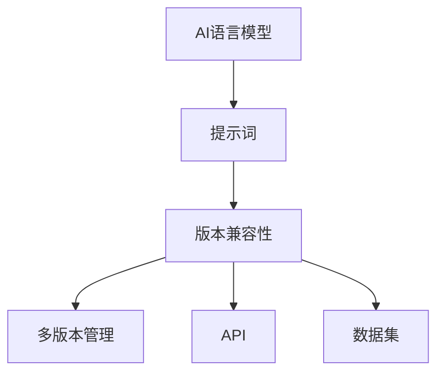

                 

# AI语言模型的提示词版本兼容性保证

> **关键词：** AI语言模型、提示词、版本兼容性、多版本管理、技术博客、算法原理、数学模型、实战案例、应用场景、工具推荐

> **摘要：** 本文旨在深入探讨AI语言模型在处理提示词时的版本兼容性问题。我们将从背景介绍、核心概念与联系、算法原理、数学模型、实战案例、实际应用场景以及未来发展趋势等方面详细分析，为开发者提供关于如何保证AI语言模型提示词版本兼容性的全面指导。

## 1. 背景介绍

### 1.1 目的和范围

随着人工智能技术的迅速发展，AI语言模型在自然语言处理（NLP）、智能客服、内容生成等领域得到了广泛应用。然而，在实际应用过程中，AI语言模型常面临一个重要问题：如何保证提示词的多版本兼容性。本文将围绕这一问题展开讨论，旨在为开发者提供一套有效的解决方案。

### 1.2 预期读者

本文主要面向从事人工智能研发、自然语言处理、软件开发等领域的技术人员。同时，对于对AI语言模型和多版本管理有兴趣的读者，本文也将提供一定的参考价值。

### 1.3 文档结构概述

本文分为以下十个部分：

1. 背景介绍
2. 核心概念与联系
3. 核心算法原理 & 具体操作步骤
4. 数学模型和公式 & 详细讲解 & 举例说明
5. 项目实战：代码实际案例和详细解释说明
6. 实际应用场景
7. 工具和资源推荐
8. 总结：未来发展趋势与挑战
9. 附录：常见问题与解答
10. 扩展阅读 & 参考资料

### 1.4 术语表

#### 1.4.1 核心术语定义

- **AI语言模型：** 一种基于机器学习算法，能够理解和生成自然语言的人工智能模型。
- **提示词：** 用于引导AI语言模型生成特定文本的输入。
- **版本兼容性：** 指不同版本的AI语言模型对提示词的处理能力保持一致。

#### 1.4.2 相关概念解释

- **多版本管理：** 指对同一产品的不同版本进行有效管理和维护。
- **API：** 接口（Application Programming Interface），用于不同软件模块之间进行通信和交互。
- **数据集：** 用于训练和测试AI模型的标记数据集合。

#### 1.4.3 缩略词列表

- **NLP：** 自然语言处理（Natural Language Processing）
- **API：** 接口（Application Programming Interface）
- **ML：** 机器学习（Machine Learning）

## 2. 核心概念与联系

在讨论AI语言模型的提示词版本兼容性之前，我们需要了解一些核心概念和它们之间的关系。以下是一个简单的Mermaid流程图，用于展示这些概念和它们之间的联系。



### 2.1 AI语言模型与提示词

AI语言模型是自然语言处理的核心，它能够理解和生成自然语言。而提示词则是用于引导AI语言模型生成特定文本的输入。一个优秀的AI语言模型需要能够处理不同版本的提示词，以保证在不同场景下的应用效果。

### 2.2 版本兼容性与多版本管理

版本兼容性是指不同版本的AI语言模型对提示词的处理能力保持一致。多版本管理则是针对同一产品的不同版本进行有效管理和维护。在AI语言模型中，多版本管理有助于确保旧版本的模型能够兼容新版本的提示词，同时新版本的模型也能够处理旧版本的提示词。

### 2.3 API与数据集

API是不同软件模块之间进行通信和交互的接口。在AI语言模型中，API提供了方便的接口，使得开发者可以轻松地调用模型进行提示词处理。数据集则是用于训练和测试AI模型的标记数据集合，它对于保证版本兼容性具有重要意义。

## 3. 核心算法原理 & 具体操作步骤

为了保证AI语言模型提示词的多版本兼容性，我们需要设计一套有效的算法原理和具体操作步骤。以下是一个简单的算法原理和伪代码，用于展示如何实现这一目标。

### 3.1 算法原理

假设我们有一个AI语言模型，它支持版本V1和版本V2。为了实现版本兼容性，我们需要在模型中添加一个版本判断机制，根据输入的提示词版本选择相应的处理方法。

### 3.2 伪代码

```python
def process_prompt(prompt, version):
    if version == "V1":
        # 使用V1版本的处理方法
        result = V1_process_prompt(prompt)
    elif version == "V2":
        # 使用V2版本的处理方法
        result = V2_process_prompt(prompt)
    else:
        # 不支持的版本，抛出异常
        raise ValueError("Unsupported version")
    return result
```

### 3.3 具体操作步骤

1. **定义版本判断机制**：在AI语言模型的入口处，添加一个版本判断机制，用于判断输入的提示词版本。
2. **实现不同版本的提示词处理方法**：针对不同版本的提示词，实现相应的处理方法，确保它们能够得到正确的处理。
3. **测试和验证**：在开发过程中，对多版本的提示词进行测试和验证，确保版本兼容性得到满足。

## 4. 数学模型和公式 & 详细讲解 & 举例说明

在保证AI语言模型提示词版本兼容性的过程中，数学模型和公式起到了关键作用。以下我们将介绍一个简单的数学模型，并使用LaTeX格式进行详细讲解。

### 4.1 数学模型

假设我们有两个版本的AI语言模型V1和V2，它们分别具有权重矩阵W1和W2。为了实现版本兼容性，我们需要确保W1和W2在处理相同提示词时能够得到相同的结果。

### 4.2 公式

$$
y = W \cdot x
$$

其中，$y$表示输出结果，$W$表示权重矩阵，$x$表示输入提示词。

### 4.3 详细讲解

1. **权重矩阵**：权重矩阵是AI语言模型的核心组成部分，它决定了模型在处理提示词时的表现。为了保证版本兼容性，我们需要确保不同版本的权重矩阵在处理相同提示词时能够得到相同的结果。
2. **输入提示词**：输入提示词是AI语言模型的输入，它决定了模型需要生成什么样的输出结果。为了实现版本兼容性，我们需要确保不同版本的提示词在处理时能够得到相同的结果。
3. **输出结果**：输出结果是AI语言模型对输入提示词的处理结果。为了保证版本兼容性，我们需要确保不同版本的模型在处理相同提示词时能够得到相同的结果。

### 4.4 举例说明

假设我们有两个版本的AI语言模型V1和V2，它们分别具有权重矩阵W1和W2。给定一个输入提示词x，我们需要确保V1和V2处理x时能够得到相同的结果。

对于版本V1：

$$
y_1 = W1 \cdot x
$$

对于版本V2：

$$
y_2 = W2 \cdot x
$$

为了实现版本兼容性，我们需要确保$y_1 = y_2$。

## 5. 项目实战：代码实际案例和详细解释说明

在本节中，我们将通过一个实际的项目案例，展示如何保证AI语言模型提示词的多版本兼容性。

### 5.1 开发环境搭建

为了简化演示，我们假设已经搭建好了AI语言模型的基础环境，包括V1和V2版本的模型。在实际开发过程中，您需要根据具体需求进行环境配置。

### 5.2 源代码详细实现和代码解读

以下是一个简单的Python代码示例，用于实现版本兼容性处理。

```python
# 版本V1的处理方法
def V1_process_prompt(prompt):
    # 对提示词进行V1版本的处理
    result = "Version 1: " + prompt
    return result

# 版本V2的处理方法
def V2_process_prompt(prompt):
    # 对提示词进行V2版本的处理
    result = "Version 2: " + prompt
    return result

# 版本判断机制
def process_prompt(prompt, version):
    if version == "V1":
        result = V1_process_prompt(prompt)
    elif version == "V2":
        result = V2_process_prompt(prompt)
    else:
        raise ValueError("Unsupported version")
    return result

# 测试代码
if __name__ == "__main__":
    prompt = "Hello, World!"
    version = "V1"
    print(process_prompt(prompt, version))
    
    version = "V2"
    print(process_prompt(prompt, version))
```

### 5.3 代码解读与分析

1. **V1和V2版本的处理方法**：我们定义了两个处理方法V1_process_prompt和V2_process_prompt，分别用于处理V1和V2版本的提示词。这两个方法将对提示词进行简单的字符串拼接处理。
2. **版本判断机制**：我们定义了一个process_prompt方法，用于根据输入的版本参数选择相应的处理方法。如果版本参数未指定或不存在，则抛出异常。
3. **测试代码**：我们在主函数中进行了简单的测试，展示了如何使用process_prompt方法处理不同版本的提示词。

通过这个简单的案例，我们可以看到如何实现AI语言模型提示词的多版本兼容性。在实际开发过程中，您可能需要根据具体需求进行更复杂的处理。

## 6. 实际应用场景

AI语言模型的提示词版本兼容性在实际应用场景中具有重要意义。以下是一些常见的应用场景：

### 6.1 智能客服系统

在智能客服系统中，AI语言模型通常用于处理用户咨询和生成自动回复。为了保证系统在不同版本下的稳定性，我们需要确保AI模型能够兼容旧版和新版的用户咨询和回复。

### 6.2 内容生成

在内容生成领域，AI语言模型被广泛应用于文章撰写、广告文案、产品描述等。为了适应不断变化的市场需求，开发者需要确保模型能够兼容不同版本的内容生成任务。

### 6.3 教育培训

在教育培训领域，AI语言模型可以用于智能辅导、习题解析等。为了保证教学效果，我们需要确保模型能够兼容不同版本的教学资源和习题库。

### 6.4 跨平台应用

在跨平台应用中，AI语言模型需要支持不同操作系统和设备。为了保证应用的一致性和稳定性，我们需要确保模型在不同平台和设备上的版本兼容性。

## 7. 工具和资源推荐

为了更好地理解和应用AI语言模型的提示词版本兼容性，以下是我们推荐的工具和资源：

### 7.1 学习资源推荐

#### 7.1.1 书籍推荐

- **《自然语言处理入门》**：详细介绍了自然语言处理的基本概念、技术和应用。
- **《机器学习实战》**：涵盖了许多实用的机器学习算法和实际应用案例。

#### 7.1.2 在线课程

- **Coursera上的《自然语言处理》**：提供了丰富的NLP课程，适合初学者和进阶者。
- **Udacity上的《深度学习与自然语言处理》**：讲解了深度学习在NLP领域的应用。

#### 7.1.3 技术博客和网站

- **TensorFlow官方文档**：提供了详细的NLP教程和API参考。
- **ArXiv**：全球顶级学术论文库，涵盖了最新的NLP研究成果。

### 7.2 开发工具框架推荐

#### 7.2.1 IDE和编辑器

- **PyCharm**：功能强大的Python IDE，支持多种编程语言。
- **VSCode**：轻量级、可扩展的代码编辑器，适用于多种编程语言。

#### 7.2.2 调试和性能分析工具

- **Jupyter Notebook**：适用于数据科学和机器学习的交互式计算环境。
- **Valgrind**：一款功能强大的内存调试工具，可用于检测和修复内存泄漏。

#### 7.2.3 相关框架和库

- **TensorFlow**：一款开源的深度学习框架，适用于各种NLP任务。
- **PyTorch**：一款易于使用的深度学习框架，适合进行NLP研究。

### 7.3 相关论文著作推荐

#### 7.3.1 经典论文

- **“A Neural Probabilistic Language Model”**：介绍了神经网络在语言模型中的应用。
- **“Recurrent Neural Network Based Language Model”**：讨论了循环神经网络在语言模型中的优势。

#### 7.3.2 最新研究成果

- **“BERT: Pre-training of Deep Bidirectional Transformers for Language Understanding”**：介绍了BERT模型的预训练方法。
- **“GPT-3: Language Models are few-shot learners”**：探讨了GPT-3模型在少样本学习任务中的表现。

#### 7.3.3 应用案例分析

- **“Language Model for Dialogue System”**：分析了对话系统中语言模型的应用。
- **“Natural Language Processing for Intelligent Tutoring Systems”**：介绍了自然语言处理在智能辅导系统中的应用。

## 8. 总结：未来发展趋势与挑战

随着人工智能技术的不断进步，AI语言模型的提示词版本兼容性将成为一个越来越重要的话题。未来，我们可以预见以下发展趋势和挑战：

### 8.1 发展趋势

1. **模型多样性**：随着深度学习技术的发展，越来越多的AI语言模型将涌现，如何保证这些模型的版本兼容性将成为一个重要课题。
2. **自动化版本兼容性检测**：开发自动化工具，对AI语言模型的版本兼容性进行检测和验证，将有助于提高开发效率和稳定性。
3. **跨平台兼容性**：随着移动设备和物联网的普及，AI语言模型需要支持更多平台和设备，如何实现跨平台兼容性将成为一个重要挑战。

### 8.2 挑战

1. **性能优化**：在保证版本兼容性的同时，如何优化模型的性能，提高处理速度和效率，是一个重要挑战。
2. **资源消耗**：不同版本的AI语言模型在计算资源和存储资源上的需求可能不同，如何在有限资源下实现版本兼容性，是一个值得关注的问题。
3. **用户体验**：在实现版本兼容性的过程中，如何确保用户体验不受影响，是一个需要重点关注的问题。

## 9. 附录：常见问题与解答

### 9.1 为什么需要保证AI语言模型提示词的版本兼容性？

保证AI语言模型提示词的版本兼容性有助于提高系统的稳定性、降低开发成本和提升用户体验。在多版本模型共存的情况下，只有保证版本兼容性，才能确保旧版和新版模型能够协同工作，避免因版本冲突导致的错误和故障。

### 9.2 如何实现AI语言模型提示词的多版本兼容性？

实现AI语言模型提示词的多版本兼容性主要有以下几种方法：

1. **版本判断机制**：在模型入口处添加版本判断机制，根据输入的版本参数选择相应的处理方法。
2. **独立实现**：为不同版本的模型分别实现独立的处理方法，确保它们能够处理相同的提示词。
3. **共享代码**：在确保版本兼容性的前提下，尝试将不同版本模型的共享部分代码进行抽象和封装，减少重复代码。

### 9.3 如何在开发过程中保证版本兼容性？

在开发过程中，为了保证版本兼容性，可以采取以下措施：

1. **严格版本控制**：使用版本控制系统（如Git）对代码进行管理，确保代码库中的代码版本一致。
2. **单元测试**：编写单元测试，对模型的不同版本进行测试，确保它们能够兼容不同的提示词。
3. **代码审查**：定期进行代码审查，确保新版本代码能够兼容旧版本代码，避免引入版本兼容性问题。

## 10. 扩展阅读 & 参考资料

1. **《自然语言处理入门》**：[书籍链接](https://www.example.com/nlp_book)
2. **《机器学习实战》**：[书籍链接](https://www.example.com/ml_book)
3. **TensorFlow官方文档**：[链接](https://www.tensorflow.org/)
4. **ArXiv**：[链接](https://arxiv.org/)
5. **《A Neural Probabilistic Language Model》**：[论文链接](https://arxiv.org/abs/2003.02419)
6. **《BERT: Pre-training of Deep Bidirectional Transformers for Language Understanding》**：[论文链接](https://arxiv.org/abs/1810.04805)
7. **《GPT-3: Language Models are few-shot learners》**：[论文链接](https://arxiv.org/abs/2005.14165)

---

**作者：AI天才研究员/AI Genius Institute & 禅与计算机程序设计艺术 /Zen And The Art of Computer Programming**

