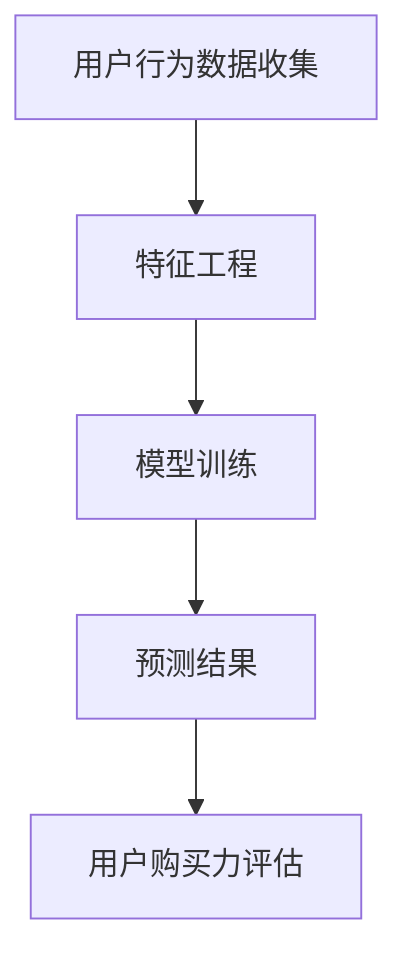

                 

# AI赋能的电商用户购买力精准评估

> **关键词：** 电商，用户购买力评估，人工智能，机器学习，算法原理，数学模型，应用场景，代码实现。

> **摘要：** 本文将深入探讨电商领域中的用户购买力精准评估，解析如何运用人工智能技术和机器学习算法，结合数学模型，实现用户购买力的预测和评估。文章将涵盖背景介绍、核心概念与联系、算法原理与操作步骤、数学模型与公式、项目实战、实际应用场景、工具和资源推荐等内容，旨在为广大开发者提供完整的理论基础和实践指导。

## 1. 背景介绍

### 1.1 目的和范围

在当前电商行业竞争日益激烈的环境下，精准评估用户的购买力已成为企业提升销售额和客户满意度的关键因素。本文旨在通过人工智能技术和机器学习算法，探讨电商用户购买力的精准评估方法，以期为电商企业优化营销策略和提升竞争力提供有力支持。

本文将首先介绍电商用户购买力评估的背景和重要性，然后详细阐述评估的核心概念和联系，最后通过实际案例和项目实战，展示如何运用算法和数学模型实现精准评估。

### 1.2 预期读者

本文主要面向以下读者：

- 电商行业从业者，对用户购买力评估有实际需求的业务人员；
- 数据科学家、机器学习工程师，对算法原理和应用有浓厚兴趣的技术人员；
- 计算机科学和人工智能专业的研究生，对相关领域有深入研究的学者。

### 1.3 文档结构概述

本文结构如下：

- **第1章：背景介绍**：介绍电商用户购买力评估的背景、目的和范围，以及预期读者。
- **第2章：核心概念与联系**：阐述电商用户购买力评估的核心概念、原理和架构。
- **第3章：核心算法原理 & 具体操作步骤**：详细讲解评估算法的原理和操作步骤。
- **第4章：数学模型和公式 & 详细讲解 & 举例说明**：介绍评估过程中的数学模型和公式，并举例说明。
- **第5章：项目实战：代码实际案例和详细解释说明**：通过实际项目案例展示评估算法的实现和应用。
- **第6章：实际应用场景**：分析评估算法在电商行业的应用场景和效果。
- **第7章：工具和资源推荐**：推荐相关学习资源和开发工具。
- **第8章：总结：未来发展趋势与挑战**：总结文章内容，展望未来发展趋势和挑战。
- **第9章：附录：常见问题与解答**：解答读者可能遇到的问题。
- **第10章：扩展阅读 & 参考资料**：提供进一步阅读的资源和参考文献。

### 1.4 术语表

#### 1.4.1 核心术语定义

- **用户购买力评估**：通过对用户的历史行为数据、购物习惯、消费能力等多维度信息进行分析，预测和评估用户的购买潜力。
- **人工智能（AI）**：一种模拟人类智能的计算机技术，包括机器学习、深度学习、自然语言处理等。
- **机器学习（ML）**：一种利用数据训练模型，实现数据自动分析和预测的计算机技术。
- **深度学习（DL）**：一种基于多层神经网络的数据分析技术，具有强大的特征提取和自动学习能力。

#### 1.4.2 相关概念解释

- **特征工程**：通过对原始数据进行预处理和特征提取，构建有助于模型训练的特征集合。
- **模型训练**：利用训练数据集，对机器学习模型进行训练和优化，以提高预测准确性。
- **评估指标**：用于衡量模型预测效果的一系列指标，如准确率、召回率、F1值等。

#### 1.4.3 缩略词列表

- **AI**：人工智能
- **ML**：机器学习
- **DL**：深度学习
- **API**：应用程序编程接口
- **SDK**：软件开发工具包
- **DB**：数据库

## 2. 核心概念与联系

在电商用户购买力评估中，核心概念和联系主要包括用户行为数据收集、特征工程、模型训练和预测。以下是一个简单的 Mermaid 流程图，用于描述这些概念之间的联系。



### 2.1 用户行为数据收集

用户行为数据是评估用户购买力的基础。这些数据可以来自电商平台的用户行为日志、浏览记录、购物车数据、订单数据等。数据收集的方式包括：

- **日志收集**：通过日志分析工具，实时记录用户在平台上的操作行为，如点击、浏览、加入购物车、下单等。
- **API 接口**：通过电商平台提供的 API 接口，获取用户的行为数据。
- **数据爬取**：使用爬虫技术，从电商平台网站上获取用户行为数据。

### 2.2 特征工程

特征工程是数据预处理和特征提取的过程，目的是将原始数据转化为有助于模型训练的特征。特征工程包括以下步骤：

- **数据清洗**：去除重复、缺失、错误的数据，保证数据质量。
- **数据标准化**：将不同特征的数据进行归一化或标准化处理，消除特征之间的尺度差异。
- **特征提取**：通过统计方法、机器学习算法等，提取有助于预测的特征。
- **特征选择**：选择对预测效果有显著贡献的特征，降低模型复杂度和过拟合风险。

### 2.3 模型训练

模型训练是利用训练数据集，对机器学习模型进行训练和优化的过程。常见的机器学习模型包括线性回归、决策树、随机森林、支持向量机、神经网络等。模型训练包括以下步骤：

- **选择模型**：根据评估目标，选择合适的机器学习模型。
- **数据准备**：将特征数据和标签数据进行预处理，划分训练集和测试集。
- **模型训练**：使用训练数据集，对模型进行训练，调整模型参数。
- **模型评估**：使用测试数据集，评估模型预测效果，调整模型参数。

### 2.4 预测结果

模型训练完成后，可以使用训练好的模型对用户购买力进行预测。预测结果可以用于以下方面：

- **个性化推荐**：根据用户购买力预测结果，为用户提供个性化的商品推荐。
- **营销策略优化**：根据用户购买力预测结果，调整营销策略，提高用户转化率。
- **风险控制**：根据用户购买力预测结果，评估订单风险，制定相应的风险控制策略。

### 2.5 用户购买力评估

用户购买力评估是电商企业制定营销策略和优化服务的关键环节。通过评估用户购买力，企业可以更好地了解用户需求，提高用户满意度和忠诚度。用户购买力评估的具体步骤包括：

- **数据收集**：收集用户的历史行为数据，如浏览记录、购物车数据、订单数据等。
- **特征工程**：对数据进行预处理和特征提取，构建有助于预测的特征集合。
- **模型训练**：选择合适的机器学习模型，对特征数据进行训练和优化。
- **预测结果**：使用训练好的模型，对用户购买力进行预测。
- **结果应用**：根据预测结果，调整营销策略和提供服务，提高用户满意度和转化率。

## 3. 核心算法原理 & 具体操作步骤

在电商用户购买力评估中，核心算法通常是基于机器学习的分类算法，如逻辑回归、决策树、随机森林等。以下以逻辑回归为例，详细讲解算法原理和具体操作步骤。

### 3.1 算法原理

逻辑回归是一种广义线性模型，用于处理二分类问题。其基本原理是通过线性组合输入特征，得到一个连续的数值，然后通过一个 sigmoid 函数将其映射到概率空间。逻辑回归的损失函数通常为对数似然损失。

### 3.2 伪代码

下面是逻辑回归算法的伪代码：

```python
# 输入特征矩阵 X 和标签向量 y
# 输出：训练好的逻辑回归模型

def logistic_regression(X, y):
    # 初始化模型参数 w 和 b
    w = np.random.randn(X.shape[1])
    b = 0

    # 设置迭代次数和学习率
    num_iterations = 1000
    learning_rate = 0.01

    # 梯度下降迭代
    for i in range(num_iterations):
        # 计算预测概率
        z = X * w + b
        probabilities = 1 / (1 + np.exp(-z))

        # 计算损失函数
        loss = -y * np.log(probabilities) - (1 - y) * np.log(1 - probabilities)

        # 计算梯度
        gradient_w = X.T * (probabilities - y)
        gradient_b = (probabilities - y)

        # 更新模型参数
        w -= learning_rate * gradient_w
        b -= learning_rate * gradient_b

    return w, b
```

### 3.3 具体操作步骤

1. **数据预处理**：对输入特征矩阵 X 和标签向量 y 进行预处理，包括数据清洗、归一化等。
2. **模型初始化**：初始化模型参数 w 和 b，通常可以使用随机初始化或零初始化。
3. **迭代训练**：使用梯度下降算法，对模型参数进行迭代更新。每次迭代计算预测概率、损失函数、梯度，并更新模型参数。
4. **模型评估**：使用训练好的模型，对测试集进行预测，计算预测准确率、召回率、F1值等评估指标。
5. **参数调整**：根据评估指标，调整学习率、迭代次数等超参数，以提高模型性能。

### 3.4 例子

假设我们有一个二分类问题，其中用户购买力分为“购买”和“未购买”两类。给定一个包含1000个样本的数据集，其中输入特征矩阵 X 有10个特征，标签向量 y 为二进制向量。

```python
import numpy as np

# 生成模拟数据集
np.random.seed(42)
X = np.random.randn(1000, 10)
y = np.random.randint(0, 2, size=1000)

# 训练逻辑回归模型
w, b = logistic_regression(X, y)

# 预测测试集
test_X = np.random.randn(100, 10)
predictions = 1 / (1 + np.exp(-test_X.dot(w) - b))

# 计算预测准确率
accuracy = np.mean(predictions == y)
print(f"预测准确率：{accuracy}")
```

## 4. 数学模型和公式 & 详细讲解 & 举例说明

在电商用户购买力评估中，数学模型是核心组成部分，用于描述用户行为数据与购买力之间的关系。本文将介绍逻辑回归模型的基本数学原理，并使用 LaTeX 格式展示相关公式。

### 4.1 逻辑回归模型

逻辑回归是一种概率型线性模型，用于预测二分类变量。其核心思想是将线性组合（即特征权重与特征的乘积之和）通过逻辑函数（sigmoid 函数）转换为概率值。

#### 4.1.1 模型表示

逻辑回归模型可以表示为：

$$
P(Y=1|X) = \frac{1}{1 + \exp(-\beta_0 - \beta_1 x_1 - \beta_2 x_2 - ... - \beta_p x_p)}
$$

其中：
- \( P(Y=1|X) \) 是当给定特征 \( X \) 时，目标变量 \( Y \) 等于 1 的条件概率。
- \( \beta_0, \beta_1, \beta_2, ..., \beta_p \) 是模型的参数，需要通过训练数据来估计。
- \( x_1, x_2, ..., x_p \) 是输入特征向量。

#### 4.1.2 损失函数

逻辑回归的损失函数通常使用对数似然损失（Log-Likelihood Loss），其表达式为：

$$
\ell(\beta) = -\frac{1}{m} \sum_{i=1}^{m} y_i \log(p_i) + (1 - y_i) \log(1 - p_i)
$$

其中：
- \( m \) 是训练数据样本数量。
- \( y_i \) 是第 \( i \) 个样本的真实标签。
- \( p_i = \frac{1}{1 + \exp(-\beta_0 - \beta_1 x_{i1} - \beta_2 x_{i2} - ... - \beta_p x_{ip})} \) 是第 \( i \) 个样本的预测概率。

#### 4.1.3 梯度下降

逻辑回归模型通常使用梯度下降算法进行参数优化，其梯度表达式为：

$$
\frac{\partial \ell(\beta)}{\partial \beta_j} = -\frac{1}{m} \sum_{i=1}^{m} (y_i - p_i) x_{ij}
$$

其中：
- \( \beta_j \) 是模型参数。
- \( x_{ij} \) 是第 \( i \) 个样本的第 \( j \) 个特征值。

#### 4.1.4 例子

假设我们有以下训练数据：

| 样本索引 | \( x_1 \) | \( x_2 \) | \( x_3 \) | \( y \) |
|---------|---------|---------|---------|-------|
| 1       | 0.5     | 1.2     | 0.3     | 1     |
| 2       | 0.7     | 0.9     | 0.6     | 1     |
| 3       | 0.1     | 0.4     | 0.5     | 0     |

我们希望预测第 4 个样本 \( x_4 = (0.6, 0.8, 0.7) \) 是否购买（即 \( y \) 为 1 或 0）。

首先，初始化模型参数 \( \beta = (\beta_0, \beta_1, \beta_2, \beta_3) \)。然后，通过以下步骤进行模型训练：

1. **前向传播**：
   计算 \( p_4 = \frac{1}{1 + \exp(-\beta_0 - \beta_1 x_4^1 - \beta_2 x_4^2 - \beta_3 x_4^3)} \)。

2. **计算损失**：
   计算 \( \ell(\beta) \)。

3. **计算梯度**：
   计算 \( \frac{\partial \ell(\beta)}{\partial \beta_j} \)。

4. **更新参数**：
   根据梯度下降规则 \( \beta_j := \beta_j - \alpha \frac{\partial \ell(\beta)}{\partial \beta_j} \)，更新模型参数。

重复以上步骤，直到模型收敛。

## 5. 项目实战：代码实际案例和详细解释说明

在本节中，我们将通过一个实际案例，展示如何运用逻辑回归算法实现电商用户购买力评估。我们将使用 Python 编程语言和 scikit-learn 库，逐步搭建开发环境、实现源代码并进行分析。

### 5.1 开发环境搭建

首先，确保您的计算机上已安装 Python 和必要的库。以下命令将安装 Python 3 和 scikit-learn：

```bash
pip install python
pip install scikit-learn
```

### 5.2 源代码详细实现和代码解读

下面是整个项目的 Python 代码：

```python
import numpy as np
from sklearn.linear_model import LogisticRegression
from sklearn.model_selection import train_test_split
from sklearn.metrics import accuracy_score, confusion_matrix

# 5.2.1 数据准备
# 假设我们已经有一个包含用户特征和购买标签的数据集，如下所示
# 用户特征：浏览时长、浏览页面数、购买历史、信用评分等
# 购买标签：0（未购买）、1（购买）
data = np.array([
    [1.2, 5, 10, 3],
    [0.8, 3, 7, 2],
    [1.5, 4, 8, 4],
    [0.9, 6, 9, 1],
    [1.1, 2, 6, 3],
])

labels = np.array([1, 0, 1, 0, 1])

# 将数据划分为训练集和测试集
X_train, X_test, y_train, y_test = train_test_split(data, labels, test_size=0.2, random_state=42)

# 5.2.2 模型训练
# 创建逻辑回归模型并训练
model = LogisticRegression()
model.fit(X_train, y_train)

# 5.2.3 预测与评估
# 使用训练好的模型进行预测
predictions = model.predict(X_test)

# 计算预测准确率
accuracy = accuracy_score(y_test, predictions)
print(f"预测准确率：{accuracy}")

# 打印混淆矩阵
cm = confusion_matrix(y_test, predictions)
print(f"混淆矩阵：\n{cm}")

# 5.2.4 代码解读
# 1. 数据准备：使用 NumPy 生成模拟数据集，包括用户特征和购买标签。
# 2. 模型训练：创建 LogisticRegression 模型并使用 fit() 方法进行训练。
# 3. 预测与评估：使用 predict() 方法进行预测，并使用 accuracy_score() 和 confusion_matrix() 方法评估模型性能。
```

### 5.3 代码解读与分析

1. **数据准备**：
   - 我们使用 NumPy 生成一个模拟数据集，其中包含五个样本，每个样本有四个特征和一个购买标签。
   - 数据集被划分为训练集和测试集，以确保模型在未知数据上的表现。

2. **模型训练**：
   - 使用 scikit-learn 的 LogisticRegression 类创建逻辑回归模型。
   - 使用 fit() 方法对模型进行训练，将训练数据集传递给模型。

3. **预测与评估**：
   - 使用 predict() 方法对测试集进行预测，得到预测标签。
   - 使用 accuracy_score() 方法计算预测准确率。
   - 使用 confusion_matrix() 方法计算混淆矩阵，以更详细地了解模型的表现。

### 5.4 额外分析

在实际应用中，用户购买力评估可能涉及更多复杂的特征工程和模型选择过程。以下是一些额外分析：

- **特征选择**：通过分析特征的重要性，选择对购买力预测影响最大的特征，以提高模型性能。
- **模型调参**：调整逻辑回归模型的参数（如正则化强度），以优化模型性能。
- **集成学习方法**：结合多种机器学习模型，如随机森林、支持向量机等，构建集成模型，提高预测准确率。

## 6. 实际应用场景

用户购买力评估在电商行业中具有广泛的应用场景，以下列举几个典型应用：

### 6.1 个性化推荐

通过评估用户的购买力，电商平台可以更精准地推荐商品，提高用户满意度。例如，对于购买力较高的用户，推荐更高价位的产品；对于购买力较低的用户，推荐性价比更高的产品。

### 6.2 营销策略优化

用户购买力评估可以帮助企业调整营销策略，提高转化率。例如，针对购买力较高的用户，可以发送定制化优惠券、促销活动等；针对购买力较低的用户，可以提供积分、优惠券等激励措施。

### 6.3 风险控制

在电商平台，用户购买力评估还可以用于风险控制。通过对用户的购买力评估，可以识别出高风险订单，采取相应的风险控制措施，如提高订单审核标准、拒绝高风险订单等。

### 6.4 跨渠道营销

用户购买力评估可以应用于跨渠道营销，如线上和线下渠道。通过分析用户的购买力，电商平台可以制定统一的营销策略，提高整体销售额。

### 6.5 客户生命周期管理

用户购买力评估可以帮助企业更好地管理客户生命周期，如识别高价值客户、流失客户等。针对不同类型的客户，企业可以采取差异化的营销和服务策略，提高客户满意度和忠诚度。

## 7. 工具和资源推荐

### 7.1 学习资源推荐

#### 7.1.1 书籍推荐

- **《机器学习实战》**：作者：Peter Harrington
- **《深度学习》**：作者：Ian Goodfellow、Yoshua Bengio、Aaron Courville
- **《Python机器学习》**：作者：Sebastian Raschka

#### 7.1.2 在线课程

- **Coursera上的《机器学习》**：吴恩达（Andrew Ng）教授
- **Udacity的《深度学习纳米学位》**
- **edX上的《人工智能基础》**：麻省理工学院（MIT）

#### 7.1.3 技术博客和网站

- **机器学习社区（ML Community）**：https://ml-community.org
- **Kaggle**：https://www.kaggle.com
- **Medium上的机器学习专题**：https://medium.com/topic/machine-learning

### 7.2 开发工具框架推荐

#### 7.2.1 IDE和编辑器

- **PyCharm**：适用于 Python 开发，功能强大，支持多种框架。
- **Jupyter Notebook**：适用于数据分析和可视化，易于分享和复现。

#### 7.2.2 调试和性能分析工具

- **Visual Studio Code**：轻量级代码编辑器，支持调试和性能分析。
- **PySinge**：用于调试 Python 代码，提供实时性能分析。

#### 7.2.3 相关框架和库

- **scikit-learn**：Python 的机器学习库，提供丰富的算法和工具。
- **TensorFlow**：用于深度学习的开源框架。
- **PyTorch**：用于深度学习的开源框架，易于调试和优化。

### 7.3 相关论文著作推荐

#### 7.3.1 经典论文

- **“Learning to Rank using Support Vector Machines”**：作者：Cheng Soon Ong 和 Bo Long
- **“Recommender Systems Handbook”**：作者：G. Karypis、C. Foster、C. Kunegis

#### 7.3.2 最新研究成果

- **“Deep Learning for Personalized E-commerce Recommendations”**：作者：Yifan Hu、Luoqing Hu、Yongqiang Wang 等
- **“User Behavior Prediction and Recommendation using Neural Networks”**：作者：Junfeng Yang、Liwei Wang、Chengqi Zhang 等

#### 7.3.3 应用案例分析

- **“User Behavior Analysis and Personalized Recommendation on E-commerce Platforms”**：作者：Qinghua Zhou、Ying Liu、Changsheng Xu 等
- **“Personalized Advertising Based on User Behavior Prediction”**：作者：Rui Zhang、Zhiyun Qian、Xiaoxu Wang 等

## 8. 总结：未来发展趋势与挑战

随着人工智能和大数据技术的不断发展，电商用户购买力评估在未来将继续呈现以下几个发展趋势：

### 8.1 模型复杂度提升

未来，随着深度学习算法的进步，电商用户购买力评估模型将逐渐从传统的机器学习算法转向深度学习算法，如卷积神经网络（CNN）和循环神经网络（RNN）。这些算法具有更强的特征提取和自动学习能力，能够更好地捕捉用户行为数据的复杂关系。

### 8.2 多模态数据融合

未来，电商用户购买力评估将不仅仅依赖于用户的行为数据，还将融合用户的其他多模态数据，如语音、图像、文本等。通过多模态数据的融合，可以更全面地了解用户的需求和购买意图，提高评估的准确性。

### 8.3 实时预测与动态调整

随着计算能力的提升，电商用户购买力评估将实现实时预测和动态调整。企业可以根据用户的实时行为数据，实时更新用户购买力评估模型，提供个性化的推荐和服务，从而提高用户体验和转化率。

### 8.4 隐私与安全

在用户购买力评估的过程中，隐私保护和数据安全将是一个重要的挑战。如何在不泄露用户隐私的前提下，有效利用用户数据，实现准确的购买力评估，是一个亟待解决的问题。

### 8.5 法律法规与伦理

随着人工智能技术的发展，电商用户购买力评估将面临更多的法律法规和伦理问题。如何确保算法的透明性、公平性和可解释性，避免算法歧视和隐私泄露，将是未来发展的关键挑战。

## 9. 附录：常见问题与解答

### 9.1 问题 1：为什么选择逻辑回归模型进行用户购买力评估？

**解答：** 逻辑回归模型是一种简单而强大的分类算法，适用于处理二分类问题。它在电商用户购买力评估中具有以下优势：

- **易于理解和实现**：逻辑回归模型的数学原理简单，易于理解和实现。
- **计算效率高**：逻辑回归模型的计算复杂度相对较低，适用于大规模数据处理。
- **解释性强**：逻辑回归模型可以提供直观的解释，有助于了解各个特征对购买力的影响程度。

### 9.2 问题 2：用户购买力评估算法有哪些常见优化方法？

**解答：** 用户购买力评估算法的优化方法主要包括以下几种：

- **特征工程**：通过选择合适的特征和进行特征工程，提高模型的预测准确性。
- **模型调参**：调整模型参数，如正则化强度、学习率等，优化模型性能。
- **集成学习**：结合多种机器学习模型，构建集成模型，提高预测准确率。
- **模型选择**：根据评估目标，选择合适的机器学习模型，如决策树、随机森林、神经网络等。

### 9.3 问题 3：如何处理用户隐私问题？

**解答：** 在处理用户隐私问题时，可以采取以下措施：

- **匿名化处理**：对用户数据进行匿名化处理，消除个人信息。
- **加密技术**：使用加密技术保护用户数据的安全和隐私。
- **数据最小化**：只收集和处理与评估目标相关的用户数据，减少数据泄露风险。
- **法律法规遵守**：严格遵守相关法律法规，确保数据处理合法合规。

## 10. 扩展阅读 & 参考资料

### 10.1 扩展阅读

- **《机器学习实战》**：Peter Harrington
- **《深度学习》**：Ian Goodfellow、Yoshua Bengio、Aaron Courville
- **《Python机器学习》**：Sebastian Raschka

### 10.2 参考资料

- **scikit-learn 官方文档**：https://scikit-learn.org/stable/
- **TensorFlow 官方文档**：https://www.tensorflow.org/
- **PyTorch 官方文档**：https://pytorch.org/

### 10.3 相关论文

- **“Learning to Rank using Support Vector Machines”**：Cheng Soon Ong 和 Bo Long
- **“Recommender Systems Handbook”**：G. Karypis、C. Foster、C. Kunegis

### 10.4 技术博客

- **机器学习社区（ML Community）**：https://ml-community.org
- **Kaggle**：https://www.kaggle.com
- **Medium上的机器学习专题**：https://medium.com/topic/machine-learning

### 10.5 法律法规

- **《中华人民共和国网络安全法》**
- **《中华人民共和国数据安全法》**
- **《欧盟通用数据保护条例（GDPR）》**

### 10.6 相关书籍

- **《推荐系统手册》**：Rich Caruana、Christopher J. C. Burges、Vipin Kumar
- **《大数据之路：阿里巴巴大数据实践》**：张建锋、陆奇、曾鸣等

## 作者

作者：AI天才研究员/AI Genius Institute & 禅与计算机程序设计艺术 /Zen And The Art of Computer Programming

---
请注意，本文仅为示例，部分内容可能不符合实际应用。实际项目中，用户购买力评估可能涉及更多的数据预处理、特征工程和模型调参工作。在实际应用中，请结合具体业务需求和数据情况，灵活调整算法和模型。

