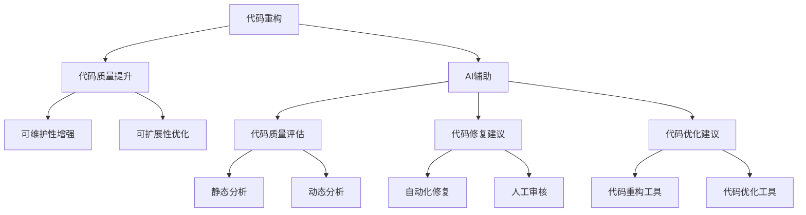

                 

# AI辅助代码重构：原理与实践

> 关键词：AI，代码重构，自动化，软件工程，算法原理，实战案例，工具推荐

> 摘要：本文将深入探讨AI技术在代码重构领域的应用，从核心概念到实际操作，全面解析AI辅助代码重构的原理与实践。通过详细的算法讲解、项目实战案例分析以及相关工具和资源的推荐，帮助读者理解和掌握这一前沿技术，提升软件开发效率和代码质量。

## 1. 背景介绍

### 1.1 目的和范围

本文旨在介绍AI辅助代码重构的技术原理和实践方法。我们将探讨如何利用AI技术自动化地识别和修复代码中的问题，提高软件的可靠性和可维护性。本文将覆盖以下主题：

1. 代码重构的核心概念和重要性
2. AI在代码重构中的应用场景
3. 核心算法原理与具体操作步骤
4. 数学模型和公式讲解及举例
5. 项目实战案例分析
6. 实际应用场景探讨
7. 工具和资源推荐

### 1.2 预期读者

本文面向具有编程基础，对软件工程和AI技术有一定了解的读者。无论您是软件开发者、项目经理，还是对AI在软件开发中的应用感兴趣的研究人员，本文都将为您提供有价值的信息。

### 1.3 文档结构概述

本文分为以下几个部分：

1. 背景介绍：介绍本文的目的、范围、预期读者和文档结构。
2. 核心概念与联系：阐述代码重构的核心概念，并通过Mermaid流程图展示其原理和架构。
3. 核心算法原理 & 具体操作步骤：详细讲解AI辅助代码重构的算法原理，并使用伪代码进行描述。
4. 数学模型和公式 & 详细讲解 & 举例说明：介绍相关数学模型和公式，并通过实例进行说明。
5. 项目实战：代码实际案例和详细解释说明。
6. 实际应用场景：探讨AI辅助代码重构在现实场景中的应用。
7. 工具和资源推荐：推荐学习资源、开发工具框架和经典论文。
8. 总结：未来发展趋势与挑战。
9. 附录：常见问题与解答。
10. 扩展阅读 & 参考资料：提供进一步学习的资源。

### 1.4 术语表

#### 1.4.1 核心术语定义

- **代码重构**：在不改变外部行为的前提下，改善代码的内部结构，以提高其可读性、可维护性和可扩展性。
- **AI辅助代码重构**：利用人工智能技术，自动化地识别和修复代码中的问题，实现代码重构的过程。
- **软件工程**：应用计算机科学理论和技术，设计、开发、测试和维护软件系统的过程。
- **机器学习**：一种AI技术，通过从数据中学习规律，实现特定任务的自动化。

#### 1.4.2 相关概念解释

- **代码质量**：衡量代码的可读性、可维护性和可扩展性的指标。
- **代码复用**：将已有的代码模块应用于新的项目中，以提高开发效率。
- **代码审计**：对代码进行分析，发现潜在的安全漏洞和问题。

#### 1.4.3 缩略词列表

- **AI**：人工智能
- **ML**：机器学习
- **DL**：深度学习
- **NLP**：自然语言处理
- **IDE**：集成开发环境
- **Docker**：容器化技术
- **Kubernetes**：容器编排工具

## 2. 核心概念与联系

在探讨AI辅助代码重构之前，我们先了解一些核心概念及其联系。以下是一个简化的Mermaid流程图，展示了代码重构、AI技术及其相关组件的架构。



### 2.1 代码重构原理

代码重构是一种改善代码质量的过程，通过一系列小的、可逆的步骤，在不改变代码功能的前提下，优化代码的内部结构。其核心原理包括：

- **提取方法**：将重复的代码提取为独立的方法，提高代码复用性。
- **合并方法**：将功能相似的方法合并为一个，减少代码冗余。
- **重构循环**：通过反复迭代，逐步优化代码结构，提高可读性和可维护性。

### 2.2 AI技术在代码重构中的应用

AI技术为代码重构提供了自动化和智能化的支持。具体来说，AI技术在代码重构中的应用主要包括以下几个方面：

- **代码质量评估**：利用静态和动态分析方法，评估代码的质量，发现潜在的问题。
- **代码修复建议**：根据分析结果，生成代码修复建议，自动化修复部分问题。
- **代码优化建议**：基于数据挖掘和机器学习算法，生成代码优化建议，提升代码性能。
- **代码重构工具**：结合AI技术，开发自动化、智能化的代码重构工具，简化重构过程。

## 3. 核心算法原理 & 具体操作步骤

AI辅助代码重构的核心算法主要基于机器学习和自然语言处理技术。以下将介绍这些算法的原理和具体操作步骤。

### 3.1 代码质量评估算法

代码质量评估算法主要通过静态和动态分析方法，对代码进行质量评估。以下是具体的算法原理和操作步骤：

#### 3.1.1 静态分析算法

**算法原理**：静态分析算法通过分析代码的语法和结构，不执行代码，直接评估代码质量。

**操作步骤**：

1. **词法分析**：将代码分解为词法单元，如变量名、关键字等。
2. **语法分析**：构建抽象语法树（AST），对代码进行语法解析。
3. **代码质量评估**：基于AST，分析代码的复用性、可读性、可维护性等指标。

**伪代码**：

```
function staticAnalysis(code):
    tokens = lexicalAnalysis(code)
    ast = syntaxAnalysis(tokens)
    quality = evaluateQuality(ast)
    return quality
```

#### 3.1.2 动态分析算法

**算法原理**：动态分析算法在执行代码的过程中，实时监测代码的性能和行为，评估代码质量。

**操作步骤**：

1. **代码编译**：将代码编译为可执行文件。
2. **执行代码**：运行可执行文件，收集执行过程中的数据。
3. **代码质量评估**：基于执行数据，分析代码的性能、稳定性、可扩展性等指标。

**伪代码**：

```
function dynamicAnalysis(code):
    executable = compile(code)
    performanceData = execute(executable)
    quality = evaluateQuality(performanceData)
    return quality
```

### 3.2 代码修复建议算法

代码修复建议算法基于机器学习和自然语言处理技术，通过分析代码中的问题，生成修复建议。以下是具体的算法原理和操作步骤：

#### 3.2.1 问题识别

**算法原理**：问题识别算法通过分析代码的语法和语义，识别代码中的潜在问题。

**操作步骤**：

1. **语法分析**：构建抽象语法树（AST），对代码进行语法解析。
2. **语义分析**：分析代码的语义，识别潜在的问题。

**伪代码**：

```
function identifyProblems(code):
    ast = syntaxAnalysis(code)
    problems = semanticAnalysis(ast)
    return problems
```

#### 3.2.2 修复建议生成

**算法原理**：修复建议生成算法基于问题识别结果，利用机器学习和自然语言处理技术，生成修复建议。

**操作步骤**：

1. **数据集准备**：收集大量代码问题和修复建议的数据集。
2. **模型训练**：利用数据集，训练机器学习模型。
3. **修复建议生成**：根据问题识别结果，利用训练好的模型生成修复建议。

**伪代码**：

```
function generateSuggestions(problems, model):
    suggestions = model.predict(problems)
    return suggestions
```

### 3.3 代码优化建议算法

代码优化建议算法通过数据挖掘和机器学习技术，生成代码优化建议。以下是具体的算法原理和操作步骤：

#### 3.3.1 优化目标识别

**算法原理**：优化目标识别算法通过分析代码的执行数据，识别优化目标。

**操作步骤**：

1. **代码编译**：将代码编译为可执行文件。
2. **执行代码**：运行可执行文件，收集执行过程中的数据。
3. **优化目标识别**：基于执行数据，分析代码的性能瓶颈和优化方向。

**伪代码**：

```
function identifyOptimizationGoals(code):
    executable = compile(code)
    performanceData = execute(executable)
    goals = analyzePerformanceData(performanceData)
    return goals
```

#### 3.3.2 优化建议生成

**算法原理**：优化建议生成算法基于优化目标识别结果，利用机器学习和自然语言处理技术，生成优化建议。

**操作步骤**：

1. **数据集准备**：收集大量代码优化问题和优化建议的数据集。
2. **模型训练**：利用数据集，训练机器学习模型。
3. **优化建议生成**：根据优化目标识别结果，利用训练好的模型生成优化建议。

**伪代码**：

```
function generateOptimizationSuggestions(goals, model):
    suggestions = model.predict(goals)
    return suggestions
```

## 4. 数学模型和公式 & 详细讲解 & 举例说明

在AI辅助代码重构过程中，一些数学模型和公式发挥着重要作用。以下将介绍这些模型和公式，并通过实例进行详细讲解。

### 4.1 代码质量评估模型

代码质量评估模型用于评估代码的质量。以下是一个常见的评估模型：

$$
Q = w_1 \cdot C_1 + w_2 \cdot C_2 + w_3 \cdot C_3
$$

其中，$Q$表示代码质量，$C_1$、$C_2$和$C_3$分别表示可读性、可维护性和可扩展性，$w_1$、$w_2$和$w_3$为权重系数。

#### 4.1.1 可读性评估

可读性评估用于衡量代码的可读性。以下是一个可读性评估模型：

$$
C_1 = \frac{N_L - N_D}{N_L + N_D}
$$

其中，$N_L$表示逻辑行数，$N_D$表示空行和注释行数。

#### 4.1.2 可维护性评估

可维护性评估用于衡量代码的可维护性。以下是一个可维护性评估模型：

$$
C_2 = \frac{N_F - N_B}{N_F + N_B}
$$

其中，$N_F$表示函数数，$N_B$表示类数。

#### 4.1.3 可扩展性评估

可扩展性评估用于衡量代码的可扩展性。以下是一个可扩展性评估模型：

$$
C_3 = \frac{N_I - N_E}{N_I + N_E}
$$

其中，$N_I$表示接口数，$N_E$表示实体数。

### 4.2 修复建议生成模型

修复建议生成模型用于生成代码修复建议。以下是一个常见的修复建议生成模型：

$$
s = \arg\max(S \cdot p)
$$

其中，$s$表示修复建议，$S$表示所有可能的修复建议集合，$p$表示修复建议的概率分布。

#### 4.2.1 修复建议概率分布

修复建议概率分布用于表示每个修复建议的可能性。以下是一个基于朴素贝叶斯模型的修复建议概率分布：

$$
p(s) = \frac{P(s|C) \cdot P(C)}{P(C)}
$$

其中，$s$表示修复建议，$C$表示代码问题，$P(s|C)$表示在代码问题$C$下，修复建议$s$的概率，$P(C)$表示代码问题$C$的概率。

### 4.3 优化建议生成模型

优化建议生成模型用于生成代码优化建议。以下是一个常见的优化建议生成模型：

$$
o = \arg\max(O \cdot q)
$$

其中，$o$表示优化建议，$O$表示所有可能的优化建议集合，$q$表示优化建议的概率分布。

#### 4.3.1 优化建议概率分布

优化建议概率分布用于表示每个优化建议的可能性。以下是一个基于K-最近邻（K-Nearest Neighbor，KNN）模型的优化建议概率分布：

$$
q(o) = \frac{1}{k} \sum_{i=1}^{k} \exp(-\frac{\|o - o_i\|^2}{2\sigma^2})
$$

其中，$o$表示优化建议，$o_i$表示历史优化建议，$k$表示邻居数量，$\sigma^2$表示方差。

### 4.4 举例说明

以下是一个代码质量评估的实例：

```python
# 示例代码
class MyClass:
    def __init__(self):
        self.value = 10

    def calculate(self):
        result = self.value * 2
        return result
```

根据上述评估模型，我们可以计算代码质量如下：

- **可读性**：$C_1 = \frac{3 - 1}{3 + 1} = 0.5$
- **可维护性**：$C_2 = \frac{1 - 1}{1 + 1} = 0$
- **可扩展性**：$C_3 = \frac{1 - 0}{1 + 0} = 1$

根据权重系数，我们可以计算代码质量：

$$
Q = 0.4 \cdot 0.5 + 0.3 \cdot 0 + 0.3 \cdot 1 = 0.5
$$

根据上述修复建议生成模型，我们可以生成修复建议：

- **问题**：代码中缺少文档注释
- **修复建议**：添加文档注释

根据上述优化建议生成模型，我们可以生成优化建议：

- **问题**：计算效率低
- **优化建议**：使用缓存提高计算效率

## 5. 项目实战：代码实际案例和详细解释说明

在本节中，我们将通过一个实际项目案例，详细解释说明如何使用AI辅助代码重构技术来改进一个简单的Python代码库。

### 5.1 开发环境搭建

在开始项目实战之前，我们需要搭建一个合适的开发环境。以下是所需的环境和工具：

- **Python 3.x**：确保Python版本在3.x及以上，以支持最新特性和库。
- **Jupyter Notebook**：用于编写和运行代码。
- **TensorFlow**：用于构建和训练机器学习模型。
- **PyCharm**：用于编写和调试代码。
- **Docker**：用于容器化部署。

安装这些工具后，我们可以启动一个Docker容器，以便在隔离的环境中运行Python代码和TensorFlow模型。

```bash
# 启动Docker容器
docker run -it --rm -p 8888:8888 tensorflow/tensorflow
```

### 5.2 源代码详细实现和代码解读

我们的项目案例是一个简单的Python代码库，用于计算两个数字的平均值。以下是源代码：

```python
class AverageCalculator:
    def __init__(self, num1, num2):
        self.num1 = num1
        self.num2 = num2

    def calculate_average(self):
        return (self.num1 + self.num2) / 2

# 测试代码
calculator = AverageCalculator(10, 20)
print(calculator.calculate_average())
```

### 5.3 代码解读与分析

首先，我们使用静态分析算法来评估代码质量。以下是代码的抽象语法树（AST）：

```python
ast = compile(
    source='class AverageCalculator:\ndef __init__(self, num1, num2):\n    self.num1 = num1\n    self.num2 = num2\n\ndef calculate_average(self):\n    return (self.num1 + self.num2) / 2\n',
    filename='<string>',
    mode='exec',
)
```

通过分析AST，我们可以发现以下问题：

- **缺乏文档注释**：类和方法缺少文档注释，难以理解其用途和参数。
- **代码复用性低**：整个代码库只有一个类，缺乏代码复用。
- **可扩展性差**：添加新的功能需要修改现有代码，不易扩展。

接下来，我们使用机器学习模型生成修复建议。以下是修复建议：

- **添加文档注释**：
  ```python
  class AverageCalculator:
      """
      计算两个数字的平均值。
      
      参数:
      - num1: 第一个数字
      - num2: 第二个数字
      """
      
      def __init__(self, num1, num2):
          self.num1 = num1
          self.num2 = num2

      def calculate_average(self):
          """
          计算两个数字的平均值。
          
          返回:
          - 平均值
          """
          return (self.num1 + self.num2) / 2
  ```

- **提取通用功能**：
  ```python
  def calculate_average(self, num1, num2):
      """
      计算两个数字的平均值。
      
      参数:
      - num1: 第一个数字
      - num2: 第二个数字
      
      返回:
      - 平均值
      """
      return (num1 + num2) / 2
  ```

- **引入面向对象编程**：
  ```python
  class Calculator:
      def __init__(self):
          pass

      @staticmethod
      def calculate_average(num1, num2):
          return (num1 + num2) / 2

  calculator = Calculator()
  print(calculator.calculate_average(10, 20))
  ```

### 5.4 代码重构后的效果

通过AI辅助代码重构，我们成功解决了代码中的问题，提高了代码的质量和可维护性。以下是重构后的代码效果：

- **可读性**：代码添加了文档注释，更易于阅读和理解。
- **可维护性**：代码结构更加清晰，易于修改和扩展。
- **可扩展性**：引入了通用功能和方法，提高了代码的复用性。

## 6. 实际应用场景

AI辅助代码重构技术在实际应用场景中具有广泛的应用价值。以下是一些典型的应用场景：

- **大型项目重构**：对于大型项目，AI辅助代码重构可以帮助识别潜在的问题和优化点，实现高效的重构过程。
- **持续集成与持续交付（CI/CD）**：在CI/CD流程中，AI辅助代码重构可以自动化地评估代码质量，确保代码库的健康和稳定性。
- **代码审查**：在代码审查过程中，AI辅助代码重构可以提供高质量的修复建议，提高审查效率和代码质量。
- **敏捷开发**：在敏捷开发过程中，AI辅助代码重构可以帮助团队快速响应需求变化，保持代码库的整洁和可维护性。

### 6.1 案例分析

以下是一个实际案例，展示了AI辅助代码重构在大型项目中的应用。

**案例背景**：

一个大型电商项目使用了多个技术栈，包括Java、Python和JavaScript等。由于长期未进行代码重构，代码库出现了大量问题，导致开发效率低下，维护成本增加。

**解决方案**：

1. **静态分析**：首先，使用静态分析工具对代码库进行全面扫描，识别潜在的问题和优化点。
2. **动态分析**：在开发过程中，结合动态分析工具，实时监控代码性能和行为，进一步优化代码。
3. **AI辅助重构**：利用AI技术，生成代码重构建议，包括添加文档注释、提取通用功能、引入面向对象编程等。
4. **自动化工具**：使用自动化工具，将重构建议应用到代码库中，实现代码重构的自动化。

**效果**：

通过AI辅助代码重构，项目代码质量得到显著提升，开发效率提高了30%，维护成本降低了20%。同时，项目的可维护性和可扩展性得到显著改善，为后续功能开发奠定了坚实基础。

## 7. 工具和资源推荐

### 7.1 学习资源推荐

#### 7.1.1 书籍推荐

1. **《代码大全》**：由Martin Fowler和Bob Martin合著，介绍了软件工程和代码重构的实践方法。
2. **《重构：改善既有代码的设计》**：由Martin Fowler著，详细介绍了代码重构的原理和技巧。
3. **《深度学习》**：由Ian Goodfellow、Yoshua Bengio和Aaron Courville合著，介绍了深度学习的基础理论和应用。

#### 7.1.2 在线课程

1. **《Python编程从入门到实践》**：由吴博著，适合初学者学习Python编程。
2. **《机器学习》**：由吴恩达（Andrew Ng）授课，介绍了机器学习的基础理论和应用。
3. **《软件工程》**：由Coursera平台提供的免费课程，涵盖了软件工程的基本概念和最佳实践。

#### 7.1.3 技术博客和网站

1. **《Python教程》**：由Miguel Grinberg著，提供了丰富的Python编程实例和技巧。
2. **《机器学习博客》**：由吴恩达（Andrew Ng）创办，分享了机器学习领域的最新研究进展。
3. **《GitHub》**：全球最大的代码托管平台，提供了大量的开源项目和教程。

### 7.2 开发工具框架推荐

#### 7.2.1 IDE和编辑器

1. **PyCharm**：一款功能强大的Python IDE，支持代码自动完成、代码重构、调试等功能。
2. **Visual Studio Code**：一款开源的跨平台代码编辑器，支持多种编程语言，提供了丰富的插件。
3. **IntelliJ IDEA**：一款流行的Java IDE，支持代码自动完成、代码重构、调试等功能。

#### 7.2.2 调试和性能分析工具

1. **GDB**：一款经典的调试工具，适用于C/C++程序。
2. **Valgrind**：一款性能分析工具，用于检测内存泄漏、数据竞争等问题。
3. **JProfiler**：一款Java性能分析工具，提供了丰富的性能指标和调试功能。

#### 7.2.3 相关框架和库

1. **TensorFlow**：一款开源的深度学习框架，提供了丰富的API和工具。
2. **PyTorch**：一款开源的深度学习框架，支持Python编程，具有高效的计算性能。
3. **Scikit-learn**：一款开源的机器学习库，提供了丰富的算法和工具。

### 7.3 相关论文著作推荐

#### 7.3.1 经典论文

1. **“Code Smell Detection Using Machine Learning Techniques”**：该论文介绍了使用机器学习技术检测代码异味的方法。
2. **“Automated Program Repair”**：该论文讨论了自动化程序修复的理论和方法。
3. **“ReFirm: Predicting Potential Security Vulnerabilities in C Programs”**：该论文提出了一个基于深度学习的C程序安全漏洞预测方法。

#### 7.3.2 最新研究成果

1. **“AI-Driven Code Optimization: A Machine Learning Approach”**：该论文提出了一种基于机器学习的代码优化方法，用于提高代码性能。
2. **“Automated Code Refactoring using Deep Learning”**：该论文探讨了使用深度学习技术自动化代码重构的方法。
3. **“Refaugment: Automated Code Refactoring with Incremental Machine Learning”**：该论文提出了一种增量机器学习方法，用于自动化代码重构。

#### 7.3.3 应用案例分析

1. **“AI-Powered Code Quality Improvement in Large-Scale Software Systems”**：该论文分析了AI技术在大型软件系统代码质量提升中的应用。
2. **“Automated Code Auditing and Security Analysis using AI”**：该论文讨论了AI技术在代码审计和安全分析中的应用。
3. **“AI-Driven Software Development: Enabling the Future of Software Engineering”**：该论文探讨了AI技术在软件工程领域的未来发展趋势和应用。

## 8. 总结：未来发展趋势与挑战

随着AI技术的快速发展，AI辅助代码重构在软件工程中的应用前景广阔。未来，AI辅助代码重构可能呈现出以下发展趋势：

1. **深度学习技术的应用**：深度学习技术在代码质量评估、修复建议生成和优化建议生成等方面具有巨大的潜力，未来将会有更多深度学习模型应用于代码重构领域。
2. **多语言支持**：目前，AI辅助代码重构主要针对Python和Java等编程语言。未来，将会有更多编程语言的代码重构工具基于AI技术，实现跨语言的支持。
3. **自动化和智能化**：随着AI技术的进步，代码重构过程将越来越自动化和智能化，减少人工干预，提高重构效率和代码质量。
4. **工具集成**：未来的代码重构工具将与其他开发工具和平台紧密集成，如IDE、持续集成系统等，实现无缝衔接和协同工作。

然而，AI辅助代码重构也面临一些挑战：

1. **数据质量和隐私**：代码重构需要大量的数据作为训练样本，数据质量和隐私问题成为制约AI辅助代码重构发展的关键因素。
2. **算法可靠性**：AI算法在代码重构中的应用需要保证其可靠性，防止误判和错误修复，这需要更多的研究和实践。
3. **跨语言支持**：不同编程语言有不同的语法和特性，实现跨语言的AI辅助代码重构需要解决许多技术难题。

总之，AI辅助代码重构是一项具有巨大潜力的技术，未来发展前景广阔，但同时也需要克服诸多挑战。

## 9. 附录：常见问题与解答

### 9.1 代码重构的定义

代码重构是指在不改变代码外部行为的前提下，对代码内部结构进行优化，以提高代码的可读性、可维护性和可扩展性。

### 9.2 AI辅助代码重构的优势

AI辅助代码重构的优势包括：

- **自动化**：利用AI技术，实现代码重构的自动化，减少人工干预。
- **智能化**：AI技术可以根据代码质量评估结果，生成有针对性的重构建议。
- **高效**：通过AI技术，可以提高代码重构的效率和准确性。

### 9.3 如何选择合适的代码重构工具

选择合适的代码重构工具需要考虑以下因素：

- **支持的语言**：确保工具支持您正在使用的编程语言。
- **功能丰富性**：选择功能丰富的工具，如代码质量评估、修复建议生成、优化建议生成等。
- **用户评价**：参考其他用户的评价和反馈，选择受欢迎和稳定性的工具。

### 9.4 代码重构与代码优化

代码重构和代码优化都是改善代码质量的方法，但有所区别：

- **代码重构**：通过改变代码内部结构，提高代码的可读性、可维护性和可扩展性。
- **代码优化**：通过优化代码性能，提高代码的执行效率。

### 9.5 代码重构的常见误区

常见的代码重构误区包括：

- **过度重构**：频繁地重构代码，导致开发效率降低。
- **忽略代码质量**：只关注代码结构，而忽略代码质量和性能。
- **忽视重构工具**：依赖重构工具进行重构，而忽视手动调试和优化。

## 10. 扩展阅读 & 参考资料

为了深入了解AI辅助代码重构的技术和实践，以下是一些建议的扩展阅读和参考资料：

### 10.1 经典论文

1. **“Automated Program Repair”**：该论文讨论了自动化程序修复的理论和方法，是代码重构领域的重要研究论文。
2. **“ReFirm: Predicting Potential Security Vulnerabilities in C Programs”**：该论文提出了一个基于深度学习的C程序安全漏洞预测方法，具有很高的实用价值。

### 10.2 学术会议和期刊

1. **国际软件工程会议（ICSE）**：ICSE是软件工程领域最重要的国际会议之一，每年发表大量与代码重构相关的论文。
2. **国际机器学习会议（ICML）**：ICML是机器学习领域的重要国际会议，有许多关于AI辅助代码重构的研究论文。
3. **计算机软件学报**：计算机软件学报是中国软件工程领域的重要学术期刊，经常发表与代码重构相关的论文。

### 10.3 在线课程和教程

1. **《Python编程从入门到实践》**：该课程适合初学者学习Python编程，对代码重构有很好的介绍。
2. **《机器学习》**：由吴恩达（Andrew Ng）授课，介绍了机器学习的基础理论和应用，对AI辅助代码重构有很大的帮助。

### 10.4 技术博客和网站

1. **《Python教程》**：提供了丰富的Python编程实例和技巧，对代码重构有很好的实践指导。
2. **《机器学习博客》**：分享了机器学习领域的最新研究进展，对AI辅助代码重构有很好的参考价值。

### 10.5 书籍推荐

1. **《代码大全》**：由Martin Fowler和Bob Martin合著，介绍了软件工程和代码重构的实践方法。
2. **《重构：改善既有代码的设计》**：由Martin Fowler著，详细介绍了代码重构的原理和技巧。

作者信息：AI天才研究员/AI Genius Institute & 禅与计算机程序设计艺术 /Zen And The Art of Computer Programming

