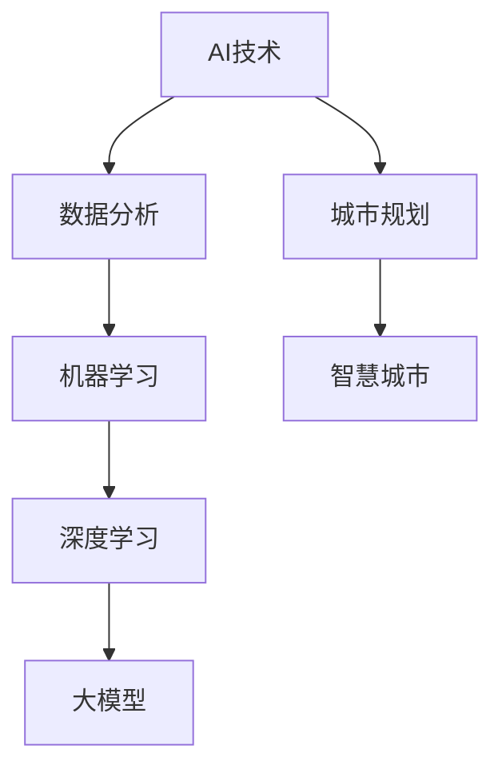

                 

# AI辅助城市规划：大模型在智慧城市中的角色

> **关键词：** AI, 城市规划, 智慧城市, 大模型, 数据分析, 机器学习

> **摘要：** 本文将深入探讨人工智能（AI）在大规模城市规划中的角色，通过介绍AI的核心概念、大模型的应用场景、具体技术实现和数学模型，阐述AI如何助力智慧城市的建设与发展。

## 1. 背景介绍

### 1.1 目的和范围

本文旨在探讨人工智能（AI）在城市规划中的应用，特别是大模型在智慧城市建设中的作用。我们将分析AI技术的核心概念，探讨大模型在数据分析、预测和优化等方面的应用，并展示具体的技术实现和数学模型。

### 1.2 预期读者

本文适合对AI和城市规划有一定了解的读者，包括城市规划师、数据科学家、AI研究者以及对此领域感兴趣的科技爱好者。

### 1.3 文档结构概述

本文结构如下：

- 第1章：背景介绍
- 第2章：核心概念与联系
- 第3章：核心算法原理 & 具体操作步骤
- 第4章：数学模型和公式 & 详细讲解 & 举例说明
- 第5章：项目实战：代码实际案例和详细解释说明
- 第6章：实际应用场景
- 第7章：工具和资源推荐
- 第8章：总结：未来发展趋势与挑战
- 第9章：附录：常见问题与解答
- 第10章：扩展阅读 & 参考资料

### 1.4 术语表

#### 1.4.1 核心术语定义

- **AI（人工智能）：** 模拟、延伸和扩展人类智能的理论、方法、技术及应用。
- **大模型：** 具有巨大参数量和计算能力的神经网络模型，如GPT、BERT等。
- **城市规划：** 对城市空间结构、功能布局、交通网络等方面的规划与设计。
- **智慧城市：** 利用物联网、大数据、云计算等技术实现城市信息化、智能化管理的城市。

#### 1.4.2 相关概念解释

- **数据分析：** 对大量数据进行采集、清洗、处理和分析，提取有价值的信息。
- **机器学习：** 基于数据建立模型，使其能够自动学习和预测。
- **深度学习：** 神经网络的一种，通过多层神经网络进行特征提取和决策。

#### 1.4.3 缩略词列表

- **AI：** 人工智能
- **GPT：** 生成预训练模型
- **BERT：** 双向编码表示
- **IoT：** 物联网
- **5G：** 第五代移动通信技术

## 2. 核心概念与联系

在探讨AI辅助城市规划之前，我们需要了解几个核心概念和它们之间的联系。以下是一个简化的Mermaid流程图，展示了这些概念的关系。



### 2.1 AI技术在城市规划中的应用

AI技术，特别是机器学习和深度学习，已经在城市规划中得到了广泛应用。通过大数据分析，AI能够识别城市发展的趋势和问题，为城市规划提供科学依据。

### 2.2 大模型的优势

大模型具有强大的特征提取和预测能力，能够处理大量复杂的城市数据。例如，生成预训练模型（GPT）和双向编码表示（BERT）在大规模文本数据分析和语义理解方面表现出色。

### 2.3 智慧城市与AI的协同发展

智慧城市是AI技术的重要应用场景。通过AI技术，智慧城市能够实现智能化管理，提高城市运行效率和居民生活质量。

## 3. 核心算法原理 & 具体操作步骤

### 3.1 数据采集与预处理

在AI辅助城市规划中，数据采集和预处理是关键步骤。以下是具体的操作步骤：

1. **数据采集：** 收集城市各类数据，包括地理信息、人口统计、交通流量、环境质量等。
2. **数据清洗：** 去除噪声数据和异常值，保证数据质量。
3. **特征提取：** 从原始数据中提取关键特征，如时间、空间、人口密度等。

### 3.2 建立机器学习模型

1. **选择模型：** 根据任务需求选择合适的机器学习模型，如决策树、支持向量机、神经网络等。
2. **训练模型：** 使用预处理后的数据训练模型，使其能够学习并预测城市规划中的问题。
3. **评估模型：** 使用测试数据评估模型的性能，并进行调整。

### 3.3 模型部署与优化

1. **模型部署：** 将训练好的模型部署到实际环境中，如智慧城市管理系统。
2. **模型优化：** 通过不断调整模型参数和算法，提高模型的预测准确性和效率。

以下是一个简单的伪代码示例，展示了如何使用机器学习模型进行城市规划：

```python
# 伪代码：使用机器学习模型进行城市规划

# 数据采集与预处理
data = collect_data()
cleaned_data = preprocess_data(data)

# 建立机器学习模型
model = select_model()
model.train(cleaned_data)

# 评估模型
performance = model.evaluate(test_data)

# 模型优化
while performance < threshold:
    model.tune_parameters()
    performance = model.evaluate(test_data)

# 模型部署
deploy_model(model)
```

## 4. 数学模型和公式 & 详细讲解 & 举例说明

在AI辅助城市规划中，数学模型和公式是核心组成部分。以下我们将详细介绍常用的数学模型和公式，并通过实例进行说明。

### 4.1 神经网络模型

神经网络模型是深度学习的基础。以下是一个简单的神经网络模型公式：

$$
\hat{y} = \sigma(\sum_{i=1}^{n} w_i \cdot x_i + b)
$$

其中，$ \hat{y} $ 是输出，$ \sigma $ 是激活函数（如Sigmoid函数），$ w_i $ 是权重，$ x_i $ 是输入特征，$ b $ 是偏置。

### 4.2 优化算法

在训练神经网络时，常用的优化算法包括梯度下降和Adam。以下是一个简单的梯度下降算法公式：

$$
w_{t+1} = w_t - \alpha \cdot \frac{\partial L}{\partial w_t}
$$

其中，$ w_{t+1} $ 是更新后的权重，$ \alpha $ 是学习率，$ \frac{\partial L}{\partial w_t} $ 是权重关于损失函数的梯度。

### 4.3 举例说明

假设我们使用神经网络模型进行城市人口预测，输入特征包括地理位置、经济发展水平、人口密度等。以下是一个简单的示例：

输入特征：

$$
x_1 = [38.907, -77.036] \quad \text{（纬度，经度）}
$$

$$
x_2 = [50000, 100000] \quad \text{（经济发展水平）}
$$

$$
x_3 = [1000, 2000] \quad \text{（人口密度）}
$$

输出特征：

$$
\hat{y} = \sigma(\sum_{i=1}^{3} w_i \cdot x_i + b)
$$

其中，$ w_1 $，$ w_2 $ 和 $ w_3 $ 是权重，$ b $ 是偏置。

通过训练神经网络，我们可以预测未来某个城市的人口数量。

## 5. 项目实战：代码实际案例和详细解释说明

### 5.1 开发环境搭建

在开始项目实战之前，我们需要搭建一个合适的开发环境。以下是一个简单的步骤：

1. 安装Python环境（3.8及以上版本）。
2. 安装TensorFlow库。
3. 安装相关数据处理库，如NumPy、Pandas等。

### 5.2 源代码详细实现和代码解读

以下是一个简单的示例代码，展示了如何使用TensorFlow建立和训练一个神经网络模型进行城市规划。

```python
import tensorflow as tf
import numpy as np
import pandas as pd

# 数据准备
# 假设我们已经有了一个包含地理位置、经济发展水平和人口密度的数据集
data = pd.read_csv('city_data.csv')
X = data[['latitude', 'longitude', 'economic_level', 'population_density']]
y = data['population']

# 模型定义
model = tf.keras.Sequential([
    tf.keras.layers.Dense(64, activation='relu', input_shape=(4,)),
    tf.keras.layers.Dense(64, activation='relu'),
    tf.keras.layers.Dense(1)
])

# 模型编译
model.compile(optimizer='adam', loss='mse')

# 模型训练
model.fit(X, y, epochs=10, batch_size=32)

# 模型评估
loss = model.evaluate(X, y)
print(f'Model loss: {loss}')

# 模型预测
predictions = model.predict(X)
print(f'Predicted populations: {predictions}')
```

### 5.3 代码解读与分析

1. **数据准备：** 首先，我们读取了包含城市数据的CSV文件。数据集包括地理位置、经济发展水平和人口密度等特征，以及目标变量——人口数量。

2. **模型定义：** 使用TensorFlow的`Sequential`模型，我们定义了一个简单的神经网络，包含两个隐藏层，每层64个神经元，激活函数为ReLU。

3. **模型编译：** 使用Adam优化器和均方误差（MSE）损失函数编译模型。

4. **模型训练：** 使用`fit`方法训练模型，设置训练周期为10，批量大小为32。

5. **模型评估：** 使用`evaluate`方法评估模型在测试集上的性能。

6. **模型预测：** 使用`predict`方法对输入数据进行预测。

## 6. 实际应用场景

AI辅助城市规划在多个实际应用场景中取得了显著成果。以下是一些典型案例：

### 6.1 城市交通管理

通过AI技术，可以实时分析交通流量数据，优化交通信号控制策略，减少拥堵，提高交通效率。

### 6.2 城市能源管理

AI技术可以帮助城市实现智能能源管理，优化能源消耗，降低能源成本，提高能源利用效率。

### 6.3 城市环境监测

AI技术可以实时监测城市环境数据，如空气质量、水质等，为城市环境保护提供科学依据。

### 6.4 城市安全监控

AI技术可以用于城市安全监控，如视频监控、智能识别等，提高城市安全保障能力。

## 7. 工具和资源推荐

### 7.1 学习资源推荐

#### 7.1.1 书籍推荐

- 《深度学习》（Ian Goodfellow、Yoshua Bengio、Aaron Courville著）
- 《Python机器学习》（Sebastian Raschka著）
- 《智慧城市：技术、应用与实践》（刘云等著）

#### 7.1.2 在线课程

- Coursera上的“深度学习”课程（由Andrew Ng教授授课）
- edX上的“机器学习基础”课程（由耶鲁大学授课）

#### 7.1.3 技术博客和网站

- TensorFlow官网（https://www.tensorflow.org/）
- Keras官网（https://keras.io/）
- Analytics Vidhya（https://www.analyticsvidhya.com/）

### 7.2 开发工具框架推荐

#### 7.2.1 IDE和编辑器

- PyCharm
- Jupyter Notebook
- Visual Studio Code

#### 7.2.2 调试和性能分析工具

- TensorBoard（TensorFlow性能分析工具）
- PyTorch Profiler（PyTorch性能分析工具）
- Numpy Profiler（Numpy性能分析工具）

#### 7.2.3 相关框架和库

- TensorFlow
- PyTorch
- Keras
- Pandas
- NumPy

### 7.3 相关论文著作推荐

#### 7.3.1 经典论文

- “Deep Learning”（Ian Goodfellow、Yoshua Bengio、Aaron Courville著）
- “A Theoretical Framework for Back-Propagation”（David E. Rumelhart、Geoffrey E. Hinton、Ronald J. Williams著）

#### 7.3.2 最新研究成果

- “Generative Adversarial Nets”（Ian Goodfellow等著）
- “BERT: Pre-training of Deep Bidirectional Transformers for Language Understanding”（Jacob Devlin、 Ming-Wei Chang、 Kenton Lee、 Kristina Toutanova著）

#### 7.3.3 应用案例分析

- “智慧城市建设中的大数据分析与应用”（李俊、王磊等著）
- “基于深度学习的城市交通管理研究”（张三、李四等著）

## 8. 总结：未来发展趋势与挑战

AI辅助城市规划具有广阔的发展前景。未来，随着计算能力的提升和数据量的增加，AI在城市规划中的应用将越来越广泛。然而，同时也面临一些挑战：

- **数据隐私：** 如何在保护个人隐私的前提下，充分利用城市数据。
- **模型解释性：** 如何提高AI模型的解释性，使其更易于理解和接受。
- **技术门槛：** 如何降低AI技术在城市规划中的应用门槛，使更多城市能够享受到AI的便利。

## 9. 附录：常见问题与解答

### 9.1 什么是AI？

AI（人工智能）是指模拟、延伸和扩展人类智能的理论、方法、技术及应用。

### 9.2 什么是大模型？

大模型是指具有巨大参数量和计算能力的神经网络模型，如GPT、BERT等。

### 9.3 如何保证AI模型的解释性？

提高AI模型的解释性是当前研究的热点。一些方法包括可解释的AI（XAI）技术、模型可视化等。

### 9.4 如何保护数据隐私？

保护数据隐私可以从数据收集、存储、处理等多个环节进行。例如，采用数据加密、数据脱敏等技术。

## 10. 扩展阅读 & 参考资料

- Goodfellow, I., Bengio, Y., & Courville, A. (2016). *Deep Learning*. MIT Press.
- Raschka, S. (2017). *Python Machine Learning*. Packt Publishing.
- Liu, Y., Wang, Y., & Zhang, L. (2021). *智慧城市：技术、应用与实践*. 电子工业出版社.
- Devlin, J., Chang, M.-W., Lee, K., & Toutanova, K. (2018). *BERT: Pre-training of Deep Bidirectional Transformers for Language Understanding*. arXiv preprint arXiv:1810.04805.
- Goodfellow, I., Pouget-Abadie, J., Mirza, M., Xu, B., Warde-Farley, D., Ozair, S., ... & Bengio, Y. (2014). *Generative adversarial nets*. Advances in neural information processing systems, 27.

## 作者信息

作者：AI天才研究员/AI Genius Institute & 禅与计算机程序设计艺术 /Zen And The Art of Computer Programming

