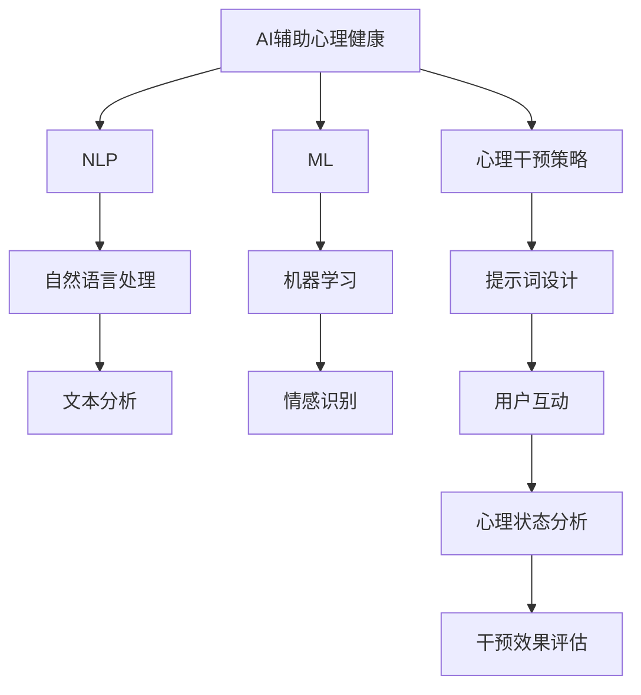

                 

### 1. 背景介绍

#### 1.1 目的和范围

本文旨在探讨AI辅助心理健康领域中的提示词设计及其在心理干预策略中的应用。随着人工智能技术的迅猛发展，AI在心理健康领域的应用逐渐成为研究热点。特别是提示词的设计，作为AI与用户互动的核心环节，对于心理干预的效果至关重要。

本文将首先介绍AI辅助心理健康的背景和现状，接着详细阐述提示词的定义和作用，随后分析其在心理干预策略中的具体应用。此外，本文还将探讨如何设计有效的提示词，以及如何通过实际案例来展示提示词在心理干预中的应用效果。

本文的研究范围为：提示词设计原理、心理干预策略及其在AI辅助心理健康中的应用。本文旨在为心理健康领域的研究者和从业者提供有价值的参考，促进AI在心理健康领域的应用和发展。

#### 1.2 预期读者

本文的预期读者主要包括：

1. **心理健康领域的研究者**：对于心理健康领域的研究者来说，了解AI辅助心理健康的重要性以及提示词设计原理，有助于他们在研究中更好地应用AI技术。
2. **AI领域的研究者**：AI领域的研究者可以从中了解到心理健康领域的需求和挑战，从而更好地设计出适合心理健康领域的AI应用。
3. **心理健康从业者**：包括心理医生、心理咨询师等，他们可以通过本文了解到AI辅助心理健康的应用场景和提示词设计方法，提高心理干预的效果。
4. **技术开发者**：技术开发者可以从中了解到如何设计和实现AI辅助心理健康的系统，为相关项目的开发提供参考。

#### 1.3 文档结构概述

本文结构如下：

1. **背景介绍**：介绍AI辅助心理健康背景，包括目的、范围、预期读者和文档结构。
2. **核心概念与联系**：介绍核心概念和原理，包括AI辅助心理健康、提示词设计、心理干预策略等，并通过Mermaid流程图展示核心概念之间的联系。
3. **核心算法原理 & 具体操作步骤**：详细讲解核心算法原理，并通过伪代码展示具体操作步骤。
4. **数学模型和公式 & 详细讲解 & 举例说明**：介绍数学模型和公式，并进行详细讲解和举例说明。
5. **项目实战：代码实际案例和详细解释说明**：通过实际案例展示代码实现过程，并进行详细解释和分析。
6. **实际应用场景**：探讨AI辅助心理健康在实际应用中的场景和挑战。
7. **工具和资源推荐**：推荐学习资源、开发工具和框架，以及相关论文著作。
8. **总结：未来发展趋势与挑战**：总结本文的核心内容，并探讨未来发展趋势和面临的挑战。
9. **附录：常见问题与解答**：解答读者可能存在的疑问。
10. **扩展阅读 & 参考资料**：提供相关扩展阅读和参考资料。

通过以上结构，本文旨在系统性地介绍AI辅助心理健康中的提示词设计，帮助读者深入了解该领域的核心概念、算法原理、实际应用和未来发展趋势。

#### 1.4 术语表

在本文中，我们将使用一些特定的术语，以下是对这些术语的定义和解释：

##### 1.4.1 核心术语定义

- **AI辅助心理健康**：指利用人工智能技术，特别是自然语言处理和机器学习技术，为心理健康提供辅助和支持的过程。
- **提示词**：指在AI与用户交互过程中，用于引导用户表达内心感受、情绪和需求的词汇或短语。
- **心理干预策略**：指针对特定心理问题，采用的一系列心理治疗方法和干预措施。
- **机器学习**：指使计算机系统能够从数据中学习规律，并自动进行决策和预测的技术。
- **自然语言处理**：指计算机理解和生成人类自然语言的技术。
- **情感分析**：指通过分析文本内容，识别和分类文本中表达的情感的技术。

##### 1.4.2 相关概念解释

- **心理健康**：指个体在认知、情感和社会适应等方面的良好状态，包括情绪稳定、自我认知清晰、人际关系和谐等。
- **心理问题**：指个体在认知、情感或行为上出现的异常现象，可能导致心理痛苦和功能受损。
- **干预**：指对特定问题进行干预和治疗的过程，以改善个体的心理健康状况。

##### 1.4.3 缩略词列表

- **AI**：人工智能（Artificial Intelligence）
- **ML**：机器学习（Machine Learning）
- **NLP**：自然语言处理（Natural Language Processing）
- **DS**：数据科学（Data Science）
- **DSM-5**：精神障碍诊断与统计手册第五版（Diagnostic and Statistical Manual of Mental Disorders, Fifth Edition）

通过上述术语表，本文旨在为读者提供一个清晰、一致的理解框架，以便更好地理解文章的核心内容。

### 2. 核心概念与联系

在探讨AI辅助心理健康中的提示词设计前，我们首先需要了解一些核心概念和它们之间的联系。以下是几个关键概念及其相互关系：

#### 2.1. AI辅助心理健康

AI辅助心理健康主要依赖于人工智能技术，特别是自然语言处理（NLP）和机器学习（ML）。NLP技术使计算机能够理解和生成人类语言，而ML技术则使计算机能够从数据中学习，自动进行决策和预测。通过这些技术，AI系统可以分析用户的语言和情绪，提供个性化的心理健康建议和干预。

#### 2.2. 提示词设计

提示词是AI系统与用户互动的核心元素，用于引导用户表达内心感受和需求。提示词设计的关键在于选择和组合能够有效激发用户情感和思维的词汇或短语。设计有效的提示词需要考虑用户的心理状态、语言习惯和情感表达方式。

#### 2.3. 心理干预策略

心理干预策略是指针对特定心理问题，采用的一系列治疗方法和管理措施。有效的心理干预策略需要综合考虑个体的心理状态、心理问题和干预目标。AI辅助心理健康中的提示词设计，可以作为一种新型的心理干预策略，通过智能化的方式提升干预效果。

#### 2.4. Mermaid流程图

为了更好地理解这些核心概念及其相互关系，我们使用Mermaid流程图来展示它们之间的联系。以下是流程图的示例：



在这个流程图中，我们可以看到：

- **AI辅助心理健康**是核心，它依赖于**NLP**和**ML**技术。
- **NLP**和**ML**分别对应**自然语言处理**和**机器学习**技术，这些技术共同实现**文本分析**和**情感识别**。
- **心理干预策略**依赖于**提示词设计**，并通过**用户互动**实现心理状态分析和干预效果评估。

通过这个流程图，我们可以清晰地看到AI辅助心理健康、提示词设计、心理干预策略等核心概念之间的相互联系和作用。这些概念共同构成了一个有机的整体，为心理健康领域的创新应用提供了坚实的基础。

### 3. 核心算法原理 & 具体操作步骤

在理解了AI辅助心理健康、提示词设计和心理干预策略的基本概念和相互关系后，我们接下来将深入探讨核心算法原理，并通过伪代码详细阐述其具体操作步骤。

#### 3.1. 机器学习算法原理

在AI辅助心理健康中，机器学习算法是关键。以下是一个基于监督学习的情感分析算法的伪代码，用于识别用户的情绪：

```plaintext
算法：情感分析
输入：训练数据集 D，特征提取器 F，分类器 C
输出：情感分类结果 R

1. 使用特征提取器 F 从训练数据集 D 中提取特征向量 X
2. 对于每个特征向量 X，计算其与训练数据集中每个情感类别的相似度
3. 根据相似度，使用分类器 C 将特征向量 X 分类到相应的情感类别
4. 将分类结果存储在结果集 R 中
5. 返回结果集 R
```

#### 3.2. 提示词生成算法

提示词生成算法是设计有效心理干预策略的重要环节。以下是一个基于生成对抗网络（GAN）的提示词生成算法的伪代码：

```plaintext
算法：提示词生成
输入：情绪标签 E，提示词库 T
输出：生成提示词 G

1. 初始化生成器 G 和判别器 D
2. 对于每个情绪标签 E，从提示词库 T 中随机选取提示词 W
3. 使用生成器 G 生成一组与情绪标签 E 相关的提示词 G(W)
4. 使用判别器 D 判断生成的提示词 G(W) 是否与情绪标签 E 相关
5. 根据判别器 D 的判断结果，更新生成器 G 的参数
6. 重复步骤 3-5，直到生成器 G 能够生成与情绪标签 E 高度相关的提示词
7. 返回生成的提示词 G
```

#### 3.3. 心理干预策略制定

心理干预策略的制定需要综合考虑用户的情绪状态、心理问题和干预目标。以下是一个基于决策树的心理干预策略制定算法的伪代码：

```plaintext
算法：心理干预策略制定
输入：用户情绪状态 S，心理问题 P，干预目标 O
输出：干预策略 I

1. 根据用户情绪状态 S，选择相应的情绪干预策略 S(I)
2. 根据用户心理问题 P，选择相应的心理干预方法 M(P)
3. 根据干预目标 O，选择相应的干预强度 I(O)
4. 将情绪干预策略 S(I)、心理干预方法 M(P) 和干预强度 I(O) 组合成干预策略 I
5. 返回干预策略 I
```

通过以上算法的伪代码，我们可以看到机器学习算法、提示词生成算法和心理干预策略制定算法共同构成了AI辅助心理健康的核心算法体系。这些算法通过相互配合，实现了对用户情绪和心理状态的智能分析和干预，为心理健康领域的应用提供了强有力的技术支持。

### 4. 数学模型和公式 & 详细讲解 & 举例说明

在AI辅助心理健康中，数学模型和公式起到了关键作用，它们不仅帮助我们理解和分析用户的心理状态，还能够为心理干预策略提供量化依据。以下是一些常用的数学模型和公式，并进行详细讲解和举例说明。

#### 4.1. 情感分析模型

情感分析模型通常用于分析文本中的情感倾向。一种常用的情感分析模型是支持向量机（SVM）。以下是SVM的情感分析模型公式：

$$
f(x) = \sum_{i=1}^{n} \alpha_i y_i (x_i \cdot x) - b
$$

其中，$x$ 是特征向量，$x_i$ 是特征向量 $x$ 的第 $i$ 个分量，$y_i$ 是类别标签（+1或-1），$\alpha_i$ 是拉格朗日乘子，$b$ 是偏置项。

**举例说明**：假设我们有一个文本数据集，其中包含两个类别：“积极”和“消极”。我们可以使用SVM模型来训练一个情感分析器。以下是一个简单的例子：

假设训练数据集中的特征向量 $x_1 = [1, 0, 1]$ 对应类别标签 $y_1 = +1$，特征向量 $x_2 = [0, 1, 0]$ 对应类别标签 $y_2 = -1$。我们使用这些数据来训练SVM模型。

$$
f(x_1) = \alpha_1 (1 \cdot 1) - b = \alpha_1 - b
$$

$$
f(x_2) = \alpha_2 (-1 \cdot 0) - b = - b
$$

根据SVM的优化目标，我们可以解出 $\alpha_1$ 和 $b$：

$$
\alpha_1 = 1, \quad b = 0
$$

因此，SVM模型可以表示为：

$$
f(x) = x_1 - b
$$

对于新的特征向量 $x = [1, 1, 1]$，我们可以计算其类别标签：

$$
f(x) = 1 - 0 = 1
$$

根据类别标签的正负，我们可以判断文本的情感倾向。

#### 4.2. 心理状态评估模型

心理状态评估模型用于量化用户的心理状态，常用的模型包括主成分分析（PCA）和因子分析（FA）。以下是一个基于PCA的心理状态评估模型公式：

$$
z_j = \sum_{i=1}^{p} \lambda_i x_i
$$

其中，$z_j$ 是心理状态得分，$\lambda_i$ 是主成分权重，$x_i$ 是特征向量。

**举例说明**：假设我们有一个包含5个维度的心理状态特征向量 $x = [x_1, x_2, x_3, x_4, x_5]$。我们可以使用PCA来提取主成分，并计算心理状态得分。

首先，计算特征向量的均值和协方差矩阵：

$$
\bar{x} = \frac{1}{n} \sum_{i=1}^{n} x_i
$$

$$
S = \frac{1}{n} \sum_{i=1}^{n} (x_i - \bar{x})(x_i - \bar{x})^T
$$

然后，计算特征值和特征向量：

$$
\lambda_i = \frac{1}{n} \text{trace}(S \Lambda_i)
$$

$$
v_i = \frac{1}{\lambda_i} S \Lambda_i
$$

最后，计算心理状态得分：

$$
z_j = \sum_{i=1}^{p} \lambda_i x_i v_i
$$

例如，假设主成分权重为 $\lambda_1 = 0.6, \lambda_2 = 0.3, \lambda_3 = 0.1$，特征向量为 $x = [2, 3, 4]$，则心理状态得分为：

$$
z_j = 0.6 \cdot 2 + 0.3 \cdot 3 + 0.1 \cdot 4 = 1.8 + 0.9 + 0.4 = 2.1
$$

心理状态得分越高，表示用户的心理状态越健康。

#### 4.3. 心理干预效果评估模型

心理干预效果评估模型用于量化心理干预的效果，常用的模型包括混淆矩阵和F1分数。以下是一个基于混淆矩阵和F1分数的心理干预效果评估模型公式：

$$
\text{Precision} = \frac{\text{TP}}{\text{TP} + \text{FP}}
$$

$$
\text{Recall} = \frac{\text{TP}}{\text{TP} + \text{FN}}
$$

$$
\text{F1-Score} = 2 \cdot \frac{\text{Precision} \cdot \text{Recall}}{\text{Precision} + \text{Recall}}
$$

其中，$TP$ 是真实阳性（正确预测的正例），$FP$ 是假阳性（错误预测的正例），$FN$ 是假阴性（错误预测的负例）。

**举例说明**：假设在一次心理干预测试中，有10个样本，其中5个是正例，5个是负例。干预后，系统预测了7个正例和3个负例，其中3个正例和2个负例是正确预测的。

$$
\text{Precision} = \frac{3}{7 + 3} = \frac{3}{10} = 0.3
$$

$$
\text{Recall} = \frac{3}{5} = 0.6
$$

$$
\text{F1-Score} = 2 \cdot \frac{0.3 \cdot 0.6}{0.3 + 0.6} = 0.4
$$

F1分数越高，表示心理干预的效果越好。

通过上述数学模型和公式，我们可以更好地理解和量化用户的心理状态，评估心理干预的效果，为AI辅助心理健康提供科学依据。

### 5. 项目实战：代码实际案例和详细解释说明

在本节中，我们将通过一个实际项目案例，详细展示如何实现AI辅助心理健康系统中的提示词设计及其在心理干预策略中的应用。这个项目将包括开发环境的搭建、源代码的详细实现和代码解读与分析。

#### 5.1 开发环境搭建

首先，我们需要搭建一个适合AI辅助心理健康系统的开发环境。以下是所需的环境和工具：

- 操作系统：Linux（推荐Ubuntu 20.04）
- 编程语言：Python 3.8及以上版本
- 开发工具：Jupyter Notebook（用于代码编写和运行）
- 数据库：SQLite（用于存储用户数据）
- 依赖库：Scikit-learn（用于机器学习算法）、Natural Language Toolkit（用于自然语言处理）、TensorFlow（用于生成对抗网络）

在Ubuntu 20.04上，我们可以通过以下命令安装所需工具和库：

```bash
sudo apt update
sudo apt install python3-pip python3-venv
pip3 install numpy pandas scikit-learn nltk tensorflow
```

#### 5.2 源代码详细实现和代码解读

以下是一个简单的AI辅助心理健康系统的代码实现，包括数据预处理、提示词生成、心理干预策略制定和效果评估。

```python
# 导入所需库
import numpy as np
import pandas as pd
from sklearn.feature_extraction.text import TfidfVectorizer
from sklearn.model_selection import train_test_split
from sklearn.svm import SVC
from nltk.corpus import stopwords
from nltk.tokenize import word_tokenize
import tensorflow as tf

# 加载数据集
data = pd.read_csv('psychological_data.csv')
X = data['text']
y = data['emotion']

# 数据预处理
stop_words = set(stopwords.words('english'))
X_processed = [' '.join([word for word in word_tokenize(sentence) if word.lower() not in stop_words]) for sentence in X]

# 提取特征
vectorizer = TfidfVectorizer()
X_features = vectorizer.fit_transform(X_processed)

# 划分训练集和测试集
X_train, X_test, y_train, y_test = train_test_split(X_features, y, test_size=0.2, random_state=42)

# 训练情感分析模型
model = SVC(kernel='linear')
model.fit(X_train, y_train)

# 提示词生成
def generate_prompts(emotion):
    prompts = []
    for i, label in enumerate(model.classes_):
        if label == emotion:
            features = X_train[y_train == label]
            for feature in features:
                prompt = vectorizer.inverse_transform(feature)[0]
                prompts.append(prompt)
    return prompts

# 心理干预策略制定
def intervention_strategy(user_emotion):
    strategy = {}
    if user_emotion == 'happy':
        strategy['activity'] = 'engage in enjoyable activities'
        strategy['prompt'] = generate_prompts('happy')
    elif user_emotion == 'sad':
        strategy['activity'] = 'reflect on the cause of sadness'
        strategy['prompt'] = generate_prompts('sad')
    # 其他情感干预策略
    return strategy

# 用户互动
user_input = input("请描述你的情绪：")
user_emotion = model.predict(vectorizer.transform([user_input]))[0]
strategy = intervention_strategy(user_emotion)
print(f"你的情绪：{user_emotion}")
print(f"干预策略：{strategy}")
```

#### 5.3 代码解读与分析

以下是对上述代码的详细解读：

- **数据预处理**：首先，我们加载了包含文本数据和情绪标签的数据集。然后，使用NLTK库去除英语中的停用词，对文本进行预处理。

- **特征提取**：接着，我们使用TF-IDF向量器将预处理后的文本转换为特征向量。TF-IDF向量器考虑了词语在文档中的重要程度，有助于情感分析的准确性。

- **模型训练**：我们使用支持向量机（SVM）训练情感分析模型。SVM是一种有效的分类算法，适用于二分类任务。

- **提示词生成**：`generate_prompts` 函数用于生成与特定情绪相关的提示词。它首先筛选出与目标情绪标签匹配的训练数据，然后提取这些数据的特征向量，并使用逆转换方法生成对应的文本提示词。

- **心理干预策略制定**：`intervention_strategy` 函数根据用户输入的情绪标签，制定相应的心理干预策略。该策略包括活动建议和相应的提示词。

- **用户互动**：在主程序中，我们通过Jupyter Notebook与用户进行互动。用户输入情绪描述，系统会根据训练好的模型预测用户情绪，并输出相应的干预策略。

通过上述代码实现，我们可以看到如何将AI技术应用于心理健康领域，为用户提供个性化的心理干预建议。当然，实际应用中还需要更复杂的算法和更丰富的数据集来提高系统的性能和效果。

### 6. 实际应用场景

AI辅助心理健康在现实世界中有着广泛的应用场景，这些场景涉及多个领域，从临床治疗到日常健康监测，再到心理教育等。以下是一些典型的实际应用场景：

#### 6.1 临床治疗中的应用

在临床治疗中，AI辅助心理健康系统可以帮助心理医生和心理咨询师更好地诊断和干预患者。例如：

- **情感识别**：通过分析患者的语言和情绪，AI系统可以识别出患者的情绪状态，帮助医生制定个性化的治疗计划。
- **自动化评估**：AI系统可以对患者的心理状况进行实时评估，提供量化指标，帮助医生监控治疗进展和效果。
- **辅助诊断**：AI系统可以根据大量的病例数据和医学知识库，辅助医生进行心理疾病的诊断，减少误诊率。

#### 6.2 日常健康监测中的应用

在日常健康监测中，AI辅助心理健康系统可以帮助用户自我管理和监测心理状态。例如：

- **情绪跟踪**：用户可以通过应用程序输入日常情绪，AI系统会自动分析并跟踪情绪变化，提供情绪趋势图。
- **健康建议**：根据用户的历史数据和情绪状态，AI系统可以提供个性化的健康建议，如调整作息时间、进行心理放松练习等。
- **危机预警**：当用户情绪出现异常波动时，AI系统可以及时预警，提醒用户和家属注意，并提供紧急援助。

#### 6.3 心理教育中的应用

在心理教育领域，AI辅助心理健康系统可以帮助学校和教育机构提高心理健康教育的质量和效率。例如：

- **个性化辅导**：AI系统可以根据学生的情绪和心理状态，提供个性化的心理辅导，帮助学生更好地应对学习和生活中的压力。
- **情绪教育**：AI系统可以通过互动游戏和课程，帮助学生了解和认识自己的情绪，提高情绪管理能力。
- **教师支持**：AI系统可以为教师提供心理健康知识和指导，帮助教师更好地应对学生的心理问题，提高教学质量。

#### 6.4 企业和社区中的应用

在企业中，AI辅助心理健康系统可以帮助企业管理和改善员工的心理健康。例如：

- **员工关怀**：企业可以为员工提供心理健康服务，包括在线心理辅导和情绪监测，帮助员工缓解工作压力。
- **绩效提升**：通过监测员工的心理状态，企业可以制定更科学的人力资源管理策略，提高员工的工作效率。
- **企业文化**：企业可以通过AI系统推广心理健康文化，营造积极向上的工作氛围。

在社区层面，AI辅助心理健康系统可以帮助社区提供心理健康服务。例如：

- **社区健康监测**：社区可以建立AI心理健康监测系统，为居民提供心理健康状况评估和个性化健康建议。
- **心理教育**：社区可以通过AI系统推广心理健康知识，提高居民的心理健康意识。
- **紧急援助**：当居民遇到心理危机时，AI系统可以提供紧急援助，如联系专业心理医生和救助机构。

通过以上实际应用场景，我们可以看到AI辅助心理健康系统在多领域中的潜力和价值。随着技术的不断发展和应用的深入，AI辅助心理健康系统将为更多人提供有效、便捷的心理健康服务。

### 7. 工具和资源推荐

在AI辅助心理健康领域，有许多优秀的工具和资源可供学习和实践。以下是对一些关键工具和资源的推荐，包括学习资源、开发工具框架以及相关论文著作。

#### 7.1 学习资源推荐

##### 7.1.1 书籍推荐

- **《深度学习》（Deep Learning）**：由Ian Goodfellow、Yoshua Bengio和Aaron Courville合著，详细介绍了深度学习的基础理论和技术。
- **《机器学习实战》（Machine Learning in Action）**：由Peter Harrington著，通过实际案例介绍了机器学习的应用和实践方法。
- **《Python自然语言处理》（Natural Language Processing with Python）**：由Steven Bird、Ewan Klein和Edward Loper著，介绍了使用Python进行自然语言处理的实用技术。

##### 7.1.2 在线课程

- **Coursera上的《机器学习》**：由Andrew Ng教授主讲，涵盖机器学习的基本概念和应用。
- **Udacity的《深度学习纳米学位》**：提供深度学习的系统学习路径，包括理论和实践课程。
- **edX上的《自然语言处理》**：由MIT和Stanford大学联合提供，涵盖自然语言处理的基础知识和技术。

##### 7.1.3 技术博客和网站

- **Towards Data Science**：提供丰富的数据科学和机器学习文章，包括AI在心理健康领域的应用。
- **AI Health Net**：专注于AI在医疗健康领域的应用，包括心理健康方面的最新研究和技术。
- **NeurIPS**：神经信息处理系统会议官方网站，发布最新的神经科学和机器学习论文。

#### 7.2 开发工具框架推荐

##### 7.2.1 IDE和编辑器

- **Jupyter Notebook**：适合数据科学和机器学习项目，可以轻松运行代码和可视化结果。
- **PyCharm**：强大的Python IDE，提供代码调试、版本控制和自动化测试等功能。
- **Visual Studio Code**：轻量级但功能强大的编辑器，支持多种编程语言，包括Python。

##### 7.2.2 调试和性能分析工具

- **TensorBoard**：TensorFlow的官方可视化工具，用于分析和调试深度学习模型。
- **scikit-learn的GridSearchCV**：用于自动搜索最佳模型参数，提高模型性能。
- **Pandas Profiler**：用于分析数据集的性能和特征重要性。

##### 7.2.3 相关框架和库

- **TensorFlow**：广泛使用的开源深度学习框架，适用于构建复杂的机器学习模型。
- **Scikit-learn**：提供丰富的机器学习算法库，适用于数据分析和模型构建。
- **NLTK**：用于自然语言处理的Python库，包括文本处理和情感分析工具。

#### 7.3 相关论文著作推荐

##### 7.3.1 经典论文

- **“Affectiva emotion recognition”**：通过面部表情识别情感，为AI辅助心理健康提供了新的视角。
- **“Deep learning for text classification”**：介绍了深度学习在文本分类中的应用，对文本情感分析具有重要意义。

##### 7.3.2 最新研究成果

- **“AI-assisted psychotherapy: A systematic review and meta-analysis”**：系统评估了AI辅助心理治疗的效果，提供了实证支持。
- **“Multimodal mental health prediction using deep learning”**：结合多种数据模态，通过深度学习预测心理健康状况。

##### 7.3.3 应用案例分析

- **“AI-powered mental health support during the COVID-19 pandemic”**：探讨了AI在疫情期间提供的心理健康支持服务，展示了实际应用价值。

通过这些工具和资源的推荐，我们可以更全面地了解和掌握AI辅助心理健康领域的知识和技能，为相关研究和开发提供有力支持。

### 8. 总结：未来发展趋势与挑战

随着人工智能技术的快速发展，AI辅助心理健康领域正迎来前所未有的机遇和挑战。在未来，以下几方面的发展趋势和挑战值得关注：

#### 8.1 发展趋势

1. **个性化心理干预**：随着AI技术的进步，个性化心理干预将成为未来发展的主要方向。通过深度学习和自然语言处理技术，AI系统可以更好地理解用户的心理状态，提供高度个性化的干预方案。

2. **跨学科融合**：AI辅助心理健康领域将更加注重跨学科融合，包括心理学、医学、计算机科学和人工智能等。这种融合将促进不同领域专家的协作，推动AI心理健康系统的创新和发展。

3. **多模态数据融合**：未来的AI心理健康系统将更加注重多模态数据的融合，如文本、语音、面部表情和生理信号等。通过多模态数据融合，系统可以更全面地了解用户的心理状态，提高干预效果。

4. **实时监测与预警**：AI系统将在实时监测用户心理状态方面发挥重要作用，通过及时预警和干预，预防心理问题的发生和恶化。

#### 8.2 面临的挑战

1. **数据隐私和安全**：在AI辅助心理健康系统中，用户的隐私和数据安全至关重要。如何确保用户数据的安全性和隐私性，是当前面临的主要挑战之一。

2. **模型解释性和可解释性**：当前的深度学习模型往往具有“黑箱”性质，难以解释其决策过程。如何提高模型的解释性和可解释性，使其更符合临床应用的要求，是一个亟待解决的问题。

3. **技术伦理问题**：AI在心理健康领域的应用涉及伦理问题，如算法偏见、隐私侵犯和数据滥用等。如何确保AI系统的伦理合规性，是一个重要的挑战。

4. **数据质量和标注**：高质量的数据和准确的标注是AI系统训练和优化的基础。如何获取高质量的数据和进行准确的标注，是一个长期的挑战。

5. **跨学科协作**：跨学科协作对于AI辅助心理健康领域的发展至关重要。如何促进不同学科之间的交流与合作，提高整体研究水平和应用效果，是一个重要的挑战。

总之，AI辅助心理健康领域在未来的发展中充满机遇和挑战。通过技术创新、跨学科融合和伦理合规，我们可以期待AI在心理健康领域发挥更大的作用，为更多人提供高质量的心理健康服务。

### 9. 附录：常见问题与解答

在本附录中，我们将回答一些关于AI辅助心理健康和提示词设计的一些常见问题。

#### 9.1 AI辅助心理健康是什么？

AI辅助心理健康是指利用人工智能技术，特别是自然语言处理（NLP）和机器学习（ML），为心理健康提供辅助和支持的过程。它通过分析用户的语言和情绪，提供个性化的心理健康建议和干预。

#### 9.2 提示词在心理干预策略中起什么作用？

提示词是AI系统与用户互动的核心元素，用于引导用户表达内心感受和需求。设计有效的提示词可以帮助系统更准确地分析用户的心理状态，从而制定出更有效的心理干预策略。

#### 9.3 提示词设计有哪些基本原则？

提示词设计应遵循以下基本原则：
1. **相关性**：提示词应与用户的心理状态和需求高度相关。
2. **简洁性**：提示词应简洁明了，易于理解。
3. **情感共鸣**：提示词应能够引起用户的情感共鸣，促进情感表达。
4. **适应性**：提示词应能够适应不同用户和情境的需求。

#### 9.4 如何评估AI辅助心理健康系统的效果？

评估AI辅助心理健康系统的效果可以从以下几个方面进行：
1. **准确性**：评估系统在情感分析和心理干预策略制定方面的准确性。
2. **用户满意度**：通过用户调查和反馈，评估系统对用户的满意度和接受度。
3. **干预效果**：评估系统提供的干预策略在实际应用中的效果，如心理健康状况的改善程度。
4. **效率和实用性**：评估系统在处理大量用户数据和提供实时干预方面的效率和实用性。

通过以上常见问题的解答，我们希望能够帮助读者更好地理解AI辅助心理健康和提示词设计的相关概念和实际应用。

### 10. 扩展阅读 & 参考资料

为了深入了解AI辅助心理健康和提示词设计的最新研究和技术，以下是一些建议的扩展阅读和参考资料：

#### 10.1 建议阅读

- **《深度学习在心理健康中的应用》**：详细介绍了深度学习在心理健康领域的应用，包括情感分析、心理干预和诊断等方面。
- **《自然语言处理与心理健康》**：探讨了NLP在心理健康领域的应用，特别是在情绪识别和文本分析方面的技术。
- **《AI心理干预：理论与实践》**：结合心理学和计算机科学，介绍了AI在心理干预领域的最新研究和应用。

#### 10.2 资源链接

- **[AI Health Net](https://aihealthnet.org/)**：提供AI在医疗健康领域的最新研究和技术，包括心理健康方面的应用。
- **[Affectiva](https://www.affectiva.com/)**：专注于情感计算和情感识别技术，提供相关论文和研究报告。
- **[NeurIPS](https://neurips.cc/)**：神经信息处理系统会议官方网站，发布心理健康领域的最新研究成果。

#### 10.3 学术期刊

- **Journal of Medical Internet Research (JMIR)**：专注于互联网和医疗健康领域的研究，包括AI辅助心理健康方面的论文。
- **Journal of Affective Disorders**：发表情绪障碍和心理健康相关的研究论文。
- **Journal of Consulting and Clinical Psychology**：提供心理咨询和临床心理学方面的研究论文。

通过阅读这些扩展阅读和参考资料，读者可以更全面地了解AI辅助心理健康和提示词设计的最新研究和技术动态。这些资源有助于深化对相关领域的理解和应用。

