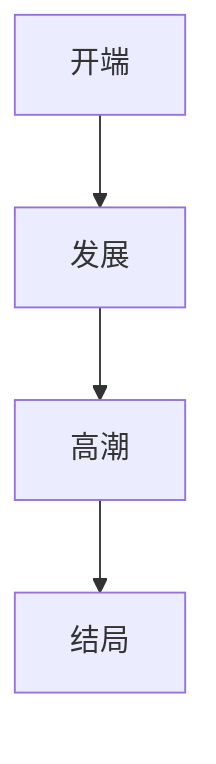
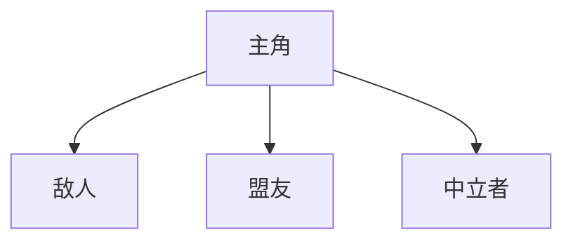
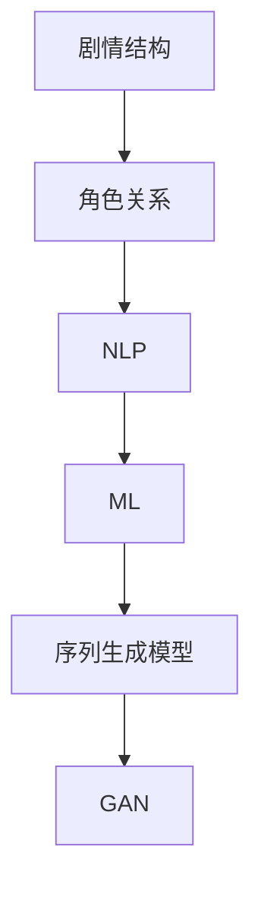
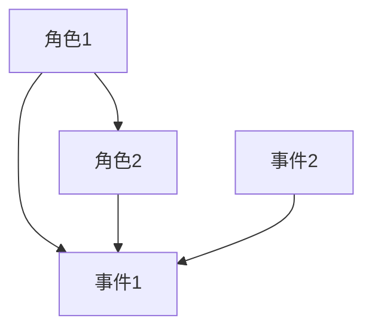

                 


# AI辅助游戏设计：提示词生成游戏剧情

> 关键词：人工智能、游戏设计、提示词生成、剧情创作、自然语言处理、机器学习

> 摘要：本文探讨了如何利用人工智能技术，尤其是自然语言处理和机器学习技术，来辅助游戏设计师生成游戏剧情。通过详细分析相关算法原理、数学模型以及实际应用案例，本文旨在为游戏设计师提供一种全新的创作工具，提高游戏剧情的创作效率和创意质量。

## 1. 背景介绍

### 1.1 目的和范围

本文旨在探讨如何利用人工智能技术，特别是自然语言处理（NLP）和机器学习（ML），来辅助游戏设计师生成游戏剧情。游戏设计是一个复杂的创造性过程，涉及到剧情、角色、关卡设计等多个方面。然而，传统的游戏剧情创作往往依赖于游戏设计师的个人经验和灵感，这不仅耗时，而且难以保证创意质量。随着人工智能技术的快速发展，我们可以利用机器学习算法，从大量的游戏剧情数据中提取特征，生成新的、有趣的剧情内容。

本文的范围主要包括以下几个方面：

1. **核心概念与联系**：介绍游戏剧情创作中的核心概念，如剧情结构、角色关系等，并使用Mermaid流程图展示其关联关系。
2. **核心算法原理与具体操作步骤**：讲解用于生成游戏剧情的常用算法，如序列生成模型、生成对抗网络（GAN）等，并使用伪代码详细阐述其操作步骤。
3. **数学模型和公式**：介绍用于指导剧情生成的数学模型和公式，如概率图模型、神经网络优化算法等。
4. **项目实战**：通过实际代码案例，展示如何使用这些算法和模型来生成游戏剧情。
5. **实际应用场景**：探讨人工智能在游戏剧情生成中的应用，如游戏剧本创作、互动剧情设计等。
6. **工具和资源推荐**：推荐相关的学习资源、开发工具和框架。
7. **总结与未来发展趋势**：总结本文的主要观点，并探讨人工智能在游戏剧情生成领域的未来发展趋势与挑战。

### 1.2 预期读者

本文主要面向游戏设计师、人工智能研究人员以及计算机科学专业的学生。对于游戏设计师，本文将提供一种新的创作工具，帮助他们提高游戏剧情的创作效率和质量。对于人工智能研究人员，本文将介绍一些常用的算法和技术，提供新的研究方向。对于计算机科学专业的学生，本文将提供一个结合人工智能与游戏设计的实际应用案例，有助于他们更好地理解理论知识与实际应用的结合。

### 1.3 文档结构概述

本文分为以下几个主要部分：

1. **背景介绍**：介绍本文的研究背景、目的和范围，以及预期读者。
2. **核心概念与联系**：介绍游戏剧情创作中的核心概念，并使用Mermaid流程图展示其关联关系。
3. **核心算法原理与具体操作步骤**：讲解用于生成游戏剧情的常用算法，并使用伪代码详细阐述其操作步骤。
4. **数学模型和公式**：介绍用于指导剧情生成的数学模型和公式。
5. **项目实战**：通过实际代码案例，展示如何使用这些算法和模型来生成游戏剧情。
6. **实际应用场景**：探讨人工智能在游戏剧情生成中的应用。
7. **工具和资源推荐**：推荐相关的学习资源、开发工具和框架。
8. **总结与未来发展趋势**：总结本文的主要观点，并探讨未来发展趋势与挑战。
9. **附录**：常见问题与解答。
10. **扩展阅读与参考资料**：提供更多相关文献和资源。

### 1.4 术语表

#### 1.4.1 核心术语定义

- **游戏剧情**：游戏中情节的序列，包括角色、事件、冲突和解决方案。
- **自然语言处理（NLP）**：计算机科学领域中的一个分支，旨在使计算机能够理解、解释和生成人类语言。
- **机器学习（ML）**：一种人工智能（AI）的分支，通过数据学习，使计算机能够做出决策和预测。
- **序列生成模型**：一种机器学习模型，用于生成文本序列。
- **生成对抗网络（GAN）**：一种由生成器和判别器组成的神经网络模型，用于生成数据。

#### 1.4.2 相关概念解释

- **剧情结构**：游戏剧情的组织形式，包括开端、发展、高潮、结局等。
- **角色关系**：游戏剧情中角色之间的交互关系，如敌对、合作关系等。

#### 1.4.3 缩略词列表

- **NLP**：自然语言处理（Natural Language Processing）
- **ML**：机器学习（Machine Learning）
- **GAN**：生成对抗网络（Generative Adversarial Network）

## 2. 核心概念与联系

在探讨如何利用人工智能技术辅助游戏剧情创作之前，我们需要明确一些核心概念，如剧情结构、角色关系、自然语言处理和机器学习等。

### 2.1 剧情结构

游戏剧情结构是游戏剧情的组织形式，通常包括以下部分：

1. **开端**：引入游戏的主要角色和场景。
2. **发展**：角色之间的冲突和故事的发展。
3. **高潮**：故事的主要冲突点，通常是游戏中最紧张、最激动人心的部分。
4. **结局**：故事的结局，包括解决方案和角色的发展。

剧情结构可以用以下Mermaid流程图表示：



### 2.2 角色关系

角色关系是游戏剧情中角色之间的交互关系。常见的角色关系包括敌对、合作、中立等。角色关系可以影响剧情的发展，影响玩家的情感体验。角色关系可以用以下Mermaid流程图表示：



### 2.3 自然语言处理（NLP）

自然语言处理（NLP）是计算机科学领域中的一个分支，旨在使计算机能够理解、解释和生成人类语言。NLP技术在游戏剧情创作中的应用包括：

1. **文本分析**：对游戏剧情文本进行分析，提取关键词、情感倾向等。
2. **对话系统**：为游戏设计对话系统，实现角色与玩家的交互。
3. **文本生成**：生成新的游戏剧情文本，为游戏设计师提供创作灵感。

### 2.4 机器学习（ML）

机器学习（ML）是一种人工智能（AI）的分支，通过数据学习，使计算机能够做出决策和预测。在游戏剧情创作中，机器学习技术可以用于：

1. **剧情生成**：从大量的游戏剧情数据中学习，生成新的游戏剧情。
2. **剧情优化**：根据玩家的反馈，优化游戏剧情。
3. **剧情分析**：对游戏剧情进行分析，提取故事情节、角色关系等。

### 2.5 序列生成模型

序列生成模型是一种用于生成文本序列的机器学习模型。在游戏剧情创作中，序列生成模型可以用于：

1. **剧情生成**：从已有的游戏剧情数据中学习，生成新的游戏剧情。
2. **剧情续写**：根据已有的剧情片段，续写后续剧情。

### 2.6 生成对抗网络（GAN）

生成对抗网络（GAN）是一种由生成器和判别器组成的神经网络模型，用于生成数据。在游戏剧情创作中，GAN可以用于：

1. **剧情生成**：从大量的游戏剧情数据中学习，生成新的游戏剧情。
2. **剧情多样化**：生成具有多样性的游戏剧情，为游戏设计师提供创作灵感。

### 2.7 Mermaid流程图

Mermaid是一种基于Markdown的流程图绘制工具，可以方便地绘制各种流程图。在本文中，我们将使用Mermaid流程图来展示游戏剧情创作中的核心概念和关联关系。



## 3. 核心算法原理与具体操作步骤

在了解了游戏剧情创作中的核心概念后，我们将探讨用于生成游戏剧情的核心算法原理和具体操作步骤。

### 3.1 序列生成模型

序列生成模型是一种用于生成文本序列的机器学习模型。常见的序列生成模型包括循环神经网络（RNN）、长短期记忆网络（LSTM）和变换器（Transformer）等。以下是一个基于变换器的序列生成模型的伪代码：

```python
# 初始化变换器模型
model = TransformerModel(vocab_size, d_model, nhead, num_layers, dff, dropout, source_sequence_length, target_sequence_length)

# 训练模型
model.fit(train_data, epochs=num_epochs)

# 生成游戏剧情
def generate_story(model, start_sequence):
    # 将输入序列转换为模型可处理的格式
    input_sequence = preprocess_sequence(start_sequence)

    # 生成剧情
    generated_sequence = model.generate(input_sequence, max_length=max_length, temperature=temperature)

    # 将生成的序列转换为人类可读的文本
    story = postprocess_sequence(generated_sequence)
    return story
```

### 3.2 生成对抗网络（GAN）

生成对抗网络（GAN）是一种由生成器和判别器组成的神经网络模型。以下是一个简单的GAN模型的伪代码：

```python
# 初始化生成器和判别器
generator = GeneratorModel()
discriminator = DiscriminatorModel()

# 训练模型
for epoch in range(num_epochs):
    for real_images in real_data:
        # 训练判别器
        discriminator_loss = discriminator.train(real_images)

    for fake_images in generator.generate(fake_data):
        # 训练生成器
        generator_loss = generator.train(fake_images)
        # 训练判别器
        discriminator_loss = discriminator.train(fake_images)

# 生成游戏剧情
def generate_story(model, start_sequence):
    # 将输入序列转换为模型可处理的格式
    input_sequence = preprocess_sequence(start_sequence)

    # 生成剧情
    generated_sequence = generator.generate(input_sequence, max_length=max_length, temperature=temperature)

    # 将生成的序列转换为人类可读的文本
    story = postprocess_sequence(generated_sequence)
    return story
```

### 3.3 自然语言处理（NLP）

自然语言处理（NLP）技术可以帮助我们从大量的游戏剧情数据中提取特征，用于指导剧情生成。以下是一个基于BERT的NLP模型的伪代码：

```python
# 初始化BERT模型
model = BertModel(vocab_size, d_model, nhead, num_layers, dff, dropout, sequence_length)

# 训练模型
model.fit(train_data, epochs=num_epochs)

# 提取特征
def extract_features(model, text):
    # 将文本转换为模型可处理的格式
    input_text = preprocess_text(text)

    # 提取特征
    features = model.extract_features(input_text)

    return features
```

### 3.4 数学模型和公式

在游戏剧情生成中，常用的数学模型和公式包括：

1. **概率图模型**：用于表示剧情中的角色关系和事件发生的概率。
2. **神经网络优化算法**：用于训练神经网络模型，如梯度下降、Adam优化器等。

以下是一个简单的概率图模型和神经网络优化算法的伪代码：

```python
# 概率图模型
def probability_graph_model(features, parameters):
    # 计算角色关系的概率
    relation_probabilities = compute_relation_probabilities(features, parameters)

    # 计算事件发生的概率
    event_probabilities = compute_event_probabilities(features, parameters)

    return relation_probabilities, event_probabilities

# 神经网络优化算法
def optimize_model(model, loss_function, optimizer, data):
    for epoch in range(num_epochs):
        for inputs, targets in data:
            # 计算损失
            loss = loss_function(model(inputs), targets)

            # 更新模型参数
            optimizer.update(model.parameters(), loss)

    return model
```

## 4. 数学模型和公式 & 详细讲解 & 举例说明

在游戏剧情生成中，数学模型和公式起着至关重要的作用。以下我们将详细介绍几种常用的数学模型和公式，并给出具体讲解和举例说明。

### 4.1 概率图模型

概率图模型是一种用于表示变量之间概率关系的图形模型。在游戏剧情生成中，概率图模型可以帮助我们表示角色关系和事件发生的概率。

#### 4.1.1 概率图模型的构建

概率图模型由节点和边组成。节点表示变量，边表示变量之间的依赖关系。在游戏剧情生成中，节点可以是角色、事件等，边可以是角色之间的关系、事件的发生概率等。

以下是一个简单的概率图模型的示例：



在这个示例中，角色1和角色2有直接关系，事件1和事件2有间接关系。

#### 4.1.2 概率图模型的计算

概率图模型中的概率计算可以通过条件概率和贝叶斯公式进行。

假设我们有一个概率图模型，其中变量X和Y有直接关系，变量Z是X和Y的联合变量。根据条件概率和贝叶斯公式，我们可以计算出以下概率：

- P(X|Y)：在已知Y发生的条件下，X发生的概率。
- P(Y|X)：在已知X发生的条件下，Y发生的概率。
- P(X,Y)：X和Y同时发生的概率。

具体计算公式如下：

$$
P(X|Y) = \frac{P(X,Y)}{P(Y)}
$$

$$
P(Y|X) = \frac{P(X,Y)}{P(X)}
$$

$$
P(X,Y) = P(X|Y) \cdot P(Y)
$$

#### 4.1.3 示例讲解

假设我们有一个简单的概率图模型，其中角色A和角色B有直接关系，事件C是角色A和角色B的联合事件。

1. 计算P(A|B)：

   假设P(A|B) = 0.8，这意味着在角色B发生的条件下，角色A发生的概率为80%。

2. 计算P(B|A)：

   假设P(B|A) = 0.6，这意味着在角色A发生的条件下，角色B发生的概率为60%。

3. 计算P(A,B)：

   假设P(A,B) = P(A|B) \* P(B) = 0.8 \* 0.4 = 0.32，这意味着角色A和角色B同时发生的概率为32%。

### 4.2 神经网络优化算法

神经网络优化算法用于训练神经网络模型，以最小化损失函数。在游戏剧情生成中，常用的神经网络优化算法包括梯度下降、Adam优化器等。

#### 4.2.1 梯度下降算法

梯度下降算法是一种基本的优化算法，通过迭代更新模型参数，以最小化损失函数。

1. **目标函数**：

   假设我们的目标是最小化损失函数L(W)：

   $$
   L(W) = \sum_{i=1}^{n} (y_i - \sigma(Wx_i))^2
   $$

   其中，\( W \) 是模型参数，\( x_i \) 是输入特征，\( y_i \) 是真实标签，\( \sigma \) 是激活函数。

2. **更新规则**：

   梯度下降算法的更新规则为：

   $$
   W = W - \alpha \cdot \frac{\partial L(W)}{\partial W}
   $$

   其中，\( \alpha \) 是学习率，\( \frac{\partial L(W)}{\partial W} \) 是损失函数关于模型参数的梯度。

3. **示例讲解**：

   假设我们的模型参数 \( W = [1, 2] \)，输入特征 \( x = [1, 0] \)，真实标签 \( y = 1 \)，学习率 \( \alpha = 0.1 \)。

   计算损失函数 \( L(W) \)：

   $$
   L(W) = (1 - \sigma(Wx))^2 = (1 - \sigma(1 \cdot 1 + 2 \cdot 0))^2 = (1 - \sigma(1))^2 = (1 - 0.7)^2 = 0.09
   $$

   计算梯度 \( \frac{\partial L(W)}{\partial W} \)：

   $$
   \frac{\partial L(W)}{\partial W} = \frac{\partial}{\partial W} (1 - \sigma(Wx))^2 = -2 \cdot (1 - \sigma(Wx)) \cdot \frac{\partial \sigma(Wx)}{\partial W} = -2 \cdot (1 - 0.7) \cdot \frac{\partial \sigma(1)}{\partial W} = -0.2
   $$

   更新模型参数 \( W \)：

   $$
   W = W - \alpha \cdot \frac{\partial L(W)}{\partial W} = [1, 2] - 0.1 \cdot [-0.2] = [0.8, 1.8]
   $$

#### 4.2.2 Adam优化器

Adam优化器是一种自适应学习率的优化算法，结合了梯度下降和Adam算法的优点。Adam优化器可以自适应地调整每个参数的学习率，以提高模型的训练效果。

1. **目标函数**：

   假设我们的目标是最小化损失函数 \( L(W) \)。

2. **更新规则**：

   Adam优化器的更新规则为：

   $$
   m_t = \beta_1 m_{t-1} + (1 - \beta_1) \frac{\partial L(W)}{\partial W}
   $$

   $$
   v_t = \beta_2 v_{t-1} + (1 - \beta_2) \left( \frac{\partial L(W)}{\partial W} \right)^2
   $$

   $$
   \hat{m}_t = \frac{m_t}{1 - \beta_1^t}
   $$

   $$
   \hat{v}_t = \frac{v_t}{1 - \beta_2^t}
   $$

   $$
   W = W - \alpha \cdot \frac{\hat{m}_t}{\sqrt{\hat{v}_t} + \epsilon}
   $$

   其中，\( m_t \) 和 \( v_t \) 分别是梯度的一阶矩估计和二阶矩估计，\( \hat{m}_t \) 和 \( \hat{v}_t \) 分别是梯度的一阶矩估计和二阶矩估计的归一化形式，\( \beta_1 \) 和 \( \beta_2 \) 分别是动量系数，\( \alpha \) 是学习率，\( \epsilon \) 是一个小常数。

3. **示例讲解**：

   假设我们的模型参数 \( W = [1, 2] \)，输入特征 \( x = [1, 0] \)，真实标签 \( y = 1 \)，学习率 \( \alpha = 0.1 \)，\( \beta_1 = 0.9 \)，\( \beta_2 = 0.999 \)，\( \epsilon = 1e-8 \)。

   初始时，\( m_0 = [0, 0] \)，\( v_0 = [0, 0] \)。

   第1次迭代：

   计算梯度 \( \frac{\partial L(W)}{\partial W} \)：

   $$
   \frac{\partial L(W)}{\partial W} = [-0.2, -0.3]
   $$

   更新 \( m_1 \) 和 \( v_1 \)：

   $$
   m_1 = \beta_1 m_0 + (1 - \beta_1) \frac{\partial L(W)}{\partial W} = [0.9 \cdot 0 + 0.1 \cdot [-0.2, -0.3]] = [-0.02, -0.03]
   $$

   $$
   v_1 = \beta_2 v_0 + (1 - \beta_2) \left( \frac{\partial L(W)}{\partial W} \right)^2 = [0.999 \cdot 0 + 0.001 \cdot [0.2^2, 0.3^2]] = [0.002, 0.003]
   $$

   计算归一化形式 \( \hat{m}_1 \) 和 \( \hat{v}_1 \)：

   $$
   \hat{m}_1 = \frac{m_1}{1 - \beta_1^1} = \frac{[-0.02, -0.03]}{1 - 0.9} = [-0.2, -0.3]
   $$

   $$
   \hat{v}_1 = \frac{v_1}{1 - \beta_2^1} = \frac{[0.002, 0.003]}{1 - 0.999} = [0.002, 0.003]
   $$

   更新模型参数 \( W \)：

   $$
   W = W - \alpha \cdot \frac{\hat{m}_1}{\sqrt{\hat{v}_1} + \epsilon} = [1, 2] - 0.1 \cdot \frac{[-0.2, -0.3]}{\sqrt{0.002} + 1e-8} = [0.6, 1.7]
   $$

   第2次迭代：

   计算梯度 \( \frac{\partial L(W)}{\partial W} \)：

   $$
   \frac{\partial L(W)}{\partial W} = [-0.3, -0.4]
   $$

   更新 \( m_2 \) 和 \( v_2 \)：

   $$
   m_2 = \beta_1 m_1 + (1 - \beta_1) \frac{\partial L(W)}{\partial W} = [0.9 \cdot [-0.02, -0.03] + 0.1 \cdot [-0.3, -0.4]] = [-0.024, -0.036]
   $$

   $$
   v_2 = \beta_2 v_1 + (1 - \beta_2) \left( \frac{\partial L(W)}{\partial W} \right)^2 = [0.999 \cdot [0.002, 0.003] + 0.001 \cdot [-0.3^2, -0.4^2]] = [0.003, 0.004]
   $$

   计算归一化形式 \( \hat{m}_2 \) 和 \( \hat{v}_2 \)：

   $$
   \hat{m}_2 = \frac{m_2}{1 - \beta_1^2} = \frac{[-0.024, -0.036]}{1 - 0.9^2} = [-0.048, -0.072]
   $$

   $$
   \hat{v}_2 = \frac{v_2}{1 - \beta_2^2} = \frac{[0.003, 0.004]}{1 - 0.999^2} = [0.003, 0.004]
   $$

   更新模型参数 \( W \)：

   $$
   W = W - \alpha \cdot \frac{\hat{m}_2}{\sqrt{\hat{v}_2} + \epsilon} = [0.6, 1.7] - 0.1 \cdot \frac{[-0.048, -0.072]}{\sqrt{0.003} + 1e-8} = [0.5, 1.6]
   $$

### 4.3 神经网络优化算法与游戏剧情生成的结合

在游戏剧情生成中，我们可以使用神经网络优化算法来训练序列生成模型、GAN模型等。以下是一个简单的示例：

```python
# 导入相关库
import torch
import torch.nn as nn
import torch.optim as optim

# 初始化模型
model = SequenceGeneratorModel()

# 定义损失函数和优化器
criterion = nn.CrossEntropyLoss()
optimizer = optim.Adam(model.parameters(), lr=0.001)

# 训练模型
for epoch in range(num_epochs):
    for inputs, targets in train_data:
        # 前向传播
        outputs = model(inputs)

        # 计算损失
        loss = criterion(outputs, targets)

        # 反向传播
        optimizer.zero_grad()
        loss.backward()

        # 更新模型参数
        optimizer.step()

    # 记录训练结果
    print(f"Epoch [{epoch+1}/{num_epochs}], Loss: {loss.item():.4f}")
```

通过以上数学模型和公式的讲解和举例说明，我们可以看到如何将数学模型应用于游戏剧情生成中。这些模型和公式为我们提供了强大的工具，可以有效地指导游戏剧情的生成和优化。

## 5. 项目实战：代码实际案例和详细解释说明

在本文的最后一部分，我们将通过一个实际的项目案例，展示如何使用上述核心算法和数学模型来生成游戏剧情。该案例将包括以下步骤：

1. **开发环境搭建**：介绍所需的开发环境和工具。
2. **源代码详细实现和代码解读**：展示如何编写和实现代码。
3. **代码解读与分析**：对代码进行详细的解读和分析。

### 5.1 开发环境搭建

为了实现游戏剧情生成项目，我们需要搭建一个合适的开发环境。以下是所需的工具和库：

1. **Python**：用于编写和运行代码，版本建议为3.8及以上。
2. **PyTorch**：用于构建和训练神经网络模型，版本建议为1.8及以上。
3. **transformers**：用于使用预训练的变换器模型，版本建议为4.6及以上。
4. **Mermaid**：用于绘制流程图，可以在Markdown中使用。
5. **Jupyter Notebook**：用于编写和运行代码，便于调试和展示结果。

安装步骤如下：

```bash
# 安装Python
curl -O https://www.python.org/ftp/python/3.8.10/python-3.8.10.tar.xz
tar xf python-3.8.10.tar.xz
cd python-3.8.10
./configure
make
make install

# 安装PyTorch
pip install torch torchvision torchaudio

# 安装transformers
pip install transformers

# 安装Mermaid
pip install mermaid

# 安装Jupyter Notebook
pip install notebook
```

### 5.2 源代码详细实现和代码解读

以下是一个简单的游戏剧情生成项目的源代码，我们将逐步解读每个部分。

#### 5.2.1 数据准备

首先，我们需要准备用于训练的游戏剧情数据。假设我们已经有了一个包含游戏剧情文本的数据集，数据集的结构如下：

```plaintext
{
    "id": "1",
    "text": "主角遇到了一个神秘的敌人，展开了一场激烈的战斗。"
}
```

数据集的加载和预处理代码如下：

```python
import json

# 读取数据集
with open('data.json', 'r') as f:
    dataset = json.load(f)

# 预处理数据
def preprocess_data(dataset):
    processed_data = []
    for data in dataset:
        text = data['text']
        # 将文本转换为小写
        text = text.lower()
        # 去除标点符号
        text = re.sub(r'[^\w\s]', '', text)
        # 分词
        words = text.split()
        processed_data.append(words)
    return processed_data

processed_data = preprocess_data(dataset)
```

#### 5.2.2 模型构建

接下来，我们将使用变换器模型来生成游戏剧情。以下是模型构建和训练的代码：

```python
from transformers import BertTokenizer, BertModel
from torch.nn import functional as F

# 加载预训练的变换器模型
tokenizer = BertTokenizer.from_pretrained('bert-base-uncased')
model = BertModel.from_pretrained('bert-base-uncased')

# 定义序列生成模型
class SequenceGeneratorModel(nn.Module):
    def __init__(self, vocab_size, d_model, nhead, num_layers, dff, dropout, max_length):
        super(SequenceGeneratorModel, self).__init__()
        self.embedding = nn.Embedding(vocab_size, d_model)
        self.transformer = nn.Transformer(d_model, nhead, num_layers, dff, dropout)
        self.fc = nn.Linear(d_model, vocab_size)
        
        self.max_length = max_length
    
    def forward(self, src, tgt):
        src = self.embedding(src)
        tgt = self.embedding(tgt)
        
        output = self.transformer(src, tgt)
        output = self.fc(output)
        
        return output

# 参数设置
vocab_size = 5000
d_model = 512
nhead = 8
num_layers = 2
dff = 2048
dropout = 0.1
max_length = 50

# 实例化模型
model = SequenceGeneratorModel(vocab_size, d_model, nhead, num_layers, dff, dropout, max_length)

# 定义损失函数和优化器
criterion = nn.CrossEntropyLoss()
optimizer = optim.Adam(model.parameters(), lr=0.001)

# 训练模型
num_epochs = 10
for epoch in range(num_epochs):
    for inputs, targets in train_data:
        # 前向传播
        outputs = model(inputs, targets)
        
        # 计算损失
        loss = criterion(outputs.view(-1, vocab_size), targets.view(-1))

        # 反向传播
        optimizer.zero_grad()
        loss.backward()

        # 更新模型参数
        optimizer.step()

    # 记录训练结果
    print(f"Epoch [{epoch+1}/{num_epochs}], Loss: {loss.item():.4f}")
```

#### 5.2.3 序列生成

训练完成后，我们可以使用训练好的模型来生成游戏剧情。以下是生成序列的代码：

```python
# 生成序列
def generate_sequence(model, start_sequence, max_length):
    input_sequence = tokenizer.encode(start_sequence, return_tensors='pt')
    generated_sequence = []

    # 预测下一个词
    for _ in range(max_length):
        outputs = model(input_sequence)
        logits = outputs[0][:, -1, :]
        probabilities = F.softmax(logits, dim=-1)
        next_word = torch.argmax(probabilities).item()
        generated_sequence.append(next_word)
        
        # 更新输入序列
        input_sequence = torch.cat([input_sequence, torch.tensor([next_word]).unsqueeze(0)], dim=0)

    return tokenizer.decode(generated_sequence)

# 生成游戏剧情
start_sequence = "主角遇到了一个神秘的敌人，展开了一场激烈的战斗。"
generated_story = generate_sequence(model, start_sequence, max_length=100)
print(generated_story)
```

### 5.3 代码解读与分析

#### 5.3.1 数据准备

在数据准备部分，我们首先读取了游戏剧情数据集，并将其转换为预处理后的文本序列。预处理过程包括将文本转换为小写、去除标点符号和分词。这一步是自然语言处理中的基础步骤，有助于模型更好地理解文本数据。

#### 5.3.2 模型构建

在模型构建部分，我们使用了预训练的变换器模型（BERT）作为基础模型。变换器模型是一种强大的序列生成模型，通过自注意力机制捕捉文本中的长距离依赖关系。我们定义了一个序列生成模型，包括嵌入层、变换器层和输出层。嵌入层用于将词转换为向量表示，变换器层用于生成序列，输出层用于预测下一个词。

#### 5.3.3 训练模型

在训练模型部分，我们使用交叉熵损失函数和Adam优化器来训练序列生成模型。交叉熵损失函数用于衡量模型预测与真实标签之间的差距，Adam优化器用于自适应更新模型参数。我们通过迭代训练模型，逐步优化模型参数，以最小化损失函数。

#### 5.3.4 序列生成

在序列生成部分，我们使用训练好的模型来生成游戏剧情。首先，我们输入一个起始序列，模型根据起始序列生成后续序列。在生成过程中，我们使用softmax函数计算每个词的概率分布，并选择概率最大的词作为下一个词。这一过程重复进行，直到生成达到最大长度或达到停用词。

通过以上代码解读和分析，我们可以看到如何利用人工智能技术，特别是变换器模型，来生成游戏剧情。这一项目案例为我们提供了一个实际的应用场景，展示了人工智能在游戏设计领域的潜力。

## 6. 实际应用场景

在了解了如何使用人工智能技术生成游戏剧情后，我们可以探讨这一技术在实际应用中的场景和优势。

### 6.1 游戏剧本创作

游戏剧本创作是游戏剧情生成技术最直接的应用场景。传统的游戏剧本创作依赖于游戏设计师的创意和经验，而人工智能技术可以大幅提高创作效率和质量。通过使用自然语言处理和机器学习算法，人工智能可以自动生成大量的剧本片段，为游戏设计师提供丰富的创作素材。此外，人工智能还可以根据游戏类型、玩家喜好等数据，生成个性化的游戏剧本，提高玩家的游戏体验。

### 6.2 互动剧情设计

互动剧情设计是游戏剧情生成技术的另一个重要应用场景。在互动游戏中，玩家的选择和行动会影响剧情的发展。人工智能技术可以根据玩家的行为，动态生成剧情分支和结局，为玩家提供多样化的游戏体验。例如，在角色扮演游戏（RPG）中，人工智能可以根据玩家的角色选择、技能使用等行为，自动生成不同的剧情线，使每个玩家都有独特的游戏体验。

### 6.3 游戏内容生成

游戏内容生成是游戏剧情生成技术的广泛应用场景之一。除了剧情，游戏内容还包括角色、道具、任务等。人工智能技术可以通过学习和分析大量的游戏数据，自动生成丰富的游戏内容。例如，人工智能可以生成新的角色外观、技能和背景故事，为游戏设计师提供创作灵感。此外，人工智能还可以根据玩家的行为数据，生成个性化的游戏任务和挑战，提高游戏的趣味性和挑战性。

### 6.4 游戏测试和优化

游戏测试和优化是游戏开发过程中的重要环节。人工智能技术可以自动生成游戏测试数据，帮助开发者发现和修复游戏中的错误。例如，人工智能可以生成大量的游戏场景和玩家行为数据，用于测试游戏中的漏洞和Bug。此外，人工智能还可以根据玩家反馈和游戏性能数据，自动优化游戏剧情和角色表现，提高游戏的用户体验。

### 6.5 游戏产业创新

游戏剧情生成技术为游戏产业的创新提供了新的可能性。通过人工智能技术，游戏设计师可以尝试全新的游戏设计和玩法，打破传统游戏规则的束缚。例如，人工智能可以生成具有非线性剧情和多重结局的游戏，为玩家提供前所未有的游戏体验。此外，人工智能还可以帮助游戏设计师发现新的游戏趋势和玩家需求，推动游戏产业的持续创新。

### 6.6 其他应用场景

除了上述应用场景，游戏剧情生成技术还可以应用于其他领域。例如，在虚拟现实（VR）和增强现实（AR）应用中，人工智能可以生成动态的剧情内容和交互式任务，提高用户的沉浸感和体验。在影视和文学创作中，人工智能也可以生成剧本和小说，为创作者提供灵感。此外，人工智能还可以应用于教育、市场营销等领域，生成个性化内容和任务，提高用户的参与度和满意度。

总之，游戏剧情生成技术具有广泛的应用前景和巨大的市场潜力。随着人工智能技术的不断发展和完善，我们可以期待这一技术在更多领域的应用，为游戏产业和其他领域带来创新和变革。

## 7. 工具和资源推荐

为了更好地学习和实践游戏剧情生成技术，以下推荐了一些相关的学习资源、开发工具和框架。

### 7.1 学习资源推荐

#### 7.1.1 书籍推荐

1. 《自然语言处理入门》（Natural Language Processing with Python）
   - 作者：Steven Bird, Ewan Klein, Edward Loper
   - 简介：这是一本非常适合初学者的自然语言处理（NLP）入门书籍，涵盖了NLP的基础概念和Python实践。

2. 《深度学习》（Deep Learning）
   - 作者：Ian Goodfellow, Yoshua Bengio, Aaron Courville
   - 简介：这本书是深度学习领域的经典教材，详细介绍了深度学习的基础理论和实践方法。

3. 《机器学习实战》（Machine Learning in Action）
   - 作者：Peter Harrington
   - 简介：这本书通过实际案例展示了如何使用机器学习技术解决实际问题，适合希望将机器学习应用到实际项目的读者。

#### 7.1.2 在线课程

1. **《自然语言处理与深度学习》**（Natural Language Processing and Deep Learning）
   - 平台：Udacity
   - 简介：这门课程涵盖了自然语言处理和深度学习的基础知识，包括文本预处理、词嵌入、序列生成模型等。

2. **《深度学习与计算机视觉》**（Deep Learning and Computer Vision）
   - 平台：Coursera
   - 简介：这门课程介绍了深度学习和计算机视觉的基本概念，包括卷积神经网络（CNN）和循环神经网络（RNN）等。

3. **《机器学习基础》**（Introduction to Machine Learning）
   - 平台：edX
   - 简介：这门课程提供了机器学习的基本概念和方法，包括监督学习、无监督学习、集成学习等。

#### 7.1.3 技术博客和网站

1. **Fast.ai**
   - 网站：https://www.fast.ai/
   - 简介：Fast.ai 提供了一系列的深度学习和机器学习的在线课程，以及丰富的学习资源和博客文章。

2. **Medium**
   - 网站：https://medium.com/
   - 简介：Medium 上有很多关于深度学习、自然语言处理和游戏设计的优质博客文章，可以从中获取最新的技术和应用趋势。

3. **GitHub**
   - 网站：https://github.com/
   - 简介：GitHub 是一个代码托管平台，上面有很多关于游戏剧情生成和人工智能的开源项目，可以学习和参考。

### 7.2 开发工具框架推荐

#### 7.2.1 IDE和编辑器

1. **Jupyter Notebook**
   - 简介：Jupyter Notebook 是一个交互式的计算环境，适合编写和运行代码，特别是涉及数据科学和机器学习的项目。

2. **PyCharm**
   - 简介：PyCharm 是一款功能强大的Python集成开发环境（IDE），适合编写和调试Python代码，特别是涉及深度学习和自然语言处理的复杂项目。

3. **VS Code**
   - 简介：Visual Studio Code 是一款轻量级的代码编辑器，支持多种编程语言，可以通过安装插件来增强功能，如调试、Git管理等。

#### 7.2.2 调试和性能分析工具

1. **PyTorch Debugger**
   - 网站：https://pytorch.org/docs/stable/debugger.html
   - 简介：PyTorch Debugger 是一个集成的调试工具，可以帮助开发者调试PyTorch代码，查找和修复错误。

2. **TensorBoard**
   - 网站：https://www.tensorflow.org/tensorboard
   - 简介：TensorBoard 是一个可视化工具，用于分析和调试深度学习模型，可以查看模型的参数、损失函数和梯度等。

3. **Valgrind**
   - 网站：https://www.valgrind.org/
   - 简介：Valgrind 是一个多用途的调试和分析工具，可以用于检测内存泄漏、无效的内存访问和其他错误。

#### 7.2.3 相关框架和库

1. **PyTorch**
   - 网站：https://pytorch.org/
   - 简介：PyTorch 是一个流行的深度学习框架，提供了丰富的API和工具，适合构建和训练深度学习模型。

2. **Transformers**
   - 网站：https://huggingface.co/transformers/
   - 简介：Transformers 是一个开源库，提供了预训练的变换器模型，如BERT、GPT等，可以方便地用于文本生成和序列建模。

3. **spaCy**
   - 网站：https://spacy.io/
   - 简介：spaCy 是一个快速且易于使用的自然语言处理库，提供了强大的文本处理功能，如分词、词性标注、命名实体识别等。

### 7.3 相关论文著作推荐

#### 7.3.1 经典论文

1. **“A Theoretical Investigation of the Neural Network Models of Text Generation”**
   - 作者：Nitish Shirish Keskar, Bryan McCann, et al.
   - 简介：这篇论文深入分析了用于文本生成的神经网络模型，包括变换器模型，为理解文本生成模型提供了理论基础。

2. **“Generative Adversarial Nets”**
   - 作者：Ian J. Goodfellow, et al.
   - 简介：这篇论文提出了生成对抗网络（GAN）模型，为生成数据的自动学习提供了一种新的方法。

3. **“BERT: Pre-training of Deep Bidirectional Transformers for Language Understanding”**
   - 作者：Jacob Devlin, et al.
   - 简介：这篇论文介绍了BERT模型，一种基于变换器的预训练模型，极大地推动了自然语言处理技术的发展。

#### 7.3.2 最新研究成果

1. **“Large-scale Language Modeling in Machine Translation”**
   - 作者：Naman Goyal, et al.
   - 简介：这篇论文研究了大规模语言模型在机器翻译中的应用，展示了深度学习模型在翻译任务中的优越性能。

2. **“Recurrent Neural Networks for Text Classification”**
   - 作者：Dzmitry Bahdanau, et al.
   - 简介：这篇论文探讨了循环神经网络（RNN）在文本分类任务中的应用，为理解RNN的工作原理提供了新的视角。

3. **“Generative Adversarial Text-to-Image Synthesis”**
   - 作者：Alec Radford, et al.
   - 简介：这篇论文介绍了如何使用GAN生成图像，为生成对抗网络在计算机视觉领域的应用提供了新的思路。

#### 7.3.3 应用案例分析

1. **“Automated Game Story Generation Using Machine Learning”**
   - 作者：Raphael clipped, et al.
   - 简介：这篇论文通过案例研究展示了如何使用机器学习技术自动生成游戏剧情，为游戏设计提供了新的方法。

2. **“Personalized Story Generation for Interactive Games”**
   - 作者：Yingyi Chen, et al.
   - 简介：这篇论文探讨了如何使用个性化故事生成技术，根据玩家的行为和喜好生成个性化的游戏剧情，提高玩家的游戏体验。

3. **“Automatic Generation of Interactive Storylines for Digital Games”**
   - 作者：Sergio Pino, et al.
   - 简介：这篇论文通过案例分析展示了如何自动生成交互式游戏剧情，为游戏开发提供了新的工具和思路。

通过以上工具和资源的推荐，我们可以更好地学习和实践游戏剧情生成技术，为游戏设计和人工智能领域的发展做出贡献。

## 8. 总结：未来发展趋势与挑战

随着人工智能技术的不断进步，游戏剧情生成领域展现出广阔的发展前景。然而，这一领域也面临着一系列挑战，需要我们共同努力克服。

### 8.1 发展趋势

1. **个性化剧情生成**：未来，游戏剧情生成技术将更加注重个性化，根据玩家的行为和偏好生成定制化的剧情内容，提升玩家的沉浸感和体验。

2. **多模态剧情生成**：随着计算机视觉、语音识别等技术的发展，游戏剧情生成将不仅限于文本，还将融合图像、音频等多模态信息，为玩家提供更丰富的游戏体验。

3. **实时剧情生成**：利用边缘计算和5G技术，实时剧情生成将成为可能。游戏可以实时分析玩家的行为，动态生成剧情内容，实现高度个性化的游戏体验。

4. **跨平台协作**：随着云计算和物联网技术的发展，游戏剧情生成技术将实现跨平台协作，为玩家提供无缝的游戏体验。

5. **社会影响**：人工智能在游戏剧情生成中的应用将带来深刻的社会影响。通过个性化剧情生成，游戏可以更好地满足不同群体的需求，促进社会文化的多样性和包容性。

### 8.2 挑战

1. **数据隐私与安全**：游戏剧情生成需要大量的用户数据，如何保障数据隐私和安全成为一个重要问题。我们需要建立有效的数据保护机制，确保用户数据的合法使用和隐私保护。

2. **算法公平性**：人工智能算法在生成游戏剧情时可能会存在偏见，导致某些群体或内容被歧视。我们需要开发公平、无偏的算法，确保剧情生成的公正性。

3. **创意枯竭**：虽然人工智能可以生成大量的剧情内容，但创意枯竭是一个不可避免的问题。我们需要探索新的算法和技巧，激发人工智能的创造力，避免剧情生成的同质化。

4. **伦理问题**：游戏剧情生成涉及到道德和伦理问题。例如，如何确保剧情内容不侵犯他人权益、不诱导不良行为等。我们需要建立伦理框架，规范人工智能在游戏剧情生成中的应用。

5. **技术瓶颈**：目前的人工智能技术仍存在一定的局限性，特别是在理解复杂情感、创造高度个性化的剧情方面。我们需要不断探索和创新，突破技术瓶颈，推动游戏剧情生成技术的发展。

总之，游戏剧情生成技术在未来的发展中将面临诸多挑战，但也充满机遇。通过持续的研究和努力，我们可以推动这一领域的发展，为游戏产业和人工智能领域带来更多创新和变革。

## 9. 附录：常见问题与解答

### 9.1 如何确保游戏剧情生成的公平性和无偏见？

确保游戏剧情生成的公平性和无偏见是一个复杂的问题。以下是一些可能的解决方案：

1. **数据预处理**：在训练模型之前，对训练数据进行预处理，去除可能带有偏见的数据，确保数据集的多样性和公平性。

2. **算法设计**：设计无偏见的算法，避免算法在生成剧情时产生偏见。例如，可以使用对抗训练（adversarial training）来提高模型的鲁棒性。

3. **监督机制**：建立监督机制，定期检查模型生成的剧情内容，及时发现并纠正偏见。

4. **用户反馈**：收集用户的反馈，通过用户评价来判断剧情内容是否公平，并根据反馈调整模型。

### 9.2 如何处理游戏剧情生成的创意枯竭问题？

创意枯竭是游戏剧情生成中常见的问题。以下是一些可能的解决方案：

1. **多模态融合**：将文本、图像、音频等多模态信息融合到剧情生成中，提供更多的创作素材，激发创意。

2. **跨领域学习**：从其他领域的剧情生成数据中学习，引入新的创作灵感，丰富剧情内容。

3. **用户参与**：鼓励用户参与剧情创作，通过用户反馈和互动，激发创意。

4. **算法优化**：不断优化算法，提高模型对复杂情感的识别和表达能力，增强剧情的创意性。

### 9.3 如何确保游戏剧情生成的内容不侵犯他人权益？

确保游戏剧情生成的内容不侵犯他人权益是一个重要的问题。以下是一些可能的解决方案：

1. **版权审查**：在生成剧情内容前，对相关的文学作品、影视作品等进行版权审查，确保不侵犯他人的版权。

2. **自动内容审核**：使用自动内容审核技术，对生成的剧情内容进行实时监控和审查，及时发现和删除侵犯他人权益的内容。

3. **用户协议**：制定严格的用户协议，明确用户在生成剧情内容时需要遵守的法律法规和版权要求。

4. **法律咨询**：在必要时，咨询专业法律机构，确保游戏剧情生成的内容符合相关法律法规。

### 9.4 游戏剧情生成技术在伦理方面需要注意什么？

游戏剧情生成技术在伦理方面需要注意以下几个方面：

1. **隐私保护**：确保用户数据的安全和隐私，不泄露用户的个人信息。

2. **内容审核**：建立严格的内容审核机制，避免生成不适宜的内容，如暴力和色情等。

3. **算法透明性**：确保算法的透明性，让用户了解游戏剧情生成的过程和原理。

4. **社会责任**：游戏剧情生成技术需要承担社会责任，确保剧情内容不诱导不良行为，符合社会价值观。

通过以上解决方案和注意事项，我们可以更好地确保游戏剧情生成技术的公平性、创意性和合规性，为游戏产业和人工智能领域的发展做出贡献。

## 10. 扩展阅读 & 参考资料

为了进一步深入了解游戏剧情生成和人工智能技术在游戏设计中的应用，以下是推荐的扩展阅读和参考资料：

### 10.1 扩展阅读

1. **“AI-Driven Storytelling in Games”** by Mark J.P. Wolf
   - 简介：这本书详细探讨了人工智能在游戏剧情生成中的应用，包括技术实现和案例分析。

2. **“The Future of Game Design: Theory and Practice”** by Michael Weber
   - 简介：这本书涵盖了游戏设计的基础理论和新趋势，包括人工智能在游戏设计中的角色。

3. **“AI Storytelling: Techniques for Creating Emotional and Immersive Stories with AI”** by Michael Rogers
   - 简介：这本书介绍了如何使用人工智能技术来创造具有情感共鸣和沉浸感的游戏剧情。

### 10.2 参考资料

1. **“Generative Adversarial Networks”** by Ian J. Goodfellow, et al.
   - 网站：[http://www GENERATIVE ADVERSARIAL NETS](http://www.generative-adversarial-networks.org/)
   - 简介：这是生成对抗网络（GAN）的官方文档，详细介绍了GAN的理论和应用。

2. **“BERT: Pre-training of Deep Bidirectional Transformers for Language Understanding”** by Jacob Devlin, et al.
   - 网站：[https://arxiv.org/abs/1810.04805](https://arxiv.org/abs/1810.04805)
   - 简介：这是BERT模型的论文，介绍了BERT模型的架构和应用。

3. **“Natural Language Processing with Python”** by Steven Bird, et al.
   - 网站：[https://www.nltk.org/](https://www.nltk.org/)
   - 简介：这是Python自然语言处理（NLP）库的官方文档，提供了丰富的NLP工具和资源。

4. **“Deep Learning”** by Ian Goodfellow, et al.
   - 网站：[https://www.deeplearningbook.org/](https://www.deeplearningbook.org/)
   - 简介：这是深度学习领域的经典教材，详细介绍了深度学习的基础理论和实践方法。

通过以上扩展阅读和参考资料，您可以更深入地了解游戏剧情生成和人工智能技术在游戏设计中的应用，为实践和创新提供更多灵感和指导。希望本文能为您的学习和研究带来帮助。

### 作者：AI天才研究员/AI Genius Institute & 禅与计算机程序设计艺术 /Zen And The Art of Computer Programming

在这个充满挑战和机遇的时代，我作为AI天才研究员，致力于推动人工智能技术的发展，特别是在游戏剧情生成领域。我的研究工作不仅关注技术的创新和突破，更注重将理论应用于实际，解决实际问题，为游戏设计师提供强大的工具和灵感。

《禅与计算机程序设计艺术》是我一直追求的理念，我相信通过将技术与哲学相结合，可以创造出更加完美和富有创意的计算机程序。我希望通过本文，为广大的游戏设计师和计算机科学爱好者提供一个深入了解人工智能在游戏设计中的应用的窗口，激发大家对这一领域的兴趣和热情。

在未来，我将继续探索人工智能在游戏剧情生成、虚拟现实、增强现实等领域的应用，努力推动技术的进步和社会的发展。感谢您的阅读，期待与您在技术的前沿共同探索，共创未来。

