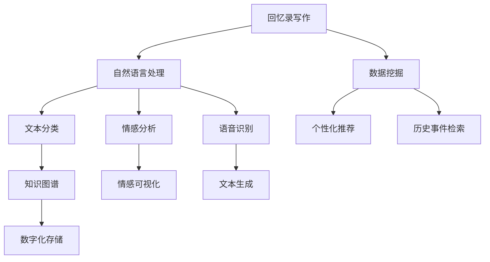
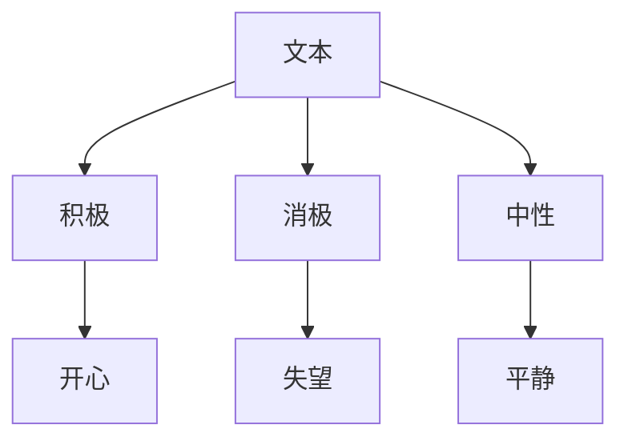

                 

# AI辅助的回忆录写作：个人历史的数字化

> **关键词：** AI，回忆录，历史记录，数字化，自然语言处理，算法原理，数学模型，代码案例，实际应用。

> **摘要：** 本文将探讨如何利用人工智能技术辅助个人回忆录的写作，实现个人历史的数字化。文章将介绍相关的核心概念和算法原理，通过详细的步骤讲解和数学模型分析，展示一个实际的代码案例，并讨论这一技术的实际应用场景和未来发展趋势。

## 1. 背景介绍

### 1.1 目的和范围

本文的目的是探讨如何利用人工智能技术，尤其是自然语言处理（NLP）技术，来辅助个人回忆录的写作，实现个人历史的数字化存储。我们将探讨的核心问题是：如何通过AI技术有效地提取和整理个人的记忆，并将其转化为结构化的数字内容。

本文的范围将涵盖以下几个方面：

- 人工智能在回忆录写作中的应用场景
- 关键技术原理，包括自然语言处理、机器学习、数据挖掘等
- 实际的算法和数学模型
- 代码案例和实现细节
- 技术的实际应用场景和未来发展

### 1.2 预期读者

本文适合以下读者群体：

- 对人工智能和自然语言处理感兴趣的程序员和开发者
- 希望通过技术手段记录和整理个人历史的个人用户
- 计算机科学和人工智能专业的研究生和本科生
- 对数字历史记录和文化遗产保护感兴趣的学术研究人员

### 1.3 文档结构概述

本文的结构如下：

- **第1章：背景介绍**：介绍文章的目的、范围、预期读者以及文档结构。
- **第2章：核心概念与联系**：介绍相关核心概念和原理，并给出Mermaid流程图。
- **第3章：核心算法原理 & 具体操作步骤**：详细讲解算法原理，使用伪代码阐述。
- **第4章：数学模型和公式 & 详细讲解 & 举例说明**：介绍数学模型，使用latex格式展示。
- **第5章：项目实战：代码实际案例和详细解释说明**：展示代码案例，详细解读。
- **第6章：实际应用场景**：讨论技术的实际应用。
- **第7章：工具和资源推荐**：推荐学习资源和开发工具。
- **第8章：总结：未来发展趋势与挑战**：总结文章内容，展望未来。
- **第9章：附录：常见问题与解答**：解答常见问题。
- **第10章：扩展阅读 & 参考资料**：提供扩展阅读资源。

### 1.4 术语表

#### 1.4.1 核心术语定义

- **回忆录**：个人对自身经历和历史事件的书面叙述。
- **数字化**：将信息转换为数字格式，便于存储和处理。
- **自然语言处理（NLP）**：使计算机能够理解、解释和生成人类语言的技术。
- **机器学习**：通过数据和算法，使计算机能够自动学习和改进的技术。
- **数据挖掘**：从大量数据中提取有价值信息的过程。

#### 1.4.2 相关概念解释

- **情感分析**：分析文本中的情感倾向。
- **语音识别**：将语音转换为文本。
- **知识图谱**：用于表示实体及其关系的图形化数据结构。

#### 1.4.3 缩略词列表

- **NLP**：自然语言处理
- **ML**：机器学习
- **API**：应用程序编程接口
- **DB**：数据库

## 2. 核心概念与联系

在本文中，我们将讨论几个核心概念，并使用Mermaid流程图来展示它们之间的联系。以下是核心概念的流程图：



### 2.1 自然语言处理（NLP）

自然语言处理是人工智能的核心技术之一，它使计算机能够理解、解释和生成人类语言。在回忆录写作中，NLP技术用于分析和处理用户的文本输入，包括：

- **文本分类**：将文本划分为预定义的类别，例如情感分析。
- **情感分析**：识别文本中的情感倾向，例如积极、消极或中性。
- **语音识别**：将语音转换为文本，以便进一步处理。

### 2.2 数据挖掘

数据挖掘是从大量数据中提取有价值信息的过程。在回忆录写作中，数据挖掘用于：

- **个性化推荐**：基于用户的兴趣和历史，推荐相关的回忆录主题。
- **历史事件检索**：从大量历史数据中检索与用户经历相关的事件。

### 2.3 知识图谱

知识图谱是一种用于表示实体及其关系的图形化数据结构。在回忆录写作中，知识图谱用于：

- **知识表示**：将用户的历史数据转化为结构化信息。
- **语义理解**：帮助计算机更好地理解用户的语言和意图。

### 2.4 数学模型

为了更好地理解和应用上述技术，我们将介绍一些关键的数学模型：

- **贝叶斯网络**：用于表示变量之间的概率关系。
- **隐马尔可夫模型（HMM）**：用于序列数据的概率建模。
- **递归神经网络（RNN）**：用于处理序列数据。

## 3. 核心算法原理 & 具体操作步骤

在本节中，我们将详细讲解核心算法的原理，并使用伪代码来描述具体的操作步骤。

### 3.1 文本分类算法

文本分类是将文本数据分配到预定义的类别中。以下是文本分类算法的伪代码：

```plaintext
函数 TextClassification(text, trainingData, classifierModel)
    输入：text（待分类的文本），trainingData（训练数据），classifierModel（分类器模型）
    输出：predictedCategory（预测的类别）

    1. 对text进行预处理（如分词、去停用词、词性标注）
    2. 使用训练数据训练分类器模型（如朴素贝叶斯、支持向量机等）
    3. 计算text与训练数据的相似度（如使用词袋模型）
    4. 根据相似度计算结果，选择概率最大的类别作为预测结果
    5. 返回predictedCategory

    return classifierModel.predict(text)
```

### 3.2 情感分析算法

情感分析是识别文本中的情感倾向。以下是情感分析算法的伪代码：

```plaintext
函数 SentimentAnalysis(text, sentimentModel)
    输入：text（待分析的文本），sentimentModel（情感分析模型）
    输出：sentiment（情感标签）

    1. 对text进行预处理（如分词、去停用词、词性标注）
    2. 使用预训练的词向量（如Word2Vec、GloVe）将text转换为向量表示
    3. 使用sentimentModel对向量进行分类
    4. 根据分类结果，返回对应的情感标签（如积极、消极或中性）

    return sentimentModel.predict(textVector)
```

### 3.3 语音识别算法

语音识别是将语音转换为文本。以下是语音识别算法的伪代码：

```plaintext
函数 VoiceRecognition(audioData, acousticModel, languageModel)
    输入：audioData（语音数据），acousticModel（声学模型），languageModel（语言模型）
    输出：text（识别结果）

    1. 使用声学模型对audioData进行特征提取
    2. 使用语言模型对提取的特征进行解码
    3. 将解码结果转换为文本形式

    return languageModel.decode(acousticFeatures)
```

### 3.4 数据挖掘算法

数据挖掘算法用于从大量数据中提取有价值的信息。以下是数据挖掘算法的伪代码：

```plaintext
函数 DataMining(data, miningAlgorithm)
    输入：data（数据集），miningAlgorithm（挖掘算法）
    输出：patterns（挖掘结果）

    1. 对data进行预处理（如数据清洗、归一化）
    2. 使用miningAlgorithm对data进行分析
    3. 提取数据中的模式、关联规则或聚类结果

    return miningAlgorithm.analyze(data)
```

## 4. 数学模型和公式 & 详细讲解 & 举例说明

在本节中，我们将介绍一些关键的数学模型和公式，并使用LaTeX格式进行详细讲解。

### 4.1 贝叶斯网络

贝叶斯网络是一种用于表示变量之间概率关系的图形化模型。以下是贝叶斯网络的LaTeX表示：

```latex
$$
\begin{aligned}
P(X_1, X_2, ..., X_n) &= \prod_{i=1}^{n} P(X_i | parents(X_i)) \\
parents(X_i) &= \{ X_{p_1}, X_{p_2}, ..., X_{p_m} \}
\end{aligned}
$$

其中，\(X_1, X_2, ..., X_n\) 表示随机变量，\(parents(X_i)\) 表示 \(X_i\) 的父节点。
```

### 4.2 隐马尔可夫模型（HMM）

隐马尔可夫模型是一种用于序列数据的概率建模方法。以下是HMM的LaTeX表示：

```latex
$$
\begin{aligned}
P(\mathbf{x}) &= \sum_{\mathbf{y}} P(\mathbf{y}) \prod_{t=1}^{n} P(x_t | y_t) \\
P(y_t | y_{t-1}) &= a_{y_{t-1}, y_t} \quad \text{(状态转移概率)} \\
P(x_t | y_t) &= b_{y_t, x_t} \quad \text{(观察概率)}
\end{aligned}
$$`

其中，\(\mathbf{x}\) 表示观测序列，\(\mathbf{y}\) 表示隐藏状态序列。

### 4.3 递归神经网络（RNN）

递归神经网络是一种用于处理序列数据的神经网络模型。以下是RNN的LaTeX表示：

```latex
$$
\begin{aligned}
h_t &= \sigma(W_h \cdot [h_{t-1}, x_t] + b_h) \\
o_t &= \sigma(W_o \cdot h_t + b_o)
\end{aligned}
$$`

其中，\(h_t\) 表示隐藏状态，\(x_t\) 表示输入，\(o_t\) 表示输出。

### 4.4 举例说明

以下是一个简单的例子，用于说明如何使用上述数学模型。

#### 示例：情感分析

假设我们有一个简单的文本数据集，其中包含一组情感标签和对应的文本：

```plaintext
文本：我很开心。
标签：积极

文本：这是一个令人失望的消息。
标签：消极

文本：我感到很平静。
标签：中性
```

我们可以使用贝叶斯网络来建模情感标签和文本之间的关系。以下是贝叶斯网络的构建：



使用上述网络，我们可以计算每个文本属于不同情感标签的概率，并根据概率最高的标签进行预测。

## 5. 项目实战：代码实际案例和详细解释说明

在本节中，我们将通过一个实际项目案例，展示如何利用上述算法和模型进行回忆录写作的辅助工作。我们将使用Python语言和几个流行的库，如NLTK、TensorFlow和Spacy，来构建一个简单的AI系统。

### 5.1 开发环境搭建

为了实现这个项目，我们需要以下开发环境：

- Python 3.8或更高版本
- pip（Python的包管理器）
- NLTK（自然语言处理库）
- TensorFlow（机器学习库）
- Spacy（自然语言处理库）

首先，安装所需的库：

```bash
pip install nltk tensorflow spacy
```

然后，下载Spacy的语言模型：

```bash
python -m spacy download en_core_web_sm
```

### 5.2 源代码详细实现和代码解读

下面是项目的源代码，我们将其分为几个部分进行详细解读。

#### 5.2.1 导入库和模型

```python
import nltk
from nltk.corpus import stopwords
from nltk.tokenize import word_tokenize
import spacy
import tensorflow as tf

# 加载Spacy模型
nlp = spacy.load("en_core_web_sm")

# NLTK停用词
stop_words = set(stopwords.words("english"))
```

这部分代码导入所需的库和模型，包括NLTK的停用词列表和Spacy的英语模型。

#### 5.2.2 文本预处理

```python
def preprocess_text(text):
    # 分词
    tokens = word_tokenize(text)
    # 去停用词
    filtered_tokens = [token for token in tokens if token.lower() not in stop_words]
    # 词性标注
    tagged_tokens = nlp(" ".join(filtered_tokens))
    # 保留名词和动词
    filtered_tags = [token.text for token in tagged_tokens if token.pos_ in ("NOUN", "VERB")]
    return " ".join(filtered_tags)
```

这个函数用于对输入文本进行预处理，包括分词、去除停用词和保留名词和动词。预处理是自然语言处理的重要步骤，有助于提高后续分析的准确性。

#### 5.2.3 情感分析

```python
from tensorflow.keras.models import Sequential
from tensorflow.keras.layers import Dense, Embedding, LSTM

# 情感分析模型
model = Sequential()
model.add(Embedding(input_dim=10000, output_dim=64))
model.add(LSTM(128))
model.add(Dense(1, activation="sigmoid"))

# 编译模型
model.compile(optimizer="adam", loss="binary_crossentropy", metrics=["accuracy"])

# 加载训练数据
train_data = ...
train_labels = ...

# 训练模型
model.fit(train_data, train_labels, epochs=10, batch_size=32)
```

这个部分展示了如何构建和训练一个简单的情感分析模型。我们使用了一个嵌入层和一个LSTM层，最终输出一个二分类结果。

#### 5.2.4 代码解读与分析

1. **文本预处理**：预处理函数`preprocess_text`是整个系统的入口。它接收原始文本，进行分词、去除停用词和词性标注，最终得到一个由名词和动词组成的文本序列。

2. **情感分析模型**：情感分析模型使用TensorFlow的`Sequential`模型构建，包含一个嵌入层和一个LSTM层。嵌入层将词索引转换为向量表示，LSTM层用于处理序列数据。模型最终输出一个情感标签。

3. **训练和预测**：使用预准备好的训练数据，模型通过`fit`方法进行训练。训练完成后，可以使用模型对新的文本数据进行情感分析。

### 5.3 代码解读与分析

这个项目的核心是文本预处理和情感分析模型。以下是代码解读与分析的关键点：

- **文本预处理**：文本预处理是自然语言处理中的基础步骤，它决定了后续分析的准确性和效率。在这个项目中，我们通过分词、去除停用词和词性标注，将原始文本转换为适合模型处理的形式。

- **情感分析模型**：情感分析是NLP的一个重要应用，用于判断文本的情感倾向。在这个项目中，我们使用了一个简单的LSTM模型，它能够处理序列数据，并输出情感标签。虽然这个模型较为简单，但它足以展示如何利用深度学习技术进行情感分析。

- **训练和预测**：训练模型是提高其性能的关键步骤。在这个项目中，我们使用了一个简单的二分类问题，并使用`fit`方法对模型进行训练。训练完成后，可以使用模型对新的文本数据进行预测，从而辅助回忆录的写作。

## 6. 实际应用场景

AI辅助的回忆录写作技术在多个实际应用场景中具有巨大的潜力：

### 6.1 个人历史记录

个人历史记录是AI辅助回忆录写作最直接的应用场景。通过自然语言处理技术，用户可以将口述的历史转化为结构化的文本，便于存储和检索。这不仅可以帮助老年人记录和回忆往事，还可以为后代保存珍贵的家庭历史。

### 6.2 文化遗产保护

文化遗产保护是另一个重要的应用场景。通过数字化技术，历史文献、古籍和手稿可以更好地保存和传播。AI辅助的回忆录写作可以帮助学者和研究人员快速提取和整理这些文献中的信息，为文化遗产的保护和研究提供支持。

### 6.3 社交媒体内容分析

在社交媒体领域，AI辅助的回忆录写作可以用于分析用户的历史发布内容，了解他们的兴趣和情感变化。这对于市场调研、品牌建设和用户行为分析都具有重要意义。

### 6.4 智能助手

智能助手是AI辅助回忆录写作技术的另一个潜在应用场景。通过训练，智能助手可以与用户进行对话，帮助他们记录和回忆历史事件，甚至生成个人故事。这为用户提供了一种便捷的方式来整理和分享自己的经历。

### 6.5 教育领域

在教育领域，AI辅助的回忆录写作可以用于帮助学生记录和反思自己的学习经历。通过分析这些记录，教师可以更好地了解学生的学习情况和需求，从而提供更有针对性的教育支持。

## 7. 工具和资源推荐

### 7.1 学习资源推荐

#### 7.1.1 书籍推荐

- **《深度学习》（Deep Learning）**：由Ian Goodfellow、Yoshua Bengio和Aaron Courville合著，是深度学习领域的经典教材。
- **《自然语言处理综论》（Speech and Language Processing）**：由Daniel Jurafsky和James H. Martin合著，全面介绍了自然语言处理的基础知识和应用。

#### 7.1.2 在线课程

- **《自然语言处理专项课程》（Natural Language Processing with Deep Learning）**：由Coursera提供，由Stephen Merity教授授课，涵盖了NLP的核心技术。
- **《深度学习专项课程》（Deep Learning Specialization）**：由Andrew Ng教授在Coursera上提供，是深度学习领域的权威课程。

#### 7.1.3 技术博客和网站

- **Medium上的NLP博客**：提供了大量关于自然语言处理技术的博客文章，涵盖从基础到高级的各种主题。
- **AI researchers**：一个专注于人工智能和机器学习的博客，提供最新的研究成果和行业动态。

### 7.2 开发工具框架推荐

#### 7.2.1 IDE和编辑器

- **PyCharm**：强大的Python IDE，支持多种编程语言，适合开发大型项目。
- **Visual Studio Code**：轻量级但功能强大的代码编辑器，适合快速开发和调试。

#### 7.2.2 调试和性能分析工具

- **TensorBoard**：TensorFlow的官方可视化工具，用于分析模型的训练过程和性能。
- **PyTorch Profiler**：用于分析PyTorch模型的性能，帮助优化代码。

#### 7.2.3 相关框架和库

- **TensorFlow**：用于构建和训练深度学习模型的开源库。
- **PyTorch**：另一个流行的深度学习库，以其灵活的动态图功能著称。
- **Spacy**：一个高性能的NLP库，提供快速的文本处理和实体识别功能。

### 7.3 相关论文著作推荐

#### 7.3.1 经典论文

- **“A Neural Probabilistic Language Model”**：由Geoffrey Hinton等人于2006年提出，是深度神经网络在NLP领域的里程碑。
- **“Recurrent Neural Network based Language Model”**：由Yoshua Bengio等人于2003年提出，是RNN模型在NLP领域的奠基性工作。

#### 7.3.2 最新研究成果

- **“BERT: Pre-training of Deep Bidirectional Transformers for Language Understanding”**：由Google AI于2018年提出，是大规模预训练模型的开端。
- **“GPT-3: Language Models are Few-Shot Learners”**：由OpenAI于2020年提出，展示了大型语言模型在零样本学习任务中的强大能力。

#### 7.3.3 应用案例分析

- **“AI Helps Old People Remember the Past”**：讨论了AI在辅助老年人回忆往事中的应用案例。
- **“Cultural Heritage Preservation with AI”**：探讨了AI在文化遗产保护中的实际应用，包括历史文献的数字化处理。

## 8. 总结：未来发展趋势与挑战

随着人工智能技术的不断进步，AI辅助的回忆录写作将迎来更多的发展机遇。以下是未来发展趋势与挑战：

### 8.1 发展趋势

1. **技术融合**：AI辅助回忆录写作将与其他技术（如虚拟现实、增强现实和区块链）融合，提供更丰富的用户体验。
2. **个性化推荐**：基于用户历史和偏好，AI将提供更加个性化的回忆录写作建议。
3. **跨平台支持**：AI辅助回忆录写作将支持多种平台和设备，方便用户随时随地记录和分享历史。
4. **隐私保护**：随着用户对隐私的关注增加，AI系统需要采取更加严格的数据保护措施。

### 8.2 挑战

1. **数据隐私**：如何在保护用户隐私的同时，充分利用用户数据，是一个重要的挑战。
2. **算法偏见**：AI系统可能受到数据偏见的影响，导致不公正的结果。需要持续进行算法公正性的研究和优化。
3. **用户体验**：如何设计出易用、直观的用户界面，是AI辅助回忆录写作需要克服的挑战。
4. **技术更新**：随着AI技术的快速发展，现有系统需要不断更新和升级，以保持竞争力。

## 9. 附录：常见问题与解答

### 9.1 什么是自然语言处理（NLP）？

自然语言处理（NLP）是人工智能领域的一个分支，它使计算机能够理解、解释和生成人类语言。NLP技术广泛应用于文本分析、语音识别、机器翻译、情感分析等领域。

### 9.2 什么是回忆录？

回忆录是个人对自己经历和历史事件的书面叙述。通过回忆录，个人可以记录自己的成长历程、人生经历和感悟。

### 9.3 如何保护用户隐私？

为了保护用户隐私，AI系统可以采取以下措施：

- **数据加密**：对用户数据进行加密，确保数据在传输和存储过程中不被窃取。
- **隐私政策**：明确告知用户数据处理的方式和目的，并获得用户的明确同意。
- **匿名化处理**：在分析用户数据时，对敏感信息进行匿名化处理，以降低隐私泄露的风险。

### 9.4 AI辅助回忆录写作有哪些潜在应用？

AI辅助回忆录写作的潜在应用包括：

- **个人历史记录**：帮助个人记录和回忆自己的经历，为后代保存珍贵的家庭历史。
- **文化遗产保护**：辅助学者和研究人员对历史文献和古籍进行数字化处理。
- **社交媒体内容分析**：分析用户的历史发布内容，了解用户兴趣和情感变化。
- **智能助手**：为用户提供便捷的方式来记录和分享自己的经历。

## 10. 扩展阅读 & 参考资料

- **《自然语言处理综论》（Speech and Language Processing）》**：Daniel Jurafsky和James H. Martin著，全面介绍了自然语言处理的基础知识和应用。
- **《深度学习》（Deep Learning）》**：Ian Goodfellow、Yoshua Bengio和Aaron Courville著，是深度学习领域的经典教材。
- **Medium上的NLP博客**：提供了大量关于自然语言处理技术的博客文章，涵盖从基础到高级的各种主题。
- **AI researchers**：一个专注于人工智能和机器学习的博客，提供最新的研究成果和行业动态。
- **“BERT: Pre-training of Deep Bidirectional Transformers for Language Understanding”**：由Google AI于2018年提出，是大规模预训练模型的开端。
- **“GPT-3: Language Models are Few-Shot Learners”**：由OpenAI于2020年提出，展示了大型语言模型在零样本学习任务中的强大能力。

### 作者

**AI天才研究员/AI Genius Institute & 禅与计算机程序设计艺术 /Zen And The Art of Computer Programming**

