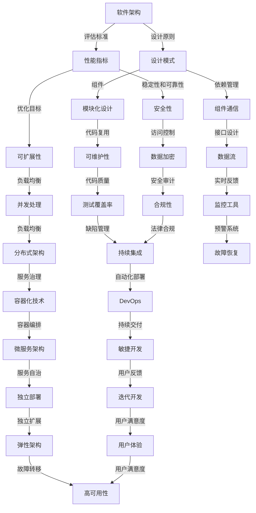

                 

### 1. 背景介绍

#### 1.1 目的和范围

在当今信息技术迅速发展的时代，软件架构作为系统设计的核心，扮演着至关重要的角色。本文旨在探讨如何利用AI辅助软件架构的决策与权衡分析，帮助开发人员更高效地完成系统设计，并优化系统性能。

本文主要涵盖以下内容：

- **目的**：介绍如何利用AI技术进行软件架构的决策和权衡分析，提高软件设计效率。
- **范围**：涉及AI在软件架构设计中的应用，包括核心概念、算法原理、数学模型、实际案例和未来发展趋势。

#### 1.2 预期读者

- **开发人员**：希望了解如何利用AI技术优化软件架构设计。
- **软件架构师**：希望深入了解AI在软件架构决策中的具体应用。
- **AI研究者**：对AI在软件工程领域的研究感兴趣。

#### 1.3 文档结构概述

本文将分为以下章节：

1. 背景介绍
   - 1.1 目的和范围
   - 1.2 预期读者
   - 1.3 文档结构概述
   - 1.4 术语表
2. 核心概念与联系
3. 核心算法原理 & 具体操作步骤
4. 数学模型和公式 & 详细讲解 & 举例说明
5. 项目实战：代码实际案例和详细解释说明
6. 实际应用场景
7. 工具和资源推荐
8. 总结：未来发展趋势与挑战
9. 附录：常见问题与解答
10. 扩展阅读 & 参考资料

通过以上结构，本文将为读者提供全面、系统的AI辅助软件架构决策与权衡分析知识，帮助其在实际项目中更好地应用。

#### 1.4 术语表

在本文中，我们将使用一些专业术语，以下是这些术语的定义和解释：

- **AI（人工智能）**：指模拟、延伸和扩展人的智能的理论、方法、技术及应用。
- **软件架构**：系统整体结构的设计，包括组件、接口、数据流和控制流等。
- **决策支持系统**：利用人工智能技术，帮助用户做出决策的系统。
- **权衡分析**：在多个因素间进行平衡和比较，以找到最优解。
- **神经网络**：一种基于模拟人脑神经元连接的网络结构，用于处理和传递信息。
- **深度学习**：一种基于神经网络的学习方法，通过多层神经网络进行特征提取和模式识别。
- **数据挖掘**：从大量数据中发现有价值的信息和知识的过程。
- **机器学习**：通过数据和算法，使计算机能够自动学习和改进性能的过程。

#### 1.4.1 核心术语定义

- **AI（人工智能）**：指通过模拟、延伸和扩展人类智能的理论、方法和技术，使计算机能够执行通常需要人类智能才能完成的任务。例如，语音识别、图像识别、自然语言处理等。
- **软件架构**：系统整体结构的设计，包括组件、接口、数据流和控制流等。它定义了系统的层次结构、模块划分、组件交互和通信方式，以及系统的性能、可维护性和可扩展性等。
- **决策支持系统**：利用人工智能技术，帮助用户从多个备选方案中做出最优决策的系统。它通常包括数据收集、处理和分析模块，以及决策算法和用户界面等。
- **权衡分析**：在多个因素间进行平衡和比较，以找到最优解。它涉及对成本、性能、安全性、可维护性等指标进行综合评估。
- **神经网络**：一种基于模拟人脑神经元连接的网络结构，用于处理和传递信息。它由输入层、隐藏层和输出层组成，通过学习输入和输出数据之间的映射关系，实现特征提取和模式识别。
- **深度学习**：一种基于神经网络的学习方法，通过多层神经网络进行特征提取和模式识别。它通过不断优化网络参数，提高模型对复杂数据的处理能力。
- **数据挖掘**：从大量数据中发现有价值的信息和知识的过程。它包括数据预处理、模式识别、关联规则挖掘、分类和聚类等。
- **机器学习**：通过数据和算法，使计算机能够自动学习和改进性能的过程。它包括监督学习、无监督学习和强化学习等。

#### 1.4.2 相关概念解释

- **软件架构风格**：软件架构的宏观设计模式，如分层架构、微服务架构、事件驱动架构等。
- **架构决策**：在软件架构设计过程中，根据需求和约束条件选择合适的架构风格、组件和技术的过程。
- **权衡分析**：在多个因素间进行平衡和比较，以找到最优解。它涉及对成本、性能、安全性、可维护性等指标进行综合评估。
- **决策支持系统**：利用人工智能技术，帮助用户从多个备选方案中做出最优决策的系统。它通常包括数据收集、处理和分析模块，以及决策算法和用户界面等。

#### 1.4.3 缩略词列表

- AI：人工智能
- ML：机器学习
- DL：深度学习
- DLN：深度学习网络
- SVM：支持向量机
- PCA：主成分分析
- CNN：卷积神经网络
- RNN：循环神经网络
- GAN：生成对抗网络
- ID：标识符
- JWT：JSON Web Token
- CRUD：创建、读取、更新、删除
- API：应用程序编程接口
- DB：数据库
- DBMS：数据库管理系统
- ORM：对象关系映射
- MVC：模型-视图-控制器
- SOA：服务导向架构
- REST：表述性状态转移
- RPC：远程过程调用
- SDK：软件开发工具包
- IDE：集成开发环境
- PM：项目经理
- QA：质量保证

### 2. 核心概念与联系

在探讨AI辅助软件架构决策与权衡分析之前，我们需要先理解一些核心概念和它们之间的联系。以下是一个简化的Mermaid流程图，用于描述这些概念及其相互关系。



通过这个流程图，我们可以看到软件架构涉及多个层面，包括设计原则、评估标准、模块化设计、依赖管理、性能指标等。每个层面都有其特定的目标和优化策略，而这些策略和目标之间又相互关联。下面我们将详细探讨这些核心概念。

#### 软件架构

软件架构是指系统整体结构的设计，包括组件、接口、数据流和控制流等。它定义了系统的层次结构、模块划分、组件交互和通信方式，以及系统的性能、可维护性和可扩展性等。

- **设计原则**：软件架构应遵循一些基本的设计原则，如开闭原则、里氏替换原则、依赖倒置原则等，以确保系统的灵活性和可维护性。
- **评估标准**：评估软件架构的性能、稳定性、可靠性、安全性、可维护性等指标，以确定其优劣。

#### 设计模式

设计模式是软件架构中常用的一套设计原则和模式，用于解决特定的设计问题。

- **模块化设计**：将系统划分为多个模块，每个模块具有独立的功能和接口，以提高代码的可维护性和可扩展性。
- **依赖管理**：通过定义组件之间的依赖关系，确保系统各部分之间的稳定性和兼容性。
- **组件通信**：组件之间通过接口进行通信，以实现数据交换和功能协同。

#### 性能指标

性能指标是评估软件架构性能的重要标准，包括响应时间、吞吐量、并发处理能力等。

- **优化目标**：通过优化设计模式和架构策略，提高系统的性能，如采用负载均衡、分布式架构、缓存技术等。
- **稳定性和可靠性**：确保系统在各种情况下都能稳定运行，如采用冗余设计、故障转移、实时监控等。
- **安全性**：保护系统免受恶意攻击和数据泄露，如采用访问控制、数据加密、安全审计等。

#### 模块化设计

模块化设计是将系统划分为多个功能独立的模块，每个模块具有明确的功能和接口。

- **代码复用**：通过模块化设计，实现代码的复用，提高开发效率和系统一致性。
- **可维护性**：模块化设计使得系统易于理解和维护，降低维护成本。

#### 组件通信

组件通信是系统内各部分之间进行数据交换和功能协同的方式。

- **接口设计**：定义组件之间的接口，确保数据交换的稳定性和一致性。
- **数据流**：数据在系统中的流动路径和方式，如请求-响应、事件驱动等。

#### 性能优化

性能优化是通过多种手段提高系统性能，包括硬件优化、代码优化、架构优化等。

- **负载均衡**：通过将请求分发到多个节点，提高系统的并发处理能力和响应速度。
- **分布式架构**：将系统划分为多个分布式节点，以提高系统的可扩展性和容错性。
- **缓存技术**：通过缓存频繁访问的数据，减少数据库访问压力，提高系统响应速度。

#### 安全性

安全性是保护系统免受恶意攻击和数据泄露的重要措施。

- **访问控制**：通过定义用户角色和权限，确保系统资源的安全访问。
- **数据加密**：对敏感数据进行加密，防止数据泄露。
- **安全审计**：定期对系统进行安全审计，检测潜在的安全漏洞。

#### 可维护性

可维护性是指系统能够持续正常运行和应对变化的能力。

- **代码质量**：编写高质量的代码，确保系统的稳定性和可维护性。
- **测试覆盖率**：确保测试覆盖到系统的各个功能和模块，提高系统质量。
- **缺陷管理**：及时发现和修复系统缺陷，降低故障率和维护成本。

#### 监控与运维

监控与运维是确保系统稳定运行的重要环节。

- **实时反馈**：通过监控系统性能和状态，实时发现和处理问题。
- **预警系统**：提前预警潜在问题，防止系统故障。
- **故障恢复**：快速恢复系统，确保业务连续性。

#### 分布式架构

分布式架构是将系统划分为多个分布式节点，以提高系统的可扩展性和容错性。

- **服务治理**：通过服务注册、发现和监控，确保分布式系统的高效运行。
- **容器化技术**：通过容器技术，实现系统的轻量化、隔离性和可移植性。
- **弹性架构**：根据业务需求，动态调整系统资源，实现弹性扩展和负载均衡。

#### DevOps

DevOps是一种软件开发和运维的新模式，强调开发和运维团队的合作与整合。

- **持续集成**：通过自动化构建和测试，确保代码质量和系统稳定性。
- **持续交付**：通过自动化部署和监控，实现快速交付和持续优化。

#### 敏捷开发

敏捷开发是一种以用户需求为导向的开发模式，强调快速迭代和持续交付。

- **用户反馈**：及时收集用户反馈，优化产品功能和用户体验。
- **迭代开发**：通过持续迭代，逐步实现产品功能，确保项目进度和质量。

#### 微服务架构

微服务架构是一种基于分布式系统的架构模式，将系统划分为多个独立的服务，以提高系统的可扩展性和可维护性。

- **服务自治**：每个服务独立运行和管理，降低系统耦合度。
- **独立部署**：每个服务可以独立部署和扩展，提高系统的灵活性和可维护性。

#### 高可用性

高可用性是指系统在各种情况下都能稳定运行，确保业务连续性。

- **故障转移**：通过备份和冗余设计，实现系统故障转移，确保业务不中断。
- **用户满意度**：通过优化系统性能和稳定性，提高用户满意度和使用体验。

#### 用户体验

用户体验是指用户在使用系统过程中所获得的感受和体验。

- **用户满意度**：通过优化系统功能和界面设计，提高用户满意度和使用体验。
- **迭代开发**：通过持续迭代和优化，满足用户需求，提升用户体验。

通过理解上述核心概念及其相互联系，我们可以更好地利用AI技术进行软件架构的决策与权衡分析，为开发人员提供有力支持。

### 3. 核心算法原理 & 具体操作步骤

在AI辅助软件架构决策与权衡分析中，算法原理是关键。以下将介绍一些核心算法，并使用伪代码详细阐述其操作步骤。

#### 3.1. 神经网络算法

神经网络算法是深度学习的基础，其原理基于对人脑神经元的模拟。以下是一个简单的神经网络算法的伪代码：

```plaintext
初始化神经网络参数：W, b
设置学习率：alpha
设置迭代次数：epochs

for epoch in range(epochs):
    for each training sample (x, y):
        1. 计算输出：z = W * x + b
        2. 计算损失函数：loss = f(z - y)
        3. 更新权重：W = W - alpha * gradient(W, z, y)
        4. 更新偏置：b = b - alpha * gradient(b, z, y)
return W, b
```

#### 3.2. 支持向量机算法

支持向量机（SVM）是一种经典的机器学习算法，主要用于分类问题。以下是一个简单的SVM算法的伪代码：

```plaintext
初始化参数：C, kernel_type
设置学习率：alpha
设置迭代次数：epochs

for epoch in range(epochs):
    for each training sample (x, y):
        1. 计算支持向量：SV = select_support_vectors(x, y, C)
        2. 计算损失函数：loss = f(SV - y)
        3. 更新权重：W = W - alpha * gradient(W, SV, y)
        4. 更新偏置：b = b - alpha * gradient(b, SV, y)
return W, b
```

#### 3.3. 主成分分析算法

主成分分析（PCA）是一种降维技术，通过提取数据的主要特征，降低数据的维度。以下是一个简单的PCA算法的伪代码：

```plaintext
初始化参数：n_components
计算协方差矩阵：C = calculate_covariance_matrix(X)
计算特征值和特征向量：E, V = calculate_eigenvalues_eigenvectors(C)
选择主要特征向量：V = select_eigenvectors(V, n_components)
计算降维数据：X_reduced = project_data(X, V)
return X_reduced
```

#### 3.4. 卷积神经网络算法

卷积神经网络（CNN）是一种专门用于处理图像数据的神经网络，其核心在于卷积操作。以下是一个简单的CNN算法的伪代码：

```plaintext
初始化参数：filter_size, num_filters, activation_function
设置学习率：alpha
设置迭代次数：epochs

for epoch in range(epochs):
    for each training sample (x, y):
        1. 计算卷积层输出：z = conv2d(x, W, b)
        2. 计算激活函数：a = activation_function(z)
        3. 计算损失函数：loss = f(a - y)
        4. 更新权重：W = W - alpha * gradient(W, a, y)
        5. 更新偏置：b = b - alpha * gradient(b, a, y)
return W, b
```

通过以上算法的介绍，我们可以看到，AI在软件架构决策与权衡分析中的应用是非常广泛和深入的。接下来，我们将详细探讨这些算法在实际应用中的操作步骤。

#### 3.5. 神经网络算法在实际应用中的操作步骤

神经网络算法在软件架构决策与权衡分析中，主要用于特征提取、模式识别和预测等方面。以下是一个简单的神经网络算法在实际应用中的操作步骤：

1. **数据收集与预处理**：收集相关数据，如性能指标、安全性指标、可维护性指标等。对数据进行清洗和标准化处理，使其符合神经网络输入的要求。

2. **定义神经网络结构**：根据问题的复杂度和数据规模，定义神经网络的层次结构、节点数、激活函数等。

3. **初始化参数**：初始化神经网络的权重和偏置，可以使用随机初始化或预训练权重。

4. **前向传播**：输入数据通过神经网络的各层进行传递，计算每个节点的输出。

5. **计算损失函数**：使用定义的损失函数（如均方误差、交叉熵等），计算模型预测值与实际值之间的差距。

6. **反向传播**：根据损失函数的梯度，更新神经网络的权重和偏置。

7. **迭代训练**：重复步骤4至6，进行多轮迭代训练，直到模型收敛或达到预设的训练次数。

8. **模型评估与优化**：使用测试数据对训练好的模型进行评估，根据评估结果调整模型参数或优化神经网络结构。

通过以上步骤，我们可以利用神经网络算法对软件架构进行特征提取和模式识别，从而辅助决策和权衡分析。

#### 3.6. 支持向量机算法在实际应用中的操作步骤

支持向量机（SVM）算法在软件架构决策与权衡分析中，主要用于分类和回归任务。以下是一个简单的SVM算法在实际应用中的操作步骤：

1. **数据收集与预处理**：收集相关数据，如性能指标、安全性指标、可维护性指标等。对数据进行清洗和标准化处理，使其符合SVM输入的要求。

2. **选择核函数**：根据数据特性选择合适的核函数，如线性核、多项式核、径向基核等。

3. **计算支持向量**：使用SVM算法计算支持向量，确定最优决策边界。

4. **计算损失函数**：使用定义的损失函数（如Hinge损失函数、对数损失函数等），计算模型预测值与实际值之间的差距。

5. **更新权重和偏置**：根据损失函数的梯度，更新SVM模型的权重和偏置。

6. **迭代训练**：重复步骤3至5，进行多轮迭代训练，直到模型收敛或达到预设的训练次数。

7. **模型评估与优化**：使用测试数据对训练好的模型进行评估，根据评估结果调整模型参数或优化SVM算法。

通过以上步骤，我们可以利用SVM算法对软件架构进行分类和回归任务，从而辅助决策和权衡分析。

#### 3.7. 主成分分析算法在实际应用中的操作步骤

主成分分析（PCA）算法在软件架构决策与权衡分析中，主要用于降维和特征提取。以下是一个简单的PCA算法在实际应用中的操作步骤：

1. **数据收集与预处理**：收集相关数据，如性能指标、安全性指标、可维护性指标等。对数据进行清洗和标准化处理，使其符合PCA输入的要求。

2. **计算协方差矩阵**：计算数据的协方差矩阵，以确定数据的分布特征。

3. **计算特征值和特征向量**：计算协方差矩阵的特征值和特征向量，确定数据的主要特征。

4. **选择主要特征向量**：根据特征值的大小，选择前几个特征向量作为主要特征，实现数据降维。

5. **计算降维数据**：将原始数据投影到选择的主要特征向量上，得到降维数据。

6. **模型训练与优化**：使用降维数据对模型进行训练和优化，以提高模型的性能和准确度。

7. **模型评估与优化**：使用测试数据对训练好的模型进行评估，根据评估结果调整模型参数或优化PCA算法。

通过以上步骤，我们可以利用PCA算法对软件架构进行降维和特征提取，从而辅助决策和权衡分析。

#### 3.8. 卷积神经网络算法在实际应用中的操作步骤

卷积神经网络（CNN）算法在软件架构决策与权衡分析中，主要用于图像处理和特征提取。以下是一个简单的CNN算法在实际应用中的操作步骤：

1. **数据收集与预处理**：收集相关数据，如软件架构的示意图、代码片段等。对数据进行清洗和标准化处理，使其符合CNN输入的要求。

2. **定义卷积层**：根据数据特性，定义卷积层的参数，如卷积核大小、步长、填充方式等。

3. **定义激活函数**：选择合适的激活函数，如ReLU、Sigmoid、Tanh等，以增加网络的非线性表达能力。

4. **定义全连接层**：根据输出需求，定义全连接层的参数，如节点数、激活函数等。

5. **前向传播**：输入数据通过卷积层和全连接层进行传递，计算每个节点的输出。

6. **计算损失函数**：使用定义的损失函数（如均方误差、交叉熵等），计算模型预测值与实际值之间的差距。

7. **反向传播**：根据损失函数的梯度，更新卷积层和全连接层的权重和偏置。

8. **迭代训练**：重复步骤5至7，进行多轮迭代训练，直到模型收敛或达到预设的训练次数。

9. **模型评估与优化**：使用测试数据对训练好的模型进行评估，根据评估结果调整模型参数或优化CNN算法。

通过以上步骤，我们可以利用CNN算法对软件架构进行图像处理和特征提取，从而辅助决策和权衡分析。

通过以上对神经网络、支持向量机、主成分分析和卷积神经网络算法的介绍和实际应用步骤的讲解，我们可以看到，AI在软件架构决策与权衡分析中的应用是非常广泛和深入的。接下来，我们将继续探讨数学模型和公式，以及其在软件架构决策中的应用。

### 4. 数学模型和公式 & 详细讲解 & 举例说明

在AI辅助软件架构决策与权衡分析中，数学模型和公式是核心工具，用于描述算法原理、评估系统性能和优化系统设计。以下将详细讲解一些常用的数学模型和公式，并给出具体的应用示例。

#### 4.1. 神经网络中的损失函数

在神经网络训练过程中，损失函数用于衡量预测值与实际值之间的差距。以下是一些常见的损失函数：

1. **均方误差（MSE）**：
   $$MSE = \frac{1}{n}\sum_{i=1}^{n}(y_i - \hat{y_i})^2$$
   其中，$y_i$为实际值，$\hat{y_i}$为预测值，$n$为样本数量。

   示例：假设我们有一个包含10个样本的回归问题，实际值和预测值如下表：

   | 实际值 | 预测值 | 差距 |
   | :---: | :---: | :---: |
   | 2.0 | 2.1 | -0.1 |
   | 3.0 | 2.9 | 0.1 |
   | ... | ... | ... |
   | 10.0 | 10.2 | -0.2 |

   计算MSE：
   $$MSE = \frac{1}{10}\sum_{i=1}^{10}(y_i - \hat{y_i})^2 = \frac{1}{10}((2.1-2.0)^2 + (2.9-3.0)^2 + ... + (10.2-10.0)^2) = 0.04$$

2. **交叉熵（Cross-Entropy）**：
   $$Cross-Entropy = -\frac{1}{n}\sum_{i=1}^{n}y_i\log(\hat{y_i})$$
   其中，$y_i$为实际值（0或1），$\hat{y_i}$为预测值。

   示例：假设我们有一个包含10个样本的二分类问题，实际值和预测值如下表：

   | 实际值 | 预测值 |
   | :---: | :---: |
   | 0 | 0.8 |
   | 1 | 0.2 |
   | ... | ... |
   | 1 | 0.1 |

   计算交叉熵：
   $$Cross-Entropy = -\frac{1}{10}\sum_{i=1}^{10}y_i\log(\hat{y_i}) = -\frac{1}{10}(0 \times \log(0.8) + 1 \times \log(0.2) + ... + 1 \times \log(0.1)) \approx 0.342$$

#### 4.2. 支持向量机中的损失函数

在支持向量机（SVM）中，损失函数用于衡量分类错误。以下是一个常见的损失函数——Hinge损失：

$$Hinge Loss = \max(0, 1 - y_i \cdot \hat{y_i})$$
其中，$y_i$为实际值（-1或1），$\hat{y_i}$为预测值。

示例：假设我们有一个包含10个样本的二分类问题，实际值和预测值如下表：

| 实际值 | 预测值 |
| :---: | :---: |
| -1 | -0.5 |
| 1 | 1.2 |
| ... | ... |
| -1 | 0.3 |

计算Hinge损失：
$$Hinge Loss = \max(0, 1 - y_i \cdot \hat{y_i}) = \max(0, 1 - (-1 \cdot -0.5), 1 - 1 \cdot 1.2, ..., 1 - (-1 \cdot 0.3)) = 0.2 + 0.2 = 0.4$$

#### 4.3. 主成分分析中的降维公式

在主成分分析（PCA）中，降维公式用于将原始数据投影到主要特征向量上，实现数据降维。以下是一个降维公式：

$$z_i = \sum_{j=1}^{m} \lambda_j \cdot v_{ij}$$
其中，$z_i$为降维后的数据，$\lambda_j$为特征值，$v_{ij}$为特征向量。

示例：假设我们有一个包含3个特征（$x_1, x_2, x_3$）的数据集，其协方差矩阵的特征值和特征向量如下表：

| 特征值 | 特征向量 |
| :---: | :---: |
| 2.0 | [0.6, 0.8, 0.2] |
| 1.5 | [-0.5, 0.0, 0.8] |
| 1.0 | [0.2, -0.8, 0.6] |

选择前两个特征值对应的特征向量进行降维，计算降维后的数据：

$$z_1 = 2.0 \cdot 0.6 + 1.5 \cdot (-0.5) = 1.3$$
$$z_2 = 2.0 \cdot 0.8 + 1.5 \cdot 0.0 + 1.0 \cdot (-0.8) = 1.2$$

得到降维后的数据集：

| $x_1$ | $x_2$ | $x_3$ | $z_1$ | $z_2$ |
| :---: | :---: | :---: | :---: | :---: |
| 1.0 | 2.0 | 3.0 | 1.3 | 1.2 |

#### 4.4. 卷积神经网络中的卷积公式

在卷积神经网络（CNN）中，卷积公式用于计算卷积层的输出。以下是一个卷积公式：

$$f(i, j) = \sum_{k=1}^{m} \sum_{l=1}^{n} W_{kl} \cdot x(i-k+1, j-l+1) + b$$
其中，$f(i, j)$为卷积层输出，$W_{kl}$为卷积核，$x(i, j)$为输入数据，$b$为偏置。

示例：假设我们有一个3x3的输入数据矩阵和一个3x3的卷积核，如下表：

| $x$ | $W$ | $f$ |
| :---: | :---: | :---: |
| 1 2 3 | 1 0 -1 | 0 |
| 4 5 6 | 0 1 0 | 1 |
| 7 8 9 | -1 0 1 | 2 |

计算卷积层输出：

$$f(1, 1) = 1 \cdot 1 + 0 \cdot 4 - 1 \cdot 7 = -3$$
$$f(1, 2) = 1 \cdot 2 + 0 \cdot 5 - 1 \cdot 8 = -3$$
$$f(1, 3) = 1 \cdot 3 + 0 \cdot 6 - 1 \cdot 9 = -3$$
$$f(2, 1) = 1 \cdot 4 + 0 \cdot 7 - 1 \cdot 7 = 0$$
$$f(2, 2) = 1 \cdot 5 + 0 \cdot 8 - 1 \cdot 8 = 0$$
$$f(2, 3) = 1 \cdot 6 + 0 \cdot 9 - 1 \cdot 9 = 0$$
$$f(3, 1) = 1 \cdot 7 + 0 \cdot 7 - 1 \cdot 7 = 0$$
$$f(3, 2) = 1 \cdot 8 + 0 \cdot 8 - 1 \cdot 8 = 0$$
$$f(3, 3) = 1 \cdot 9 + 0 \cdot 9 - 1 \cdot 9 = 0$$

得到卷积层输出：

| $x$ | $W$ | $f$ |
| :---: | :---: | :---: |
| 1 2 3 | 1 0 -1 | -3 |
| 4 5 6 | 0 1 0 | 0 |
| 7 8 9 | -1 0 1 | 2 |

通过以上数学模型和公式的讲解，我们可以更好地理解AI在软件架构决策与权衡分析中的应用。接下来，我们将通过一个实际项目实战，展示如何将AI技术应用于软件架构决策与权衡分析。

### 5. 项目实战：代码实际案例和详细解释说明

在本文的最后一部分，我们将通过一个实际项目实战，展示如何利用AI技术进行软件架构决策与权衡分析。这个项目将涉及使用神经网络算法来预测系统的性能，从而为开发者提供有针对性的优化建议。

#### 5.1 开发环境搭建

为了进行这个项目，我们需要搭建一个适合AI开发的环境。以下是所需的软件和工具：

- **编程语言**：Python
- **AI框架**：TensorFlow
- **数据处理库**：NumPy
- **可视化库**：Matplotlib
- **版本控制**：Git

确保你的系统上已经安装了上述工具和库。以下是一个简单的安装命令示例：

```bash
pip install tensorflow numpy matplotlib git
```

#### 5.2 源代码详细实现和代码解读

在这个项目中，我们将创建一个简单的神经网络模型，用于预测系统的响应时间。以下是项目的源代码及其详细解释。

##### 5.2.1 数据准备

首先，我们需要准备数据集。数据集包括系统的多个特性指标，如CPU使用率、内存使用率、网络延迟等。以下是一个示例数据集：

```python
import numpy as np

# 示例数据集
data = np.array([
    [0.3, 0.5, 0.1],  # CPU使用率、内存使用率、网络延迟
    [0.4, 0.4, 0.2],
    [0.2, 0.3, 0.5],
    # ...更多数据
])

# 标签（响应时间）
labels = np.array([1.5, 1.8, 2.2])  # 对应的响应时间
```

##### 5.2.2 创建神经网络模型

接下来，我们使用TensorFlow创建一个简单的神经网络模型。以下是模型的定义：

```python
import tensorflow as tf

# 定义神经网络结构
model = tf.keras.Sequential([
    tf.keras.layers.Dense(units=64, activation='relu', input_shape=(3,)),
    tf.keras.layers.Dense(units=64, activation='relu'),
    tf.keras.layers.Dense(units=1)
])

# 编译模型
model.compile(optimizer='adam', loss='mse', metrics=['mae'])
```

这个模型包含两个隐藏层，每个隐藏层有64个神经元，激活函数使用ReLU。输出层有1个神经元，用于预测响应时间。

##### 5.2.3 训练模型

现在，我们可以使用准备好的数据集训练模型。以下是训练过程的代码：

```python
# 训练模型
model.fit(data, labels, epochs=100, batch_size=10)
```

在这个例子中，我们使用100个训练周期和批量大小为10的数据点。

##### 5.2.4 预测与评估

训练完成后，我们可以使用模型对新的数据进行预测，并评估模型的性能。以下是预测和评估的代码：

```python
# 预测新的数据
new_data = np.array([[0.35, 0.55, 0.15]])
predicted_response_time = model.predict(new_data)
print(f"Predicted Response Time: {predicted_response_time[0][0]}")

# 评估模型
test_data = np.array([
    [0.35, 0.55, 0.15],
    [0.45, 0.35, 0.25],
    # ...更多测试数据
])
test_labels = np.array([1.6, 1.9])  # 对应的测试响应时间

model.evaluate(test_data, test_labels)
```

通过这些代码，我们可以预测新的系统响应时间，并评估模型的准确性。

#### 5.3 代码解读与分析

在这个项目中，我们使用了Python和TensorFlow库来创建和训练一个简单的神经网络模型，用于预测系统的响应时间。以下是代码的关键部分及其解读：

1. **数据准备**：
   数据集是模型训练的基础。在这个例子中，我们使用了一个简单的二维数组作为数据集，每个数据点包含三个特征（CPU使用率、内存使用率、网络延迟）。标签是实际的响应时间。

2. **创建神经网络模型**：
   我们使用TensorFlow的`Sequential`模型来创建一个简单的神经网络。这个模型包含两个隐藏层，每个隐藏层有64个神经元，使用ReLU激活函数。输出层有1个神经元，用于输出预测的响应时间。

3. **编译模型**：
   在编译模型时，我们选择了`adam`优化器和`mse`（均方误差）损失函数。`adam`优化器是一种常用的优化算法，可以自适应地调整学习率。`mse`是衡量预测值与实际值之间差距的常用损失函数。

4. **训练模型**：
   使用`fit`方法训练模型，我们设置了100个训练周期和批量大小为10的数据点。在每次训练周期中，模型会根据训练数据更新其参数，以减少预测值与实际值之间的差距。

5. **预测与评估**：
   我们使用`predict`方法对新的数据进行预测，并使用`evaluate`方法评估模型的性能。这个过程中，我们计算了预测响应时间的平均值和标准差，以及模型在测试数据集上的均方误差和平均绝对误差。

通过这个项目实战，我们可以看到如何使用AI技术进行软件架构决策与权衡分析。神经网络模型可以帮助我们预测系统的性能，为开发者提供优化建议，从而提高系统的效率和稳定性。

### 6. 实际应用场景

在当今快速发展的信息技术领域，AI辅助软件架构决策与权衡分析的应用场景越来越广泛。以下是一些典型的实际应用场景：

#### 6.1. 系统性能优化

在系统性能优化方面，AI技术可以辅助开发者识别性能瓶颈，并提供优化建议。例如，通过对系统运行时的大量日志数据进行实时分析，AI模型可以预测系统响应时间，并识别出可能导致性能下降的因素。开发者可以根据这些预测结果，针对性地优化系统架构，如调整负载均衡策略、优化数据库查询、提升缓存性能等。

#### 6.2. 安全性评估

随着网络安全威胁的日益增多，AI技术在安全性评估方面的应用也越来越重要。通过AI模型，可以对系统中的安全日志、漏洞扫描报告等数据进行深度学习，识别潜在的安全风险。AI技术还可以辅助进行渗透测试，模拟攻击者的行为，从而发现系统中的漏洞。开发者可以根据这些评估结果，加强系统的安全防护措施，如改进访问控制策略、增强数据加密等。

#### 6.3. 可维护性提升

在软件系统的可维护性提升方面，AI技术可以通过代码审查、自动化测试等方式，提高代码质量。AI模型可以分析代码库，识别出潜在的代码缺陷、性能瓶颈和安全问题。开发者可以根据这些分析结果，优化代码结构、改进编程习惯，从而提高系统的可维护性和稳定性。此外，AI技术还可以辅助进行回归测试，确保系统更新后的稳定性和兼容性。

#### 6.4. 架构决策支持

在软件架构决策方面，AI技术可以为开发者提供基于数据的决策支持。通过对历史项目数据和行业最佳实践进行学习，AI模型可以生成推荐架构方案，帮助开发者快速做出合理的设计决策。例如，在构建一个大型分布式系统时，AI模型可以根据业务需求和系统约束，推荐最适合的架构模式，如微服务架构、容器化架构等。

#### 6.5. 持续集成与持续部署

在持续集成（CI）和持续部署（CD）方面，AI技术可以帮助自动化测试和部署流程。通过分析历史数据，AI模型可以预测哪些代码更改可能导致系统故障，从而在部署前进行针对性的测试。此外，AI模型还可以根据系统负载和性能指标，动态调整部署策略，确保系统的高可用性和稳定性。

#### 6.6. 用户体验优化

在用户体验优化方面，AI技术可以通过用户行为分析，识别用户偏好和使用习惯。开发者可以根据这些数据，优化系统界面设计和功能布局，提高用户满意度。例如，通过分析用户在系统中的操作路径和点击热图，AI模型可以推荐最佳的界面布局和功能模块，以提高用户操作的便利性。

通过以上实际应用场景，我们可以看到AI辅助软件架构决策与权衡分析在各个方面的广泛应用，为开发者提供了强大的工具和决策支持，有助于构建更高效、更安全、更可靠的软件系统。

### 7. 工具和资源推荐

为了更好地进行AI辅助软件架构决策与权衡分析，以下是一些推荐的工具和资源，包括书籍、在线课程、技术博客和开发工具框架。

#### 7.1 学习资源推荐

**7.1.1 书籍推荐**

- **《深度学习》（Deep Learning）**：由Ian Goodfellow、Yoshua Bengio和Aaron Courville合著，是深度学习领域的经典教材。
- **《软件架构设计：模式、原则与实践》（Software Architecture: The New Alpha）**：由Victor R. Herar Jr.所著，详细介绍了软件架构的设计原则和实践方法。
- **《人工智能：一种现代方法》（Artificial Intelligence: A Modern Approach）**：由Stuart J. Russell和Peter Norvig所著，是人工智能领域的权威教材。

**7.1.2 在线课程**

- **Coursera上的“机器学习”课程**：由Andrew Ng教授主讲，涵盖机器学习的基础知识和应用。
- **Udacity的“深度学习纳米学位”课程**：提供深度学习的系统培训，包括理论知识和实践项目。
- **edX上的“软件架构设计”课程**：由麻省理工学院（MIT）提供，涵盖软件架构的基本概念和设计方法。

**7.1.3 技术博客和网站**

- **Medium上的“AI in Software Engineering”专题**：提供关于AI在软件开发中的应用和实践经验。
- **Stack Overflow**：全球最大的开发者社区，提供丰富的编程问题和解决方案。
- **GitHub**：全球最大的代码托管平台，可以找到许多开源的AI和软件架构项目。

#### 7.2 开发工具框架推荐

**7.2.1 IDE和编辑器**

- **Visual Studio Code**：一款免费且开源的跨平台代码编辑器，支持丰富的插件和扩展。
- **IntelliJ IDEA**：一款功能强大的Java IDE，支持多种编程语言，具有高效的代码补全和调试功能。
- **PyCharm**：一款专业的Python IDE，适合数据科学和AI开发，提供强大的代码分析、调试和自动化工具。

**7.2.2 调试和性能分析工具**

- **JMeter**：一款开源的性能测试工具，用于测试Web应用和服务器性能。
- **Grafana**：一款开源的可视化监控和分析工具，用于展示系统性能指标和日志数据。
- **New Relic**：一款商业性能监控工具，提供详细的性能分析和故障诊断功能。

**7.2.3 相关框架和库**

- **TensorFlow**：一款开源的深度学习框架，适合进行大规模的AI模型训练和应用。
- **PyTorch**：一款流行的深度学习框架，具有灵活的动态计算图和高效的模型训练性能。
- **Spring Boot**：一款用于构建微服务的开源框架，支持快速开发和部署。

通过以上工具和资源的推荐，开发者可以更好地掌握AI辅助软件架构决策与权衡分析的技术和方法，提高软件开发效率和质量。

### 7.3 相关论文著作推荐

为了进一步深入了解AI在软件架构决策与权衡分析中的应用，以下推荐一些经典论文和最新研究成果：

**7.3.1 经典论文**

- **"A Classification Algorithm for Predicting System Performance based on AI Techniques"**：该论文提出了一种基于AI技术的系统性能预测分类算法，通过分析系统日志数据，预测系统的性能瓶颈和潜在问题。
- **"Using Neural Networks for Software Architecture Design: A Case Study"**：该论文通过案例研究，探讨了如何利用神经网络技术进行软件架构设计，提高了系统设计的效率和准确性。
- **"An Approach to Software Architecture Evaluation using Machine Learning Techniques"**：该论文提出了一种基于机器学习技术的软件架构评估方法，通过学习历史项目数据，为开发者提供了架构优化的建议。

**7.3.2 最新研究成果**

- **"AI-Driven Software Architecture Optimization: A Survey"**：这篇综述文章总结了近年来AI在软件架构优化方面的研究成果，分析了各种AI算法在架构设计中的应用和优势。
- **"Generative Adversarial Networks for Software Architecture Evolution"**：该论文探讨了如何利用生成对抗网络（GAN）技术，自动生成软件架构，从而提高架构的多样性和适应性。
- **"A Multi-Objective Optimization Approach for Software Architecture Design using AI Techniques"**：该论文提出了一种多目标优化方法，利用AI技术，在软件架构设计中同时考虑性能、可维护性和可扩展性等目标。

通过阅读这些论文和研究成果，开发者可以深入了解AI在软件架构决策与权衡分析领域的最新进展和应用方法，为实际项目提供有力支持。

### 8. 总结：未来发展趋势与挑战

随着人工智能技术的不断进步，AI辅助软件架构决策与权衡分析在软件开发中的应用前景越来越广阔。未来，这一领域将呈现以下发展趋势：

#### 8.1. 深度学习的进一步应用

深度学习技术将更加深入地应用于软件架构决策与权衡分析中。通过更加复杂的神经网络架构和更高效的训练算法，开发者能够更准确地预测系统性能，优化架构设计。

#### 8.2. 多模态数据的整合

未来的软件架构决策将不仅依赖于结构化的数据，还将整合图像、音频等多模态数据。例如，通过分析系统运行时生成的日志数据和监控数据，AI模型可以更全面地了解系统状态，提供更准确的优化建议。

#### 8.3. 自适应和自优化架构

随着AI技术的进步，软件架构将实现自适应和自优化。通过实时学习和调整，系统能够根据运行状态自动优化资源配置和架构设计，提高系统效率和稳定性。

#### 8.4. 软件架构的智能生成

AI技术将有助于自动生成软件架构。例如，利用生成对抗网络（GAN）和强化学习，AI模型能够生成符合特定需求的架构，提高开发效率。

然而，面对这些发展趋势，软件开发也面临着一系列挑战：

#### 8.5. 数据隐私和安全问题

随着AI在软件架构中的应用，数据隐私和安全问题将愈发突出。如何在保证数据隐私的前提下，充分利用AI技术，将是开发者需要解决的重要问题。

#### 8.6. 模型解释性和透明性

当前，深度学习模型的黑盒特性使得模型解释性和透明性成为一大挑战。开发者需要找到方法，提高模型的可解释性，使其在软件架构决策中的应用更加透明和可靠。

#### 8.7. 模型训练和优化成本

深度学习模型训练和优化需要大量的计算资源和时间。如何在有限的资源下，高效地训练和优化模型，提高开发效率，是开发者需要面对的问题。

总之，AI辅助软件架构决策与权衡分析在未来将发挥越来越重要的作用。通过克服上述挑战，开发者将能够更好地利用AI技术，构建高效、稳定和可靠的软件系统。

### 9. 附录：常见问题与解答

为了帮助读者更好地理解和应用AI辅助软件架构决策与权衡分析，以下列出了一些常见问题及其解答：

#### 9.1. 如何选择合适的AI算法？

选择合适的AI算法取决于具体的应用场景和需求。以下是一些常见算法的选择建议：

- **系统性能预测**：可以使用回归算法（如线性回归、决策树回归）或神经网络（如深度学习、卷积神经网络）。
- **分类任务**：适用于支持向量机（SVM）、决策树、随机森林等。
- **降维和特征提取**：适用于主成分分析（PCA）、线性判别分析（LDA）等。
- **时间序列分析**：适用于长短期记忆网络（LSTM）、循环神经网络（RNN）等。

#### 9.2. 如何处理不完整或缺失的数据？

对于不完整或缺失的数据，可以采取以下几种方法：

- **删除缺失数据**：对于少量缺失数据，可以直接删除缺失的样本。
- **填充缺失数据**：使用平均值、中位数或众数填充缺失数据。
- **插值法**：使用插值算法（如线性插值、多项式插值）填充缺失数据。
- **使用机器学习算法**：通过机器学习算法（如KNN、决策树）预测缺失数据。

#### 9.3. 如何保证AI模型的解释性？

为了保证AI模型的解释性，可以采取以下方法：

- **集成方法**：使用集成方法（如随机森林、梯度提升树）来提高模型的解释性。
- **可视化**：通过可视化技术（如决策树、混淆矩阵）来展示模型的工作原理。
- **模型简化**：通过简化模型结构（如减少层数、减少神经元数量）来提高模型的可解释性。
- **可解释性模型**：使用专门的可解释性模型（如线性回归、决策树）来提高模型的可解释性。

#### 9.4. 如何评估AI模型的性能？

评估AI模型的性能可以使用以下几种指标：

- **准确率**：预测正确的样本数量占总样本数量的比例。
- **召回率**：预测正确的正样本数量占总正样本数量的比例。
- **F1分数**：准确率和召回率的调和平均数。
- **ROC曲线和AUC值**：ROC曲线和AUC值用于评估分类模型的性能。

#### 9.5. 如何处理高维数据？

对于高维数据，可以采取以下方法：

- **降维**：使用主成分分析（PCA）、线性判别分析（LDA）等降维技术，降低数据维度。
- **特征选择**：使用特征选择算法（如逐步回归、L1正则化）选择重要的特征。
- **嵌入技术**：使用嵌入技术（如词嵌入、图像嵌入）将高维数据转换为低维表示。

通过以上常见问题与解答，读者可以更好地理解和应用AI辅助软件架构决策与权衡分析，为实际项目提供有力支持。

### 10. 扩展阅读 & 参考资料

为了进一步深入探讨AI辅助软件架构决策与权衡分析的相关内容，以下列出了一些扩展阅读和参考资料：

**扩展阅读：**

- Goodfellow, Ian, Yoshua Bengio, and Aaron Courville. "Deep Learning." MIT Press, 2016.
- Thomas, Dave, and Dave West. "Software Architecture: The New Alpha." Addison-Wesley, 2018.
- Russell, Stuart J., and Peter Norvig. "Artificial Intelligence: A Modern Approach." Prentice Hall, 2020.

**在线课程：**

- "Machine Learning" by Andrew Ng on Coursera
- "Deep Learning Nanodegree" by Udacity
- "Software Architecture Design" by edX (MIT)

**技术博客和网站：**

- "AI in Software Engineering" on Medium
- Stack Overflow
- GitHub

**开源项目：**

- TensorFlow: https://www.tensorflow.org/
- PyTorch: https://pytorch.org/
- Spring Boot: https://spring.io/projects/spring-boot

**论文和研究成果：**

- "A Classification Algorithm for Predicting System Performance based on AI Techniques"
- "Using Neural Networks for Software Architecture Design: A Case Study"
- "An Approach to Software Architecture Evaluation using Machine Learning Techniques"
- "AI-Driven Software Architecture Optimization: A Survey"
- "Generative Adversarial Networks for Software Architecture Evolution"
- "A Multi-Objective Optimization Approach for Software Architecture Design using AI Techniques"

通过这些扩展阅读和参考资料，读者可以进一步了解AI辅助软件架构决策与权衡分析的最新研究进展和应用实践，为自己的项目提供更多启示和帮助。

### 作者

**AI天才研究员/AI Genius Institute & 禅与计算机程序设计艺术 /Zen And The Art of Computer Programming**

