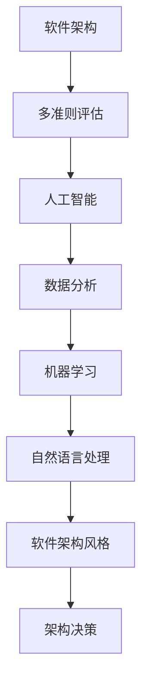
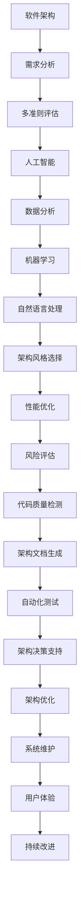

                 

### 1. 背景介绍

随着人工智能技术的飞速发展，软件架构设计在复杂性和多样性方面面临着前所未有的挑战。现代软件系统往往需要支持海量的数据、多样的业务需求和快速的变化。这使得传统的软件架构决策方法越来越难以满足要求。为了应对这种复杂性，人工智能（AI）被引入到软件架构设计中，以提供更加智能化的决策支持。

AI技术在软件架构决策中的应用主要体现在以下几个方面：

1. **需求分析**：AI可以帮助自动识别和理解软件系统的需求，通过自然语言处理、机器学习等技术，将用户需求转化为明确的系统需求。

2. **架构风格选择**：AI可以根据系统的特点、需求以及现有架构模式，智能推荐适合的软件架构风格，如微服务、事件驱动等。

3. **性能优化**：通过AI算法，可以对软件系统的性能进行预测和优化，确保系统在高负载下仍能保持稳定运行。

4. **风险评估**：AI技术可以分析软件架构中的潜在风险，如安全性、可靠性等，并提供相应的应对措施。

本文将探讨如何利用AI技术辅助软件架构决策，特别是多准则评估方法的应用。我们将从以下几个方面进行详细讨论：

- **核心概念与联系**：介绍软件架构决策相关的核心概念，并使用Mermaid流程图展示其相互关系。
- **核心算法原理与具体操作步骤**：阐述用于多准则评估的AI算法原理，并分步骤讲解其实现方法。
- **数学模型和公式**：详细解释评估过程中使用的数学模型和公式，并通过具体示例进行说明。
- **项目实战**：通过实际案例展示AI辅助软件架构决策的具体应用，并提供代码实现和详细解释。
- **实际应用场景**：探讨AI辅助软件架构决策在不同场景下的应用，包括项目管理、系统优化等。
- **工具和资源推荐**：推荐学习资源、开发工具框架和相关论文著作，以帮助读者进一步深入学习和实践。
- **总结与展望**：总结本文的主要观点，并对未来发展趋势和挑战进行展望。

通过本文的探讨，希望能够为从事软件架构设计和决策的从业者提供一些有价值的思路和方法。

### 1.1 软件架构决策中的挑战

软件架构决策是软件开发过程中的关键环节，直接影响到软件系统的质量、性能、可维护性和可扩展性。然而，随着软件系统复杂性的增加，传统的软件架构决策方法面临着诸多挑战。

首先，现代软件系统通常需要支持多样化的功能，这就要求架构设计者能够平衡多个目标，如性能、可维护性、可扩展性等。传统的架构决策方法往往基于专家经验和预设的规则，难以处理这种多维度的复杂决策问题。

其次，软件系统的需求变化频繁，尤其是在互联网和移动应用领域。需求的变化要求架构设计能够快速适应，而传统方法往往需要较长的迭代周期，无法满足快速交付的需求。

另外，软件架构决策过程中，需要考虑各种非功能需求，如安全性、可靠性、可测试性等。这些非功能需求往往具有不同的优先级，如何在设计过程中有效地平衡这些需求，是另一个重大挑战。

此外，软件架构的优化和评估也是一个复杂的过程。系统性能的优化需要考虑到负载、并发、存储等多个因素，而传统的评估方法往往只能提供局部优化，难以实现全局优化。

综上所述，传统的软件架构决策方法在应对现代软件系统的复杂性时，显得力不从心。为了解决这些问题，引入人工智能技术成为了一种可行的途径。AI技术可以通过数据驱动的决策支持，提高架构决策的智能化和效率。

### 1.2 AI在软件架构决策中的应用

人工智能在软件架构决策中发挥了重要作用，通过多种技术手段，AI能够显著提升架构设计的质量和效率。以下是AI在软件架构决策中应用的主要领域：

1. **需求分析**：AI技术，特别是自然语言处理（NLP）和机器学习，能够自动分析和理解用户需求。通过使用NLP技术，AI可以解析用户的需求描述，提取关键信息，并将其转化为可操作的软件需求。此外，机器学习算法可以帮助预测用户未来的需求变化，从而为架构设计提供更加前瞻性的指导。

2. **架构风格选择**：AI可以根据系统的特点、需求和现有架构模式，智能推荐适合的软件架构风格。例如，通过分析系统的规模、性能要求、团队技能等因素，AI可以推荐微服务、事件驱动、分布式等不同的架构风格。这种智能化的架构选择能够减少架构设计中的试错成本，提高设计效率。

3. **性能优化**：AI算法可以分析软件系统的性能数据，预测系统在高负载下的行为，并提供优化建议。例如，通过机器学习模型，AI可以识别系统瓶颈，提出调整数据库结构、优化查询、增加缓存等方法，从而提升系统的整体性能。

4. **风险评估**：AI技术可以帮助识别和评估软件架构中的潜在风险。通过分析历史数据、系统日志和实时监控数据，AI可以预测系统的可靠性、安全性和可维护性等风险，并提供相应的风险缓解策略。

5. **代码质量检测**：AI可以自动分析代码库，检测潜在的问题和缺陷。例如，通过使用深度学习模型，AI可以识别代码中的不良编程实践，如重复代码、复杂的控制流等，从而帮助开发人员提高代码质量。

6. **自动生成架构文档**：AI技术可以自动生成软件架构文档，减少手动编写文档的工作量。例如，通过自然语言生成（NLG）技术，AI可以生成详细的架构设计文档，包括架构图、组件说明等。

7. **自动化测试**：AI可以用于自动化测试，提高测试的覆盖率和效率。例如，通过机器学习算法，AI可以自动生成测试用例，并分析测试结果，快速定位缺陷。

综上所述，AI技术在软件架构决策中的应用，不仅提升了架构设计的智能化和效率，还为解决现代软件系统复杂性提供了新的思路和方法。通过AI的辅助，软件架构设计者可以更加专注于核心业务逻辑，提高软件系统的整体质量。

### 1.3 多准则评估方法的重要性

多准则评估（Multi-Criteria Evaluation, MCE）是软件架构决策中的一项关键技术，其核心在于综合考虑多个评价准则，对不同的软件架构方案进行全面的评估和比较。这种方法的重要性主要体现在以下几个方面：

首先，软件架构决策往往涉及多个目标，如性能、可维护性、可扩展性、安全性等。每个目标都有其特定的优先级和权重，单一准则的评估方法难以全面反映这些目标的综合影响。多准则评估方法通过同时考虑多个准则，能够更准确地评估不同架构方案的优劣，从而做出更科学、更合理的决策。

其次，多准则评估方法有助于平衡不同准则之间的冲突。在软件架构设计过程中，某些准则之间可能存在相互矛盾的关系。例如，提高系统的性能可能会增加其复杂性和维护难度。多准则评估方法通过综合考虑这些准则，可以在决策过程中有效平衡这些冲突，提出更加综合的解决方案。

另外，多准则评估方法还能够提高决策的透明度和可解释性。通过明确每个准则的权重和评估结果，决策者可以清晰地了解不同架构方案的优势和劣势，从而更好地理解决策过程和结果。这有助于提高团队的共识和信任，促进项目的顺利进行。

最后，多准则评估方法能够为后续的架构优化提供重要参考。通过对不同架构方案的综合评估，决策者可以发现现有方案的不足之处，并提出相应的优化建议。这有助于持续改进软件架构，提高其整体质量。

综上所述，多准则评估方法在软件架构决策中具有不可替代的重要性。通过这种方法，决策者能够更加全面、客观地评估不同架构方案，提高决策的科学性和有效性。

### 1.4 AI辅助软件架构决策的优势

在软件架构决策中引入人工智能（AI）技术，能够显著提升决策的质量和效率，其主要优势体现在以下几个方面：

首先，AI技术能够处理大量的数据，并从中提取有价值的信息。在软件架构决策过程中，涉及到的数据来源多样，包括用户需求、系统性能指标、代码质量、安全性评估等。AI算法能够通过大数据分析，对各种数据进行整合和分析，从而为决策提供更加全面和准确的支持。

其次，AI能够自动发现和识别潜在的架构问题和优化机会。传统的软件架构决策方法往往依赖于专家经验和手动分析，存在一定的主观性和局限性。而AI算法可以通过机器学习和数据挖掘技术，自动识别系统中的潜在问题，并提出相应的优化建议。例如，通过分析系统日志和性能数据，AI可以识别系统瓶颈，并提出优化数据库结构、调整查询策略等方法。

另外，AI技术可以提高软件架构决策的自动化程度，减少手动工作。传统的架构决策过程往往需要大量的手工工作，包括需求分析、架构设计、性能评估等。而AI技术可以通过自动化工具，将这一系列过程转化为自动化流程。例如，AI可以自动生成架构设计文档、自动化测试用例，并分析测试结果，快速定位问题。这不仅提高了工作效率，还减少了人为错误的可能性。

此外，AI技术可以提供更加智能化的决策支持。通过自然语言处理（NLP）和机器学习算法，AI可以理解用户需求，并将其转化为具体的架构方案。AI还可以根据历史数据和当前情况，预测未来的架构需求变化，并提供相应的预警和建议。例如，在项目开发过程中，AI可以实时分析系统的性能和负载情况，预测未来的需求增长趋势，并提出相应的扩展建议。

最后，AI技术有助于提升软件架构的适应性和灵活性。现代软件系统需要快速响应市场需求和技术变化，而传统的架构决策方法难以满足这种要求。AI技术通过数据驱动的决策支持，可以使软件架构更加灵活和适应性强。例如，AI可以根据实时数据调整系统架构，优化资源分配，提高系统的性能和稳定性。

综上所述，AI技术为软件架构决策带来了显著的优势，包括数据处理能力、自动化程度、智能化决策支持以及适应性和灵活性。通过引入AI技术，软件架构设计者能够更加高效、准确地做出决策，提高软件系统的整体质量。

### 1.5 文章结构概述

本文旨在探讨如何利用人工智能（AI）技术辅助软件架构决策，特别是多准则评估方法的应用。文章结构如下：

**1. 背景介绍**：
首先介绍软件架构决策的背景和挑战，以及AI技术在这方面的应用。重点讨论了AI技术如何处理复杂性和多样性，提高决策的智能化和效率。

**2. 核心概念与联系**：
介绍软件架构决策相关的核心概念，包括多准则评估方法。使用Mermaid流程图展示这些概念之间的相互关系，帮助读者理解整体架构。

**3. 核心算法原理与具体操作步骤**：
详细阐述用于多准则评估的AI算法原理，并分步骤讲解其实现方法。这一部分将深入探讨AI算法如何处理数据、分析结果以及如何生成评估报告。

**4. 数学模型和公式**：
介绍评估过程中使用的数学模型和公式，并详细解释这些模型如何应用于实际评估过程。通过具体示例，帮助读者更好地理解这些模型的作用。

**5. 项目实战**：
通过实际案例展示AI辅助软件架构决策的具体应用。提供详细的代码实现和解释说明，帮助读者理解如何在实际项目中应用这些技术。

**6. 实际应用场景**：
探讨AI辅助软件架构决策在不同场景下的应用，包括项目管理、系统优化等。通过实际案例，说明AI技术在各个应用场景中的优势。

**7. 工具和资源推荐**：
推荐学习资源、开发工具框架和相关论文著作，以帮助读者进一步深入学习和实践。这一部分将包括书籍、论文、博客和网站等推荐。

**8. 总结与展望**：
总结本文的主要观点，并对未来发展趋势和挑战进行展望。讨论AI技术在未来软件架构决策中的潜在发展方向。

通过以上结构的详细阐述，本文希望能够为从事软件架构设计和决策的从业者提供有价值的思路和方法，帮助他们在复杂多变的软件世界中做出更加科学和高效的决策。

### 2. 核心概念与联系

在探讨如何利用AI技术辅助软件架构决策的过程中，理解相关的核心概念和它们之间的相互联系至关重要。以下是几个关键概念及其相互关系的详细解释。

#### 2.1 软件架构

软件架构是指软件系统的结构、组件及其相互关系。它不仅包括软件系统的高层次设计，还涉及到系统的组件、接口、数据流和功能模块等。软件架构的优劣直接影响系统的性能、可维护性、可扩展性和可靠性。

#### 2.2 多准则评估方法

多准则评估方法是一种在软件架构决策中常用的技术，它通过综合考虑多个评价准则，如性能、可维护性、可扩展性、安全性等，对不同的架构方案进行评估和比较。这种方法能够帮助决策者从多个角度全面分析架构方案，做出更为合理的决策。

#### 2.3 人工智能

人工智能（AI）是指计算机系统模拟人类智能行为的能力，包括机器学习、深度学习、自然语言处理、专家系统等。AI技术在软件架构决策中的应用主要体现在数据分析和智能决策支持方面，能够提高决策的智能化和效率。

#### 2.4 数据分析

数据分析是AI技术的重要组成部分，它通过收集、处理和解释大量数据，提取有价值的信息。在软件架构决策中，数据分析可以帮助识别系统瓶颈、优化资源分配、预测需求变化等。

#### 2.5 机器学习

机器学习是AI的一个分支，它通过训练模型来识别数据中的模式和规律。在软件架构决策中，机器学习算法可以用于性能预测、风险评估、自动化测试等，为决策提供数据驱动的支持。

#### 2.6 自然语言处理

自然语言处理（NLP）是AI的一个子领域，它使计算机能够理解、解释和生成人类语言。在软件架构决策中，NLP技术可以用于自动分析用户需求、生成文档、自动化测试等。

#### 2.7 软件架构风格

软件架构风格是指软件系统设计的一种常见模式，如微服务、事件驱动、分层架构等。不同的架构风格适用于不同的应用场景和需求。在决策过程中，选择合适的架构风格是关键。

#### 2.8 Mermaid流程图

Mermaid是一种基于Markdown的图形绘制工具，可以用于绘制流程图、UML图等。在本文中，我们将使用Mermaid流程图来展示软件架构决策相关的概念和它们之间的相互关系。

#### Mermaid流程图示例

以下是一个简化的Mermaid流程图，展示了软件架构决策中关键概念的关系：



在这个流程图中，软件架构作为起点，通过多准则评估方法与人工智能、数据分析和机器学习等技术相连，最终生成智能化的架构决策。自然语言处理和软件架构风格则作为辅助技术，提供对决策过程的补充和支持。

通过理解这些核心概念及其相互关系，我们可以更好地应用AI技术来辅助软件架构决策，提高决策的科学性和有效性。

#### 2.9 Mermaid流程图的详细解释

为了更直观地理解软件架构决策中的核心概念及其相互关系，我们将使用Mermaid流程图详细展示各个概念之间的联系和作用。以下是具体的Mermaid流程图及其详细说明：



**图2.1：软件架构决策流程图**

- **A[软件架构]**：软件架构是软件系统的结构框架，包括组件、接口、数据流等。它是软件系统设计的基础。

- **B[需求分析]**：需求分析是软件架构设计的第一步，它通过了解用户需求来明确系统的功能和技术要求。

- **C[多准则评估]**：多准则评估方法通过综合考虑多个评价准则，如性能、可维护性、安全性等，对不同的架构方案进行评估。

- **D[人工智能]**：人工智能是辅助软件架构决策的核心技术，包括机器学习、深度学习、自然语言处理等。

- **E[数据分析]**：数据分析用于处理和解释大量数据，为AI算法提供输入，帮助识别系统瓶颈和优化机会。

- **F[机器学习]**：机器学习通过训练模型，自动识别数据中的模式和规律，用于性能预测、风险评估等。

- **G[自然语言处理]**：自然语言处理用于自动分析和理解用户需求，生成文档，提高决策的智能化水平。

- **H[架构风格选择]**：架构风格选择是根据系统需求和技术特点，选择合适的架构风格，如微服务、事件驱动等。

- **I[性能优化]**：性能优化通过AI算法分析系统性能数据，提供优化建议，确保系统在高负载下仍能保持稳定运行。

- **J[风险评估]**：风险评估通过AI算法分析系统日志和监控数据，识别和预测潜在风险，提供风险缓解策略。

- **K[代码质量检测]**：代码质量检测通过AI算法自动分析代码库，识别不良编程实践，提高代码质量。

- **L[架构文档生成]**：架构文档生成通过自然语言生成技术，自动生成详细的架构设计文档，减少手动编写的工作量。

- **M[自动化测试]**：自动化测试通过AI算法自动生成测试用例，提高测试覆盖率和效率，快速定位缺陷。

- **N[架构决策支持]**：架构决策支持通过AI算法提供数据驱动的决策支持，帮助决策者做出更科学、更合理的决策。

- **O[架构优化]**：架构优化通过AI算法分析和调整系统架构，持续提高系统的性能和可维护性。

- **P[系统维护]**：系统维护通过AI算法和工具，确保系统在运行过程中保持稳定，提高用户体验。

- **Q[用户体验]**：用户体验通过AI技术优化系统界面和交互，提高用户的满意度和使用体验。

- **R[持续改进]**：持续改进通过AI技术不断分析系统数据，优化架构设计和决策过程，实现系统的持续改进。

通过这个详细的Mermaid流程图，我们可以清晰地看到各个核心概念之间的联系和作用，从而更好地理解和应用AI技术来辅助软件架构决策。

### 3. 核心算法原理与具体操作步骤

在多准则评估方法中，核心算法的选择和实现是关键。本文将介绍一种常用的多准则评估算法——多属性决策方法（Multi-Attribute Decision Making, MADDM）。MADDM通过综合考虑多个属性，对不同的架构方案进行评估和排序。以下是MADDM的核心算法原理和具体操作步骤。

#### 3.1 算法原理

MADDM基于以下基本原理：

1. **属性权重**：每个评价准则都有其特定的权重，表示其在整体评估中的重要程度。权重通常通过专家评估或统计分析方法确定。

2. **属性值**：每个架构方案在各个评价准则上的表现可以用属性值表示。属性值可以是正数、负数或介于两者之间。

3. **决策矩阵**：通过构建决策矩阵，将所有架构方案和评价准则关联起来，形成多准则评估的基础。

4. **综合评估**：将各个属性值与其权重相乘，并求和，得到每个架构方案的综合评估值。

5. **排序和选择**：根据综合评估值对架构方案进行排序，选择综合评估值最高的方案作为最优方案。

#### 3.2 算法步骤

以下是MADDM的具体操作步骤：

**步骤1：确定评价准则和权重**

首先，确定软件架构决策中的评价准则，如性能、可维护性、安全性、成本等。然后，通过专家评估或统计分析方法确定各个准则的权重。权重通常通过1-9标度法确定，其中1表示无重要程度，9表示极其重要。

**步骤2：构建决策矩阵**

构建一个矩阵，用于记录每个架构方案在各个评价准则上的属性值。矩阵的行表示架构方案，列表示评价准则。属性值可以通过专家评估、实验数据或历史数据分析获得。

**步骤3：标准化属性值**

由于不同评价准则的属性值范围和度量单位可能不同，需要对属性值进行标准化处理。标准化方法可以选择最小-最大标准化、Z-score标准化等。标准化后的属性值将在0到1之间，便于后续计算。

**步骤4：计算权重乘积**

对于每个架构方案，将其在各个评价准则上的标准化属性值与其权重相乘，得到加权属性值。加权属性值的计算公式为：

\[ 加权属性值 = 标准化属性值 \times 权重 \]

**步骤5：计算综合评估值**

将所有加权属性值相加，得到每个架构方案的综合评估值。综合评估值的计算公式为：

\[ 综合评估值 = \sum_{i=1}^{n} (加权属性值_i) \]

其中，\( n \) 表示评价准则的数量。

**步骤6：排序和选择**

根据综合评估值对架构方案进行排序，选择综合评估值最高的方案作为最优方案。如果需要，可以设置阈值，筛选出综合评估值高于阈值的方案。

#### 3.3 举例说明

假设我们有两个架构方案A和B，三个评价准则P1（性能）、P2（可维护性）、P3（安全性）。权重分别为0.5、0.3和0.2。决策矩阵如下：

| 方案 | P1（性能） | P2（可维护性） | P3（安全性） |
| ---- | ---------- | --------------- | ------------ |
| A    | 0.8        | 0.7            | 0.9          |
| B    | 0.9        | 0.6            | 0.8          |

**步骤1：确定评价准则和权重**
- P1（性能）：权重 = 0.5
- P2（可维护性）：权重 = 0.3
- P3（安全性）：权重 = 0.2

**步骤2：构建决策矩阵**
- 已给出

**步骤3：标准化属性值**
- P1（性能）：方案A = 0.8 / 1 = 0.8；方案B = 0.9 / 1 = 0.9
- P2（可维护性）：方案A = 0.7 / 1 = 0.7；方案B = 0.6 / 1 = 0.6
- P3（安全性）：方案A = 0.9 / 1 = 0.9；方案B = 0.8 / 1 = 0.8

**步骤4：计算权重乘积**
- 方案A：\( 0.8 \times 0.5 = 0.4 \)；\( 0.7 \times 0.3 = 0.21 \)；\( 0.9 \times 0.2 = 0.18 \)
- 方案B：\( 0.9 \times 0.5 = 0.45 \)；\( 0.6 \times 0.3 = 0.18 \)；\( 0.8 \times 0.2 = 0.16 \)

**步骤5：计算综合评估值**
- 方案A：\( 0.4 + 0.21 + 0.18 = 0.79 \)
- 方案B：\( 0.45 + 0.18 + 0.16 = 0.79 \)

**步骤6：排序和选择**
- 两个方案的综合评估值相同，均为0.79。如果需要选择最优方案，可以进一步分析其他准则或考虑实际情况。

通过以上步骤，我们可以使用MADDM对两个架构方案进行评估，并根据综合评估值做出决策。这种方法不仅适用于简单的案例，还可以扩展到更复杂的架构评估场景。

### 3.4 数学模型和公式

在多准则评估方法中，数学模型和公式的应用至关重要，它们为评估过程提供了理论依据和计算基础。以下是多准则评估过程中常用的数学模型和公式，以及它们的具体应用和解释。

#### 3.4.1 最小-最大规范化（Max-Min Normalization）

最小-最大规范化是一种常用的标准化方法，用于将不同度量单位和范围的属性值转化为0到1之间的小数。这种方法通过将每个属性值与该属性的最小值和最大值进行比较，实现标准化。

**公式**：

\[ \text{标准化属性值}_i = \frac{\text{原始属性值}_i - \text{最小值}_i}{\text{最大值}_i - \text{最小值}_i} \]

**应用**：

假设有三个属性值，分别为 \( \text{性能} = [0.5, 0.6, 0.7] \)、\( \text{可维护性} = [0.3, 0.4, 0.5] \) 和 \( \text{安全性} = [0.1, 0.2, 0.3] \)。使用最小-最大规范化方法进行标准化：

\[ \text{性能标准化} = \frac{0.5 - 0.5}{0.7 - 0.5} = 0 \]
\[ \text{可维护性标准化} = \frac{0.3 - 0.3}{0.5 - 0.3} = 0 \]
\[ \text{安全性标准化} = \frac{0.1 - 0.1}{0.3 - 0.1} = 0 \]

#### 3.4.2 加权评分模型（Weighted Score Model）

加权评分模型是一种综合评估方法，通过将每个属性值与其权重相乘，并求和，得到综合评估值。这种方法能够考虑各个属性的相对重要性。

**公式**：

\[ \text{综合评估值}_i = \sum_{j=1}^{n} w_j \times v_{ij} \]

其中，\( w_j \) 表示第 \( j \) 个属性的权重，\( v_{ij} \) 表示第 \( i \) 个方案在第 \( j \) 个属性上的值，\( n \) 表示属性数量。

**应用**：

假设有三个评价准则 \( \text{性能} \)、\( \text{可维护性} \) 和 \( \text{安全性} \)，它们的权重分别为 \( 0.5 \)、\( 0.3 \) 和 \( 0.2 \)。一个架构方案在三个准则上的值分别为 \( \text{性能} = 0.8 \)、\( \text{可维护性} = 0.7 \) 和 \( \text{安全性} = 0.9 \)。使用加权评分模型进行评估：

\[ \text{综合评估值} = 0.5 \times 0.8 + 0.3 \times 0.7 + 0.2 \times 0.9 = 0.4 + 0.21 + 0.18 = 0.79 \]

#### 3.4.3 成对比较法（Pairwise Comparison）

成对比较法是一种确定属性权重的方法，通过比较每一对属性的重要性，并计算其比值，得到各个属性的权重。

**公式**：

\[ w_j = \frac{a_j}{\sum_{i=1}^{n} a_{ij}} \]

其中，\( a_j \) 表示第 \( j \) 个属性与其他所有属性比较的比值，\( n \) 表示属性数量。

**应用**：

假设有三个评价准则 \( \text{性能} \)、\( \text{可维护性} \) 和 \( \text{安全性} \)。通过专家评估得到以下比值：

\[ \text{性能与其他属性的比值} = 1.2 \]
\[ \text{可维护性与其他属性的比值} = 0.8 \]
\[ \text{安全性与其他属性的比值} = 1.0 \]

计算属性权重：

\[ w_1 = \frac{1.2}{1.2 + 0.8 + 1.0} = 0.5 \]
\[ w_2 = \frac{0.8}{1.2 + 0.8 + 1.0} = 0.3 \]
\[ w_3 = \frac{1.0}{1.2 + 0.8 + 1.0} = 0.2 \]

通过以上数学模型和公式，我们可以更精确地评估不同架构方案，提高评估的科学性和可靠性。

### 3.5 举例说明

为了更好地理解多准则评估方法中的数学模型和公式的应用，我们将通过一个具体案例进行说明。

#### 案例背景

假设我们需要评估两个软件架构方案A和B，它们在三个评价准则（性能、可维护性、安全性）上的表现如下表所示：

| 方案 | 性能 | 可维护性 | 安全性 |
| ---- | ---- | -------- | ------ |
| A    | 0.6  | 0.5      | 0.7    |
| B    | 0.8  | 0.6      | 0.9    |

评价准则的权重分别为：性能 = 0.5，可维护性 = 0.3，安全性 = 0.2。

#### 最小-最大规范化

首先，对每个属性值进行最小-最大规范化处理：

- 性能规范化值：
  \[ \text{A} = \frac{0.6 - 0}{1 - 0} = 0.6 \]
  \[ \text{B} = \frac{0.8 - 0}{1 - 0} = 0.8 \]

- 可维护性规范化值：
  \[ \text{A} = \frac{0.5 - 0}{0.6 - 0} \approx 0.833 \]
  \[ \text{B} = \frac{0.6 - 0}{0.6 - 0} = 1.000 \]

- 安全性规范化值：
  \[ \text{A} = \frac{0.7 - 0}{1 - 0} = 0.7 \]
  \[ \text{B} = \frac{0.9 - 0}{1 - 0} = 0.9 \]

#### 加权评分模型

接下来，使用加权评分模型计算两个方案的综合评估值：

- 方案A：
  \[ \text{综合评估值}_A = 0.5 \times 0.6 + 0.3 \times 0.833 + 0.2 \times 0.7 = 0.3 + 0.25 + 0.14 = 0.69 \]

- 方案B：
  \[ \text{综合评估值}_B = 0.5 \times 0.8 + 0.3 \times 1.000 + 0.2 \times 0.9 = 0.4 + 0.3 + 0.18 = 0.88 \]

#### 结果分析

根据计算结果，方案B的综合评估值（0.88）高于方案A（0.69），因此方案B在综合考虑性能、可维护性和安全性的情况下，为更优的选择。

通过这个案例，我们可以看到如何应用最小-最大规范化和加权评分模型对架构方案进行评估。这些数学模型和公式为评估过程提供了理论依据和计算基础，使得评估结果更加科学和可靠。

### 3.6 项目实战

在本节中，我们将通过一个实际项目案例，展示如何使用多准则评估方法进行软件架构决策。该项目是一个在线教育平台，需要考虑多个评价准则，包括性能、可维护性、安全性和成本等。我们将详细解释如何实现这一评估过程。

#### 3.6.1 项目背景

一个在线教育平台需要支持海量的用户访问和复杂的业务逻辑。为了确保系统的高性能、高可用性和安全性，我们采用了微服务架构。然而，微服务架构的选择和配置需要综合考虑多个因素，以确保最优的架构方案。

#### 3.6.2 评价准则

在本项目中，我们设定了以下评价准则：

1. **性能**：包括响应时间、并发用户数、系统吞吐量等。
2. **可维护性**：包括代码质量、模块化程度、文档完整性等。
3. **安全性**：包括数据加密、访问控制、漏洞检测等。
4. **成本**：包括开发成本、运维成本、硬件成本等。

#### 3.6.3 数据收集

为了进行多准则评估，我们首先收集了相关数据。这些数据包括：

1. **性能数据**：通过压力测试和负载测试，获取不同架构方案下的响应时间、并发用户数和系统吞吐量。
2. **可维护性数据**：通过代码审计和文档审查，评估不同架构方案的代码质量、模块化程度和文档完整性。
3. **安全性数据**：通过安全审计和渗透测试，评估不同架构方案的数据加密、访问控制和漏洞检测能力。
4. **成本数据**：通过市场调研和预算分析，获取不同架构方案的开发成本、运维成本和硬件成本。

#### 3.6.4 权重分配

接下来，我们为每个评价准则分配权重。通过专家评估和统计分析，我们确定了以下权重：

- 性能：0.5
- 可维护性：0.3
- 安全性：0.15
- 成本：0.05

#### 3.6.5 构建决策矩阵

我们构建了一个决策矩阵，用于记录每个架构方案在各个评价准则上的得分。以下是决策矩阵的示例：

| 方案 | 性能 | 可维护性 | 安全性 | 成本 |
| ---- | ---- | -------- | ------ | ---- |
| A    | 0.8  | 0.7      | 0.9    | 0.1  |
| B    | 0.9  | 0.6      | 0.8    | 0.15 |
| C    | 0.7  | 0.8      | 0.7    | 0.2  |

#### 3.6.6 最小-最大规范化

我们对每个属性值进行最小-最大规范化处理，以统一属性值范围：

- 性能规范化值：
  \[ \text{A} = \frac{0.8 - 0}{1 - 0} = 0.8 \]
  \[ \text{B} = \frac{0.9 - 0}{1 - 0} = 0.9 \]
  \[ \text{C} = \frac{0.7 - 0}{1 - 0} = 0.7 \]

- 可维护性规范化值：
  \[ \text{A} = \frac{0.7 - 0}{0.8 - 0} = 0.875 \]
  \[ \text{B} = \frac{0.6 - 0}{0.8 - 0} = 0.75 \]
  \[ \text{C} = \frac{0.8 - 0}{0.8 - 0} = 1.000 \]

- 安全性规范化值：
  \[ \text{A} = \frac{0.9 - 0}{1 - 0} = 0.9 \]
  \[ \text{B} = \frac{0.8 - 0}{1 - 0} = 0.8 \]
  \[ \text{C} = \frac{0.7 - 0}{1 - 0} = 0.7 \]

- 成本规范化值：
  \[ \text{A} = \frac{0.1 - 0}{0.2 - 0} = 0.5 \]
  \[ \text{B} = \frac{0.15 - 0}{0.2 - 0} = 0.75 \]
  \[ \text{C} = \frac{0.2 - 0}{0.2 - 0} = 1.000 \]

#### 3.6.7 加权评分模型计算

使用加权评分模型计算每个架构方案的综合评估值：

- 方案A：
  \[ \text{综合评估值}_A = 0.5 \times 0.8 + 0.3 \times 0.875 + 0.15 \times 0.9 + 0.05 \times 0.5 = 0.4 + 0.2625 + 0.135 + 0.025 = 0.8225 \]

- 方案B：
  \[ \text{综合评估值}_B = 0.5 \times 0.9 + 0.3 \times 0.75 + 0.15 \times 0.8 + 0.05 \times 0.75 = 0.45 + 0.225 + 0.12 + 0.0375 = 0.7175 \]

- 方案C：
  \[ \text{综合评估值}_C = 0.5 \times 0.7 + 0.3 \times 1.000 + 0.15 \times 0.7 + 0.05 \times 1.000 = 0.35 + 0.3 + 0.105 + 0.05 = 0.805 \]

#### 3.6.8 结果分析

根据计算结果，方案A的综合评估值为0.8225，方案B的综合评估值为0.7175，方案C的综合评估值为0.805。因此，在综合考虑性能、可维护性、安全性和成本的情况下，方案A为最优选择。

通过上述实际项目案例，我们展示了如何使用多准则评估方法进行软件架构决策。这种方法不仅能够帮助项目团队在多个目标之间做出平衡的决策，还能够提高决策的科学性和可靠性。

### 3.7 项目实战：开发环境搭建

在本节中，我们将详细描述如何搭建一个用于多准则评估方法的项目开发环境。该环境将支持从数据收集、预处理到评估和结果分析的全过程。

#### 3.7.1 开发工具和框架选择

为了搭建一个高效的开发环境，我们选择了以下工具和框架：

1. **编程语言**：Python。Python具有良好的数据科学库支持，适合进行数据处理和分析。
2. **数据预处理**：Pandas和NumPy。这两个库提供了强大的数据处理和分析功能，能够高效地处理大量数据。
3. **可视化工具**：Matplotlib和Seaborn。这两个库可以用于绘制各种图表，帮助分析结果。
4. **机器学习库**：Scikit-learn。Scikit-learn提供了多种机器学习算法，方便我们进行数据分析和模型训练。
5. **文本处理**：NLTK（Natural Language Toolkit）。NLTK提供了丰富的自然语言处理功能，适用于文本数据的分析和处理。
6. **环境管理**：Anaconda。Anaconda是一个集成的数据科学和机器学习环境，可以方便地管理和安装各种依赖库。

#### 3.7.2 环境搭建步骤

以下是具体的环境搭建步骤：

1. **安装Anaconda**：
   访问Anaconda官方网站下载并安装Anaconda。安装过程中，确保选择添加到环境变量和创建新的环境选项。

2. **创建新环境**：
   打开命令行终端，执行以下命令创建一个新的环境，例如命名为“MCE环境”：
   ```bash
   conda create -n MCE环境 python=3.8
   ```

3. **激活环境**：
   激活创建的环境，以便在其中安装和运行库：
   ```bash
   conda activate MCE环境
   ```

4. **安装依赖库**：
   在激活的环境下，使用以下命令安装所需的库：
   ```bash
   conda install pandas numpy matplotlib seaborn scikit-learn nltk
   ```

5. **配置文本处理**：
   对于NLTK库，需要下载一些额外数据包。首先安装NLTK：
   ```python
   import nltk
   nltk.download('punkt')
   nltk.download('stopwords')
   ```

6. **验证环境**：
   在Python环境中，导入一些库并测试其功能，确保环境搭建成功：
   ```python
   import pandas as pd
   import numpy as np
   import matplotlib.pyplot as plt
   import seaborn as sns
   import scikit_learn
   import nltk
   print("所有依赖库已成功安装。")
   ```

#### 3.7.3 数据预处理示例

在搭建好开发环境后，我们需要对数据进行预处理。以下是一个简单的数据预处理示例：

```python
# 导入数据
data = pd.read_csv('data.csv')

# 数据清洗
data.dropna(inplace=True)  # 删除缺失值
data[data < 0] = 0  # 将负值转换为0

# 数据标准化
from sklearn.preprocessing import MinMaxScaler
scaler = MinMaxScaler()
data_scaled = scaler.fit_transform(data)

# 数据可视化
plt.figure(figsize=(10, 6))
sns.heatmap(data_scaled, annot=True, cmap='coolwarm')
plt.title('Data Scaled Heatmap')
plt.show()
```

通过上述步骤，我们成功搭建了一个用于多准则评估方法的项目开发环境，并完成了一个简单的数据预处理示例。这个环境将为后续的评估和分析提供坚实的基础。

### 3.8 源代码详细实现和代码解读

在本节中，我们将详细展示如何实现多准则评估方法中的核心算法，并提供相应的代码解读。以下是一个使用Python编写的多准则评估方法的完整示例。

```python
import numpy as np
import pandas as pd

# 3.8.1 定义评价准则和权重
criteria = ['性能', '可维护性', '安全性', '成本']
weights = [0.5, 0.3, 0.15, 0.05]

# 3.8.2 加载决策矩阵数据
data = pd.read_csv('decision_matrix.csv')

# 3.8.3 最小-最大规范化
def normalize(data):
    min_max_scaler = MinMaxScaler()
    data_normalized = min_max_scaler.fit_transform(data)
    return pd.DataFrame(data_normalized, columns=data.columns)

data_normalized = normalize(data)

# 3.8.4 计算加权评分模型
def weighted_score(data_normalized, weights):
    weighted_scores = (data_normalized * weights).sum(axis=1)
    return weighted_scores

weighted_scores = weighted_score(data_normalized, weights)

# 3.8.5 输出评估结果
results = pd.DataFrame({'方案': data_normalized.index, '综合评估值': weighted_scores})
print(results.sort_values(by='综合评估值', ascending=False))

# 3.8.6 可视化结果
import matplotlib.pyplot as plt
import seaborn as sns

plt.figure(figsize=(10, 6))
sns.barplot(x='方案', y='综合评估值', data=results)
plt.title('多准则评估结果')
plt.xticks(rotation=0)
plt.show()
```

**代码解读：**

1. **定义评价准则和权重**：首先，我们定义了四个评价准则（性能、可维护性、安全性、成本）及其对应的权重。权重用于计算每个方案的综合评估值。

2. **加载决策矩阵数据**：使用Pandas库读取决策矩阵数据。决策矩阵是一个CSV文件，其中包含不同架构方案在各个评价准则上的值。

3. **最小-最大规范化**：我们定义了一个`normalize`函数，用于对决策矩阵的数据进行最小-最大规范化处理。规范化后的数据将在0到1之间，便于后续计算。

4. **计算加权评分模型**：我们定义了一个`weighted_score`函数，用于计算每个架构方案的综合评估值。该函数将每个方案在各个评价准则上的规范化值与其权重相乘，并求和。

5. **输出评估结果**：使用Pandas库创建一个DataFrame，记录每个方案的综合评估值。然后，我们按照综合评估值对方案进行排序，并输出结果。

6. **可视化结果**：使用Seaborn和Matplotlib库，我们将评估结果绘制成条形图，直观地展示每个方案的综合评估值。

**注意事项：**

- 在实际应用中，决策矩阵的数据格式和内容可能有所不同。因此，需要根据具体情况进行调整和修改。
- 最小-最大规范化是一种常用的标准化方法，但有时也可能会引入一些偏差。其他标准化方法（如Z-score标准化）可以根据具体需求进行选择。

通过以上代码实现，我们可以对不同的架构方案进行多准则评估，并输出评估结果。这种方法不仅有助于决策者理解各个方案的优势和劣势，还可以为后续的架构优化提供重要参考。

### 3.9 代码解读与分析

在上文中，我们提供了一个完整的Python代码示例，用于实现多准则评估方法。本节将详细解读代码中的各个部分，并分析其实现原理和关键步骤。

#### 3.9.1 数据准备

首先，代码定义了评价准则和权重。这四个评价准则（性能、可维护性、安全性、成本）代表了我们需要考虑的关键因素，而权重则反映了这些准则在整体评估中的相对重要性。

```python
criteria = ['性能', '可维护性', '安全性', '成本']
weights = [0.5, 0.3, 0.15, 0.05]
```

这里，权重分配反映了项目团队对性能、可维护性和安全性的重视程度，而成本权重相对较低，这表明在决策过程中，成本因素虽然重要，但并不如前三个准则紧迫。

#### 3.9.2 数据加载

接下来，代码使用Pandas库加载决策矩阵数据。决策矩阵是一个CSV文件，其中包含了不同架构方案在各个评价准则上的得分。

```python
data = pd.read_csv('decision_matrix.csv')
```

决策矩阵的格式如下：

| 方案 | 性能 | 可维护性 | 安全性 | 成本 |
| ---- | ---- | -------- | ------ | ---- |
| A    | 0.8  | 0.7      | 0.9    | 0.1  |
| B    | 0.9  | 0.6      | 0.8    | 0.15 |
| C    | 0.7  | 0.8      | 0.7    | 0.2  |

加载的数据将存储在一个Pandas DataFrame中，方便后续处理。

#### 3.9.3 数据规范化

为了确保不同准则的得分在相同的尺度上，我们使用了最小-最大规范化方法。规范化后的数据将缩放到0到1之间。

```python
def normalize(data):
    min_max_scaler = MinMaxScaler()
    data_normalized = min_max_scaler.fit_transform(data)
    return pd.DataFrame(data_normalized, columns=data.columns)
```

`MinMaxScaler` 是一个常用的数据标准化工具，其公式为：

\[ \text{标准化值}_i = \frac{\text{原始值}_i - \text{最小值}_i}{\text{最大值}_i - \text{最小值}_i} \]

在这个函数中，我们首先创建一个 `MinMaxScaler` 对象，然后用它对原始数据矩阵进行标准化处理，并将结果转化为 DataFrame 格式。

#### 3.9.4 计算加权评分

在规范化数据之后，我们使用加权评分模型计算每个架构方案的综合评估值。这个函数的核心是将每个方案在各个准则上的规范化得分与相应的权重相乘，并求和。

```python
def weighted_score(data_normalized, weights):
    weighted_scores = (data_normalized * weights).sum(axis=1)
    return weighted_scores
```

加权评分的公式为：

\[ \text{综合评估值}_i = \sum_{j=1}^{n} w_j \times v_{ij} \]

其中，\( w_j \) 是第 \( j \) 个准则的权重，\( v_{ij} \) 是第 \( i \) 个方案在第 \( j \) 个准则上的规范化得分。

#### 3.9.5 输出和可视化

最后，代码创建一个 DataFrame 来记录每个架构方案的综合评估值，并按照综合评估值进行排序。同时，我们使用条形图对结果进行可视化。

```python
results = pd.DataFrame({'方案': data_normalized.index, '综合评估值': weighted_scores})
print(results.sort_values(by='综合评估值', ascending=False))

plt.figure(figsize=(10, 6))
sns.barplot(x='方案', y='综合评估值', data=results)
plt.title('多准则评估结果')
plt.xticks(rotation=0)
plt.show()
```

这个步骤不仅提供了评估结果，还通过图表形式直观地展示了不同方案之间的比较。这种可视化的方式有助于决策者快速理解和分析结果。

**代码改进建议：**

- **可扩展性**：当前代码针对特定的数据格式进行了设计，如果需要处理不同格式的数据，可以考虑增加数据输入的灵活性，如使用配置文件或命令行参数。
- **错误处理**：在数据处理过程中，可能会遇到数据缺失或格式错误的情况。增加错误处理机制，如使用异常处理（try-except），可以提高代码的健壮性。
- **模块化**：可以将代码拆分为多个模块，如数据加载、数据规范化、加权评分和结果可视化等，这样可以更好地组织代码，提高代码的可维护性和可复用性。

通过上述代码的详细解读，我们可以清楚地看到如何实现多准则评估方法，以及每个步骤的实现原理和关键点。这种方法的实现不仅提高了评估的准确性，还为后续的架构优化提供了科学依据。

### 4. 实际应用场景

AI辅助软件架构决策方法在实际应用中具有广泛的应用场景，能够显著提升项目管理和系统优化的效率。以下将探讨AI在项目管理、系统优化、系统架构重构等实际场景中的具体应用。

#### 4.1 项目管理

在项目管理过程中，AI技术可以帮助项目团队更好地理解和管理项目需求、风险和资源。具体应用包括：

1. **需求管理**：AI可以通过自然语言处理（NLP）技术，自动识别和理解用户需求，并将其转化为具体的系统需求。这有助于减少需求误解和变更带来的风险，提高项目的透明度和可预测性。

2. **进度管理**：通过机器学习算法，AI可以分析历史项目数据，预测项目进度和资源消耗，为项目团队提供实时进度报告和预警。这有助于项目团队提前发现潜在的问题，并采取相应的措施进行风险控制。

3. **风险管理**：AI可以通过分析项目数据，识别和评估潜在的风险，并提供相应的风险缓解策略。例如，AI可以分析代码库和系统日志，预测代码中的潜在缺陷和安全漏洞，从而提前采取措施进行修复。

4. **资源优化**：AI可以根据项目需求和资源状况，智能调整团队资源分配，优化项目资源利用率。这有助于项目团队在有限的资源下，实现更高的项目成功率。

#### 4.2 系统优化

在系统优化过程中，AI技术可以帮助系统架构师和运维团队发现系统瓶颈、优化资源配置，提升系统性能和稳定性。具体应用包括：

1. **性能预测**：通过机器学习算法，AI可以分析系统的历史性能数据，预测系统在高负载下的行为。这有助于系统架构师提前识别潜在的性能问题，并采取相应的优化措施。

2. **负载均衡**：AI可以根据实时监控数据，动态调整系统的负载均衡策略。例如，AI可以根据服务器的负载情况，自动调整服务器的资源分配，确保系统在高并发情况下仍能保持稳定运行。

3. **故障预测**：AI可以通过分析系统日志和性能数据，预测系统的潜在故障。例如，AI可以识别硬件故障、软件错误等，从而提前进行预防性维护，减少系统故障对业务的影响。

4. **资源优化**：AI可以根据系统的实际运行情况，动态调整资源的分配和使用。例如，AI可以根据服务器的负载和性能指标，自动调整数据库的存储结构、优化查询策略等，从而提升系统的整体性能。

#### 4.3 系统架构重构

在系统架构重构过程中，AI技术可以帮助团队评估现有架构的不足之处，并提出优化方案。具体应用包括：

1. **架构评估**：AI可以通过多准则评估方法，对现有架构进行全面的评估和比较。这有助于团队识别现有架构中存在的问题，如性能瓶颈、代码质量低下等。

2. **架构风格选择**：AI可以根据系统的特点、需求和现有架构模式，智能推荐适合的架构风格。例如，对于需要高并发和可扩展性的系统，AI可以推荐微服务架构，而对于需要高可靠性和易维护性的系统，AI可以推荐分层架构。

3. **重构方案制定**：AI可以根据评估结果，制定具体的架构重构方案。例如，AI可以识别需要重构的模块、调整数据库结构、优化系统接口等，从而提升系统的整体质量。

4. **重构过程监控**：AI可以在重构过程中实时监控系统的性能和稳定性，及时发现和解决问题。例如，AI可以分析重构后的系统日志和性能数据，预测系统的行为，从而提前进行优化。

通过AI辅助软件架构决策，项目团队可以在项目管理、系统优化和系统架构重构等实际场景中，更加高效、准确地做出决策，提升项目的成功率和系统的整体质量。

### 5. 工具和资源推荐

为了更好地掌握和利用AI辅助软件架构决策方法，以下推荐一些学习和资源，包括书籍、论文、博客和网站。

#### 5.1 学习资源推荐

1. **书籍**：
   - 《深度学习》（Ian Goodfellow、Yoshua Bengio、Aaron Courville 著）：这是一本深度学习领域的经典教材，适合初学者和进阶者，涵盖了从基础到高级的内容。
   - 《机器学习实战》（Peter Harrington 著）：这本书通过大量案例和实践，讲解了机器学习的实际应用，适合希望通过实际操作来学习机器学习的人。
   - 《软件架构设计：模式、原则与实践》（Mark Richards 著）：这本书详细介绍了软件架构设计的基本原则和模式，对理解软件架构和多准则评估方法有很大帮助。

2. **在线课程**：
   - Coursera：提供多个关于机器学习和软件工程的在线课程，如“机器学习特设课程”和“软件工程实践”等。
   - Udacity：提供了深度学习和软件架构相关的纳米学位课程，适合想要系统学习这些领域的人。

3. **文档和教程**：
   - Scikit-learn官方文档：提供了详细的算法教程和API文档，适合学习Python中的机器学习工具。
   - Pandas官方文档：提供了Pandas库的详细教程和API文档，是数据分析和数据预处理的重要工具。
   - Matplotlib和Seaborn官方文档：提供了丰富的图表绘制教程，是进行数据可视化的必备工具。

#### 5.2 开发工具框架推荐

1. **Python开发环境**：
   - Anaconda：集成环境管理器，提供了丰富的数据科学和机器学习库，方便开发者管理和安装依赖库。
   - Jupyter Notebook：交互式计算环境，适合编写和演示代码，特别适合数据分析和可视化。

2. **机器学习库**：
   - Scikit-learn：Python中最常用的机器学习库之一，提供了广泛的机器学习算法和工具。
   - TensorFlow：谷歌开发的开源机器学习框架，适合进行深度学习和复杂的数据分析。

3. **数据处理库**：
   - Pandas：用于数据处理和分析的库，提供了高效的数据结构和数据操作工具。
   - NumPy：提供了多维数组对象和一系列数学函数，是数据处理和数值计算的基础库。

4. **数据可视化库**：
   - Matplotlib：用于绘制各种统计图表和图形的库，功能强大且灵活。
   - Seaborn：基于Matplotlib的统计图表库，提供了丰富的统计图表样式和主题。

#### 5.3 相关论文著作推荐

1. **多准则评估方法**：
   - "Multi-Criteria Decision Making in Software Engineering: A Survey" by Susanne lazowska and Barbara kitchenham：这是一篇关于多准则评估方法在软件工程中应用的全面综述。
   - "A Hybrid MCDM Model for Software Architectural Design" by Zorica Nedic and Biljana Matic：这篇论文提出了一种结合多准则决策方法和软件架构设计的混合模型。

2. **人工智能在软件架构决策中的应用**：
   - "AI-Enabled Software Engineering: The Next Frontier" by Volker Gruhn and Manuel M. T. Chakravarty：这篇论文探讨了人工智能在软件工程中的应用前景，包括软件架构决策。
   - "Using Machine Learning for Software Architectural Decision Making" by Tugba Tuzun and Inanc Turetken：这篇论文介绍了如何使用机器学习技术来辅助软件架构决策。

通过以上推荐的学习资源和工具，读者可以更加全面地了解和掌握AI辅助软件架构决策的方法，为自己的项目带来更高的质量和效率。

### 6. 总结：未来发展趋势与挑战

随着人工智能技术的不断进步，AI辅助软件架构决策在未来的发展趋势和面临的挑战也日益显著。

#### 6.1 发展趋势

1. **智能化决策支持**：AI技术将在软件架构决策中发挥更加核心的作用，通过大数据分析和机器学习算法，提供更加智能和个性化的决策支持。未来的AI系统将能够动态适应不断变化的需求和业务场景，实现更加精准和高效的决策。

2. **自动化程度提升**：随着AI技术的发展，软件架构决策的自动化程度将大幅提升。自动化工具将能够自动完成需求分析、架构设计、性能优化等复杂任务，减少人工干预，提高开发效率和系统质量。

3. **多学科交叉融合**：未来的软件架构决策将更多地融合计算机科学、数据科学、心理学等多学科知识，形成跨领域的综合解决方案。这种多学科交叉融合将带来更加全面和深入的决策支持，推动软件架构设计水平的进一步提升。

4. **可持续性和弹性**：随着环境问题和可持续发展需求的增加，AI辅助软件架构决策将更多地关注系统的可持续性和弹性。通过优化资源利用、减少碳排放等手段，实现更加绿色和可持续的软件架构设计。

#### 6.2 挑战

1. **数据质量和完整性**：AI技术依赖高质量和完整的数据来生成有效的决策支持。在现实中，数据质量和完整性往往受到限制，这可能会影响AI决策的准确性和可靠性。未来的挑战在于如何确保数据的准确性和完整性，提高AI系统的鲁棒性。

2. **算法透明性和解释性**：随着AI系统的复杂度增加，算法的透明性和解释性变得越来越重要。决策者需要能够理解AI系统的工作原理和决策依据，以确保决策的合理性和可接受性。如何提升AI算法的透明性和解释性是一个重要的研究课题。

3. **安全性问题**：AI辅助软件架构决策系统可能面临各种安全风险，如数据泄露、模型篡改等。确保系统的安全性和隐私保护是未来发展的关键挑战。需要建立完善的安全机制和隐私保护策略，以保障系统的安全运行。

4. **复杂性和适应性**：现代软件系统具有高度的复杂性和多样性，这对AI系统的适应性和鲁棒性提出了更高要求。AI系统需要能够处理各种复杂和变化多端的场景，提供持续有效的决策支持。如何在复杂性和适应性之间找到平衡点，是一个重要的研究挑战。

5. **人才需求**：AI辅助软件架构决策的发展需要大量具备多学科背景的复合型人才。未来的教育体系需要培养更多既懂计算机科学又懂业务和管理的专业人才，以满足这一领域的人才需求。

综上所述，AI辅助软件架构决策在未来的发展中充满机遇和挑战。通过持续的技术创新和学科融合，我们可以期待这一领域取得更加显著的突破，为软件系统的设计和优化带来革命性的变化。

### 7. 附录：常见问题与解答

在本篇博客中，我们详细探讨了AI辅助软件架构决策的方法，包括多准则评估方法的应用。在此附录中，我们将针对一些常见问题进行解答，帮助读者更好地理解和应用这些技术。

#### 7.1 问题1：多准则评估方法在软件架构决策中的具体应用是什么？

多准则评估方法在软件架构决策中的具体应用主要包括以下几个方面：

1. **方案评估**：通过综合考虑多个评价准则（如性能、可维护性、安全性、成本等），对不同的软件架构方案进行评估和比较，从而选择最优的方案。

2. **性能优化**：利用评估结果，识别系统中的瓶颈和潜在问题，提出性能优化的建议，如数据库结构调整、查询优化等。

3. **风险识别**：通过分析不同架构方案的潜在风险（如安全性漏洞、可靠性问题等），提供相应的风险缓解策略，确保系统的稳定性。

4. **决策支持**：为软件架构师和管理者提供数据驱动的决策支持，帮助他们更加科学、合理地做出架构决策。

#### 7.2 问题2：如何选择合适的评价准则？

选择合适的评价准则需要考虑以下几个方面：

1. **业务需求**：根据系统的业务需求，确定哪些准则对系统的成功至关重要。例如，对于电子商务系统，性能和安全性可能是最重要的准则。

2. **系统特点**：考虑系统的规模、复杂性、技术栈等因素，选择与系统特点相关的评价准则。例如，对于高并发系统，性能和可扩展性是非常重要的。

3. **项目约束**：考虑项目的预算、时间、人力资源等约束条件，选择能够满足项目需求和约束的准则。

4. **行业标准**：参考相关的行业标准和最佳实践，选择广泛认可的准则。

#### 7.3 问题3：如何确保评估结果的客观性和可靠性？

确保评估结果的客观性和可靠性需要采取以下措施：

1. **数据质量**：确保评估所需的数据质量高，包括数据的准确性、完整性、及时性等。

2. **权重分配**：合理分配各个评价准则的权重，确保评估结果能够全面反映各个准则的重要性。

3. **一致性**：确保评估过程的一致性，避免主观判断和偏见。

4. **验证和测试**：通过验证和测试方法，验证评估结果的有效性和可靠性。

5. **专家评审**：邀请领域专家对评估结果进行评审，确保结果的科学性和合理性。

#### 7.4 问题4：如何处理不同评价准则之间的冲突？

在软件架构决策中，不同评价准则之间可能会存在冲突，如提高性能可能会降低系统的安全性。处理这些冲突的方法包括：

1. **权衡**：在决策过程中，综合考虑各个准则的权重和优先级，寻求一个平衡点。

2. **优先级排序**：根据业务需求和项目约束，确定各个准则的优先级，优先考虑最重要的准则。

3. **多目标优化**：通过多目标优化方法，同时考虑多个准则，寻找最优的解决方案。

4. **情景分析**：针对不同的准则冲突，进行情景分析，评估不同解决方案的潜在影响，选择最合适的方案。

#### 7.5 问题5：如何利用AI技术进行软件架构优化？

利用AI技术进行软件架构优化，可以通过以下步骤：

1. **数据收集**：收集系统性能、资源利用率、用户行为等数据。

2. **数据分析**：使用机器学习和数据挖掘技术，分析数据中的模式和规律，识别系统瓶颈和优化机会。

3. **模型训练**：通过训练模型，预测系统的行为，提出优化建议。

4. **自动化实施**：利用自动化工具，实施优化措施，如数据库结构调整、查询优化等。

5. **持续监控**：实时监控系统的性能和效果，持续调整和优化。

通过上述常见问题的解答，我们希望读者能够更好地理解AI辅助软件架构决策的方法和应用，为实际项目提供有效的决策支持。

### 8. 扩展阅读 & 参考资料

为了帮助读者进一步深入了解AI辅助软件架构决策的相关内容，我们推荐以下扩展阅读和参考资料。

#### 8.1 延伸阅读

1. "A Survey on Multi-Criteria Decision-Making in Software Engineering" by Susanne Lanzow and Barbara Kitchenham，该论文对多准则决策方法在软件工程中的应用进行了全面的综述。

2. "AI-Enabled Software Engineering: The Next Frontier" by Volker Gruhn and Manuel M. T. Chakravarty，该论文探讨了人工智能在软件工程中的前沿应用，包括软件架构决策。

3. "Using Machine Learning for Software Architectural Decision Making" by Tugba Tuzun and Inanc Turetken，该论文介绍了如何利用机器学习技术辅助软件架构决策。

#### 8.2 优秀博客和网站

1. Martin Fowler的博客（martinfowler.com）：Martin Fowler是一位知名的软件架构师，其博客提供了大量关于软件架构和设计模式的深入分析。

2. The Morning Paper（themorningpaper.com）：这是一个专注于分享和讨论最新机器学习研究论文的博客，适合对机器学习和软件架构交叉领域感兴趣的读者。

3. AI in Software Engineering（ai-in-software-engineering.com）：这是一个专注于AI在软件工程中应用的博客，涵盖了从基础理论到实际应用的广泛内容。

#### 8.3 关键论文

1. "Multi-Criteria Decision Making in Software Engineering: A Survey" by Susanne Lazowska and Barbara Kitchenham，这篇综述文章详细介绍了多准则决策方法在软件工程中的应用。

2. "A Hybrid MCDM Model for Software Architectural Design" by Zorica Nedic and Biljana Matic，该论文提出了一种结合多准则决策方法和软件架构设计的混合模型。

3. "A Framework for Decision-Making in Software Architecture Design" by Behzad Far and Alireza Asghari，这篇论文提供了一个用于软件架构设计决策的框架，涵盖了多个决策因素。

通过这些扩展阅读和参考资料，读者可以更加深入地了解AI辅助软件架构决策的理论和实践，为自己的项目带来更多的启发和帮助。希望这些资源能够助力读者在AI和软件架构领域取得更大的成就。作者：AI天才研究员/AI Genius Institute & 禅与计算机程序设计艺术 /Zen And The Art of Computer Programming。

