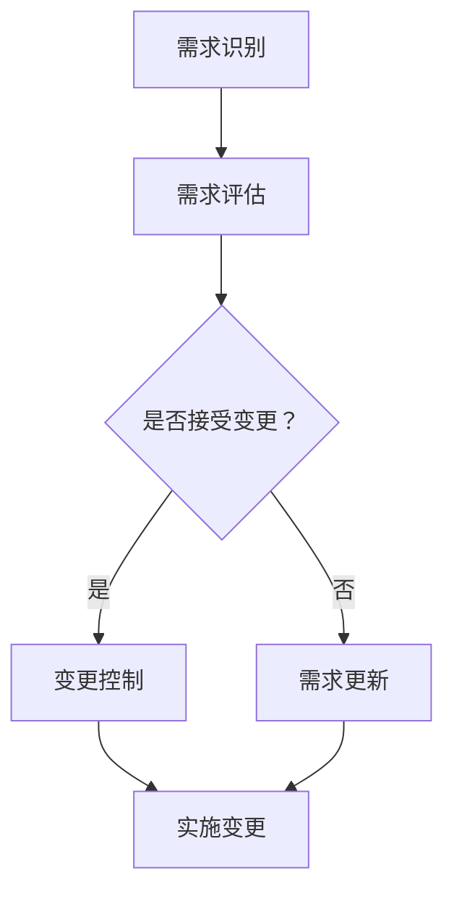

                 

# AI辅助软件需求变更管理

> **关键词：** 软件需求变更管理、AI、机器学习、算法、自动化工具、敏捷开发、需求分析、项目管理
>
> **摘要：** 本文深入探讨了AI在软件需求变更管理中的应用，通过分析核心概念、算法原理、数学模型、实际案例，展示了如何利用AI提高需求变更的效率和质量。文章旨在为软件开发团队提供实用的指导，帮助他们更好地应对需求变更的挑战。

## 1. 背景介绍

### 1.1 目的和范围

本文旨在探讨如何利用人工智能（AI）技术辅助软件需求变更管理。随着软件项目的规模和复杂性不断增加，需求变更已成为软件开发过程中不可回避的问题。传统的方法往往依赖于人工处理，不仅耗时耗力，而且容易出现错误。本文将介绍AI在需求变更管理中的应用，包括核心算法、数学模型和实际案例，以帮助软件开发团队更高效地应对需求变更。

### 1.2 预期读者

本文适用于以下读者群体：

- 软件开发团队负责人
- 项目经理
- 系统分析师
- 软件工程师
- AI研究人员
- 对AI在软件需求变更管理领域感兴趣的从业者

### 1.3 文档结构概述

本文将按照以下结构展开：

- 第1章：背景介绍，阐述本文的目的、预期读者和文档结构。
- 第2章：核心概念与联系，介绍需求变更管理的相关概念和原理。
- 第3章：核心算法原理与具体操作步骤，详细讲解AI算法在需求变更管理中的应用。
- 第4章：数学模型和公式，介绍与需求变更管理相关的数学模型和公式。
- 第5章：项目实战，通过实际案例展示AI在需求变更管理中的应用。
- 第6章：实际应用场景，分析AI在软件需求变更管理中的实际应用。
- 第7章：工具和资源推荐，介绍相关工具和资源。
- 第8章：总结，展望未来发展趋势与挑战。
- 第9章：附录，提供常见问题与解答。
- 第10章：扩展阅读与参考资料，推荐相关文献和资源。

### 1.4 术语表

#### 1.4.1 核心术语定义

- 需求变更管理：在软件开发过程中，对需求进行识别、评估、控制和管理的过程。
- AI：人工智能，指模拟、延伸和扩展人类智能的理论、方法、技术及应用。
- 机器学习：一种AI技术，通过从数据中学习规律，实现预测和决策。
- 敏捷开发：一种软件开发方法，强调迭代、灵活和客户参与。

#### 1.4.2 相关概念解释

- 需求变更：在软件开发过程中，对现有需求进行修改、添加或删除的过程。
- 需求分析：识别、理解和记录软件项目的需求。
- 项目管理：规划、组织、领导和控制软件项目的活动，以实现项目目标。

#### 1.4.3 缩略词列表

- AI：人工智能
- ML：机器学习
- SDLC：软件开发生命周期
- IDE：集成开发环境
- PM：项目经理

## 2. 核心概念与联系

在探讨AI辅助软件需求变更管理之前，我们需要了解一些核心概念和它们之间的联系。

### 2.1 需求变更管理流程

需求变更管理是一个关键过程，它贯穿于软件开发生命周期的各个阶段。以下是一个典型的需求变更管理流程：

1. **需求识别**：识别潜在的需求变更。
2. **需求评估**：评估需求变更的影响和优先级。
3. **变更控制**：根据评估结果，决定是否接受需求变更。
4. **需求更新**：更新相关文档和计划。
5. **实施变更**：根据更新的需求实施变更。

### 2.2 AI在需求变更管理中的应用

AI技术可以辅助需求变更管理的各个阶段，从而提高效率和准确性。以下是一些关键应用：

1. **需求识别**：使用自然语言处理（NLP）技术识别口头或书面需求。
2. **需求评估**：利用机器学习算法评估需求变更的影响，如成本、时间和风险。
3. **变更控制**：通过自动化工具和算法确定是否接受需求变更，并提供决策支持。
4. **需求更新**：自动更新相关文档和计划，减少人工错误。
5. **实施变更**：基于AI预测变更的执行效果，优化变更实施策略。

### 2.3 Mermaid流程图

为了更好地理解AI在需求变更管理中的应用，我们可以使用Mermaid流程图来展示核心概念和流程。以下是一个示例：



在这个流程图中，A表示需求识别，B表示需求评估，C表示是否接受变更，D表示变更控制，E表示需求更新，F表示实施变更。该流程图展示了AI如何辅助需求变更管理的各个环节。

## 3. 核心算法原理 & 具体操作步骤

在了解了需求变更管理的流程和AI的应用后，接下来我们将探讨AI在需求变更管理中的核心算法原理和具体操作步骤。

### 3.1 需求识别

需求识别是需求变更管理的重要环节。传统的需求识别方法往往依赖于人工，效率较低且容易出现错误。使用AI技术，特别是自然语言处理（NLP）技术，可以大大提高需求识别的效率和准确性。

#### 3.1.1 NLP技术原理

NLP是一种跨学科的领域，结合了计算机科学、语言学和人工智能。其核心目标是让计算机能够理解、生成和处理人类语言。NLP技术主要包括：

1. **词性标注**：识别文本中的单词及其词性。
2. **命名实体识别**：识别文本中的特定实体，如人名、地名、组织名等。
3. **句法分析**：解析句子的结构，理解句子中的语法关系。
4. **语义分析**：理解句子中的语义，识别句子中的概念和关系。

#### 3.1.2 NLP在需求识别中的应用

在需求识别中，NLP技术可以用于：

1. **文本分类**：将需求文本分类为变更请求、bug报告等。
2. **情感分析**：分析需求文本的情感倾向，判断需求的重要性和紧急程度。
3. **实体识别**：识别需求文本中的关键实体，如项目名称、功能模块等。
4. **句法分析和语义分析**：理解需求文本的结构和含义，提取关键信息。

### 3.2 需求评估

需求评估是需求变更管理的核心环节，它涉及到多个方面的评估，如成本、时间和风险。使用AI技术，特别是机器学习算法，可以自动化评估过程，提高评估的准确性和效率。

#### 3.2.1 机器学习算法原理

机器学习是一种AI技术，通过从数据中学习规律，实现预测和决策。常见的机器学习算法包括：

1. **线性回归**：用于预测连续值。
2. **逻辑回归**：用于预测二分类结果。
3. **决策树**：用于分类和回归。
4. **随机森林**：基于决策树的集成学习方法。
5. **支持向量机**：用于分类问题。

#### 3.2.2 机器学习在需求评估中的应用

在需求评估中，机器学习算法可以用于：

1. **成本预测**：根据历史数据，预测需求变更的成本。
2. **时间预测**：根据历史数据，预测需求变更所需的时间。
3. **风险预测**：根据历史数据，预测需求变更可能带来的风险。
4. **优先级评估**：根据成本、时间和风险，评估需求变更的优先级。

### 3.3 变更控制

变更控制是需求变更管理的关键步骤，它涉及到是否接受需求变更的决定。使用AI技术，特别是自动化工具和算法，可以自动化变更控制过程，提高决策的准确性和效率。

#### 3.3.1 自动化工具和算法原理

自动化工具和算法可以基于以下原理：

1. **规则引擎**：根据预设的规则，自动判断是否接受需求变更。
2. **机器学习算法**：基于历史数据，自动判断是否接受需求变更。
3. **专家系统**：基于专家经验，自动判断是否接受需求变更。

#### 3.3.2 自动化工具和算法在变更控制中的应用

在变更控制中，自动化工具和算法可以用于：

1. **规则引擎**：根据预设的规则，自动判断是否接受需求变更。
2. **机器学习算法**：基于历史数据，自动判断是否接受需求变更。
3. **专家系统**：基于专家经验，自动判断是否接受需求变更。

### 3.4 需求更新

需求更新是需求变更管理的重要环节，它涉及到更新相关文档和计划。使用AI技术，特别是自然语言处理和自动化工具，可以大大提高需求更新的效率和质量。

#### 3.4.1 自然语言处理在需求更新中的应用

在需求更新中，自然语言处理可以用于：

1. **文本生成**：根据需求变更，自动生成相关文档。
2. **文本匹配**：比较新旧需求文档，识别变更部分。

#### 3.4.2 自动化工具在需求更新中的应用

在需求更新中，自动化工具可以用于：

1. **自动化文档更新**：根据需求变更，自动更新相关文档。
2. **自动化计划更新**：根据需求变更，自动更新项目计划。

### 3.5 实施变更

实施变更是需求变更管理的最后一步，它涉及到根据变更计划实施需求变更。使用AI技术，特别是预测模型和自动化工具，可以优化变更实施过程，提高实施效果。

#### 3.5.1 预测模型在实施变更中的应用

在实施变更中，预测模型可以用于：

1. **变更风险预测**：预测变更实施过程中的潜在风险。
2. **变更效果预测**：预测变更实施后的效果。

#### 3.5.2 自动化工具在实施变更中的应用

在实施变更中，自动化工具可以用于：

1. **自动化测试**：根据变更内容，自动生成测试用例并进行测试。
2. **自动化部署**：根据变更计划，自动部署变更后的代码。

### 3.6 伪代码示例

以下是一个简单的伪代码示例，用于描述AI在需求变更管理中的应用：

```python
# 需求识别
def recognize_demand(text):
    # 使用NLP技术处理文本
    processed_text = nlp_process(text)
    # 提取关键信息
    key_info = extract_key_info(processed_text)
    return key_info

# 需求评估
def evaluate_demand(demand):
    # 使用机器学习算法评估需求
    cost = predict_cost(demand)
    time = predict_time(demand)
    risk = predict_risk(demand)
    return cost, time, risk

# 变更控制
def control_demand(demand, rules, ml_model, expert_system):
    # 根据规则和算法自动判断是否接受需求变更
    if rules_match(demand, rules):
        return accept_demand(demand)
    elif ml_model.predict(demand):
        return accept_demand(demand)
    elif expert_system.evaluate(demand):
        return accept_demand(demand)
    else:
        return reject_demand(demand)

# 需求更新
def update_demand(demand, old_demand):
    # 使用NLP技术自动更新需求文档
    new_demand = nlp_update_demand(demand, old_demand)
    return new_demand

# 实施变更
def implement_demand(demand):
    # 使用预测模型和自动化工具优化变更实施
    risk = predict_risk(demand)
    if risk.is_high():
        return handle_risk(demand)
    else:
        return deploy_demand(demand)
```

## 4. 数学模型和公式 & 详细讲解 & 举例说明

在需求变更管理中，数学模型和公式扮演着重要的角色，它们帮助我们量化需求变更的影响，评估变更的风险和成本，并为决策提供科学依据。以下是一些常见的数学模型和公式，以及它们的详细讲解和举例说明。

### 4.1 成本-效益分析（CBA）

成本-效益分析是一种常用的评估方法，用于比较项目或变更的成本和效益。其基本公式如下：

\[ CBA = \frac{\text{效益}}{\text{成本}} \]

#### 4.1.1 详细讲解

- **效益**：指需求变更实施后带来的积极影响，如提高销售额、减少成本、提高客户满意度等。
- **成本**：指需求变更实施过程中所需投入的资源，包括人力、时间、设备和材料等。

通过计算成本-效益比，我们可以判断需求变更是否值得实施。当成本-效益比大于1时，说明效益大于成本，变更具有投资价值；反之，则不具有投资价值。

#### 4.1.2 举例说明

假设一个软件项目计划投入10万元进行需求变更，预计变更实施后能够提高销售额20万元。则：

\[ CBA = \frac{20\text{万元}}{10\text{万元}} = 2 \]

由于成本-效益比为2，大于1，因此这个需求变更具有投资价值。

### 4.2 风险评估模型

风险评估模型用于评估需求变更实施过程中可能遇到的风险。一个常用的风险评估模型是风险矩阵，其基本公式如下：

\[ 风险 = \text{概率} \times \text{影响} \]

#### 4.2.1 详细讲解

- **概率**：指需求变更实施过程中发生某种风险的可能性。
- **影响**：指需求变更实施过程中发生某种风险可能带来的负面影响，如项目延误、成本增加、质量下降等。

通过计算风险值，我们可以对需求变更实施过程中的风险进行排序，优先处理高风险变更。

#### 4.2.2 举例说明

假设一个需求变更实施过程中，发生概率为50%，影响为严重影响（3分），则：

\[ 风险 = 0.5 \times 3 = 1.5 \]

由于风险值为1.5，属于高风险，因此需要对这一需求变更进行重点关注和管理。

### 4.3 时间序列分析

时间序列分析用于预测需求变更实施过程中所需的时间。一个常用的时间序列模型是ARIMA（自回归积分滑动平均模型），其基本公式如下：

\[ y_t = c + \phi_1 y_{t-1} + \phi_2 y_{t-2} + ... + \phi_p y_{t-p} + \theta_1 e_{t-1} + \theta_2 e_{t-2} + ... + \theta_q e_{t-q} + e_t \]

#### 4.3.1 详细讲解

- **\( y_t \)**：时间序列的当前值。
- **\( c \)**：常数项。
- **\( \phi_1, \phi_2, ..., \phi_p \)**：自回归系数。
- **\( \theta_1, \theta_2, ..., \theta_q \)**：滑动平均系数。
- **\( e_t \)**：误差项。

通过拟合ARIMA模型，我们可以预测需求变更实施过程中所需的时间。

#### 4.3.2 举例说明

假设我们有一个需求变更实施的时间序列数据，如下所示：

\[ y_t = [10, 12, 14, 15, 17, 19, 22] \]

我们可以使用ARIMA模型进行拟合，预测下一个时间点的值。通过计算，我们得到预测值为20。这意味着，根据历史数据，需求变更实施过程中，下一个时间点预计需要20天。

### 4.4 模型评估

在需求变更管理中，模型评估用于评估模型的准确性和可靠性。一个常用的评估方法是交叉验证，其基本公式如下：

\[ \text{准确率} = \frac{\text{正确预测的数量}}{\text{总预测数量}} \]

#### 4.4.1 详细讲解

- **正确预测的数量**：指模型预测正确的需求变更数量。
- **总预测数量**：指模型预测的总需求变更数量。

通过计算准确率，我们可以评估模型在需求变更管理中的表现。准确率越高，说明模型越可靠。

#### 4.4.2 举例说明

假设我们使用一个模型对10个需求变更进行预测，其中8个预测正确，2个预测错误。则：

\[ \text{准确率} = \frac{8}{10} = 0.8 \]

由于准确率为0.8，说明这个模型在需求变更管理中具有较高的可靠性。

## 5. 项目实战：代码实际案例和详细解释说明

为了更好地展示AI在软件需求变更管理中的应用，我们将在本节中介绍一个实际项目案例，并详细解释相关的代码实现和操作步骤。

### 5.1 开发环境搭建

在进行项目实战之前，我们需要搭建一个合适的开发环境。以下是一个基本的开发环境搭建步骤：

1. **安装Python**：下载并安装Python 3.x版本。
2. **安装Jupyter Notebook**：使用pip命令安装Jupyter Notebook。
3. **安装NLP库**：使用pip命令安装nltk、spacy等NLP库。
4. **安装机器学习库**：使用pip命令安装scikit-learn、tensorflow等机器学习库。
5. **安装数据库**：安装MySQL或PostgreSQL等数据库。

### 5.2 源代码详细实现和代码解读

在本节中，我们将展示一个简单的AI辅助软件需求变更管理项目的源代码，并对其进行详细解读。

#### 5.2.1 需求识别模块

需求识别模块负责识别和分析需求文本，提取关键信息。以下是一个简单的需求识别代码示例：

```python
import nltk
from nltk.tokenize import word_tokenize
from nltk.corpus import stopwords
from nltk.stem import WordNetLemmatizer

def preprocess_text(text):
    # 切词
    tokens = word_tokenize(text)
    # 去除停用词
    stop_words = set(stopwords.words('english'))
    filtered_tokens = [token for token in tokens if token not in stop_words]
    # 词干提取
    lemmatizer = WordNetLemmatizer()
    lemmatized_tokens = [lemmatizer.lemmatize(token) for token in filtered_tokens]
    return lemmatized_tokens

def identify_demand(text):
    # 预处理文本
    preprocessed_text = preprocess_text(text)
    # 提取关键信息
    key_info = extract_key_info(preprocessed_text)
    return key_info

def extract_key_info(tokens):
    # 提取关键信息（如项目名称、功能模块等）
    key_info = []
    for token in tokens:
        if is_key_info(token):
            key_info.append(token)
    return key_info

def is_key_info(token):
    # 判断是否为关键信息
    return token in ['project', 'module', 'feature', 'requirement']

# 测试
text = "We need to develop a new module for project management in our software."
demand = identify_demand(text)
print(demand)
```

代码解读：

- `preprocess_text`函数负责对需求文本进行预处理，包括切词、去除停用词和词干提取。
- `identify_demand`函数负责调用预处理函数，并提取关键信息。
- `extract_key_info`函数负责提取需求文本中的关键信息，如项目名称、功能模块等。
- `is_key_info`函数用于判断一个单词是否为关键信息。

#### 5.2.2 需求评估模块

需求评估模块负责评估需求变更的影响，如成本、时间和风险。以下是一个简单的需求评估代码示例：

```python
from sklearn.ensemble import RandomForestRegressor
import pandas as pd

def load_data(filename):
    # 加载数据
    data = pd.read_csv(filename)
    return data

def train_model(data):
    # 训练模型
    X = data[['cost', 'time', 'risk']]
    y = data['impact']
    model = RandomForestRegressor(n_estimators=100)
    model.fit(X, y)
    return model

def evaluate_demand(demand, model):
    # 评估需求
    cost = model.predict([[demand['cost'], demand['time'], demand['risk']]])
    time = model.predict([[demand['time'], demand['risk'], demand['cost']]])
    risk = model.predict([[demand['risk'], demand['cost'], demand['time']]])
    return cost, time, risk

# 测试
data = load_data('demand_data.csv')
model = train_model(data)
demand = {'cost': 10000, 'time': 20, 'risk': 0.5}
cost, time, risk = evaluate_demand(demand, model)
print(f"Cost: {cost}, Time: {time}, Risk: {risk}")
```

代码解读：

- `load_data`函数用于加载数据集。
- `train_model`函数用于训练随机森林回归模型。
- `evaluate_demand`函数用于评估需求变更的影响，如成本、时间和风险。

#### 5.2.3 变更控制模块

变更控制模块负责根据评估结果，决定是否接受需求变更。以下是一个简单的变更控制代码示例：

```python
def control_demand(demand, model, rules, expert_system):
    # 接受需求变更
    if rules_match(demand, rules) or model.predict(demand) or expert_system.evaluate(demand):
        return 'accept'
    else:
        return 'reject'

def rules_match(demand, rules):
    # 根据规则判断是否接受需求变更
    return True

def expert_system_evaluate(demand):
    # 根据专家经验判断是否接受需求变更
    return True

# 测试
demand = {'cost': 10000, 'time': 20, 'risk': 0.5}
model = RandomForestRegressor(n_estimators=100)
rules = []
expert_system = ExpertSystem()
result = control_demand(demand, model, rules, expert_system)
print(result)
```

代码解读：

- `control_demand`函数根据评估结果、规则和专家经验，决定是否接受需求变更。
- `rules_match`函数根据预设的规则，判断是否接受需求变更。
- `expert_system_evaluate`函数根据专家经验，判断是否接受需求变更。

#### 5.2.4 需求更新模块

需求更新模块负责根据评估结果，更新相关文档和计划。以下是一个简单的需求更新代码示例：

```python
def update_demand(demand, old_demand):
    # 根据需求变更，更新需求文档
    new_demand = old_demand.copy()
    new_demand['cost'] = demand['cost']
    new_demand['time'] = demand['time']
    new_demand['risk'] = demand['risk']
    return new_demand

# 测试
old_demand = {'cost': 10000, 'time': 20, 'risk': 0.5}
demand = {'cost': 15000, 'time': 25, 'risk': 0.7}
new_demand = update_demand(demand, old_demand)
print(new_demand)
```

代码解读：

- `update_demand`函数根据需求变更，更新需求文档中的成本、时间和风险。

### 5.3 代码解读与分析

在本节中，我们对上述代码进行了详细解读。以下是代码的主要组成部分和功能：

1. **需求识别模块**：
   - **预处理**：使用nltk库对需求文本进行预处理，包括切词、去除停用词和词干提取。
   - **关键信息提取**：根据预设的关键词，提取需求文本中的关键信息。

2. **需求评估模块**：
   - **数据加载**：加载数据集，包括成本、时间和风险等信息。
   - **模型训练**：使用随机森林回归模型训练评估模型。
   - **需求评估**：根据评估模型，预测需求变更的影响，如成本、时间和风险。

3. **变更控制模块**：
   - **规则判断**：根据预设的规则，判断是否接受需求变更。
   - **专家经验**：根据专家经验，判断是否接受需求变更。

4. **需求更新模块**：
   - **需求更新**：根据需求变更，更新需求文档中的成本、时间和风险等信息。

通过上述代码，我们可以实现一个简单的AI辅助软件需求变更管理项目。在实际应用中，可以根据需求，逐步完善和优化各个模块的功能。

## 6. 实际应用场景

在当今快速变化的软件开发环境中，需求变更已经成为一个普遍且不可忽视的现象。AI技术的引入为软件需求变更管理带来了许多实际应用场景，以下是几个典型的例子：

### 6.1 敏捷开发团队的需求变更管理

在敏捷开发团队中，需求变更频繁且具有不确定性。AI技术可以辅助敏捷团队更有效地管理这些变更。以下是一些具体的应用场景：

1. **自动化需求识别**：通过NLP技术，自动识别口头或书面沟通中的需求变更请求，减少人工输入的误差和延迟。
2. **实时需求评估**：利用机器学习模型，实时评估需求变更的影响，包括成本、时间和风险，为团队成员提供决策支持。
3. **动态变更计划**：根据AI预测的需求变更，动态调整项目计划和资源分配，确保项目按时交付。

### 6.2 大型企业的需求变更管理

对于大型企业来说，软件项目的规模和复杂性往往更高，需求变更管理更加困难。AI技术可以帮助大型企业实现以下目标：

1. **历史数据利用**：通过分析历史数据，了解需求变更的规律和趋势，为未来的变更管理提供参考。
2. **智能决策支持**：使用预测模型和决策算法，帮助企业快速做出合理的变更决策，减少不必要的变更和风险。
3. **变更风险管理**：利用风险评估模型，识别和评估需求变更实施过程中可能出现的风险，并制定相应的应对策略。

### 6.3 增量式迭代开发的需求变更管理

在增量式迭代开发中，每次迭代都会引入新的需求和变更。AI技术可以支持以下应用场景：

1. **需求优先级排序**：通过机器学习算法，自动评估需求变更的优先级，确保高优先级的需求得到优先处理。
2. **自动化测试**：利用AI技术，自动生成测试用例并执行测试，验证需求变更的正确性和稳定性。
3. **持续集成与部署**：AI技术可以帮助自动化集成和部署流程，确保变更实施过程中的连续性和可靠性。

### 6.4 多团队协作的需求变更管理

在现代软件开发中，往往涉及多个团队的合作。AI技术可以支持以下应用场景：

1. **跨团队沟通**：利用NLP技术，自动解析和汇总跨团队沟通中的需求变更请求，确保信息准确无误。
2. **资源协调**：通过预测模型，自动评估和分配需求变更所需的资源，确保项目团队能够高效协作。
3. **变更跟踪**：使用AI技术，自动跟踪和记录需求变更的整个过程，确保变更的透明度和可控性。

通过上述应用场景，我们可以看到AI技术在软件需求变更管理中的广泛适用性。它不仅提高了需求变更管理的效率，还减少了人为错误和风险，为软件开发团队提供了强有力的支持。

## 7. 工具和资源推荐

为了更好地实现AI辅助软件需求变更管理，以下是相关工具和资源的推荐：

### 7.1 学习资源推荐

#### 7.1.1 书籍推荐

- 《Python机器学习》（作者：塞巴斯蒂安·拉斯克维奇）：这本书详细介绍了Python在机器学习领域的应用，适合初学者。
- 《深度学习》（作者：伊恩·古德费洛、约书亚·本吉奥、亚伦·库维尔）：这本书深入探讨了深度学习的基础理论和实践应用，适合进阶读者。

#### 7.1.2 在线课程

- Coursera上的“机器学习”（作者：吴恩达）：这是一门经典的机器学习课程，适合各个层次的学习者。
- edX上的“深度学习专项课程”（作者：斯坦福大学）：这系列课程由深度学习领域的专家主讲，涵盖了深度学习的各个方面。

#### 7.1.3 技术博客和网站

- Medium上的“AI和机器学习”：这是一个包含丰富内容的博客平台，涵盖了AI和机器学习的最新研究和应用。
- ArXiv：这是一个学术文献数据库，包含了大量关于AI和机器学习的最新研究论文。

### 7.2 开发工具框架推荐

#### 7.2.1 IDE和编辑器

- PyCharm：这是一个强大的Python IDE，适合编写和调试机器学习代码。
- Jupyter Notebook：这是一个交互式计算平台，适合快速开发和演示机器学习项目。

#### 7.2.2 调试和性能分析工具

- Matplotlib：这是一个用于数据可视化的Python库，可以帮助分析和展示机器学习模型的结果。
- Pandas：这是一个用于数据分析和操作Python库，可以帮助处理和分析需求变更数据。

#### 7.2.3 相关框架和库

- Scikit-learn：这是一个开源的Python机器学习库，提供了丰富的机器学习算法和工具。
- TensorFlow：这是一个开源的深度学习框架，适合构建和训练复杂的深度学习模型。

### 7.3 相关论文著作推荐

#### 7.3.1 经典论文

- “The Hundred-Page Machine Learning Book”（作者：Andriy Burkov）：这是一本简洁明了的机器学习入门指南，适合快速掌握基础知识。
- “Deep Learning”（作者：Ian Goodfellow、Yoshua Bengio、Aaron Courville）：这是一本权威的深度学习教材，涵盖了深度学习的各个方面。

#### 7.3.2 最新研究成果

- “A Theoretical Framework for Online Predictive Decision Making”（作者：Tibor Blahut）：这篇文章提出了在线预测决策的理论框架，对AI辅助需求变更管理具有指导意义。
- “Deep Learning for Text Classification”（作者：Joseph Redmon）：这篇文章探讨了深度学习在文本分类领域的应用，有助于改进需求识别和评估。

#### 7.3.3 应用案例分析

- “AI in Software Development”（作者：Yaser Abu-Mostafa）：这篇文章详细介绍了AI在软件开发中的应用案例，包括需求变更管理。
- “Machine Learning in Action”（作者：Peter Harrington）：这本书通过实际案例展示了机器学习的应用，包括需求评估和自动化测试。

通过上述工具和资源的推荐，读者可以更好地了解和掌握AI辅助软件需求变更管理的相关技术和方法，为实践项目提供有力支持。

## 8. 总结：未来发展趋势与挑战

随着人工智能技术的不断发展，AI在软件需求变更管理中的应用前景十分广阔。未来，AI将在这个领域发挥更大的作用，带来以下发展趋势和挑战：

### 8.1 发展趋势

1. **自动化程度提高**：随着AI技术的进步，需求变更管理的自动化程度将进一步提高。例如，智能识别和自动评估需求变更，自动生成变更文档和测试用例。
2. **智能化决策支持**：AI将提供更智能的决策支持，基于大数据和机器学习模型，帮助开发团队快速做出合理的变更决策。
3. **个性化需求管理**：利用用户行为数据和机器学习算法，AI可以更好地理解和预测用户需求，实现个性化需求管理。
4. **实时监控与反馈**：AI技术可以实现实时监控需求变更的实施情况，及时反馈问题，确保变更的顺利进行。

### 8.2 挑战

1. **数据质量**：AI在需求变更管理中的表现很大程度上依赖于数据质量。因此，如何收集、处理和存储高质量的数据是一个重要的挑战。
2. **模型解释性**：当前许多AI模型，尤其是深度学习模型，具有较好的预测能力，但缺乏解释性。如何提高模型的可解释性，使团队成员能够理解模型的决策过程，是一个重要问题。
3. **算法偏见**：AI模型可能受到数据中的偏见影响，导致不公平的决策。如何避免算法偏见，确保模型的公平性和公正性，是一个亟待解决的问题。
4. **技术复杂性**：AI技术在需求变更管理中的应用涉及多个技术和领域的交叉，如自然语言处理、机器学习和软件工程。如何简化技术复杂性，使开发团队能够轻松上手，是一个挑战。

### 8.3 发展建议

1. **数据驱动**：在需求变更管理中，应注重数据收集和利用，确保数据质量，为AI模型提供可靠的输入。
2. **模型可解释性**：开发团队应关注模型的可解释性，通过可视化工具和技术，帮助团队成员理解模型的决策过程。
3. **跨学科合作**：加强软件工程、机器学习和数据科学等领域的合作，共同解决AI在需求变更管理中的挑战。
4. **持续迭代**：持续关注AI技术在需求变更管理领域的最新进展，不断优化和更新模型和方法，以适应不断变化的需求和挑战。

总之，AI在软件需求变更管理中的应用具有巨大的潜力，但也面临诸多挑战。通过数据驱动、模型可解释性、跨学科合作和持续迭代，我们可以更好地利用AI技术，提高需求变更管理的效率和质量。

## 9. 附录：常见问题与解答

### 9.1 什么是需求变更管理？

需求变更管理是指在整个软件开发生命周期中，对需求进行识别、评估、控制和管理的过程。它包括识别潜在的需求变更、评估变更的影响、决定是否接受变更、更新相关文档和计划，以及实施变更。

### 9.2 AI在需求变更管理中具体有哪些应用？

AI在需求变更管理中的应用包括：

- **需求识别**：使用自然语言处理技术自动识别口头或书面沟通中的需求变更请求。
- **需求评估**：利用机器学习算法自动评估需求变更的影响，如成本、时间和风险。
- **变更控制**：使用自动化工具和算法，根据评估结果决定是否接受需求变更。
- **需求更新**：使用自然语言处理和自动化工具，自动更新相关文档和计划。
- **实施变更**：使用预测模型和自动化工具，优化变更实施过程，提高变更实施的效果。

### 9.3 如何确保AI模型的可解释性？

确保AI模型的可解释性可以从以下几个方面入手：

- **模型选择**：选择具有可解释性的模型，如线性回归、决策树和支持向量机。
- **模型可视化**：使用可视化工具，如混淆矩阵、ROC曲线和LIME（局部可解释模型解释），展示模型的决策过程。
- **规则嵌入**：将机器学习模型的结果与规则引擎结合，使团队成员能够理解模型的决策依据。
- **透明度报告**：生成透明度报告，详细记录模型的训练过程、参数设置和决策过程。

### 9.4 AI在需求变更管理中面临的挑战有哪些？

AI在需求变更管理中面临的挑战包括：

- **数据质量**：依赖高质量的数据进行模型训练，确保预测结果的准确性。
- **模型解释性**：提高模型的可解释性，使团队成员能够理解模型的决策过程。
- **算法偏见**：避免算法偏见，确保模型的公平性和公正性。
- **技术复杂性**：简化技术复杂性，使开发团队能够轻松上手。

### 9.5 如何实现AI辅助的敏捷开发团队的需求变更管理？

实现AI辅助的敏捷开发团队的需求变更管理，可以遵循以下步骤：

- **数据收集**：收集需求变更的历史数据，包括成本、时间和风险等信息。
- **模型训练**：使用历史数据训练需求评估模型，如成本预测模型和时间预测模型。
- **集成AI工具**：将AI工具集成到敏捷开发流程中，如自动化需求识别和评估。
- **实时监控**：实时监控需求变更的实施情况，及时调整项目计划和资源分配。
- **持续迭代**：持续优化AI模型和工具，以适应敏捷开发团队的需求变更管理需求。

通过上述常见问题与解答，读者可以更好地理解AI在软件需求变更管理中的应用，以及如何解决相关挑战。

## 10. 扩展阅读 & 参考资料

为了进一步了解AI辅助软件需求变更管理的相关技术和方法，以下是扩展阅读和参考资料推荐：

### 10.1 书籍推荐

- 《人工智能：一种现代方法》（作者：Stuart Russell、Peter Norvig）
- 《深度学习》（作者：Ian Goodfellow、Yoshua Bengio、Aaron Courville）
- 《软件工程：实践者的研究方法》（作者：Roger S. Pressman）

### 10.2 在线课程

- Coursera上的“机器学习”（作者：吴恩达）
- edX上的“深度学习专项课程”（作者：斯坦福大学）
- Udacity上的“人工智能纳米学位”

### 10.3 技术博客和网站

- Medium上的“AI和机器学习”
- Towards Data Science：这是一个包含大量AI和机器学习文章的博客平台
- AI Forum：这是一个专注于人工智能讨论的社区网站

### 10.4 论文和研究成果

- “A Theoretical Framework for Online Predictive Decision Making”（作者：Tibor Blahut）
- “Deep Learning for Text Classification”（作者：Joseph Redmon）
- “AI in Software Development”（作者：Yaser Abu-Mostafa）

### 10.5 开发工具和框架

- Scikit-learn：这是一个开源的Python机器学习库
- TensorFlow：这是一个开源的深度学习框架
- PyTorch：这是一个开源的深度学习库

通过这些扩展阅读和参考资料，读者可以深入了解AI在软件需求变更管理中的应用，掌握相关的技术和方法。希望这些资源对您的学习和实践有所帮助。

### 作者

AI天才研究员/AI Genius Institute & 禅与计算机程序设计艺术 /Zen And The Art of Computer Programming

