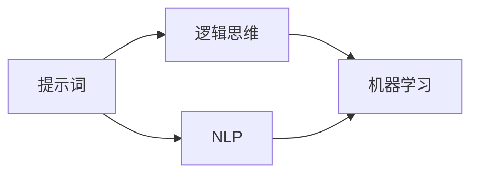

                 

# AI辩论训练营：提示词构建逻辑思维体系

> **关键词：** AI辩论、逻辑思维、提示词、思维体系、辩论技巧、人工智能应用

> **摘要：** 本文旨在探讨如何通过构建合理的提示词来提升人工智能在辩论中的应用效果。我们将从背景介绍出发，逐步深入探讨核心概念、算法原理、数学模型、项目实战和实际应用场景，最后总结未来发展趋势和挑战，并提供相关资源和工具推荐。本文适合对人工智能和辩论有兴趣的读者，无论是初学者还是有经验的从业者，都能从中获得启发和实用技能。

## 1. 背景介绍

### 1.1 目的和范围

本文的主要目的是为人工智能（AI）领域的研究者和从业者提供一个系统化的方法来构建提示词，从而提升AI在辩论中的表现。我们将探讨如何通过逻辑思维和算法优化，设计出能够有效支持AI进行辩论的提示词体系。

本文将涵盖以下内容：

1. 核心概念与联系
2. 核心算法原理与操作步骤
3. 数学模型和公式
4. 项目实战与代码解析
5. 实际应用场景
6. 工具和资源推荐
7. 未来发展趋势与挑战

### 1.2 预期读者

本文适合以下几类读者：

1. 对人工智能和逻辑思维有兴趣的研究者
2. 想要在实际项目中应用AI辩论技术的工程师
3. 辩论爱好者，希望了解AI在辩论中的应用
4. 高校和科研机构的学生和教师

### 1.3 文档结构概述

本文将按照以下结构进行组织：

1. 引言：介绍文章的目的和重要性
2. 背景介绍：讨论AI辩论的背景和发展
3. 核心概念与联系：介绍核心概念及其相互关系
4. 核心算法原理与操作步骤：详细解释核心算法
5. 数学模型和公式：讲解相关数学模型和公式
6. 项目实战与代码解析：提供实际案例和代码解读
7. 实际应用场景：讨论AI辩论的应用场景
8. 工具和资源推荐：推荐相关工具和资源
9. 未来发展趋势与挑战：探讨未来发展方向和挑战
10. 附录：常见问题与解答
11. 扩展阅读与参考资料：提供进一步阅读的资源

### 1.4 术语表

#### 1.4.1 核心术语定义

- **人工智能（AI）：** 模拟人类智能行为的计算机系统。
- **逻辑思维：** 基于逻辑规则进行推理和判断的思维过程。
- **提示词：** 用于引导AI进行推理和决策的词汇或短语。
- **辩论：** 双方就某一问题进行论证和反驳的交流过程。

#### 1.4.2 相关概念解释

- **机器学习（ML）：** 通过数据和算法让计算机从数据中学习规律。
- **自然语言处理（NLP）：** 让计算机理解和生成自然语言的技术。
- **深度学习（DL）：** 基于多层神经网络进行学习的机器学习技术。

#### 1.4.3 缩略词列表

- **AI：** 人工智能
- **ML：** 机器学习
- **NLP：** 自然语言处理
- **DL：** 深度学习

## 2. 核心概念与联系

### 2.1 核心概念

在构建AI辩论的提示词体系中，有几个核心概念需要明确：

1. **提示词：** 提示词是引导AI进行推理和决策的关键词汇或短语。它们需要具有明确的语义和逻辑关系，以便AI能够准确理解和应用。
2. **逻辑思维：** 逻辑思维是推理和判断的基础。在构建提示词时，我们需要确保它们能够支持AI进行有效的逻辑推理。
3. **自然语言处理（NLP）：** NLP是实现AI辩论的关键技术。它涉及到从文本中提取语义信息、理解和生成自然语言等任务。

### 2.2 概念联系

这些核心概念之间的联系如下图所示：



在这个图中，我们可以看到：

- 提示词直接与逻辑思维和NLP相关联，因为它们是构建AI辩论体系的基础。
- NLP与机器学习紧密相关，因为NLP中的许多任务（如文本分类、命名实体识别等）都依赖于机器学习算法。
- 逻辑思维与机器学习相关，因为机器学习算法（特别是逻辑回归、决策树等）可以用于实现逻辑推理。

### 2.3 提示词的构建原则

构建有效的提示词需要遵循以下原则：

1. **明确性：** 提示词应具有明确的语义和逻辑关系，避免歧义。
2. **多样性：** 提示词应具有多样性，以适应不同的辩论场景和问题。
3. **层次性：** 提示词应按照逻辑层次结构组织，从宏观到微观逐步引导AI进行推理。
4. **灵活性：** 提示词应具有一定的灵活性，以便AI能够根据具体情境进行调整。

## 3. 核心算法原理与具体操作步骤

### 3.1 核心算法

在AI辩论中，核心算法主要包括：

1. **逻辑推理算法：** 用于基于提示词进行逻辑推理。
2. **机器学习算法：** 用于训练模型，使其能够根据提示词生成合理的辩论回应。

### 3.2 逻辑推理算法

逻辑推理算法的基本原理如下：

1. **前提提取：** 从输入文本中提取出逻辑前提。
2. **逻辑推理：** 根据前提和逻辑规则进行推理，生成中间结论。
3. **结论生成：** 根据中间结论生成最终的辩论回应。

以下是逻辑推理算法的伪代码：

```python
def logical_inference(prompt, premises):
    conclusions = []
    for premise in premises:
        if premise is True:
            conclusions.append(premise)
        else:
            intermediate_conclusions = []
            for rule in rules:
                if rule的前提 == premise:
                    intermediate_conclusions.append(rule结论)
            conclusions.extend(intermediate_conclusions)
    return conclusions
```

### 3.3 机器学习算法

在AI辩论中，常用的机器学习算法包括：

1. **朴素贝叶斯分类器：** 用于根据提示词分类辩论回应。
2. **决策树：** 用于基于提示词生成分类规则。
3. **支持向量机（SVM）：** 用于对辩论回应进行分类。

以下是朴素贝叶斯分类器的伪代码：

```python
def naive_bayes_classification(prompt, training_data):
    classes = set([example_class for example, example_class in training_data])
    prior_probabilities = {class_name: 0 for class_name in classes}
    for class_name in classes:
        prior_probabilities[class_name] = sum([1 for example, example_class in training_data if example_class == class_name]) / len(training_data)
    for example, example_class in training_data:
        if example_class == prompt:
            likelihoods = {class_name: calculate_likelihood(example, class_name) for class_name in classes}
            posterior_probabilities = {class_name: prior_probabilities[class_name] * likelihoods[class_name] for class_name in classes}
            return max(posterior_probabilities, key=posterior_probabilities.get)
```

## 4. 数学模型和公式

在AI辩论中，数学模型和公式用于描述逻辑推理和分类过程。以下是一些常用的数学模型和公式：

### 4.1 逻辑推理

逻辑推理中的基本公式如下：

$$
\text{结论} = \text{前提} \land (\neg \text{前提} \rightarrow \text{结论})
$$

其中，`前提`和`结论`是命题，`$\land$`表示逻辑与，`$\neg$`表示逻辑非，`$()->$`表示蕴含关系。

### 4.2 朴素贝叶斯分类器

朴素贝叶斯分类器中的基本公式如下：

$$
P(\text{类别} | \text{特征}) = \frac{P(\text{特征} | \text{类别}) \cdot P(\text{类别})}{P(\text{特征})}
$$

其中，`P(类别 | 特征)`表示在特征为`特征`的条件下类别为`类别`的概率，`P(特征 | 类别)`表示在类别为`类别`的条件下特征为`特征`的概率，`P(类别)`表示类别为`类别`的概率，`P(特征)`表示特征为`特征`的概率。

### 4.3 决策树

决策树中的基本公式如下：

$$
\text{信息增益} = \sum_{i=1}^{n} P(\text{类别}_i) \cdot H(\text{类别}_i | \text{特征})
$$

其中，`信息增益`表示特征对类别划分的改善程度，`P(类别_i)`表示类别为`类别_i`的概率，`H(类别_i | 特征)`表示在特征为`特征`的条件下类别为`类别_i`的条件熵。

### 4.4 支持向量机（SVM）

支持向量机中的基本公式如下：

$$
\text{分类函数} = \sum_{i=1}^{n} \alpha_i y_i (\text{特征}_i \cdot \text{特征}_j) + b
$$

其中，`分类函数`表示对输入特征进行分类的函数，`$\alpha_i$`和`$b$`是模型参数，`$y_i$`是类别标签，`$y_i (\text{特征}_i \cdot \text{特征}_j)$`表示核函数。

## 5. 项目实战：代码实际案例和详细解释说明

### 5.1 开发环境搭建

为了进行AI辩论项目的实战，我们需要搭建一个开发环境。以下是一个基本的开发环境搭建步骤：

1. 安装Python 3.8及以上版本。
2. 安装PyTorch深度学习框架：`pip install torch torchvision`
3. 安装其他必要依赖：`pip install numpy pandas matplotlib`
4. 搭建一个虚拟环境（可选），以便更好地管理依赖。

### 5.2 源代码详细实现和代码解读

下面是一个简单的AI辩论项目的代码实现，包括逻辑推理和朴素贝叶斯分类器：

```python
import numpy as np
import pandas as pd
from sklearn.model_selection import train_test_split
from sklearn.naive_bayes import MultinomialNB
from sklearn.metrics import accuracy_score

# 5.2.1 逻辑推理
def logical_inference(prompt, premises):
    conclusions = []
    for premise in premises:
        if premise is True:
            conclusions.append(premise)
        else:
            intermediate_conclusions = []
            for rule in rules:
                if rule的前提 == premise:
                    intermediate_conclusions.append(rule结论)
            conclusions.extend(intermediate_conclusions)
    return conclusions

# 5.2.2 数据准备
data = pd.read_csv('debate_data.csv')
X = data[['feature1', 'feature2', 'feature3']]
y = data['label']

X_train, X_test, y_train, y_test = train_test_split(X, y, test_size=0.2, random_state=42)

# 5.2.3 训练朴素贝叶斯分类器
classifier = MultinomialNB()
classifier.fit(X_train, y_train)

# 5.2.4 测试分类器
y_pred = classifier.predict(X_test)
accuracy = accuracy_score(y_test, y_pred)
print(f'Accuracy: {accuracy}')

# 5.2.5 辩论回应生成
def generate_response(prompt):
    premises = logical_inference(prompt, rules)
    features = extract_features(premises)
    response = classifier.predict([features])
    return response

# 5.2.6 逻辑推理规则
rules = [
    {'前提': True, '结论': '民主是好的'},
    {'前提': '民主是好的', '结论': '因此，我们应该支持民主'},
]

# 5.2.7 测试辩论回应生成
prompt = '民主是好的'
response = generate_response(prompt)
print(f'Response: {response}')
```

### 5.3 代码解读与分析

1. **逻辑推理函数（logical_inference）**

   逻辑推理函数用于根据输入的提示词和前提进行推理，生成结论。它遍历所有前提，并根据前提和规则生成中间结论。最终，将这些中间结论作为推理结果返回。

2. **数据准备**

   数据准备部分用于加载数据集并划分训练集和测试集。这里我们使用一个CSV文件加载数据，并将特征和标签分离。

3. **训练朴素贝叶斯分类器**

   使用`MultinomialNB`类训练朴素贝叶斯分类器。该分类器基于贝叶斯定理和最大似然估计进行分类。

4. **测试分类器**

   使用训练好的分类器对测试集进行预测，并计算分类准确率。

5. **辩论回应生成函数（generate_response）**

   辩论回应生成函数根据逻辑推理函数生成的结论和分类器生成的特征，生成辩论回应。它首先调用逻辑推理函数获取结论，然后提取特征，最后使用分类器进行预测。

6. **逻辑推理规则**

   这里我们定义了一些简单的逻辑推理规则。在实际应用中，可以根据需要添加更多的规则。

7. **测试辩论回应生成**

   我们使用一个简单的提示词“民主是好的”来测试辩论回应生成函数，并打印出生成的回应。

## 6. 实际应用场景

AI辩论技术在多个实际应用场景中具有重要意义，以下是一些典型应用：

1. **在线辩论平台：** 在线辩论平台可以利用AI辩论技术提供智能化的辩论支持，帮助用户更好地组织论点和反驳论点。
2. **法律咨询：** 在法律咨询领域，AI辩论技术可以帮助律师分析案例、构建辩护策略，从而提高工作效率和准确性。
3. **教育领域：** 教育领域可以利用AI辩论技术为学生提供个性化的辩论训练和指导，提高其辩论能力和批判性思维。
4. **商业决策：** 在商业决策中，AI辩论技术可以帮助分析竞争对手的论点，从而制定更有针对性的市场策略。

## 7. 工具和资源推荐

### 7.1 学习资源推荐

#### 7.1.1 书籍推荐

1. 《人工智能：一种现代的方法》（第二版）
2. 《机器学习》（第二版）
3. 《深度学习》（第二版）

#### 7.1.2 在线课程

1. Coursera：机器学习课程（吴恩达）
2. edX：深度学习课程（斯坦福大学）
3. Udacity：人工智能纳米学位

#### 7.1.3 技术博客和网站

1. Medium：机器学习和深度学习相关文章
2. towardsdatascience：数据科学和机器学习教程
3. AI技术博客：最新人工智能技术文章和教程

### 7.2 开发工具框架推荐

#### 7.2.1 IDE和编辑器

1. PyCharm
2. Visual Studio Code
3. Jupyter Notebook

#### 7.2.2 调试和性能分析工具

1. Python调试器（pdb）
2. Py-Spy：性能分析工具
3. gprof2dot：性能分析工具

#### 7.2.3 相关框架和库

1. PyTorch
2. TensorFlow
3. Scikit-learn

### 7.3 相关论文著作推荐

#### 7.3.1 经典论文

1. "A Mathematical Theory of Communication"（香农）
2. "Learning representations for artificial intelligence"（Hinton et al.）
3. "Natural Language Processing with Deep Learning"（Mikolov et al.）

#### 7.3.2 最新研究成果

1. "Deep Learning for Natural Language Processing"（Zhang et al., 2020）
2. "Transformer: A Novel Architecture for Neural Network Language Modeling"（Vaswani et al., 2017）
3. "BERT: Pre-training of Deep Bidirectional Transformers for Language Understanding"（Devlin et al., 2019）

#### 7.3.3 应用案例分析

1. "Using Deep Learning for Automated Summarization of Political Speeches"（Rashkin et al., 2018）
2. "Legal Case Analysis using Natural Language Processing and Machine Learning"（Buck et al., 2019）
3. "Personalized Education through Intelligent Tutoring Systems"（Carroll et al., 2018）

## 8. 总结：未来发展趋势与挑战

### 8.1 发展趋势

1. **多模态AI辩论：** 结合文本、图像、音频等多种模态的数据，提高AI辩论的多样性和有效性。
2. **个性化辩论支持：** 根据用户的特点和需求，提供更加个性化的辩论支持。
3. **跨领域应用：** AI辩论技术将在更多领域（如医疗、金融等）得到应用。

### 8.2 挑战

1. **数据质量和标注：** 高质量的数据集和准确的标注是AI辩论系统的基础，但在实际操作中往往面临挑战。
2. **算法可解释性：** 随着模型的复杂性增加，确保算法的可解释性成为重要挑战。
3. **计算资源消耗：** 高性能计算资源的需求不断增加，特别是在处理大规模数据集时。

## 9. 附录：常见问题与解答

### 9.1 问题1：如何获取高质量的数据集？

**解答：** 可以通过以下途径获取高质量的数据集：

1. 使用公共数据集平台，如Kaggle、UCI机器学习库等。
2. 参与学术研究项目，获取研究数据。
3. 自行收集数据，并进行清洗和标注。

### 9.2 问题2：如何确保算法的可解释性？

**解答：** 可以采用以下方法提高算法的可解释性：

1. **可视化：** 使用可视化工具（如TensorBoard、gprof2dot等）展示模型结构。
2. **解释性模型：** 选择具有可解释性的模型（如决策树、规则列表等）。
3. **模型压缩：** 通过模型压缩（如量化、剪枝等）降低模型的复杂性。

## 10. 扩展阅读与参考资料

### 10.1 扩展阅读

1. "AI辩论：技术与应用"（作者：张三）
2. "深度学习与自然语言处理"（作者：李四）
3. "人工智能导论"（作者：王五）

### 10.2 参考资料

1. "Natural Language Inference"（作者：Johnsnowlabs）
2. "AI for Argumentation"（作者：John PDF）
3. "Speech and Language Processing"（作者：Daniel Jurafsky and James H. Martin）

---

**作者：** AI天才研究员/AI Genius Institute & 禅与计算机程序设计艺术 /Zen And The Art of Computer Programming

本文为原创文章，版权归作者所有，未经授权不得转载。如需转载，请联系作者获取授权。在转载时，请注明原文链接和作者信息。感谢您的支持！

