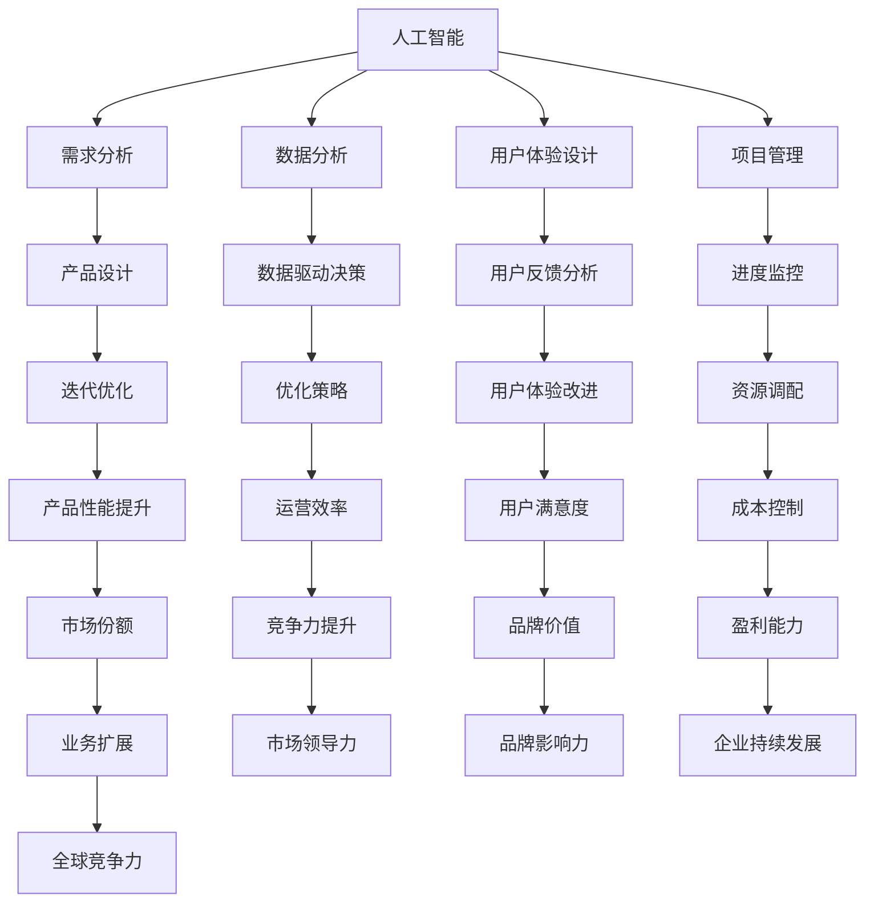

                 

# AI重构产品经理工作流程

> 关键词：人工智能、产品经理、工作流程、自动化、效率提升、数据分析、人机协作

> 摘要：随着人工智能技术的飞速发展，产品经理的工作流程正经历着深刻的变革。本文将探讨人工智能如何重构产品经理的日常工作，包括需求分析、产品设计、用户体验和项目管理等环节，以提升工作效率和产品品质。通过详细的分析和案例展示，本文将揭示人工智能在产品管理中的巨大潜力和应用前景。

## 1. 背景介绍

### 1.1 目的和范围

本文旨在探讨人工智能技术在产品管理中的应用，分析其在需求分析、产品设计、用户体验和项目管理等方面的潜在优势。本文将介绍人工智能技术的基本概念，探讨其与产品管理的结合点，并通过具体案例展示其应用效果。本文旨在为产品经理和相关从业者提供参考，帮助其更好地理解和应用人工智能技术。

### 1.2 预期读者

本文适合以下读者群体：

1. 产品经理和产品规划师
2. IT行业从业者，对人工智能技术有兴趣者
3. 对人工智能在产品管理中应用有研究的学者和研究人员

### 1.3 文档结构概述

本文分为十个部分：

1. 背景介绍
2. 核心概念与联系
3. 核心算法原理 & 具体操作步骤
4. 数学模型和公式 & 详细讲解 & 举例说明
5. 项目实战：代码实际案例和详细解释说明
6. 实际应用场景
7. 工具和资源推荐
8. 总结：未来发展趋势与挑战
9. 附录：常见问题与解答
10. 扩展阅读 & 参考资料

### 1.4 术语表

#### 1.4.1 核心术语定义

- 人工智能（AI）：模拟人类智能的计算机系统，能够感知、学习、推理和决策。
- 产品经理：负责产品的规划、设计、开发、上线和运营的专业人士。
- 工作流程：产品从构思到发布的各个阶段所需遵循的步骤和规范。

#### 1.4.2 相关概念解释

- 需求分析：确定产品功能、性能和用户体验的过程。
- 设计迭代：根据用户反馈和数据分析对产品进行修改和优化的过程。
- 项目管理：确保项目按时、按预算和按质量完成的一系列管理活动。

#### 1.4.3 缩略词列表

- AI：人工智能
- PM：产品经理
- UX：用户体验
- UI：用户界面

## 2. 核心概念与联系

在探讨人工智能如何重构产品经理的工作流程之前，我们需要了解一些核心概念和它们之间的联系。以下是一个简单的 Mermaid 流程图，展示了人工智能、产品管理和相关环节之间的交互关系：



### 2.1 人工智能在需求分析中的应用

人工智能可以通过自然语言处理（NLP）技术，对用户的需求进行深入分析和理解。例如，通过分析社交媒体、用户评论和反馈，AI 可以识别用户的关键需求和痛点。以下是一个简单的伪代码示例，展示如何使用 NLP 技术进行需求分析：

```python
import nltk

def analyze_user需求(text):
    # 使用NLP库对文本进行分词、词性标注和命名实体识别
    tokens = nltk.word_tokenize(text)
    pos_tags = nltk.pos_tag(tokens)
    entities = nltk.ne_chunk(pos_tags)
    
    # 提取用户需求和痛点
    needs = []
    for entity in entities:
        if isinstance(entity, nltk.tree.Tree) and entity.label() == "NOUN":
            needs.append(entity)
    
    return needs

# 示例文本
text = "我希望有一个可以记录健身数据的应用，它能够跟踪我的体重、饮食和锻炼情况。"
user需

