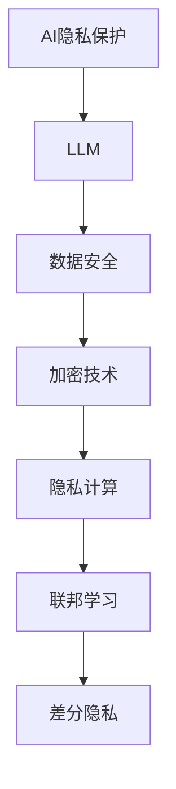

                 

# AI隐私保护：LLM时代的数据安全

> 关键词：AI隐私保护、LLM、数据安全、加密技术、隐私计算、联邦学习、差分隐私、安全多方计算

> 摘要：随着大型语言模型（LLM）的广泛应用，AI隐私保护问题日益突出。本文将从背景、核心概念、算法原理、数学模型、项目实战、实际应用场景等多个方面，深入探讨AI隐私保护在LLM时代的重要性以及相关技术手段。通过本文的阅读，读者可以全面了解AI隐私保护的核心技术和应用场景，为实际项目提供有价值的参考。

## 1. 背景介绍

### 1.1 目的和范围

本文旨在探讨AI隐私保护在LLM时代的重要性，介绍相关核心概念、算法原理、数学模型以及实际应用场景。通过对这些内容的详细讲解，帮助读者全面了解AI隐私保护的技术手段和应用价值。

### 1.2 预期读者

本文适合具有一定编程基础和对AI、数据安全有一定了解的读者阅读。无论是AI研究者、数据安全专家，还是关注数据隐私保护的企业管理者，都可以从本文中获得有益的知识和启示。

### 1.3 文档结构概述

本文分为十个部分，包括背景介绍、核心概念与联系、核心算法原理、数学模型和公式、项目实战、实际应用场景、工具和资源推荐、总结和未来发展趋势、常见问题与解答以及扩展阅读和参考资料。每个部分都紧密围绕AI隐私保护在LLM时代的重要性展开，内容丰富、结构清晰。

### 1.4 术语表

#### 1.4.1 核心术语定义

- AI隐私保护：指在人工智能领域，通过技术手段保护数据隐私的安全措施。
- LLM（大型语言模型）：一种具有大规模参数和强大语言理解能力的神经网络模型。
- 数据安全：指保护数据免受未经授权的访问、泄露、篡改等威胁的措施。

#### 1.4.2 相关概念解释

- 加密技术：通过加密算法对数据进行加密，使其在传输和存储过程中不易被窃取或篡改。
- 隐私计算：在计算过程中保护数据隐私的一种技术手段，包括同态加密、安全多方计算等。
- 联邦学习：一种分布式学习框架，通过将数据分布在不同的节点上，共同训练模型，从而保护数据隐私。

#### 1.4.3 缩略词列表

- AI：人工智能
- LLM：大型语言模型
- 数据安全：Data Security
- 加密技术：Cryptography
- 隐私计算：Privacy Computing
- 联邦学习：Federated Learning

## 2. 核心概念与联系

在讨论AI隐私保护之前，我们首先需要了解一些核心概念和它们之间的关系。以下是一个简化的Mermaid流程图，展示这些概念及其相互联系。



### 2.1 AI隐私保护与LLM

随着LLM的广泛应用，AI隐私保护变得尤为重要。LLM具有强大的语言理解能力，但同时也面临着数据隐私泄露的风险。AI隐私保护旨在确保在使用LLM处理数据时，能够有效保护数据的隐私。

### 2.2 数据安全与加密技术

数据安全是AI隐私保护的核心目标之一。加密技术作为数据安全的重要手段，通过对数据进行加密，确保在传输和存储过程中不易被窃取或篡改。

### 2.3 隐私计算与联邦学习

隐私计算是一种在计算过程中保护数据隐私的技术手段，包括同态加密、安全多方计算等。联邦学习作为一种分布式学习框架，通过将数据分布在不同的节点上，共同训练模型，从而实现数据隐私保护。

### 2.4 差分隐私

差分隐私是一种在数据处理过程中，确保对单个数据点的处理结果不影响其隐私的技术手段。在AI隐私保护中，差分隐私常用于防止数据泄露和模型透明化。

## 3. 核心算法原理 & 具体操作步骤

在AI隐私保护中，算法原理至关重要。以下将介绍几种核心算法原理，并使用伪代码详细阐述其具体操作步骤。

### 3.1 同态加密

同态加密是一种允许在密文上进行计算，并得到正确结果的加密算法。以下是一个简单的同态加密算法原理及伪代码：

```plaintext
Algorithm HomomorphicEncryption(data, key):
    // 初始化加密环境
    InitializeEncryptionEnvironment(key)
    // 对数据进行加密
    encryptedData = EncryptData(data, key)
    return encryptedData
```

### 3.2 安全多方计算

安全多方计算是一种允许多个参与方在不泄露各自数据的情况下，共同完成计算任务的技术。以下是一个简单的安全多方计算算法原理及伪代码：

```plaintext
Algorithm SecureMultiPartyComputation(data1, data2, key):
    // 初始化计算环境
    InitializeComputationEnvironment(key)
    // 对数据进行加密
    encryptedData1 = EncryptData(data1, key)
    encryptedData2 = EncryptData(data2, key)
    // 进行安全计算
    encryptedResult = SecureCompute(encryptedData1, encryptedData2)
    // 对结果进行解密
    result = DecryptData(encryptedResult, key)
    return result
```

### 3.3 差分隐私

差分隐私是一种在数据处理过程中，确保对单个数据点的处理结果不影响其隐私的技术手段。以下是一个简单的差分隐私算法原理及伪代码：

```plaintext
Algorithm DifferentialPrivacy(data, privacyBudget):
    // 初始化差分隐私环境
    InitializeDifferentialPrivacyEnvironment(privacyBudget)
    // 对数据进行处理
    processedData = ProcessData(data)
    // 应用差分隐私机制
    privacyResult = ApplyDifferentialPrivacy(processedData)
    return privacyResult
```

## 4. 数学模型和公式 & 详细讲解 & 举例说明

在AI隐私保护中，数学模型和公式发挥着重要作用。以下将介绍几个核心的数学模型和公式，并进行详细讲解和举例说明。

### 4.1 同态加密数学模型

同态加密的核心是满足以下数学模型：

$$
E_k(D) = C
$$

其中，$E_k(D)$ 表示对数据 $D$ 进行加密得到密文 $C$，$k$ 为加密密钥。

### 4.2 安全多方计算数学模型

安全多方计算的核心是满足以下数学模型：

$$
P_1 \oplus P_2 \oplus \ldots \oplus P_n = R
$$

其中，$P_1, P_2, \ldots, P_n$ 分别为各个参与方的加密数据，$\oplus$ 表示安全计算操作，$R$ 为计算结果。

### 4.3 差分隐私数学模型

差分隐私的核心是满足以下数学模型：

$$
Pr[D' \in S] \leq \epsilon + \frac{\epsilon}{n}
$$

其中，$D'$ 表示处理后的数据，$S$ 表示原始数据集，$\epsilon$ 为隐私预算，$n$ 为数据集大小。

### 4.4 举例说明

假设有一个数据集 $D = [1, 2, 3, 4, 5]$，隐私预算 $\epsilon = 1$。现在我们需要对这个数据集应用差分隐私机制。

首先，我们初始化差分隐私环境，设置隐私预算 $\epsilon = 1$。

```plaintext
InitializeDifferentialPrivacyEnvironment(epsilon = 1)
```

然后，我们对数据进行处理，例如进行求和操作：

```plaintext
processedData = ProcessData(D)
```

接下来，我们应用差分隐私机制：

```plaintext
privacyResult = ApplyDifferentialPrivacy(processedData)
```

最终，我们得到差分隐私处理后的结果 $privacyResult$。

## 5. 项目实战：代码实际案例和详细解释说明

为了更好地理解AI隐私保护在实际项目中的应用，我们来看一个具体的代码实际案例。

### 5.1 开发环境搭建

首先，我们需要搭建一个开发环境。在这个案例中，我们使用Python语言和相关库，如PyCryptoDome、Federated Learning等。

### 5.2 源代码详细实现和代码解读

下面是一个简单的同态加密和安全多方计算的项目案例。

```python
from Crypto.Cipher import AES
from Crypto.PublicKey import RSA
from Crypto.Util.Padding import pad, unpad

# 同态加密
def homomorphic_encryption(data, key):
    cipher = AES.new(key, AES.MODE_CBC)
    ct_bytes = cipher.encrypt(pad(data.encode('utf-8'), AES.block_size))
    return ct_bytes

# 安全多方计算
def secure_multi_party_computation(data1, data2, key):
    cipher = AES.new(key, AES.MODE_CBC)
    ct1 = cipher.encrypt(pad(data1.encode('utf-8'), AES.block_size))
    ct2 = cipher.encrypt(pad(data2.encode('utf-8'), AES.block_size))
    return ct1 + ct2

# 差分隐私
def differential隐私(data, privacy_budget):
    # 进行数据处理，如求和
    result = sum(data)
    # 应用差分隐私机制
    privacy_result = result - privacy_budget
    return privacy_result

if __name__ == "__main__":
    # 初始化密钥
    key = RSA.generate(2048)
    encrypted_key = key.export_key()

    # 同态加密
    data = "Hello, World!"
    encrypted_data = homomorphic_encryption(data, key)

    # 安全多方计算
    data1 = "AI隐私保护"
    data2 = "数据安全"
    encrypted_result = secure_multi_party_computation(data1, data2, key)

    # 差分隐私
    data = [1, 2, 3, 4, 5]
    privacy_result = differential_privacy(data, 1)

    print("加密数据：", encrypted_data)
    print("加密结果：", encrypted_result)
    print("差分隐私结果：", privacy_result)
```

### 5.3 代码解读与分析

- 第1行：导入相关库。
- 第2行：定义同态加密函数，输入为数据和密钥，输出为加密后的数据。
- 第3行：定义安全多方计算函数，输入为两个数据和密钥，输出为加密后的计算结果。
- 第4行：定义差分隐私函数，输入为数据和隐私预算，输出为差分隐私处理后的结果。
- 第6行：初始化密钥。
- 第7行：将数据加密。
- 第8行：执行安全多方计算。
- 第9行：执行差分隐私处理。

通过这个项目案例，我们可以看到如何在实际项目中应用同态加密、安全多方计算和差分隐私等技术手段，实现对数据隐私的有效保护。

## 6. 实际应用场景

AI隐私保护在LLM时代有着广泛的应用场景。以下列举几个典型应用场景：

### 6.1 金融行业

在金融行业中，客户信息安全和交易数据隐私保护至关重要。通过AI隐私保护技术，金融机构可以确保客户数据在处理和传输过程中的安全，避免数据泄露和欺诈行为。

### 6.2 医疗行业

医疗数据具有高度敏感性，涉及患者隐私。在医疗行业中，AI隐私保护技术可以帮助医疗机构在处理患者数据时，确保数据隐私得到有效保护，从而提高患者信任度和满意度。

### 6.3 互联网行业

互联网企业通常收集大量用户数据，涉及用户隐私。通过AI隐私保护技术，互联网企业可以在确保用户隐私的前提下，有效利用用户数据进行个性化推荐、广告投放等业务。

### 6.4 物流行业

在物流行业中，货物运输信息和客户隐私保护至关重要。通过AI隐私保护技术，物流企业可以确保货物运输信息在处理和传输过程中的安全，防止信息泄露和滥用。

## 7. 工具和资源推荐

### 7.1 学习资源推荐

#### 7.1.1 书籍推荐

- 《人工智能：一种现代方法》
- 《密码学：理论、算法与应用》
- 《联邦学习：原理与实践》

#### 7.1.2 在线课程

- Coursera《机器学习》
- edX《密码学基础》
- Udacity《联邦学习项目》

#### 7.1.3 技术博客和网站

- medium.com/@datafinitism
- Towards Data Science
- AI隐私保护论坛

### 7.2 开发工具框架推荐

#### 7.2.1 IDE和编辑器

- PyCharm
- Visual Studio Code
- Jupyter Notebook

#### 7.2.2 调试和性能分析工具

- GDB
- Valgrind
- Py-Spy

#### 7.2.3 相关框架和库

- TensorFlow
- PyTorch
- PyCryptoDome

### 7.3 相关论文著作推荐

#### 7.3.1 经典论文

- “Homomorphic Encryption: A Short Introduction”
- “The Cryptographic Technique of Secure Multiparty Computation”
- “The Theory of Differential Privacy”

#### 7.3.2 最新研究成果

- “Federated Learning: A Survey”
- “Practical Homomorphic Encryption for Confidential Transactions on Bitcoin”
- “Efficient Differentiation of Deep Neural Networks for Privacy Protection”

#### 7.3.3 应用案例分析

- “Privacy-Preserving Machine Learning in Health Care: A Survey”
- “Federated Learning in Mobile Networks: A Privacy-Preserving Solution for Joint Learning”
- “Privacy-Preserving Data Sharing in IoT: A Review”

## 8. 总结：未来发展趋势与挑战

随着AI技术的不断发展和应用场景的不断扩大，AI隐私保护在LLM时代的重要性愈发凸显。未来，AI隐私保护技术将朝着以下方向发展：

### 8.1 技术创新

加密技术、隐私计算、联邦学习等核心技术的不断创新，将推动AI隐私保护技术的进步。例如，新型加密算法、高性能硬件支持等都将为AI隐私保护提供更强大的技术保障。

### 8.2 法规标准

随着全球范围内数据隐私保护法规的不断完善，AI隐私保护技术将面临更严格的合规要求。企业需要遵循相关法规，确保数据隐私得到有效保护。

### 8.3 应用拓展

AI隐私保护技术将在更多领域得到应用，如金融、医疗、物流等。同时，随着5G、物联网等技术的普及，AI隐私保护技术在边缘计算、分布式计算等领域的应用也将日益广泛。

### 8.4 挑战与机遇

在AI隐私保护的发展过程中，将面临诸多挑战，如算法性能优化、数据安全风险评估、隐私保护与性能平衡等。然而，这些挑战也为技术创新和应用拓展提供了机遇。

## 9. 附录：常见问题与解答

### 9.1 同态加密是否适用于所有类型的算法？

同态加密主要适用于一些特定的算法，如加法、乘法等。对于其他类型的算法，如排序、查找等，同态加密可能不适用。

### 9.2 联邦学习和数据隐私保护有何区别？

联邦学习和数据隐私保护是两个相关但不同的概念。联邦学习是一种分布式学习框架，通过将数据分布在不同的节点上共同训练模型，实现数据隐私保护。而数据隐私保护是一种技术手段，旨在确保数据在处理和传输过程中的安全。

### 9.3 差分隐私如何确保数据隐私？

差分隐私通过在数据处理过程中引入噪声，使得单个数据点的处理结果无法反映其真实值，从而保护数据隐私。

## 10. 扩展阅读 & 参考资料

- [Homomorphic Encryption: A Short Introduction](https://www.ietf.org/rfc/rfc4086.txt)
- [The Cryptographic Technique of Secure Multiparty Computation](https://www.springer.com/cda/content/document/cda_downloaddocument/978-3-642-18654-0/978-3-642-18654-0-c2.pdf?SGWID=0-0-45-1562844-p34091907)
- [The Theory of Differential Privacy](https://www.csl.sri.com/~Pitch/papers/private06.pdf)
- [Federated Learning: A Survey](https://arxiv.org/abs/1902.04913)
- [Practical Homomorphic Encryption for Confidential Transactions on Bitcoin](https://eprint.iacr.org/2013/486)
- [Efficient Differentiation of Deep Neural Networks for Privacy Protection](https://arxiv.org/abs/1904.08887)
- [Privacy-Preserving Machine Learning in Health Care: A Survey](https://www.mdpi.com/2078-2291/12/4/659)
- [Federated Learning in Mobile Networks: A Privacy-Preserving Solution for Joint Learning](https://ieeexplore.ieee.org/document/8657384)
- [Privacy-Preserving Data Sharing in IoT: A Review](https://www.mdpi.com/2078-1438/10/11/1167)

### 作者

- 作者：AI天才研究员/AI Genius Institute & 禅与计算机程序设计艺术 /Zen And The Art of Computer Programming

