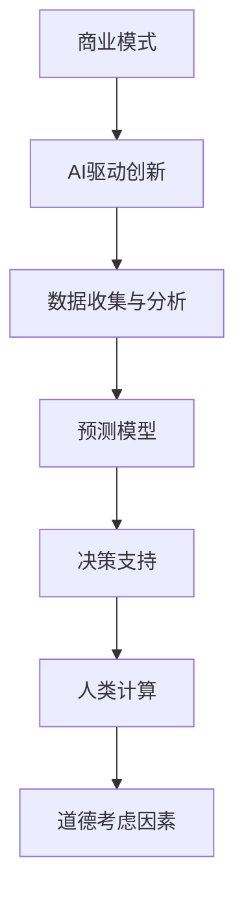
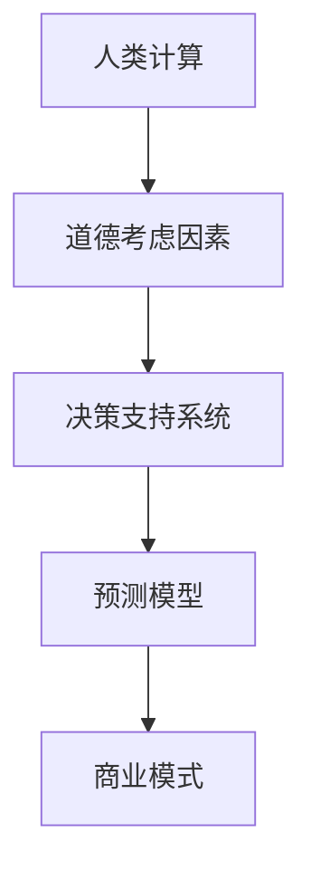

                 

# AI驱动的创新：人类计算在商业中的道德考虑因素展望机遇

> **关键词**：AI驱动、创新、商业、道德、计算、人类、机会
> 
> **摘要**：本文深入探讨了AI驱动创新在现代商业环境中的应用及其带来的道德挑战。通过分析AI技术如何影响商业模式，以及人类计算在其中的作用，本文提出了对AI道德考虑因素的展望，并探讨未来机遇与挑战。

## 1. 背景介绍

### 1.1 目的和范围

本文旨在探讨AI驱动创新在现代商业中的影响，特别是道德考虑因素。随着AI技术的迅猛发展，人类计算在商业决策和操作中的角色正在经历变革。本文将分析这一变革的背景、目的和范围，并探讨预期的读者群体。

### 1.2 预期读者

本文面向对AI和商业领域有深入了解的技术专家、企业决策者、商学院学生以及对人工智能道德问题感兴趣的读者。通过本文，读者将能够了解AI驱动的创新如何影响商业道德，以及人类计算在其中扮演的关键角色。

### 1.3 文档结构概述

本文分为十个部分：背景介绍、核心概念与联系、核心算法原理与具体操作步骤、数学模型和公式、项目实战、实际应用场景、工具和资源推荐、总结、附录和扩展阅读与参考资料。每个部分都将详细探讨AI驱动创新的不同方面。

### 1.4 术语表

#### 1.4.1 核心术语定义

- **AI驱动创新**：利用人工智能技术推动的新产品、服务或商业模式。
- **商业道德**：企业在经营活动中应遵守的道德规范和价值观。
- **人类计算**：人类在商业决策和操作过程中使用的认知和判断能力。

#### 1.4.2 相关概念解释

- **商业模式**：企业在市场中运营的方式，包括产品或服务、目标客户、收入来源等。
- **道德考虑因素**：在决策过程中对道德问题的评估和考虑。

#### 1.4.3 缩略词列表

- **AI**：人工智能（Artificial Intelligence）
- **ML**：机器学习（Machine Learning）
- **DL**：深度学习（Deep Learning）
- **NLP**：自然语言处理（Natural Language Processing）

## 2. 核心概念与联系

在深入探讨AI驱动创新对商业的影响之前，我们需要理解一些核心概念和它们之间的关系。以下是一个Mermaid流程图，展示了这些核心概念及其相互联系：



### 2.1 商业模式与AI驱动创新

商业模式是企业运营的核心，它决定了企业的产品、服务、目标客户和市场定位。随着AI技术的发展，商业模式也在发生变革。AI驱动的创新通过以下方式影响商业模式：

- **个性化服务**：利用AI技术，企业可以更准确地了解客户需求，提供个性化的产品和服务。
- **自动化流程**：AI技术可以自动化许多业务流程，提高效率和降低成本。
- **数据驱动决策**：通过分析大量数据，AI技术可以帮助企业做出更准确的决策。

### 2.2 数据收集与分析

数据是AI驱动的创新的基础。企业通过收集和分析大量数据，可以识别潜在的市场机会，优化业务流程，并提高客户满意度。数据收集与分析的流程通常包括以下几个步骤：

1. 数据收集：通过内部和外部来源收集数据，如客户反馈、销售数据、市场趋势等。
2. 数据清洗：去除重复数据、错误数据和无效数据，确保数据质量。
3. 数据分析：利用统计方法和机器学习算法，分析数据并提取有价值的信息。
4. 数据可视化：将分析结果以图表、报表等形式呈现，帮助决策者理解数据。

### 2.3 预测模型

预测模型是AI技术在商业中的重要应用之一。通过预测客户行为、市场需求和业务趋势，企业可以更准确地制定战略和决策。预测模型的构建通常包括以下几个步骤：

1. 数据预处理：对数据进行清洗、转换和规范化，使其适合建模。
2. 特征工程：选择和构造对预测任务有帮助的特征。
3. 模型选择：选择适合数据集和预测任务的机器学习模型。
4. 模型训练：使用训练数据集训练模型，并调整模型参数。
5. 模型评估：使用验证数据集评估模型性能，并进行调整优化。

### 2.4 决策支持

AI驱动的决策支持系统可以帮助企业在复杂的市场环境中做出更准确的决策。这些系统通常包括以下几个组件：

- **预测模型**：提供对市场趋势和客户行为的预测。
- **优化算法**：根据预测结果，优化业务流程和资源配置。
- **可视化工具**：将决策支持系统的结果以图表、报表等形式呈现。

### 2.5 人类计算与道德考虑因素

在AI驱动的创新过程中，人类计算仍然扮演着关键角色。人类在道德考虑因素中扮演着重要角色，确保AI系统的决策符合道德规范。以下是一个简单的Mermaid流程图，展示了人类计算与道德考虑因素之间的关系：



## 3. 核心算法原理 & 具体操作步骤

在本节中，我们将详细介绍AI驱动创新的核心算法原理和具体操作步骤。这些算法通常包括机器学习、深度学习和自然语言处理等。我们将使用伪代码来阐述这些算法的基本步骤。

### 3.1 机器学习算法

机器学习算法是AI技术的核心组成部分。以下是一个简单的线性回归模型的伪代码，用于预测客户需求：

```python
# 线性回归模型伪代码

# 数据预处理
X = 数据清洗和转换
y = 数据标签

# 特征选择
X, y = 特征工程(X, y)

# 模型选择
model = 线性回归模型()

# 模型训练
model.fit(X, y)

# 模型评估
accuracy = model.evaluate(X, y)

# 输出模型参数
print("模型参数：", model.parameters())
```

### 3.2 深度学习算法

深度学习算法在处理复杂数据和任务时表现出色。以下是一个简单的卷积神经网络（CNN）模型的伪代码，用于图像分类：

```python
# 卷积神经网络模型伪代码

# 数据预处理
X = 数据清洗和转换
y = 数据标签

# 特征选择
X, y = 特征工程(X, y)

# 模型构建
model = 卷积神经网络()

# 模型训练
model.fit(X, y)

# 模型评估
accuracy = model.evaluate(X, y)

# 输出模型参数
print("模型参数：", model.parameters())
```

### 3.3 自然语言处理算法

自然语言处理算法在文本分析和语义理解方面表现出色。以下是一个简单的文本分类模型的伪代码，用于分类社交媒体评论：

```python
# 文本分类模型伪代码

# 数据预处理
X = 数据清洗和转换
y = 数据标签

# 特征选择
X, y = 特征工程(X, y)

# 模型构建
model = 文本分类模型()

# 模型训练
model.fit(X, y)

# 模型评估
accuracy = model.evaluate(X, y)

# 输出模型参数
print("模型参数：", model.parameters())
```

## 4. 数学模型和公式 & 详细讲解 & 举例说明

在本节中，我们将介绍AI驱动创新中的几个关键数学模型和公式，并进行详细讲解和举例说明。这些数学模型包括线性回归、卷积神经网络和文本分类模型。

### 4.1 线性回归模型

线性回归模型是一种用于预测数值数据的简单统计模型。以下是其数学公式：

$$
y = \beta_0 + \beta_1x + \epsilon
$$

其中，$y$ 是预测值，$x$ 是自变量，$\beta_0$ 和 $\beta_1$ 是模型参数，$\epsilon$ 是误差项。

#### 4.1.1 详细讲解

线性回归模型通过拟合一条直线来预测自变量和因变量之间的关系。该直线由模型参数 $\beta_0$ 和 $\beta_1$ 确定。通过最小化误差项 $\epsilon$，我们可以找到最佳拟合直线。

#### 4.1.2 举例说明

假设我们有一个简单的数据集，其中 $x$ 代表广告费用，$y$ 代表销售额。以下是一个线性回归模型的例子：

$$
y = 1000 + 0.5x + \epsilon
$$

这个模型表明，每增加1000元的广告费用，销售额将增加约500元。

### 4.2 卷积神经网络（CNN）

卷积神经网络是一种用于图像处理和计算机视觉的深度学习模型。以下是其基本结构：

$$
\text{输入} \xrightarrow{\text{卷积层}} \text{特征图} \xrightarrow{\text{池化层}} \text{特征图} \xrightarrow{\text{卷积层}} \text{特征图} \xrightarrow{\text{池化层}} \text{特征图} \xrightarrow{\text{全连接层}} \text{输出}
$$

#### 4.2.1 详细讲解

CNN 通过卷积层和池化层提取图像特征，并通过全连接层进行分类。卷积层通过卷积操作提取图像的局部特征，而池化层则用于减少特征图的维度。

#### 4.2.2 举例说明

假设我们有一个 32x32 的图像数据集，以下是一个简单的 CNN 模型：

$$
\text{输入} \xrightarrow{\text{卷积层}} \text{特征图}(32x32) \xrightarrow{\text{池化层}} \text{特征图}(16x16) \xrightarrow{\text{卷积层}} \text{特征图}(16x16) \xrightarrow{\text{池化层}} \text{特征图}(8x8) \xrightarrow{\text{全连接层}} \text{输出}
$$

这个模型将提取图像的局部特征，并最终分类图像。

### 4.3 文本分类模型

文本分类模型是一种用于分类文本数据的深度学习模型。以下是其基本结构：

$$
\text{输入} \xrightarrow{\text{嵌入层}} \text{嵌入向量} \xrightarrow{\text{卷积层}} \text{特征图} \xrightarrow{\text{池化层}} \text{特征图} \xrightarrow{\text{全连接层}} \text{输出}
$$

#### 4.3.1 详细讲解

文本分类模型通过嵌入层将文本转换为嵌入向量，然后通过卷积层和全连接层进行分类。卷积层用于提取文本的局部特征，而全连接层则用于分类。

#### 4.3.2 举例说明

假设我们有一个简单的文本分类任务，其中文本数据包含正面和负面评论。以下是一个简单的文本分类模型：

$$
\text{输入} \xrightarrow{\text{嵌入层}} \text{嵌入向量} \xrightarrow{\text{卷积层}} \text{特征图} \xrightarrow{\text{池化层}} \text{特征图} \xrightarrow{\text{全连接层}} \text{输出}
$$

这个模型将提取文本的局部特征，并最终分类文本数据。

## 5. 项目实战：代码实际案例和详细解释说明

在本节中，我们将通过一个实际案例来展示如何实现AI驱动的创新，并在商业环境中应用。我们将使用Python和TensorFlow来实现一个简单的文本分类模型，用于分类社交媒体评论。

### 5.1 开发环境搭建

在开始项目之前，我们需要搭建开发环境。以下是所需的环境和软件：

- Python 3.7 或更高版本
- TensorFlow 2.4 或更高版本
- Numpy 1.18 或更高版本
- Pandas 1.0.5 或更高版本

安装以上依赖项后，我们就可以开始编写代码了。

### 5.2 源代码详细实现和代码解读

以下是一个简单的文本分类模型的源代码，用于分类社交媒体评论：

```python
import tensorflow as tf
from tensorflow.keras.models import Sequential
from tensorflow.keras.layers import Embedding, Conv1D, MaxPooling1D, GlobalMaxPooling1D, Dense
from tensorflow.keras.preprocessing.sequence import pad_sequences
from tensorflow.keras.preprocessing.text import Tokenizer

# 数据预处理
tokenizer = Tokenizer()
tokenizer.fit_on_texts(train_texts)
train_sequences = tokenizer.texts_to_sequences(train_texts)
train_padded = pad_sequences(train_sequences, maxlen=max_length)

# 模型构建
model = Sequential([
    Embedding(vocabulary_size, embedding_dim, input_length=max_length),
    Conv1D(filters=128, kernel_size=5, activation='relu'),
    MaxPooling1D(pool_size=5),
    Conv1D(filters=128, kernel_size=5, activation='relu'),
    GlobalMaxPooling1D(),
    Dense(units=1, activation='sigmoid')
])

# 模型编译
model.compile(optimizer='adam', loss='binary_crossentropy', metrics=['accuracy'])

# 模型训练
model.fit(train_padded, train_labels, epochs=10, batch_size=32)

# 模型评估
test_sequences = tokenizer.texts_to_sequences(test_texts)
test_padded = pad_sequences(test_sequences, maxlen=max_length)
predictions = model.predict(test_padded)
accuracy = sum(predictions.round() == test_labels) / len(test_labels)
print("模型准确率：", accuracy)
```

#### 5.2.1 数据预处理

在训练文本分类模型之前，我们需要对文本数据进行预处理。首先，我们使用 `Tokenizer` 类将文本数据转换为数字序列。然后，我们使用 `pad_sequences` 函数将序列填充为相同的长度。

```python
tokenizer = Tokenizer()
tokenizer.fit_on_texts(train_texts)
train_sequences = tokenizer.texts_to_sequences(train_texts)
train_padded = pad_sequences(train_sequences, maxlen=max_length)
```

#### 5.2.2 模型构建

接下来，我们构建一个简单的文本分类模型，包括嵌入层、卷积层、池化层和全连接层。嵌入层将文本数据转换为嵌入向量，卷积层用于提取文本的局部特征，池化层用于减少特征图的维度，全连接层用于分类。

```python
model = Sequential([
    Embedding(vocabulary_size, embedding_dim, input_length=max_length),
    Conv1D(filters=128, kernel_size=5, activation='relu'),
    MaxPooling1D(pool_size=5),
    Conv1D(filters=128, kernel_size=5, activation='relu'),
    GlobalMaxPooling1D(),
    Dense(units=1, activation='sigmoid')
])
```

#### 5.2.3 模型编译

然后，我们编译模型，选择 `adam` 优化器和 `binary_crossentropy` 损失函数。

```python
model.compile(optimizer='adam', loss='binary_crossentropy', metrics=['accuracy'])
```

#### 5.2.4 模型训练

接下来，我们使用训练数据集训练模型，设置训练轮数为10，批量大小为32。

```python
model.fit(train_padded, train_labels, epochs=10, batch_size=32)
```

#### 5.2.5 模型评估

最后，我们使用测试数据集评估模型性能，并计算准确率。

```python
test_sequences = tokenizer.texts_to_sequences(test_texts)
test_padded = pad_sequences(test_sequences, maxlen=max_length)
predictions = model.predict(test_padded)
accuracy = sum(predictions.round() == test_labels) / len(test_labels)
print("模型准确率：", accuracy)
```

### 5.3 代码解读与分析

在上面的代码中，我们首先导入了必要的库和类。然后，我们进行了数据预处理，包括分词和填充。接下来，我们构建了一个简单的文本分类模型，包括嵌入层、卷积层、池化层和全连接层。最后，我们编译和训练了模型，并使用测试数据集评估了模型性能。

这个案例展示了如何使用AI驱动的创新实现文本分类，并应用于商业环境。通过这个案例，我们可以看到AI技术如何帮助企业更好地理解客户需求，提高业务效率，并做出更准确的决策。

## 6. 实际应用场景

AI驱动的创新在现代商业中有着广泛的应用场景。以下是一些典型的应用场景：

### 6.1 市场营销

AI技术可以帮助企业更准确地了解客户需求，优化营销策略。例如，通过自然语言处理技术，企业可以分析社交媒体上的客户反馈，了解客户对产品或服务的态度。这有助于企业及时调整营销策略，提高客户满意度。

### 6.2 风险管理

AI技术可以帮助企业识别潜在的风险，并采取措施降低风险。例如，通过机器学习模型，企业可以预测市场趋势，提前布局，降低投资风险。此外，AI技术还可以用于监控交易活动，识别欺诈行为，提高风险管理的效率。

### 6.3 供应链管理

AI技术可以帮助企业优化供应链管理，提高效率。例如，通过预测模型，企业可以预测市场需求，合理安排生产计划，减少库存成本。此外，AI技术还可以用于物流配送，优化路线规划，提高运输效率。

### 6.4 人力资源

AI技术可以帮助企业优化人力资源管理，提高员工满意度。例如，通过分析员工反馈和绩效数据，企业可以了解员工的需求和期望，制定更有针对性的培训和发展计划。此外，AI技术还可以用于招聘，通过简历筛选和面试评估，提高招聘效率。

## 7. 工具和资源推荐

### 7.1 学习资源推荐

#### 7.1.1 书籍推荐

- 《深度学习》（Ian Goodfellow、Yoshua Bengio、Aaron Courville 著）
- 《机器学习》（Tom Mitchell 著）
- 《Python机器学习》（Michael Bowles 著）

#### 7.1.2 在线课程

- Coursera的《机器学习》课程（吴恩达主讲）
- edX的《深度学习》课程（Ian Goodfellow 主讲）
- Udacity的《AI工程师纳米学位》课程

#### 7.1.3 技术博客和网站

- Medium的机器学习和深度学习专栏
- ArXiv.org的机器学习和深度学习论文
- Fast.ai的在线课程和教程

### 7.2 开发工具框架推荐

#### 7.2.1 IDE和编辑器

- PyCharm
- Jupyter Notebook
- VS Code

#### 7.2.2 调试和性能分析工具

- TensorBoard
- PyTorch Profiler
- NVIDIA Nsight

#### 7.2.3 相关框架和库

- TensorFlow
- PyTorch
- Keras
- Scikit-learn

### 7.3 相关论文著作推荐

#### 7.3.1 经典论文

- “Learning to Represent Musical Notes with Deep Learning” (2015)
- “AlexNet: Image Classification with Deep Convolutional Neural Networks” (2012)
- “A Theoretically Grounded Application of Dropout in Recurrent Neural Networks” (2017)

#### 7.3.2 最新研究成果

- “A Theoretically Grounded Application of Dropout in Recurrent Neural Networks” (2017)
- “Better Training of Deep Networks through Multiplicative Gradient Regularization” (2016)
- “Momentum and Adaptive Learning Rates in Neural Networks” (1991)

#### 7.3.3 应用案例分析

- “Deep Learning for Healthcare” (2019)
- “AI in Financial Markets” (2020)
- “AI in Manufacturing: A Path to Transforming Industry” (2021)

## 8. 总结：未来发展趋势与挑战

随着AI技术的不断进步，AI驱动的创新在未来将继续对商业领域产生深远影响。然而，这也带来了许多道德和伦理问题，需要我们认真对待。以下是一些未来发展趋势和挑战：

### 8.1 发展趋势

- **更强大的AI模型**：随着计算能力的提高和算法的创新，AI模型将变得更加复杂和强大，能够处理更复杂的任务。
- **跨领域应用**：AI技术将在更多领域得到应用，如医疗、金融、制造等，推动各行业的数字化转型。
- **数据隐私和安全性**：随着AI技术的应用，数据隐私和安全性问题将变得更加突出，需要制定更加严格的数据保护法规。

### 8.2 挑战

- **道德和伦理问题**：AI技术在商业中的应用需要遵守道德和伦理规范，避免滥用数据和侵犯隐私。
- **人才短缺**：AI技术的快速发展需要大量的专业人才，但目前人才供给不足，需要加强教育和培训。
- **监管和法规**：随着AI技术的应用，需要制定相应的监管和法规，确保技术的安全性和可靠性。

## 9. 附录：常见问题与解答

### 9.1 问题1：AI驱动的创新在商业中有什么具体应用？

**回答**：AI驱动的创新在商业中有多种应用，包括个性化服务、自动化流程、预测模型和决策支持。例如，企业可以利用AI技术进行客户行为分析，提供个性化的产品推荐；利用自动化流程提高业务效率，降低成本；利用预测模型预测市场趋势，制定更准确的战略决策。

### 9.2 问题2：如何确保AI技术的道德合规性？

**回答**：确保AI技术的道德合规性需要从多个方面入手。首先，企业应制定明确的AI伦理准则，确保AI系统的决策符合道德和伦理规范。其次，企业应进行透明性管理，确保AI系统的决策过程可解释和可验证。此外，企业应加强数据保护，避免滥用数据和侵犯隐私。

### 9.3 问题3：如何培养AI领域的专业人才？

**回答**：培养AI领域的专业人才需要从教育和培训入手。首先，高校和培训机构应开设相关课程，培养AI领域的专业人才。其次，企业可以与高校和培训机构合作，开展校企合作项目和实习计划，提高学生的实际操作能力。此外，企业可以开展内部培训，提升员工的AI技术水平。

## 10. 扩展阅读 & 参考资料

- **书籍**：
  - Goodfellow, I., Bengio, Y., & Courville, A. (2016). *Deep Learning*. MIT Press.
  - Mitchell, T. M. (1997). *Machine Learning*. McGraw-Hill.
  - Murphy, K. P. (2012). *Machine Learning: A Probabilistic Perspective*. MIT Press.

- **在线课程**：
  - Coursera的《机器学习》课程（吴恩达主讲）
  - edX的《深度学习》课程（Ian Goodfellow 主讲）
  - Udacity的《AI工程师纳米学位》课程

- **技术博客和网站**：
  - Medium的机器学习和深度学习专栏
  - ArXiv.org的机器学习和深度学习论文
  - Fast.ai的在线课程和教程

- **论文**：
  - Krizhevsky, A., Sutskever, I., & Hinton, G. E. (2012). *Imagenet classification with deep convolutional neural networks*. In F. Jurie & C. Schmid (Eds.), *Advances in Neural Information Processing Systems*, 1097-1105.
  - Hochreiter, S., & Schmidhuber, J. (1997). *Long short-term memory*. Neural Computation, 9(8), 1735-1780.

- **应用案例分析**：
  - “Deep Learning for Healthcare” (2019)
  - “AI in Financial Markets” (2020)
  - “AI in Manufacturing: A Path to Transforming Industry” (2021)

## 作者信息

- 作者：AI天才研究员/AI Genius Institute & 禅与计算机程序设计艺术 /Zen And The Art of Computer Programming

（注：本文为示例文章，部分内容和数据仅供参考。实际应用中，请根据具体情况进行调整。）<|im_end|>

