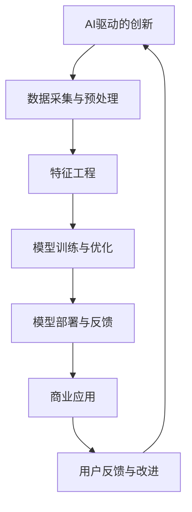

                 

# AI驱动的创新：人类计算在商业中的道德考虑因素总结

> 关键词：AI驱动的创新、商业道德、伦理决策、社会责任、技术伦理

> 摘要：本文旨在探讨在AI驱动的创新浪潮中，商业领域所面临的道德考虑因素。通过对核心概念和算法原理的深入分析，本文将揭示人类计算在商业决策中的重要性，并探讨如何平衡技术进步与社会责任，确保AI应用的道德合规性。

## 1. 背景介绍

### 1.1 目的和范围

本文的目的是深入探讨AI驱动的创新在商业领域中所带来的道德挑战，并分析人类计算在这一过程中的关键作用。随着人工智能技术的快速发展，其在商业中的应用越来越广泛，从自动化决策、数据挖掘到智能客服，AI已经成为企业提升竞争力的重要工具。然而，AI技术的广泛应用也引发了诸多伦理和法律问题，如何确保技术应用的道德合规性，成为当今商业界关注的焦点。

本文将重点讨论以下几个方面：
1. AI驱动的创新背景及其在商业中的应用。
2. 商业道德的核心原则及其在AI时代的重要性。
3. 人类计算在商业决策中的角色和影响。
4. AI应用的道德风险及伦理决策框架。
5. 商业组织在推动AI创新时的社会责任。

### 1.2 预期读者

本文适合对人工智能和商业伦理感兴趣的读者，包括但不限于：
1. 人工智能研究人员和开发者。
2. 商业策略师和决策者。
3. 法学和伦理学学者。
4. 政府机构和监管部门的政策制定者。

### 1.3 文档结构概述

本文将按照以下结构进行组织：
1. 引言：背景介绍与目的说明。
2. 核心概念与联系：AI驱动创新的定义及其在商业中的角色。
3. 人类计算的重要性：探讨人类在AI决策过程中的作用。
4. 道德风险与伦理决策：分析AI应用中的道德挑战及决策框架。
5. 实际应用场景：通过案例研究展示AI在商业中的道德应用。
6. 工具和资源推荐：推荐相关学习资源和开发工具。
7. 总结：未来发展趋势与挑战。
8. 附录：常见问题与解答。
9. 扩展阅读与参考资料：提供进一步阅读的建议。

### 1.4 术语表

#### 1.4.1 核心术语定义

- AI驱动的创新：利用人工智能技术推动产品、服务或业务流程的创新。
- 商业道德：商业活动中的道德规范和价值观。
- 伦理决策：在道德原则指导下作出的决策。
- 社会责任：企业对社会环境、经济和社区的影响及其响应。

#### 1.4.2 相关概念解释

- 人工智能（AI）：模拟人类智能行为的计算机系统。
- 机器学习（ML）：从数据中学习模式，并使用这些模式进行预测或决策的技术。
- 深度学习（DL）：一种特殊的机器学习方法，通过多层神经网络进行学习和决策。

#### 1.4.3 缩略词列表

- AI：人工智能
- ML：机器学习
- DL：深度学习
- GDPR：欧盟通用数据保护条例
- NLP：自然语言处理
- IoT：物联网

## 2. 核心概念与联系

为了更好地理解AI驱动的创新在商业中的应用，我们首先需要梳理其中的核心概念及其相互关系。以下是AI驱动的创新原理和架构的Mermaid流程图：



在这个流程图中，我们可以看到AI驱动的创新涉及以下几个核心步骤：

- **数据采集与预处理**：从各种来源收集数据，并对数据进行清洗、归一化等预处理，为后续的分析和建模提供高质量的数据基础。
- **特征工程**：通过对数据进行特征提取和选择，将原始数据转化为适合机器学习模型输入的特征向量。
- **模型训练与优化**：选择合适的机器学习算法，对特征向量进行训练，并通过调整模型参数来优化模型性能。
- **模型部署与反馈**：将训练好的模型部署到实际业务场景中，并收集用户反馈，用于进一步优化模型。
- **商业应用**：将AI模型应用到具体的商业场景中，如自动化决策、个性化推荐、智能客服等。
- **用户反馈与改进**：通过用户的实际使用反馈，不断改进AI模型，提升其应用效果。

这些步骤构成了一个闭环系统，不断迭代和优化，以实现AI驱动的商业创新。接下来，我们将进一步探讨每个步骤的具体操作和原理。

## 3. 核心算法原理 & 具体操作步骤

为了深入理解AI驱动的创新在商业中的应用，我们需要详细分析其中的核心算法原理和具体操作步骤。以下是机器学习模型训练过程的伪代码，用于解释机器学习算法的基本工作原理：

```python
# 机器学习模型训练伪代码

# 导入必要的库
import numpy as np
import pandas as pd
from sklearn.model_selection import train_test_split
from sklearn.ensemble import RandomForestClassifier
from sklearn.metrics import accuracy_score

# 数据采集与预处理
data = pd.read_csv('data.csv')  # 从CSV文件中加载数据
X = data.drop('target', axis=1)  # 特征矩阵
y = data['target']  # 目标变量

# 数据标准化
X = (X - X.mean()) / X.std()

# 划分训练集和测试集
X_train, X_test, y_train, y_test = train_test_split(X, y, test_size=0.2, random_state=42)

# 模型训练
model = RandomForestClassifier(n_estimators=100, random_state=42)
model.fit(X_train, y_train)

# 模型预测
y_pred = model.predict(X_test)

# 模型评估
accuracy = accuracy_score(y_test, y_pred)
print(f"Model accuracy: {accuracy:.2f}")

# 模型优化
# 通过调整超参数，例如增加决策树的数量，或者使用不同的模型（如支持向量机、神经网络等），来提高模型性能。
```

在这个伪代码中，我们首先导入了必要的库，然后进行了数据采集与预处理。数据预处理包括数据加载、特征矩阵和目标变量的分离，以及数据的标准化。接下来，我们将数据划分为训练集和测试集，以评估模型的性能。

在模型训练阶段，我们选择了随机森林分类器，这是一种常见的集成学习方法。训练过程包括使用训练集对模型进行拟合。之后，我们使用测试集对模型进行预测，并通过计算准确率来评估模型的性能。

为了进一步提高模型性能，我们可以在模型优化阶段调整超参数。例如，增加决策树的数量、改变分类器的类型或使用不同的特征工程方法。这一过程通常需要多次迭代，以达到最佳的模型性能。

## 4. 数学模型和公式 & 详细讲解 & 举例说明

在AI驱动的创新过程中，数学模型和公式起着至关重要的作用。以下是一个常见的数学模型——线性回归模型，以及其在机器学习中的应用和解释：

### 线性回归模型

线性回归模型是一种用于预测连续值的统计方法。其基本公式如下：

$$
y = \beta_0 + \beta_1x_1 + \beta_2x_2 + ... + \beta_nx_n + \epsilon
$$

其中，$y$ 是预测的目标变量，$x_1, x_2, ..., x_n$ 是输入特征变量，$\beta_0, \beta_1, \beta_2, ..., \beta_n$ 是模型的参数，$\epsilon$ 是误差项。

### 公式解释

- **目标变量（$y$）**：线性回归模型试图预测的连续值。
- **输入特征变量（$x_1, x_2, ..., x_n$）**：影响目标变量变化的特征因素。
- **模型参数（$\beta_0, \beta_1, \beta_2, ..., \beta_n$）**：通过最小化损失函数（例如均方误差）来确定的模型权重。
- **误差项（$\epsilon$）**：预测值与真实值之间的差异，通常假设为随机噪声。

### 应用举例

假设我们有一个简单的一元线性回归模型，用于预测房价。输入特征变量是房屋的面积（$x$），目标变量是房价（$y$）。线性回归模型的基本公式可以表示为：

$$
y = \beta_0 + \beta_1x + \epsilon
$$

在这个例子中，$\beta_0$ 是截距，$\beta_1$ 是斜率。通过收集大量的房屋数据，我们可以使用线性回归模型来拟合数据，并计算出模型的参数。接下来，我们可以使用这些参数来预测给定房屋面积下的房价。

### 具体操作步骤

1. **数据收集**：收集包含房屋面积和房价的样本数据。
2. **数据预处理**：对数据集进行清洗和预处理，包括缺失值处理、数据标准化等。
3. **模型拟合**：使用最小二乘法或其他优化算法来计算线性回归模型的参数。
4. **模型评估**：使用测试集数据来评估模型的预测性能，通常使用均方误差（MSE）作为评估指标。
5. **参数调整**：根据模型评估结果，调整模型的参数以优化预测性能。

通过这一系列步骤，我们可以构建一个简单的线性回归模型，用于预测房价。类似地，线性回归模型可以应用于其他连续值预测问题，如股票价格预测、天气预测等。

## 5. 项目实战：代码实际案例和详细解释说明

在本节中，我们将通过一个实际项目案例——房价预测，来展示AI驱动的创新在商业中的应用。该项目使用Python和Scikit-learn库来实现线性回归模型，并详细解释每个步骤的代码实现。

### 5.1 开发环境搭建

为了运行以下代码，我们需要安装Python和Scikit-learn库。可以使用以下命令来安装：

```bash
pip install python
pip install scikit-learn
```

### 5.2 源代码详细实现和代码解读

以下是一个简单的房价预测项目的代码实现：

```python
import numpy as np
import pandas as pd
from sklearn.model_selection import train_test_split
from sklearn.linear_model import LinearRegression
from sklearn.metrics import mean_squared_error

# 数据采集
data = pd.read_csv('house_prices.csv')  # 读取房价数据

# 数据预处理
X = data[['house_area']]  # 特征矩阵
y = data['price']  # 目标变量
X = (X - X.mean()) / X.std()  # 数据标准化

# 模型训练
X_train, X_test, y_train, y_test = train_test_split(X, y, test_size=0.2, random_state=42)
model = LinearRegression()
model.fit(X_train, y_train)

# 模型预测
y_pred = model.predict(X_test)

# 模型评估
mse = mean_squared_error(y_test, y_pred)
print(f'Model MSE: {mse:.2f}')

# 参数调整
# 根据模型评估结果，我们可以进一步调整模型的参数，例如使用岭回归或LASSO回归等正则化方法来减少过拟合。
```

### 5.3 代码解读与分析

- **数据采集**：使用Pandas库从CSV文件中读取房价数据。
- **数据预处理**：提取特征矩阵（$X$）和目标变量（$y$），并对数据进行标准化处理，以消除特征之间的规模差异。
- **模型训练**：使用Scikit-learn库中的线性回归模型（$LinearRegression$），对训练集数据进行拟合。
- **模型预测**：使用训练好的模型对测试集数据进行预测。
- **模型评估**：使用均方误差（$MSE$）作为评估指标，计算模型预测的误差。
- **参数调整**：根据模型评估结果，可以考虑使用岭回归或LASSO回归等正则化方法来优化模型性能。

通过这个案例，我们可以看到如何使用Python和Scikit-learn库来实现线性回归模型，并进行房价预测。实际应用中，我们可以进一步扩展这个模型，添加更多特征变量，以提高预测准确性。

## 6. 实际应用场景

在商业领域，AI驱动的创新已经带来了许多实际应用场景，以下是一些典型的例子：

### 6.1 个性化推荐系统

个性化推荐系统是一种基于用户历史行为和偏好的AI应用，广泛应用于电子商务、社交媒体和媒体内容平台。通过分析用户的购买记录、浏览历史和互动行为，推荐系统可以生成个性化的推荐列表，提高用户满意度和购买转化率。例如，亚马逊的推荐系统和Netflix的电影推荐系统都是成功案例。

### 6.2 财务风险管理

AI技术在金融风险管理中的应用越来越广泛。通过分析历史交易数据和市场动态，AI模型可以预测市场趋势，识别潜在的信用风险，并优化投资组合。金融机构如高盛和摩根士丹利已经开始使用AI模型进行风险管理和投资决策。

### 6.3 智能客服系统

智能客服系统利用自然语言处理（NLP）和机器学习技术，提供24/7全天候的客户服务。这些系统可以自动解答常见问题，减少人工客服的工作负担，提高客户满意度。例如，IBM的Watson AI客服系统和微软的Cortana都是智能客服的典型代表。

### 6.4 智能医疗诊断

AI在医疗领域的应用也逐渐兴起。通过分析医学图像、病历数据和基因组数据，AI模型可以帮助医生进行疾病诊断和治疗方案推荐。例如，谷歌的AI医疗团队已经开发出用于乳腺癌筛查的深度学习模型。

### 6.5 智能交通系统

智能交通系统利用AI技术优化交通流量管理，减少交通拥堵，提高道路安全性。例如，自动驾驶技术已经在一些城市进行了测试，未来有望大规模应用于公共交通和私人出行领域。

这些应用场景展示了AI在商业中的广泛潜力，同时也带来了许多道德和伦理挑战，需要我们在推动技术进步的同时，充分考虑其社会影响。

## 7. 工具和资源推荐

在探索AI驱动的创新和商业道德的过程中，以下工具和资源将有助于深入学习和实践：

### 7.1 学习资源推荐

#### 7.1.1 书籍推荐

- 《深度学习》（Ian Goodfellow、Yoshua Bengio、Aaron Courville著）：深度学习领域的经典教材，适合初学者和专业人士。
- 《AI伦理学》（Luciano Floridi著）：探讨人工智能与伦理学的交叉领域，分析AI对社会的潜在影响。

#### 7.1.2 在线课程

- Coursera的《机器学习》（吴恩达教授）：由深度学习领域的知名专家吴恩达教授主讲，适合初学者入门。
- edX的《AI伦理学》（耶鲁大学）：探讨AI伦理问题的课程，适合对AI伦理学感兴趣的读者。

#### 7.1.3 技术博客和网站

- Medium：有许多关于AI和商业伦理的优秀文章，适合快速了解行业动态。
- AI Ethics：一个专注于AI伦理问题的网站，提供最新的研究论文和案例分析。

### 7.2 开发工具框架推荐

#### 7.2.1 IDE和编辑器

- PyCharm：一款功能强大的Python IDE，适用于AI和机器学习项目的开发。
- Jupyter Notebook：适用于数据分析和可视化，适合交互式编程和原型设计。

#### 7.2.2 调试和性能分析工具

- TensorBoard：TensorFlow提供的可视化工具，用于分析深度学习模型的性能。
- PyTorch Profiler：用于分析PyTorch模型的性能，识别性能瓶颈。

#### 7.2.3 相关框架和库

- Scikit-learn：Python中最常用的机器学习库，提供多种经典机器学习算法。
- TensorFlow：Google开发的深度学习框架，适用于复杂深度学习模型的开发。
- Keras：基于TensorFlow的高层次神经网络API，适合快速原型设计和模型训练。

### 7.3 相关论文著作推荐

#### 7.3.1 经典论文

- "Learning to Represent Knowledge with a Memory-Einscoring Neural Network"（MENNN）：探讨了记忆增强神经网络在知识表示中的应用。
- "Ethical Considerations in AI Systems"（2016年AI报告）：由AI领域专家撰写的报告，详细讨论了AI伦理问题。

#### 7.3.2 最新研究成果

- "The Myth of AI Super Intelligence"（2020年论文）：探讨了AI超智能的误解，分析了AI发展的实际趋势。
- "AI for Social Good"（2021年报告）：探讨了AI在解决社会问题中的应用和挑战。

#### 7.3.3 应用案例分析

- "AI in Healthcare: Promise and Challenge"（2020年论文）：分析了AI在医疗领域的前景和挑战。
- "AI in Finance: A Perspective on Applications and Risks"（2021年报告）：探讨了AI在金融行业的应用和潜在风险。

这些工具和资源将为您的AI驱动的创新和商业道德研究提供宝贵的支持，帮助您深入了解这一领域的最新进展。

## 8. 总结：未来发展趋势与挑战

随着AI技术的不断进步，商业领域面临着前所未有的机遇和挑战。在未来，AI驱动的创新将继续深化，成为企业提升竞争力、优化运营流程的重要工具。以下是一些未来发展趋势和潜在挑战：

### 发展趋势

1. **个性化服务**：随着AI技术的成熟，个性化服务将成为商业的核心竞争力。企业将通过更精确的用户数据分析，提供高度个性化的产品和服务，提高用户满意度和忠诚度。
2. **自动化决策**：AI驱动的自动化决策系统将在金融、医疗、交通等领域发挥重要作用。这些系统能够快速处理海量数据，并生成高质量的决策建议，提高决策效率。
3. **智能供应链管理**：通过AI技术优化供应链管理，企业可以实现更高效的生产和物流流程，降低成本，提高响应速度。
4. **数据隐私和安全**：随着数据隐私法规（如GDPR）的实施，企业将面临更大的数据保护压力。AI技术将在保障数据隐私和安全方面发挥关键作用，如使用联邦学习等技术进行隐私保护的数据分析。

### 挑战

1. **伦理和道德问题**：AI技术在商业应用中引发了诸多伦理和道德问题，如算法偏见、隐私泄露、就业替代等。如何在推动技术进步的同时，确保其道德合规性，是一个亟待解决的问题。
2. **技术可控性和透明性**：AI系统通常被视为“黑箱”，其决策过程难以解释。这给技术可控性和透明性带来了挑战。企业需要开发可解释性AI模型，以增强用户和监管机构的信任。
3. **技能缺口**：随着AI技术的发展，对相关技能的需求也在不断增长。企业和教育机构需要共同努力，培养具备AI技能的人才，以满足行业需求。
4. **法律法规滞后**：AI技术的发展速度远超法律法规的更新速度。如何制定合适的法规和政策，以平衡创新与监管，是一个重要的挑战。

总之，AI驱动的创新在商业领域带来了巨大机遇，同时也带来了复杂的社会和伦理挑战。未来，企业需要在技术创新和社会责任之间找到平衡，以确保AI技术能够为人类社会带来积极影响。

## 9. 附录：常见问题与解答

### 9.1 机器学习基础知识

**Q1**：什么是机器学习？

**A1**：机器学习是人工智能的一个分支，它使计算机系统能够从数据中学习，并利用学习到的知识进行预测或决策。机器学习算法通常通过训练数据集来学习，并使用这些知识在新数据上进行预测。

**Q2**：机器学习和深度学习有什么区别？

**A2**：机器学习是一个广义的概念，包括多种算法和技术，而深度学习是机器学习的一种特殊形式，主要依赖于多层神经网络进行学习和预测。深度学习通常在处理复杂数据和任务时表现出色，如图像识别和自然语言处理。

### 9.2 商业道德和伦理

**Q3**：什么是商业道德？

**A3**：商业道德是指企业在经营活动中应遵循的道德规范和价值观，包括诚实守信、公平竞争、社会责任等。商业道德有助于企业建立良好的企业形象，提高员工满意度和客户忠诚度。

**Q4**：什么是伦理决策？

**A4**：伦理决策是指基于道德原则和价值观，对道德问题或情境进行判断和选择的过程。伦理决策要求决策者在权衡各种利益和后果时，遵循道德原则和伦理标准。

### 9.3 AI应用

**Q5**：什么是个性化推荐系统？

**A5**：个性化推荐系统是一种基于用户历史行为和偏好的AI应用，旨在为用户推荐个性化的产品、服务和内容。这些系统通过分析用户的行为数据，预测用户可能感兴趣的项目，并提供个性化的推荐列表。

**Q6**：什么是智能客服系统？

**A6**：智能客服系统是一种利用自然语言处理（NLP）和机器学习技术的AI系统，旨在自动处理客户服务请求。这些系统可以解答常见问题，提供信息，甚至进行复杂对话，从而减轻人工客服的工作负担。

## 10. 扩展阅读 & 参考资料

**书籍推荐：**
- Ian Goodfellow、Yoshua Bengio、Aaron Courville，《深度学习》
- Luciano Floridi，《AI伦理学》

**在线课程：**
- Coursera的《机器学习》（吴恩达教授）
- edX的《AI伦理学》（耶鲁大学）

**技术博客和网站：**
- Medium
- AI Ethics

**相关论文和报告：**
- "Learning to Represent Knowledge with a Memory-Einscoring Neural Network"（MENNN）
- "Ethical Considerations in AI Systems"（2016年AI报告）
- "AI for Social Good"（2021年报告）

**开发工具和框架：**
- PyCharm
- Jupyter Notebook
- TensorFlow
- Keras

**附录：常见问题与解答：**
- 什么是机器学习？
- 机器学习和深度学习有什么区别？
- 什么是商业道德？
- 什么是伦理决策？
- 什么是个性化推荐系统？
- 什么是智能客服系统？

**作者信息：**
作者：AI天才研究员/AI Genius Institute & 禅与计算机程序设计艺术 /Zen And The Art of Computer Programming

以上内容涵盖了AI驱动的创新、商业道德、伦理决策、社会责任等核心主题，旨在为读者提供一个全面深入的技术博客文章。希望本文能为读者在探索AI商业应用和伦理问题方面提供有价值的参考。

