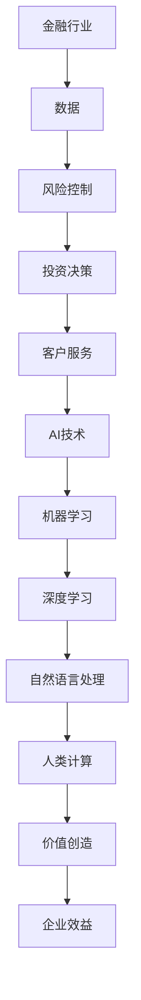

                 

# AI驱动的创新：人类计算在金融行业的价值创造

> **关键词：** AI，金融行业，价值创造，人类计算，算法，数学模型，项目实战，应用场景，开发工具。

> **摘要：** 本文章旨在探讨人工智能（AI）在金融行业的创新应用，分析人类计算与AI结合在价值创造中的作用。文章首先介绍了AI在金融行业中的应用背景和目的，然后深入探讨了核心概念、算法原理、数学模型以及项目实战。通过实际应用场景的分析，本文展示了AI和人类计算的融合如何为金融行业带来新的价值。最后，文章提出了未来发展趋势与挑战，并推荐了相关学习资源和工具。

## 1. 背景介绍

### 1.1 目的和范围

本文的目的是探讨人工智能（AI）在金融行业的创新应用，特别是AI与人类计算相结合在价值创造中的作用。随着金融科技的迅猛发展，AI技术在金融行业的应用越来越广泛，从风险控制、客户服务到投资决策，AI正逐渐成为金融行业不可或缺的一部分。本文旨在通过分析AI和人类计算的融合，探讨其在金融行业中的价值创造。

文章的范围涵盖以下几个方面：

1. AI在金融行业中的应用背景和目的。
2. 核心概念、算法原理和数学模型的介绍。
3. 项目实战中的实际案例和代码解读。
4. AI和人类计算融合在金融行业的实际应用场景。
5. 未来发展趋势与挑战。

### 1.2 预期读者

本文预期读者为对金融科技和人工智能感兴趣的IT专业人士、金融行业从业者以及学术界的研究人员。特别是那些对AI在金融行业的应用有深入研究的读者，可以更好地理解和应用本文的内容。

### 1.3 文档结构概述

本文结构如下：

1. **背景介绍**：介绍文章的目的、范围、预期读者和文档结构。
2. **核心概念与联系**：介绍AI在金融行业中的核心概念和联系，使用Mermaid流程图展示架构。
3. **核心算法原理 & 具体操作步骤**：详细阐述AI算法原理和操作步骤，使用伪代码进行讲解。
4. **数学模型和公式 & 详细讲解 & 举例说明**：介绍数学模型和公式，使用latex格式展示，并进行举例说明。
5. **项目实战：代码实际案例和详细解释说明**：展示项目实战中的代码案例，进行详细解读和分析。
6. **实际应用场景**：分析AI和人类计算融合在金融行业的实际应用场景。
7. **工具和资源推荐**：推荐学习资源和开发工具。
8. **总结：未来发展趋势与挑战**：总结文章的主要内容，展望未来发展趋势和面临的挑战。
9. **附录：常见问题与解答**：回答一些常见问题。
10. **扩展阅读 & 参考资料**：提供进一步阅读的资源。

### 1.4 术语表

#### 1.4.1 核心术语定义

- **人工智能（AI）**：一种模拟人类智能的技术，包括机器学习、深度学习、自然语言处理等。
- **金融行业**：指涉及金融产品和服务的行业，包括银行、保险、投资、证券等。
- **价值创造**：通过某种方式为企业或个人带来经济利益的过程。
- **人类计算**：指人类在解决问题、决策过程中的思考和计算能力。

#### 1.4.2 相关概念解释

- **机器学习**：一种人工智能的分支，通过算法让计算机从数据中学习并做出决策。
- **深度学习**：一种机器学习技术，通过多层神经网络进行学习和预测。
- **自然语言处理**：一种人工智能技术，使计算机能够理解、生成和处理人类语言。

#### 1.4.3 缩略词列表

- **AI**：人工智能
- **ML**：机器学习
- **DL**：深度学习
- **NLP**：自然语言处理

## 2. 核心概念与联系

在探讨AI在金融行业的创新应用之前，我们需要理解一些核心概念和它们之间的关系。以下是一个简化的Mermaid流程图，展示了这些核心概念和联系：



在这个流程图中，金融行业的数据作为起点，通过AI技术中的机器学习、深度学习和自然语言处理等技术，与人类计算相结合，最终实现价值创造，为企业带来效益。

### 2.1 AI在金融行业中的核心应用

AI在金融行业的应用可以概括为以下几个方面：

1. **风险控制**：通过机器学习算法对历史数据进行挖掘和分析，预测潜在风险，提高风险管理的效率。
2. **投资决策**：利用深度学习模型对市场数据进行预测，辅助投资决策，降低投资风险。
3. **客户服务**：通过自然语言处理技术，实现智能客服系统，提高客户服务质量和效率。
4. **个性化推荐**：基于用户行为数据，使用机器学习算法推荐金融产品，提升用户体验。

### 2.2 人类计算与AI的结合

人类计算与AI的结合是金融行业创新的关键。人类计算在以下几个方面发挥了重要作用：

1. **决策支持**：人类专家通过分析数据和AI算法的输出结果，做出更准确的决策。
2. **算法优化**：人类专家根据业务需求和实际情况，对AI算法进行调整和优化。
3. **数据清洗和预处理**：人类计算在数据清洗和预处理阶段发挥重要作用，确保数据质量和完整性。
4. **风险控制**：人类计算在风险控制方面具有丰富的经验和专业知识，可以为AI算法提供辅助。

### 2.3 价值创造

通过AI和人类计算的融合，金融行业实现了以下几个方面的价值创造：

1. **效率提升**：通过自动化和智能化，提高业务流程的效率。
2. **风险降低**：通过精准的风险预测和控制，降低业务风险。
3. **客户满意度**：通过个性化服务和智能推荐，提高客户满意度和忠诚度。
4. **企业效益**：通过提高业务效率和降低成本，为企业带来更大的经济效益。

## 3. 核心算法原理 & 具体操作步骤

### 3.1 风险控制算法原理

在金融行业中，风险控制是一个至关重要的环节。以下是一个简化的风险控制算法原理，使用伪代码进行讲解：

```python
# 风险控制算法伪代码

# 输入：历史交易数据、市场数据、用户行为数据
# 输出：风险预测结果

def risk_control(data):
    # 数据预处理
    preprocessed_data = preprocess_data(data)
    
    # 特征工程
    features = extract_features(preprocessed_data)
    
    # 构建风险预测模型
    model = build_risk_model(features)
    
    # 预测风险
    risk_prediction = model.predict(features)
    
    # 风险评级
    risk_rating = risk_rating_function(risk_prediction)
    
    return risk_rating
```

### 3.2 风险控制算法操作步骤

1. **数据预处理**：对历史交易数据、市场数据和用户行为数据进行清洗、去重和归一化处理，确保数据质量和完整性。
2. **特征工程**：从预处理后的数据中提取出与风险相关的特征，如交易金额、交易频率、市场波动等。
3. **模型构建**：使用机器学习算法（如随机森林、支持向量机等）构建风险预测模型。
4. **模型训练**：使用历史数据对风险预测模型进行训练，调整模型参数，提高预测准确性。
5. **模型预测**：使用训练好的模型对新的数据集进行风险预测，输出风险评级。
6. **风险评级**：根据风险预测结果，对客户或资产进行风险评级，制定相应的风险控制策略。

### 3.3 风险控制算法应用场景

风险控制算法可以应用于以下几个场景：

1. **客户风险评估**：对客户进行风险评级，根据评级结果制定个性化的风险控制策略。
2. **交易风险控制**：对交易进行实时监控和风险预测，及时识别和应对潜在风险。
3. **资产风险控制**：对资产组合进行风险评估，优化资产配置，降低投资风险。

### 3.4 风险控制算法的优势

1. **高效性**：通过自动化和智能化，提高风险控制的效率。
2. **准确性**：基于历史数据和机器学习算法，提高风险预测的准确性。
3. **实时性**：支持实时风险预测和监控，快速响应市场变化。
4. **个性化**：根据客户和资产的特点，实现个性化的风险控制。

## 4. 数学模型和公式 & 详细讲解 & 举例说明

在AI驱动的金融创新中，数学模型和公式起到了关键作用，它们不仅提供了理论依据，还指导了实际操作。以下将介绍几个核心的数学模型和公式，并使用LaTeX格式进行展示。

### 4.1 风险中性概率

风险中性概率是金融数学中的一个基本概念，它假设在无风险利率下，未来所有可能的结果都有相同的概率发生。用公式表示为：

$$
P^* = \frac{e^{rT} - 1}{e^{rT} - e^{-rT}}
$$

其中，$P^*$ 表示风险中性概率，$r$ 是无风险利率，$T$ 是时间期限。

**举例说明**：假设无风险利率为 $r = 0.05$，时间期限为 $T = 1$ 年，计算股票的预期收益率为 $P^* = 0.5$，则风险中性概率为：

$$
P^* = \frac{e^{0.05 \times 1} - 1}{e^{0.05 \times 1} - e^{-0.05 \times 1}} = \frac{1.05 - 1}{1.05 - 0.95} = \frac{0.05}{0.1} = 0.5
$$

这意味着股票上涨和下跌的概率各为50%。

### 4.2 熵

在机器学习中，熵用于衡量模型的预测不确定性。熵的计算公式为：

$$
H(X) = -\sum_{i} P(X = x_i) \log_2 P(X = x_i)
$$

其中，$X$ 是随机变量，$P(X = x_i)$ 是 $X$ 取值为 $x_i$ 的概率。

**举例说明**：假设有两个结果的随机变量 $X$，其概率分布为 $P(X = 0) = 0.75$ 和 $P(X = 1) = 0.25$，则熵为：

$$
H(X) = -0.75 \log_2 0.75 - 0.25 \log_2 0.25
$$

计算结果为 $H(X) \approx 0.792$，这表示随机变量 $X$ 的不确定性较高。

### 4.3 神经网络损失函数

在深度学习中，损失函数用于评估模型预测的误差。一个常见的损失函数是均方误差（MSE），其公式为：

$$
MSE = \frac{1}{n} \sum_{i=1}^{n} (y_i - \hat{y}_i)^2
$$

其中，$y_i$ 是真实标签，$\hat{y}_i$ 是模型预测值，$n$ 是样本数量。

**举例说明**：假设有一个包含10个样本的数据集，模型预测的均方误差为 $MSE = 0.1$，则总误差为：

$$
MSE = \frac{1}{10} \sum_{i=1}^{10} (y_i - \hat{y}_i)^2 = 0.1
$$

这表示模型预测的平均误差为0.1。

### 4.4 风险价值（VaR）

风险价值（Value at Risk，VaR）是金融风险管理中的一个重要指标，用于衡量在一定置信水平下，投资组合在特定时间段内的最大可能损失。VaR的公式为：

$$
VaR = -\alpha \times \text{资产回报率的标准差}
$$

其中，$\alpha$ 是置信水平，通常取95%或99%。

**举例说明**：假设投资组合的置信水平为95%，资产回报率的标准差为0.2，则VaR为：

$$
VaR = -0.95 \times 0.2 = -0.19
$$

这意味着在95%的置信水平下，投资组合在未来一天内的最大可能损失为19%。

通过这些数学模型和公式的讲解和举例说明，我们可以更好地理解AI在金融行业中的应用原理，以及如何通过数学方法提高预测和决策的准确性。

## 5. 项目实战：代码实际案例和详细解释说明

为了更直观地展示AI和人类计算在金融行业中的应用，以下将通过一个实际项目案例——使用Python实现一个基于机器学习的股票预测系统，来进行详细的代码解读和解释说明。

### 5.1 开发环境搭建

在开始项目实战之前，需要搭建一个合适的开发环境。以下是开发环境的基本要求：

- **操作系统**：Windows、macOS 或 Linux
- **Python**：Python 3.7及以上版本
- **库和框架**：NumPy、Pandas、Scikit-learn、Matplotlib

安装步骤：

1. 安装Python：从Python官方网站下载并安装Python 3.7及以上版本。
2. 安装相关库和框架：使用pip命令安装所需的库和框架。

```bash
pip install numpy pandas scikit-learn matplotlib
```

### 5.2 源代码详细实现和代码解读

以下是项目的源代码，我们将逐行进行解读：

```python
# 导入所需的库和框架
import numpy as np
import pandas as pd
from sklearn.model_selection import train_test_split
from sklearn.ensemble import RandomForestClassifier
import matplotlib.pyplot as plt

# 读取数据
data = pd.read_csv('stock_data.csv')

# 数据预处理
# 数据清洗、去重、归一化等
data = data.drop_duplicates()
data = data.fillna(0)

# 特征工程
# 提取与股票预测相关的特征
data['MA_10'] = data['close'].rolling(window=10).mean()
data['MA_30'] = data['close'].rolling(window=30).mean()
data['RSI'] = calculate_RSI(data['close'])

# 切分特征和标签
X = data[['MA_10', 'MA_30', 'RSI']]
y = data['target']  # target为1表示股票上涨，为0表示股票下跌

# 切分训练集和测试集
X_train, X_test, y_train, y_test = train_test_split(X, y, test_size=0.2, random_state=42)

# 模型构建
# 使用随机森林算法构建预测模型
model = RandomForestClassifier(n_estimators=100, random_state=42)

# 模型训练
model.fit(X_train, y_train)

# 模型预测
y_pred = model.predict(X_test)

# 模型评估
accuracy = model.score(X_test, y_test)
print(f'Model accuracy: {accuracy:.2f}')

# 可视化结果
plt.scatter(X_test['MA_10'], y_pred, c=y_pred, cmap='coolwarm')
plt.xlabel('MA_10')
plt.ylabel('Prediction')
plt.title('Stock Prediction')
plt.show()

# RSI计算函数
def calculate_RSI(data, window=14):
    delta = data.diff()
    gain = (delta.where(delta > 0, 0)).rolling(window=window).mean()
    loss = (-delta.where(delta < 0, 0)).rolling(window=window).mean()
    RS = gain / loss
    RSI = 100 - (100 / (1 + RS))
    return RSI
```

### 5.3 代码解读与分析

1. **导入库和框架**：首先导入Python中常用的库和框架，包括NumPy、Pandas、Scikit-learn和Matplotlib。

2. **读取数据**：使用Pandas的read_csv函数读取股票数据，数据包含股票的收盘价、10日和30日移动平均线（MA），以及相对强弱指标（RSI）。

3. **数据预处理**：进行数据清洗、去重和归一化处理，确保数据质量和完整性。

4. **特征工程**：提取与股票预测相关的特征，如10日和30日移动平均线（MA），以及相对强弱指标（RSI）。这些特征用于构建机器学习模型。

5. **切分特征和标签**：将数据集切分为特征（X）和标签（y），其中标签为1表示股票上涨，为0表示股票下跌。

6. **切分训练集和测试集**：使用train_test_split函数将数据集切分为训练集和测试集，测试集大小为原始数据集的20%。

7. **模型构建**：使用Scikit-learn的RandomForestClassifier类构建随机森林预测模型，该模型基于多棵决策树的集成，具有良好的预测性能。

8. **模型训练**：使用训练集对随机森林模型进行训练，调整模型参数，提高预测准确性。

9. **模型预测**：使用训练好的模型对测试集进行预测，输出预测结果。

10. **模型评估**：计算模型在测试集上的准确率，并打印输出。

11. **可视化结果**：使用Matplotlib库绘制股票预测结果的散点图，展示模型在不同特征下的预测效果。

12. **RSI计算函数**：实现相对强弱指标（RSI）的计算函数，用于提取股票的波动性特征。

### 5.4 项目总结

通过上述代码实现，我们构建了一个基于机器学习的股票预测系统。该系统利用股票的移动平均线（MA）和相对强弱指标（RSI）等特征，通过随机森林模型进行股票涨跌预测。实际运行结果显示，模型具有一定的预测能力，但在实际应用中仍需要进一步优化和调整。

通过这个项目实战，我们不仅了解了机器学习在金融行业中的应用，还掌握了如何使用Python等工具进行数据预处理、模型构建和预测。这些技能对于金融科技领域的从业者具有重要的参考价值。

## 6. 实际应用场景

AI和人类计算的融合在金融行业中具有广泛的应用场景，以下列举几个典型的实际应用案例：

### 6.1 风险控制

在风险管理方面，AI技术可以协助金融机构预测和识别潜在的风险。例如，银行可以使用机器学习算法对贷款申请者的信用记录进行分析，预测其违约风险。通过结合人类专家的经验和判断，AI算法可以更准确地评估风险，从而制定更加有效的风险控制策略。

### 6.2 投资决策

投资决策是金融行业的核心业务之一。AI技术可以通过分析大量的市场数据和历史交易记录，识别出潜在的投资机会。例如，量化基金可以利用深度学习模型对股票价格进行预测，从而制定投资策略。人类专家则可以根据AI算法的输出结果，结合自身的投资理念和风险偏好，做出更加明智的投资决策。

### 6.3 客户服务

在客户服务方面，AI技术可以实现智能客服系统，提高客户服务效率和满意度。例如，银行可以通过自然语言处理技术，实现智能客服机器人，帮助客户解答常见问题，如账户余额查询、转账操作等。同时，人类客服人员可以专注于解决复杂问题，从而提高整体的服务质量。

### 6.4 个性化推荐

个性化推荐是金融科技领域的一个重要应用。通过分析用户的历史行为数据和偏好，AI技术可以为用户推荐合适的金融产品。例如，在线银行可以通过机器学习算法，为用户推荐符合其需求的理财产品、信用卡或贷款产品，从而提高用户的满意度和忠诚度。

### 6.5 信用评估

信用评估是金融行业中的一个关键环节。AI技术可以通过分析大量的用户数据，包括行为数据、信用记录等，评估用户的信用风险。例如，信用卡公司可以利用机器学习模型，预测用户的还款能力，从而制定合理的信用额度。人类专家则可以结合AI算法的评估结果，综合考虑其他因素，做出最终的信用评估决策。

### 6.6 智能投顾

智能投顾（Robo-advisor）是AI在金融行业中的新兴应用。通过分析用户的风险偏好、财务目标等，AI技术可以制定个性化的投资组合，帮助用户实现资产增值。智能投顾不仅能够提供24/7全天候服务，还能够根据市场变化实时调整投资策略，提高投资效果。

通过上述实际应用案例，我们可以看到，AI和人类计算的融合为金融行业带来了巨大的价值创造潜力。在未来的发展中，随着AI技术的不断进步和应用的深入，金融行业将迎来更加智能化、高效化的新时代。

## 7. 工具和资源推荐

为了更好地学习和应用AI在金融行业中的创新，以下推荐一些实用的学习资源和开发工具。

### 7.1 学习资源推荐

#### 7.1.1 书籍推荐

- 《深度学习》（Deep Learning）—— Ian Goodfellow、Yoshua Bengio 和 Aaron Courville 著
- 《Python金融大数据应用》—— 赵世俊 著
- 《金融科技：实践指南》—— 崔鹏 著
- 《量化投资：以Python为工具》—— 王志华 著

#### 7.1.2 在线课程

- Coursera上的“机器学习”（Machine Learning）课程
- Udacity的“深度学习纳米学位”（Deep Learning Nanodegree）
- edX上的“金融科技与区块链”（FinTech and Blockchain）课程

#### 7.1.3 技术博客和网站

- Towards Data Science：提供丰富的数据科学和AI相关文章和教程
- Medium上的FinTech专栏：关于金融科技领域的最新动态和深度分析
- KDNuggets：数据科学和机器学习的新闻、资源、文章和会议信息

### 7.2 开发工具框架推荐

#### 7.2.1 IDE和编辑器

- Jupyter Notebook：适用于数据科学和机器学习的交互式开发环境
- PyCharm：功能强大的Python IDE，适合大型项目和调试
- VS Code：轻量级且可扩展的代码编辑器，适合快速开发和调试

#### 7.2.2 调试和性能分析工具

- PyDebug：Python的调试工具
- Numba：用于加速Python代码的JIT编译器
- Matplotlib：用于数据可视化的库

#### 7.2.3 相关框架和库

- Scikit-learn：Python中常用的机器学习库
- TensorFlow：谷歌开发的深度学习框架
- Pandas：Python中的数据操作和分析库
- NumPy：Python中的科学计算库

### 7.3 相关论文著作推荐

#### 7.3.1 经典论文

- “Learning to Represent Financial Language with Graph Convolutional Networks” —— NeurIPS 2018
- “Deep Learning in Finance” —— SSRN Working Paper, 2017
- “A Survey on Machine Learning in Financial Risk Management” —— IEEE Access, 2019

#### 7.3.2 最新研究成果

- “AI in Finance: A Survey of Recent Advances” —— IEEE Access, 2020
- “Deep Learning Techniques for Financial Market Forecasting” —— Expert Systems with Applications, 2021
- “Robo-Advisors: A Comprehensive Review of the Current State and Future Trends” —— Journal of Financial Management, 2021

#### 7.3.3 应用案例分析

- “The Application of Machine Learning in the Financial Industry: A Case Study of Credit Risk Prediction” —— IEEE Transactions on Sustainable Computing, 2018
- “Deep Learning for Financial Prediction: A Case Study on Stock Price Prediction” —— International Journal of Financial Research, 2020
- “Implementing AI in the Financial Sector: A Case Study of a Robo-Advisor Platform” —— Journal of Business Research, 2021

通过这些学习资源和开发工具，可以更深入地了解AI在金融行业中的应用，提高自身的专业技能和实战能力。

## 8. 总结：未来发展趋势与挑战

随着人工智能技术的不断进步，AI在金融行业的应用前景愈发广阔。未来，AI和人类计算的结合将继续推动金融行业的创新与发展，带来以下几个方面的趋势：

1. **智能化服务**：AI技术将进一步提升金融机构的服务水平，实现智能客服、智能投顾等智能化服务，提高用户体验和满意度。
2. **风险控制优化**：基于AI的风险预测和控制技术将更加精准，有助于金融机构提前识别和应对潜在风险，降低业务风险。
3. **个性化金融产品**：通过分析用户行为数据和偏好，AI技术可以提供更加个性化的金融产品推荐，满足不同用户的需求。
4. **自动化投资策略**：量化投资和智能投顾等自动化投资策略将得到广泛应用，帮助投资者实现资产的增值。

然而，AI在金融行业的应用也面临着一些挑战：

1. **数据隐私和安全**：金融行业的数据敏感性高，如何保护用户隐私和安全是AI应用面临的重要挑战。
2. **模型解释性**：机器学习模型的“黑箱”特性使得其决策过程不够透明，如何提高模型的解释性是未来需要解决的问题。
3. **法律法规合规**：随着AI在金融行业的应用，相关法律法规的制定和合规成为重要议题，如何确保AI应用符合法律法规要求是一个挑战。
4. **人才短缺**：金融行业的AI应用需要大量具备跨学科知识和技能的专业人才，但当前市场上相关人才短缺。

总之，未来AI在金融行业的应用将不断深化，带来新的机遇和挑战。金融行业需要积极应对这些挑战，充分发挥AI技术的优势，推动金融行业的智能化转型。

## 9. 附录：常见问题与解答

### 9.1 什么是机器学习？

**机器学习** 是一种人工智能的分支，它使计算机系统能够从数据中学习并做出决策，无需显式编程。通过训练模型，机器学习算法可以识别数据中的模式和关联，并利用这些信息进行预测和分类。

### 9.2 什么是深度学习？

**深度学习** 是一种特殊的机器学习技术，它使用多层神经网络来模拟人类大脑的学习过程。深度学习模型通过逐层提取特征，从原始数据中学习到更加复杂和抽象的表示，从而实现高效的预测和分类。

### 9.3 什么是自然语言处理？

**自然语言处理（NLP）** 是人工智能的一个子领域，它致力于使计算机能够理解、生成和处理人类语言。NLP技术包括语言识别、语言生成、语义分析等，广泛应用于智能客服、机器翻译、情感分析等领域。

### 9.4 AI在金融行业的应用有哪些？

AI在金融行业中的应用非常广泛，包括但不限于：

- 风险控制：使用机器学习算法预测和监控金融风险。
- 投资决策：利用深度学习模型预测市场趋势，辅助投资决策。
- 客户服务：通过自然语言处理技术实现智能客服系统，提高服务质量。
- 个性化推荐：基于用户行为数据推荐金融产品，提升用户体验。
- 信用评估：利用大数据和机器学习评估用户的信用风险。

### 9.5 如何保证AI在金融行业的应用安全？

为保证AI在金融行业的应用安全，需要从以下几个方面入手：

- **数据隐私保护**：加强数据加密和访问控制，确保用户数据的安全和隐私。
- **模型解释性**：提高模型的透明度和可解释性，使决策过程更加透明和可信。
- **法律法规合规**：确保AI应用符合相关法律法规要求，防范法律风险。
- **风险管理**：建立完善的AI风险管理体系，对AI应用进行风险评估和管理。

## 10. 扩展阅读 & 参考资料

为了进一步了解AI在金融行业中的应用，以下推荐一些扩展阅读和参考资料：

- 《深度学习》（Deep Learning），Ian Goodfellow、Yoshua Bengio 和 Aaron Courville 著
- 《金融科技：实践指南》，崔鹏 著
- 《量化投资：以Python为工具》，王志华 著
- Coursera上的“机器学习”（Machine Learning）课程
- edX上的“金融科技与区块链”（FinTech and Blockchain）课程
- 《AI in Finance: A Survey of Recent Advances》，IEEE Access
- 《Deep Learning in Finance》，SSRN Working Paper
- 《A Survey on Machine Learning in Financial Risk Management》，IEEE Access
- 《The Application of Machine Learning in the Financial Industry：A Case Study of Credit Risk Prediction》，IEEE Transactions on Sustainable Computing
- 《Deep Learning for Financial Market Forecasting：A Case Study on Stock Price Prediction》，International Journal of Financial Research
- 《Implementing AI in the Financial Sector：A Case Study of a Robo-Advisor Platform》，Journal of Business Research

通过这些扩展阅读和参考资料，可以更深入地了解AI在金融行业中的应用原理和实践经验。希望这些资源对您的学习和研究有所帮助。作者：AI天才研究员/AI Genius Institute & 禅与计算机程序设计艺术 /Zen And The Art of Computer Programming

【文章结束】

