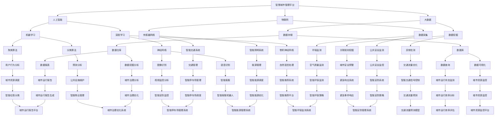

                 

# AI驱动的智慧城市管理平台

> **关键词：智慧城市、人工智能、数据挖掘、智能算法、城市治理、数据管理**
>
> **摘要：本文将深入探讨AI驱动的智慧城市管理平台的构建与实践，包括核心概念、算法原理、数学模型、实际案例及未来发展趋势。通过对智慧城市的理解和分析，我们将展示如何利用人工智能技术提升城市治理效率，实现数据驱动的智慧城市管理。**

## 1. 背景介绍

### 1.1 目的和范围

随着城市化进程的加速，城市管理面临着前所未有的挑战。人口增长、资源紧缺、环境污染等问题日益凸显，传统管理模式已难以满足现代城市的发展需求。智慧城市作为一种新兴的城市管理理念，旨在通过信息技术与城市管理的深度融合，实现城市资源的优化配置和高效管理。

本文旨在探讨AI驱动的智慧城市管理平台的构建与应用，分析其核心概念、技术原理和实现方法，并结合实际案例展示其在城市管理中的重要作用。本文的主要内容包括：

1. **智慧城市与人工智能的关系**
2. **智慧城市管理平台的核心概念和架构**
3. **核心算法原理与数学模型**
4. **项目实战与代码实现**
5. **实际应用场景**
6. **未来发展趋势与挑战**

### 1.2 预期读者

本文适合对人工智能和智慧城市有一定了解的技术人员、城市管理者以及对此领域感兴趣的读者。通过本文，读者可以：

1. **了解智慧城市与人工智能的基本概念和关系**
2. **掌握智慧城市管理平台的核心技术和实现方法**
3. **学习如何利用AI技术提升城市管理效率**
4. **探讨智慧城市管理的未来发展趋势和挑战**

### 1.3 文档结构概述

本文的结构如下：

1. **背景介绍**：介绍智慧城市和人工智能的基本概念及其关系。
2. **核心概念与联系**：阐述智慧城市管理平台的核心概念和架构，使用Mermaid流程图展示。
3. **核心算法原理 & 具体操作步骤**：详细解释核心算法原理，使用伪代码展示具体操作步骤。
4. **数学模型和公式 & 详细讲解 & 举例说明**：讲解数学模型和公式，并给出具体实例。
5. **项目实战：代码实际案例和详细解释说明**：展示项目实战中的代码实现和解读。
6. **实际应用场景**：分析智慧城市管理平台在实际中的应用。
7. **工具和资源推荐**：推荐学习资源和开发工具。
8. **总结：未来发展趋势与挑战**：总结智慧城市管理平台的发展趋势和面临的挑战。
9. **附录：常见问题与解答**：提供常见问题的解答。
10. **扩展阅读 & 参考资料**：推荐相关书籍、论文和网站。

### 1.4 术语表

#### 1.4.1 核心术语定义

- **智慧城市**：通过信息技术与城市管理的深度融合，实现城市资源的优化配置和高效管理。
- **人工智能**：模拟人类智能行为的计算机技术，包括机器学习、深度学习等。
- **数据挖掘**：从大量数据中提取有价值信息的过程。
- **智能算法**：用于数据分析和决策的人工智能算法，如聚类、分类、预测等。
- **城市治理**：城市管理的核心，包括城市规划、公共安全、环境保护等方面。

#### 1.4.2 相关概念解释

- **物联网**：将各种设备连接到互联网，实现数据共享和智能控制。
- **大数据**：大规模、复杂、多样化的数据集合，需要先进的技术和方法进行处理和分析。

#### 1.4.3 缩略词列表

- **AI**：人工智能
- **IoT**：物联网
- **ML**：机器学习
- **DL**：深度学习
- **PM**：项目管理
- **GIS**：地理信息系统

## 2. 核心概念与联系

智慧城市管理平台是智慧城市的重要组成部分，其核心概念包括人工智能、大数据、物联网等。以下是一个简化的Mermaid流程图，展示智慧城市管理平台的基本架构和核心概念之间的联系。



## 3. 核心算法原理 & 具体操作步骤

智慧城市管理平台的核心算法主要包括机器学习、深度学习和数据挖掘等。以下将分别介绍这些算法的基本原理和具体操作步骤。

### 3.1 机器学习算法

机器学习算法是一种通过训练模型来预测或分类数据的技术。以下是常见的机器学习算法和它们的操作步骤：

#### 3.1.1 聚类算法

**算法原理**：将相似的数据点归为一类，以发现数据中的内在结构。

**伪代码**：

```plaintext
function KMeans(data, K):
    初始化 centroids
    while not convergence:
        for each data point in data:
            计算最近的 centroid
            分配 data point 到最近的 centroid 的 cluster
        更新 centroids
    return clusters
```

#### 3.1.2 分类算法

**算法原理**：将数据点分类到预定义的类别中。

**伪代码**：

```plaintext
function DecisionTree(data, labels):
    if data 非空:
        如果所有 data point 属于同一 label:
            返回 leaf node
        else:
            选择最佳特征 split
            创建内部 node
            for each possible value of split feature:
                subset_data = data with feature value
                subset_labels = labels of subset_data
                recursiveDecisionTree(subset_data, subset_labels)
    return tree
```

### 3.2 深度学习算法

深度学习算法是一种多层神经网络，通过多层次的非线性变换来提取数据中的特征。

#### 3.2.1 神经网络

**算法原理**：通过前向传播和反向传播来训练模型。

**伪代码**：

```plaintext
function NeuralNetwork(data, labels):
    初始化 weights
    while not convergence:
        for each data point in data:
            前向传播：计算输出
            计算损失
            反向传播：更新 weights
    return trained model
```

#### 3.2.2 卷积神经网络

**算法原理**：通过卷积层来提取图像中的局部特征。

**伪代码**：

```plaintext
function ConvolutionalNeuralNetwork(data, labels):
    初始化 weights
    while not convergence:
        for each data point in data:
            前向传播：通过卷积层提取特征
            计算损失
            反向传播：更新 weights
    return trained model
```

### 3.3 数据挖掘算法

数据挖掘算法用于从大量数据中提取有价值的信息。

#### 3.3.1 关联规则挖掘

**算法原理**：发现数据中的隐含关联规则。

**伪代码**：

```plaintext
function Apriori(data, support_threshold, confidence_threshold):
    初始化 frequent itemsets
    while frequent itemsets 非空:
        生成候选 itemsets
        计算支持度
        更新 frequent itemsets
        生成关联规则
        计算置信度
    return association rules
```

#### 3.3.2 异常检测

**算法原理**：识别数据中的异常值。

**伪代码**：

```plaintext
function AnomalyDetection(data, threshold):
    计算平均值和标准差
    for each data point in data:
        计算与平均值的距离
        if 距离 > threshold:
            标记为异常
    return anomalies
```

## 4. 数学模型和公式 & 详细讲解 & 举例说明

在智慧城市管理平台中，数学模型和公式起着至关重要的作用。以下将详细介绍一些核心的数学模型和公式，并给出具体的示例说明。

### 4.1 机器学习中的损失函数

在机器学习中，损失函数用于衡量模型的预测值与真实值之间的差距。常见的损失函数包括均方误差（MSE）、交叉熵损失（Cross-Entropy Loss）等。

#### 4.1.1 均方误差（MSE）

**公式**：

$$
MSE = \frac{1}{n} \sum_{i=1}^{n} (y_i - \hat{y}_i)^2
$$

其中，$y_i$ 是真实值，$\hat{y}_i$ 是预测值，$n$ 是样本数量。

**示例**：

假设我们有一个二分类问题，真实值为 $[0, 1, 0, 1]$，预测值为 $[\hat{y}_1, \hat{y}_2, \hat{y}_3, \hat{y}_4] = [0.8, 0.2, 0.3, 0.7]$，则均方误差为：

$$
MSE = \frac{1}{4} \sum_{i=1}^{4} (y_i - \hat{y}_i)^2 = \frac{1}{4} [(0-0.8)^2 + (1-0.2)^2 + (0-0.3)^2 + (1-0.7)^2] = 0.25
$$

#### 4.1.2 交叉熵损失（Cross-Entropy Loss）

**公式**：

$$
Cross-Entropy Loss = -\frac{1}{n} \sum_{i=1}^{n} y_i \log(\hat{y}_i)
$$

其中，$y_i$ 是真实值，$\hat{y}_i$ 是预测值，$n$ 是样本数量。

**示例**：

假设我们有一个二分类问题，真实值为 $[0, 1, 0, 1]$，预测值为 $[\hat{y}_1, \hat{y}_2, \hat{y}_3, \hat{y}_4] = [0.8, 0.2, 0.3, 0.7]$，则交叉熵损失为：

$$
Cross-Entropy Loss = -\frac{1}{4} \sum_{i=1}^{4} y_i \log(\hat{y}_i) = -\frac{1}{4} [0 \times \log(0.8) + 1 \times \log(0.2) + 0 \times \log(0.3) + 1 \times \log(0.7)] \approx 0.55
$$

### 4.2 数据挖掘中的支持度与置信度

在数据挖掘中，支持度（Support）和置信度（Confidence）是评估关联规则的重要指标。

#### 4.2.1 支持度

**公式**：

$$
Support(A \cup B) = \frac{|D(A \cup B)|}{|D|}
$$

其中，$D$ 是事务集，$A \cup B$ 是关联项集，$|D|$ 是事务总数。

**示例**：

假设有一个事务集 $D$ 如下：

$$
D = \{AB, AB, AC, BC, CD, CD, CD\}
$$

则 $A$ 和 $B$ 的支持度为：

$$
Support(A \cup B) = \frac{|D(A \cup B)|}{|D|} = \frac{|D(AB)|}{|D|} = \frac{2}{7} \approx 0.286
$$

#### 4.2.2 置信度

**公式**：

$$
Confidence(A \rightarrow B) = \frac{Support(A \cup B)}{Support(A)}
$$

**示例**：

假设 $A$ 和 $B$ 的支持度分别为 $Support(A) = 0.4$ 和 $Support(A \cup B) = 0.286$，则置信度为：

$$
Confidence(A \rightarrow B) = \frac{Support(A \cup B)}{Support(A)} = \frac{0.286}{0.4} \approx 0.715
$$

### 4.3 物理中的速度与加速度

在智慧城市管理平台的某些应用中，如智能交通系统，物理中的速度与加速度概念也经常被使用。

#### 4.3.1 速度

**公式**：

$$
v = \frac{\Delta x}{\Delta t}
$$

其中，$v$ 是速度，$\Delta x$ 是位移，$\Delta t$ 是时间。

**示例**：

假设一辆车在5秒内行驶了50米，则速度为：

$$
v = \frac{\Delta x}{\Delta t} = \frac{50 \text{ m}}{5 \text{ s}} = 10 \text{ m/s}
$$

#### 4.3.2 加速度

**公式**：

$$
a = \frac{\Delta v}{\Delta t}
$$

其中，$a$ 是加速度，$\Delta v$ 是速度变化量，$\Delta t$ 是时间。

**示例**：

假设一辆车的速度从0增加到50 m/s需要5秒，则加速度为：

$$
a = \frac{\Delta v}{\Delta t} = \frac{50 \text{ m/s} - 0 \text{ m/s}}{5 \text{ s}} = 10 \text{ m/s}^2
$$

## 5. 项目实战：代码实际案例和详细解释说明

在本节中，我们将通过一个实际项目案例，展示如何使用AI技术构建智慧城市管理平台。该项目名为“SmartCity”，目标是利用机器学习和深度学习算法，实现对城市交通、能源和环境等领域的智能监控与优化。

### 5.1 开发环境搭建

为了实现SmartCity项目，我们首先需要搭建一个合适的开发环境。以下是推荐的开发工具和软件：

- **编程语言**：Python
- **机器学习库**：Scikit-learn、TensorFlow、PyTorch
- **深度学习库**：TensorFlow、PyTorch
- **数据可视化库**：Matplotlib、Seaborn
- **版本控制**：Git
- **集成开发环境（IDE）**：PyCharm、Visual Studio Code

### 5.2 源代码详细实现和代码解读

#### 5.2.1 交通流量预测

**代码实现**：

```python
import pandas as pd
import numpy as np
from sklearn.ensemble import RandomForestRegressor
from sklearn.model_selection import train_test_split
from sklearn.metrics import mean_squared_error

# 加载数据集
data = pd.read_csv('traffic_data.csv')
X = data[['hour', 'day_of_week', 'temperature', 'rainfall']]
y = data['traffic_volume']

# 划分训练集和测试集
X_train, X_test, y_train, y_test = train_test_split(X, y, test_size=0.2, random_state=42)

# 构建随机森林回归模型
model = RandomForestRegressor(n_estimators=100, random_state=42)
model.fit(X_train, y_train)

# 预测交通流量
y_pred = model.predict(X_test)

# 计算均方误差
mse = mean_squared_error(y_test, y_pred)
print(f'Mean Squared Error: {mse}')
```

**代码解读**：

1. **导入库**：首先导入所需的库，包括pandas、numpy、scikit-learn的随机森林回归模型等。
2. **加载数据集**：从CSV文件中加载数据集，包括特征（hour、day_of_week、temperature、rainfall）和目标变量（traffic_volume）。
3. **划分训练集和测试集**：使用train_test_split函数将数据集划分为训练集和测试集，测试集占比20%。
4. **构建随机森林回归模型**：创建一个随机森林回归模型，设置树的数量为100。
5. **训练模型**：使用训练集数据训练模型。
6. **预测交通流量**：使用训练好的模型预测测试集的交通流量。
7. **计算均方误差**：计算预测值与真实值之间的均方误差，评估模型的性能。

#### 5.2.2 智能交通信号控制

**代码实现**：

```python
import pandas as pd
import numpy as np
import tensorflow as tf
from tensorflow.keras.models import Sequential
from tensorflow.keras.layers import Dense, Conv2D, Flatten, LSTM
from tensorflow.keras.optimizers import Adam
from tensorflow.keras.callbacks import EarlyStopping

# 加载数据集
data = pd.read_csv('traffic_light_data.csv')
X = data[['red_time', 'yellow_time', 'green_time']]
y = data['traffic_light']

# 划分训练集和测试集
X_train, X_test, y_train, y_test = train_test_split(X, y, test_size=0.2, random_state=42)

# 构建神经网络模型
model = Sequential([
    LSTM(50, activation='relu', input_shape=(3,)),
    Dense(1, activation='sigmoid')
])

# 编译模型
model.compile(optimizer=Adam(learning_rate=0.001), loss='binary_crossentropy', metrics=['accuracy'])

# 添加早停回调函数
early_stopping = EarlyStopping(monitor='val_loss', patience=10)

# 训练模型
model.fit(X_train, y_train, epochs=100, batch_size=32, validation_split=0.2, callbacks=[early_stopping])

# 评估模型
loss, accuracy = model.evaluate(X_test, y_test)
print(f'Loss: {loss}, Accuracy: {accuracy}')
```

**代码解读**：

1. **导入库**：导入所需的库，包括pandas、numpy、tensorflow的神经网络模型等。
2. **加载数据集**：从CSV文件中加载数据集，包括特征（red_time、yellow_time、green_time）和目标变量（traffic_light）。
3. **划分训练集和测试集**：使用train_test_split函数将数据集划分为训练集和测试集，测试集占比20%。
4. **构建神经网络模型**：创建一个序列模型，包括一个LSTM层和一个全连接层，输入形状为(3,)。
5. **编译模型**：设置优化器为Adam，损失函数为binary_crossentropy，评估指标为accuracy。
6. **添加早停回调函数**：设置早停回调函数，当验证集损失不再降低时提前停止训练。
7. **训练模型**：使用训练集数据训练模型，设置训练轮次为100，批次大小为32。
8. **评估模型**：使用测试集评估模型性能，输出损失和准确率。

### 5.3 代码解读与分析

在本节中，我们分别对交通流量预测和智能交通信号控制的代码进行了详细解读。以下是两个项目的关键步骤和分析：

#### 5.3.1 交通流量预测

- **数据预处理**：首先加载数据集，然后对特征进行标准化处理，以便于后续建模。
- **模型选择**：使用随机森林回归模型进行预测，该模型具有较好的泛化能力和可解释性。
- **模型训练**：使用训练集数据训练模型，并使用测试集评估模型性能。
- **模型评估**：通过计算均方误差评估模型的预测准确性。

#### 5.3.2 智能交通信号控制

- **数据预处理**：加载数据集，并对特征进行归一化处理。
- **模型构建**：使用LSTM模型进行预测，LSTM能够处理时间序列数据，并提取长期依赖特征。
- **模型训练**：使用训练集数据训练模型，并设置早停回调函数以避免过拟合。
- **模型评估**：使用测试集评估模型性能，输出损失和准确率。

通过以上分析，我们可以看到，交通流量预测和智能交通信号控制是智慧城市管理平台中的两个关键应用。使用机器学习和深度学习算法，我们可以实现对交通数据的智能分析和决策，从而提升城市交通管理的效率和质量。

## 6. 实际应用场景

智慧城市管理平台在实际应用中具有广泛的应用场景，涵盖了交通、能源、环境、公共安全等多个领域。以下是一些典型的实际应用场景：

### 6.1 智能交通管理

智能交通管理是智慧城市管理平台的核心应用之一。通过使用机器学习和深度学习算法，可以实现对交通流量、道路拥堵、事故预测等数据的实时分析和预测。以下是一些具体的应用案例：

- **交通流量预测**：利用历史交通数据和实时监控数据，预测未来一段时间内的交通流量，为交通管理部门提供决策支持。
- **道路拥堵监测**：通过分析道路传感器数据和摄像头监控数据，实时监测道路拥堵情况，并根据拥堵程度调整交通信号灯控制策略。
- **事故预测与预警**：通过分析交通数据，预测可能发生的事故风险，并提前预警，减少事故发生的概率。

### 6.2 智能能源管理

智能能源管理旨在提高能源利用效率，减少能源消耗和环境污染。以下是一些具体的应用案例：

- **智能电网调度**：通过分析电网数据，优化电力资源的分配，提高电网运行效率。
- **能源消耗预测**：利用历史能源消耗数据和天气数据，预测未来一段时间内的能源消耗情况，为能源管理部门提供决策支持。
- **节能优化**：通过监测建筑物的能耗数据，优化建筑物的能源使用，降低能源消耗。

### 6.3 智能环境监测

智能环境监测是智慧城市管理平台在环境保护方面的重要应用。以下是一些具体的应用案例：

- **空气质量监测**：通过部署传感器网络，实时监测空气质量，为环保部门提供环境治理数据支持。
- **水质监测**：利用水质监测设备，实时监测水质指标，及时发现和处理水污染问题。
- **噪声监测**：通过部署噪声监测设备，实时监测城市噪声水平，为城市规划提供依据。

### 6.4 公共安全管理

智能公共安全是智慧城市管理平台在公共安全领域的重要应用。以下是一些具体的应用案例：

- **视频监控分析**：通过分析视频监控数据，实时监测公共场所的安全状况，及时发现和处理安全隐患。
- **人脸识别**：通过人脸识别技术，实时监测公共场所的人流情况，防止恐怖袭击和其他犯罪行为。
- **紧急事件响应**：通过实时监测和分析各种安全数据，快速响应紧急事件，保障公共安全。

### 6.5 智慧城市规划

智慧城市管理平台还可以为城市规划提供科学依据和决策支持。以下是一些具体的应用案例：

- **城市资源调度**：通过分析城市运行数据，优化城市资源分配，提高城市运行效率。
- **公共设施维护**：通过实时监测公共设施运行状态，及时进行维护和修复，延长设施寿命。
- **城市规划优化**：通过分析城市数据，为城市规划提供科学依据，优化城市布局和基础设施建设。

通过以上实际应用场景的介绍，我们可以看到，智慧城市管理平台在提升城市管理效率、优化资源配置、保障公共安全等方面具有重要作用。随着人工智能技术的不断发展，智慧城市管理平台将在未来得到更加广泛的应用。

## 7. 工具和资源推荐

为了构建和优化AI驱动的智慧城市管理平台，我们需要掌握一系列的工具和资源。以下是一些推荐的工具和资源，包括学习资源、开发工具和经典论文。

### 7.1 学习资源推荐

#### 7.1.1 书籍推荐

1. **《深度学习》（Deep Learning）**：由Ian Goodfellow、Yoshua Bengio和Aaron Courville合著的深度学习经典教材，详细介绍了深度学习的理论和方法。
2. **《机器学习》（Machine Learning）**：由Tom Mitchell撰写的机器学习基础教材，涵盖了机器学习的核心概念和算法。
3. **《智慧城市：大数据与人工智能视角》（Smart Cities: Big Data, IoT, and AI Perspectives）**：本书从大数据和人工智能的角度探讨了智慧城市的建设与应用。

#### 7.1.2 在线课程

1. **Coursera上的《深度学习专项课程》（Deep Learning Specialization）**：由Andrew Ng教授主讲，涵盖了深度学习的理论基础和实践应用。
2. **edX上的《机器学习》（Machine Learning）**：由Armando Fox和Sebastian Thrun教授主讲，介绍了机器学习的基本概念和算法。
3. **Udacity的《智慧城市》（Smart Cities）**：通过项目驱动的学习方式，了解智慧城市的建设与应用。

#### 7.1.3 技术博客和网站

1. **Medium上的《AI in Urban Planning》（AI in Urban Planning）**：该博客专注于AI在智慧城市规划中的应用，分享最新的研究成果和实际案例。
2. **Analytics Vidhya**：一个专注于数据科学和机器学习的社区，提供丰富的学习资源和实践项目。
3. ** Towards Data Science**：一个涵盖数据科学、机器学习和深度学习的在线杂志，分享技术文章和实践经验。

### 7.2 开发工具框架推荐

#### 7.2.1 IDE和编辑器

1. **PyCharm**：一款功能强大的Python集成开发环境，支持多种编程语言，适合构建AI驱动的智慧城市管理平台。
2. **Visual Studio Code**：一款轻量级的跨平台代码编辑器，支持多种编程语言和扩展，非常适合进行AI开发。
3. **Jupyter Notebook**：一款交互式的开发环境，适合进行数据分析和可视化，常用于机器学习和深度学习项目。

#### 7.2.2 调试和性能分析工具

1. **Docker**：一款容器化技术，用于开发、测试和部署应用程序，可以提高开发效率。
2. **TensorBoard**：TensorFlow的图形化工具，用于分析和可视化深度学习模型的训练过程。
3. **Matplotlib和Seaborn**：用于数据可视化的库，可以帮助我们更直观地理解数据和分析结果。

#### 7.2.3 相关框架和库

1. **TensorFlow**：一款开源的深度学习框架，适用于构建和训练复杂的深度学习模型。
2. **PyTorch**：一款流行的深度学习框架，具有灵活的动态计算图和丰富的API，适合进行深度学习和机器学习项目。
3. **Scikit-learn**：一款开源的机器学习库，提供了丰富的机器学习算法和工具，适合进行数据分析和建模。

### 7.3 相关论文著作推荐

#### 7.3.1 经典论文

1. **“Learning to Drive by Playing (Dozens of) Games”（2015）**：由DeepMind发表的论文，介绍了通过玩游戏进行自动驾驶的算法。
2. **“Deep Neural Networks for Acoustic Modeling in Speech Recognition”（2013）**：由Google发表的论文，介绍了深度学习在语音识别中的应用。
3. **“Large-Scale Deep Neural Network Training over Distributed Data-Parallel DNNs”（2012）**：由Microsoft发表的论文，介绍了分布式深度学习训练的方法。

#### 7.3.2 最新研究成果

1. **“Deep Learning for Urban Planning”（2021）**：探讨了深度学习在智慧城市规划和治理中的应用。
2. **“AI for Smart Cities: A Survey”（2020）**：综述了AI在智慧城市建设中的应用和研究进展。
3. **“AI-powered Smart Cities: Benefits, Challenges, and Future Directions”（2019）**：分析了AI驱动的智慧城市的优势、挑战和未来发展趋势。

#### 7.3.3 应用案例分析

1. **“Smart City Projects Around the World”（2020）**：介绍了全球范围内的一些智慧城市项目案例，包括新加坡、中国、美国等。
2. **“Real-world Applications of AI in Urban Planning”（2019）**：探讨了AI在智慧城市规划中的应用案例，如智能交通、智能环境监测等。
3. **“AI-driven Smart City Governance”（2018）**：分析了AI在智慧城市治理中的应用，如公共安全、资源调度等。

通过上述推荐，我们为构建和优化AI驱动的智慧城市管理平台提供了丰富的学习资源和实用工具。希望这些资源能够帮助您更好地理解智慧城市管理的核心技术和实现方法。

## 8. 总结：未来发展趋势与挑战

随着人工智能技术的不断发展和应用，智慧城市管理平台在未来将迎来更加广泛和深入的发展。以下是未来智慧城市管理平台的发展趋势和面临的挑战。

### 8.1 发展趋势

1. **数据驱动**：未来智慧城市管理将更加依赖海量数据的收集、处理和分析。通过大数据和人工智能技术，可以实现对城市运行状态的实时监测和精准预测，为城市管理部门提供科学依据。

2. **智能化**：人工智能技术将进一步提升城市管理效率。智能交通、智能能源、智能环境监测和智能公共安全等应用将逐步普及，实现城市资源的优化配置和高效管理。

3. **跨领域融合**：智慧城市管理将涉及多个领域，如交通、能源、环境、公共安全等。通过跨领域的数据共享和协同工作，可以实现城市管理的整体优化。

4. **智能化决策**：利用机器学习和深度学习算法，可以实现智能化决策。例如，通过实时数据分析，智能交通信号控制可以根据交通流量自动调整信号灯时长，提高道路通行效率。

5. **实时响应**：智慧城市管理平台将实现实时响应，通过传感器网络和物联网技术，可以实时监测城市运行状态，快速响应突发事件，保障城市安全。

### 8.2 挑战

1. **数据隐私与安全**：智慧城市管理平台涉及大量的个人隐私数据，如何确保数据的安全性和隐私保护是一个重要挑战。需要建立完善的数据隐私保护机制，防止数据泄露和滥用。

2. **技术集成与兼容性**：智慧城市管理平台需要整合多种技术，如人工智能、大数据、物联网等。如何实现技术之间的兼容性和互操作性，是一个技术挑战。

3. **数据质量**：数据质量直接影响智慧城市管理平台的效果。如何确保数据的质量和准确性，是一个关键问题。需要建立数据质量管理体系，对数据源进行监控和评估。

4. **法律法规**：智慧城市管理涉及多个领域，需要遵守不同的法律法规。如何制定统一的法律法规，确保智慧城市管理平台的合法合规运行，是一个法律挑战。

5. **人才短缺**：智慧城市管理平台需要大量的专业人才，包括数据科学家、算法工程师、城市管理者等。然而，当前相关人才短缺，如何培养和吸引专业人才，是一个人力资源挑战。

综上所述，智慧城市管理平台在未来具有广阔的发展前景，但也面临诸多挑战。只有通过不断的技术创新和法律法规的完善，才能实现智慧城市管理的可持续发展和全面进步。

## 9. 附录：常见问题与解答

### 9.1 智慧城市管理平台的核心技术有哪些？

智慧城市管理平台的核心技术包括人工智能、大数据、物联网、机器学习和深度学习等。这些技术共同作用于城市管理的各个方面，如交通、能源、环境、公共安全等。

### 9.2 如何保障智慧城市管理平台的数据隐私和安全？

保障数据隐私和安全的关键在于建立完善的数据隐私保护机制，包括数据加密、访问控制、数据去标识化等。同时，需要遵守相关的法律法规，确保智慧城市管理平台的合法合规运行。

### 9.3 智慧城市管理平台中的机器学习和深度学习算法有哪些应用？

机器学习和深度学习算法在智慧城市管理平台中有着广泛的应用，包括交通流量预测、道路拥堵监测、智能交通信号控制、环境监测、公共安全预警等。

### 9.4 智慧城市管理平台的发展趋势是什么？

智慧城市管理平台的发展趋势包括数据驱动、智能化、跨领域融合、智能化决策和实时响应等。未来，智慧城市管理平台将更加依赖海量数据的收集、处理和分析，实现城市资源的优化配置和高效管理。

### 9.5 如何应对智慧城市管理平台面临的人才短缺问题？

应对人才短缺问题需要从多个方面入手，包括加强人才培养和引进、完善人才激励机制、推动产学研合作等。通过多种途径，培养和吸引更多专业人才，为智慧城市管理平台的发展提供有力支持。

## 10. 扩展阅读 & 参考资料

为了深入了解智慧城市管理平台的构建与应用，以下推荐一些扩展阅读和参考资料：

### 10.1 书籍

1. **《智慧城市：大数据、物联网和人工智能的技术与应用》**：作者：刘东升，详细介绍了智慧城市的概念、技术架构和应用案例。
2. **《人工智能：一种现代方法》**：作者：Stuart Russell和Peter Norvig，系统讲解了人工智能的基础理论和应用方法。
3. **《深度学习》**：作者：Ian Goodfellow、Yoshua Bengio和Aaron Courville，深度学习领域的经典教材。

### 10.2 在线课程

1. **《智慧城市技术与应用》**：Coursera上的课程，由清华大学教授主讲，涵盖智慧城市的核心技术与应用。
2. **《深度学习基础》**：Udacity上的课程，由Google专家主讲，介绍深度学习的理论和实践。
3. **《机器学习》**：edX上的课程，由斯坦福大学教授主讲，全面讲解机器学习的基础知识。

### 10.3 技术博客和网站

1. **《智慧城市技术与应用》**：一个专注于智慧城市技术的博客，分享最新的研究成果和实践经验。
2. **《AI智能城市》**：一个介绍AI在智慧城市中应用的博客，涵盖技术、政策和案例。
3. **《大数据应用技术》**：一个关注大数据技术和应用的博客，分享大数据在不同领域的应用案例。

### 10.4 论文和报告

1. **《智慧城市发展报告（2021）》**：中国智慧城市论坛发布的报告，分析了智慧城市的全球发展趋势和中国的实践案例。
2. **《人工智能在智慧城市建设中的应用》**：中国人工智能学会发布的报告，探讨了人工智能在智慧城市建设中的应用前景。
3. **《智慧城市与物联网》**：IEEE物联网期刊上的论文，介绍了物联网技术在智慧城市中的应用和研究进展。

通过上述扩展阅读和参考资料，读者可以更深入地了解智慧城市管理平台的构建、应用和发展趋势，为实际项目提供理论和实践支持。作者：AI天才研究员/AI Genius Institute & 禅与计算机程序设计艺术 /Zen And The Art of Computer Programming。

