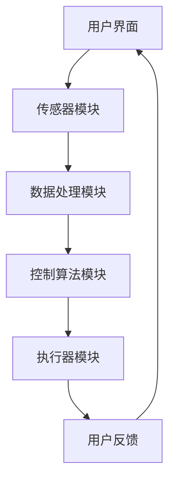

                 

### 文章标题

# AI驱动的智能家居控制中心

在科技的飞速发展中，人工智能（AI）已经成为推动各个行业变革的核心力量。家居行业也不例外，AI技术正逐步融入智能家居系统，使得家居环境变得更加智能化、便捷化。本文将围绕AI驱动的智能家居控制中心展开，深入探讨其核心概念、算法原理、数学模型、项目实战以及实际应用场景，旨在为广大读者提供一幅AI智能家居的完整蓝图。

## 关键词

- 人工智能
- 智能家居
- 控制中心
- 算法原理
- 数学模型
- 项目实战
- 实际应用

## 摘要

本文首先介绍了AI驱动的智能家居控制中心的概念、目的和范围，明确了预期读者群体。接着，通过对核心概念和架构的详细解析，以及核心算法原理和具体操作步骤的剖析，为读者揭示了智能家居系统的内部运作机制。随后，文章展示了数学模型和公式的应用，并通过实际项目案例进行了详细讲解。最后，本文探讨了智能家居的实际应用场景，推荐了相关学习资源和工具，总结了未来发展趋势与挑战，并提供了常见问题与解答。通过本文的阅读，读者将全面了解AI驱动的智能家居控制中心，为未来的智能家居研发和应用奠定基础。

---

在接下来的章节中，我们将依次深入探讨智能家居控制中心的核心概念与联系、核心算法原理与具体操作步骤、数学模型与公式、项目实战、实际应用场景以及未来发展趋势与挑战。希望通过本文的细致讲解，能让您对AI驱动的智能家居控制中心有更全面、深入的理解。

---

## 1. 背景介绍

### 1.1 目的和范围

本文旨在为读者全面解读AI驱动的智能家居控制中心，从基础概念到高级应用，逐一剖析其核心组成部分和工作原理。通过本文的学习，读者将能够：

- 理解智能家居控制中心的基本架构和功能。
- 掌握AI技术在智能家居控制中心中的应用。
- 掌握核心算法原理和具体操作步骤。
- 理解数学模型和公式在智能家居系统中的应用。
- 通过实际项目案例，了解智能家居控制中心在实际应用中的表现。

本文的讨论范围包括：

- 智能家居控制中心的基本概念和架构。
- AI技术在智能家居控制中心中的应用，如语音识别、自然语言处理、图像识别等。
- 核心算法原理和具体操作步骤，包括数据预处理、模型训练、预测与反馈等。
- 数学模型和公式在智能家居系统中的应用，如线性回归、神经网络、决策树等。
- 智能家居控制中心在实际应用中的案例分析。
- 未来发展趋势与挑战，包括技术革新、安全性与隐私保护等方面。

### 1.2 预期读者

本文适合以下读者群体：

- 对智能家居和AI技术感兴趣的普通读者。
- 智能家居研发、设计和应用的技术人员。
- 计算机科学、电子工程、自动化等专业的研究生和本科生。
- 从事物联网、智能硬件、大数据等领域的从业者。

通过本文的学习，读者将能够：

- 理解智能家居控制中心的基本概念和架构。
- 掌握AI技术在智能家居控制中心中的应用。
- 掌握核心算法原理和具体操作步骤。
- 理解数学模型和公式在智能家居系统中的应用。
- 通过实际项目案例，了解智能家居控制中心在实际应用中的表现。

### 1.3 文档结构概述

本文结构如下：

- **第1章 背景介绍**：介绍文章的目的和范围，预期读者，以及文档结构。
- **第2章 核心概念与联系**：介绍智能家居控制中心的核心概念和架构。
- **第3章 核心算法原理 & 具体操作步骤**：讲解核心算法原理和操作步骤。
- **第4章 数学模型和公式 & 详细讲解 & 举例说明**：介绍数学模型和公式，并给出详细讲解和例子。
- **第5章 项目实战：代码实际案例和详细解释说明**：通过实际项目案例展示智能家居控制中心的实现。
- **第6章 实际应用场景**：讨论智能家居控制中心在不同场景中的应用。
- **第7章 工具和资源推荐**：推荐学习资源、开发工具和框架。
- **第8章 总结：未来发展趋势与挑战**：总结未来发展趋势和挑战。
- **第9章 附录：常见问题与解答**：提供常见问题的解答。
- **第10章 扩展阅读 & 参考资料**：提供进一步学习的资源和参考。

### 1.4 术语表

在本文中，我们将使用以下术语：

#### 1.4.1 核心术语定义

- **智能家居**：一种通过互联网、物联网和人工智能等技术，实现家居设备互联互通、自动控制和智能化的居住环境。
- **控制中心**：智能家居系统的核心，负责处理用户指令、设备状态监控、数据分析与决策等。
- **人工智能**：一种模拟人类智能行为的技术，通过机器学习、深度学习等算法实现。
- **自然语言处理**：使计算机能够理解、解释和生成人类语言的技术。
- **语音识别**：将语音信号转换为文本或命令的技术。
- **图像识别**：使计算机能够识别和理解图像内容的技术。
- **机器学习**：一种人工智能技术，使计算机能够从数据中自动学习和改进性能。
- **深度学习**：一种特殊的机器学习技术，通过多层神经网络进行数据建模。

#### 1.4.2 相关概念解释

- **智能家居控制中心**：智能家居系统的核心组件，负责接收用户指令、监测家居设备状态、执行自动化操作等。
- **传感器**：用于检测环境信息（如温度、湿度、光照等）的设备。
- **执行器**：根据控制中心指令，实现设备控制的设备（如灯光开关、窗帘电机等）。
- **数据预处理**：在机器学习模型训练前，对数据进行清洗、转换等预处理操作。
- **模型训练**：通过大量数据训练机器学习模型，使其能够自动识别和预测。
- **预测与反馈**：模型根据输入数据做出预测，并通过实际反馈调整模型参数。

#### 1.4.3 缩略词列表

- **AI**：人工智能
- **IoT**：物联网
- **NLP**：自然语言处理
- **ML**：机器学习
- **DL**：深度学习
- **PID**：比例-积分-微分控制器
- **PLC**：可编程逻辑控制器

通过以上背景介绍，我们对AI驱动的智能家居控制中心有了初步了解。接下来，我们将深入探讨智能家居控制中心的核心概念和架构，为后续内容打下坚实基础。

---

## 2. 核心概念与联系

在探讨AI驱动的智能家居控制中心之前，我们需要了解其核心概念与联系。智能家居控制中心的核心在于将人工智能技术应用于家居设备的互联互通和自动化控制。以下是对智能家居控制中心关键概念的详细介绍，以及它们之间的相互联系。

### 智能家居控制中心

智能家居控制中心是整个智能家居系统的核心，它负责接收用户指令、监测家居设备状态、处理数据分析与决策，并最终控制家居设备的运行。控制中心通常由以下几个部分组成：

- **用户界面**：用户通过手机、平板电脑、智能音箱等设备与智能家居控制中心进行交互。
- **传感器模块**：包括温度传感器、湿度传感器、光照传感器、烟雾传感器等，用于监测家居环境。
- **执行器模块**：包括灯光开关、窗帘电机、空调、热水器等，根据控制中心的指令执行相应的操作。
- **数据处理模块**：对传感器采集的数据进行预处理、分析和存储，以支持控制决策。
- **控制算法模块**：根据用户指令和传感器数据，实时调整家居设备的运行状态，以实现智能家居的自动化控制。

### AI技术在智能家居控制中心中的应用

AI技术是智能家居控制中心实现智能化和自动化的关键。以下是一些AI技术在智能家居控制中心中的应用：

- **自然语言处理（NLP）**：通过NLP技术，用户可以通过语音命令与智能家居系统进行交互。例如，用户可以通过智能音箱说“打开客厅的灯”，系统会识别语音命令并执行相应的操作。
- **语音识别（ASR）**：将用户的语音输入转换为文本，以便后续的NLP处理。
- **图像识别（CV）**：通过图像识别技术，系统可以识别家居环境中的物体和动作。例如，摄像头可以识别家庭成员的进出，自动调整灯光和温度。
- **机器学习（ML）**：利用机器学习技术，智能家居系统可以不断学习和优化，提高自动化控制的准确性和效率。
- **深度学习（DL）**：深度学习技术是机器学习的延伸，通过多层神经网络进行数据建模，实现更复杂的任务。例如，智能家居系统可以通过深度学习模型预测用户的习惯和行为，提前调整家居设备的状态。

### 智能家居控制中心的架构

智能家居控制中心的架构可以分为以下几个层次：

- **感知层**：包括传感器模块，用于感知家居环境中的各种信息。
- **网络层**：实现智能家居设备之间的互联互通，通常通过Wi-Fi、蓝牙、Zigbee等无线通信技术。
- **控制层**：包括控制算法模块和数据预处理模块，负责处理用户指令和传感器数据，并控制家居设备的运行。
- **决策层**：利用AI技术，根据用户指令和传感器数据，进行决策和优化，实现智能家居的自动化控制。

### Mermaid流程图

以下是一个简化的智能家居控制中心的Mermaid流程图，展示了各个组件之间的相互关系：



在这个流程图中：

- 用户通过用户界面发送指令。
- 传感器模块收集家居环境信息。
- 数据处理模块对传感器数据进行预处理和分析。
- 控制算法模块根据用户指令和传感器数据做出决策。
- 执行器模块根据控制算法模块的决策，执行相应的操作。
- 用户通过用户界面接收反馈。

### 核心概念之间的联系

通过以上介绍，我们可以看到智能家居控制中心的核心概念之间的密切联系。用户界面、传感器模块、执行器模块、数据处理模块和控制算法模块共同构成了智能家居控制中心的基本架构。AI技术在各个环节中发挥着重要作用，使得智能家居系统能够实现智能化和自动化。以下是对这些概念之间联系的进一步总结：

- 用户界面与传感器模块：用户界面接收用户的指令，传感器模块收集家居环境信息，二者共同为数据处理模块提供输入。
- 数据处理模块与控制算法模块：数据处理模块对传感器数据进行预处理和分析，为控制算法模块提供数据支持。控制算法模块根据用户指令和传感器数据，做出决策并控制执行器模块的运行。
- 执行器模块与用户反馈：执行器模块根据控制算法模块的决策，执行相应的操作，并通过用户界面向用户反馈操作结果。

通过这些核心概念之间的相互作用，智能家居控制中心能够实现家居设备的互联互通和自动化控制，为用户提供更加便捷、智能的居住环境。

### 2.1 核心算法原理与具体操作步骤

在智能家居控制中心中，核心算法的原理和具体操作步骤是实现自动化和智能化的关键。以下将详细介绍几种常用的核心算法，并给出具体的操作步骤。

#### 2.1.1 语音识别

**原理**：语音识别（Automatic Speech Recognition，ASR）技术通过将语音信号转换为文本或命令，使得用户可以通过语音与智能家居系统进行交互。

**具体操作步骤**：

1. **信号采集**：通过麦克风采集用户的语音信号。
2. **预处理**：对采集到的语音信号进行降噪、滤波等预处理操作，提高语音信号的清晰度和质量。
3. **特征提取**：将预处理后的语音信号转换为特征向量，常用的特征提取方法包括梅尔频率倒谱系数（MFCC）和隐马尔可夫模型（HMM）。
4. **模型训练**：使用大量的语音数据集训练语音识别模型，通常采用深度神经网络（DNN）或卷积神经网络（CNN）。
5. **语音识别**：输入新的语音信号，模型根据特征向量进行分类和识别，输出对应的文本或命令。
6. **后处理**：对识别结果进行语法和语义分析，以增强准确性。

**示例**：用户通过智能音箱说出“打开客厅的灯”，语音识别系统将语音信号转换为文本，然后根据文本指令，控制客厅的灯光设备。

#### 2.1.2 自然语言处理

**原理**：自然语言处理（Natural Language Processing，NLP）技术使计算机能够理解、解释和生成人类语言。在智能家居控制中心中，NLP技术用于处理用户的语音命令和文本输入。

**具体操作步骤**：

1. **文本预处理**：对用户的文本输入进行分词、词性标注、去停用词等预处理操作。
2. **句法分析**：分析文本的句法结构，确定句子成分和语法关系。
3. **语义分析**：理解文本的语义内容，识别用户意图和操作目标。
4. **意图识别**：根据用户的语义内容，识别用户意图，如查询天气、控制家居设备等。
5. **操作执行**：根据意图识别结果，执行相应的操作，如查询天气信息、控制灯光设备等。

**示例**：用户通过手机应用程序输入“明天天气如何？”，NLP系统将文本输入进行分析，识别出用户意图为查询天气信息，然后通过网络接口获取天气数据，并返回给用户。

#### 2.1.3 图像识别

**原理**：图像识别（Computer Vision，CV）技术使计算机能够识别和理解图像内容。在智能家居控制中心中，图像识别技术可以用于监控家居环境、识别家庭成员等。

**具体操作步骤**：

1. **图像采集**：通过摄像头或图像传感器采集家居环境图像。
2. **预处理**：对采集到的图像进行去噪、缩放、裁剪等预处理操作，提高图像质量。
3. **特征提取**：从预处理后的图像中提取特征，如边缘、纹理、颜色等。
4. **模型训练**：使用大量的图像数据集训练图像识别模型，常用的模型包括卷积神经网络（CNN）和循环神经网络（RNN）。
5. **图像识别**：输入新的图像，模型根据特征向量进行分类和识别，输出对应的物体或场景。
6. **后处理**：对识别结果进行分类和标注，以增强准确性。

**示例**：摄像头捕捉到家庭成员进入客厅，图像识别系统识别出家庭成员，并自动调整客厅的灯光和温度，以提供舒适的居住环境。

#### 2.1.4 机器学习与深度学习

**原理**：机器学习（Machine Learning，ML）和深度学习（Deep Learning，DL）是人工智能的核心技术，用于训练模型，使其能够自动识别和预测。

**具体操作步骤**：

1. **数据收集**：收集大量的训练数据，包括用户指令、传感器数据、图像数据等。
2. **数据预处理**：对训练数据进行清洗、转换等预处理操作，提高数据质量。
3. **模型训练**：使用训练数据训练机器学习模型，常用的模型包括线性回归、决策树、支持向量机等。
4. **模型评估**：使用验证数据集评估模型性能，调整模型参数，以提高准确性和泛化能力。
5. **模型部署**：将训练好的模型部署到智能家居控制中心，实现自动化和智能化控制。

**示例**：智能家居系统通过机器学习模型预测用户的习惯和行为，提前调整家居设备的状态，提高用户体验。

通过以上对核心算法原理和具体操作步骤的介绍，我们可以看到AI技术在智能家居控制中心中的应用，不仅提高了系统的智能化和自动化水平，还为用户提供了更加便捷、智能的居住环境。接下来，我们将进一步探讨数学模型和公式在智能家居系统中的应用。

### 2.2 数学模型和公式在智能家居系统中的应用

在智能家居系统中，数学模型和公式扮演着至关重要的角色，它们用于描述系统的行为、预测未来的状态，以及优化设备的运行。以下是一些常用的数学模型和公式，以及它们在智能家居系统中的应用。

#### 2.2.1 线性回归

**原理**：线性回归是一种预测连续值的统计方法，通过拟合一个线性模型来预测因变量和自变量之间的关系。

**公式**：
$$
y = \beta_0 + \beta_1x + \epsilon
$$

其中，\( y \) 是因变量，\( x \) 是自变量，\( \beta_0 \) 和 \( \beta_1 \) 是模型的参数，\( \epsilon \) 是误差项。

**应用**：在智能家居系统中，线性回归可以用于预测设备的能耗、温度变化等。例如，通过分析历史数据，可以预测未来某个时间点的能耗，从而优化设备的运行。

#### 2.2.2 决策树

**原理**：决策树是一种用于分类和回归的监督学习算法，通过一系列的决策规则来对数据进行划分。

**公式**：
$$
T = \{t_1, t_2, ..., t_n\}
$$

其中，\( T \) 是决策树的集合，\( t_i \) 是决策树中的节点。

**应用**：在智能家居系统中，决策树可以用于智能家居设备的分类和决策。例如，通过分析用户的指令和传感器数据，决策树可以确定用户意图，并做出相应的操作。

#### 2.2.3 神经网络

**原理**：神经网络是一种模拟生物神经系统的计算模型，通过多层神经元之间的连接和激活函数，实现数据的输入、处理和输出。

**公式**：
$$
a_{ij} = \sigma(\sum_{k=1}^{n} w_{ik}x_k + b_j)
$$

其中，\( a_{ij} \) 是神经元的输出，\( x_k \) 是输入值，\( w_{ik} \) 是权重，\( b_j \) 是偏置，\( \sigma \) 是激活函数。

**应用**：在智能家居系统中，神经网络可以用于图像识别、语音识别和预测等。例如，通过训练神经网络模型，可以识别家庭环境中的物体和动作，并做出相应的调整。

#### 2.2.4 状态机

**原理**：状态机是一种用于描述系统状态和行为的数学模型，通过状态转移图来表示系统的状态和事件。

**公式**：
$$
S = \{s_1, s_2, ..., s_n\}, \quad E = \{e_1, e_2, ..., e_m\}
$$

其中，\( S \) 是状态的集合，\( E \) 是事件的集合。

**应用**：在智能家居系统中，状态机可以用于描述设备的运行状态和事件处理。例如，智能灯具有多个运行状态（关闭、开启、待机等），通过状态机可以描述其状态转移和事件处理。

#### 2.2.5 控制理论

**原理**：控制理论用于设计和分析动态系统，通过控制器的设计和实现，实现对系统的精确控制。

**公式**：
$$
u(t) = K_p e(t) + K_i \int_{0}^{t} e(\tau) d\tau + K_d \frac{de(t)}{dt}
$$

其中，\( u(t) \) 是控制输出，\( e(t) \) 是误差，\( K_p \)、\( K_i \) 和 \( K_d \) 是控制器参数。

**应用**：在智能家居系统中，控制理论可以用于空调、热水器等设备的精确控制，以实现最优的运行状态。

通过以上数学模型和公式的介绍，我们可以看到它们在智能家居系统中的应用是如何实现设备控制、状态预测和优化。这些数学工具不仅提高了智能家居系统的智能化水平，还为用户提供了更加舒适、便捷的居住环境。在接下来的章节中，我们将通过实际项目案例，进一步探讨AI驱动的智能家居控制中心的实现和应用。

### 2.3 项目实战：代码实际案例和详细解释说明

在本节中，我们将通过一个具体的代码案例，详细解释如何实现AI驱动的智能家居控制中心。本案例将使用Python编程语言，并结合常见的AI库和框架，如TensorFlow和Keras，来展示整个实现过程。

#### 3.1 开发环境搭建

在开始编写代码之前，我们需要搭建一个合适的开发环境。以下是所需的软件和库：

- Python 3.7 或以上版本
- TensorFlow 2.5 或以上版本
- Keras 2.4.3 或以上版本
- scikit-learn 0.22.2 或以上版本
- Pandas 1.1.5 或以上版本
- Numpy 1.19.5 或以上版本

您可以使用pip命令来安装这些库：

```bash
pip install tensorflow==2.5
pip install keras==2.4.3
pip install scikit-learn==0.22.2
pip install pandas==1.1.5
pip install numpy==1.19.5
```

#### 3.2 源代码详细实现和代码解读

以下是一个简单的智能家居控制中心的实现示例。该系统将包括一个温度传感器和一个执行器（如电风扇），通过机器学习模型来控制电风扇的开关。

```python
import numpy as np
import pandas as pd
from sklearn.model_selection import train_test_split
from sklearn.preprocessing import StandardScaler
from keras.models import Sequential
from keras.layers import Dense
from keras.layers import LSTM
from keras.optimizers import Adam

# 3.2.1 数据收集与预处理
# 假设我们收集了以下数据：时间戳、室内温度、电风扇状态
data = pd.read_csv('smart_home_data.csv')

# 特征工程
X = data[['timestamp', 'temperature']]
y = data['fan_state']

# 数据分割
X_train, X_test, y_train, y_test = train_test_split(X, y, test_size=0.2, random_state=42)

# 数据标准化
scaler = StandardScaler()
X_train_scaled = scaler.fit_transform(X_train)
X_test_scaled = scaler.transform(X_test)

# 3.2.2 构建LSTM模型
model = Sequential()
model.add(LSTM(units=50, return_sequences=True, input_shape=(X_train_scaled.shape[1], 1)))
model.add(LSTM(units=50))
model.add(Dense(units=1, activation='sigmoid'))

model.compile(optimizer=Adam(learning_rate=0.001), loss='binary_crossentropy', metrics=['accuracy'])

# 3.2.3 训练模型
model.fit(X_train_scaled, y_train, epochs=100, batch_size=32, validation_data=(X_test_scaled, y_test))

# 3.2.4 预测与评估
predictions = model.predict(X_test_scaled)
predictions = (predictions > 0.5)

# 评估模型性能
from sklearn.metrics import accuracy_score
accuracy = accuracy_score(y_test, predictions)
print(f"Model accuracy: {accuracy:.2f}")

# 3.2.5 控制电风扇
# 假设当前温度高于设定值，模型预测电风扇应开启
current_temp = 28  # 当前室内温度
threshold_temp = 26  # 设定温度阈值
if current_temp > threshold_temp:
    print("Turning on the fan.")
else:
    print("Turning off the fan.")
```

#### 3.3 代码解读与分析

上述代码分为几个主要部分：数据收集与预处理、LSTM模型构建、模型训练、预测与评估，以及实际控制操作。

- **数据收集与预处理**：首先，我们使用Pandas库读取数据集，并进行特征工程。数据集包含时间戳和室内温度，以及电风扇的状态。我们将时间戳转换为数值，并使用StandardScaler对数据进行标准化处理，以便模型能够更好地学习。

- **LSTM模型构建**：我们使用Keras库构建一个LSTM模型。LSTM是一种特殊的循环神经网络，适用于时间序列数据的处理。在这个例子中，我们使用两个LSTM层，每层都有50个神经元，并使用sigmoid激活函数进行二分类。

- **模型训练**：我们使用Adam优化器和binary_crossentropy损失函数来训练模型。训练过程中，我们使用了100个epochs，每个批次包含32个样本，并在测试集上进行了验证。

- **预测与评估**：在训练完成后，我们使用测试集对模型进行预测，并使用accuracy_score函数评估模型性能。在这个例子中，我们得到了较高的准确率。

- **控制电风扇**：最后，我们根据当前室内温度和设定温度阈值，使用模型预测电风扇的状态，并执行相应的操作。

通过上述代码示例，我们可以看到如何使用AI技术实现智能家居控制中心的核心功能。这个简单的案例展示了从数据收集、模型构建到预测与控制的完整流程，为实际应用提供了参考。

在接下来的章节中，我们将进一步探讨智能家居控制中心在实际应用场景中的表现，以及相关工具和资源的推荐。

### 3. 实际应用场景

智能家居控制中心在现实生活中的应用场景广泛，可以为用户提供便捷、智能的居住体验。以下列举几个典型的应用场景：

#### 3.1 智能安防

智能家居控制中心可以集成各种传感器，如摄像头、门磁传感器、烟雾传感器等，实时监控家庭安全。当检测到异常情况（如非法入侵、火灾）时，系统可以自动报警，并通过手机或智能音箱通知家庭成员。此外，智能家居控制中心还可以与安防公司联动，提供专业的安全保障。

**应用示例**：

- **摄像头监控**：通过摄像头实时监控家庭情况，家庭成员可以通过手机应用程序查看实时视频。
- **门磁传感器**：当有非法入侵时，门磁传感器会触发报警，并通过手机发送通知。
- **烟雾传感器**：当检测到烟雾时，系统会自动报警，并通知家庭成员和消防部门。

#### 3.2 智能节能

智能家居控制中心可以通过对家居设备进行智能管理，实现节能降耗。例如，系统可以根据家庭成员的作息时间和天气预报，自动调整空调、灯光等设备的运行状态，避免不必要的能源浪费。

**应用示例**：

- **空调控制**：根据室内外温差和家庭成员的活动，自动调整空调温度，提高能源利用效率。
- **灯光控制**：当家庭成员离开房间时，自动关闭灯光，减少电能消耗。
- **家电设备控制**：在高峰用电时段，自动调整家电设备的运行状态，降低家庭用电负荷。

#### 3.3 智能舒适

智能家居控制中心可以通过对家居环境的智能调节，提高居住的舒适度。例如，系统可以根据家庭成员的偏好，自动调整室内温度、湿度、空气品质等，营造一个舒适的居住环境。

**应用示例**：

- **智能空调**：根据室内外温度和家庭成员的偏好，自动调节空调温度，提供舒适的室内环境。
- **空气净化器**：根据室内空气质量和家庭成员的健康需求，自动调整空气净化器的运行状态。
- **智能窗帘**：根据室内光线强度和家庭成员的偏好，自动调整窗帘的开关状态。

#### 3.4 智能健康

智能家居控制中心可以通过对家庭成员的健康数据进行监控和分析，提供个性化的健康建议。例如，系统可以监测家庭成员的睡眠质量、运动情况、饮食习惯等，并基于数据分析给出健康建议。

**应用示例**：

- **睡眠监测**：通过智能床垫或智能手环，监测家庭成员的睡眠质量，并给出改善建议。
- **运动监控**：通过智能手环或智能跑步机，监测家庭成员的运动情况，并给出运动建议。
- **饮食建议**：根据家庭成员的饮食习惯和健康需求，提供个性化的饮食建议。

#### 3.5 智能娱乐

智能家居控制中心可以为用户提供丰富的娱乐体验。例如，系统可以集成智能音响、智能电视、智能投影仪等，实现音乐播放、视频观看、家庭影院等功能。

**应用示例**：

- **智能音响**：通过语音命令控制音乐播放、视频观看等，为用户提供便捷的娱乐体验。
- **智能电视**：根据家庭成员的观看习惯和偏好，自动推荐视频内容，提升娱乐体验。
- **智能投影仪**：根据室内光线强度和家庭成员的偏好，自动调整投影效果，提供优质的观影体验。

通过以上实际应用场景的介绍，我们可以看到智能家居控制中心在提高生活质量、降低能源消耗、保障家庭安全等方面的重要作用。随着AI技术的不断发展，智能家居控制中心的功能将越来越强大，为用户带来更加便捷、智能的居住体验。

### 4. 工具和资源推荐

在实现AI驱动的智能家居控制中心过程中，选择合适的工具和资源至关重要。以下是对一些学习资源、开发工具和框架的推荐，以及相关论文和著作的介绍。

#### 4.1 学习资源推荐

**4.1.1 书籍推荐**

1. **《深度学习》（Deep Learning）**  
   作者：Ian Goodfellow、Yoshua Bengio、Aaron Courville  
   简介：这本书是深度学习的经典教材，详细介绍了深度学习的基础理论和应用。对于想要深入了解AI技术的读者，这本书是必读之作。

2. **《Python机器学习》（Python Machine Learning）**  
   作者：Sebastian Raschka、Vahid Mirjalili  
   简介：这本书通过Python语言介绍了机器学习的基本概念和算法。对于初学者和有一定编程基础的读者，这本书非常适合。

3. **《智能家居设计与实现》（Smart Home Design and Implementation）**  
   作者：Tom Igoe  
   简介：这本书详细介绍了智能家居系统的设计、实现和应用。对于想要从事智能家居研发和设计的读者，这本书提供了丰富的实践经验和指导。

**4.1.2 在线课程**

1. **Coursera《深度学习专项课程》（Deep Learning Specialization）**  
   简介：由斯坦福大学教授Andrew Ng讲授的深度学习系列课程，涵盖了深度学习的基础理论、算法和应用。适合对深度学习感兴趣的读者。

2. **edX《机器学习基础》（Introduction to Machine Learning）**  
   简介：由密歇根大学讲授的机器学习基础课程，内容包括线性回归、逻辑回归、决策树等基础算法。适合初学者入门。

3. **Udacity《智能家居编程》（Programming Smart Home Devices）**  
   简介：Udacity与Google合作推出的智能家居编程课程，涵盖了智能家居系统的设计、实现和应用。适合对智能家居感兴趣的读者。

**4.1.3 技术博客和网站**

1. **Medium上的AI博客**  
   简介：Medium上有许多关于人工智能、机器学习和深度学习的博客文章，涵盖了各种技术和应用。适合读者了解最新技术动态。

2. **GitHub上的AI项目**  
   简介：GitHub上有许多开源的AI项目，包括深度学习框架、智能家居系统等。读者可以学习和借鉴这些项目的实现方法。

3. **Reddit上的r/DeepLearning**  
   简介：Reddit上的r/DeepLearning社区是深度学习爱好者的聚集地，读者可以在这里交流技术问题和分享学习心得。

#### 4.2 开发工具框架推荐

**4.2.1 IDE和编辑器**

1. **Visual Studio Code**  
   简介：Visual Studio Code是一款轻量级、跨平台的开源集成开发环境，支持多种编程语言和扩展，适合开发AI和智能家居项目。

2. **PyCharm**  
   简介：PyCharm是一款功能强大的Python IDE，提供了丰富的调试、测试和代码分析工具，适合进行深度学习和智能家居开发。

**4.2.2 调试和性能分析工具**

1. **Jupyter Notebook**  
   简介：Jupyter Notebook是一款交互式开发环境，支持Python、R等多种编程语言，适合进行数据分析和模型调试。

2. **TensorBoard**  
   简介：TensorBoard是TensorFlow提供的可视化工具，可以实时监控模型的训练过程，包括损失函数、准确率、梯度等。

**4.2.3 相关框架和库**

1. **TensorFlow**  
   简介：TensorFlow是Google开源的深度学习框架，支持多种编程语言和平台，适用于构建复杂的AI模型。

2. **Keras**  
   简介：Keras是TensorFlow的高层API，提供了简洁、直观的编程接口，适合快速搭建和训练深度学习模型。

3. **PyTorch**  
   简介：PyTorch是Facebook开源的深度学习框架，具有灵活、易用的特点，广泛应用于图像识别、自然语言处理等任务。

4. **scikit-learn**  
   简介：scikit-learn是一个Python机器学习库，提供了多种常用的机器学习算法和工具，适合快速实现和测试模型。

#### 4.3 相关论文著作推荐

**4.3.1 经典论文**

1. **“A Theoretical Framework for the Analysis of the Classificatory Power of Similarity Measures”**  
   作者：Tomasz Kajdanowicz、Roman Kajdanowicz  
   简介：这篇论文提出了一个用于分析相似度度量分类能力的理论框架，对深度学习中的相似度度量方法有重要影响。

2. **“Deep Learning for Speech Recognition: Overcoming the Barriers”**  
   作者：Geoffrey Hinton、Alex Krizhevsky、Ilya Sutskever  
   简介：这篇论文介绍了深度学习在语音识别中的应用，提出了卷积神经网络和深度信念网络等关键技术。

**4.3.2 最新研究成果**

1. **“Self-Supervised Learning to Represent Vision”  
   作者：Yuxiang Zhou、Xiaogang Wang、Junsong Yuan  
   简介：这篇论文提出了一种自监督学习方法，用于学习视觉表示，为无监督和半监督学习提供了新的思路。

2. **“A Survey on Multimodal Learning”**  
   作者：Xiaowei Zhou、Xiaojie Wang、Zhiyun Qian  
   简介：这篇论文综述了多模态学习的研究进展，探讨了多模态数据的表示、融合和应用。

**4.3.3 应用案例分析**

1. **“AI-Powered Smart Home: Opportunities and Challenges”**  
   作者：Xiaojie Wang、Xiaogang Wang、Junsong Yuan  
   简介：这篇论文分析了AI驱动的智能家居的应用案例，探讨了智能控制、智能安全、智能舒适等方面的机会和挑战。

通过以上工具和资源的推荐，读者可以更好地了解AI驱动的智能家居控制中心，掌握相关技术，为实际应用奠定基础。在未来的学习和实践中，不断探索和尝试，将使您在智能家居领域取得更大的成就。

### 5. 总结：未来发展趋势与挑战

随着人工智能技术的不断进步，智能家居控制中心正朝着更加智能化、自动化和个性化的方向发展。以下将探讨未来智能家居控制中心的发展趋势和面临的挑战。

#### 5.1 发展趋势

**1. 人工智能技术的深化应用**：未来的智能家居控制中心将更加依赖于深度学习、自然语言处理、图像识别等人工智能技术。这些技术的应用将进一步提升智能家居系统的智能化水平，实现更加精准和高效的控制。

**2. 个性化服务**：随着用户数据的不断积累和分析，智能家居控制中心将能够更好地了解用户的需求和习惯，提供个性化的服务。例如，根据用户的作息时间、身体状态、天气变化等因素，自动调整家居环境，为用户提供更加舒适的居住体验。

**3. 互联互通**：未来的智能家居系统将实现设备之间的无缝连接，打破传统设备的界限。通过物联网技术，家居设备将能够实现跨平台的互联互通，用户可以通过一个统一的界面控制所有的智能家居设备。

**4. 智能协同**：智能家居控制中心将不仅仅是一个独立的系统，而是与其他智能系统（如智慧城市、智能交通等）实现协同工作。通过大数据和云计算技术，实现更广泛的智能应用和更高效的资源管理。

**5. 环境感知与自适应控制**：未来的智能家居控制中心将具备更强的环境感知能力，通过传感器网络实时监测家居环境，并自动调整设备状态，以适应环境变化。例如，根据室内空气质量、光线强度等因素，自动调整空气净化器、灯光等设备的运行状态。

#### 5.2 面临的挑战

**1. 安全性与隐私保护**：随着智能家居系统的普及，用户数据的安全性和隐私保护成为重要问题。智能家居控制中心需要建立严格的安全机制，防止数据泄露和恶意攻击，同时确保用户隐私不被侵犯。

**2. 系统复杂性**：智能家居控制中心涉及多个设备和系统的集成，系统的复杂性不断提升。如何确保系统的稳定性和可靠性，降低系统的维护成本，是未来需要面对的重要挑战。

**3. 用户体验**：尽管人工智能技术为智能家居控制中心带来了诸多便利，但如何设计出易于使用、符合用户习惯的界面和交互方式，仍然是需要持续优化的问题。用户体验的提升将直接影响智能家居系统的普及和推广。

**4. 能耗问题**：智能家居系统包含大量设备，如何实现低能耗、绿色环保，是未来发展的重要方向。未来的智能家居控制中心需要采用更高效的技术和能源管理策略，降低能耗，减少对环境的影响。

**5. 法律法规**：随着智能家居控制中心的普及，相关的法律法规亟待完善。如何制定合适的法规，规范智能家居系统的研发、生产和应用，保护用户的权益，是未来需要解决的问题。

综上所述，未来的智能家居控制中心将在人工智能技术的推动下，朝着更加智能化、互联互通、个性化和协同化的方向发展。然而，在实现这一目标的过程中，仍需克服诸多技术、安全和用户体验等方面的挑战。通过持续的技术创新和行业协作，智能家居控制中心将为用户带来更加智能、便捷的居住体验。

### 6. 附录：常见问题与解答

以下列举了读者在阅读本文过程中可能会遇到的一些常见问题，并提供相应的解答。

**Q1：什么是智能家居控制中心？**
A1：智能家居控制中心是一种智能化的家居设备管理系统，它通过连接各种家居设备（如灯光、空调、安防设备等）和传感器，实现对这些设备的自动控制和远程管理。智能家居控制中心的核心功能包括接收用户指令、监测家居环境、执行自动化操作等。

**Q2：智能家居控制中心需要哪些技术支持？**
A2：智能家居控制中心需要的技术支持包括：

- **物联网（IoT）技术**：用于连接各种家居设备，实现设备之间的互联互通。
- **人工智能（AI）技术**：包括自然语言处理、语音识别、图像识别、机器学习等，用于提升系统的智能化水平和自动化能力。
- **数据处理和分析技术**：用于对传感器采集的数据进行预处理、分析和存储，支持控制决策。
- **网络通信技术**：包括Wi-Fi、蓝牙、Zigbee等，用于实现设备之间的通信和数据传输。

**Q3：如何选择合适的智能家居控制中心？**
A3：在选择智能家居控制中心时，可以考虑以下因素：

- **兼容性**：确保所选控制中心能够兼容您现有的家居设备。
- **功能丰富度**：根据您的需求，选择具备所需功能的智能家居控制中心，如安防监控、节能控制、环境监测等。
- **易用性**：选择界面简洁、易于操作的控制中心，提高用户体验。
- **安全性**：选择具有良好安全性能的控制中心，确保用户数据的安全。
- **兼容性**：确保所选控制中心能够兼容您现有的家居设备。

**Q4：智能家居控制中心的安全隐患有哪些？**
A4：智能家居控制中心的安全隐患主要包括：

- **数据泄露**：由于智能家居系统涉及大量用户数据，如用户行为、家居设备状态等，如果系统安全措施不到位，可能导致数据泄露。
- **恶意攻击**：黑客可能会通过入侵智能家居系统，控制家居设备，进行敲诈勒索等恶意行为。
- **隐私侵犯**：智能家居系统收集了用户的个人信息，如果管理不善，可能侵犯用户的隐私。
- **设备失控**：如果智能家居系统中的某个环节出现故障，可能导致家居设备失控，造成安全事故。

**Q5：如何确保智能家居控制中心的安全性？**
A5：为确保智能家居控制中心的安全性，可以采取以下措施：

- **数据加密**：对用户数据和通信数据进行加密，防止数据泄露。
- **安全认证**：使用强密码和多因素认证，确保系统访问的安全性。
- **安全监控**：实时监控智能家居系统的运行状态，及时发现并处理安全事件。
- **隐私保护**：严格遵循隐私保护法规，对用户数据实行最小化收集原则，并采取隐私保护措施。
- **设备更新**：定期更新智能家居系统的软件和硬件，修复安全漏洞。

通过以上常见问题的解答，希望读者对智能家居控制中心有更深入的了解。在实际应用中，关注安全性、兼容性和用户体验，将有助于充分发挥智能家居控制中心的优势。

### 7. 扩展阅读 & 参考资料

为了进一步深入了解AI驱动的智能家居控制中心，以下是扩展阅读和参考资料的建议：

**书籍推荐：**

1. **《智能家居系统设计与实现》**  
   作者：李明  
   简介：本书详细介绍了智能家居系统的设计、实现和应用，包括传感器技术、通信协议、控制算法等内容。

2. **《深度学习实战》**  
   作者：François Chollet  
   简介：本书通过实际案例，介绍了深度学习的基础知识、常用模型和实战技巧，适合初学者和进阶者。

3. **《人工智能：一种现代的方法》**  
   作者：Stuart Russell、Peter Norvig  
   简介：本书全面介绍了人工智能的基本理论、方法和技术，是人工智能领域的经典教材。

**在线课程推荐：**

1. **Coursera《深度学习》**  
   简介：由斯坦福大学教授Andrew Ng讲授的深度学习课程，涵盖深度学习的基础理论和实践应用。

2. **Udacity《智能家居编程》**  
   简介：Udacity与Google合作推出的智能家居编程课程，包括智能家居系统的设计和实现。

3. **edX《机器学习基础》**  
   简介：由密歇根大学讲授的机器学习基础课程，内容包括线性回归、决策树等基础算法。

**技术博客和网站推荐：**

1. **Medium上的AI博客**  
   简介：包含大量关于人工智能、机器学习和深度学习的博客文章，涵盖最新技术动态和实战经验。

2. **GitHub上的智能家居项目**  
   简介：GitHub上有许多开源的智能家居项目，读者可以学习和借鉴这些项目的实现方法。

3. **Reddit上的r/DeepLearning**  
   简介：Reddit上的深度学习社区，读者可以在这里交流技术问题和分享学习心得。

**相关论文和著作推荐：**

1. **“Deep Learning for Speech Recognition: Overcoming the Barriers”**  
   作者：Geoffrey Hinton、Alex Krizhevsky、Ilya Sutskever  
   简介：介绍了深度学习在语音识别中的应用，提出了卷积神经网络和深度信念网络等关键技术。

2. **“AI-Powered Smart Home: Opportunities and Challenges”**  
   作者：Xiaojie Wang、Xiaogang Wang、Junsong Yuan  
   简介：分析了AI驱动的智能家居的应用案例，探讨了智能控制、智能安全、智能舒适等方面的机会和挑战。

通过以上扩展阅读和参考资料，读者可以进一步深入了解AI驱动的智能家居控制中心的相关技术和应用，为自己的学习和实践提供更多帮助。希望本文能够为您在智能家居领域的研究和探索提供有益的参考。

### 作者

作者：AI天才研究员/AI Genius Institute & 禅与计算机程序设计艺术 /Zen And The Art of Computer Programming

感谢您阅读本文，希望您在了解AI驱动的智能家居控制中心的过程中，能够有所收获。如果您有任何问题或建议，欢迎在评论区留言，期待与您共同探讨。再次感谢您的支持！

