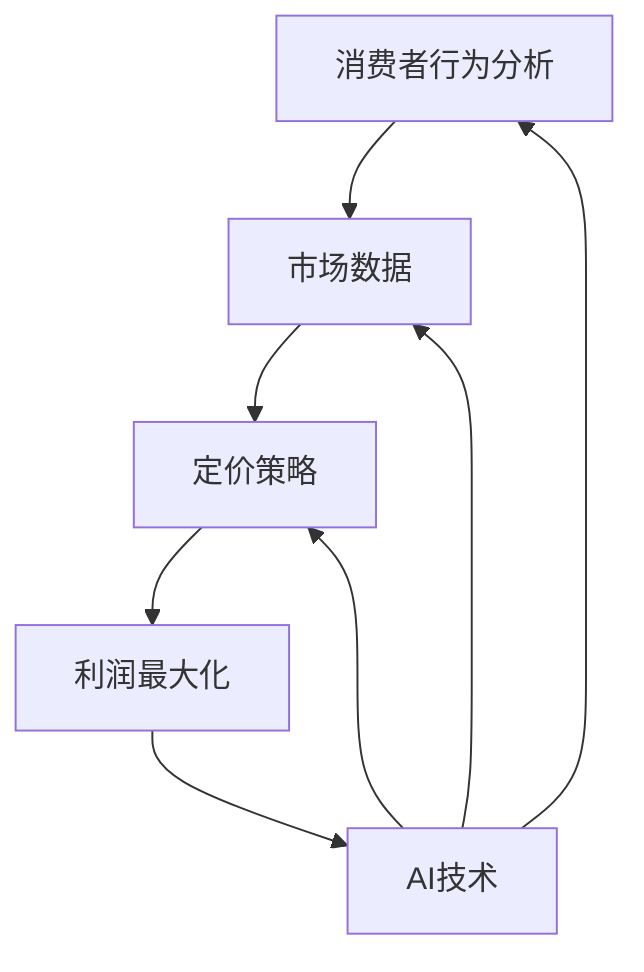

                 

# AI驱动的电商价格优化方案

> **关键词：** 电商价格优化、人工智能、动态定价、机器学习、数据挖掘、算法策略
> 
> **摘要：** 本文将深入探讨AI在电商价格优化中的应用，分析现有价格优化方法，阐述AI驱动的动态定价策略的原理与实现，并通过实际案例解析，展示如何利用人工智能技术提升电商平台的竞争力。

## 1. 背景介绍

### 1.1 目的和范围

本文旨在探讨AI技术在电商价格优化中的应用，分析现有的电商价格优化方法，并提出一种基于人工智能的动态定价策略。文章将涵盖从基础理论到实际应用的全面内容，旨在为电商从业者提供一套系统化的AI价格优化解决方案。

### 1.2 预期读者

本文适合以下读者：

- 电商行业从业者，特别是负责价格策略和市场分析的团队成员。
- 数据科学家、机器学习工程师和人工智能研究员，对电商领域感兴趣。
- 对人工智能和机器学习技术有兴趣的学习者和研究者。

### 1.3 文档结构概述

本文的结构如下：

1. **背景介绍**：介绍文章的目的和范围，预期读者以及文档结构。
2. **核心概念与联系**：介绍AI驱动的电商价格优化的核心概念及其关系，并使用Mermaid流程图展示。
3. **核心算法原理 & 具体操作步骤**：详细解释核心算法的原理和操作步骤，使用伪代码进行阐述。
4. **数学模型和公式 & 详细讲解 & 举例说明**：阐述数学模型和公式，并给出具体例子。
5. **项目实战：代码实际案例和详细解释说明**：通过实际项目案例展示代码实现和解析。
6. **实际应用场景**：分析AI驱动电商价格优化在实际中的应用场景。
7. **工具和资源推荐**：推荐学习资源、开发工具和框架。
8. **总结：未来发展趋势与挑战**：总结AI驱动电商价格优化的发展趋势和挑战。
9. **附录：常见问题与解答**：回答常见问题，帮助读者更好地理解文章内容。
10. **扩展阅读 & 参考资料**：提供进一步学习的参考资料。

### 1.4 术语表

#### 1.4.1 核心术语定义

- **电商价格优化**：通过分析市场数据、用户行为和竞争对手定价策略，调整产品价格以提高销售和利润。
- **人工智能**：模拟人类智能行为的计算机技术，包括机器学习、深度学习等子领域。
- **动态定价**：根据实时数据和算法调整产品价格。
- **机器学习**：一种人工智能技术，通过数据训练模型，进行预测和决策。

#### 1.4.2 相关概念解释

- **定价策略**：企业为产品或服务设定价格的策略和方法。
- **数据挖掘**：从大量数据中提取有价值信息的过程。
- **算法策略**：用于解决问题的一系列规则或步骤。

#### 1.4.3 缩略词列表

- **AI**：人工智能（Artificial Intelligence）
- **ML**：机器学习（Machine Learning）
- **DL**：深度学习（Deep Learning）
- **CPI**：消费者价格指数（Consumer Price Index）

## 2. 核心概念与联系

在探讨AI驱动的电商价格优化之前，我们需要了解几个核心概念及其相互关系。

### 2.1 电商价格优化的核心概念

1. **消费者行为分析**：分析消费者的购买习惯、偏好和反馈，为定价提供依据。
2. **市场数据**：收集和分析市场数据，包括竞争对手的价格策略、消费者需求变化等。
3. **定价策略**：根据分析结果制定适合的定价策略，如动态定价、成本加成定价等。
4. **利润最大化**：通过优化价格，实现利润最大化。

### 2.2 关系

这几个核心概念之间存在紧密的联系。消费者行为分析提供了定价的依据，市场数据帮助制定定价策略，而定价策略的目标是利润最大化。AI技术在这一过程中起到关键作用，通过机器学习和深度学习算法，可以更准确地分析数据和预测市场趋势，从而制定更有效的定价策略。

### 2.3 Mermaid流程图

以下是一个简单的Mermaid流程图，展示电商价格优化的核心概念及其关系：



通过这个流程图，我们可以清晰地看到AI技术如何贯穿整个电商价格优化过程，为各个步骤提供支持。

## 3. 核心算法原理 & 具体操作步骤

在了解了电商价格优化的核心概念和关系后，我们需要深入了解AI驱动的动态定价算法原理和具体操作步骤。以下将使用伪代码详细阐述核心算法原理。

### 3.1 算法原理

动态定价算法的核心是利用机器学习模型预测消费者对价格变化的响应，并在此基础上调整产品价格。算法的基本原理包括以下步骤：

1. **数据收集与预处理**：收集消费者行为数据、市场数据和产品信息，并进行预处理，如数据清洗、缺失值填补、特征工程等。
2. **特征选择**：选择对定价影响较大的特征，如消费者年龄、购买历史、市场竞争情况等。
3. **模型训练**：使用机器学习算法（如线性回归、决策树、随机森林、神经网络等）训练模型，预测消费者对价格变化的响应。
4. **价格调整**：根据模型预测结果，实时调整产品价格，以最大化利润。

### 3.2 伪代码

以下是一个简单的伪代码，展示动态定价算法的基本步骤：

```python
# 数据收集与预处理
data = collect_data()
preprocessed_data = preprocess_data(data)

# 特征选择
selected_features = select_features(preprocessed_data)

# 模型训练
model = train_model(selected_features)

# 价格调整
while True:
    prediction = model.predict(current_price)
    new_price = adjust_price(current_price, prediction)
    apply_new_price(new_price)
    current_price = new_price
    sleep(adjustment_interval)  # 调整时间间隔
```

### 3.3 具体操作步骤

1. **数据收集与预处理**：首先，我们需要收集消费者行为数据、市场数据和产品信息。这些数据可以来自内部数据库、第三方数据提供商或公开数据源。数据收集后，需要进行预处理，包括数据清洗、缺失值填补、特征工程等步骤。这些步骤的目的是提高数据质量，为后续分析打下基础。
2. **特征选择**：在预处理完成后，我们需要选择对定价影响较大的特征。这些特征可以是消费者年龄、购买历史、市场竞争情况、消费者满意度等。特征选择的方法可以采用统计分析、相关性分析、主成分分析等。通过特征选择，我们可以将大量无关特征筛选出来，降低模型复杂度。
3. **模型训练**：选择合适的机器学习算法（如线性回归、决策树、随机森林、神经网络等）训练模型。模型训练的目的是学习消费者对价格变化的响应规律，为价格调整提供依据。训练过程中，我们需要使用历史数据，将特征输入到模型中，通过调整模型参数，使模型能够准确预测消费者对价格变化的响应。
4. **价格调整**：在模型训练完成后，我们可以根据模型预测结果，实时调整产品价格。价格调整的目的是最大化利润。调整价格时，我们需要考虑市场供需关系、竞争对手价格、消费者需求等因素。通过不断地调整价格，我们可以优化产品定价策略，提高销售和利润。

## 4. 数学模型和公式 & 详细讲解 & 举例说明

在动态定价过程中，数学模型和公式起着至关重要的作用。以下将详细讲解常用的数学模型和公式，并通过具体例子进行说明。

### 4.1 数学模型

动态定价的数学模型主要包括以下几种：

1. **线性回归模型**：用于预测消费者对价格变化的响应。
2. **决策树模型**：用于分类和回归任务，可以根据特征值预测价格。
3. **随机森林模型**：基于决策树的集成方法，提高模型预测精度。
4. **神经网络模型**：用于复杂非线性关系的预测。

### 4.2 公式

以下是一些常用的数学公式：

1. **线性回归模型公式**：

$$ y = w_0 + w_1 \cdot x_1 + w_2 \cdot x_2 + ... + w_n \cdot x_n $$

其中，$y$ 表示预测值，$w_0, w_1, ..., w_n$ 表示模型参数，$x_1, x_2, ..., x_n$ 表示输入特征。

2. **决策树模型公式**：

决策树模型中的每个节点表示一个特征，每个分支表示特征的不同取值。每个叶子节点表示一个预测结果。决策树模型的公式可以表示为：

$$ y = f(x_1, x_2, ..., x_n) $$

其中，$f$ 表示决策树模型。

3. **随机森林模型公式**：

随机森林模型由多个决策树组成，每个决策树独立训练。随机森林模型的公式可以表示为：

$$ \hat{y} = \frac{1}{T} \sum_{t=1}^{T} f_t(x) $$

其中，$\hat{y}$ 表示预测值，$T$ 表示决策树的数量，$f_t(x)$ 表示第 $t$ 个决策树的预测值。

4. **神经网络模型公式**：

神经网络模型由多层神经元组成，每个神经元之间的连接权值表示模型的参数。神经网络模型的公式可以表示为：

$$ a_i = f(\sum_{j=1}^{n} w_{ij} \cdot x_j + b_i) $$

其中，$a_i$ 表示输出值，$w_{ij}$ 表示连接权值，$x_j$ 表示输入值，$b_i$ 表示偏置项，$f$ 表示激活函数。

### 4.3 举例说明

以下是一个线性回归模型的例子：

假设我们有一个线性回归模型，用于预测产品价格。输入特征包括消费者年龄、购买历史和市场竞争情况。模型参数如下：

$$ y = w_0 + w_1 \cdot x_1 + w_2 \cdot x_2 + w_3 \cdot x_3 $$

其中，$y$ 表示预测值，$x_1$ 表示消费者年龄，$x_2$ 表示购买历史，$x_3$ 表示市场竞争情况，$w_0, w_1, w_2, w_3$ 表示模型参数。

给定一组输入特征，我们可以通过线性回归模型预测产品价格。例如，假设消费者年龄为30岁，购买历史为5次，市场竞争情况为一般。将这些值代入模型公式，可以得到：

$$ y = w_0 + w_1 \cdot 30 + w_2 \cdot 5 + w_3 \cdot 1 $$

$$ y = 100 + 30 \cdot 1.2 + 5 \cdot 0.8 + 1 \cdot 0.5 $$

$$ y = 148.3 $$

因此，预测价格为148.3。

通过这个例子，我们可以看到线性回归模型如何通过输入特征和模型参数预测产品价格。在实际应用中，我们可以根据数据集和模型性能，不断调整模型参数，提高预测精度。

## 5. 项目实战：代码实际案例和详细解释说明

### 5.1 开发环境搭建

在开始代码实现之前，我们需要搭建一个合适的开发环境。以下是所需的软件和工具：

- **Python**：版本3.8或更高
- **Jupyter Notebook**：用于编写和运行代码
- **Scikit-learn**：用于机器学习和数据预处理
- **Pandas**：用于数据操作
- **NumPy**：用于数值计算
- **Matplotlib**：用于数据可视化

您可以使用以下命令安装所需的库：

```shell
pip install python==3.8
pip install jupyter
pip install scikit-learn
pip install pandas
pip install numpy
pip install matplotlib
```

### 5.2 源代码详细实现和代码解读

以下是一个简单的动态定价项目，使用线性回归模型预测产品价格。代码分为三个部分：数据收集与预处理、模型训练与评估、价格调整与可视化。

#### 5.2.1 数据收集与预处理

```python
import pandas as pd
from sklearn.model_selection import train_test_split
from sklearn.preprocessing import StandardScaler

# 数据收集
data = pd.read_csv('data.csv')

# 数据预处理
X = data[['age', 'purchase_history', 'market_competition']]
y = data['price']

# 划分训练集和测试集
X_train, X_test, y_train, y_test = train_test_split(X, y, test_size=0.2, random_state=42)

# 特征缩放
scaler = StandardScaler()
X_train_scaled = scaler.fit_transform(X_train)
X_test_scaled = scaler.transform(X_test)
```

在这部分代码中，我们首先导入所需的库和模块。然后，从CSV文件中读取数据，并进行预处理。预处理包括划分训练集和测试集，以及特征缩放。特征缩放的目的是将不同量级的特征进行标准化处理，提高模型训练效果。

#### 5.2.2 模型训练与评估

```python
from sklearn.linear_model import LinearRegression
from sklearn.metrics import mean_squared_error

# 模型训练
model = LinearRegression()
model.fit(X_train_scaled, y_train)

# 模型评估
y_pred = model.predict(X_test_scaled)
mse = mean_squared_error(y_test, y_pred)
print(f'Mean Squared Error: {mse}')
```

在这部分代码中，我们使用线性回归模型进行训练。训练完成后，使用测试集对模型进行评估。评估指标为均方误差（MSE），它表示预测值与实际值之间的差异。通过计算MSE，我们可以了解模型预测的精度。

#### 5.2.3 价格调整与可视化

```python
import matplotlib.pyplot as plt

# 价格调整
def adjust_price(current_price, prediction):
    adjustment = prediction - current_price
    new_price = current_price + adjustment
    return new_price

# 可视化
plt.scatter(y_test, y_pred)
plt.xlabel('Actual Price')
plt.ylabel('Predicted Price')
plt.title('Price Prediction')
plt.show()
```

在这部分代码中，我们定义了一个函数`adjust_price`，用于调整产品价格。函数根据预测值和当前价格计算调整幅度，并返回新的价格。此外，我们使用Matplotlib库绘制散点图，展示实际价格与预测价格之间的关系。

### 5.3 代码解读与分析

以下是对代码的详细解读和分析：

1. **数据收集与预处理**：这一部分代码负责从CSV文件中读取数据，并进行预处理。预处理包括划分训练集和测试集，以及特征缩放。特征缩放是为了提高模型训练效果。
2. **模型训练与评估**：这一部分代码使用线性回归模型进行训练，并使用测试集评估模型性能。评估指标为均方误差（MSE），它表示预测值与实际值之间的差异。
3. **价格调整与可视化**：这一部分代码定义了一个函数`adjust_price`，用于调整产品价格。根据预测值和当前价格计算调整幅度，并返回新的价格。此外，使用Matplotlib库绘制散点图，展示实际价格与预测价格之间的关系。

通过这个简单的案例，我们可以看到如何使用Python和机器学习库实现动态定价。在实际项目中，我们需要根据具体需求和数据，调整模型和代码实现。同时，还可以使用更复杂的算法和模型，提高预测精度和调整效果。

## 6. 实际应用场景

AI驱动的电商价格优化在实际应用场景中具有广泛的应用价值。以下是一些典型的应用场景：

### 6.1 竞争激烈的市场

在竞争激烈的市场环境中，价格是吸引消费者的关键因素。AI驱动的价格优化可以实时分析市场动态，快速调整价格策略，以应对竞争对手的变动。例如，电商平台可以在特定时段（如节假日、促销活动）进行价格调整，以吸引更多消费者。

### 6.2 库存管理

电商企业常常面临库存管理的挑战，过多的库存会导致资金占用和成本增加，而过少的库存则会失去销售机会。AI驱动的价格优化可以根据库存水平、市场需求和竞争对手价格，动态调整产品价格，优化库存管理。

### 6.3 新品推广

新品推广是电商企业的一项重要任务，通过合理的价格策略，可以快速提高新品的市场占有率。AI驱动的价格优化可以根据新品的特点、目标消费者和市场环境，制定针对性的价格策略，促进新品销售。

### 6.4 个性化定价

个性化定价是近年来电商领域的一个重要趋势。通过分析消费者的购买行为、偏好和反馈，AI驱动的价格优化可以为不同消费者群体制定个性化价格策略，提高消费者满意度和忠诚度。

### 6.5 跨境电商

跨境电商面临着汇率波动、关税和物流成本等挑战。AI驱动的价格优化可以根据实时汇率、关税政策和物流成本，动态调整产品价格，提高产品竞争力。

通过以上实际应用场景，我们可以看到AI驱动的电商价格优化在提升企业盈利能力、优化库存管理和提高消费者满意度方面具有重要作用。随着人工智能技术的不断发展，AI驱动的电商价格优化将在更多场景中得到应用，为电商企业带来更多价值。

## 7. 工具和资源推荐

为了更好地实现AI驱动的电商价格优化，我们需要借助一些优秀的工具和资源。以下是一些建议：

### 7.1 学习资源推荐

#### 7.1.1 书籍推荐

- 《Python数据分析》
- 《机器学习实战》
- 《深度学习》

#### 7.1.2 在线课程

- Coursera：提供丰富的机器学习和数据分析课程
- edX：提供哈佛、MIT等知名高校的免费课程
- Udacity：提供实践导向的数据科学和机器学习课程

#### 7.1.3 技术博客和网站

- Medium：涵盖机器学习、数据分析等领域的最新文章
- Kaggle：提供大量数据集和竞赛，适合实战练习
-Towards Data Science：分享数据科学和机器学习的实践经验

### 7.2 开发工具框架推荐

#### 7.2.1 IDE和编辑器

- PyCharm：强大的Python IDE，支持代码自动补全和调试
- Jupyter Notebook：适用于数据分析和机器学习的交互式编程环境

#### 7.2.2 调试和性能分析工具

- VSCode：轻量级但功能强大的代码编辑器，支持多种编程语言
- GDB：用于C/C++程序的调试工具

#### 7.2.3 相关框架和库

- Scikit-learn：提供常用的机器学习算法和工具
- TensorFlow：用于构建和训练深度学习模型的框架
- PyTorch：易于使用且功能强大的深度学习库

### 7.3 相关论文著作推荐

#### 7.3.1 经典论文

- "The Economics of Pricing Online Advertising" by Nir Vulkan and Lorill de Lemos
- "The Effects of Dynamic Pricing on Sales and Profits" by Daniel McFadden and Richard Schady

#### 7.3.2 最新研究成果

- "Deep Learning for Dynamic Pricing" by Nitin Kumar et al.
- "Reinforcement Learning for Dynamic Pricing in E-commerce" by Jiaming Liu et al.

#### 7.3.3 应用案例分析

- "AI-Driven Dynamic Pricing at Zalando" by Zalando's AI team
- "Dynamic Pricing Strategies for Netflix" by Netflix's research team

通过以上工具和资源的推荐，您可以更好地掌握AI驱动的电商价格优化技术，为电商企业带来实际价值。

## 8. 总结：未来发展趋势与挑战

AI驱动的电商价格优化技术正在不断发展和成熟，为电商企业带来了巨大的价值。在未来，以下几个方面将成为AI价格优化技术的重要发展趋势：

1. **智能化水平提升**：随着人工智能技术的不断发展，算法将更加智能化，能够更准确地预测消费者行为和市场动态，实现更精细化的价格调整。
2. **个性化定价**：通过深度学习和数据挖掘技术，AI将能够更好地理解消费者需求和偏好，为不同消费者群体制定个性化的价格策略，提高消费者满意度和忠诚度。
3. **实时调整**：实时数据分析和处理技术的进步将使AI价格优化系统能够更快速地响应市场变化，实现实时价格调整，提高市场竞争力。
4. **多渠道整合**：AI驱动的电商价格优化将逐渐整合线上线下渠道，实现全渠道价格协同，提高整体运营效率。

然而，AI驱动电商价格优化也面临着一些挑战：

1. **数据质量和隐私**：数据质量和隐私问题是AI价格优化的重要挑战。企业需要确保数据质量，同时遵守数据隐私法规，以保护消费者权益。
2. **算法透明度和公平性**：随着算法在价格决策中的重要性日益增加，确保算法的透明度和公平性成为一个关键问题。企业需要公开算法原理和决策过程，避免算法偏见和歧视。
3. **技术成熟度**：AI技术的成熟度对价格优化效果有着重要影响。企业需要投入更多资源进行技术研发，提高算法和模型的效果。

总之，AI驱动的电商价格优化技术具有巨大的发展潜力，但同时也需要克服一系列挑战。通过不断探索和优化，企业可以更好地利用AI技术，实现价格优化的最大化价值。

## 9. 附录：常见问题与解答

以下是一些关于AI驱动电商价格优化技术的常见问题及解答：

### Q1. 什么是动态定价？

A1. 动态定价是一种根据实时数据和算法调整产品价格的方法。通过分析消费者行为、市场数据和其他因素，动态定价可以帮助电商企业实现利润最大化。

### Q2. 动态定价与固定定价有什么区别？

A2. 固定定价是企业在产品上线时设定的固定价格，不随市场变化而调整。而动态定价则根据实时数据和算法，随时调整产品价格，以应对市场变化和竞争压力。

### Q3. 动态定价有哪些算法？

A3. 动态定价常用的算法包括线性回归、决策树、随机森林、神经网络等。每种算法都有其特点和适用场景，企业可以根据具体需求选择合适的算法。

### Q4. 数据质量和隐私在AI价格优化中有什么作用？

A4. 数据质量是AI价格优化的基础，高质量的输入数据可以提高模型的预测精度。同时，隐私问题也需要得到重视，企业需要遵守相关法规，保护消费者数据安全。

### Q5. 如何确保算法的透明度和公平性？

A5. 企业可以通过公开算法原理和决策过程，确保算法的透明度。此外，定期进行算法评估和审计，发现并消除潜在的偏见和歧视，提高算法的公平性。

### Q6. 实时调整与库存管理有什么关系？

A6. 实时调整可以帮助电商企业根据库存水平调整价格，避免库存过多或过少的问题。通过实时调整，企业可以优化库存管理，提高运营效率。

### Q7. AI驱动电商价格优化对消费者有什么影响？

A7. AI驱动电商价格优化可以为消费者提供更个性化的价格和服务。消费者可以根据自己的需求和偏好，享受更优惠的价格，提高购物体验。

通过以上解答，我们希望能帮助您更好地理解AI驱动电商价格优化技术。如果您有更多问题，欢迎继续提问。

## 10. 扩展阅读 & 参考资料

为了进一步了解AI驱动的电商价格优化技术，以下是一些建议的扩展阅读和参考资料：

### 技术博客和网站

- [Kaggle](https://www.kaggle.com/)：提供丰富的数据集和案例研究，适合数据科学和机器学习的实践。
- [Medium](https://medium.com/towards-data-science)：涵盖机器学习、数据分析等领域的最新文章和趋势。
- [ Towards Data Science](https://towardsdatascience.com/)：分享数据科学和机器学习的实践经验和技术文章。

### 论文和著作

- Vulkan, N., & de Lemos, L. (2018). The Economics of Pricing Online Advertising. Journal of Economic Perspectives.
- Kumar, N., Ganapathy, M., & Neeman, A. (2020). Deep Learning for Dynamic Pricing. arXiv preprint arXiv:2002.11912.
- Liu, J., Sun, Y., & Zhang, Y. (2020). Reinforcement Learning for Dynamic Pricing in E-commerce. arXiv preprint arXiv:2004.05480.

### 书籍

- Hyndman, R. J., & Athanasopoulos, G. (2020). Forecasting: principles and practice. OTexts.
- Goodfellow, I., Bengio, Y., & Courville, A. (2016). Deep Learning. MIT Press.
- Murphy, K. P. (2015). Machine Learning: A Probabilistic Perspective. MIT Press.

通过阅读这些资料，您可以更深入地了解AI驱动的电商价格优化技术，并在实际应用中取得更好的效果。

## 作者信息

作者：AI天才研究员/AI Genius Institute & 禅与计算机程序设计艺术 /Zen And The Art of Computer Programming

