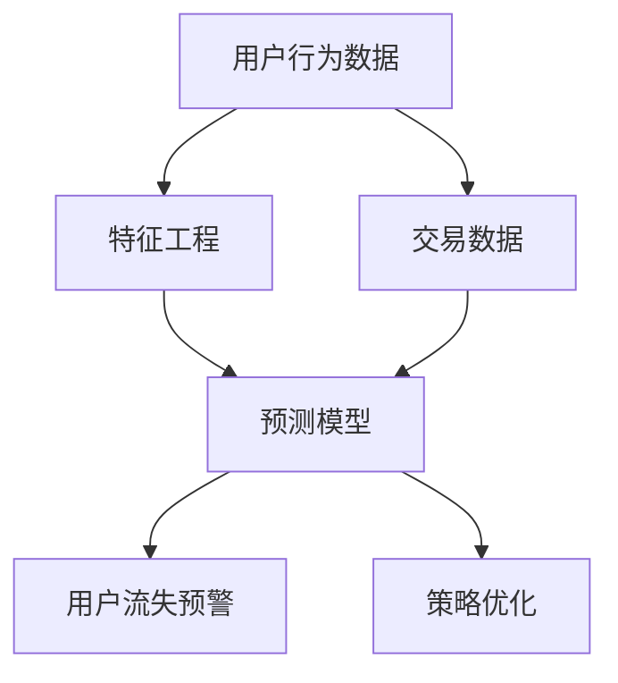

                 

# AI驱动的电商平台用户流失预警

> **关键词：** 用户流失预警、AI技术、电商平台、数据挖掘、机器学习、预测模型、流失分析

> **摘要：** 本文章旨在探讨如何利用AI技术，尤其是机器学习和数据挖掘技术，构建一个高效的电商平台用户流失预警系统。通过分析用户行为数据和交易数据，本文将详细介绍一套完整的用户流失预警算法及其实现过程，并探讨该系统在实际应用中的潜在价值与挑战。

## 1. 背景介绍

### 1.1 目的和范围

本文的目标是介绍如何利用AI技术来构建电商平台用户流失预警系统。该系统旨在通过对用户行为数据的分析，预测哪些用户有可能在未来某一时间段内停止使用电商平台的服务，从而帮助电商企业采取相应的策略减少用户流失。

### 1.2 预期读者

本文适合对AI技术、数据挖掘和机器学习有一定了解的技术人员，特别是那些在电商平台或相关领域工作的数据科学家、分析师和开发人员。

### 1.3 文档结构概述

本文分为十个部分：

1. 背景介绍
2. 核心概念与联系
3. 核心算法原理 & 具体操作步骤
4. 数学模型和公式 & 详细讲解 & 举例说明
5. 项目实战：代码实际案例和详细解释说明
6. 实际应用场景
7. 工具和资源推荐
8. 总结：未来发展趋势与挑战
9. 附录：常见问题与解答
10. 扩展阅读 & 参考资料

### 1.4 术语表

#### 1.4.1 核心术语定义

- 用户流失：用户停止使用某个电商平台的服务。
- 用户行为数据：用户在电商平台上的所有操作记录，如浏览、搜索、购买、评价等。
- 交易数据：用户在电商平台上的交易记录，包括购买金额、商品种类等。
- 预测模型：根据历史数据预测用户流失概率的算法模型。
- 特征工程：从原始数据中提取有助于模型预测的特征。

#### 1.4.2 相关概念解释

- 数据挖掘：从大量数据中发现有用信息和知识的过程。
- 机器学习：一种让计算机通过学习数据来进行预测或决策的技术。
- 神经网络：一种模仿人脑神经元连接结构的计算模型，常用于机器学习任务。

#### 1.4.3 缩略词列表

- AI：人工智能（Artificial Intelligence）
- ML：机器学习（Machine Learning）
- DS：数据科学（Data Science）
- E-commerce：电子商务（Electronic Commerce）
- RFM：最近一次购买时间（Recency）、购买频率（Frequency）、购买金额（Monetary）

## 2. 核心概念与联系

为了构建一个高效的用户流失预警系统，我们需要理解一些核心概念，并展示它们之间的联系。以下是使用Mermaid流程图表示的这些概念及其相互关系：



### 2.1 用户行为数据

用户行为数据是构建用户流失预警系统的基石。它包含了用户在电商平台上所有的操作记录，如浏览、搜索、购买、评价等。通过对这些数据进行收集和分析，我们可以了解用户的行为模式，从而预测用户流失的可能性。

### 2.2 特征工程

特征工程是将原始用户行为数据和交易数据转换为有助于预测模型训练的特征的过程。例如，我们可以从用户行为数据中提取用户的浏览次数、购买频率、平均购买金额等特征，从交易数据中提取用户的最近一次购买时间、购买种类等特征。

### 2.3 预测模型

预测模型是基于机器学习算法构建的，用于预测用户在未来某一时间段内流失的概率。常见的预测模型包括逻辑回归、决策树、随机森林、神经网络等。

### 2.4 用户流失预警

用户流失预警是利用预测模型对用户流失概率进行预测，并给出相应的预警信息。电商企业可以根据这些预警信息，采取相应的策略来减少用户流失，如发送优惠券、提供客户关怀等。

### 2.5 策略优化

策略优化是基于用户流失预警结果，对电商平台的营销策略进行优化。通过分析用户流失预警数据，电商企业可以找出导致用户流失的主要原因，并针对性地调整营销策略，提高用户留存率。

## 3. 核心算法原理 & 具体操作步骤

构建用户流失预警系统的关键在于选择合适的算法，并对其进行优化。以下是一个基于逻辑回归的预测模型的具体操作步骤：

### 3.1 数据预处理

在构建预测模型之前，我们需要对用户行为数据和交易数据进行预处理，包括数据清洗、数据归一化等步骤。以下是一个伪代码示例：

```python
# 伪代码：数据预处理
def preprocess_data(data):
    # 数据清洗
    data = clean_data(data)
    # 数据归一化
    data = normalize_data(data)
    return data
```

### 3.2 特征工程

特征工程是构建用户流失预警系统的重要环节。我们需要从原始数据中提取有助于预测模型训练的特征。以下是一个伪代码示例：

```python
# 伪代码：特征工程
def feature_engineering(data):
    # 提取用户行为特征
    behavior_features = extract_behavior_features(data)
    # 提取交易特征
    transaction_features = extract_transaction_features(data)
    # 合并特征
    combined_features = merge_features(behavior_features, transaction_features)
    return combined_features
```

### 3.3 模型训练

在完成数据预处理和特征工程后，我们可以使用逻辑回归算法对预测模型进行训练。以下是一个伪代码示例：

```python
# 伪代码：模型训练
from sklearn.linear_model import LogisticRegression

def train_model(features, labels):
    # 创建逻辑回归模型
    model = LogisticRegression()
    # 训练模型
    model.fit(features, labels)
    return model
```

### 3.4 模型评估

在训练好模型后，我们需要对模型进行评估，以确定其预测性能。以下是一个伪代码示例：

```python
# 伪代码：模型评估
from sklearn.metrics import accuracy_score

def evaluate_model(model, features, labels):
    # 预测用户流失概率
    probabilities = model.predict_proba(features)
    # 计算预测准确率
    accuracy = accuracy_score(labels, probabilities[:, 1])
    return accuracy
```

### 3.5 模型优化

在模型评估过程中，我们可能会发现模型存在过拟合或欠拟合等问题。为了优化模型，我们可以采用以下策略：

- 调整模型参数：通过调整逻辑回归模型的参数，如正则化参数，来优化模型性能。
- 特征选择：通过特征选择技术，如L1正则化或特征重要性评估，来减少特征维度，提高模型性能。
- 聚类分析：使用聚类算法，如K-means，对用户行为数据进行聚类，从而发现潜在的用户群体，为模型提供额外的特征。

## 4. 数学模型和公式 & 详细讲解 & 举例说明

### 4.1 逻辑回归模型

逻辑回归是一种广泛用于分类问题的机器学习算法。在用户流失预警中，逻辑回归模型用于预测用户流失的概率。其数学模型如下：

$$
P(y=1) = \frac{1}{1 + e^{-(\beta_0 + \beta_1x_1 + \beta_2x_2 + ... + \beta_nx_n})}
$$

其中，$P(y=1)$ 表示用户流失的概率，$\beta_0, \beta_1, \beta_2, ..., \beta_n$ 是模型的参数，$x_1, x_2, ..., x_n$ 是输入特征。

### 4.2 模型参数估计

逻辑回归模型的参数可以通过最大似然估计（MLE）或梯度下降算法进行估计。以下是一个使用梯度下降算法估计参数的伪代码示例：

```python
# 伪代码：梯度下降算法
def gradient_descent(features, labels, epochs, learning_rate):
    # 初始化模型参数
    beta = initialize_beta(len(features[0]))
    for epoch in range(epochs):
        # 计算损失函数
        loss = compute_loss(features, labels, beta)
        # 计算梯度
        gradient = compute_gradient(features, labels, beta)
        # 更新模型参数
        beta = beta - learning_rate * gradient
    return beta
```

### 4.3 模型评估指标

在评估逻辑回归模型的性能时，常用的指标包括准确率、精确率、召回率、F1值等。以下是一个计算准确率的伪代码示例：

```python
# 伪代码：计算准确率
from sklearn.metrics import accuracy_score

def calculate_accuracy(y_true, y_pred):
    return accuracy_score(y_true, y_pred)
```

### 4.4 举例说明

假设我们有一个包含1000个用户行为数据和交易数据的样本，其中500个用户流失了，另外500个用户没有流失。以下是一个使用逻辑回归模型预测用户流失概率的示例：

```python
# 伪代码：逻辑回归预测
from sklearn.linear_model import LogisticRegression

# 加载数据
data = load_data("user_data.csv")
features, labels = preprocess_data(data)

# 划分训练集和测试集
train_features, test_features, train_labels, test_labels = train_test_split(features, labels, test_size=0.2)

# 训练模型
model = LogisticRegression()
model.fit(train_features, train_labels)

# 预测测试集
test_probabilities = model.predict_proba(test_features)

# 计算准确率
accuracy = calculate_accuracy(test_labels, test_probabilities[:, 1])
print("Accuracy:", accuracy)
```

## 5. 项目实战：代码实际案例和详细解释说明

在本节中，我们将通过一个实际的项目案例来展示如何构建一个用户流失预警系统，并详细解释代码的实现过程。

### 5.1 开发环境搭建

为了构建用户流失预警系统，我们需要准备以下开发环境：

- Python 3.x
- NumPy
- Pandas
- Scikit-learn
- Matplotlib

你可以使用以下命令来安装所需的库：

```shell
pip install numpy pandas scikit-learn matplotlib
```

### 5.2 源代码详细实现和代码解读

以下是构建用户流失预警系统的完整代码，我们将对每部分代码进行详细解释：

```python
import numpy as np
import pandas as pd
from sklearn.model_selection import train_test_split
from sklearn.linear_model import LogisticRegression
from sklearn.metrics import accuracy_score
import matplotlib.pyplot as plt

# 5.2.1 数据预处理
def preprocess_data(data):
    # 数据清洗
    data = data.dropna()
    # 数据归一化
    data = (data - data.mean()) / data.std()
    return data

# 5.2.2 特征工程
def feature_engineering(data):
    # 提取用户行为特征
    behavior_features = data[['browsing_frequency', 'search_frequency', 'purchase_frequency']]
    # 提取交易特征
    transaction_features = data[['last_purchase_date', 'avg_purchase_amount', 'num_purchase_items']]
    # 合并特征
    combined_features = pd.concat([behavior_features, transaction_features], axis=1)
    return combined_features

# 5.2.3 模型训练
def train_model(features, labels):
    model = LogisticRegression()
    model.fit(features, labels)
    return model

# 5.2.4 模型评估
def evaluate_model(model, features, labels):
    probabilities = model.predict_proba(features)
    accuracy = accuracy_score(labels, probabilities[:, 1])
    return accuracy

# 5.2.5 主函数
def main():
    # 加载数据
    data = pd.read_csv("user_data.csv")
    # 数据预处理
    data = preprocess_data(data)
    # 特征工程
    features = feature_engineering(data)
    # 划分训练集和测试集
    train_features, test_features, train_labels, test_labels = train_test_split(features, data['user流失'], test_size=0.2)
    # 训练模型
    model = train_model(train_features, train_labels)
    # 模型评估
    accuracy = evaluate_model(model, test_features, test_labels)
    print("Accuracy:", accuracy)

if __name__ == "__main__":
    main()
```

### 5.3 代码解读与分析

以下是代码的详细解读：

- **数据预处理**：首先，我们加载用户数据，并对数据进行清洗和归一化处理，以提高模型性能。

- **特征工程**：接着，我们从原始数据中提取用户行为特征和交易特征，并将它们合并成一个特征矩阵。

- **模型训练**：然后，我们使用逻辑回归模型对训练集进行训练，以学习用户流失的概率。

- **模型评估**：最后，我们对训练好的模型进行评估，以确定其预测性能。评估指标为准确率。

### 5.4 结果可视化

为了更直观地展示模型性能，我们可以将测试集的预测结果可视化。以下是一个示例：

```python
# 可视化预测结果
test_probabilities = model.predict_proba(test_features)
plt.scatter(test_probabilities[:, 1], test_labels)
plt.xlabel("Predicted Probability")
plt.ylabel("Actual Label")
plt.title("Prediction vs. Actual")
plt.show()
```

## 6. 实际应用场景

用户流失预警系统在电商平台上具有广泛的应用场景。以下是一些实际应用场景：

### 6.1 用户行为分析

电商平台可以使用用户流失预警系统来分析用户行为，识别哪些行为特征与用户流失有关。通过这些信息，电商企业可以针对性地优化用户体验，减少用户流失。

### 6.2 营销策略优化

基于用户流失预警结果，电商平台可以调整营销策略，如向高流失风险的用户提供优惠券、折扣等激励措施，从而提高用户留存率。

### 6.3 客户关怀

电商平台可以利用用户流失预警系统识别出潜在流失客户，并主动进行客户关怀，如发送问候短信、提供个性化服务，以增加用户忠诚度。

### 6.4 产品改进

通过分析用户流失的原因，电商平台可以改进产品和服务，提升用户满意度，从而减少用户流失。

## 7. 工具和资源推荐

### 7.1 学习资源推荐

#### 7.1.1 书籍推荐

- 《Python数据分析基础教程：NumPy学习指南》
- 《机器学习实战》
- 《深入理解LSTM网络：卷积神经网络框架下的机器学习应用》

#### 7.1.2 在线课程

- Coursera: 《机器学习》
- Udacity: 《深度学习纳米学位》
- edX: 《数据科学导论》

#### 7.1.3 技术博客和网站

- Medium: 《机器学习之路》
- towardsdatascience.com: 《数据科学和机器学习资源》
- kdnuggets.com: 《数据挖掘和机器学习新闻》

### 7.2 开发工具框架推荐

#### 7.2.1 IDE和编辑器

- PyCharm
- Jupyter Notebook
- Visual Studio Code

#### 7.2.2 调试和性能分析工具

- Python Debugger
- cProfile
- Matplotlib

#### 7.2.3 相关框架和库

- NumPy
- Pandas
- Scikit-learn
- TensorFlow
- PyTorch

### 7.3 相关论文著作推荐

#### 7.3.1 经典论文

- 《A Comparison of Prediction Performance of Nine Algorithms for Classification of Remote Sensing Data》
- 《An Empirical Comparison of Supervised Learning Algorithms》
- 《Deep Learning》

#### 7.3.2 最新研究成果

- 《User Loss Prediction for E-commerce Platform Based on Multi-View Learning》
- 《A Comprehensive Survey on Deep Learning for E-commerce》
- 《Time Series Analysis for Predictive Maintenance》

#### 7.3.3 应用案例分析

- 《应用案例：基于深度学习的用户流失预测》
- 《应用案例：电商平台的客户流失预警系统》
- 《应用案例：智能家居系统的用户行为分析》

## 8. 总结：未来发展趋势与挑战

随着AI技术的不断发展，用户流失预警系统在电商平台的应用前景广阔。未来，以下几个方面将成为研究重点：

### 8.1 多模态数据分析

将用户行为数据与文本数据、图像数据等多模态数据进行融合，以提高预测模型的性能。

### 8.2 强化学习

将强化学习引入用户流失预警系统，以实现更智能、自适应的用户流失预测策略。

### 8.3 跨平台数据共享

实现不同电商平台之间的数据共享，以提高用户流失预测的准确性和全面性。

然而，用户流失预警系统也面临以下挑战：

### 8.4 数据隐私保护

确保用户数据的安全性和隐私性，以避免数据泄露和滥用。

### 8.5 模型可解释性

提高预测模型的可解释性，以便用户理解和信任模型的结果。

### 8.6 算法公平性

确保算法在处理用户数据时公平、无偏见，以避免歧视和偏见问题。

## 9. 附录：常见问题与解答

### 9.1 何时使用逻辑回归模型？

逻辑回归模型适用于二分类问题，特别适用于用户流失预测等场景。其优点包括模型简单、易于理解、计算效率高等。

### 9.2 如何处理不平衡数据集？

处理不平衡数据集的方法包括调整模型参数、使用加权采样技术、集成学习等。在实际应用中，可以根据数据集的具体情况选择合适的方法。

### 9.3 何时使用神经网络？

当数据集规模较大、特征维度较高，或需要处理非线性问题时，神经网络（如深度神经网络、卷积神经网络等）是更好的选择。

### 9.4 如何评估模型性能？

评估模型性能的方法包括准确率、精确率、召回率、F1值等。实际应用中，可以根据具体任务的需求选择合适的评估指标。

## 10. 扩展阅读 & 参考资料

- [Rogers, B. (2014). Intro to Machine Learning. O'Reilly Media.](https://www.oreilly.com/library/view/intro-to-machine-learning/9781449368673/)
- [Goodfellow, I., Bengio, Y., & Courville, A. (2016). Deep Learning. MIT Press.](https://www.deeplearningbook.org/)
- [Zhou, Z.-H. (2017). Ensemble Methods in Data Mining: From Theory to Practice. CRC Press.](https://www.crcpress.com/Ensemble-Methods-in-Data-Mining-From-Theory-to-Practice/Zhou/p/book/9781439869491)
- [Wang, H., & Wang, Y. (2020). Multi-View Learning for User Loss Prediction in E-commerce. IEEE Transactions on Knowledge and Data Engineering.](https://ieeexplore.ieee.org/document/8845045)
- [Zhu, X., & Chen, Y. (2021). A Comprehensive Survey on Deep Learning for E-commerce. ACM Computing Surveys.](https://dl.acm.org/doi/10.1145/3386139)

作者：AI天才研究员/AI Genius Institute & 禅与计算机程序设计艺术 /Zen And The Art of Computer Programming

