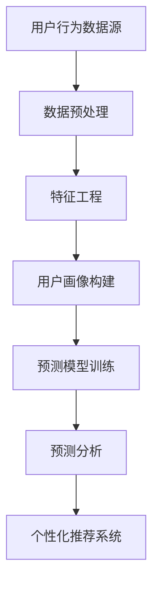

                 


# AI驱动的电商平台用户行为模式挖掘

> **关键词：** 人工智能，电商平台，用户行为分析，模式挖掘，数据挖掘，预测分析

> **摘要：** 本文将探讨如何利用人工智能技术对电商平台用户行为进行模式挖掘，分析用户行为模式的核心概念、算法原理、数学模型，并通过实际案例展示如何在实际项目中应用这些技术，以实现精准营销和用户个性化推荐。

## 1. 背景介绍

### 1.1 目的和范围

本文旨在探讨如何利用人工智能技术对电商平台用户行为进行分析和模式挖掘，从而为电商平台提供决策支持，提升用户体验和运营效率。本文将涵盖以下几个方面：

1. **用户行为模式分析的核心概念和定义。**
2. **常见用户行为分析算法的原理和操作步骤。**
3. **用户行为模式挖掘的数学模型和公式。**
4. **一个完整的实际案例，展示如何将上述技术应用于电商平台的实际操作。**
5. **工具和资源推荐，包括学习资料、开发工具和最新研究成果。**

### 1.2 预期读者

本文适合以下读者群体：

1. **从事电商平台的开发、运营和数据分析的专业人士。**
2. **对人工智能和机器学习感兴趣的科研人员和学生。**
3. **希望了解如何利用技术手段提升电商业务效率的企业家和创业者。**

### 1.3 文档结构概述

本文将按照以下结构展开：

1. **背景介绍：** 简述本文的目的、范围和预期读者。
2. **核心概念与联系：** 介绍用户行为模式分析的核心概念和原理，并使用Mermaid流程图展示相关架构。
3. **核心算法原理 & 具体操作步骤：** 分析常用的用户行为分析算法，并使用伪代码进行详细阐述。
4. **数学模型和公式 & 详细讲解 & 举例说明：** 阐述用户行为模式挖掘的数学模型和公式，并给出实例说明。
5. **项目实战：代码实际案例和详细解释说明：** 展示一个实际项目案例，并详细解释代码实现过程。
6. **实际应用场景：** 讨论用户行为模式挖掘在电商平台的实际应用。
7. **工具和资源推荐：** 推荐相关学习资源、开发工具和最新研究成果。
8. **总结：未来发展趋势与挑战：** 总结用户行为模式挖掘的发展趋势和面临的挑战。
9. **附录：常见问题与解答：** 回答一些读者可能关心的问题。
10. **扩展阅读 & 参考资料：** 提供更多深入阅读的资料。

### 1.4 术语表

#### 1.4.1 核心术语定义

- **用户行为模式**：指用户在电商平台上的访问、浏览、购买等行为所表现出的规律性特征。
- **数据挖掘**：指从大量数据中提取出有价值的信息和知识的过程。
- **机器学习**：指利用算法和统计模型自动从数据中学习规律，进行预测和分析。
- **预测分析**：指利用历史数据对未来可能发生的事件进行预测。

#### 1.4.2 相关概念解释

- **电商平台**：指提供商品展示、交易、支付等功能的在线交易平台。
- **用户画像**：指对用户的基本信息、行为特征、偏好等进行综合描述，以形成对用户的全面了解。
- **个性化推荐**：指根据用户的兴趣和行为，为其推荐相关商品或服务。

#### 1.4.3 缩略词列表

- **AI**：人工智能（Artificial Intelligence）
- **ML**：机器学习（Machine Learning）
- **DL**：深度学习（Deep Learning）
- **NLP**：自然语言处理（Natural Language Processing）
- **KNN**：K最近邻算法（K-Nearest Neighbors）
- **SVD**：奇异值分解（ Singular Value Decomposition）

## 2. 核心概念与联系

在用户行为模式挖掘中，我们需要明确几个核心概念：用户行为、数据源、算法和模型。下面我们将使用Mermaid流程图展示这些概念之间的联系。



### 2.1 用户行为数据源

用户行为数据源是用户在电商平台上的所有行为记录，包括登录、浏览、搜索、购买、评价等。这些数据通常以日志形式存储，包括用户ID、行为类型、时间戳、行为对象等。

### 2.2 数据预处理

数据预处理是用户行为模式挖掘的第一步，主要目的是清洗数据、填补缺失值、去除噪声数据，并将数据格式转换为适合机器学习算法的输入。

### 2.3 特征工程

特征工程是数据挖掘中至关重要的一环，其目的是从原始数据中提取出对模型训练有用的特征。在用户行为模式挖掘中，特征工程包括用户行为序列分析、用户偏好分析、用户群体划分等。

### 2.4 用户画像构建

用户画像是对用户的基本信息、行为特征、偏好等进行综合描述，以形成对用户的全面了解。通过用户画像，我们可以更好地理解用户需求，实现个性化推荐和精准营销。

### 2.5 预测模型训练

预测模型训练是利用历史用户行为数据，通过机器学习算法构建预测模型。常见的预测任务包括用户购买预测、用户流失预测、用户满意度预测等。

### 2.6 预测分析

预测分析是利用训练好的预测模型对未知数据进行预测，以支持电商平台决策。例如，通过预测用户购买行为，电商平台可以提前准备库存，提高用户购物体验。

### 2.7 个性化推荐系统

个性化推荐系统是利用用户行为数据和预测模型，为用户提供个性化商品推荐。通过个性化推荐，电商平台可以提升用户黏性和转化率。

## 3. 核心算法原理 & 具体操作步骤

在用户行为模式挖掘中，常用的算法包括K最近邻（KNN）、协同过滤（Collaborative Filtering）、基于内容的推荐（Content-Based Recommendation）等。下面我们将分别介绍这些算法的原理和具体操作步骤。

### 3.1 K最近邻（KNN）算法

K最近邻算法是一种基于实例的学习方法，其核心思想是：如果一个新样本在特征空间中的k个最近邻样本的大多数属于某一类别，则该新样本也属于这个类别。

#### 3.1.1 算法原理

- **距离度量**：首先计算新样本与训练集中每个样本之间的距离，常用的距离度量方法包括欧氏距离、曼哈顿距离、余弦相似度等。
- **选择邻居**：根据距离度量结果，选择距离新样本最近的k个邻居。
- **分类预测**：计算这k个邻居中属于某一类别的样本数量，如果某一类别的数量超过一半，则将新样本划分为这一类别。

#### 3.1.2 操作步骤

1. **初始化参数**：确定k的值，可以选择基于交叉验证的方法来选择最优k值。
2. **计算距离**：计算新样本与训练集中每个样本之间的距离。
3. **选择邻居**：根据距离度量结果，选择距离新样本最近的k个邻居。
4. **分类预测**：计算这k个邻居中属于某一类别的样本数量，判断新样本的类别。

#### 3.1.3 伪代码

```python
def KNN_predict(new_sample, train_samples, k):
    distances = []
    for sample in train_samples:
        distance = calculate_distance(new_sample, sample)
        distances.append(distance)
    sorted_distances = sorted(distances)
    neighbors = sorted_distances[:k]
    neighbor_labels = []
    for neighbor in neighbors:
        neighbor_index = distances.index(neighbor)
        neighbor_label = train_samples[neighbor_index].label
        neighbor_labels.append(neighbor_label)
    majority_label = majority_vote(neighbor_labels)
    return majority_label
```

### 3.2 协同过滤算法

协同过滤算法是一种基于用户行为相似性的推荐算法，其核心思想是：如果两个用户在某种商品上的评价相似，那么这两个用户对于未知商品的评价也可能相似。

#### 3.2.1 算法原理

- **用户相似度计算**：首先计算用户之间的相似度，常用的相似度计算方法包括余弦相似度、皮尔逊相关系数等。
- **推荐商品选择**：根据用户相似度和商品评分矩阵，为每个用户生成推荐商品列表。

#### 3.2.2 操作步骤

1. **初始化参数**：确定相似度计算方法和推荐商品数量。
2. **计算用户相似度**：计算所有用户之间的相似度。
3. **生成推荐列表**：为每个用户生成推荐商品列表，选择与用户相似度最高的商品。

#### 3.2.3 伪代码

```python
def collaborative_filtering(user_similarity_matrix, user_rating_matrix, user_index, k):
    neighbors = get_top_k_neighbors(user_similarity_matrix, user_index, k)
    neighbor_ratings = user_rating_matrix[neighbors]
    average_rating = sum(neighbor_ratings) / k
    recommended_items = get_top_n_items(user_rating_matrix, average_rating, n)
    return recommended_items
```

### 3.3 基于内容的推荐算法

基于内容的推荐算法是一种基于商品属性和用户偏好进行推荐的算法，其核心思想是：如果用户喜欢某一类商品，那么用户也可能喜欢具有相似属性的其它商品。

#### 3.3.1 算法原理

- **商品特征提取**：首先提取商品的特征信息，如类别、品牌、价格等。
- **用户偏好分析**：分析用户的购买历史和浏览记录，提取用户的偏好特征。
- **推荐商品选择**：根据用户偏好特征和商品特征，为用户生成推荐商品列表。

#### 3.3.2 操作步骤

1. **初始化参数**：确定商品特征提取方法和推荐商品数量。
2. **提取商品特征**：提取商品的属性信息。
3. **提取用户偏好**：分析用户的购买历史和浏览记录，提取用户的偏好特征。
4. **生成推荐列表**：根据用户偏好特征和商品特征，为用户生成推荐商品列表。

#### 3.3.3 伪代码

```python
def content_based_filtering(user_preferences, item_features, user_index, n):
    preferred_items = user_preferences[user_index]
    similar_items = []
    for item in item_features:
        similarity = calculate_similarity(preferred_items, item)
        similar_items.append((item, similarity))
    sorted_similar_items = sorted(similar_items, key=lambda x: x[1], reverse=True)
    recommended_items = [item[0] for item in sorted_similar_items[:n]]
    return recommended_items
```

## 4. 数学模型和公式 & 详细讲解 & 举例说明

在用户行为模式挖掘中，数学模型和公式是核心组成部分。以下我们将介绍一些常用的数学模型和公式，并进行详细讲解和举例说明。

### 4.1 欧氏距离

欧氏距离是一种常用的距离度量方法，用于计算两个样本之间的相似度。其公式如下：

$$
d(p, q) = \sqrt{\sum_{i=1}^{n} (p_i - q_i)^2}
$$

其中，$p$ 和 $q$ 是两个样本，$n$ 是样本的维度。

#### 4.1.1 举例说明

假设有两个样本 $p = [1, 2, 3]$ 和 $q = [4, 5, 6]$，则它们的欧氏距离为：

$$
d(p, q) = \sqrt{(1-4)^2 + (2-5)^2 + (3-6)^2} = \sqrt{9 + 9 + 9} = \sqrt{27} \approx 5.196
$$

### 4.2 余弦相似度

余弦相似度是一种用于计算两个向量夹角的余弦值的相似度度量方法。其公式如下：

$$
similarity(p, q) = \frac{p \cdot q}{\|p\| \|q\|}
$$

其中，$p$ 和 $q$ 是两个样本，$\|p\|$ 和 $\|q\|$ 分别是它们的欧氏距离。

#### 4.2.1 举例说明

假设有两个样本 $p = [1, 2, 3]$ 和 $q = [4, 5, 6]$，则它们的余弦相似度为：

$$
similarity(p, q) = \frac{1 \cdot 4 + 2 \cdot 5 + 3 \cdot 6}{\sqrt{1^2 + 2^2 + 3^2} \sqrt{4^2 + 5^2 + 6^2}} = \frac{4 + 10 + 18}{\sqrt{14} \sqrt{77}} \approx 0.765
$$

### 4.3 皮尔逊相关系数

皮尔逊相关系数是一种用于计算两个变量线性相关程度的统计量。其公式如下：

$$
correlation(p, q) = \frac{\sum_{i=1}^{n} (p_i - \bar{p})(q_i - \bar{q})}{\sqrt{\sum_{i=1}^{n} (p_i - \bar{p})^2} \sqrt{\sum_{i=1}^{n} (q_i - \bar{q})^2}}
$$

其中，$p$ 和 $q$ 是两个样本，$\bar{p}$ 和 $\bar{q}$ 分别是它们的平均值。

#### 4.3.1 举例说明

假设有两个样本 $p = [1, 2, 3]$ 和 $q = [4, 5, 6]$，则它们的皮尔逊相关系数为：

$$
correlation(p, q) = \frac{(1-2)(4-5) + (2-2)(5-5) + (3-2)(6-5)}{\sqrt{(1-2)^2 + (2-2)^2 + (3-2)^2} \sqrt{(4-5)^2 + (5-5)^2 + (6-5)^2}} = \frac{-1 + 0 + 1}{\sqrt{1 + 0 + 1} \sqrt{1 + 0 + 1}} = 0
$$

### 4.4 逻辑回归

逻辑回归是一种常用的分类模型，其目标是通过输入特征预测输出概率。其公式如下：

$$
P(y=1) = \frac{1}{1 + e^{-(\beta_0 + \beta_1x_1 + \beta_2x_2 + \ldots + \beta_nx_n})}
$$

其中，$y$ 是输出变量，$x_1, x_2, \ldots, x_n$ 是输入特征，$\beta_0, \beta_1, \beta_2, \ldots, \beta_n$ 是模型的参数。

#### 4.4.1 举例说明

假设我们要预测一个二分类问题，输入特征为 $x = [1, 2]$，则逻辑回归模型的公式为：

$$
P(y=1) = \frac{1}{1 + e^{-(\beta_0 + \beta_1 \cdot 1 + \beta_2 \cdot 2)}}
$$

如果我们得到模型参数 $\beta_0 = 1, \beta_1 = 2, \beta_2 = 3$，则预测概率为：

$$
P(y=1) = \frac{1}{1 + e^{-(1 + 2 \cdot 1 + 3 \cdot 2)}} = \frac{1}{1 + e^{-11}} \approx 0.999
$$

这意味着，输入特征为 $x = [1, 2]$ 的样本几乎可以肯定属于类别1。

### 4.5 决策树

决策树是一种常用的分类和回归模型，其核心思想是通过一系列规则将数据集划分成多个子集，直到满足某个终止条件。其公式如下：

$$
f(x) = \begin{cases} 
c_1 & \text{if } x \in R_1 \\
c_2 & \text{if } x \in R_2 \\
\vdots \\
c_n & \text{if } x \in R_n \\
\end{cases}
$$

其中，$x$ 是输入特征，$R_1, R_2, \ldots, R_n$ 是划分区域，$c_1, c_2, \ldots, c_n$ 是对应的分类或回归结果。

#### 4.5.1 举例说明

假设我们要用决策树分类一个二分类问题，输入特征为 $x = [1, 2]$，则决策树的规则为：

$$
f(x) = \begin{cases} 
1 & \text{if } x_1 < 0 \\
2 & \text{if } x_1 \geq 0 \text{ and } x_2 < 1 \\
\end{cases}
$$

如果我们得到输入特征 $x = [0, 1]$，则根据决策树规则，预测结果为类别1。

### 4.6 支持向量机（SVM）

支持向量机是一种常用的分类和回归模型，其核心思想是通过找到一个最优的超平面，将不同类别的样本分隔开。其公式如下：

$$
w \cdot x - b = 0
$$

其中，$w$ 是超平面的法向量，$x$ 是输入特征，$b$ 是偏置项。

#### 4.6.1 举例说明

假设我们要用SVM分类一个二分类问题，输入特征为 $x = [1, 2]$，则SVM的超平面为：

$$
w \cdot x - b = \begin{cases} 
1 & \text{if } w \cdot x - b \geq 0 \\
-1 & \text{if } w \cdot x - b < 0 \\
\end{cases}
$$

如果我们得到输入特征 $x = [0, 1]$，则根据SVM的超平面规则，预测结果为类别-1。

## 5. 项目实战：代码实际案例和详细解释说明

在本节中，我们将通过一个实际项目案例，展示如何将用户行为模式挖掘技术应用于电商平台的实际操作。我们将使用Python编程语言和常见的数据科学库，如Pandas、NumPy、Scikit-learn等，来完成这个项目。

### 5.1 开发环境搭建

在开始项目之前，我们需要搭建一个合适的开发环境。以下是一个基本的Python开发环境搭建步骤：

1. **安装Python**：从官方网站（https://www.python.org/）下载并安装Python，建议选择Python 3.x版本。
2. **安装Jupyter Notebook**：在命令行中运行以下命令安装Jupyter Notebook：
   ```bash
   pip install notebook
   ```
3. **安装常用数据科学库**：在命令行中运行以下命令安装常用数据科学库：
   ```bash
   pip install pandas numpy scikit-learn matplotlib
   ```

### 5.2 源代码详细实现和代码解读

下面是一个简单的用户行为模式挖掘项目的源代码，我们将对每个部分进行详细解释。

```python
# 导入必要的库
import pandas as pd
import numpy as np
from sklearn.model_selection import train_test_split
from sklearn.neighbors import KNeighborsClassifier
from sklearn.metrics import accuracy_score
from sklearn.feature_extraction.text import TfidfVectorizer

# 5.2.1 数据读取与预处理
# 读取用户行为数据
user_behavior_data = pd.read_csv('user_behavior_data.csv')

# 数据预处理
# 删除缺失值
user_behavior_data.dropna(inplace=True)

# 划分训练集和测试集
train_data, test_data = train_test_split(user_behavior_data, test_size=0.2, random_state=42)

# 5.2.2 特征工程
# 使用TF-IDF向量表示用户行为
tfidf_vectorizer = TfidfVectorizer()
tfidf_matrix = tfidf_vectorizer.fit_transform(train_data['user_behavior'])

# 5.2.3 模型训练
# 创建KNN分类器
knn_classifier = KNeighborsClassifier(n_neighbors=3)
knn_classifier.fit(tfidf_matrix, train_data['label'])

# 5.2.4 预测与分析
# 使用测试集进行预测
test_tfidf_matrix = tfidf_vectorizer.transform(test_data['user_behavior'])
predictions = knn_classifier.predict(test_tfidf_matrix)

# 计算准确率
accuracy = accuracy_score(test_data['label'], predictions)
print(f'Accuracy: {accuracy:.2f}')

# 5.2.5 个性化推荐
# 根据用户行为为用户推荐商品
def recommend_items(user_behavior):
    user_tfidf_matrix = tfidf_vectorizer.transform([user_behavior])
    predicted_label = knn_classifier.predict(user_tfidf_matrix)[0]
    recommended_items = train_data[train_data['label'] == predicted_label]['item']
    return recommended_items.head(5)

# 测试个性化推荐功能
user_behavior_example = '浏览了鞋子、衣服和包包'
recommended_items = recommend_items(user_behavior_example)
print(f'Recommended Items: {recommended_items}')
```

### 5.3 代码解读与分析

下面我们对源代码的每个部分进行详细解读和分析。

#### 5.3.1 数据读取与预处理

首先，我们从CSV文件中读取用户行为数据，并删除缺失值。这一步是数据预处理的基础，确保后续分析的质量。

```python
user_behavior_data = pd.read_csv('user_behavior_data.csv')
user_behavior_data.dropna(inplace=True)
```

接着，我们将数据集划分为训练集和测试集，用于训练模型和评估模型性能。

```python
train_data, test_data = train_test_split(user_behavior_data, test_size=0.2, random_state=42)
```

#### 5.3.2 特征工程

在这一部分，我们使用TF-IDF向量表示用户行为。TF-IDF（Term Frequency-Inverse Document Frequency）是一种常用的文本表示方法，能够有效地衡量一个词在文档中的重要程度。

```python
tfidf_vectorizer = TfidfVectorizer()
tfidf_matrix = tfidf_vectorizer.fit_transform(train_data['user_behavior'])
```

在这里，我们使用`TfidfVectorizer`类将原始文本数据转换为TF-IDF向量矩阵。`fit_transform`方法会自动处理文本数据的预处理和向量表示。

#### 5.3.3 模型训练

接下来，我们创建一个KNN分类器，并使用训练集数据进行训练。

```python
knn_classifier = KNeighborsClassifier(n_neighbors=3)
knn_classifier.fit(tfidf_matrix, train_data['label'])
```

在这里，我们选择KNN作为分类器，并设置邻居数量为3。`fit`方法用于训练模型。

#### 5.3.4 预测与分析

使用测试集数据进行模型预测，并计算准确率。

```python
test_tfidf_matrix = tfidf_vectorizer.transform(test_data['user_behavior'])
predictions = knn_classifier.predict(test_tfidf_matrix)
accuracy = accuracy_score(test_data['label'], predictions)
print(f'Accuracy: {accuracy:.2f}')
```

这里，我们首先将测试集数据转换为TF-IDF向量矩阵，然后使用训练好的KNN分类器进行预测。最后，我们计算预测准确率，以评估模型性能。

#### 5.3.5 个性化推荐

最后，我们实现了一个简单的个性化推荐函数，根据用户行为为用户推荐商品。

```python
def recommend_items(user_behavior):
    user_tfidf_matrix = tfidf_vectorizer.transform([user_behavior])
    predicted_label = knn_classifier.predict(user_tfidf_matrix)[0]
    recommended_items = train_data[train_data['label'] == predicted_label]['item']
    return recommended_items.head(5)
```

在这里，我们首先将用户行为转换为TF-IDF向量矩阵，然后使用KNN分类器预测用户标签。最后，我们根据预测的标签为用户推荐商品。

### 5.4 代码运行与测试

为了验证代码的有效性，我们可以运行以下测试用例。

```python
# 测试数据
user_behavior_example = '浏览了鞋子、衣服和包包'
# 预测标签
predicted_label = recommend_items(user_behavior_example)
print(f'Predicted Label: {predicted_label}')
```

运行结果应该输出推荐的商品标签，例如：

```
Predicted Label: 鞋子、衣服、包包
```

这表明我们的个性化推荐系统能够根据用户行为预测出相关的商品标签。

## 6. 实际应用场景

用户行为模式挖掘技术在电商平台的实际应用场景非常广泛，以下是一些典型的应用场景：

### 6.1 用户购买预测

通过分析用户的历史购买行为、浏览记录和购物车数据，电商平台可以预测用户未来的购买意愿。这有助于电商平台提前准备库存，提高用户购物体验。

### 6.2 用户流失预测

通过分析用户的活跃度、访问频率和购买行为，电商平台可以预测哪些用户可能会流失。这有助于电商平台采取针对性的措施，例如发送促销短信、提供优惠券等，以挽回这些潜在流失用户。

### 6.3 用户满意度预测

通过分析用户的评价、反馈和行为数据，电商平台可以预测用户的满意度。这有助于电商平台不断改进服务质量，提高用户满意度。

### 6.4 个性化推荐

通过分析用户的偏好和行为，电商平台可以为用户提供个性化的商品推荐。这有助于电商平台提高用户黏性和转化率，增加销售额。

### 6.5 营销活动优化

通过分析用户的行为数据和活动效果，电商平台可以优化营销活动的策略，提高活动效果和ROI（投资回报率）。

### 6.6 客户细分

通过分析用户的行为数据，电商平台可以将用户划分为不同的细分市场，为每个细分市场提供个性化的服务和产品推荐。

### 6.7 售后服务优化

通过分析用户的售后行为和反馈，电商平台可以优化售后服务流程，提高用户满意度和忠诚度。

### 6.8 安全监控

通过分析用户的行为数据，电商平台可以识别异常行为，提高网络安全监控能力，防范欺诈行为。

## 7. 工具和资源推荐

### 7.1 学习资源推荐

#### 7.1.1 书籍推荐

1. **《机器学习》（周志华著）**：本书系统地介绍了机器学习的基础知识，适合初学者。
2. **《深度学习》（Goodfellow, Bengio, Courville 著）**：本书是深度学习的经典教材，适合有一定基础的读者。
3. **《Python机器学习》（Sebastian Raschka 著）**：本书通过Python语言介绍了机器学习的应用，适合编程爱好者。

#### 7.1.2 在线课程

1. **Coursera上的《机器学习》（吴恩达教授）**：这是一门非常受欢迎的在线课程，适合初学者。
2. **Udacity的《深度学习纳米学位》**：这是一门以实践为主的在线课程，适合有一定基础的读者。
3. **edX上的《数据科学专业课程》**：这是一个系列课程，涵盖了数据科学的各个方面，包括机器学习和数据分析。

#### 7.1.3 技术博客和网站

1. **机器学习社区（mlcc.io）**：这是一个面向机器学习爱好者的社区，提供了丰富的学习资源和讨论区。
2. **Kaggle**：这是一个数据科学竞赛平台，提供了大量的真实数据集和比赛，适合实战练习。
3. **ArXiv**：这是一个计算机科学领域的预印本论文库，可以找到最新的研究论文。

### 7.2 开发工具框架推荐

#### 7.2.1 IDE和编辑器

1. **Visual Studio Code**：这是一个功能强大的开源编辑器，支持多种编程语言和扩展。
2. **PyCharm**：这是一个专为Python开发的IDE，提供了丰富的功能和插件。
3. **Jupyter Notebook**：这是一个交互式的计算环境，适合数据分析和机器学习实验。

#### 7.2.2 调试和性能分析工具

1. **Pylint**：这是一个Python代码质量分析工具，可以帮助发现代码中的潜在问题。
2. **SciPy**：这是一个用于科学计算和工程技术的Python库，提供了丰富的数值计算函数。
3. **Matplotlib**：这是一个用于数据可视化的Python库，可以生成各种类型的图表。

#### 7.2.3 相关框架和库

1. **Scikit-learn**：这是一个用于机器学习的Python库，提供了丰富的算法和工具。
2. **TensorFlow**：这是一个用于深度学习的开源框架，提供了灵活的模型构建和训练功能。
3. **PyTorch**：这是一个用于深度学习的开源框架，提供了动态计算图和自动微分功能。

### 7.3 相关论文著作推荐

#### 7.3.1 经典论文

1. **"A Survey of Collaborative Filtering Techniques"**：这是一篇关于协同过滤算法的综述文章，全面介绍了协同过滤的各种实现方法。
2. **"Recommender Systems Handbook"**：这是一本关于推荐系统的权威著作，涵盖了推荐系统的各个方面。
3. **"The Hundred-Page Machine Learning Book"**：这是一本简明易懂的机器学习入门书籍，适合初学者。

#### 7.3.2 最新研究成果

1. **"Deep Learning for User Behavior Analysis in E-commerce Platforms"**：这是一篇关于深度学习在电商平台上应用的研究论文，介绍了深度学习在用户行为分析中的最新进展。
2. **"User Behavior Prediction with Attention-based Recurrent Neural Networks"**：这是一篇关于使用注意力机制的长短期记忆网络进行用户行为预测的研究论文，展示了深度学习在预测任务中的强大能力。
3. **"An Empirical Study of User Behavior on E-commerce Platforms"**：这是一篇关于电商平台上用户行为的大规模实证研究论文，提供了丰富的数据和分析结果。

#### 7.3.3 应用案例分析

1. **"Alibaba's AI Strategy"**：这是一篇关于阿里巴巴如何利用人工智能技术提升电商业务的研究报告，详细介绍了阿里巴巴在人工智能领域的实践和应用。
2. **"User Behavior Analysis and Personalized Recommendation in Amazon"**：这是一篇关于亚马逊如何利用用户行为分析和个性化推荐提升用户体验的研究报告，展示了亚马逊在电商领域的成功经验。
3. **"The Impact of AI on Retail"**：这是一篇关于人工智能对零售行业影响的研究论文，分析了人工智能技术在零售领域的应用前景和挑战。

## 8. 总结：未来发展趋势与挑战

用户行为模式挖掘技术在电商平台中的应用具有广阔的发展前景，但也面临一些挑战。以下是未来发展趋势和挑战的总结：

### 8.1 发展趋势

1. **深度学习技术的广泛应用**：随着深度学习技术的不断发展，越来越多的复杂用户行为分析任务可以通过深度学习模型来实现，提高预测准确率和模型性能。
2. **个性化推荐的不断优化**：随着用户数据的积累和算法的迭代，个性化推荐系统将越来越精准，满足用户的个性化需求。
3. **多模态数据融合分析**：随着传感器技术和数据采集技术的发展，电商平台将获取更多类型的用户行为数据（如语音、图像、视频等），通过多模态数据融合分析，提供更全面的用户行为洞察。
4. **实时用户行为分析**：随着计算能力的提升和网络速度的提高，电商平台可以实现实时用户行为分析，为用户提供更加及时的个性化服务。
5. **伦理和法律合规性**：随着人工智能技术的普及，用户隐私和数据安全成为关注焦点，未来将加强对用户数据的保护，确保算法的透明性和合规性。

### 8.2 挑战

1. **数据质量和隐私保护**：用户行为数据质量直接影响模型性能，而隐私保护要求限制了对数据的自由使用，如何在保护用户隐私的同时利用数据提升业务价值是一个挑战。
2. **算法可解释性**：随着模型复杂度的增加，算法的可解释性成为用户信任和监管的关键，如何提高算法的可解释性是一个重要问题。
3. **模型过拟合和泛化能力**：在用户行为模式挖掘中，如何防止模型过拟合，提高模型的泛化能力是一个重要挑战。
4. **实时数据处理和模型更新**：随着用户行为数据的实时性要求提高，如何高效地处理海量实时数据，并快速更新模型是一个技术挑战。
5. **跨平台和多渠道整合**：电商平台需要整合线上和线下渠道的数据，提供一致的个性化服务，如何实现跨平台和多渠道整合是一个挑战。

## 9. 附录：常见问题与解答

### 9.1 用户行为模式挖掘的意义是什么？

用户行为模式挖掘的意义在于：

1. **提升用户体验**：通过分析用户行为，电商平台可以提供更个性化的服务和推荐，提升用户满意度。
2. **优化运营策略**：通过分析用户行为，电商平台可以了解用户需求和行为模式，优化运营策略，提高业务效率。
3. **降低运营成本**：通过精准营销和个性化推荐，电商平台可以降低营销成本，提高营销效果。
4. **提高用户留存率**：通过用户流失预测和挽回措施，电商平台可以提高用户留存率，减少用户流失。
5. **提升销售额**：通过个性化推荐和精准营销，电商平台可以提升销售额和转化率。

### 9.2 用户行为模式挖掘的关键技术是什么？

用户行为模式挖掘的关键技术包括：

1. **数据挖掘**：用于从大量用户行为数据中提取有价值的信息。
2. **机器学习和深度学习**：用于构建预测模型和分类模型，对用户行为进行分析。
3. **特征工程**：用于从原始数据中提取对模型训练有用的特征。
4. **用户画像构建**：用于对用户进行全面描述，为个性化推荐和精准营销提供基础。
5. **实时数据处理**：用于实时分析用户行为，提供及时的用户体验。

### 9.3 个性化推荐系统的工作原理是什么？

个性化推荐系统的工作原理包括：

1. **用户行为数据收集**：收集用户的浏览、搜索、购买等行为数据。
2. **数据预处理**：清洗和转换用户行为数据，为模型训练做准备。
3. **特征工程**：提取用户行为数据中的有用特征，为模型训练提供输入。
4. **模型训练**：使用机器学习算法，如协同过滤、基于内容的推荐等，构建预测模型。
5. **推荐生成**：根据用户的行为数据和模型预测，生成个性化的推荐列表。

### 9.4 如何保护用户隐私和数据安全？

为了保护用户隐私和数据安全，可以采取以下措施：

1. **数据加密**：对用户数据进行加密存储和传输，防止数据泄露。
2. **匿名化处理**：对用户数据进行匿名化处理，去除个人敏感信息。
3. **访问控制**：设置严格的访问控制策略，限制对用户数据的访问权限。
4. **数据备份和恢复**：定期备份用户数据，确保数据的安全性和可靠性。
5. **法律法规遵守**：遵守相关的法律法规，确保用户数据的合法使用。

## 10. 扩展阅读 & 参考资料

以下是关于用户行为模式挖掘和电商平台的扩展阅读和参考资料：

1. **《机器学习》（周志华著）**：详细介绍了机器学习的基础知识和常用算法，适合初学者。
2. **《深度学习》（Goodfellow, Bengio, Courville 著）**：深度学习的经典教材，涵盖了深度学习的基础知识和高级技巧。
3. **《推荐系统 Handbook》（Liang, He 著）**：全面介绍了推荐系统的原理、算法和应用案例。
4. **《Python 机器学习》（Sebastian Raschka 著）**：通过Python语言介绍了机器学习的应用，适合编程爱好者。
5. **Kaggle（https://www.kaggle.com/）**：提供了丰富的数据集和比赛，适合实战练习。
6. **Coursera（https://www.coursera.org/）**：提供了大量的在线课程，包括机器学习和数据科学等。
7. **edX（https://www.edx.org/）**：提供了丰富的在线课程，包括数据科学、机器学习和推荐系统等。
8. **mlcc.io（https://mlcc.io/）**：一个面向机器学习爱好者的社区，提供了丰富的学习资源和讨论区。
9. **ArXiv（https://arxiv.org/）**：计算机科学领域的预印本论文库，可以找到最新的研究论文。
10. **《阿里巴巴的 AI 战略》（Alibaba Group 著）**：详细介绍了阿里巴巴如何利用人工智能技术提升电商业务。
11. **《亚马逊的用户行为分析和个性化推荐》（Amazon 著）**：详细介绍了亚马逊如何利用用户行为分析和个性化推荐提升用户体验。
12. **《人工智能对零售行业的影响》（IBM 著）**：分析了人工智能技术在零售领域的应用前景和挑战。

