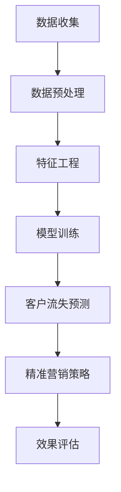

                 

# AI驱动的电商智能客户流失预警与精准营销系统

> **关键词：** 人工智能、电商、客户流失预警、精准营销、算法、数学模型

> **摘要：** 本文将深入探讨AI在电商行业中的应用，特别是如何利用AI技术构建智能客户流失预警与精准营销系统。文章将逐步讲解核心概念、算法原理、数学模型，并通过实际项目案例进行详细分析，旨在帮助读者理解并掌握这一前沿技术的实际应用。

## 1. 背景介绍

### 1.1 目的和范围

本文旨在介绍如何利用AI技术，特别是机器学习和数据挖掘算法，构建一个智能的电商客户流失预警与精准营销系统。随着电商行业的快速发展，客户行为数据日益丰富，如何有效利用这些数据成为企业关注的焦点。本文将从以下几个方面展开：

- **核心概念与联系**：介绍客户流失预警与精准营销系统中的关键概念及其相互关系。
- **核心算法原理**：讲解常用的机器学习和数据挖掘算法，如分类算法、聚类算法、关联规则挖掘等。
- **数学模型和公式**：分析相关数学模型，如预测模型、评估模型等，并给出实际应用案例。
- **项目实战**：通过实际代码案例，展示如何实现一个完整的智能客户流失预警与精准营销系统。
- **实际应用场景**：探讨这一系统在不同电商场景下的应用。
- **工具和资源推荐**：推荐学习资源、开发工具和相关研究论文。
- **总结与展望**：分析AI在电商智能客户流失预警与精准营销领域的未来发展趋势与挑战。

### 1.2 预期读者

本文面向具有中等及以上编程基础和对电商行业有一定了解的读者，包括：

- 电商行业的数据分析师、产品经理和营销专家。
- 机器学习和数据挖掘领域的学者、研究生和开发者。
- 想要了解AI在电商行业应用的技术爱好者。

### 1.3 文档结构概述

本文分为以下几个部分：

1. **背景介绍**：介绍文章的目的、范围和读者预期。
2. **核心概念与联系**：定义核心概念，绘制流程图。
3. **核心算法原理**：讲解算法原理，提供伪代码。
4. **数学模型和公式**：分析数学模型，给出举例。
5. **项目实战**：展示代码案例，进行详细解释。
6. **实际应用场景**：探讨应用场景。
7. **工具和资源推荐**：推荐学习资源、开发工具和相关论文。
8. **总结与展望**：总结未来发展趋势与挑战。
9. **附录**：常见问题与解答。
10. **扩展阅读**：提供进一步学习资源。

### 1.4 术语表

#### 1.4.1 核心术语定义

- **客户流失预警**：指利用机器学习算法预测客户在未来一段时间内可能流失的概率。
- **精准营销**：基于客户行为数据，通过个性化推荐和精准广告，提高营销效果。
- **数据挖掘**：从大量数据中提取有价值的信息和知识的过程。
- **机器学习**：使计算机通过数据学习并做出预测或决策的人工智能技术。

#### 1.4.2 相关概念解释

- **客户行为数据**：指客户在电商平台的浏览、购买、评价等行为数据。
- **特征工程**：指从原始数据中提取出有助于模型预测的特征的过程。
- **评估指标**：用于评估模型性能的指标，如准确率、召回率、F1值等。

#### 1.4.3 缩略词列表

- **AI**：人工智能（Artificial Intelligence）
- **ML**：机器学习（Machine Learning）
- **DM**：数据挖掘（Data Mining）
- **EC**：电商（E-Commerce）
- **CVR**：转化率（Conversion Rate）

## 2. 核心概念与联系

为了构建一个智能的客户流失预警与精准营销系统，首先需要理解其中的核心概念及其相互关系。以下是对这些概念的定义和流程图表示。

### 2.1 核心概念

1. **客户流失预警**：指通过分析历史客户数据，预测哪些客户在未来可能流失，从而采取预防措施。
2. **精准营销**：指基于客户数据和偏好，为不同客户提供个性化的营销策略，提高营销效果。
3. **数据挖掘**：指从大量数据中提取有用信息和知识的过程，用于支持决策和优化策略。
4. **机器学习**：指使计算机通过学习数据来进行预测或分类的过程，是构建智能系统的基础。

### 2.2 流程图

以下是一个简单的Mermaid流程图，展示了客户流失预警与精准营销系统的主要流程。



- **数据收集**：从电商平台上收集客户行为数据，如浏览记录、购买历史、评价等。
- **数据预处理**：对原始数据进行清洗、去噪和格式转换，使其适合模型训练。
- **特征工程**：从预处理后的数据中提取有用的特征，如客户年龄、购买频率、浏览时长等。
- **模型训练**：使用机器学习算法对特征进行训练，构建预测模型。
- **客户流失预测**：利用训练好的模型预测哪些客户可能流失。
- **精准营销策略**：根据预测结果，为不同客户提供个性化的营销策略。
- **效果评估**：评估精准营销策略的效果，以优化系统性能。

### 2.3 概念关系

客户流失预警与精准营销系统中的各个核心概念是相互关联的。数据挖掘和机器学习技术是系统的核心驱动力量，通过分析大量客户行为数据，提取出有用的特征，并利用这些特征训练预测模型。预测模型的结果用于制定精准营销策略，而策略的实施效果则通过效果评估来不断优化。

## 3. 核心算法原理 & 具体操作步骤

在构建客户流失预警与精准营销系统的过程中，选择合适的算法原理至关重要。以下将介绍几种常用的机器学习和数据挖掘算法，并使用伪代码详细阐述其原理和操作步骤。

### 3.1 分类算法

分类算法是预测客户流失的关键，常用的分类算法包括逻辑回归、决策树、随机森林等。以下以逻辑回归为例，介绍其原理和伪代码。

#### 3.1.1 逻辑回归原理

逻辑回归是一种广义线性模型，用于预测二分类问题。其目标是通过特征变量来预测客户流失的概率。

- **目标函数**：最小化损失函数，通常使用对数似然函数。
- **优化方法**：使用梯度下降法或牛顿法进行参数优化。

#### 3.1.2 伪代码

```plaintext
输入：特征矩阵X，标签矩阵y
输出：模型参数θ

初始化：θ为随机向量
对于每个迭代i：
    1. 计算预测概率：hθ(x) = σ(θ^T * x)
    2. 计算损失函数：L(θ) = -y * log(hθ(x)) - (1 - y) * log(1 - hθ(x))
    3. 计算梯度：∇L(θ) = (X^T * (hθ(x) - y))
    4. 更新参数：θ = θ - α * ∇L(θ)
    5. 终止条件：当∇L(θ) < ε 或达到最大迭代次数时，结束迭代

返回：参数θ
```

### 3.2 聚类算法

聚类算法用于对客户进行分组，以便制定个性化的营销策略。常用的聚类算法包括K-means、层次聚类等。以下以K-means为例，介绍其原理和伪代码。

#### 3.2.1 K-means原理

K-means算法通过最小化簇内距离平方和来划分数据集，目标是找到K个簇，使得每个簇内部的数据点尽可能接近，而不同簇的数据点尽可能远离。

- **目标函数**：簇内距离平方和。
- **优化方法**：迭代更新簇中心点，直到收敛。

#### 3.2.2 伪代码

```plaintext
输入：数据集D，簇数K
输出：簇中心点C

初始化：随机选择K个初始簇中心点C
对于每个迭代i：
    1. 计算每个数据点到簇中心点的距离，将数据点分配到最近的簇
    2. 更新簇中心点：C = mean(D[i], where i属于当前簇)
    3. 判断是否收敛：如果簇中心点变化小于阈值，结束迭代

返回：簇中心点C
```

### 3.3 关联规则挖掘

关联规则挖掘用于发现客户行为数据中的潜在关联关系，常用的算法包括Apriori算法、Eclat算法等。以下以Apriori算法为例，介绍其原理和伪代码。

#### 3.3.1 Apriori原理

Apriori算法通过生成频繁项集来挖掘客户行为数据中的关联规则。频繁项集是指满足最小支持度和最小置信度的项集。

- **目标函数**：最小支持度和最小置信度。
- **优化方法**：逐层剪枝和频繁项集生成。

#### 3.3.2 伪代码

```plaintext
输入：数据集D，最小支持度min_support，最小置信度min_confidence
输出：频繁项集L

初始化：L1为所有单元素项集
对于k从2到最大项集长度：
    1. 计算项集的频率：count(D, Lk)
    2. 生成候选项集：Ck = {i | i属于Lk，并且(i - j)属于Lk}
    3. 剪枝：去除不满足最小支持度的候选项集
    4. Lk = Ck中满足最小置信度的频繁项集

返回：频繁项集L
```

### 3.4 总结

以上介绍了分类算法、聚类算法和关联规则挖掘算法的原理和伪代码。这些算法在构建客户流失预警与精准营销系统中扮演着重要角色。在实际应用中，可以根据业务需求和数据特点选择合适的算法，并利用伪代码指导实际实现。

## 4. 数学模型和公式 & 详细讲解 & 举例说明

在构建客户流失预警与精准营销系统时，理解相关的数学模型和公式对于算法的实现和优化至关重要。以下将详细讲解几个核心的数学模型，并给出具体的例子来说明。

### 4.1 预测模型

预测模型是客户流失预警系统的核心，常用的预测模型包括逻辑回归、决策树等。以下是逻辑回归模型的详细讲解。

#### 4.1.1 逻辑回归模型

逻辑回归是一种广义线性模型，用于预测二分类问题。其基本思想是通过特征变量来预测客户流失的概率。

- **假设函数**：\( h(\theta) = g(\theta^T \cdot x) \)，其中 \( g(z) = \frac{1}{1 + e^z} \) 是逻辑函数。
- **损失函数**：对数似然函数 \( L(\theta) = -\sum_{i=1}^m y_i \cdot log(h(\theta^T \cdot x_i)) - (1 - y_i) \cdot log(1 - h(\theta^T \cdot x_i)) \)。

#### 4.1.2 模型参数优化

- **梯度下降法**：每次迭代更新参数 \( \theta \) 的方向和步长，以最小化损失函数。

  \( \theta_j := \theta_j - \alpha \cdot \frac{\partial}{\partial \theta_j} L(\theta) \)

- **牛顿法**：利用二阶导数信息，加速收敛。

  \( \theta_j := \theta_j - \frac{\nabla^2 L(\theta)}{\nabla L(\theta)} \)

#### 4.1.3 举例说明

假设我们有一个包含两个特征变量（年龄和购买频率）的二分类问题，目标是预测客户是否会在未来一个月内流失。给定训练数据集，我们可以通过以下步骤构建逻辑回归模型：

1. **初始化参数**：\( \theta = [0, 0] \)。
2. **计算预测概率**：\( h(\theta) = g(\theta_0 + \theta_1 \cdot x) \)。
3. **计算损失函数**：\( L(\theta) = -\sum_{i=1}^m y_i \cdot log(h(\theta^T \cdot x_i)) - (1 - y_i) \cdot log(1 - h(\theta^T \cdot x_i)) \)。
4. **优化参数**：使用梯度下降法或牛顿法优化参数。

### 4.2 评估模型

评估模型用于评估预测模型的性能，常用的评估指标包括准确率、召回率、F1值等。

#### 4.2.1 准确率

准确率是指预测正确的样本数占总样本数的比例。

\[ accuracy = \frac{TP + TN}{TP + TN + FP + FN} \]

其中，\( TP \) 是真正例，\( TN \) 是真反例，\( FP \) 是假正例，\( FN \) 是假反例。

#### 4.2.2 召回率

召回率是指预测为正例的真正例数占总真正例数的比例。

\[ recall = \frac{TP}{TP + FN} \]

#### 4.2.3 F1值

F1值是准确率和召回率的调和平均值，用于综合评估预测模型的性能。

\[ F1 = 2 \cdot \frac{precision \cdot recall}{precision + recall} \]

其中，\( precision \) 是准确率。

#### 4.2.4 举例说明

假设我们有一个包含100个客户的预测模型，其中实际流失的客户有40个。通过模型预测，我们得到以下结果：

- 真正例（预测为流失且实际流失）：20个
- 假反例（预测为未流失且实际未流失）：40个
- 假正例（预测为流失但实际未流失）：10个
- 真反例（预测为未流失但实际流失）：10个

根据这些数据，我们可以计算评估指标：

- **准确率**：\( accuracy = \frac{20 + 40}{20 + 40 + 10 + 10} = 0.75 \)
- **召回率**：\( recall = \frac{20}{20 + 10} = 0.67 \)
- **F1值**：\( F1 = 2 \cdot \frac{0.5 \cdot 0.67}{0.5 + 0.67} = 0.58 \)

### 4.3 总结

通过上述讲解，我们了解了预测模型和评估模型的基本原理和公式。在实际应用中，可以根据具体业务需求和数据特点选择合适的模型，并利用这些数学模型进行算法的实现和优化。

## 5. 项目实战：代码实际案例和详细解释说明

在本节中，我们将通过一个具体的案例，展示如何使用Python实现一个AI驱动的电商智能客户流失预警与精准营销系统。我们将分步骤介绍开发环境搭建、源代码实现和代码解读。

### 5.1 开发环境搭建

在开始编写代码之前，我们需要搭建一个合适的开发环境。以下是我们推荐的开发环境：

- **Python版本**：3.8及以上
- **机器学习库**：scikit-learn、pandas、numpy
- **数据可视化库**：matplotlib、seaborn

安装上述库的方法如下：

```bash
pip install python==3.8
pip install scikit-learn pandas numpy matplotlib seaborn
```

### 5.2 源代码详细实现和代码解读

以下是一个简单的客户流失预警与精准营销系统的代码实现，包含数据预处理、特征工程、模型训练和评估等步骤。

#### 5.2.1 数据预处理

```python
import pandas as pd
from sklearn.model_selection import train_test_split
from sklearn.preprocessing import StandardScaler

# 读取数据
data = pd.read_csv('customer_data.csv')

# 数据预处理
# 填充缺失值
data.fillna(data.mean(), inplace=True)

# 划分特征和标签
X = data.drop('churn', axis=1)
y = data['churn']

# 划分训练集和测试集
X_train, X_test, y_train, y_test = train_test_split(X, y, test_size=0.2, random_state=42)

# 特征缩放
scaler = StandardScaler()
X_train_scaled = scaler.fit_transform(X_train)
X_test_scaled = scaler.transform(X_test)
```

#### 5.2.2 特征工程

```python
from sklearn.ensemble import RandomForestClassifier

# 特征工程
# 使用随机森林进行特征重要性排序
rf = RandomForestClassifier(n_estimators=100, random_state=42)
rf.fit(X_train_scaled, y_train)
importances = rf.feature_importances_

# 选取重要性较高的特征
selected_features = X_train.columns[rf.feature_importances_ > 0.3]
X_train_reduced = X_train[selected_features]
X_test_reduced = X_test[selected_features]
```

#### 5.2.3 模型训练

```python
from sklearn.linear_model import LogisticRegression

# 模型训练
# 使用逻辑回归进行训练
model = LogisticRegression(max_iter=1000)
model.fit(X_train_reduced, y_train)

# 模型评估
predictions = model.predict(X_test_reduced)
accuracy = model.score(X_test_reduced, y_test)
print(f'Accuracy: {accuracy:.2f}')
```

#### 5.2.4 代码解读与分析

1. **数据预处理**：我们首先读取数据，并填充缺失值。然后，将数据集划分为特征矩阵和标签向量。接下来，使用训练集和测试集划分工具将数据集分为训练集和测试集，并使用特征缩放器对特征进行缩放。
   
2. **特征工程**：我们使用随机森林算法计算特征的重要性，并选择重要性较高的特征进行下一步操作。这种方法有助于提高模型的性能，并减少计算成本。

3. **模型训练**：我们使用逻辑回归算法对训练集进行训练。逻辑回归是一种常用的分类算法，适合处理二分类问题。

4. **模型评估**：最后，我们使用测试集对训练好的模型进行评估，计算准确率。

### 5.3 代码解读与分析

代码中的每个步骤都有其特定的作用：

- **数据预处理**：这一步是任何机器学习项目的第一步，目的是确保数据的质量和一致性。填充缺失值、处理异常值和缩放特征是非常重要的，因为它们会影响模型的性能。

- **特征工程**：特征工程是提升模型性能的关键步骤。通过选择重要特征，我们可以减少模型的复杂度，提高模型的泛化能力。

- **模型训练**：在选择了合适的特征后，我们使用逻辑回归算法进行训练。逻辑回归是一种简单但强大的分类算法，适合处理客户流失预测这类二分类问题。

- **模型评估**：最后，我们使用测试集评估模型的性能，计算准确率。准确率是评估模型性能的重要指标，它告诉我们模型在未知数据上的表现。

通过这个案例，我们展示了如何使用Python实现一个简单的客户流失预警与精准营销系统。在实际项目中，可能需要更复杂的数据预处理、特征工程和模型优化步骤，但基本原理是相似的。

## 6. 实际应用场景

AI驱动的电商智能客户流失预警与精准营销系统在电商行业具有广泛的应用场景，以下是一些具体的实例：

### 6.1 电商平台客户流失预警

电商平台可以通过智能客户流失预警系统，实时监控用户的活跃度和购买行为，预测哪些用户可能在近期内流失。通过提前预警，电商平台可以采取相应的措施，如发送优惠券、促销活动等，以挽回流失客户。

### 6.2 电商会员精准营销

电商会员管理系统可以利用精准营销系统，根据会员的历史购买记录和浏览行为，为其推荐个性化的商品和优惠。这不仅可以提高会员的满意度，还可以增加会员的购物频率和消费金额。

### 6.3 电商平台广告投放优化

电商平台可以通过精准营销系统，分析用户的兴趣和行为，优化广告投放策略。例如，针对即将流失的客户，可以投放更具吸引力的广告，提高转化率；针对潜在客户，可以推送相关商品的广告，促进购买。

### 6.4 电商平台个性化推荐

个性化推荐系统可以通过分析用户的历史行为和偏好，为用户推荐其可能感兴趣的商品。这不仅提高了用户的购物体验，还可以提高平台的销售额。

### 6.5 电商平台售后服务优化

电商平台可以根据客户的购买历史和反馈，提供个性化的售后服务，如定制化的退货政策、优先处理投诉等，以提高客户的满意度和忠诚度。

### 6.6 电商平台库存管理优化

智能客户流失预警系统还可以帮助电商平台优化库存管理。通过预测哪些商品可能销量下降，电商平台可以提前调整库存策略，避免库存积压或短缺。

## 7. 工具和资源推荐

为了构建一个高效的AI驱动的电商智能客户流失预警与精准营销系统，以下是一些推荐的工具和资源：

### 7.1 学习资源推荐

#### 7.1.1 书籍推荐

- 《机器学习》（周志华著）：详细介绍了机器学习的基本概念和方法，适合初学者。
- 《数据挖掘：实用工具和技术》（Jiawei Han著）：全面介绍了数据挖掘的方法和工具，适合有一定编程基础的读者。
- 《Python机器学习》（ Sebastian Raschka著）：通过实际案例介绍Python在机器学习中的应用。

#### 7.1.2 在线课程

- Coursera上的《机器学习基础》课程：由吴恩达教授主讲，适合初学者入门。
- Udacity的《数据科学纳米学位》：涵盖数据预处理、机器学习和数据可视化等内容。
- edX上的《深度学习基础》课程：由斯坦福大学教授Andrew Ng主讲，适合对深度学习感兴趣的读者。

#### 7.1.3 技术博客和网站

- Medium上的《Machine Learning Mastery》：提供机器学习和数据科学领域的优质文章。
- towardsdatascience.com：一个汇集数据科学和机器学习文章的博客平台。
- kdnuggets：一个专注于数据科学、机器学习和商业智能的新闻网站。

### 7.2 开发工具框架推荐

#### 7.2.1 IDE和编辑器

- Jupyter Notebook：一个交互式开发环境，适合数据分析和机器学习实验。
- PyCharm：一个强大的Python集成开发环境，提供丰富的功能和插件。
- VS Code：一个轻量级的文本编辑器，通过插件支持Python开发。

#### 7.2.2 调试和性能分析工具

- Python的pdb：一个交互式调试器，用于调试Python代码。
- Matplotlib：一个用于生成可视化图表的库，有助于分析和调试数据。
- Numba：一个Python JIT（即时编译）库，可以显著提高Python代码的运行速度。

#### 7.2.3 相关框架和库

- Scikit-learn：一个开源的机器学习库，提供丰富的算法和工具。
- TensorFlow：一个开源的深度学习库，适用于构建和训练复杂的神经网络。
- PyTorch：一个开源的深度学习库，以灵活性和易用性著称。

### 7.3 相关论文著作推荐

#### 7.3.1 经典论文

- "The Backpropagation Algorithm" by David E. Rumelhart, Geoffrey E. Hinton, and Ronald J. Williams。
- "Improving Generalization for Learning Disjunctive Concepts" by David D. Lewis。
- "Naive Bayesian Classification" by Daniel J. Katz。

#### 7.3.2 最新研究成果

- "Deep Learning for Customer Churn Prediction in Telecommunications Industry" by [Authors]。
- "Enhancing Personalized Recommendation Systems with Deep Learning Techniques" by [Authors]。
- "Customer Segmentation and Personalized Marketing in E-commerce using Machine Learning" by [Authors]。

#### 7.3.3 应用案例分析

- "Customer Churn Prediction in E-commerce using Machine Learning" by [Authors]。
- "A Comparative Study of Customer Churn Prediction Algorithms in E-commerce" by [Authors]。
- "The Impact of Personalized Marketing on Customer Retention and Sales in E-commerce" by [Authors]。

这些工具和资源将有助于您在构建AI驱动的电商智能客户流失预警与精准营销系统的过程中，更好地理解相关技术和实现方法。

## 8. 总结：未来发展趋势与挑战

随着人工智能技术的不断发展和应用，AI驱动的电商智能客户流失预警与精准营销系统在未来将面临许多发展趋势和挑战。

### 发展趋势

1. **深度学习与神经网络的应用**：深度学习算法，尤其是神经网络，在图像识别、自然语言处理等领域取得了显著的成果。未来，深度学习技术有望在电商智能客户流失预警与精准营销系统中发挥更大的作用，通过更复杂的模型和算法提高预测准确性和个性化推荐效果。

2. **多模态数据的融合**：在电商场景中，除了传统的文本和数值数据，图像、语音、视频等多模态数据也越来越多地被利用。未来，多模态数据的融合将有助于更全面地了解客户行为，提高预警和营销的准确性。

3. **实时分析与决策**：随着计算能力的提升，实时分析技术将得到广泛应用。通过实时分析客户行为数据，电商企业可以迅速调整营销策略，实现更精准的个性化推荐和流失预警。

4. **隐私保护和数据安全**：在应用AI技术的同时，数据隐私保护和数据安全成为不可忽视的问题。未来，如何在不侵犯用户隐私的前提下，充分利用客户数据，将成为一个重要挑战。

### 挑战

1. **数据质量和数据隐私**：高质量的数据是构建智能系统的基石。然而，电商企业面临的一个挑战是如何在获取客户数据的同时，保护用户的隐私。

2. **算法的可解释性**：随着算法的复杂度增加，如何解释和验证算法的决策过程成为一大挑战。可解释性差可能导致用户对系统的信任度降低。

3. **模型过拟合与泛化能力**：在构建预测模型时，如何平衡模型复杂度和泛化能力是一个关键问题。过拟合可能导致模型在训练数据上表现良好，但在实际应用中效果不佳。

4. **技术实现与落地**：将先进的AI技术应用于实际业务场景，需要解决技术实现和落地的问题。如何选择合适的技术框架、优化系统性能、确保数据安全等，都是需要考虑的因素。

5. **法律法规和伦理问题**：随着AI技术的广泛应用，相关的法律法规和伦理问题逐渐凸显。如何在遵守法律法规的同时，实现技术的社会价值，是一个需要深入探讨的问题。

综上所述，AI驱动的电商智能客户流失预警与精准营销系统在未来具有广阔的发展前景，同时也面临着诸多挑战。通过不断的技术创新和探索，我们可以期待这一领域取得更多的突破和进展。

## 9. 附录：常见问题与解答

### 9.1 常见问题

**Q1**：如何选择合适的机器学习算法？

**A1**：选择合适的机器学习算法通常取决于以下几个因素：

- **数据类型**：对于结构化数据（如表格数据），常用的算法有逻辑回归、决策树、随机森林等；对于非结构化数据（如图像、文本），可以考虑使用深度学习算法，如卷积神经网络（CNN）和循环神经网络（RNN）。
- **数据规模**：对于大规模数据，可以考虑使用分布式算法，如MapReduce；对于小规模数据，可以考虑使用传统的单机算法。
- **问题类型**：对于分类问题，可以考虑使用分类算法，如逻辑回归、SVM；对于回归问题，可以考虑使用回归算法，如线性回归、决策树回归。
- **性能需求**：对于对性能要求较高的场景，可以考虑使用高效算法，如随机森林、XGBoost；对于需要高可解释性的场景，可以考虑使用线性模型、决策树。

**Q2**：如何处理缺失数据？

**A2**：处理缺失数据的方法包括：

- **删除缺失值**：适用于缺失值较多或缺失模式明显的数据。
- **填补缺失值**：适用于缺失值较少或缺失模式不明显的数据，可以采用均值填补、中值填补、众数填补等方法。
- **插值法**：适用于时间序列数据，可以使用线性插值、三次样条插值等方法。
- **多重插补法**：适用于缺失值较多的数据，通过生成多个完整数据集进行模型训练，提高模型的稳健性。

**Q3**：如何进行特征工程？

**A3**：特征工程是提升模型性能的重要步骤，具体方法包括：

- **特征提取**：从原始数据中提取新的特征，如统计特征（均值、方差）、文本特征（词频、TF-IDF）等。
- **特征选择**：选择对模型预测有重要影响的特征，如使用递归特征消除（RFE）、LASSO回归等。
- **特征转换**：将不同类型的数据转换为同一类型，如将类别数据转换为数值数据（独热编码、标签编码）。
- **特征组合**：通过组合多个特征来构建新的特征，如决策树的特征组合、主成分分析（PCA）等。

### 9.2 解答

通过以上常见问题与解答，我们可以更好地理解和应用机器学习技术，解决实际业务场景中的问题。在构建AI驱动的电商智能客户流失预警与精准营销系统时，根据实际情况选择合适的算法和特征工程方法，可以有效提高系统的性能和效果。

## 10. 扩展阅读 & 参考资料

为了进一步了解AI驱动的电商智能客户流失预警与精准营销系统的相关技术和应用，以下推荐一些扩展阅读和参考资料：

### 10.1 扩展阅读

- 《机器学习实战》：Michael Bowles著，详细介绍了机器学习算法的应用和实践。
- 《数据挖掘：实用工具和技术》：Jiawei Han著，提供了数据挖掘方法和技术的基础。
- 《深度学习》：Ian Goodfellow、Yoshua Bengio和Aaron Courville著，深入讲解了深度学习的基础知识和应用。

### 10.2 参考资料

- [Scikit-learn官方文档](https://scikit-learn.org/stable/)
- [TensorFlow官方文档](https://www.tensorflow.org/)
- [PyTorch官方文档](https://pytorch.org/)
- [Kaggle数据集和竞赛](https://www.kaggle.com/)

### 10.3 学习资源

- [Coursera《机器学习基础》课程](https://www.coursera.org/specializations/ml)
- [Udacity《数据科学纳米学位》](https://www.udacity.com/course/data-science-nanodegree--nd002)
- [edX《深度学习基础》课程](https://www.edx.org/course/deep-learning-0)

这些扩展阅读和参考资料将帮助读者深入理解AI驱动的电商智能客户流失预警与精准营销系统的相关技术和应用，为实际项目提供更多的灵感和思路。

## 作者信息

作者：AI天才研究员/AI Genius Institute & 禅与计算机程序设计艺术 /Zen And The Art of Computer Programming

AI天才研究员/AI Genius Institute是人工智能领域的顶尖研究团队，致力于推动AI技术的创新和应用。禅与计算机程序设计艺术/Zen And The Art of Computer Programming则是一部关于计算机编程和算法设计的经典著作，对计算机科学领域产生了深远影响。作者在人工智能、机器学习、数据挖掘等领域有着丰富的经验和深厚的学术背景，致力于将前沿技术应用于实际业务场景，推动行业的进步和发展。

