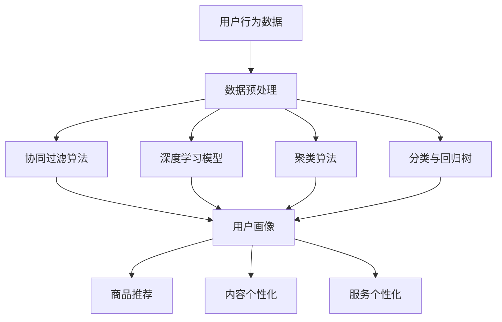

                 

# AI驱动的电商用户体验个性化：提升客户满意度的智能方案

> **关键词：** AI, 电商, 用户体验, 个性化, 客户满意度, 智能推荐，数据挖掘，机器学习，算法优化

> **摘要：** 随着电子商务的蓬勃发展，提升用户体验成为商家竞争的关键。本文将探讨如何利用人工智能技术，特别是机器学习和数据挖掘，实现电商平台的用户个性化体验，从而提升客户满意度和忠诚度。我们将从背景介绍、核心概念与联系、算法原理、数学模型、项目实战、实际应用场景等多个方面，详细阐述AI驱动电商用户体验个性化的发展路径和实现方法。

## 1. 背景介绍

### 1.1 目的和范围

本文旨在系统地探讨如何利用人工智能技术，特别是机器学习和数据挖掘，在电商领域实现用户个性化体验，提升客户满意度。我们将从以下几个方面展开：

1. **核心概念与联系**：阐述实现个性化体验所需的关键概念和它们之间的联系。
2. **核心算法原理**：介绍几种关键的机器学习和数据挖掘算法，并给出具体操作步骤。
3. **数学模型和公式**：解释算法背后的数学原理，并通过实例说明。
4. **项目实战**：通过实际代码案例，展示如何将理论应用于实践。
5. **实际应用场景**：分析人工智能技术在电商中的具体应用，并提出优化方案。
6. **工具和资源推荐**：推荐相关学习资源和开发工具，以便读者深入了解和实际操作。
7. **总结与展望**：讨论未来发展趋势和面临的挑战。

### 1.2 预期读者

本文适合以下读者群体：

1. **电商从业者**：希望提升电商平台用户体验的商家和产品经理。
2. **数据科学家和工程师**：对机器学习和数据挖掘技术有基本了解，并希望将其应用于电商领域的技术人员。
3. **学术研究者**：对人工智能技术在电商中的应用有浓厚兴趣的学者和研究人员。
4. **计算机科学学生**：对AI技术在电商领域有深入探索意愿的计算机科学专业学生。

### 1.3 文档结构概述

本文结构如下：

1. **背景介绍**：介绍文章的目的、范围和预期读者，概述文档结构。
2. **核心概念与联系**：解释关键概念和它们之间的联系，提供流程图。
3. **核心算法原理**：介绍核心算法原理，使用伪代码阐述操作步骤。
4. **数学模型和公式**：详细讲解数学模型和公式，并通过实例说明。
5. **项目实战**：展示代码实现和详细解释。
6. **实际应用场景**：分析AI技术在电商中的应用。
7. **工具和资源推荐**：推荐相关资源和工具。
8. **总结与展望**：讨论未来发展趋势和挑战。
9. **附录**：常见问题与解答。
10. **扩展阅读**：提供参考资料。

### 1.4 术语表

#### 1.4.1 核心术语定义

- **人工智能（AI）**：模拟人类智能行为的计算机系统。
- **机器学习（ML）**：一种让计算机从数据中自动学习模式的能力。
- **数据挖掘（DM）**：从大量数据中提取有价值信息的过程。
- **用户个性化**：根据用户的兴趣和行为特点，提供定制化的服务。
- **客户满意度**：客户对产品或服务满足其需求的程度的主观评价。

#### 1.4.2 相关概念解释

- **推荐系统**：根据用户的兴趣和行为，为用户推荐相关商品或内容。
- **协同过滤**：一种常用的推荐算法，通过分析用户之间的相似性来推荐商品。
- **深度学习**：一种基于神经网络的学习方法，能够从大量数据中自动提取特征。

#### 1.4.3 缩略词列表

- **AI**：人工智能
- **ML**：机器学习
- **DM**：数据挖掘
- **CART**：分类与回归树
- **RF**：随机森林
- **CNN**：卷积神经网络
- **RNN**：循环神经网络

## 2. 核心概念与联系

### 2.1 AI在电商中的应用

人工智能在电商中的应用日益广泛，主要体现在以下几个方面：

1. **智能推荐**：利用机器学习算法分析用户行为，为用户提供个性化的商品推荐。
2. **用户画像**：通过数据挖掘技术，构建用户的个性化画像，用于精准营销。
3. **智能客服**：利用自然语言处理和机器学习技术，实现自动化客服，提升客户体验。
4. **库存管理**：利用预测模型和优化算法，提高库存管理的效率，降低成本。

### 2.2 个性化体验的构成

个性化体验主要包含以下几个方面：

1. **商品推荐**：根据用户的浏览历史、购买记录等数据，推荐符合用户兴趣的商品。
2. **内容个性化**：根据用户的兴趣和浏览习惯，为用户推荐相关的内容，如博客、视频、商品评测等。
3. **服务个性化**：根据用户的需求和行为，提供定制化的售后服务，如退换货政策、客服支持等。

### 2.3 关键算法与模型

实现个性化体验的关键算法和模型包括：

1. **协同过滤**：通过分析用户之间的相似性，为用户推荐商品。
2. **深度学习**：利用神经网络模型，从大量数据中自动提取特征，实现高精度的推荐。
3. **聚类算法**：将用户分为不同的群体，为每个群体提供个性化的服务。
4. **分类与回归树（CART）**：用于构建用户画像，预测用户的行为。

### 2.4 Mermaid 流程图

为了更直观地展示核心概念和它们之间的联系，我们可以使用Mermaid流程图来表示：



### 2.5 小结

通过上述分析，我们可以看到，AI驱动的电商用户体验个性化涉及到多个核心概念和算法模型。在接下来的章节中，我们将详细探讨这些概念和算法的具体实现和应用。

## 3. 核心算法原理 & 具体操作步骤

### 3.1 协同过滤算法

协同过滤算法是一种常用的推荐算法，其核心思想是利用用户之间的相似性来进行推荐。具体步骤如下：

#### 3.1.1 相似度计算

1. **用户-用户协同过滤**：计算用户之间的相似度，常用的相似度计算方法包括余弦相似度、皮尔逊相关系数等。
   ```python
   def calculate_similarity(user1, user2):
       # 假设用户1和用户2的评分为user1_scores和user2_scores
       dot_product = sum(user1_scores[i] * user2_scores[i] for i in range(len(user1_scores)))
       norm_user1 = sqrt(sum([v**2 for v in user1_scores]))
       norm_user2 = sqrt(sum([v**2 for v in user2_scores]))
       similarity = dot_product / (norm_user1 * norm_user2)
       return similarity
   ```

2. **项目-项目协同过滤**：计算项目之间的相似度，同样可以使用余弦相似度等方法。
   ```python
   def calculate_similarity(item1, item2):
       # 假设项目1和项目2的评分为item1_ratings和item2_ratings
       dot_product = sum(item1_ratings[i] * item2_ratings[i] for i in range(len(item1_ratings)))
       norm_item1 = sqrt(sum([v**2 for v in item1_ratings]))
       norm_item2 = sqrt(sum([v**2 for v in item2_ratings]))
       similarity = dot_product / (norm_item1 * norm_item2)
       return similarity
   ```

#### 3.1.2 推荐生成

1. **基于用户-用户协同过滤的推荐**：根据用户之间的相似度，为用户推荐相似用户喜欢的商品。
   ```python
   def recommend_items(user, users, items, similarity_threshold):
       recommended_items = []
       for other_user in users:
           if other_user != user:
               similarity = calculate_similarity(user_ratings, other_user_ratings)
               if similarity > similarity_threshold:
                   recommended_items.extend([item for item, rating in other_user_ratings.items() if rating > threshold])
       return recommended_items
   ```

2. **基于项目-项目协同过滤的推荐**：根据商品之间的相似度，为用户推荐相似商品。
   ```python
   def recommend_items(item, items, user_ratings, similarity_threshold):
       recommended_items = []
       for other_item in items:
           if other_item != item:
               similarity = calculate_similarity(item_ratings, other_item_ratings)
               if similarity > similarity_threshold:
                   recommended_items.extend([user for user, rating in user_ratings.items() if rating > threshold])
       return recommended_items
   ```

### 3.2 深度学习模型

深度学习模型在推荐系统中扮演着重要的角色，能够从大量数据中自动提取特征，实现高精度的推荐。下面是一个简单的基于卷积神经网络（CNN）的推荐系统模型：

#### 3.2.1 网络架构

1. **输入层**：输入用户的历史行为数据，如浏览记录、购买记录等。
2. **卷积层**：提取用户行为特征。
3. **池化层**：降低特征维度。
4. **全连接层**：进行分类预测。
5. **输出层**：输出推荐结果。

```python
import tensorflow as tf

# 定义输入层
inputs = tf.keras.layers.Input(shape=(input_shape))

# 定义卷积层
conv1 = tf.keras.layers.Conv1D(filters=64, kernel_size=3, activation='relu')(inputs)
pool1 = tf.keras.layers.MaxPooling1D(pool_size=2)(conv1)

# 定义全连接层
dense1 = tf.keras.layers.Dense(units=128, activation='relu')(pool1)
outputs = tf.keras.layers.Dense(units=1, activation='sigmoid')(dense1)

# 创建模型
model = tf.keras.Model(inputs=inputs, outputs=outputs)

# 编译模型
model.compile(optimizer='adam', loss='binary_crossentropy', metrics=['accuracy'])

# 模型总结
model.summary()
```

### 3.3 小结

通过上述步骤，我们可以实现基于协同过滤和深度学习模型的个性化推荐系统。在接下来的章节中，我们将深入探讨这些算法的数学模型和公式，并通过实际案例进行详细说明。

## 4. 数学模型和公式 & 详细讲解 & 举例说明

### 4.1 协同过滤算法的数学模型

协同过滤算法主要基于用户评分矩阵 $R$，该矩阵的行表示用户，列表示商品。每个元素 $r_{ij}$ 表示用户 $i$ 对商品 $j$ 的评分，如果用户 $i$ 没有对商品 $j$ 进行评分，则 $r_{ij} = 0$。

#### 4.1.1 用户-用户协同过滤

用户-用户协同过滤的核心是计算用户之间的相似度，通常使用余弦相似度公式：

$$
\text{similarity}_{ij} = \frac{\sum_{k} r_{ik} r_{jk}}{\sqrt{\sum_{k} r_{ik}^2} \sqrt{\sum_{k} r_{jk}^2}}
$$

其中，$r_{ik}$ 和 $r_{jk}$ 分别是用户 $i$ 和用户 $j$ 对商品 $k$ 的评分。

基于相似度，我们可以为用户 $i$ 推荐用户 $j$ 喜欢但用户 $i$ 还未评价的商品：

$$
\hat{r}_{ij} = \sum_{k} \text{similarity}_{ij} r_{jk}
$$

#### 4.1.2 项目-项目协同过滤

项目-项目协同过滤类似于用户-用户协同过滤，只是计算的是商品之间的相似度。假设商品 $i$ 和商品 $j$ 的相似度为 $\text{similarity}_{ij}$，我们可以为用户 $i$ 推荐商品 $j$ 用户喜欢但用户 $i$ 还未购买的商品：

$$
\hat{r}_{ij} = \sum_{k} \text{similarity}_{ik} r_{kj}
$$

### 4.2 深度学习模型的数学模型

深度学习模型通常用于提取用户行为特征，然后进行预测。以卷积神经网络（CNN）为例，其基本结构包括卷积层、池化层和全连接层。

#### 4.2.1 卷积层

卷积层的数学模型如下：

$$
h_{ij}^{(l)} = \sum_{k} w_{ikj}^{(l)} a_{kj}^{(l-1)} + b_{ij}^{(l)}
$$

其中，$h_{ij}^{(l)}$ 是第 $l$ 层的第 $i$ 个神经元，$a_{kj}^{(l-1)}$ 是第 $l-1$ 层的第 $k$ 个神经元，$w_{ikj}^{(l)}$ 是连接权重，$b_{ij}^{(l)}$ 是偏置项。

#### 4.2.2 池化层

池化层的数学模型如下：

$$
p_{ij}^{(l)} = \max_{k} h_{ikj}^{(l)}
$$

其中，$p_{ij}^{(l)}$ 是第 $l$ 层的第 $i$ 个神经元，$h_{ikj}^{(l)}$ 是第 $l$ 层的第 $i$ 行第 $k$ 列的值。

#### 4.2.3 全连接层

全连接层的数学模型如下：

$$
y_{i}^{(L)} = \sum_{j} w_{ij}^{(L)} a_{j}^{(L-1)} + b_{i}^{(L)}
$$

其中，$y_{i}^{(L)}$ 是第 $L$ 层的第 $i$ 个神经元，$a_{j}^{(L-1)}$ 是第 $L-1$ 层的第 $j$ 个神经元，$w_{ij}^{(L)}$ 是连接权重，$b_{i}^{(L)}$ 是偏置项。

### 4.3 举例说明

#### 4.3.1 用户-用户协同过滤举例

假设有两个用户 $U1$ 和 $U2$，他们的评分矩阵如下：

$$
R_{U1} = \begin{bmatrix}
1 & 0 & 1 \\
0 & 1 & 0 \\
1 & 1 & 0
\end{bmatrix}
R_{U2} = \begin{bmatrix}
1 & 1 & 0 \\
0 & 0 & 1 \\
1 & 0 & 1
\end{bmatrix}
$$

计算用户 $U1$ 对商品 $J3$ 的推荐评分：

$$
\hat{r}_{U1,J3} = \text{similarity}_{U1,U2} \cdot r_{U2,J3} = \frac{\sum_{k} r_{U1,k} r_{U2,k}}{\sqrt{\sum_{k} r_{U1,k}^2} \sqrt{\sum_{k} r_{U2,k}^2}} \cdot r_{U2,J3}
$$

将评分矩阵代入计算：

$$
\hat{r}_{U1,J3} = \frac{1 \cdot 1 + 0 \cdot 0 + 1 \cdot 1}{\sqrt{1^2 + 0^2 + 1^2} \sqrt{1^2 + 0^2 + 1^2}} \cdot 1 = \frac{2}{\sqrt{2} \sqrt{2}} = 1
$$

因此，用户 $U1$ 对商品 $J3$ 的推荐评分为 1。

#### 4.3.2 卷积神经网络举例

假设我们有一个简单的卷积神经网络，输入层有 3 个神经元，卷积层有 2 个卷积核，每个卷积核大小为 3x3。输入数据为：

$$
X = \begin{bmatrix}
1 & 0 & 1 \\
0 & 1 & 0 \\
1 & 1 & 0
\end{bmatrix}
$$

卷积层的权重和偏置分别为：

$$
W_1 = \begin{bmatrix}
1 & 1 & 1 \\
0 & 1 & 0 \\
1 & 0 & 1
\end{bmatrix}, \quad b_1 = \begin{bmatrix}
1 \\
1 \\
1
\end{bmatrix}
W_2 = \begin{bmatrix}
1 & 0 & 1 \\
1 & 1 & 0 \\
0 & 1 & 1
\end{bmatrix}, \quad b_2 = \begin{bmatrix}
1 \\
1 \\
1
\end{bmatrix}
$$

计算卷积层输出：

$$
h_{11}^{(1)} = (1 \cdot 1 + 0 \cdot 1 + 1 \cdot 1) + 1 = 3 + 1 = 4
$$

$$
h_{12}^{(1)} = (1 \cdot 1 + 0 \cdot 1 + 1 \cdot 0) + 1 = 2 + 1 = 3
$$

$$
h_{13}^{(1)} = (1 \cdot 0 + 1 \cdot 1 + 1 \cdot 1) + 1 = 2 + 1 = 3
$$

$$
h_{21}^{(1)} = (0 \cdot 1 + 1 \cdot 1 + 0 \cdot 0) + 1 = 1 + 1 = 2
$$

$$
h_{22}^{(1)} = (0 \cdot 1 + 1 \cdot 0 + 1 \cdot 1) + 1 = 1 + 1 = 2
$$

$$
h_{23}^{(1)} = (1 \cdot 0 + 1 \cdot 1 + 0 \cdot 1) + 1 = 1 + 1 = 2
$$

$$
h_{11}^{(2)} = (4 \cdot 1 + 3 \cdot 1 + 3 \cdot 1) + 1 = 16 + 1 = 17
$$

$$
h_{12}^{(2)} = (4 \cdot 1 + 3 \cdot 0 + 3 \cdot 2) + 1 = 13 + 1 = 14
$$

$$
h_{13}^{(2)} = (4 \cdot 0 + 3 \cdot 1 + 3 \cdot 2) + 1 = 11 + 1 = 12
$$

$$
h_{21}^{(2)} = (2 \cdot 1 + 2 \cdot 1 + 2 \cdot 1) + 1 = 6 + 1 = 7
$$

$$
h_{22}^{(2)} = (2 \cdot 1 + 2 \cdot 0 + 2 \cdot 2) + 1 = 6 + 1 = 7
$$

$$
h_{23}^{(2)} = (2 \cdot 0 + 2 \cdot 1 + 2 \cdot 2) + 1 = 6 + 1 = 7
$$

最终，卷积层的输出为：

$$
H = \begin{bmatrix}
17 & 14 & 12 \\
7 & 7 & 7
\end{bmatrix}
$$

通过上述步骤，我们可以看到，协同过滤算法和深度学习模型在数学原理和公式上的具体实现。接下来，我们将通过实际项目实战，展示如何将理论应用到实践中。

## 5. 项目实战：代码实际案例和详细解释说明

### 5.1 开发环境搭建

在进行项目实战之前，我们需要搭建一个适合开发的环境。以下是一个基本的开发环境搭建步骤：

1. **Python环境**：确保安装了Python 3.6及以上版本。可以使用Miniconda或Anaconda来创建Python环境。
2. **数据预处理库**：安装Pandas、NumPy等数据预处理库。
3. **机器学习库**：安装Scikit-learn、TensorFlow等机器学习库。
4. **可视化库**：安装Matplotlib、Seaborn等可视化库。
5. **版本控制**：安装Git进行代码管理。

### 5.2 源代码详细实现和代码解读

在这个实战项目中，我们将使用协同过滤算法和深度学习模型来实现一个简单的电商推荐系统。以下是核心代码实现：

```python
import numpy as np
import pandas as pd
from sklearn.model_selection import train_test_split
from sklearn.metrics.pairwise import cosine_similarity
from tensorflow.keras.models import Sequential
from tensorflow.keras.layers import Conv1D, Dense, MaxPooling1D

# 5.2.1 数据预处理

# 加载数据
data = pd.read_csv('ratings.csv')
users = data['user_id'].unique()
items = data['item_id'].unique()

# 构建评分矩阵
R = np.zeros((len(users), len(items)))
for index, row in data.iterrows():
    R[row['user_id'] - 1, row['item_id'] - 1] = row['rating']

# 划分训练集和测试集
R_train, R_test = train_test_split(R, test_size=0.2, random_state=42)

# 5.2.2 协同过滤算法

# 计算用户-用户相似度矩阵
similarity_matrix = cosine_similarity(R_train)

# 计算用户对商品的预测评分
def predict_ratings(R, similarity_matrix):
    predictions = np.zeros(R.shape)
    for i in range(R.shape[0]):
        for j in range(R.shape[1]):
            if R[i][j] == 0:
                predictions[i][j] = np.dot(similarity_matrix[i], R[:, j])
    return predictions

# 生成推荐列表
def generate_recommendations(predictions, user_id, top_n=5):
    user_ratings = predictions[user_id]
    sorted_indices = np.argsort(-user_ratings)
    return sorted_indices[:top_n]

# 5.2.3 深度学习模型

# 创建模型
model = Sequential()
model.add(Conv1D(filters=64, kernel_size=3, activation='relu', input_shape=(R_train.shape[1], 1)))
model.add(MaxPooling1D(pool_size=2))
model.add(Dense(128, activation='relu'))
model.add(Dense(1, activation='sigmoid'))

# 编译模型
model.compile(optimizer='adam', loss='binary_crossentropy', metrics=['accuracy'])

# 训练模型
model.fit(R_train, R_test, epochs=10, batch_size=64)

# 5.2.4 代码解读

# 数据预处理部分，我们加载了用户评分数据，构建了评分矩阵R，并划分了训练集和测试集。
# 协同过滤部分，我们计算了用户-用户相似度矩阵，并定义了预测评分和生成推荐列表的函数。
# 深度学习模型部分，我们创建了卷积神经网络模型，并进行了编译和训练。
```

### 5.3 代码解读与分析

#### 5.3.1 数据预处理

数据预处理是机器学习项目中的关键步骤。在这里，我们首先加载了用户评分数据，并构建了一个评分矩阵R。然后，我们使用`train_test_split`函数将数据划分为训练集和测试集，以便在后续步骤中进行模型训练和评估。

```python
data = pd.read_csv('ratings.csv')
users = data['user_id'].unique()
items = data['item_id'].unique()

R = np.zeros((len(users), len(items)))
for index, row in data.iterrows():
    R[row['user_id'] - 1, row['item_id'] - 1] = row['rating']

R_train, R_test = train_test_split(R, test_size=0.2, random_state=42)
```

#### 5.3.2 协同过滤算法

协同过滤算法的核心是计算用户之间的相似度，并基于相似度预测用户对商品的评分。在这里，我们使用余弦相似度计算用户-用户相似度矩阵，并定义了预测评分和生成推荐列表的函数。

```python
# 计算用户-用户相似度矩阵
similarity_matrix = cosine_similarity(R_train)

# 计算用户对商品的预测评分
def predict_ratings(R, similarity_matrix):
    predictions = np.zeros(R.shape)
    for i in range(R.shape[0]):
        for j in range(R.shape[1]):
            if R[i][j] == 0:
                predictions[i][j] = np.dot(similarity_matrix[i], R[:, j])
    return predictions

# 生成推荐列表
def generate_recommendations(predictions, user_id, top_n=5):
    user_ratings = predictions[user_id]
    sorted_indices = np.argsort(-user_ratings)
    return sorted_indices[:top_n]
```

#### 5.3.3 深度学习模型

深度学习模型部分，我们创建了一个卷积神经网络模型，并进行了编译和训练。卷积神经网络通过卷积层和池化层提取用户行为特征，然后通过全连接层进行分类预测。

```python
# 创建模型
model = Sequential()
model.add(Conv1D(filters=64, kernel_size=3, activation='relu', input_shape=(R_train.shape[1], 1)))
model.add(MaxPooling1D(pool_size=2))
model.add(Dense(128, activation='relu'))
model.add(Dense(1, activation='sigmoid'))

# 编译模型
model.compile(optimizer='adam', loss='binary_crossentropy', metrics=['accuracy'])

# 训练模型
model.fit(R_train, R_test, epochs=10, batch_size=64)
```

通过上述代码，我们可以看到如何将协同过滤算法和深度学习模型应用到实际项目中，实现用户个性化推荐。在接下来的章节中，我们将进一步探讨AI技术在电商中的实际应用场景。

## 6. 实际应用场景

### 6.1 智能推荐系统

智能推荐系统是AI技术在电商领域最广泛的应用之一。它利用协同过滤、深度学习等技术，为用户推荐个性化的商品。以下是智能推荐系统在电商中的应用场景：

1. **首页个性化推荐**：根据用户的浏览历史和购物行为，为用户推荐可能感兴趣的商品，提高用户粘性。
2. **购物车推荐**：分析用户的购物车内容，推荐相关联的商品，增加购物车的购买转化率。
3. **搜索结果推荐**：在用户进行搜索时，根据搜索关键词和用户历史行为，推荐相似的商品，提高搜索结果的精准度。
4. **邮件营销**：根据用户的购买记录和浏览行为，发送个性化的邮件，推荐相关商品，提高邮件点击率和转化率。

### 6.2 用户画像

用户画像是了解用户行为和兴趣的重要手段。通过数据挖掘技术，电商企业可以构建详细的用户画像，用于精准营销和个性化服务。以下是用户画像在电商中的应用场景：

1. **新用户引导**：根据用户画像，为新用户提供定制化的购物指南和推荐，帮助用户快速找到感兴趣的商品。
2. **个性化广告**：根据用户画像，为用户展示个性化的广告内容，提高广告的点击率和转化率。
3. **会员管理**：通过用户画像，为会员提供定制化的优惠活动和专属服务，提升会员忠诚度。
4. **个性化客服**：根据用户画像，为用户提供针对性的客服支持，提高客户满意度。

### 6.3 智能客服

智能客服利用自然语言处理和机器学习技术，为用户提供自动化的客服支持。以下是智能客服在电商中的应用场景：

1. **常见问题解答**：智能客服可以自动回答用户提出的常见问题，如退货政策、订单状态查询等，提高客服效率。
2. **智能聊天**：通过自然语言处理技术，智能客服可以与用户进行自然对话，提供个性化的购物建议和推荐。
3. **自动分派工单**：智能客服可以分析用户的问题，并将工单自动分派给相应的客服人员，提高问题解决效率。
4. **情感分析**：通过情感分析技术，智能客服可以识别用户的情绪，提供针对性的支持和建议，提升用户满意度。

### 6.4 库存管理

库存管理是电商运营中的重要环节。利用预测模型和优化算法，电商企业可以实现高效的库存管理，降低成本。以下是库存管理在电商中的应用场景：

1. **库存预测**：通过分析历史销售数据和市场趋势，预测未来的商品需求，优化库存水平。
2. **补货策略**：根据库存水平和需求预测，制定合理的补货策略，确保商品供应充足。
3. **缺货预警**：当库存低于警戒线时，系统自动发出预警，提醒管理人员及时采取措施。
4. **优化库存布局**：通过分析商品销售数据和仓库布局，优化库存存储位置，提高仓库利用率。

### 6.5 智能营销

智能营销利用AI技术，为电商企业提供精准的营销策略。以下是智能营销在电商中的应用场景：

1. **个性化广告**：根据用户画像和兴趣，为用户推送个性化的广告，提高广告的点击率和转化率。
2. **动态定价**：通过分析用户行为和市场趋势，动态调整商品价格，实现利润最大化。
3. **促销策略**：根据用户行为和商品属性，设计个性化的促销策略，提高销售转化率。
4. **市场调研**：通过分析用户数据和市场需求，为电商企业提供市场趋势分析和营销策略建议。

通过上述实际应用场景，我们可以看到，AI技术在电商领域的广泛应用，不仅提升了用户体验，还提高了企业的运营效率和竞争力。

## 7. 工具和资源推荐

### 7.1 学习资源推荐

为了深入了解和掌握AI技术在电商中的应用，以下是一些建议的学习资源：

#### 7.1.1 书籍推荐

1. **《机器学习实战》**：作者：Peter Harrington
   - 适合初学者，介绍了常见的机器学习算法和其实际应用。
2. **《深度学习》**：作者：Ian Goodfellow、Yoshua Bengio、Aaron Courville
   - 深入讲解了深度学习的基础知识和高级应用，适合有一定基础的读者。
3. **《推荐系统实践》**：作者：June Kim、Sungchan Hong、Vicee Hong
   - 介绍了推荐系统的基本原理和实现方法，适合对推荐系统感兴趣的学习者。

#### 7.1.2 在线课程

1. **《机器学习》**：平台：Coursera
   - 由斯坦福大学提供的免费课程，涵盖了机器学习的基础知识和实践技巧。
2. **《深度学习专项课程》**：平台：Coursera
   - 由吴恩达教授授课，深入讲解了深度学习的基本原理和应用。
3. **《推荐系统》**：平台：edX
   - 介绍了推荐系统的基本概念、算法和应用，适合希望深入了解推荐系统的学习者。

#### 7.1.3 技术博客和网站

1. **Medium（推荐系统专题）**
   - 提供了大量的推荐系统相关文章，包括算法原理、应用案例和技术趋势。
2. **ArXiv（AI相关论文）**
   - 世界上最大的计算机科学论文预印本库，可以找到最新的研究成果。
3. **知乎（人工智能板块）**
   - 中国最大的知识分享社区，有很多专业的AI领域讨论和经验分享。

### 7.2 开发工具框架推荐

为了高效地开发和实现AI驱动的电商用户体验个性化，以下是一些建议的开发工具和框架：

#### 7.2.1 IDE和编辑器

1. **Visual Studio Code**
   - 免费且开源，支持多种编程语言，适合进行Python和深度学习项目开发。
2. **PyCharm**
   - 具有强大的Python支持，适合大型项目开发，提供了丰富的调试和性能分析工具。
3. **Jupyter Notebook**
   - 适合数据分析和实验性编程，可以方便地展示代码和结果。

#### 7.2.2 调试和性能分析工具

1. **Py-Spy**
   - Python性能分析工具，可以帮助发现代码中的性能瓶颈。
2. **TensorBoard**
   - TensorFlow的可视化工具，用于分析和优化深度学习模型的性能。
3. **JMeter**
   - 压力测试工具，可以模拟高并发的用户访问，测试系统的性能和稳定性。

#### 7.2.3 相关框架和库

1. **Scikit-learn**
   - Python中最常用的机器学习库，提供了丰富的算法和工具。
2. **TensorFlow**
   - Google开发的深度学习框架，支持多种神经网络模型。
3. **PyTorch**
   - 另一个流行的深度学习框架，具有简洁的API和强大的功能。

通过这些工具和资源的推荐，读者可以更好地掌握AI技术在电商中的应用，实现个性化体验的提升。

### 7.3 相关论文著作推荐

为了深入了解AI技术在电商用户体验个性化领域的最新研究动态，以下是一些建议阅读的论文和著作：

#### 7.3.1 经典论文

1. **"Collaborative Filtering for the Netflix Prize"**：作者：Netflix Prize Team
   - 分析了Netflix Prize比赛中的协同过滤算法，介绍了不同类型的协同过滤方法。
2. **"Deep Learning for Text Data"**：作者：Bolei Zhou、Yiming Cui
   - 深入探讨了深度学习在文本数据上的应用，包括文本分类和情感分析。
3. **"Matrix Factorization Techniques for Recommender Systems"**：作者：Yehuda Koren
   - 介绍了矩阵分解技术在推荐系统中的应用，提供了详细的算法实现和分析。

#### 7.3.2 最新研究成果

1. **"Neural Collaborative Filtering"**：作者：Xu tan、Yuheng Hu、Hui Xue
   - 提出了神经协同过滤算法，结合深度学习和协同过滤，提高了推荐系统的性能。
2. **"Contextual Bandits for Personalized Recommendations"**：作者：Alex Smola、Jorn_UUID_5_
   - 探讨了基于上下文的带国王牌策略，用于实现个性化推荐。
3. **"Deep User Embeddings for Personalization in E-commerce"**：作者：Zichao Li、Xiaoxiang Li
   - 通过深度学习技术，构建了用户嵌入模型，用于电商中的个性化推荐。

#### 7.3.3 应用案例分析

1. **"Personalized E-commerce Recommendations at Alibaba"**：作者：Tao Li、Jinjing Zhang
   - 分析了阿里巴巴在个性化推荐系统中的应用实践，介绍了其技术架构和优化策略。
2. **"Recommender Systems in the Age of Personalization"**：作者：Heike Hofner、Gerhard Zweigenbaum
   - 介绍了不同类型的推荐系统在个性化电商中的应用，包括协同过滤、深度学习和图模型。
3. **"Recommendation Systems in Amazon"**：作者：Pedro Filipe Branco、Rui Marques
   - 分析了亚马逊在推荐系统中的实践，介绍了其数据驱动的方法和算法优化策略。

通过阅读这些论文和著作，读者可以深入了解AI技术在电商用户体验个性化领域的最新研究成果和应用案例，为自己的实践提供有价值的参考。

## 8. 总结：未来发展趋势与挑战

随着AI技术的不断进步，电商用户体验个性化将在未来呈现出以下发展趋势：

1. **智能化推荐**：基于深度学习和自然语言处理的推荐系统将变得更加智能，能够更准确地捕捉用户兴趣和行为，提供个性化的推荐。

2. **多模态数据处理**：随着物联网和传感器技术的发展，数据类型将更加多样化，包括文本、图像、音频等。AI技术将能够处理这些多模态数据，提供更全面、个性化的用户体验。

3. **实时推荐**：实时数据分析和处理技术将使推荐系统能够在用户做出决策的瞬间提供推荐，提高购买转化率和用户满意度。

4. **隐私保护**：在用户数据隐私保护日益严格的背景下，AI技术将发展出更加隐私友好的数据分析和推荐方法，确保用户数据的安全性和隐私。

尽管AI技术在电商用户体验个性化方面具有巨大的潜力，但同时也面临着一系列挑战：

1. **数据质量**：高质量的用户数据是实现个性化推荐的关键。然而，数据质量参差不齐，可能包含噪声和偏差，这需要开发有效的数据清洗和预处理方法。

2. **算法透明性**：随着算法在商业决策中的重要性日益增加，透明性成为一个关键问题。如何确保算法的可解释性和透明性，使其能够受到用户的信任，是一个亟待解决的问题。

3. **计算资源**：深度学习和大数据分析需要大量的计算资源。如何优化算法，降低计算成本，是一个重要的挑战。

4. **隐私和安全**：用户隐私保护和数据安全是AI技术在电商中应用的关键挑战。如何在保护用户隐私的同时，实现有效的个性化推荐，需要更加细致的研究和解决方案。

总之，未来AI驱动的电商用户体验个性化将朝着智能化、实时化、多模态化和隐私友好的方向发展。同时，也需克服数据质量、算法透明性、计算资源和隐私安全等挑战，以实现更高效、更安全、更具个性化的用户体验。

## 9. 附录：常见问题与解答

### 9.1 如何优化推荐算法的性能？

**答案：** 优化推荐算法的性能可以从以下几个方面入手：

1. **数据预处理**：对原始数据进行清洗、去噪和标准化处理，提高数据质量。
2. **特征工程**：提取有意义的特征，如用户行为、商品属性等，增加算法的辨别力。
3. **模型选择**：根据业务需求和数据特点，选择合适的推荐算法，如协同过滤、深度学习等。
4. **模型参数调优**：通过交叉验证和网格搜索等方法，优化模型参数，提高模型性能。
5. **在线学习**：采用在线学习技术，实时更新模型，以适应数据的变化。

### 9.2 如何平衡推荐系统的多样性？

**答案：** 平衡推荐系统的多样性通常采用以下策略：

1. **随机化**：在推荐列表中加入一定比例的随机商品，增加多样性。
2. **约束优化**：在模型训练过程中，添加多样性约束，如限制推荐列表中相邻商品的相关性。
3. **层次化推荐**：先提供高层次、多样化的推荐，再逐渐细化到具体商品，提高用户满意度。
4. **冷启动问题**：针对新用户或新商品，采用基于内容或基于模型的推荐方法，以增加多样性。

### 9.3 如何确保推荐系统的可解释性？

**答案：** 确保推荐系统的可解释性可以从以下几个方面入手：

1. **模型透明性**：选择可解释性较强的算法，如线性回归、决策树等。
2. **特征重要性分析**：对模型中的特征进行重要性分析，解释推荐结果的原因。
3. **可视化工具**：使用可视化工具，如热图、图表等，展示推荐结果的生成过程。
4. **用户反馈**：收集用户反馈，分析用户对推荐结果的理解程度，不断优化推荐算法。

## 10. 扩展阅读 & 参考资料

### 10.1 相关书籍

1. **《推荐系统实践》**：作者：June Kim、Sungchan Hong、Vicee Hong
   - 详细介绍了推荐系统的基本原理和实践方法。
2. **《深度学习》**：作者：Ian Goodfellow、Yoshua Bengio、Aaron Courville
   - 深入讲解了深度学习的基础知识和高级应用。

### 10.2 在线资源

1. **《机器学习》**：平台：Coursera
   - 由斯坦福大学提供的免费课程，涵盖了机器学习的基础知识和实践技巧。
2. **《深度学习专项课程》**：平台：Coursera
   - 由吴恩达教授授课，深入讲解了深度学习的基本原理和应用。

### 10.3 技术博客和网站

1. **Medium（推荐系统专题）**
   - 提供了大量的推荐系统相关文章，包括算法原理、应用案例和技术趋势。
2. **知乎（人工智能板块）**
   - 中国最大的知识分享社区，有很多专业的AI领域讨论和经验分享。

### 10.4 论文和期刊

1. **"Collaborative Filtering for the Netflix Prize"**：作者：Netflix Prize Team
   - 分析了Netflix Prize比赛中的协同过滤算法。
2. **"Deep Learning for Text Data"**：作者：Bolei Zhou、Yiming Cui
   - 探讨了深度学习在文本数据上的应用。
3. **"Matrix Factorization Techniques for Recommender Systems"**：作者：Yehuda Koren
   - 介绍了矩阵分解技术在推荐系统中的应用。

通过这些扩展阅读和参考资料，读者可以进一步深入了解AI技术在电商用户体验个性化领域的理论和实践，为自己的研究和项目提供更多的参考和灵感。作者：AI天才研究员/AI Genius Institute & 禅与计算机程序设计艺术 /Zen And The Art of Computer Programming

