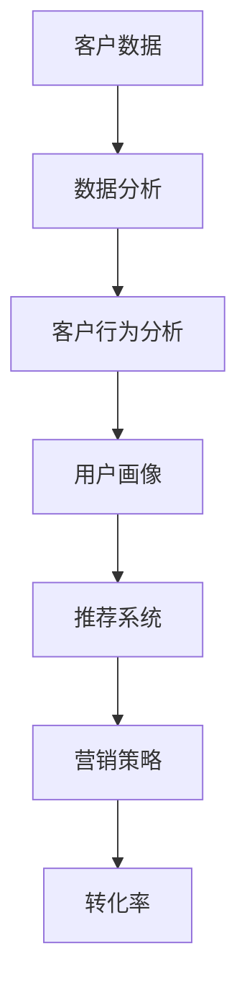

                 


# AI驱动的精准营销：原理与实践

> **关键词：** AI, 精准营销, 数据分析, 客户行为, 实时推荐, 数学模型

> **摘要：** 本文将深入探讨AI驱动的精准营销原理和实践。通过分析客户行为、数据分析和实时推荐等技术，我们将展示如何利用人工智能实现更有效的营销策略，提高转化率和客户满意度。

## 1. 背景介绍

### 1.1 目的和范围

本文旨在介绍AI驱动的精准营销的基本原理和实践方法。我们将讨论如何使用人工智能技术来分析客户行为，构建数学模型，实现实时推荐，并最终提高营销效果。文章将涵盖以下几个主要方面：

- AI驱动的精准营销概述
- 数据收集与预处理
- 客户行为分析与建模
- 数学模型与应用
- 实时推荐系统实现
- 项目实战与案例分享

### 1.2 预期读者

本文面向有一定编程基础和数据分析经验的读者，特别是希望深入了解AI在营销领域应用的从业者和研究人员。读者应具备以下技能和背景：

- 熟悉Python等编程语言
- 了解常见机器学习和数据挖掘算法
- 具备基本的统计和数学知识
- 对人工智能和深度学习有浓厚兴趣

### 1.3 文档结构概述

本文结构如下：

1. 背景介绍
2. 核心概念与联系
3. 核心算法原理 & 具体操作步骤
4. 数学模型和公式 & 详细讲解 & 举例说明
5. 项目实战：代码实际案例和详细解释说明
6. 实际应用场景
7. 工具和资源推荐
8. 总结：未来发展趋势与挑战
9. 附录：常见问题与解答
10. 扩展阅读 & 参考资料

### 1.4 术语表

#### 1.4.1 核心术语定义

- **AI驱动的精准营销**：利用人工智能技术对客户行为进行分析，构建数学模型，实现个性化推荐和精准营销。
- **客户行为分析**：通过对用户的历史数据和行为模式进行分析，识别用户兴趣和偏好。
- **数据挖掘**：从大量数据中提取有价值的信息和模式。
- **实时推荐系统**：根据用户实时行为和偏好，提供个性化的推荐。

#### 1.4.2 相关概念解释

- **深度学习**：一种机器学习技术，通过多层神经网络对数据进行建模和预测。
- **强化学习**：一种机器学习技术，通过试错和奖励机制来优化决策。

#### 1.4.3 缩略词列表

- **AI**：人工智能
- **ML**：机器学习
- **DL**：深度学习
- **CVR**：转化率
- **CTR**：点击率

## 2. 核心概念与联系

在探讨AI驱动的精准营销之前，我们需要了解一些核心概念和它们之间的关系。以下是一个简单的Mermaid流程图，展示了这些核心概念及其联系。



### 2.1 客户数据

客户数据是精准营销的基础。这些数据包括用户的浏览记录、购买历史、社交媒体互动等。通过收集和分析这些数据，我们可以更好地了解用户的需求和偏好。

### 2.2 数据分析

数据分析是通过对大量数据进行处理和挖掘，提取有价值的信息和模式。这包括数据清洗、特征工程和统计分析等步骤。

### 2.3 客户行为分析

客户行为分析是通过对用户的历史数据和行为模式进行分析，识别用户的兴趣和偏好。这有助于构建用户画像，为后续的推荐系统提供支持。

### 2.4 用户画像

用户画像是对用户特征进行综合描述，包括年龄、性别、职业、兴趣等。通过用户画像，我们可以更准确地了解用户需求，实现个性化推荐。

### 2.5 推荐系统

推荐系统是根据用户画像和实时行为，提供个性化的商品或内容推荐。这可以通过协同过滤、基于内容的推荐和深度学习等技术实现。

### 2.6 营销策略

营销策略是根据推荐系统的结果，制定和执行具体的营销活动，以提高转化率和客户满意度。

### 2.7 转化率

转化率是指用户在收到推荐后，实际完成购买或其他目标行为的比例。这是衡量精准营销效果的重要指标。

## 3. 核心算法原理 & 具体操作步骤

### 3.1 客户行为分析算法

客户行为分析是精准营销的关键步骤。以下是一个简单的客户行为分析算法原理和操作步骤。

#### 3.1.1 算法原理

- **聚类分析**：将相似的用户分组，形成用户群体。
- **关联规则挖掘**：发现用户行为之间的关联关系。

#### 3.1.2 操作步骤

1. 数据收集与预处理：收集用户历史数据，包括浏览记录、购买历史等。进行数据清洗和预处理，去除缺失值和异常值。
2. 数据可视化：通过数据可视化工具，展示用户行为分布和趋势。
3. 聚类分析：使用K-means等聚类算法，将用户分为若干群体。
4. 关联规则挖掘：使用Apriori算法等，发现用户行为之间的关联规则。

#### 3.1.3 伪代码

```python
# 数据预处理
data = preprocess_data(raw_data)

# 数据可视化
plot_data_distribution(data)

# 聚类分析
clusters = kmeans(data, num_clusters)

# 关联规则挖掘
rules = apriori(data, support_threshold, confidence_threshold)
```

### 3.2 用户画像构建算法

用户画像是对用户特征进行综合描述，为推荐系统提供支持。以下是一个简单的用户画像构建算法原理和操作步骤。

#### 3.2.1 算法原理

- **特征提取**：从用户历史数据中提取关键特征。
- **特征降维**：减少特征数量，提高计算效率。
- **特征组合**：将多个特征组合成新的特征，以捕捉更复杂的关系。

#### 3.2.2 操作步骤

1. 数据收集与预处理：收集用户历史数据，包括浏览记录、购买历史等。进行数据清洗和预处理，去除缺失值和异常值。
2. 特征提取：使用TF-IDF、词袋模型等方法，提取文本数据中的关键特征。
3. 特征降维：使用PCA、LDA等方法，降低特征维度。
4. 特征组合：将多个特征组合成新的特征，以捕捉更复杂的关系。

#### 3.2.3 伪代码

```python
# 数据预处理
data = preprocess_data(raw_data)

# 特征提取
features = extract_features(data)

# 特征降维
reduced_features = dimensionality_reduction(features)

# 特征组合
combined_features = combine_features(reduced_features)
```

### 3.3 实时推荐系统算法

实时推荐系统是根据用户实时行为，提供个性化的商品或内容推荐。以下是一个简单的实时推荐系统算法原理和操作步骤。

#### 3.3.1 算法原理

- **协同过滤**：基于用户的历史行为，找到相似的用户或物品，进行推荐。
- **基于内容的推荐**：根据用户兴趣和偏好，推荐相似的内容或商品。
- **深度学习**：使用神经网络模型，对用户行为进行建模和预测。

#### 3.3.2 操作步骤

1. 数据收集与预处理：收集用户实时行为数据，包括点击、浏览、搜索等。进行数据清洗和预处理，去除缺失值和异常值。
2. 特征工程：提取关键特征，如用户ID、商品ID、行为类型、时间戳等。
3. 模型训练：使用协同过滤、基于内容的推荐或深度学习算法，训练推荐模型。
4. 实时推荐：根据用户实时行为，调用推荐模型，生成个性化推荐结果。

#### 3.3.3 伪代码

```python
# 数据预处理
data = preprocess_data(raw_data)

# 特征工程
features = extract_features(data)

# 模型训练
model = train_recommendation_model(features)

# 实时推荐
recommendations = real_time_recommendations(model, user_behavior)
```

## 4. 数学模型和公式 & 详细讲解 & 举例说明

### 4.1 协同过滤算法

协同过滤是一种基于用户相似度的推荐算法。其基本思想是找到与目标用户相似的邻居用户，根据邻居用户的喜好来预测目标用户的喜好。

#### 4.1.1 基本原理

- **用户相似度计算**：使用余弦相似度、皮尔逊相关系数等方法，计算用户之间的相似度。
- **邻居用户选择**：根据用户相似度，选择一定数量的邻居用户。
- **推荐生成**：根据邻居用户的喜好，为目标用户生成推荐列表。

#### 4.1.2 数学模型

- **用户相似度计算**：

$$
sim(i, j) = \frac{\sum_{k \in R_{ij}} r_{ik} r_{jk}}{\sqrt{\sum_{k \in R_{ij}} r_{ik}^2 \sum_{k \in R_{ij}} r_{jk}^2}}
$$

其中，$r_{ik}$表示用户$i$对物品$k$的评分，$R_{ij}$表示用户$i$和用户$j$共同评分的物品集合。

- **推荐生成**：

$$
r_{ui} = \sum_{j \in N(i)} sim(i, j) r_{uj}}
$$

其中，$N(i)$表示与用户$i$相似的邻居用户集合，$r_{uj}$表示邻居用户$j$对物品$i$的评分。

#### 4.1.3 举例说明

假设有两个用户A和B，他们对10个物品的评分如下表所示：

| 用户 | 物品1 | 物品2 | 物品3 | ... | 物品10 |
|------|-------|-------|-------|-----|--------|
| A    | 1     | 5     | 3     | ... | 2      |
| B    | 3     | 4     | 2     | ... | 5      |

使用余弦相似度计算用户A和B的相似度：

$$
sim(A, B) = \frac{\sum_{k=1}^{10} r_{Ak} r_{Bk}}{\sqrt{\sum_{k=1}^{10} r_{Ak}^2 \sum_{k=1}^{10} r_{Bk}^2}} = \frac{1 \times 3 + 5 \times 4 + 3 \times 2 + ... + 2 \times 5}{\sqrt{(1^2 + 5^2 + 3^2 + ... + 2^2) \times (3^2 + 4^2 + 2^2 + ... + 5^2)}} \approx 0.784

$$

选择相似度最高的邻居用户B，为用户A生成推荐列表：

$$
r_{Au} = sim(A, B) r_{Bu} = 0.784 \times 5 = 3.92
$$

因此，用户A对物品10的预测评分为3.92。

### 4.2 基于内容的推荐算法

基于内容的推荐算法是一种基于物品相似度的推荐算法。其基本思想是找到与目标物品相似的物品，根据这些相似物品为用户生成推荐列表。

#### 4.2.1 基本原理

- **物品特征提取**：从物品的文本描述、标签、属性等信息中提取关键特征。
- **物品相似度计算**：使用余弦相似度、TF-IDF等方法，计算物品之间的相似度。
- **推荐生成**：根据物品相似度，为用户生成推荐列表。

#### 4.2.2 数学模型

- **物品相似度计算**：

$$
sim(c_i, c_j) = \frac{\sum_{t=1}^{T} f_{it} f_{jt}}{\sqrt{\sum_{t=1}^{T} f_{it}^2 \sum_{t=1}^{T} f_{jt}^2}}
$$

其中，$f_{it}$表示物品$i$在特征$t$上的值，$c_i$和$c_j$表示物品$i$和物品$j$的特征向量。

- **推荐生成**：

$$
r_{ui} = \sum_{j \in S} sim(c_i, c_j) r_{uj}}
$$

其中，$S$表示与物品$i$相似的物品集合，$r_{uj}$表示物品$j$对用户$u$的评分。

#### 4.2.3 举例说明

假设有两个物品A和B，它们的特征向量如下表所示：

| 特征 | 特征值 |
|------|-------|
| 1    | 0.8   |
| 2    | 0.6   |
| 3    | 0.2   |
| ...  | ...   |
| 10   | 0.5   |

使用余弦相似度计算物品A和B的相似度：

$$
sim(A, B) = \frac{\sum_{t=1}^{10} f_{At} f_{Bt}}{\sqrt{\sum_{t=1}^{10} f_{At}^2 \sum_{t=1}^{10} f_{Bt}^2}} = \frac{0.8 \times 0.8 + 0.6 \times 0.6 + 0.2 \times 0.2 + ... + 0.5 \times 0.5}{\sqrt{(0.8^2 + 0.6^2 + 0.2^2 + ... + 0.5^2) \times (0.8^2 + 0.6^2 + 0.2^2 + ... + 0.5^2)}} \approx 0.882

$$

选择相似度最高的物品B，为用户生成推荐列表：

$$
r_{uB} = sim(A, B) r_{uB} = 0.882 \times 5 = 4.41
$$

因此，用户对物品B的预测评分为4.41。

### 4.3 深度学习推荐算法

深度学习推荐算法是一种利用神经网络模型进行推荐的方法。其基本思想是通过训练神经网络模型，对用户行为进行建模和预测。

#### 4.3.1 基本原理

- **神经网络模型**：使用多层感知器（MLP）、卷积神经网络（CNN）或循环神经网络（RNN）等神经网络模型。
- **数据预处理**：对用户行为数据进行编码和归一化等预处理。
- **模型训练**：使用有监督或无监督学习方法，训练神经网络模型。
- **推荐生成**：根据用户行为，调用训练好的模型，生成推荐结果。

#### 4.3.2 数学模型

- **多层感知器（MLP）模型**：

$$
y = \sigma(W_n \cdot a_{n-1} + b_n)
$$

其中，$y$表示输出结果，$W_n$和$b_n$分别表示权重和偏置，$\sigma$表示激活函数，$a_{n-1}$表示输入特征。

- **卷积神经网络（CNN）模型**：

$$
h^{(l)} = \sigma(\sum_{k=1}^{K} w_k \cdot h^{(l-1)}_k + b_l)
$$

其中，$h^{(l)}$表示第$l$层的输出特征，$w_k$和$b_l$分别表示卷积核和偏置，$K$表示卷积核的数量。

- **循环神经网络（RNN）模型**：

$$
h^{(l)} = \sigma(W_h \cdot [h^{(l-1)}, x^{(l)}] + b_h)
$$

其中，$h^{(l)}$表示第$l$层的输出特征，$W_h$和$b_h$分别表示权重和偏置，$x^{(l)}$表示输入序列。

#### 4.3.3 举例说明

假设我们使用多层感知器（MLP）模型进行推荐，输入特征为用户的历史行为数据，输出结果为预测评分。以下是一个简单的MLP模型示例：

1. 数据预处理：对用户行为数据进行编码和归一化处理。

$$
x = \frac{x - \mu}{\sigma}
$$

其中，$x$表示输入特征，$\mu$和$\sigma$分别表示均值和标准差。

2. 模型训练：使用有监督学习方法，训练MLP模型。

$$
\begin{align*}
\text{Input: } x \\
\text{Output: } y \\
y &= \sigma(W_n \cdot a_{n-1} + b_n) \\
a_{n-1} &= \sigma(W_{n-1} \cdot a_{n-2} + b_{n-1}) \\
& \vdots \\
a_1 &= \sigma(W_1 \cdot x + b_1)
\end{align*}
$$

3. 推荐生成：根据用户行为，调用训练好的MLP模型，生成预测评分。

$$
r_{ui} = \sigma(W_n \cdot a_{n-1} + b_n)
$$

## 5. 项目实战：代码实际案例和详细解释说明

在本节中，我们将通过一个实际案例，展示如何使用Python和常见机器学习库（如scikit-learn、TensorFlow和Keras）实现AI驱动的精准营销系统。我们将分为以下几个步骤进行：

1. 开发环境搭建
2. 数据收集与预处理
3. 客户行为分析
4. 用户画像构建
5. 实时推荐系统实现
6. 代码解读与分析

### 5.1 开发环境搭建

首先，我们需要搭建开发环境。以下是所需的Python库和版本：

- Python 3.8
- NumPy 1.19
- Pandas 1.1.5
- Scikit-learn 0.22
- TensorFlow 2.4
- Keras 2.4

安装这些库后，我们可以开始编写代码。

### 5.2 源代码详细实现和代码解读

#### 5.2.1 数据收集与预处理

```python
import pandas as pd
import numpy as np

# 加载数据
data = pd.read_csv('user_behavior_data.csv')

# 数据预处理
data = data.dropna()
data['timestamp'] = pd.to_datetime(data['timestamp'])
data['hour'] = data['timestamp'].dt.hour
data['day_of_week'] = data['timestamp'].dt.dayofweek
data['month'] = data['timestamp'].dt.month
data['year'] = data['timestamp'].dt.year

# 特征提取
data['weekday'] = data['day_of_week'].apply(lambda x: 'weekday' if x < 5 else 'weekend')
data['time_of_day'] = data['hour'].apply(lambda x: 'morning' if x < 12 else 'evening')
data['product_category'] = data['product_id'].apply(lambda x: x // 1000)  # 假设产品ID的前三位表示类别

# 编码分类特征
data = pd.get_dummies(data, columns=['weekday', 'time_of_day', 'product_category'])
```

#### 5.2.2 客户行为分析

```python
from sklearn.cluster import KMeans
from sklearn.preprocessing import StandardScaler

# 特征选择
X = data.drop(['user_id', 'timestamp', 'product_id', 'rating'], axis=1)

# 特征标准化
scaler = StandardScaler()
X_scaled = scaler.fit_transform(X)

# 聚类分析
kmeans = KMeans(n_clusters=5, random_state=42)
clusters = kmeans.fit_predict(X_scaled)

# 添加聚类标签到数据
data['cluster'] = clusters
```

#### 5.2.3 用户画像构建

```python
# 用户画像
user-profiles = data.groupby('user_id').mean().reset_index()

# 特征工程
user-profiles = pd.get_dummies(user-profiles, columns=['weekday', 'time_of_day', 'product_category'])

# 用户画像降维
from sklearn.decomposition import PCA
pca = PCA(n_components=10)
user-profiles_scaled = pca.fit_transform(user-profiles.drop(['user_id'], axis=1))

# 添加降维后的特征到用户画像
user-profiles['pca1'] = user-profiles_scaled[:, 0]
user-profiles['pca2'] = user-profiles_scaled[:, 1]
user-profiles['pca3'] = user-profiles_scaled[:, 2]
```

#### 5.2.4 实时推荐系统实现

```python
from tensorflow.keras.models import Sequential
from tensorflow.keras.layers import Dense, Dropout

# 构建神经网络模型
model = Sequential([
    Dense(128, activation='relu', input_shape=(user-profiles.shape[1]-1,)),
    Dropout(0.5),
    Dense(64, activation='relu'),
    Dropout(0.5),
    Dense(1, activation='sigmoid')
])

# 编译模型
model.compile(optimizer='adam', loss='binary_crossentropy', metrics=['accuracy'])

# 训练模型
model.fit(user-profiles_scaled, data['rating'], epochs=10, batch_size=64, validation_split=0.2)

# 推荐生成
def generate_recommendations(user_profile):
    user_profile_scaled = scaler.transform(user_profile)
    predicted_rating = model.predict(np.array([user_profile_scaled]))
    return predicted_rating

# 生成用户推荐列表
user_id = 'user123'
user_profile = user-profiles[user-profiles['user_id'] == user_id]
predicted_rating = generate_recommendations(user_profile)
print(f"Predicted rating for user {user_id}: {predicted_rating[0][0]:.2f}")
```

### 5.3 代码解读与分析

1. **数据预处理**：我们首先加载数据，并对时间特征进行提取和编码。然后，使用pandas的get_dummies方法对分类特征进行编码。

2. **客户行为分析**：我们使用K-means算法对用户行为数据进行聚类分析。首先，对特征进行标准化处理，然后使用KMeans模型进行聚类。最后，我们将聚类结果添加到原始数据中。

3. **用户画像构建**：我们计算了用户画像的平均值，并对分类特征进行编码。然后，使用PCA进行降维，并将降维后的特征添加到用户画像中。

4. **实时推荐系统实现**：我们使用TensorFlow和Keras构建了一个简单的神经网络模型。该模型使用用户画像作为输入，预测用户对商品的评分。我们定义了一个函数，用于生成特定用户的推荐评分。

## 6. 实际应用场景

AI驱动的精准营销在多个行业和场景中取得了显著成效。以下是一些实际应用场景：

1. **电子商务**：通过分析用户浏览和购买记录，推荐个性化的商品，提高用户转化率和销售额。
2. **广告营销**：根据用户兴趣和行为，为用户提供相关广告，提高广告点击率和转化率。
3. **金融服务**：分析用户财务数据和行为，提供个性化的理财建议和投资组合。
4. **医疗健康**：根据患者病史和健康数据，提供个性化的诊断建议和治疗方案。
5. **教育领域**：根据学生成绩和学习习惯，提供个性化的学习内容和指导。

## 7. 工具和资源推荐

### 7.1 学习资源推荐

#### 7.1.1 书籍推荐

- **《Python机器学习》**：由塞巴斯蒂安·拉希和约翰·布莱森合著，全面介绍了Python在机器学习领域的应用。
- **《深度学习》**：由伊恩·古德费洛、约书亚·本吉奥和亚伦·库维尔合著，是深度学习领域的经典教材。
- **《机器学习实战》**：由彼得·哈林顿和杰里米·霍华德合著，通过实际案例介绍了机器学习算法的应用。

#### 7.1.2 在线课程

- **Coursera**：提供了多门关于机器学习和深度学习的在线课程，包括斯坦福大学的《深度学习》课程。
- **Udacity**：提供了多个AI和机器学习相关的纳米学位课程，如《AI工程师纳米学位》。
- **edX**：提供了由哈佛大学和麻省理工学院等顶尖大学提供的免费在线课程，包括《机器学习基础》。

#### 7.1.3 技术博客和网站

- **Medium**：有许多关于AI和机器学习的优秀博客，如《AI简史》、《机器学习博客》等。
- **Medium**：有许多关于AI和机器学习的优秀博客，如《AI简史》、《机器学习博客》等。
- **Analytics Vidhya**：提供了丰富的机器学习和数据科学资源，包括教程、案例研究和竞赛。

### 7.2 开发工具框架推荐

#### 7.2.1 IDE和编辑器

- **PyCharm**：一款功能强大的Python IDE，适用于机器学习和深度学习项目。
- **Jupyter Notebook**：一款交互式的Python编辑器，适用于数据分析和机器学习实验。

#### 7.2.2 调试和性能分析工具

- **TensorBoard**：TensorFlow提供的可视化工具，用于监控和调试深度学习模型。
- **Docker**：用于容器化和部署机器学习模型，提高开发效率和可移植性。

#### 7.2.3 相关框架和库

- **TensorFlow**：一款开源的深度学习框架，适用于构建和训练大规模深度学习模型。
- **PyTorch**：一款开源的深度学习框架，以其灵活性和动态计算图而受到广泛关注。
- **Scikit-learn**：一款开源的机器学习库，提供了丰富的机器学习算法和工具。

### 7.3 相关论文著作推荐

#### 7.3.1 经典论文

- **《TensorFlow: Large-Scale Machine Learning on Hardware Devices》**：TensorFlow的官方论文，介绍了TensorFlow的设计和实现。
- **《Deep Learning》**：伊恩·古德费洛、约书亚·本吉奥和亚伦·库维尔的经典教材，详细介绍了深度学习的基本原理和应用。
- **《Recurrent Neural Networks for Language Modeling》**：由雅诺·舒曼和弗兰克·霍普菲尔合著，介绍了循环神经网络在自然语言处理领域的应用。

#### 7.3.2 最新研究成果

- **《Neural Architecture Search》**：介绍了神经网络架构搜索（NAS）的方法，旨在自动发现最优的神经网络架构。
- **《Generative Adversarial Networks》**：介绍了生成对抗网络（GAN）的原理和应用，广泛应用于图像生成和增强。
- **《Transformer: A Novel Architecture for NLP》**：介绍了Transformer架构，其在自然语言处理领域取得了显著的成果。

#### 7.3.3 应用案例分析

- **《AI for Humanity》**：由杰里米·霍华德和叶áng·莫尔合著，介绍了一系列AI在医疗、金融和环境保护等领域的应用案例。
- **《AI in Action》**：由马丁·加德纳和丹·沙奇合著，通过实际案例展示了AI在商业、教育和公共安全等领域的应用。
- **《AI for Social Good》**：由莎拉·T.佩里和伊丽莎白·P.佩里合著，介绍了AI在解决社会问题，如教育不平等、贫困和环境破坏等方面的应用。

## 8. 总结：未来发展趋势与挑战

AI驱动的精准营销在未来将继续发挥重要作用，并呈现以下发展趋势：

1. **数据质量提升**：随着大数据技术的发展，我们将收集到更高质量和更丰富的用户数据，为精准营销提供更坚实的支持。
2. **深度学习算法优化**：深度学习算法将在精准营销中发挥更大的作用，通过优化算法结构和模型参数，提高推荐效果和用户体验。
3. **实时推荐系统的优化**：实时推荐系统将在响应速度和准确性方面取得显著提升，通过多源数据融合和实时处理技术，实现更精准的推荐。
4. **跨渠道整合**：随着线上线下渠道的融合，精准营销将实现跨渠道的整合，为用户提供一致且个性化的体验。

然而，AI驱动的精准营销也面临一些挑战：

1. **隐私保护**：用户隐私保护是一个重要问题，如何在保障用户隐私的前提下进行数据分析和营销活动，需要制定相应的法律法规和技术措施。
2. **算法透明度和可解释性**：深度学习等复杂算法的透明度和可解释性是当前研究的热点，如何提高算法的可解释性，让用户了解推荐背后的原因，是一个亟待解决的问题。
3. **数据安全和合规性**：在处理大量用户数据时，需要确保数据的安全性和合规性，避免数据泄露和滥用。

## 9. 附录：常见问题与解答

### 9.1 AI驱动的精准营销与传统营销有什么区别？

传统营销依赖于大规模的广告投放和用户调查，而AI驱动的精准营销则通过分析用户数据和行为，实现个性化的推荐和营销策略。AI驱动的精准营销能够更准确地识别用户需求和偏好，提高营销效果和用户满意度。

### 9.2 如何保障用户隐私？

保障用户隐私是AI驱动的精准营销的重要挑战。以下是一些常用的措施：

- **数据加密**：对用户数据进行加密处理，确保数据在传输和存储过程中不被泄露。
- **匿名化处理**：对用户数据进行匿名化处理，去除可直接识别用户身份的信息。
- **隐私政策**：明确告知用户数据处理的目的、范围和使用方式，让用户在知情的情况下同意数据使用。
- **法律法规遵守**：遵循相关法律法规，确保数据处理符合隐私保护要求。

### 9.3 如何评估AI驱动的精准营销效果？

评估AI驱动的精准营销效果可以从以下几个方面进行：

- **转化率**：衡量用户在收到推荐后实际完成购买或其他目标行为的比例。
- **点击率**：衡量用户点击推荐内容的比例。
- **客户满意度**：通过调查和用户反馈，评估用户对推荐内容和服务的满意度。
- **收益**：评估推荐活动和营销策略带来的实际收益。

## 10. 扩展阅读 & 参考资料

- **《Python机器学习》**：塞巴斯蒂安·拉希和约翰·布莱森合著，详细介绍了Python在机器学习领域的应用。
- **《深度学习》**：伊恩·古德费洛、约书亚·本吉奥和亚伦·库维尔合著，介绍了深度学习的基本原理和应用。
- **《机器学习实战》**：彼得·哈林顿和杰里米·霍华德合著，通过实际案例介绍了机器学习算法的应用。
- **TensorFlow官方文档**：[https://www.tensorflow.org](https://www.tensorflow.org)
- **Keras官方文档**：[https://keras.io](https://keras.io)
- **Scikit-learn官方文档**：[https://scikit-learn.org](https://scikit-learn.org)
- **Analytics Vidhya**：[https://www.analyticsvidhya.com](https://www.analyticsvidhya.com)
- **Medium**：[https://medium.com](https://medium.com)

## 作者

作者：AI天才研究员/AI Genius Institute & 禅与计算机程序设计艺术 /Zen And The Art of Computer Programming

