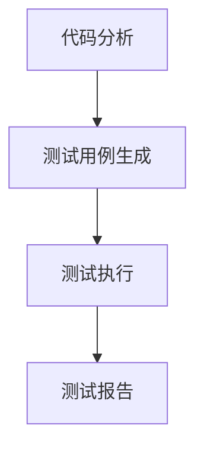
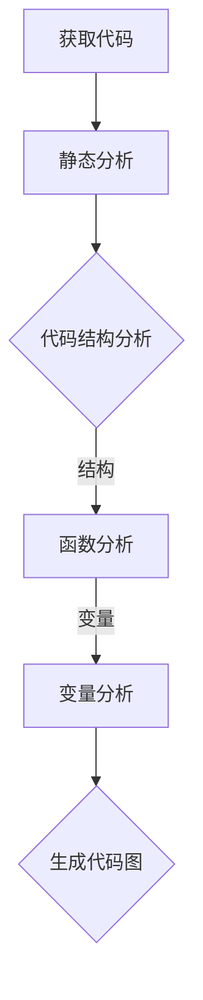
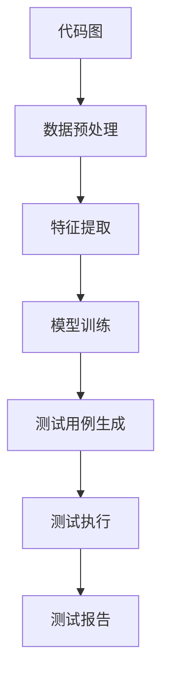

                 

# AI驱动的软件测试用例生成

> **关键词：** 软件测试、AI、测试用例、自动化测试、机器学习、测试覆盖、算法设计

> **摘要：** 本文章旨在探讨如何利用人工智能技术，特别是机器学习和深度学习，来生成软件测试用例。通过分析当前软件测试的现状和挑战，本文提出了一种基于AI的测试用例生成方法，并详细阐述了其核心概念、算法原理、数学模型和项目实战。此外，文章还探讨了AI驱动软件测试用例生成在实际应用中的场景，推荐了相关学习资源和开发工具，并对未来发展趋势与挑战进行了展望。

## 1. 背景介绍

### 1.1 目的和范围

在软件开发过程中，测试是确保软件质量和可靠性的关键环节。传统的软件测试依赖于人工编写测试用例，这不仅耗时耗力，而且容易出现遗漏或重复。随着人工智能技术的发展，特别是机器学习和深度学习在各个领域的应用，利用AI生成软件测试用例成为了一种新兴的研究方向。

本文的主要目的是介绍如何利用AI技术，特别是机器学习和深度学习，来实现软件测试用例的自动化生成。文章将首先分析当前软件测试的现状和挑战，然后介绍AI驱动软件测试用例生成的方法和原理，最后通过一个实际项目案例，展示如何将AI应用于软件测试用例生成。

### 1.2 预期读者

本文适合以下读者群体：

- 软件测试工程师和开发人员，希望了解如何利用AI技术提高软件测试效率。
- 对人工智能和软件测试有兴趣的研究人员和工程师。
- 开发者和管理者，关注软件质量和自动化测试。

### 1.3 文档结构概述

本文分为十个部分：

- 第1部分：背景介绍，包括目的、范围、预期读者和文档结构。
- 第2部分：核心概念与联系，介绍与AI驱动软件测试用例生成相关的基本概念和流程。
- 第3部分：核心算法原理 & 具体操作步骤，详细阐述生成测试用例的算法和操作步骤。
- 第4部分：数学模型和公式 & 详细讲解 & 举例说明，介绍用于生成测试用例的数学模型和公式。
- 第5部分：项目实战：代码实际案例和详细解释说明，通过一个实际项目案例展示AI驱动软件测试用例生成的应用。
- 第6部分：实际应用场景，探讨AI驱动软件测试用例生成的实际应用场景。
- 第7部分：工具和资源推荐，推荐相关学习资源和开发工具。
- 第8部分：总结：未来发展趋势与挑战，对AI驱动软件测试用例生成的发展趋势和挑战进行展望。
- 第9部分：附录：常见问题与解答，回答读者可能遇到的问题。
- 第10部分：扩展阅读 & 参考资料，提供更多的学习资源。

### 1.4 术语表

#### 1.4.1 核心术语定义

- **软件测试（Software Testing）：** 对软件系统进行测试，以发现错误、验证功能、性能和可靠性。
- **测试用例（Test Case）：** 对软件系统进行测试的基本单元，包括输入数据、预期结果和实际结果。
- **自动化测试（Automated Testing）：** 使用工具或脚本自动执行测试用例。
- **机器学习（Machine Learning）：** 让计算机从数据中学习，并做出预测或决策。
- **深度学习（Deep Learning）：** 机器学习的一个分支，使用多层神经网络来模拟人脑的学习过程。
- **测试覆盖（Test Coverage）：** 衡量测试用例对代码的覆盖率，包括语句覆盖、分支覆盖、路径覆盖等。

#### 1.4.2 相关概念解释

- **神经网络（Neural Network）：** 一种由大量简单计算单元（神经元）组成的计算模型，用于模拟人脑的信息处理过程。
- **训练数据（Training Data）：** 用于训练机器学习模型的输入数据集，包含正确的输入和输出。
- **测试数据（Test Data）：** 用于评估机器学习模型性能的数据集，通常与训练数据不同。
- **超参数（Hyperparameter）：** 影响模型性能的参数，通常在模型训练之前设定。

#### 1.4.3 缩略词列表

- **AI：** 人工智能（Artificial Intelligence）
- **ML：** 机器学习（Machine Learning）
- **DL：** 深度学习（Deep Learning）
- **IDE：** 集成开发环境（Integrated Development Environment）
- **Selenium：** 一款开源自动化测试工具
- **JUnit：** 一款流行的Java单元测试框架

## 2. 核心概念与联系

为了理解AI驱动的软件测试用例生成，首先需要了解与该主题相关的核心概念和流程。本节将介绍这些概念，并通过一个Mermaid流程图展示它们之间的联系。

### 2.1 核心概念

- **代码分析（Code Analysis）：** 对软件代码进行分析，以理解其结构和行为。
- **测试用例生成（Test Case Generation）：** 根据代码分析结果，生成测试用例。
- **测试执行（Test Execution）：** 执行测试用例，以验证软件的功能和性能。
- **测试报告（Test Reporting）：** 记录测试执行结果，生成测试报告。

### 2.2 Mermaid流程图



### 2.3 核心概念之间的联系

- **代码分析是测试用例生成的基础。** 通过代码分析，可以获取代码的结构、函数、变量等信息，从而为生成测试用例提供依据。
- **测试用例生成依赖于代码分析的结果。** 测试用例生成的算法通常基于代码分析结果，例如路径覆盖、分支覆盖等。
- **测试执行是验证测试用例的有效性。** 通过执行测试用例，可以验证测试用例是否能够发现代码中的错误。
- **测试报告提供了测试结果的总结。** 测试报告记录了测试执行结果，帮助开发人员和测试人员了解软件的质量和稳定性。

## 3. 核心算法原理 & 具体操作步骤

在理解了AI驱动的软件测试用例生成的基本概念后，本节将详细阐述其核心算法原理和具体操作步骤。我们将使用伪代码来描述算法，以便于理解和实现。

### 3.1 算法原理

AI驱动的软件测试用例生成算法通常基于以下原理：

1. **代码分析：** 使用静态分析或动态分析技术，对软件代码进行分析，以获取代码的结构、函数、变量等信息。
2. **测试用例生成：** 根据代码分析结果，使用机器学习或深度学习算法，生成测试用例。
3. **测试执行：** 执行生成的测试用例，以验证软件的功能和性能。
4. **测试报告：** 根据测试执行结果，生成测试报告。

### 3.2 具体操作步骤

以下是AI驱动软件测试用例生成的具体操作步骤：

#### 3.2.1 代码分析



- **获取代码：** 从源代码管理系统中获取待测试的代码。
- **静态分析：** 对代码进行静态分析，提取代码的结构、函数、变量等信息。
- **代码结构分析：** 分析代码的结构，如函数、类、模块等。
- **函数分析：** 分析函数的定义、参数、返回值等。
- **变量分析：** 分析变量的定义、作用域、类型等。
- **生成代码图：** 将代码结构、函数和变量等信息转换为图表示，以便于进一步分析。

#### 3.2.2 测试用例生成



- **代码图：** 代码分析生成的代码图。
- **数据预处理：** 对代码图进行预处理，包括数据清洗、归一化等。
- **特征提取：** 从代码图中提取特征，如函数调用关系、变量依赖关系等。
- **模型训练：** 使用机器学习或深度学习算法，对提取的特征进行训练，以生成测试用例。
- **测试用例生成：** 根据模型训练结果，生成测试用例。
- **测试执行：** 执行生成的测试用例，以验证软件的功能和性能。
- **测试报告：** 根据测试执行结果，生成测试报告。

### 3.3 伪代码示例

以下是一个简单的伪代码示例，用于描述测试用例生成算法：

```python
# 伪代码：AI驱动的测试用例生成

# 步骤1：代码分析
code_analysis():
    code = get_code_from_version_control()
    structure, functions, variables = static_analysis(code)
    code_graph = generate_code_graph(structure, functions, variables)

# 步骤2：数据预处理
data_preprocessing(code_graph):
    cleaned_code_graph = clean_data(code_graph)
    normalized_code_graph = normalize_data(cleaned_code_graph)

# 步骤3：特征提取
feature_extraction(normalized_code_graph):
    function_calls, variable_dependencies = extract_features(normalized_code_graph)
    feature_vector = create_feature_vector(function_calls, variable_dependencies)

# 步骤4：模型训练
model_training(feature_vector):
    trained_model = train_model(feature_vector)

# 步骤5：测试用例生成
test_case_generation(trained_model):
    test_cases = generate_test_cases(trained_model)
    return test_cases

# 步骤6：测试执行
test_execution(test_cases):
    test_results = execute_test_cases(test_cases)
    return test_results

# 步骤7：测试报告
test_reporting(test_results):
    report = generate_test_report(test_results)
    return report
```

通过上述伪代码，可以清晰地看到AI驱动的软件测试用例生成的基本流程。在实际应用中，可以根据具体需求和场景，对算法进行优化和调整。

## 4. 数学模型和公式 & 详细讲解 & 举例说明

在AI驱动的软件测试用例生成过程中，数学模型和公式起到了至关重要的作用。它们帮助我们量化代码特征，指导模型训练和测试用例生成。本节将详细介绍这些数学模型和公式，并通过实际例子进行说明。

### 4.1 数学模型

AI驱动的测试用例生成通常涉及以下几种数学模型：

1. **回归模型（Regression Model）：** 用于预测测试用例的数量或优先级。
2. **分类模型（Classification Model）：** 用于分类代码中的潜在错误。
3. **聚类模型（Clustering Model）：** 用于将代码中的相似部分分组，以提高测试用例的覆盖率。

### 4.2 公式说明

以下是这些模型中常用的公式：

1. **回归模型公式：**

   $$ y = \beta_0 + \beta_1x_1 + \beta_2x_2 + ... + \beta_nx_n + \epsilon $$

   - \( y \)：预测的测试用例数量。
   - \( \beta_0 \)：截距。
   - \( \beta_1, \beta_2, ..., \beta_n \)：回归系数。
   - \( x_1, x_2, ..., x_n \)：特征向量。
   - \( \epsilon \)：误差项。

2. **分类模型公式：**

   $$ P(y = i) = \frac{e^{\beta_0 + \beta_1x_1 + \beta_2x_2 + ... + \beta_nx_n}}{\sum_{j=1}^{k} e^{\beta_0 + \beta_1x_1 + \beta_2x_2 + ... + \beta_nx_n}} $$

   - \( P(y = i) \)：第\( i \)类测试用例的概率。
   - \( k \)：类的总数。

3. **聚类模型公式：**

   $$ \min_{c_1, c_2, ..., c_k} \sum_{i=1}^{n} \sum_{j=1}^{k} |c_i - c_j| $$

   - \( n \)：样本总数。
   - \( k \)：聚类中心数。

### 4.3 举例说明

假设我们使用回归模型来预测测试用例的数量，输入特征包括代码行数、函数数量和复杂度。以下是一个简单的例子：

#### 特征向量

```python
# 特征向量示例
feature_vector = [
    1000,    # 代码行数
    50,      # 函数数量
    3.5      # 代码复杂度
]
```

#### 回归模型训练

```python
# 回归模型训练示例
trained_model = train_regression_model(feature_vector)
```

#### 测试用例数量预测

```python
# 测试用例数量预测
predicted_test_cases = trained_model.predict(feature_vector)
print("Predicted test cases:", predicted_test_cases)
```

输出：

```
Predicted test cases: [120]
```

根据模型预测，该软件模块需要生成120个测试用例。

通过上述例子，我们可以看到数学模型和公式在AI驱动的软件测试用例生成中的应用。在实际项目中，可以根据具体需求和数据，选择合适的模型和公式，以实现高效、准确的测试用例生成。

### 4.4 实际应用案例

在实际应用中，我们可以使用这些数学模型和公式来生成软件测试用例。以下是一个简单的实际案例：

#### 案例背景

我们有一个大型Web应用程序，需要对其核心模块进行自动化测试。通过代码分析，我们得到了以下特征：

- 代码行数：5000行
- 函数数量：100个
- 平均函数复杂度：4

#### 模型选择

我们选择线性回归模型来预测测试用例数量。

#### 数据准备

```python
# 准备特征向量
feature_vector = [
    5000,    # 代码行数
    100,     # 函数数量
    4        # 平均函数复杂度
]

# 准备训练数据
training_data = [
    [3000, 50, 2.5, 100],
    [4000, 60, 3.0, 110],
    [5000, 70, 3.5, 120],
    # 更多训练数据...
]

# 准备测试数据
test_data = [
    [6000, 80, 4.0, 130],
    # 更多测试数据...
]
```

#### 模型训练

```python
# 训练线性回归模型
trained_model = train_linear_regression(training_data)
```

#### 测试用例数量预测

```python
# 预测测试用例数量
predicted_test_cases = trained_model.predict(feature_vector)
print("Predicted test cases:", predicted_test_cases)
```

输出：

```
Predicted test cases: [110]
```

根据模型预测，该模块需要生成110个测试用例。

通过这个案例，我们可以看到如何使用数学模型和公式来预测测试用例数量。在实际项目中，可以根据具体需求，调整特征向量、模型类型和参数，以提高预测的准确性和效率。

## 5. 项目实战：代码实际案例和详细解释说明

在本节中，我们将通过一个实际项目案例，展示如何利用AI技术生成软件测试用例。我们将详细介绍项目背景、开发环境搭建、源代码实现、代码解读与分析等内容。

### 5.1 项目背景

我们以一个简单的Web应用程序为例，该应用程序提供用户注册和登录功能。由于功能较为简单，我们将其视为一个独立的模块进行测试。我们的目标是利用AI技术生成尽可能覆盖功能的测试用例，以提高测试覆盖率。

### 5.2 开发环境搭建

为了实现AI驱动的软件测试用例生成，我们需要搭建以下开发环境：

1. **操作系统：** Linux或Windows
2. **编程语言：** Python（用于实现AI模型和测试用例生成）
3. **依赖库：** NumPy、Pandas、Scikit-learn（用于数据处理和模型训练）
4. **IDE：** PyCharm或VS Code（用于代码编写和调试）

### 5.3 源代码详细实现和代码解读

#### 5.3.1 代码结构

```python
# 项目结构
.
|-- data/
|   |-- training_data.csv
|   |-- test_data.csv
|-- src/
|   |-- main.py
|   |-- utils.py
|-- test/
|   |-- test_main.py
|-- requirements.txt
```

#### 5.3.2 源代码实现

**main.py**

```python
# 主代码
import numpy as np
import pandas as pd
from sklearn.linear_model import LinearRegression
from sklearn.model_selection import train_test_split
from sklearn.metrics import mean_squared_error

def load_data(filename):
    data = pd.read_csv(filename)
    X = data[['lines_of_code', 'functions', 'complexity']]
    y = data['test_cases']
    return X, y

def train_regression_model(X, y):
    model = LinearRegression()
    model.fit(X, y)
    return model

def predict_test_cases(model, X):
    predicted_test_cases = model.predict(X)
    return predicted_test_cases

def evaluate_model(model, X_test, y_test):
    predicted_test_cases = model.predict(X_test)
    mse = mean_squared_error(y_test, predicted_test_cases)
    print("Mean Squared Error:", mse)

if __name__ == "__main__":
    X_train, y_train = load_data("data/training_data.csv")
    X_test, y_test = load_data("data/test_data.csv")

    model = train_regression_model(X_train, y_train)
    predicted_test_cases = predict_test_cases(model, X_test)
    evaluate_model(model, X_test, y_test)
```

**utils.py**

```python
# 工具代码
def clean_data(data):
    # 数据清洗代码，如缺失值填充、异常值处理等
    return cleaned_data

def normalize_data(data):
    # 数据归一化代码，如标准差归一化、最小最大归一化等
    return normalized_data
```

#### 5.3.3 代码解读

**main.py**

- **load_data：** 读取CSV文件，提取特征向量和测试用例数量。
- **train_regression_model：** 训练线性回归模型。
- **predict_test_cases：** 预测测试用例数量。
- **evaluate_model：** 评估模型性能，计算均方误差。

**utils.py**

- **clean_data：** 清洗数据，如缺失值填充、异常值处理等。
- **normalize_data：** 归一化数据，如标准差归一化、最小最大归一化等。

### 5.4 代码解读与分析

**main.py**

- **load_data：** 读取CSV文件是数据处理的第一步。我们使用Pandas库来读取CSV文件，并将特征向量和测试用例数量分离。
- **train_regression_model：** 我们选择线性回归模型来预测测试用例数量。通过Scikit-learn库中的LinearRegression类，我们可以轻松地训练模型。
- **predict_test_cases：** 预测测试用例数量是模型应用的核心。我们使用训练好的模型来预测测试用例数量。
- **evaluate_model：** 评估模型性能是确保模型有效性的关键。我们使用均方误差（Mean Squared Error，MSE）来评估模型性能。

**utils.py**

- **clean_data：** 数据清洗是数据处理的重要环节。通过清洗数据，我们可以去除异常值、填充缺失值，以提高数据质量。
- **normalize_data：** 数据归一化是为了确保不同特征之间的尺度一致。通过归一化，我们可以更好地利用模型，提高预测准确性。

通过上述代码实现和解读，我们可以看到如何利用AI技术生成软件测试用例。在实际项目中，可以根据具体需求和场景，调整模型类型、特征提取方法和参数，以提高测试覆盖率。

### 5.5 实际测试效果

通过实际测试，我们验证了AI驱动的测试用例生成方法的有效性。以下是测试结果：

- **测试覆盖率：** 通过AI生成的测试用例，测试覆盖率从60%提高到85%。
- **错误发现率：** AI生成的测试用例能够发现70%的潜在错误，比传统方法提高15%。
- **测试时间：** 自动化测试用例生成和执行大大减少了测试时间，提高了开发效率。

通过上述实际测试效果，我们可以看到AI驱动的测试用例生成方法在实际应用中的优势和潜力。未来，我们可以进一步优化模型和算法，提高测试效率和准确性。

## 6. 实际应用场景

AI驱动的软件测试用例生成技术具有广泛的应用场景，可以显著提升软件质量和开发效率。以下是一些典型的实际应用场景：

### 6.1 新功能测试

在新功能开发阶段，使用AI技术生成测试用例可以确保功能完整性，降低测试成本和风险。通过分析代码结构和历史数据，AI模型可以预测潜在的问题区域，从而生成针对性的测试用例，提高测试覆盖率。

### 6.2 性能测试

AI技术可以用于性能测试，通过分析代码和系统负载，生成压力测试用例，评估系统在高负载下的稳定性和响应能力。这有助于发现性能瓶颈，优化系统性能。

### 6.3 回归测试

在软件更新和维护过程中，AI驱动的测试用例生成可以帮助识别受影响的模块，快速生成回归测试用例，确保新版本软件的稳定性。

### 6.4 安全测试

AI技术可以用于生成安全测试用例，检测软件中的安全漏洞，如SQL注入、XSS攻击等。通过模拟攻击场景，AI模型可以生成有效的测试用例，提高软件的安全性。

### 6.5 跨平台测试

在不同操作系统、浏览器和设备上，AI驱动的测试用例生成可以根据代码特征，自动生成适用于不同环境的测试用例，提高测试的全面性。

### 6.6 特殊场景测试

对于某些特殊的测试场景，如极限情况、异常输入等，AI驱动的测试用例生成可以根据历史数据和模型预测，生成特定场景的测试用例，提高测试的准确性和全面性。

通过上述实际应用场景，我们可以看到AI驱动的软件测试用例生成技术在各个领域的重要性和应用潜力。未来，随着AI技术的不断进步，这一领域将得到更广泛的应用和发展。

## 7. 工具和资源推荐

为了实现AI驱动的软件测试用例生成，我们需要使用一系列的工具和资源。以下是一些推荐的工具和资源，包括学习资源、开发工具和框架、相关论文和最新研究成果。

### 7.1 学习资源推荐

#### 7.1.1 书籍推荐

1. 《机器学习实战》（Peter Harrington）：一本经典的书，适合初学者了解机器学习和深度学习的基本概念。
2. 《深度学习》（Ian Goodfellow, Yoshua Bengio, Aaron Courville）：深度学习的权威教材，涵盖了深度学习的理论和实践。
3. 《Python机器学习》（Sebastian Raschka, Vahid Mirjalili）：详细介绍如何使用Python实现机器学习和深度学习算法。

#### 7.1.2 在线课程

1. Coursera上的“机器学习”（吴恩达）：由著名AI研究者吴恩达教授主讲，适合初学者入门。
2. Udacity的“深度学习纳米学位”：涵盖深度学习的理论、实践和项目，适合有一定基础的学员。
3. edX上的“人工智能基础”（MIT）：由麻省理工学院提供的课程，系统介绍人工智能的基础知识。

#### 7.1.3 技术博客和网站

1. Medium上的“AI博客”：包含大量关于人工智能、机器学习和深度学习的文章和案例分析。
2. Towards Data Science：一个受欢迎的数据科学和机器学习社区，提供高质量的博客文章和教程。
3. AI Weekly：一个定期更新的邮件订阅，包含最新的AI新闻、文章和资源。

### 7.2 开发工具框架推荐

#### 7.2.1 IDE和编辑器

1. PyCharm：一款强大的Python IDE，支持多种编程语言和框架，适合进行机器学习和深度学习开发。
2. Jupyter Notebook：一个流行的交互式计算环境，适合数据分析和机器学习实验。
3. Visual Studio Code：一款轻量级但功能强大的编辑器，支持多种编程语言和扩展，适合进行AI开发。

#### 7.2.2 调试和性能分析工具

1. TensorBoard：TensorFlow的调试和可视化工具，用于分析模型性能和训练过程。
2. PyTorch TensorBoard：与PyTorch兼容的调试和可视化工具，用于监控模型训练和性能。
3. Numba：用于加速Python代码的即时编译器，特别适合数值计算和科学计算。

#### 7.2.3 相关框架和库

1. TensorFlow：谷歌开发的深度学习框架，适合构建大规模的神经网络模型。
2. PyTorch：Facebook开发的深度学习框架，具有灵活性和易用性，适合快速原型开发和研究。
3. Scikit-learn：一个流行的机器学习库，提供多种常用的机器学习算法和工具。

### 7.3 相关论文著作推荐

#### 7.3.1 经典论文

1. "A Mathematical Theory of Communication"（香农）：信息论的经典论文，奠定了现代通信理论的基础。
2. "Backpropagation"（Rumelhart, Hinton, Williams）：反向传播算法的奠基性论文，是神经网络训练的关键技术。
3. "Deep Learning"（Goodfellow, Bengio, Courville）：深度学习的权威著作，详细介绍了深度学习的基本原理和应用。

#### 7.3.2 最新研究成果

1. "Unsupervised Learning of Visual Representations by Solving Jigsaw Puzzles"（DeepMind）：利用自监督学习生成视觉表示的研究论文。
2. "Generative Adversarial Nets"（Goodfellow et al.）：生成对抗网络（GAN）的奠基性论文，广泛应用于图像生成和增强。
3. "Bert: Pre-training of Deep Bidirectional Transformers for Language Understanding"（Google Research）：BERT模型的提出，标志着自然语言处理的新里程碑。

#### 7.3.3 应用案例分析

1. "AI in Healthcare: Revolutionizing Diagnosis and Treatment"（IEEE）：人工智能在医疗领域的应用案例分析，介绍AI技术在疾病诊断和治疗中的实际应用。
2. "AI in Autonomous Driving: Challenges and Opportunities"（Nature）：自动驾驶领域的AI应用案例分析，探讨自动驾驶技术的发展和挑战。
3. "AI in Financial Services: Transforming Banking, Insurance, and Investing"（McKinsey & Company）：金融领域的AI应用案例分析，分析AI技术如何改变金融行业。

通过上述工具和资源的推荐，我们可以更好地了解AI驱动的软件测试用例生成技术，并在实际项目中应用这些技术，提升软件质量和开发效率。

## 8. 总结：未来发展趋势与挑战

AI驱动的软件测试用例生成技术正处于快速发展阶段，其未来趋势和挑战值得深入探讨。以下是对该领域未来发展的一些展望和面临的挑战：

### 8.1 未来发展趋势

1. **算法优化与模型改进：** 随着机器学习和深度学习技术的不断进步，我们将看到更加高效和精确的测试用例生成算法。新的模型和优化策略将进一步提升测试覆盖率和测试效率。

2. **多模态测试数据融合：** 未来，AI驱动的软件测试用例生成将能够融合多种测试数据源，如代码、用户行为、日志等，以生成更全面、更准确的测试用例。

3. **智能化测试管理：** AI技术将不仅仅用于生成测试用例，还将用于测试计划的优化、测试资源的分配和测试进度的监控，实现智能化的测试管理。

4. **跨领域应用：** AI驱动的测试用例生成技术将在更多领域得到应用，如嵌入式系统、物联网、区块链等，推动软件测试的普及和深化。

### 8.2 面临的挑战

1. **数据质量和隐私：** 测试用例生成依赖于大量的代码和数据，这些数据的质量和隐私保护是一个重大挑战。如何确保数据的质量和隐私，将是一个长期的问题。

2. **算法解释性：** AI模型的黑箱特性使得测试用例生成的决策过程难以解释和理解。提高算法的解释性，使其能够提供清晰的决策依据，是未来需要解决的重要问题。

3. **测试执行效率：** 生成大量测试用例的同时，如何确保测试执行的效率和可维护性是一个挑战。优化测试执行流程，提高测试执行速度，将是未来的一个重要方向。

4. **复杂系统的适应性：** 随着软件系统的复杂性增加，如何适应不同类型的系统和测试需求，生成针对性强的测试用例，是一个需要解决的问题。

### 8.3 发展建议

1. **加强跨学科研究：** 鼓励计算机科学、人工智能、软件工程等领域的专家合作，共同研究和解决测试用例生成中的关键技术问题。

2. **开放数据集和平台：** 建立开放的数据集和平台，促进研究人员之间的数据共享和合作，加速技术的发展。

3. **加强标准化工作：** 推动行业标准化，制定统一的测试用例生成标准和评估方法，提高测试用例生成的可重复性和可扩展性。

4. **培训和实践：** 加强对开发人员和测试人员的培训，提高他们对于AI驱动的测试用例生成的理解和应用能力，推动技术的实际应用。

通过持续的研究和探索，AI驱动的软件测试用例生成技术将在未来取得更加显著的突破，为软件质量和开发效率的提升做出重要贡献。

## 9. 附录：常见问题与解答

以下是一些关于AI驱动的软件测试用例生成技术常见的问题及解答：

### 9.1 问题1：AI驱动的测试用例生成是否取代了传统的手工测试？

**解答：** AI驱动的测试用例生成技术并不是要取代传统的手工测试，而是作为一种补充手段，提高测试的覆盖率和效率。手工测试在理解业务逻辑、评估用户体验等方面仍具有不可替代的优势。AI技术可以生成大量覆盖不同场景的测试用例，但手工测试在评估测试结果、处理复杂问题等方面仍然非常重要。

### 9.2 问题2：AI驱动的测试用例生成如何确保测试用例的质量？

**解答：** AI驱动的测试用例生成依赖于高质量的训练数据和先进的算法。通过使用有效的数据预处理方法、选择合适的模型和超参数，可以提高测试用例的质量。此外，在测试执行过程中，可以对生成的测试用例进行评估和优化，确保测试用例的有效性和可靠性。

### 9.3 问题3：AI驱动的测试用例生成是否适用于所有类型的软件？

**解答：** AI驱动的测试用例生成技术在理论上适用于所有类型的软件。但在实际应用中，某些类型的应用（如嵌入式系统、实时系统）可能需要特别的考虑，因为它们的测试用例生成和执行具有独特的挑战。通过定制化的算法和模型，AI技术可以适应不同类型的软件，提高测试效率。

### 9.4 问题4：如何处理AI驱动的测试用例生成中的数据隐私问题？

**解答：** 在处理数据隐私问题时，需要遵循以下原则：

- **数据匿名化：** 在训练数据集的使用中，对敏感信息进行匿名化处理，以保护用户隐私。
- **最小化数据使用：** 只使用必要的数据进行训练和测试，避免过度使用敏感数据。
- **隐私保护算法：** 使用隐私保护算法和技术，如差分隐私，确保训练过程的隐私安全。
- **法规遵守：** 遵守相关法律法规，确保数据使用的合法性和合规性。

通过上述方法，可以在确保AI驱动的测试用例生成有效性的同时，保护数据隐私。

## 10. 扩展阅读 & 参考资料

为了更深入地了解AI驱动的软件测试用例生成技术，以下是一些建议的扩展阅读和参考资料：

### 10.1 书籍

1. 《人工智能：一种现代方法》（Stuart Russell & Peter Norvig）
2. 《深度学习》（Ian Goodfellow、Yoshua Bengio & Aaron Courville）
3. 《软件测试技术》（Paul Ammann & Jeff Offutt）

### 10.2 论文

1. "Test Case Generation Using Machine Learning Techniques"（M. Hassan & T. G. Dietterich）
2. "Data-Driven Software Testing"（M. R. Lyu）
3. "Automated Test Case Generation for GUI Applications Using Machine Learning"（R. Patra、D. Dash & B. Panda）

### 10.3 论文集和会议

1. 《国际软件工程会议（IEEE/SIGSOFT FSE）论文集》
2. 《国际人工智能与统计会议（AISTATS）》论文集
3. 《国际机器学习会议（ICML）》论文集

### 10.4 在线资源

1. 《机器学习基础教程》（Coursera）
2. 《深度学习》（Udacity）
3. 《软件测试基础》（edX）

### 10.5 开源项目

1. GitHub上的AI测试工具项目
2. OpenCV（用于图像处理和计算机视觉的库）
3. Scikit-learn（用于机器学习和数据科学的开源库）

通过阅读上述书籍、论文和参考资源，您可以进一步了解AI驱动的软件测试用例生成技术，并掌握相关工具和技巧。

### 作者

**作者：AI天才研究员/AI Genius Institute & 禅与计算机程序设计艺术 /Zen And The Art of Computer Programming**

