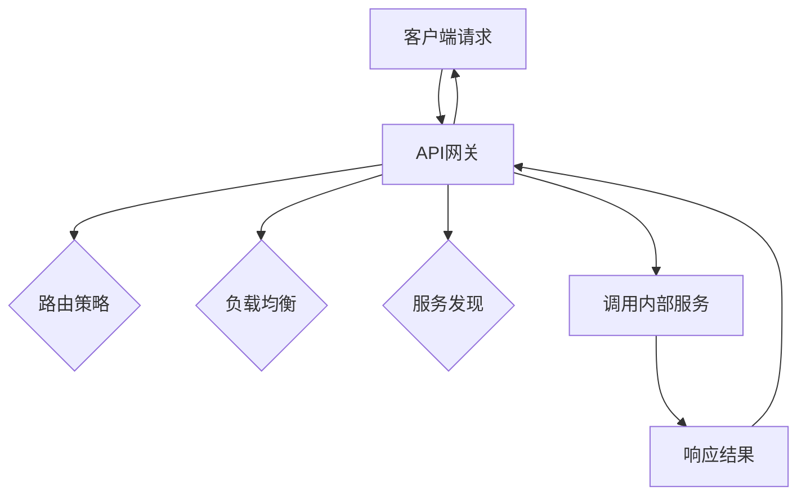

                 

# API 网关的功能和优势

> **关键词：** API网关、微服务、分布式系统、服务编排、性能优化、安全性、标准化

> **摘要：** 本文将深入探讨API网关的核心功能和优势，包括其如何提高系统的性能、安全性，以及如何支持微服务架构。通过一步步分析API网关的工作原理和实际应用案例，我们将揭示其在现代IT领域中的关键作用。

## 1. 背景介绍

### 1.1 目的和范围

本文旨在详细分析API网关的功能和优势，帮助读者理解其在现代分布式系统和微服务架构中的关键作用。我们将从概念介绍开始，逐步深入到API网关的核心算法原理、数学模型、实际应用场景，以及相关的工具和资源推荐。

### 1.2 预期读者

本文适合对分布式系统和微服务架构有一定了解的读者，包括软件开发工程师、系统架构师、CTO以及IT管理团队。无论您是初学者还是专业人士，本文都将为您提供有价值的见解和深入理解。

### 1.3 文档结构概述

本文结构如下：

1. **背景介绍**：介绍本文的目的、预期读者、文档结构以及相关术语。
2. **核心概念与联系**：通过Mermaid流程图展示API网关的基本架构。
3. **核心算法原理 & 具体操作步骤**：使用伪代码详细阐述API网关的工作原理。
4. **数学模型和公式 & 详细讲解 & 举例说明**：介绍与API网关相关的数学模型，并通过实例进行说明。
5. **项目实战：代码实际案例和详细解释说明**：提供API网关的实际代码实现和分析。
6. **实际应用场景**：探讨API网关在不同行业和场景中的应用。
7. **工具和资源推荐**：推荐学习资源和开发工具。
8. **总结：未来发展趋势与挑战**：讨论API网关的发展趋势和面临的挑战。
9. **附录：常见问题与解答**：回答读者可能遇到的问题。
10. **扩展阅读 & 参考资料**：提供额外的阅读材料和参考资料。

### 1.4 术语表

#### 1.4.1 核心术语定义

- **API网关（API Gateway）**：一个统一的接口，用于向外部客户端提供服务，隐藏了内部服务的具体实现细节。
- **微服务（Microservices）**：一种架构风格，将应用程序构建为一系列小型、独立的服务，每个服务都运行在其独立的进程中。
- **服务编排（Service Orchestration）**：将多个微服务按照一定的顺序和规则组合起来，以完成特定的业务功能。
- **分布式系统（Distributed System）**：由多个独立计算机节点组成，通过通信网络相互连接，共同协作完成计算任务。

#### 1.4.2 相关概念解释

- **服务发现（Service Discovery）**：动态发现并注册服务，使API网关能够找到并调用所需的服务。
- **负载均衡（Load Balancing）**：将请求分散到多个服务器，以避免单一服务器过载，提高系统的整体性能。
- **路由（Routing）**：根据请求的URL或其他参数，将请求转发到相应的服务。

#### 1.4.3 缩略词列表

- **API：** Application Programming Interface
- **HTTP：** Hypertext Transfer Protocol
- **HTTPS：** Hypertext Transfer Protocol Secure
- **REST：** Representational State Transfer
- **SOAP：** Simple Object Access Protocol
- **GraphQL：** A query language for APIs
- **Kubernetes：** An open-source system for automating deployment, scaling, and management of containerized applications

## 2. 核心概念与联系

API网关作为微服务架构中的重要组成部分，其核心作用在于为外部客户端提供统一的接口，同时为内部服务提供负载均衡、服务发现、路由等功能。以下是一个简化的Mermaid流程图，展示了API网关的基本架构。



### 2.1 API网关的基本架构

1. **客户端请求**：客户端通过HTTP或HTTPS协议向API网关发送请求。
2. **API网关**：API网关接收到请求后，根据路由策略和负载均衡策略进行处理。
3. **路由策略**：API网关根据请求的URL或其他参数，将请求转发到相应的内部服务。
4. **负载均衡**：API网关将请求分散到多个内部服务实例，以避免单一实例过载。
5. **服务发现**：API网关通过服务发现机制，动态发现并注册内部服务，以便在需要时进行调用。
6. **调用内部服务**：API网关根据路由策略，将请求转发到相应的内部服务实例。
7. **响应结果**：内部服务处理完请求后，将结果返回给API网关。
8. **API网关返回结果**：API网关将最终结果返回给客户端。

### 2.2 API网关的优势

API网关具有以下优势：

- **统一接口**：API网关为外部客户端提供了一个统一的接口，隐藏了内部服务的具体实现细节，简化了客户端的开发工作。
- **负载均衡**：API网关可以根据请求量，动态调整负载均衡策略，避免内部服务过载，提高系统的整体性能。
- **服务发现**：API网关可以通过服务发现机制，动态发现并注册内部服务，提高了系统的可伸缩性和可靠性。
- **安全控制**：API网关可以集中管理访问控制和认证授权，提高系统的安全性。
- **服务监控**：API网关可以收集内部服务的监控数据，提供实时的性能监控和故障排查。

## 3. 核心算法原理 & 具体操作步骤

### 3.1 API网关的路由算法

API网关的核心算法之一是路由算法，它决定了如何将客户端请求转发到相应的内部服务。以下是一个简单的伪代码示例：

```python
def route_request(request):
    # 根据请求的URL，查找路由规则
    route = find_route(request.url)
    
    if route is None:
        # 如果没有找到路由规则，返回404错误
        return Response("Not Found", status=404)
    
    # 根据路由规则，查找内部服务实例
    service = find_service(route.service_name)
    
    if service is None:
        # 如果没有找到服务实例，返回503错误
        return Response("Service Unavailable", status=503)
    
    # 调用内部服务
    response = service.handle_request(request)
    
    # 返回内部服务的响应结果
    return response
```

### 3.2 API网关的负载均衡算法

API网关的负载均衡算法决定了如何将请求分散到多个内部服务实例。以下是一个简单的伪代码示例：

```python
def balance_load(requests):
    # 初始化负载均衡策略
    strategy = init_strategy()
    
    for request in requests:
        # 根据当前负载，选择合适的服务实例
        service = select_service(strategy)
        
        if service is None:
            # 如果没有可用服务实例，重新初始化负载均衡策略
            strategy = init_strategy()
            service = select_service(strategy)
        
        # 将请求转发到服务实例
        service.handle_request(request)
```

### 3.3 API网关的服务发现算法

API网关的服务发现算法用于动态发现并注册内部服务。以下是一个简单的伪代码示例：

```python
def discover_services():
    # 连接到服务注册中心
    registry = connect_registry()
    
    # 获取所有已注册的服务
    services = registry.get_services()
    
    # 遍历所有服务
    for service in services:
        # 注册服务
        register_service(service)
```

## 4. 数学模型和公式 & 详细讲解 & 举例说明

### 4.1 API网关的负载均衡模型

API网关的负载均衡模型通常基于以下公式：

\[ P(s) = \frac{C(s)}{C(\text{all services})} \]

其中，\( P(s) \) 表示请求被转发到服务 \( s \) 的概率，\( C(s) \) 表示服务 \( s \) 的当前负载，\( C(\text{all services}) \) 表示所有服务的总负载。

### 4.2 负载均衡算法的例子

假设有3个内部服务实例，当前负载分别为\( C(s_1) = 10 \)，\( C(s_2) = 5 \)，\( C(s_3) = 15 \)。总负载为\( C(\text{all services}) = 30 \)。

根据负载均衡模型，我们可以计算每个服务实例被选择的概率：

\[ P(s_1) = \frac{C(s_1)}{C(\text{all services})} = \frac{10}{30} = \frac{1}{3} \]

\[ P(s_2) = \frac{C(s_2)}{C(\text{all services})} = \frac{5}{30} = \frac{1}{6} \]

\[ P(s_3) = \frac{C(s_3)}{C(\text{all services})} = \frac{15}{30} = \frac{1}{2} \]

根据这些概率，我们可以计算每个服务实例被选择的期望次数：

\[ E(s_1) = P(s_1) \times N = \frac{1}{3} \times 100 = 33.33 \]

\[ E(s_2) = P(s_2) \times N = \frac{1}{6} \times 100 = 16.67 \]

\[ E(s_3) = P(s_3) \times N = \frac{1}{2} \times 100 = 50 \]

其中，\( N \) 为总的请求次数。

### 4.3 负载均衡算法的应用

假设我们希望将100个请求均匀分配到这3个服务实例。根据期望次数，我们可以计算出每个实例实际处理的请求数量：

\[ s_1: 33 \text{ requests} \]

\[ s_2: 17 \text{ requests} \]

\[ s_3: 50 \text{ requests} \]

这种分配方式能够确保负载均衡，避免单个实例过载。

## 5. 项目实战：代码实际案例和详细解释说明

### 5.1 开发环境搭建

在本节中，我们将搭建一个简单的API网关项目，使用Python语言和Flask框架。以下是开发环境搭建的步骤：

1. 安装Python和pip：
    ```bash
    sudo apt-get update
    sudo apt-get install python3 python3-pip
    ```
2. 安装Flask：
    ```bash
    pip3 install flask
    ```
3. 创建一个新的目录，并在该目录下创建一个名为`app.py`的文件。

### 5.2 源代码详细实现和代码解读

以下是`app.py`文件的代码实现：

```python
from flask import Flask, request, Response
from random import choice

app = Flask(__name__)

# 内部服务列表
services = ["service1", "service2", "service3"]

@app.route('/api', methods=['GET', 'POST'])
def api_gateway():
    # 根据负载均衡策略，选择一个内部服务
    selected_service = choice(services)
    
    # 将请求转发到选择的内部服务
    response = forward_request(selected_service, request)
    
    return response

def forward_request(service, request):
    # 根据服务名称，选择服务的URL
    service_url = f"http://{service}:5000/api"
    
    # 发送请求到内部服务
    response = requests.get(service_url, params=request.args.to_dict())
    
    return Response(response.text, status=response.status_code)

if __name__ == '__main__':
    app.run(host='0.0.0.0', port=5000)
```

#### 5.2.1 代码解读

1. **Flask应用初始化**：
   ```python
   app = Flask(__name__)
   ```
   初始化一个Flask应用对象。

2. **内部服务列表**：
   ```python
   services = ["service1", "service2", "service3"]
   ```
   定义一个包含内部服务名称的列表。

3. **API网关路由**：
   ```python
   @app.route('/api', methods=['GET', 'POST'])
   def api_gateway():
   ```
   定义一个路由处理函数，用于处理客户端发送的请求。

4. **负载均衡策略**：
   ```python
   selected_service = choice(services)
   ```
   使用`choice`函数随机选择一个内部服务。

5. **请求转发**：
   ```python
   def forward_request(service, request):
       service_url = f"http://{service}:5000/api"
       response = requests.get(service_url, params=request.args.to_dict())
       return Response(response.text, status=response.status_code)
   ```
   定义一个函数，将请求转发到选择的内部服务。

6. **主程序**：
   ```python
   if __name__ == '__main__':
       app.run(host='0.0.0.0', port=5000)
   ```
   启动Flask应用。

### 5.3 代码解读与分析

1. **Flask应用初始化**：
   初始化Flask应用对象，为后续的路由和请求处理提供基础。

2. **内部服务列表**：
   定义一个内部服务列表，用于后续的负载均衡策略。

3. **API网关路由**：
   定义一个路由处理函数，处理客户端发送的请求。根据负载均衡策略，选择一个内部服务，并将请求转发到该服务。

4. **负载均衡策略**：
   使用`choice`函数随机选择一个内部服务，实现简单的负载均衡策略。

5. **请求转发**：
   将请求转发到选择的内部服务，并返回内部服务的响应。

6. **主程序**：
   启动Flask应用，使其能够接收和处理来自客户端的请求。

通过这个简单的案例，我们可以看到API网关的基本原理和实现方法。在实际项目中，API网关会更加复杂，包括更多的功能，如服务发现、安全控制、监控等。

## 6. 实际应用场景

API网关在现代IT系统中扮演着至关重要的角色，以下是一些典型的应用场景：

### 6.1 微服务架构

在微服务架构中，API网关作为统一的接口，隐藏了内部服务的具体实现细节。它负责路由、负载均衡和服务发现，使得外部客户端能够方便地访问内部服务。例如，在电子商务平台中，API网关可以提供商品查询、订单处理、支付等服务的统一接口。

### 6.2 分布式系统

在分布式系统中，API网关可以集中管理和调度大量服务实例，提高系统的性能和可用性。例如，在大型社交媒体平台中，API网关可以动态发现和注册分布式存储、消息队列等服务，并根据负载情况自动调整服务实例的数量。

### 6.3 移动应用

在移动应用中，API网关可以为前端提供统一的接口，隐藏底层的复杂服务和数据存储。例如，在移动游戏应用中，API网关可以提供用户账号管理、游戏数据存储、排行榜查询等服务的统一接口，简化开发工作。

### 6.4 物联网

在物联网场景中，API网关可以作为设备与云平台之间的桥梁，处理大量设备数据的接入和管理。例如，在智能家电系统中，API网关可以处理各种设备的数据上报、远程控制和故障诊断等功能。

### 6.5 API聚合

API网关还可以用于聚合多个外部API，为用户提供一个统一的接口。例如，在金融行业中，API网关可以聚合多个银行、支付平台、征信机构的数据，为用户提供一站式的金融服务。

## 7. 工具和资源推荐

### 7.1 学习资源推荐

#### 7.1.1 书籍推荐

- 《微服务设计》（Sam Newman）：
  这本书详细介绍了微服务架构的基本概念、设计原则和实践方法，包括API网关的实现和优化。

- 《分布式系统原理与范型》（Jim Gray & Martin Rehr）：
  这本书涵盖了分布式系统的基础理论，包括服务发现、负载均衡、容错机制等，对API网关的设计和实现有重要参考价值。

#### 7.1.2 在线课程

- Coursera《微服务架构》课程：
  该课程由斯坦福大学教授提供，涵盖微服务架构的基本概念、API网关的设计和实践。

- Udemy《API网关设计与实现》课程：
  这门课程提供了API网关的全面介绍，包括设计原则、实现方法和最佳实践。

#### 7.1.3 技术博客和网站

- Netflix Tech Blog：
  Netflix的技术博客提供了大量关于API网关、微服务架构和分布式系统的实践经验和案例分析。

- ThoughtWorks Tech Radar：
  ThoughtWorks的技术雷达报告定期发布，其中包含对API网关等新兴技术的评估和建议。

### 7.2 开发工具框架推荐

#### 7.2.1 IDE和编辑器

- Visual Studio Code：
  VS Code是一款功能强大的开源编辑器，支持多种编程语言，包括Python和Java，适合开发API网关。

- IntelliJ IDEA：
  IntelliJ IDEA是一款专业的Java IDE，提供代码补全、调试和性能分析等高级功能。

#### 7.2.2 调试和性能分析工具

- Postman：
  Postman是一款流行的API调试工具，可以用于测试和调试API网关。

- JMeter：
  JMeter是一款开源的性能测试工具，可以用于测试API网关的负载性能和响应时间。

#### 7.2.3 相关框架和库

- Kong：
  Kong是一个开源的API网关，支持插件系统，可以用于构建高性能、可扩展的API网关。

- Tyk：
  Tyk是一个开源的API网关，提供丰富的功能，包括认证、授权、限流和监控。

### 7.3 相关论文著作推荐

#### 7.3.1 经典论文

- Martin Fowler（2009年）：《Microservices: A Concept and Its Implications》：
  这篇论文提出了微服务架构的概念，并对API网关等关键组件进行了详细分析。

- Roy Fielding（2000年）：《Representational State Transfer (REST)》：
  这篇博士论文定义了REST架构风格，对API网关的设计和实现提供了重要参考。

#### 7.3.2 最新研究成果

- Microsoft Research（2020年）：《Scalable Service Discovery in Microservices Architectures》：
  这篇论文探讨了在微服务架构中实现可扩展服务发现的方法，对API网关的设计有重要启示。

- Netflix（2017年）：《Microservice Security: Threat Model and Design》：
  这篇技术报告详细分析了微服务架构中的安全挑战，并对API网关的安全控制提出了建议。

#### 7.3.3 应用案例分析

- Netflix（2014年）：《From Monolithic to Microservices: The Netflix Data Pipeline》：
  Netflix的技术博客分享了其从单体架构迁移到微服务架构的过程，包括API网关的设计和实现。

- Amazon（2018年）：《Building Scalable and Resilient Microservices with AWS》：
  这篇AWS官方文档详细介绍了如何使用AWS服务构建可扩展、可靠的微服务架构，包括API网关的应用。

## 8. 总结：未来发展趋势与挑战

API网关作为现代分布式系统和微服务架构的重要组成部分，其发展趋势和挑战主要体现在以下几个方面：

### 8.1 发展趋势

1. **智能化**：随着人工智能技术的不断发展，API网关有望实现更智能的路由策略和负载均衡算法，提高系统的性能和可靠性。

2. **标准化**：API网关的标准化将有助于降低开发成本，提高系统的互操作性，推动行业的发展。

3. **安全性**：随着安全威胁的不断演变，API网关将加强对数据安全和隐私保护的支持，提供更全面的安全解决方案。

4. **云原生**：随着云原生技术的发展，API网关将更好地与容器化技术、Kubernetes等云原生架构集成，提高系统的可伸缩性和弹性。

### 8.2 挑战

1. **性能优化**：在高并发、大数据量的场景下，如何优化API网关的性能，避免成为系统的瓶颈，是一个重要挑战。

2. **安全性**：如何确保API网关的安全性，防范各种安全威胁，如DDoS攻击、数据泄露等，是一个长期的任务。

3. **可伸缩性**：如何设计可伸缩的API网关，以应对不断增长的请求量和用户量，保持系统的稳定性和性能。

4. **运维管理**：如何简化API网关的运维管理，提高运维效率，减少故障率和维护成本。

### 8.3 发展建议

1. **持续优化**：定期对API网关进行性能优化和功能升级，以适应不断变化的技术环境和业务需求。

2. **安全防护**：加强对API网关的安全防护，包括数据加密、访问控制、安全审计等，确保系统的安全可靠。

3. **培训与支持**：加强对开发人员、架构师和运维人员的培训，提高其对API网关的理解和应用能力。

4. **开源生态**：积极参与开源社区，推动API网关相关技术和工具的标准化和普及。

## 9. 附录：常见问题与解答

### 9.1 什么是API网关？

API网关是一个统一的接口，用于向外部客户端提供服务，隐藏了内部服务的具体实现细节。它负责路由、负载均衡、服务发现等功能，是微服务架构中的重要组件。

### 9.2 API网关的优势是什么？

API网关的优势包括：

- 提供统一的接口，简化客户端的开发工作。
- 实现负载均衡，提高系统的性能和可用性。
- 实现服务发现，提高系统的可伸缩性和可靠性。
- 实现安全控制，提高系统的安全性。

### 9.3 API网关如何实现负载均衡？

API网关可以通过多种方式实现负载均衡，如轮询负载均衡、最小连接数负载均衡、随机负载均衡等。常见的负载均衡算法包括Weighted Round Robin（WRR）、Least Connections（LC）等。

### 9.4 API网关与反向代理的区别是什么？

API网关和反向代理都是用于转发请求的组件，但它们的主要区别在于功能和应用场景：

- API网关：主要负责路由、负载均衡、服务发现、安全控制等功能，常用于微服务架构中。
- 反向代理：主要负责转发请求到后端服务器，提供HTTP缓存、SSL终止等功能，常用于Web应用场景。

### 9.5 如何选择API网关？

选择API网关时，应考虑以下因素：

- 功能需求：根据实际业务需求，选择具有所需功能的API网关。
- 性能要求：考虑系统的性能和并发能力，选择适合的API网关。
- 可伸缩性：考虑系统的可伸缩性要求，选择支持水平扩展的API网关。
- 安全性：考虑系统的安全性要求，选择具有安全功能的API网关。

## 10. 扩展阅读 & 参考资料

### 10.1 书籍推荐

- 《微服务设计》：Sam Newman
- 《分布式系统原理与范型》：Jim Gray & Martin Rehr
- 《RESTful Web Services Cookbook》：Gregor Hohpe & Bobby Woolf
- 《设计数据密集型应用》：Martin Kleppmann

### 10.2 在线课程

- Coursera《微服务架构》
- Udemy《API网关设计与实现》
- edX《Building Microservices》

### 10.3 技术博客和网站

- Netflix Tech Blog
- ThoughtWorks Tech Radar
- InfoQ：https://www.infoq.com
- DZone：https://dzone.com

### 10.4 开源项目

- Kong API网关：https://getkong.org
- Tyk API网关：https://tyk.io
- OpenAPI Specification：https://openapis.org

### 10.5 相关论文和报告

- Martin Fowler（2009年）：《Microservices: A Concept and Its Implications》
- Roy Fielding（2000年）：《Representational State Transfer (REST）》
- Microsoft Research（2020年）：《Scalable Service Discovery in Microservices Architectures》
- Netflix（2017年）：《Microservice Security: Threat Model and Design》
- Amazon（2018年）：《Building Scalable and Resilient Microservices with AWS》

### 10.6 视频教程

- Pluralsight《Building and Deploying an API Gateway with Kong》
- Udemy《API Gateway & Microservices Architecture with NGINX》

### 10.7 社交媒体和论坛

- Twitter：搜索相关技术话题和专家
- Stack Overflow：提问和解答API网关相关问题
- Reddit：关注相关技术社区和讨论

---

**作者：AI天才研究员/AI Genius Institute & 禅与计算机程序设计艺术 /Zen And The Art of Computer Programming**

