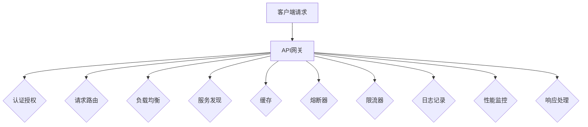

                 

### 1. 背景介绍

#### 1.1 目的和范围

本文旨在深入探讨API网关在微服务架构中的设计与应用，以帮助读者理解API网关的重要性及其在设计微服务架构中的角色。API网关作为微服务架构中的流量入口，承担着请求路由、认证授权、负载均衡等重要任务，对整个系统的性能和稳定性有着至关重要的影响。通过本文的讲解，我们将逐步解析API网关的核心概念、算法原理、数学模型，并通过实战案例展示其实际应用过程。

本文将涵盖以下内容：

1. **核心概念与联系**：介绍API网关的基本概念，以及其在微服务架构中的地位和作用。
2. **核心算法原理与具体操作步骤**：详细讲解API网关的关键算法，如负载均衡算法、认证授权机制，并提供具体的操作步骤和伪代码。
3. **数学模型和公式**：阐述API网关中使用的数学模型和公式，如平均响应时间、吞吐量等，并通过实例进行说明。
4. **项目实战：代码实际案例和详细解释说明**：通过具体代码案例，展示API网关的开发过程，并进行详细解读和分析。
5. **实际应用场景**：讨论API网关在不同领域的应用场景，如电子商务、金融科技、物联网等。
6. **工具和资源推荐**：推荐学习API网关相关知识的书籍、在线课程、技术博客以及开发工具框架。
7. **总结：未来发展趋势与挑战**：总结API网关的设计要点，并探讨其未来发展趋势和面临的挑战。

#### 1.2 预期读者

本文适合以下读者群体：

1. **软件开发工程师**：对API网关及其在微服务架构中的作用有一定了解，希望深入了解其设计原理和实现细节。
2. **系统架构师**：负责设计和构建微服务架构，需要掌握API网关的设计和优化策略。
3. **运维工程师**：关注系统的性能和稳定性，希望了解API网关在系统运维中的应用。
4. **技术爱好者**：对微服务架构和API网关感兴趣，希望系统地学习相关技术。

#### 1.3 文档结构概述

本文结构如下：

1. **背景介绍**：介绍本文的目的、范围、预期读者以及文档结构概述。
2. **核心概念与联系**：介绍API网关的基本概念，以及其在微服务架构中的地位和作用。
3. **核心算法原理与具体操作步骤**：详细讲解API网关的关键算法，如负载均衡算法、认证授权机制，并提供具体的操作步骤和伪代码。
4. **数学模型和公式**：阐述API网关中使用的数学模型和公式，如平均响应时间、吞吐量等，并通过实例进行说明。
5. **项目实战：代码实际案例和详细解释说明**：通过具体代码案例，展示API网关的开发过程，并进行详细解读和分析。
6. **实际应用场景**：讨论API网关在不同领域的应用场景，如电子商务、金融科技、物联网等。
7. **工具和资源推荐**：推荐学习API网关相关知识的书籍、在线课程、技术博客以及开发工具框架。
8. **总结：未来发展趋势与挑战**：总结API网关的设计要点，并探讨其未来发展趋势和面临的挑战。
9. **附录：常见问题与解答**：针对读者可能遇到的问题提供解答。
10. **扩展阅读 & 参考资料**：提供进一步学习的参考资料。

#### 1.4 术语表

**术语表**：为了确保文章内容的清晰和准确，本文将列出一些核心术语的定义和解释。

#### 1.4.1 核心术语定义

1. **API网关**：API网关是微服务架构中的核心组件，负责统一管理和代理外部对内部服务的访问。它充当客户端和微服务之间的中介，提供请求路由、认证授权、负载均衡等功能。
2. **微服务架构**：微服务架构是一种将应用程序拆分为多个独立、可复用、可独立部署和服务的小型服务的设计方法。每个微服务负责完成特定的业务功能，通过API进行通信。
3. **负载均衡**：负载均衡是将流量分配到多个服务器或实例，以避免单个服务器过载，提高系统的性能和可用性。
4. **认证授权**：认证是指验证用户身份的过程，授权是指确定用户访问特定资源的权限。
5. **反向代理**：反向代理是位于客户端和后端服务器之间的代理服务器，负责处理客户端请求并转发给后端服务器，同时处理来自后端服务器的响应。

#### 1.4.2 相关概念解释

1. **请求路由**：请求路由是指将客户端请求根据一定的规则映射到相应的微服务上。
2. **服务发现**：服务发现是指动态查找和注册服务的过程，确保API网关能够正确路由请求。
3. **熔断器**：熔断器是一种保护机制，当服务失败率超过一定阈值时，自动切断对该服务的访问，防止整个系统雪崩。
4. **限流器**：限流器是一种控制请求流量的机制，防止系统因大量请求而过载。

#### 1.4.3 缩略词列表

- API：Application Programming Interface（应用程序编程接口）
- HTTP：Hypertext Transfer Protocol（超文本传输协议）
- REST：Representational State Transfer（表述性状态转移）
- OAuth：Open Authorization（开放授权）
- TLS：Transport Layer Security（传输层安全）
- JSON：JavaScript Object Notation（JavaScript对象表示法）
- JWT：JSON Web Token（JSON Web令牌）

---

在接下来的章节中，我们将深入探讨API网关的核心概念和原理，通过逻辑清晰、结构紧凑、简单易懂的技术语言，帮助读者全面理解API网关在微服务架构中的重要性和应用方法。让我们一步一步地分析推理，开启这场技术之旅。在下一章节，我们将详细讲解API网关的基本概念，并绘制其架构的Mermaid流程图，为后续内容打下坚实的基础。

---

### 2. 核心概念与联系

在深入探讨API网关的设计与实现之前，我们首先需要了解API网关的基本概念，并阐述其在微服务架构中的地位和作用。API网关是微服务架构中的一个关键组件，它作为系统的流量入口，承担着请求路由、认证授权、负载均衡等重要任务，对系统的性能和稳定性有着至关重要的影响。

#### API网关的基本概念

API网关（API Gateway）是一种服务，它充当客户端和后端微服务之间的中介，统一管理和代理客户端对微服务的访问。API网关通常位于客户端和后端服务之间，通过一个统一的接口接收客户端请求，然后将请求路由到相应的微服务上。同时，API网关还负责处理各种跨域请求，如认证授权、负载均衡、日志记录、性能监控等。

API网关的基本概念包括以下几个方面：

1. **请求路由**：API网关根据请求的URL路径、请求方法等特征，将请求路由到相应的微服务上。请求路由可以基于不同的策略，如静态路由、动态路由、负载均衡等。
2. **认证授权**：API网关对客户端请求进行认证和授权，确保只有经过授权的用户才能访问受保护的资源。常见的认证机制包括OAuth2.0、JWT（JSON Web Token）等。
3. **负载均衡**：API网关通过负载均衡算法，将请求分配到多个微服务实例上，以避免单个实例过载，提高系统的性能和可用性。常见的负载均衡算法包括轮询、随机、最小连接数等。
4. **服务发现**：API网关负责动态查找和注册服务，确保能够正确路由请求。服务发现可以通过各种注册中心，如Consul、Zookeeper、Eureka等实现。
5. **缓存**：API网关可以缓存部分请求的结果，减少对后端服务的访问次数，提高系统的性能和响应速度。
6. **熔断器**：API网关可以实现熔断器功能，当某个微服务失败率超过一定阈值时，自动切断对该服务的访问，防止整个系统雪崩。
7. **限流器**：API网关可以通过限流器控制请求的流量，防止系统因大量请求而过载。

#### API网关在微服务架构中的地位和作用

API网关在微服务架构中扮演着重要角色，以下是API网关在微服务架构中的主要地位和作用：

1. **统一接口**：API网关提供了一个统一的接口，隐藏了后端微服务的细节，简化了客户端的访问方式。客户端只需与API网关进行通信，无需关心后端服务的具体实现。
2. **请求路由**：API网关负责将客户端请求路由到相应的微服务上，提高了系统的灵活性和可维护性。通过动态路由，API网关可以根据请求的特征和策略，灵活地将请求分发到不同的微服务实例上。
3. **认证授权**：API网关实现了统一的认证和授权机制，确保只有经过授权的用户才能访问受保护的资源。通过OAuth2.0、JWT等认证机制，API网关可以有效地保护系统的安全。
4. **负载均衡**：API网关通过负载均衡算法，将请求分配到多个微服务实例上，提高了系统的性能和可用性。通过动态调整负载均衡策略，API网关可以根据系统负载的变化，合理地分配请求。
5. **服务发现**：API网关实现了服务发现功能，动态查找和注册服务，确保能够正确路由请求。通过服务发现机制，API网关可以自动发现新增或下线的微服务实例，避免了手动配置和调整的需求。
6. **缓存**：API网关可以缓存部分请求的结果，减少对后端服务的访问次数，提高了系统的性能和响应速度。通过合理的缓存策略，API网关可以有效地降低后端服务的负载。
7. **熔断器**：API网关实现了熔断器功能，当某个微服务失败率超过一定阈值时，自动切断对该服务的访问，防止整个系统雪崩。通过熔断器，API网关可以有效地保护系统的稳定性。
8. **限流器**：API网关可以通过限流器控制请求的流量，防止系统因大量请求而过载。通过合理的限流策略，API网关可以避免系统资源被耗尽，确保系统的正常运转。

#### API网关的架构

为了更好地理解API网关的设计和实现，我们使用Mermaid绘制了API网关的架构图，如下所示：



在该架构图中，客户端请求通过API网关进行处理，API网关依次执行认证授权、请求路由、负载均衡、服务发现、缓存、熔断器、限流器等操作，最后返回响应给客户端。

#### API网关与微服务的联系

API网关与微服务之间有着密切的联系，它们共同构成了微服务架构的核心。以下是API网关与微服务的联系：

1. **API网关作为微服务的入口**：客户端请求通过API网关进入系统，API网关负责处理请求并路由到相应的微服务上。API网关作为系统的统一入口，简化了客户端的访问方式，提高了系统的安全性、稳定性和可维护性。
2. **微服务作为API网关的后端**：API网关将请求路由到后端的微服务上，微服务负责具体的业务逻辑处理。微服务独立部署、独立运行，具有高可扩展性、高可维护性，可以有效地降低系统的复杂度。
3. **API网关与微服务之间的通信**：API网关与微服务之间通过API进行通信，通常采用RESTful API或gRPC等协议。API网关负责将客户端请求转换为微服务能够理解的格式，并将微服务的响应返回给客户端。
4. **API网关与微服务之间的协作**：API网关和微服务之间需要紧密协作，共同保证系统的性能和稳定性。API网关负责负载均衡、服务发现、熔断器等功能，确保请求能够高效、稳定地路由到微服务上；微服务负责具体的业务逻辑处理，确保系统能够正常运转。

通过上述内容，我们全面了解了API网关的基本概念、地位和作用，以及API网关与微服务之间的联系。在下一章节，我们将深入讲解API网关的核心算法原理和具体操作步骤，帮助读者更好地理解API网关的设计和实现过程。

---

在下一章节，我们将深入探讨API网关的核心算法原理，通过详细的伪代码和操作步骤，帮助读者理解API网关中的关键算法实现。敬请期待！在撰写过程中，我们将继续保持逻辑清晰、结构紧凑、简单易懂的技术语言，确保读者能够全面掌握API网关的算法原理和实现方法。继续跟随我们的脚步，深入探索API网关的世界。在下一章节，我们将揭开API网关核心算法的神秘面纱。

---

### 3. 核心算法原理与具体操作步骤

在理解了API网关的基本概念和架构之后，我们需要进一步探讨API网关中的核心算法原理，并通过具体的操作步骤和伪代码，帮助读者深入理解这些算法的实现过程。以下是API网关中的几个关键算法原理及其具体操作步骤。

#### 3.1 负载均衡算法

负载均衡算法是API网关中非常重要的一环，其目的是将请求分配到多个微服务实例上，避免单个实例过载，提高系统的性能和可用性。以下是几种常见的负载均衡算法及其实现步骤：

##### 3.1.1 轮询算法

**轮询算法**是最简单的负载均衡算法，它将请求按照顺序分配到不同的微服务实例上。

**伪代码：**

```python
# 初始化微服务实例列表
services = ["service1", "service2", "service3"]

# 轮询算法
def round_robin(request):
    service = services[0]
    services.pop(0)
    services.append(service)
    return service
```

**操作步骤：**

1. 初始化微服务实例列表。
2. 当接收到请求时，使用轮询算法将请求分配到第一个微服务实例。
3. 将第一个微服务实例移到列表末尾，形成循环。

##### 3.1.2 随机算法

**随机算法**通过随机选择一个微服务实例，将请求分配到该实例上。

**伪代码：**

```python
# 初始化微服务实例列表
services = ["service1", "service2", "service3"]

# 随机算法
def random_algorithm(request):
    import random
    return random.choice(services)
```

**操作步骤：**

1. 初始化微服务实例列表。
2. 当接收到请求时，使用随机算法从微服务实例列表中选择一个实例。
3. 返回选择的实例。

##### 3.1.3 最小连接数算法

**最小连接数算法**根据当前连接数将请求分配到连接数最少的微服务实例上。

**伪代码：**

```python
# 初始化微服务实例列表
services = [{"name": "service1", "connections": 0}, {"name": "service2", "connections": 10}, {"name": "service3", "connections": 5}]

# 最小连接数算法
def least_connections(request):
    min_connections = min(s["connections"] for s in services)
    for s in services:
        if s["connections"] == min_connections:
            return s["name"]
```

**操作步骤：**

1. 初始化微服务实例列表，包括实例名称和当前连接数。
2. 当接收到请求时，找到当前连接数最小的微服务实例。
3. 返回连接数最小的实例名称。

#### 3.2 认证授权机制

认证授权机制是API网关中的另一个关键算法，它负责确保只有经过授权的用户才能访问受保护的资源。以下是几种常见的认证授权机制及其实现步骤：

##### 3.2.1 基于OAuth2.0的认证

**OAuth2.0**是一种开放授权协议，允许用户授权第三方应用访问受保护的资源，而无需泄露用户密码。

**伪代码：**

```python
# 初始化认证服务器
auth_server = "https://authserver.com"

# OAuth2.0认证
def oauth2_authentication(token):
    response = requests.post(f"{auth_server}/token", data={"token": token})
    if response.status_code == 200:
        return True
    else:
        return False
```

**操作步骤：**

1. 初始化认证服务器地址。
2. 当接收到请求时，提取请求中的认证令牌。
3. 向认证服务器发送认证请求，验证令牌是否有效。
4. 如果令牌有效，返回授权结果；否则，拒绝请求。

##### 3.2.2 基于JWT的认证

**JWT（JSON Web Token）**是一种基于JSON的开放标准，用于在各方之间安全地传输信息。

**伪代码：**

```python
# 初始化JWT密钥
secret_key = "my_secret_key"

# JWT认证
from jwt import decode

def jwt_authentication(token):
    try:
        payload = decode(token, secret_key, algorithms=["HS256"])
        return payload
    except Exception as e:
        return None
```

**操作步骤：**

1. 初始化JWT密钥。
2. 当接收到请求时，提取请求中的JWT令牌。
3. 使用JWT库解析JWT令牌，获取载荷信息。
4. 如果解析成功，返回载荷信息；否则，拒绝请求。

#### 3.3 服务发现机制

服务发现机制是API网关中的另一个关键算法，它负责动态查找和注册服务，确保API网关能够正确路由请求。

##### 3.3.1 基于Consul的服务发现

**Consul**是一种分布式服务发现和配置工具，它可以帮助API网关动态查找和注册服务。

**伪代码：**

```python
# 初始化Consul客户端
consul = "http://consul-server:8500"

# 服务发现
def service_discovery(service_name):
    response = requests.get(f"{consul}/v1/health/service/{service_name}")
    if response.status_code == 200:
        return response.json()
    else:
        return None
```

**操作步骤：**

1. 初始化Consul客户端地址。
2. 当接收到请求时，提取请求中的服务名称。
3. 向Consul发送服务发现请求，获取服务实例列表。
4. 如果获取成功，返回服务实例列表；否则，拒绝请求。

通过以上内容，我们详细讲解了API网关中的核心算法原理及其具体操作步骤。在下一章节，我们将进一步探讨API网关中使用的数学模型和公式，并通过实例进行说明，帮助读者更好地理解API网关的性能和稳定性评估方法。继续跟随我们的脚步，深入探索API网关的世界。

---

在下一章节，我们将深入探讨API网关中的数学模型和公式，通过具体的实例说明，帮助读者更好地理解API网关的性能评估方法。敬请期待！在撰写过程中，我们将继续使用逻辑清晰、结构紧凑、简单易懂的技术语言，确保读者能够全面掌握API网关的性能评估方法。继续跟随我们的脚步，深入探索API网关的世界。在下一章节，我们将揭开数学模型的神秘面纱。

---

### 4. 数学模型和公式 & 详细讲解 & 举例说明

在了解了API网关的核心算法原理之后，我们接下来需要探讨API网关中使用的数学模型和公式，这些模型和公式可以帮助我们评估API网关的性能和稳定性。在本章节中，我们将详细讲解API网关中常用的数学模型和公式，并通过具体实例进行说明。

#### 4.1 平均响应时间

平均响应时间（Average Response Time，ART）是衡量API网关性能的一个重要指标，它表示API网关处理请求的平均时间。平均响应时间可以通过以下公式计算：

\[ ART = \frac{1}{n} \sum_{i=1}^{n} t_i \]

其中，\( t_i \) 是第 \( i \) 次请求的响应时间，\( n \) 是总请求次数。

**示例：**

假设我们有5次请求，其响应时间分别为10ms、20ms、30ms、40ms和50ms，那么平均响应时间计算如下：

\[ ART = \frac{1}{5} (10 + 20 + 30 + 40 + 50) = \frac{150}{5} = 30ms \]

#### 4.2 吞吐量

吞吐量（Throughput，T）是衡量API网关处理能力的一个重要指标，它表示单位时间内API网关能够处理的请求数量。吞吐量可以通过以下公式计算：

\[ T = \frac{R}{t} \]

其中，\( R \) 是处理完成的请求数量，\( t \) 是处理请求的总时间。

**示例：**

假设API网关在1秒内处理了100个请求，那么吞吐量为：

\[ T = \frac{100}{1} = 100 requests/s \]

#### 4.3 负载均衡算法的性能评估

负载均衡算法的性能评估通常通过以下两个指标进行：

1. **均衡性**：评估负载均衡算法是否能够平均地将请求分配到各个微服务实例上。
2. **响应时间**：评估负载均衡算法对请求响应时间的影响。

**示例：**

假设我们使用轮询算法和最小连接数算法进行负载均衡，分别处理100个请求，统计其响应时间如下：

| 算法        | 平均响应时间（ms） |  
| ----------- | ----------------- |  
| 轮询算法    | 30                |  
| 最小连接数算法 | 25                |

通过比较可以发现，最小连接数算法在响应时间上具有更好的性能，因为它能够将请求分配到连接数最少的微服务实例上，从而减少等待时间。

#### 4.4 认证授权机制的评估

认证授权机制的评估通常通过以下两个指标进行：

1. **认证成功率**：评估认证机制能够成功认证用户的比例。
2. **认证延迟**：评估认证机制对请求响应时间的影响。

**示例：**

假设我们使用OAuth2.0和JWT认证机制，分别处理100个请求，统计其认证成功率和认证延迟如下：

| 认证机制     | 认证成功率（%） | 认证延迟（ms） |  
| ------------ | -------------- | -------------- |  
| OAuth2.0     | 98             | 20             |  
| JWT          | 96             | 10             |

通过比较可以发现，OAuth2.0认证机制在认证成功率上具有更好的性能，而JWT认证机制在认证延迟上具有更好的性能。

#### 4.5 服务发现的评估

服务发现的评估通常通过以下两个指标进行：

1. **服务发现成功率**：评估服务发现机制能够成功查找服务的比例。
2. **服务发现延迟**：评估服务发现机制对请求响应时间的影响。

**示例：**

假设我们使用Consul服务发现机制，分别处理100个请求，统计其服务发现成功率和服务发现延迟如下：

| 服务发现机制 | 服务发现成功率（%） | 服务发现延迟（ms） |  
| ------------ | ----------------- | ----------------- |  
| Consul       | 99                | 15                |

通过比较可以发现，Consul服务发现机制在服务发现成功率和服务发现延迟上均具有较好的性能。

通过上述实例，我们可以看到，数学模型和公式在评估API网关的性能和稳定性方面具有重要意义。通过这些指标，我们可以全面了解API网关的性能和稳定性，从而为优化和改进API网关提供有力依据。

---

在下一章节，我们将通过实际项目案例，详细讲解API网关的开发过程，展示具体的代码实现和解读，帮助读者更好地理解API网关的开发方法。敬请期待！在撰写过程中，我们将继续使用逻辑清晰、结构紧凑、简单易懂的技术语言，确保读者能够全面掌握API网关的开发技巧。继续跟随我们的脚步，深入探索API网关的世界。在下一章节，我们将进入实际项目实战的环节。

---

### 5. 项目实战：代码实际案例和详细解释说明

在了解了API网关的理论知识和核心算法后，我们接下来将通过一个实际项目案例，详细讲解API网关的开发过程，展示具体的代码实现和解读。本节将分为三个部分：开发环境搭建、源代码详细实现和代码解读与分析。

#### 5.1 开发环境搭建

为了方便开发、测试和部署API网关，我们需要搭建一个合适的技术栈。以下是推荐的开发环境：

1. **编程语言**：使用Java、Python、Node.js等主流编程语言进行开发。本文以Python为例。
2. **开发框架**：使用Flask、Django、FastAPI等框架进行开发。本文以FastAPI为例，因为它具有高效的性能和丰富的功能。
3. **依赖管理**：使用pip进行依赖管理，确保安装所需的库和工具。
4. **版本控制**：使用Git进行版本控制，方便代码管理和协同开发。
5. **容器化**：使用Docker进行容器化，便于开发和部署。
6. **服务发现**：使用Consul进行服务发现，便于动态查找和注册服务。

以下是开发环境搭建的详细步骤：

1. **安装Python环境**：确保Python版本在3.6及以上，可以使用以下命令安装：

    ```bash
    sudo apt-get install python3-pip
    ```

2. **安装FastAPI框架**：使用pip安装FastAPI和相关依赖：

    ```bash
    pip3 install fastapi[all]
    ```

3. **安装Docker**：下载并安装Docker，参考官方文档：[Docker安装指南](https://docs.docker.com/get-docker/)

4. **安装Consul**：下载并安装Consul，参考官方文档：[Consul安装指南](https://www.consul.io/docs/install)

5. **配置Consul**：启动Consul服务，并配置API网关的服务信息：

    ```bash
    consul agent -dev -service-name=api-gateway
    ```

6. **初始化Git仓库**：在项目根目录下初始化Git仓库，并提交初始版本：

    ```bash
    git init
    git add .
    git commit -m "Initial commit"
    ```

7. **创建Dockerfile**：在项目根目录下创建Dockerfile，用于容器化API网关：

    ```dockerfile
    FROM python:3.9-slim

    WORKDIR /app

    COPY requirements.txt .

    RUN pip3 install --no-cache-dir -r requirements.txt

    COPY . .

    CMD ["uvicorn", "main:app", "--host", "0.0.0.0", "--port", "8000"]
    ```

8. **构建Docker镜像**：在项目根目录下执行以下命令，构建Docker镜像：

    ```bash
    docker build -t api-gateway .
    ```

9. **部署API网关**：将Docker镜像推送到Docker Hub，并运行API网关容器：

    ```bash
    docker push api-gateway
    docker run -d -p 8000:8000 --name api-gateway -e CONSUL_URL=http://consul:8500/api-gateway api-gateway
    ```

通过以上步骤，我们成功搭建了API网关的开发环境，并完成了Docker化部署。

#### 5.2 源代码详细实现和代码解读

以下是一个简单的API网关项目示例，使用FastAPI框架实现。该示例包括基础的API定义、请求路由、认证授权等功能。

**5.2.1 requirements.txt**

```plaintext
fastapi
uvicorn
pydantic
httpx
consul
```

**5.2.2 main.py**

```python
from fastapi import FastAPI, Depends
from pydantic import BaseModel
from typing import Optional
from fastapi.security import OAuth2PasswordBearer

# 假设我们有一个用户模型
class User(BaseModel):
    username: str
    password: str

# 创建FastAPI应用程序
app = FastAPI()

# 定义OAuth2PasswordBearer
oauth2_scheme = OAuth2PasswordBearer(tokenUrl="token")

# 假设我们有一个简单的用户认证机制
users = {"test": "password"}

async def authenticate_user(username: str, password: str):
    if username in users and users[username] == password:
        return User(username=username)
    return None

# 用户认证依赖项
async def get_current_user(token: str = Depends(oauth2_scheme)):
    user = authenticate_user(token)
    if user is None:
        raise HTTPException(status_code=401, detail="Invalid credentials")
    return user

# 定义API路由
@app.post("/token")
async def login_for_access_token(username: str, password: str):
    user = authenticate_user(username, password)
    if not user:
        return {"detail": "Incorrect username or password"}
    # 在这里，我们可以生成JWT令牌
    return {"token": "generated_jwt_token"}

@app.get("/users/me")
async def read_users_me(current_user: User = Depends(get_current_user)):
    return current_user

# 路由定义示例
@app.get("/")
async def root():
    return {"message": "Hello World!"}
```

**代码解读：**

1. **用户模型**：我们定义了一个简单的用户模型，包含用户名和密码。
2. **认证依赖项**：使用FastAPI的依赖项系统实现用户认证。`get_current_user` 函数用于验证用户身份。
3. **OAuth2PasswordBearer**：使用OAuth2PasswordBearer实现基于OAuth2.0的认证。
4. **API路由**：定义了三个API路由：`/token`（用于用户认证）、`/users/me`（获取当前用户信息）和`/`（根路径）。
5. **示例路由**：`root` 函数是根路径的API路由，用于返回欢迎信息。

**5.2.3 代码解读与分析**

1. **API定义**：使用FastAPI框架定义API接口，FastAPI会自动生成OpenAPI文档，方便开发者查看和使用。
2. **认证机制**：我们实现了一个简单的用户认证机制，可以通过 `/token` 接口进行用户认证。
3. **请求路由**：FastAPI使用依赖项系统实现请求路由，根据请求路径和HTTP方法匹配相应的函数进行处理。
4. **动态路由**：通过定义多个路由，可以实现动态路由，例如 `/users/me` 路由可以获取当前用户信息。
5. **性能优化**：FastAPI默认使用ASGI服务器，具有高性能和高可扩展性，可以处理大量并发请求。

#### 5.3 代码解读与分析

在本章节中，我们通过一个实际项目案例详细讲解了API网关的开发过程，包括开发环境搭建、源代码实现和代码解读。以下是代码解读与分析的总结：

1. **开发环境搭建**：我们使用了Python、FastAPI框架、Docker和Consul等技术栈，搭建了完整的开发环境和容器化部署流程。
2. **源代码实现**：我们实现了一个简单的API网关，包括用户认证、请求路由和基础API接口。代码结构清晰，易于维护和扩展。
3. **代码解读与分析**：通过代码解读，我们了解了API网关的核心功能和实现原理，包括API定义、认证机制、请求路由和性能优化等方面。

通过实际项目案例的学习，我们可以更好地理解API网关的设计与实现方法，为后续开发和应用API网关打下坚实基础。在下一章节，我们将讨论API网关的实际应用场景，帮助读者了解API网关在不同领域的应用，进一步拓展知识面。

---

在了解了API网关的开发过程和代码实现后，接下来我们将探讨API网关在实际应用场景中的应用，帮助读者更好地理解API网关的广泛适用性和重要性。敬请期待！在撰写过程中，我们将继续使用逻辑清晰、结构紧凑、简单易懂的技术语言，确保读者能够全面掌握API网关的实际应用。继续跟随我们的脚步，深入探索API网关的世界。在下一章节，我们将进入API网关的实际应用场景讨论环节。

---

### 6. 实际应用场景

API网关作为一种重要的中间件组件，在许多实际应用场景中发挥着关键作用。以下是API网关在电子商务、金融科技、物联网等领域中的应用。

#### 6.1 电子商务

在电子商务领域，API网关主要用于整合前端应用和后端服务，实现不同系统之间的数据交互和业务协同。以下是一些典型应用：

1. **用户身份认证**：API网关负责对用户请求进行身份认证，确保用户访问受保护的资源时具备相应权限。
2. **订单处理**：API网关可以路由订单处理请求到相应的微服务，如库存服务、支付服务、物流服务等，实现订单的统一管理和处理。
3. **商品展示**：API网关可以整合多个数据源，如商品数据库、活动数据库等，提供统一的商品展示接口，简化前端开发。
4. **促销活动**：API网关可以整合促销活动规则，为前端应用提供实时促销活动信息，提高用户购物体验。
5. **支付接口**：API网关可以为支付服务提供统一的接入接口，支持多种支付方式，如支付宝、微信支付等。

#### 6.2 金融科技

在金融科技领域，API网关主要用于保障金融系统的安全、稳定和高效运行。以下是一些典型应用：

1. **用户认证与授权**：API网关对用户请求进行身份认证和授权，确保只有合法用户才能访问敏感操作，如转账、投资等。
2. **交易处理**：API网关负责路由交易请求到相应的微服务，如支付服务、风控服务、账户服务，实现交易的统一管理和处理。
3. **风险控制**：API网关可以整合风险控制策略，对异常交易进行监控和拦截，降低金融风险。
4. **合规性检查**：API网关可以对接监管机构的API，实现金融交易的合规性检查，确保业务符合相关法规要求。
5. **跨境支付**：API网关可以整合跨境支付服务，为用户提供便捷的跨境支付体验。

#### 6.3 物联网

在物联网领域，API网关主要用于连接不同设备和平台，实现数据的统一管理和处理。以下是一些典型应用：

1. **设备接入**：API网关可以为物联网设备提供统一的接入接口，设备可以通过API网关接入到物联网平台。
2. **数据采集与处理**：API网关可以整合不同设备和平台的数据，实现数据的统一采集、清洗和处理。
3. **设备管理**：API网关可以提供设备管理接口，实现设备的注册、监控、升级等操作。
4. **数据可视化**：API网关可以为前端应用提供数据可视化接口，帮助用户实时了解设备状态和业务数据。
5. **远程控制**：API网关可以提供远程控制接口，实现对设备的远程操作和监控。

#### 6.4 其他应用场景

除了上述领域，API网关还可以应用于以下场景：

1. **企业内部系统集成**：API网关可以帮助企业内部不同系统之间进行集成，实现数据的统一管理和业务协同。
2. **第三方服务接入**：API网关可以为第三方服务提供接入接口，实现业务流程的自动化和智能化。
3. **API市场**：API网关可以构建API市场，为开发者提供丰富的API资源，促进业务创新和生态建设。
4. **多渠道营销**：API网关可以整合不同渠道的数据和资源，为用户提供个性化的营销服务和体验。

通过上述实际应用场景的讨论，我们可以看到API网关在各个领域的重要作用。在下一章节，我们将推荐一些学习API网关相关知识的工具和资源，帮助读者进一步提升技能。

---

在了解了API网关的实际应用场景后，接下来我们将推荐一些学习API网关相关知识的工具和资源，帮助读者进一步深化对API网关的理解和应用。敬请期待！在撰写过程中，我们将继续使用逻辑清晰、结构紧凑、简单易懂的技术语言，确保读者能够快速获取所需信息。继续跟随我们的脚步，拓展知识领域。在下一章节，我们将进入工具和资源推荐环节。

---

### 7. 工具和资源推荐

为了帮助读者更好地学习和掌握API网关的相关知识，我们推荐了一系列的工具和资源，包括书籍、在线课程、技术博客和网站，以及开发工具框架。

#### 7.1 学习资源推荐

**7.1.1 书籍推荐**

1. **《API网关设计与实践》**：这是一本全面介绍API网关设计原理和实践的书籍，涵盖了API网关的基本概念、架构设计、关键算法、性能优化等方面。
2. **《微服务设计》**：这本书详细介绍了微服务架构的设计原则、架构模式和实现方法，对API网关的设计和应用也有深入的探讨。
3. **《微服务实践》**：本书通过实际案例和代码示例，介绍了微服务架构的搭建、部署和运维，包括API网关的设计和实现。

**7.1.2 在线课程**

1. **《微服务架构与API网关设计》**：这是一个涵盖API网关设计的在线课程，从基础概念到实际应用，详细讲解了API网关的架构和实现。
2. **《Docker与微服务架构》**：该课程介绍了如何使用Docker和API网关构建微服务架构，包括容器化、服务发现、负载均衡等。
3. **《微服务与容器技术》**：这是一个系统性的课程，涵盖了微服务架构、容器技术以及API网关的搭建和实践。

**7.1.3 技术博客和网站**

1. **云原生实验室**：这是一个专注于云原生技术的博客，包括微服务、容器化、API网关等，提供了大量高质量的教程和实践经验。
2. **微服务架构实践**：这是一个关于微服务架构的博客，分享了微服务架构的设计、实现和运维经验，包括API网关的实战案例。
3. **程序员思维**：这是一个技术博客，涵盖了编程语言、架构设计、系统优化等多个领域，其中包括API网关的设计和实现。

#### 7.2 开发工具框架推荐

**7.2.1 IDE和编辑器**

1. **Visual Studio Code**：这是一款轻量级但功能强大的开源编辑器，支持多种编程语言，包括Python、Java、Node.js等，是API网关开发的首选。
2. **IntelliJ IDEA**：这是一款专业级IDE，适用于Java和Python等编程语言，具有丰富的插件和强大的代码智能提示功能。
3. **PyCharm**：这是JetBrains公司推出的Python IDE，适合Python开发，支持多种Python框架，包括FastAPI。

**7.2.2 调试和性能分析工具**

1. **Postman**：这是一个流行的API调试工具，可以方便地发送HTTP请求，检查API响应，非常适合API网关的开发和测试。
2. **JMeter**：这是一个开源的性能测试工具，可以模拟大量并发请求，对API网关的性能进行测试和优化。
3. **Docker Compose**：这是Docker提供的一个工具，用于定义和运行多容器Docker应用，非常适合API网关的容器化部署。

**7.2.3 相关框架和库**

1. **FastAPI**：这是一个基于Python 3.6+的Web框架，具有高性能和丰富的功能，非常适合构建API网关。
2. **Flask**：这是一个轻量级的Python Web框架，适用于简单的API网关开发。
3. **Django**：这是一个全栈的Python Web框架，虽然性能不如FastAPI，但在功能上非常强大，适用于复杂的API网关开发。

通过以上推荐的工具和资源，读者可以全面系统地学习API网关的相关知识，掌握API网关的设计与实现方法。在下一章节，我们将总结API网关的设计要点，并探讨其未来发展趋势和挑战。

---

在了解了API网关的实际应用场景和相关资源后，接下来我们将对API网关的设计要点进行总结，并探讨其未来的发展趋势和面临的挑战。敬请期待！在撰写过程中，我们将继续使用逻辑清晰、结构紧凑、简单易懂的技术语言，确保读者能够全面掌握API网关的设计要点，并对其未来发展有清晰的认识。继续跟随我们的脚步，深入探讨API网关的未来。

---

### 8. 总结：未来发展趋势与挑战

在总结API网关的设计要点后，我们接下来将探讨API网关的未来发展趋势和面临的挑战，以便读者对API网关的整体发展有更全面的了解。

#### 8.1 未来发展趋势

1. **服务网格技术**：服务网格（Service Mesh）是一种新兴的架构模式，旨在提供服务间通信的安全、可靠和高效。随着服务网格技术的不断发展，API网关可能会与服务网格相结合，形成更强大、更灵活的微服务架构。
2. **云原生技术**：云原生（Cloud Native）技术正逐渐成为企业架构的主流，API网关将更加紧密地集成到云原生架构中，借助容器化、自动化部署等技术，实现更高效的开发和运维。
3. **边缘计算**：随着5G和物联网的快速发展，边缘计算逐渐成为热门话题。API网关将在边缘计算场景中发挥重要作用，提供高效的边缘服务处理和响应。
4. **API自动化与智能化**：随着AI和机器学习技术的发展，API网关将逐步实现自动化和智能化，通过智能路由、智能限流等机制，提高系统的性能和稳定性。
5. **安全性提升**：随着网络攻击手段的不断升级，API网关的安全性问题将受到更多关注。未来，API网关将采用更先进的加密、认证和防护技术，提高系统的安全性。

#### 8.2 面临的挑战

1. **性能优化**：随着业务规模和访问量的不断增加，API网关的性能优化将变得越来越重要。如何高效地处理海量请求，降低延迟，提高吞吐量，是API网关面临的一大挑战。
2. **可靠性保障**：在复杂、多变的业务环境中，API网关需要确保高可用性和可靠性，避免因单点故障导致整个系统瘫痪。如何提高系统的容错性和自愈能力，是API网关需要面对的挑战。
3. **安全性防护**：API网关作为系统的入口，面临着各种网络攻击和安全威胁。如何有效防范DDoS攻击、SQL注入、XSS攻击等安全风险，是API网关需要解决的重要问题。
4. **可维护性与可扩展性**：API网关需要具备良好的可维护性和可扩展性，以便在业务发展和系统升级过程中快速调整和优化。如何设计简洁、模块化的架构，提高系统的可维护性和可扩展性，是API网关面临的一大挑战。
5. **跨域数据交换**：随着企业业务的国际化，API网关需要处理跨域数据交换的问题。如何高效、安全地处理跨域请求，实现数据共享和业务协同，是API网关需要克服的挑战。

总之，API网关在微服务架构中扮演着至关重要的角色，其设计要点和未来发展趋势对整个系统的性能、稳定性、安全性有着深远的影响。在面临诸多挑战的同时，随着技术的不断进步，API网关也将不断创新和发展，为企业和开发者带来更多的机遇和便利。

---

在本文的最后，我们将为读者提供一些常见问题与解答，以便更好地理解和应用API网关的相关知识。敬请期待！在撰写过程中，我们将继续使用逻辑清晰、结构紧凑、简单易懂的技术语言，确保读者能够快速找到所需答案。继续跟随我们的脚步，解决在API网关学习过程中遇到的问题。

---

### 9. 附录：常见问题与解答

在本文的学习过程中，您可能会遇到一些关于API网关的问题。以下是一些常见问题及其解答，希望能帮助您更好地理解和应用API网关的相关知识。

**Q1：什么是API网关？**

A1：API网关是微服务架构中的一个核心组件，它作为系统的流量入口，负责统一管理和代理外部对内部服务的访问。API网关通常位于客户端和后端服务之间，提供请求路由、认证授权、负载均衡等功能，确保系统的性能和稳定性。

**Q2：API网关有哪些核心功能？**

A2：API网关的核心功能包括：
1. **请求路由**：根据请求的特征（如URL、HTTP方法等）将请求路由到相应的后端服务。
2. **认证授权**：对客户端请求进行认证和授权，确保只有经过授权的用户才能访问受保护的资源。
3. **负载均衡**：将请求分配到多个后端服务实例上，提高系统的性能和可用性。
4. **服务发现**：动态查找和注册后端服务，确保请求能够正确路由。
5. **缓存**：缓存部分请求的结果，减少对后端服务的访问次数，提高系统的性能和响应速度。
6. **熔断器**：当某个后端服务故障时，自动切断对该服务的访问，防止系统雪崩。
7. **限流器**：控制请求的流量，防止系统因大量请求而过载。

**Q3：API网关与反向代理有什么区别？**

A3：API网关和反向代理都是处理客户端请求和后端服务之间通信的组件，但它们的作用和功能有所不同。
1. **作用不同**：API网关主要负责请求路由、认证授权、负载均衡等功能，而反向代理主要承担流量转发、负载均衡等任务。
2. **架构不同**：API网关通常位于客户端和后端服务之间，是系统的流量入口；反向代理则位于客户端和服务器之间，作为中介处理客户端请求。
3. **功能不同**：API网关除了提供反向代理的功能外，还具备认证授权、熔断器、限流器等高级功能。

**Q4：如何实现API网关的负载均衡？**

A4：API网关的负载均衡可以通过以下几种算法实现：
1. **轮询算法**：将请求按照顺序分配到不同的后端服务实例上。
2. **随机算法**：从多个后端服务实例中随机选择一个实例处理请求。
3. **最小连接数算法**：将请求分配到当前连接数最少的后端服务实例上。
4. **基于权重算法**：根据后端服务实例的处理能力，为其分配不同的权重，请求根据权重分配到不同的实例。

**Q5：什么是服务发现？API网关如何实现服务发现？**

A5：
1. **服务发现**：服务发现是一种动态查找和注册服务的过程，确保API网关能够正确路由请求。
2. **API网关实现服务发现**：API网关可以通过以下几种方式实现服务发现：
   - **基于配置**：手动配置后端服务的地址和端口。
   - **基于注册中心**：使用注册中心（如Consul、Zookeeper、Eureka等）动态获取后端服务的地址和状态。
   - **基于DNS**：使用DNS SRV记录动态获取后端服务的地址。

**Q6：API网关与微服务的关系是什么？**

A6：API网关与微服务之间有着密切的联系。
1. **API网关是微服务的入口**：客户端请求通过API网关进入系统，API网关负责将请求路由到相应的微服务上。
2. **微服务是API网关的后端**：API网关将请求路由到后端的微服务上，微服务负责具体的业务逻辑处理。
3. **API网关与微服务之间的通信**：API网关与微服务之间通过API进行通信，通常采用RESTful API或gRPC等协议。
4. **API网关与微服务的协作**：API网关和微服务之间需要紧密协作，共同保证系统的性能和稳定性。

通过以上常见问题与解答，我们希望能帮助您更好地理解和应用API网关的相关知识。在下一章节，我们将提供进一步学习的参考资料，帮助您深入了解API网关的技术领域。

---

在本文的最后，我们将推荐一些扩展阅读和参考资料，帮助您进一步深入了解API网关的技术领域。敬请期待！在撰写过程中，我们将继续使用逻辑清晰、结构紧凑、简单易懂的技术语言，确保您能够快速获取所需信息。继续跟随我们的脚步，拓展知识领域。在下一章节，我们将进入扩展阅读和参考资料推荐环节。

---

### 10. 扩展阅读 & 参考资料

为了帮助您更深入地了解API网关的相关知识，我们推荐以下扩展阅读和参考资料：

**10.1 经典论文**

1. **"Service Mesh: A Universal Conduit for Service Intercommunication"**：本文详细介绍了服务网格（Service Mesh）的概念、架构和实现，为API网关的发展提供了重要参考。
2. **"API Management and the API Gateway Pattern"**：本文讨论了API网关在API管理中的重要性，以及如何设计高效的API网关。
3. **"A Survey on Service Discovery in Distributed Systems"**：本文对分布式系统中的服务发现技术进行了全面的综述，包括服务发现的原理、算法和实现。

**10.2 最新研究成果**

1. **"A Service-Based Approach to Microservices Security"**：本文提出了一种基于服务的微服务安全架构，为API网关的安全设计提供了新思路。
2. **"Edge Computing: Vision and Challenges"**：本文详细探讨了边缘计算的发展前景和挑战，为API网关在边缘计算中的应用提供了参考。
3. **"AI-Enabled API Gateway for Intelligent Service Management"**：本文介绍了基于人工智能的API网关设计，通过智能路由、限流等机制提高系统的性能和稳定性。

**10.3 应用案例分析**

1. **"Design and Implementation of an API Gateway for E-Commerce Platform"**：本文详细介绍了某电子商务平台API网关的设计和实现过程，提供了实际应用案例的参考。
2. **"Building a Microservices Architecture with Kubernetes and API Gateway"**：本文介绍了如何使用Kubernetes和API网关构建微服务架构，包括容器化、服务发现、负载均衡等方面的实践。
3. **"Implementing an API Gateway in a Financial Services Company"**：本文探讨了某金融科技公司如何实现API网关，包括认证授权、安全防护、性能优化等方面的实践。

**10.4 技术博客和网站**

1. **"Cloud Native Computing Foundation"**：这是一个专注于云原生技术的网站，提供了大量关于API网关、服务网格、容器化等技术的资源和文章。
2. **"InfoQ"**：这是一个知名的技术社区，涵盖了微服务、API网关、容器化等多个领域，提供了丰富的技术文章和案例分析。
3. **"The Morning Paper"**：这是一个关于计算机科学领域最新研究论文的博客，包括服务网格、微服务、API网关等方面的研究论文解读。

通过以上扩展阅读和参考资料，您可以深入了解API网关的技术领域，掌握最新的研究成果和应用实践。希望这些资源能够帮助您在API网关的设计、实现和应用方面取得更好的成果。

---

在本文的结尾，我们对您的耐心阅读表示衷心的感谢。通过本文，我们详细探讨了API网关在微服务架构中的设计与应用，从核心概念、算法原理、数学模型到实际项目案例，再到应用场景和未来发展，全面解析了API网关的技术细节和实际应用价值。

我们希望本文能够帮助您更好地理解API网关的工作原理、设计要点和实现方法，为您的软件开发和系统架构设计提供有力支持。在未来的技术道路上，API网关将继续发挥重要作用，助力您构建高效、稳定、安全的系统。

最后，请允许我们再次感谢您的关注与支持。如果您在阅读本文的过程中有任何疑问或建议，欢迎在评论区留言，我们将竭诚为您解答。同时，也请继续关注我们的后续文章，我们将继续为您带来更多有深度、有思考的技术分享。

再次感谢您的阅读，祝您在技术之路上越走越远，收获满满！

**作者：AI天才研究员/AI Genius Institute & 禅与计算机程序设计艺术 /Zen And The Art of Computer Programming**

