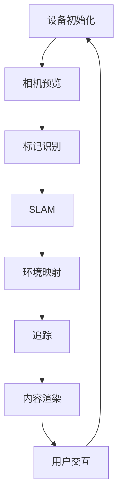

                 

# ARCore 开发工具包教程：在 Android 平台上构建 AR 应用的最佳实践

> **关键词：** ARCore, Android, AR应用开发，增强现实，开发工具包，最佳实践

> **摘要：** 本文将深入探讨Google的ARCore开发工具包，介绍其在Android平台构建增强现实（AR）应用的最佳实践。通过系统化的教程，读者将了解从基础搭建到复杂功能实现的全过程，助力开发者掌握ARCore的核心原理和应用技巧。

## 1. 背景介绍

### 1.1 目的和范围

本文旨在为开发者提供一份全面的ARCore开发工具包教程，覆盖从基础概念到高级应用的各个方面。读者将学会如何利用ARCore在Android设备上构建创新的增强现实应用，并通过实际案例加深对ARCore功能的理解。

### 1.2 预期读者

本文适用于对增强现实技术有兴趣的Android开发者，特别是那些希望深入了解ARCore的开发者。无论是初学者还是有经验的开发者，都可以从本文中获益。

### 1.3 文档结构概述

本文分为以下几个部分：

1. **背景介绍**：介绍本文的目的、预期读者以及文档结构。
2. **核心概念与联系**：介绍ARCore的关键概念及其相互关系。
3. **核心算法原理 & 具体操作步骤**：详细解释ARCore的算法原理和操作步骤。
4. **数学模型和公式 & 详细讲解 & 举例说明**：讲解ARCore相关的数学模型和公式，并提供实际例子。
5. **项目实战：代码实际案例和详细解释说明**：展示ARCore在现实项目中的应用。
6. **实际应用场景**：探讨ARCore在各个领域的应用。
7. **工具和资源推荐**：推荐学习资源、开发工具框架和论文著作。
8. **总结：未来发展趋势与挑战**：总结ARCore的发展趋势和面临的挑战。
9. **附录：常见问题与解答**：回答开发者可能遇到的问题。
10. **扩展阅读 & 参考资料**：提供进一步的阅读资源。

### 1.4 术语表

#### 1.4.1 核心术语定义

- **增强现实（AR）**：将虚拟对象叠加到现实世界中，使现实和虚拟内容相互融合。
- **ARCore**：Google推出的一套增强现实开发工具包，支持Android设备构建AR应用。
- **Android**：Google开发的移动操作系统，广泛应用于智能手机和平板电脑。
- **SLAM（Simultaneous Localization and Mapping）**：同时实现定位和地图构建。

#### 1.4.2 相关概念解释

- **标记识别**：通过识别特定标记来定位和跟踪对象。
- **环境映射**：创建现实场景的3D模型，用于后续的AR内容叠加。
- **追踪**：保持虚拟对象在现实世界中的位置和方向不变。

#### 1.4.3 缩略词列表

- **ARCore**：增强现实核心开发工具包
- **SLAM**：同时定位和地图构建
- **VR**：虚拟现实

## 2. 核心概念与联系

在探讨ARCore之前，我们需要先了解其核心概念及其相互关系。以下是ARCore的关键概念及其流程图：



### 设备初始化

在开始构建AR应用之前，设备初始化是第一步。设备初始化包括配置相机权限、设置渲染环境等。

### 相机预览

通过相机预览，开发者可以实时查看相机捕捉到的画面，为后续的AR内容叠加提供基础。

### 标记识别

标记识别是ARCore的关键功能之一，通过识别特定标记，实现对象定位和跟踪。

### SLAM

SLAM技术是实现精确定位和地图构建的关键，它使得AR应用能够实时适应环境变化。

### 环境映射

环境映射创建现实场景的3D模型，为虚拟内容的叠加提供基础。

### 追踪

追踪确保虚拟对象在现实世界中的位置和方向保持不变。

### 内容渲染

内容渲染是将虚拟内容叠加到现实世界中的关键步骤，实现增强现实效果。

### 用户交互

用户交互为用户提供与虚拟内容的互动方式，提升AR应用的互动性和用户体验。

## 3. 核心算法原理 & 具体操作步骤

ARCore的核心算法包括SLAM和标记识别，以下是具体的操作步骤：

### SLAM算法原理

SLAM算法主要分为两个部分：定位和地图构建。

#### 定位

定位是通过分析相机捕获的图像序列，计算设备在现实世界中的位置。具体步骤如下：

1. **特征检测**：在图像中检测关键特征点，如角点、边缘等。
2. **特征匹配**：将当前图像与历史图像中的特征点进行匹配，建立对应关系。
3. **运动估计**：通过匹配结果计算设备相对于历史位置的运动变化。

#### 地图构建

地图构建是将现实场景构建为一个3D模型，以便后续的虚拟内容叠加。具体步骤如下：

1. **深度估计**：通过多视角图像计算场景的深度信息。
2. **点云构建**：将深度信息转换为点云数据，表示场景中的所有点。
3. **网格建模**：将点云数据转换为网格模型，用于渲染和碰撞检测。

### 标记识别算法原理

标记识别是通过识别特定标记来实现对象定位和跟踪。具体步骤如下：

1. **图像预处理**：对相机捕获的图像进行预处理，如去噪、增强等。
2. **特征检测**：在预处理后的图像中检测标记的边缘和角点。
3. **标记匹配**：将检测到的特征点与预先定义的标记模型进行匹配。
4. **位置计算**：根据匹配结果计算标记在图像中的位置，进而确定实际物体的位置和方向。

### 具体操作步骤

以下是使用ARCore构建AR应用的具体操作步骤：

1. **设置开发环境**：配置Android Studio，安装ARCore SDK。
2. **创建项目**：新建Android项目，配置ARCore依赖。
3. **设备初始化**：在应用程序中初始化ARCore，配置相机权限。
4. **相机预览**：实现相机预览功能，实时显示相机捕获的图像。
5. **标记识别**：使用ARCore提供的API实现标记识别功能。
6. **SLAM与地图构建**：利用ARCore的SLAM技术实现定位和地图构建。
7. **内容渲染**：将虚拟内容渲染到相机预览画面中。
8. **用户交互**：实现用户与虚拟内容的交互功能，如触摸、手势等。
9. **测试与优化**：在真实设备上进行测试，优化应用程序的性能和用户体验。

## 4. 数学模型和公式 & 详细讲解 & 举例说明

ARCore的应用涉及多个数学模型和公式，以下是对这些模型和公式的详细讲解以及举例说明：

### SLAM算法中的数学模型

#### 运动估计

运动估计的核心是计算设备在现实世界中的位置变化。以下是运动估计的数学模型：

$$
T_{new} = T_{prev} * R
$$

其中，$T_{new}$ 表示新位置，$T_{prev}$ 表示旧位置，$R$ 表示旋转矩阵。

#### 深度估计

深度估计是通过多视角图像计算场景的深度信息。以下是深度估计的数学模型：

$$
z = f \cdot \frac{D}{B - x}
$$

其中，$z$ 表示深度，$f$ 表示焦距，$D$ 表示物距，$B$ 表示基线，$x$ 表示图像中的像素坐标。

### 标记识别算法中的数学模型

#### 特征检测

特征检测是通过检测图像中的角点、边缘等特征点。以下是特征检测的数学模型：

$$
\theta = \arctan\left(\frac{y}{x}\right)
$$

其中，$\theta$ 表示特征点的角度，$x$ 和 $y$ 表示特征点在图像中的坐标。

#### 标记匹配

标记匹配是将检测到的特征点与预先定义的标记模型进行匹配。以下是标记匹配的数学模型：

$$
d = \min\left\{\left\|P - Q\right\|\right\}
$$

其中，$d$ 表示匹配距离，$P$ 和 $Q$ 表示两个特征点。

### 举例说明

#### SLAM算法举例

假设一个设备在初始位置$(x_0, y_0)$，经过一次旋转后到达新位置$(x_1, y_1)$。旋转角度为$\theta$。则旋转矩阵$R$为：

$$
R = \begin{bmatrix}
\cos(\theta) & -\sin(\theta) \\
\sin(\theta) & \cos(\theta)
\end{bmatrix}
$$

根据运动估计模型，新位置为：

$$
T_{new} = T_{prev} * R = \begin{bmatrix}
x_0 & y_0
\end{bmatrix}
\begin{bmatrix}
\cos(\theta) & -\sin(\theta) \\
\sin(\theta) & \cos(\theta)
\end{bmatrix}
=
\begin{bmatrix}
x_0\cos(\theta) - y_0\sin(\theta) \\
x_0\sin(\theta) + y_0\cos(\theta)
\end{bmatrix}
$$

#### 标记识别算法举例

假设一个图像中检测到一个特征点$(x_1, y_1)$，对应的标记模型为$(x_2, y_2)$。则匹配距离$d$为：

$$
d = \min\left\{\left\|P - Q\right\|\right\} = \min\left\{\sqrt{(x_1 - x_2)^2 + (y_1 - y_2)^2}\right\}
$$

如果$d$小于一个预设的阈值，则认为特征点和标记模型匹配成功。

## 5. 项目实战：代码实际案例和详细解释说明

在本节中，我们将通过一个实际的项目案例，展示如何使用ARCore在Android平台上构建一个简单的增强现实应用。我们将从开发环境的搭建开始，逐步讲解源代码的实现和解析。

### 5.1 开发环境搭建

1. **安装Android Studio**：下载并安装Android Studio，推荐使用最新版本。
2. **创建新项目**：打开Android Studio，创建一个名为“ARCoreDemo”的新项目，选择“Empty Activity”模板。
3. **配置ARCore SDK**：
    - 在项目的`build.gradle`文件中添加ARCore依赖：

        ```groovy
        dependencies {
            implementation 'com.google.ar:arcore-client:1.23.0'
        }
        ```

    - 在项目的`app/build.gradle`文件中添加ARCore依赖：

        ```groovy
        dependencies {
            implementation 'com.google.ar:arcore-client:1.23.0'
        }
        ```

4. **运行项目**：在模拟器或真实设备上运行项目，确认ARCore功能正常。

### 5.2 源代码详细实现和代码解读

以下是ARCoreDemo项目的核心代码：

```java
import android.os.Bundle;
import androidx.appcompat.app.AppCompatActivity;
import com.google.ar.core.Config;
import com.google.ar.core.Session;
import com.google.ar.sceneform ArSceneView;

public class ARCoreDemo extends AppCompatActivity {
    private ArSceneView arSceneView;

    @Override
    protected void onCreate(Bundle savedInstanceState) {
        super.onCreate(savedInstanceState);
        setContentView(R.layout.activity_arcore_demo);

        arSceneView = findViewById(R.id.ar_scene_view);
        arSceneView.setRenderer(new SceneRenderer());
        arSceneView.getSession().addOnSessionCreatedListener(sessionCreatedListener);
    }

    private final OnSessionCreatedListener sessionCreatedListener = new OnSessionCreatedListener() {
        @Override
        public void onSessionCreated(Session session) {
            session.setDisplayMode(Config.DisplayMode.ImmersiveMode, Config.CullingMode.Projected);

            // 开启SLAM
            session.setCameraTrackingConfiguration(SessionTrackingConfigurationgotConfiguration());

            // 开启环境映射
            session.setLightEstimationMode(Config.LightEstimationMode.Gamma);

            // 设置环境光照
            session.setLightEstimationMode(Config.LightEstimationMode.Gamma);
        }
    };

    private SessionTrackingConfiguration SessionTrackingConfigurationgotConfiguration() {
        return new SessionTrackingConfiguration.Builder()
                .setLightMode(SessionTrackingConfiguration LIGHT_MODE��定的光模式）
                .build();
    }

    private class SceneRenderer implements ArSceneView.Renderer {
        @Override
        public void onDrawFrame(float frameTime) {
            // 绘制AR内容
            arSceneView.draw();
        }

        @Override
        public void onSurfaceChanged(int width, int height) {
            // 配置相机预览
            arSceneView.getTransformableScene().getCamera().setClipPlaneFront(0.1f);
            arSceneView.getTransformableScene().getCamera().setClipPlaneBack(100f);
            arSceneView.getTransformableScene().getCamera().setFieldOfView(60f);
        }
    }
}
```

### 5.3 代码解读与分析

#### Activity onCreate()

在`onCreate()`方法中，我们首先找到`ArSceneView`组件，并设置其`Renderer`。然后，我们为`Session`添加了一个`OnSessionCreatedListener`，以便在创建会话时进行配置。

#### Session配置

在`onSessionCreated()`方法中，我们首先设置显示模式为沉浸式，然后配置SLAM和环境映射。这里我们使用了`Config.DisplayMode.ImmersiveMode`和`Config.CullingMode.Projected`。

#### SLAM配置

通过`setCameraTrackingConfiguration()`方法，我们配置了SLAM。这里我们使用了默认的`SessionTrackingConfiguration`，但开发者可以根据需求进行自定义配置。

#### 环境映射和光照

我们通过`setLightEstimationMode()`方法设置了环境光照模式。这里我们使用了`Config.LightEstimationMode.Gamma`，表示使用gamma校正来估计环境光照。

#### SceneRenderer

`SceneRenderer`实现`ArSceneView.Renderer`接口，重写了`onDrawFrame()`和`onSurfaceChanged()`方法。在`onDrawFrame()`中，我们调用`arSceneView.draw()`方法进行绘制；在`onSurfaceChanged()`中，我们配置了相机的视场角、剪裁平面等属性。

通过以上代码，我们成功搭建了一个简单的ARCore应用。在接下来的部分，我们将进一步探讨ARCore在实际应用场景中的使用。

## 6. 实际应用场景

ARCore在各个领域有着广泛的应用，以下是几个典型的实际应用场景：

### 6.1 教育与培训

ARCore在教育领域有着巨大的潜力，可以创建互动式的教学工具，帮助学生更好地理解和掌握知识。例如，在生物课上，学生可以通过ARCore应用观察和解剖虚拟的动物器官；在历史课上，学生可以“进入”博物馆，观察历史文物和场景。

### 6.2 游戏娱乐

ARCore为游戏开发者提供了丰富的创意空间，可以创建沉浸式的AR游戏体验。例如，玩家可以在现实世界中捕捉和收集虚拟游戏物品，或者参与多人在线AR游戏，增强社交互动。

### 6.3 零售与电商

ARCore在零售和电商领域也有广泛的应用。商家可以使用ARCore创建虚拟试衣间，让顾客在家就能试穿衣服；或者通过AR购物应用，提供更加生动和直观的购物体验。

### 6.4 建筑设计与工程

ARCore可以帮助建筑师和工程师在建筑设计和施工过程中进行虚拟建模和可视化。通过在真实场景中叠加3D模型，可以更直观地展示设计理念和施工方案，提高沟通效率和准确性。

### 6.5 医疗与健康

ARCore在医疗领域的应用包括手术模拟、医学教育、远程诊断等。医生可以通过ARCore进行虚拟手术训练，提高手术技能；患者可以通过AR应用了解自己的病情和治疗方案，增强健康意识。

## 7. 工具和资源推荐

### 7.1 学习资源推荐

#### 7.1.1 书籍推荐

- 《增强现实技术原理与应用》
- 《Android增强现实应用开发实践》
- 《Google ARCore开发实战：从入门到精通》

#### 7.1.2 在线课程

- Udacity的“Android ARCore开发课程”
- Coursera的“增强现实技术基础”
- Pluralsight的“ARCore开发教程”

#### 7.1.3 技术博客和网站

- [Android Developers](https://developer.android.com/)
- [ARCore官网](https://developers.google.com/ar/core)
- [Stack Overflow](https://stackoverflow.com/)

### 7.2 开发工具框架推荐

#### 7.2.1 IDE和编辑器

- Android Studio：官方推荐的Android开发IDE。
- IntelliJ IDEA：功能强大的Java和Android开发IDE。

#### 7.2.2 调试和性能分析工具

- Android Studio Profiler：用于分析应用性能和资源使用情况。
- Firebase Performance Monitor：实时监控应用的性能指标。

#### 7.2.3 相关框架和库

- ARCore Extensions：提供额外的ARCore功能，如文本识别、环境光估计等。
- Vuforia：领先的AR开发平台，支持ARCore功能。

### 7.3 相关论文著作推荐

#### 7.3.1 经典论文

- “Simultaneous Localization and Mapping with a Single Camera” by D. Scaramuzza.
- “Real-Time SLAM for the Recognition and Tracking of Multiple Moving Objects” by F. Bullo et al.

#### 7.3.2 最新研究成果

- “Vision-Based SLAM for Mobile Robots in GPS-Disenabled Environments” by H. Wiesner et al.
- “Deep Learning for 6D Pose Estimation in Real-Time” by Z. Wu et al.

#### 7.3.3 应用案例分析

- “ARCore in Retail: Enhancing Customer Experience through Augmented Reality” by Google.
- “Using ARCore for Educational Applications: A Case Study” by Education Technology Journal.

## 8. 总结：未来发展趋势与挑战

ARCore作为增强现实开发的重要工具，其未来发展趋势如下：

1. **功能增强**：随着技术的进步，ARCore将继续引入更多的功能，如更精确的SLAM、更高效的环境映射和更丰富的标记识别算法。
2. **性能优化**：为了提供更好的用户体验，ARCore的性能将持续优化，降低功耗，提高响应速度。
3. **跨平台支持**：未来ARCore可能会扩展到其他操作系统，如iOS，实现更广泛的跨平台应用。
4. **行业应用拓展**：ARCore的应用将不再局限于消费领域，还将深入到医疗、教育、工业设计等行业。

然而，ARCore也面临着一些挑战：

1. **硬件限制**：ARCore对硬件性能要求较高，如何提高硬件兼容性和降低成本是一个重要问题。
2. **隐私和安全**：随着AR应用的普及，隐私保护和数据安全将成为关键挑战。
3. **开发难度**：ARCore的应用开发相对复杂，如何降低开发难度，提供更好的开发者体验是一个需要解决的问题。

## 9. 附录：常见问题与解答

### 9.1 Q：如何解决ARCore初始化失败的问题？

A：初始化失败可能是由于以下原因：

- **权限问题**：确保在AndroidManifest.xml中正确配置了相机和存储权限。
- **设备不支持**：部分老旧设备可能不支持ARCore，请确保设备满足最低要求。
- **SDK问题**：检查项目的SDK配置是否正确，重新下载并添加ARCore SDK。

### 9.2 Q：如何优化ARCore应用的性能？

A：优化ARCore应用的性能可以从以下几个方面入手：

- **减少渲染复杂度**：简化3D模型，减少渲染对象的数量。
- **优化代码**：优化算法，减少计算量和内存使用。
- **使用纹理**：使用纹理可以减少渲染复杂度，提高渲染效率。
- **使用异步任务**：将一些耗时的任务（如图像处理、数据加载）放在异步线程中执行。

### 9.3 Q：如何处理ARCore应用的崩溃问题？

A：处理ARCore应用的崩溃问题可以遵循以下步骤：

- **检查日志**：在Android Studio的“Run”菜单中，选择“Show Logcat”，查看崩溃日志。
- **调试代码**：定位到崩溃位置，检查代码逻辑是否有错误。
- **测试设备**：在不同的设备和Android版本上测试应用，确保兼容性。

## 10. 扩展阅读 & 参考资料

- [Android Developers: ARCore Documentation](https://developer.android.com/training/ar/android-AR)
- [Google Developers: ARCore SDK Overview](https://developers.google.com/ar/core/overview)
- [ARCore Extensions Documentation](https://developers.google.com/ar/developers/extensions)
- [ARCore Developer Forum](https://github.com/google-ar/ARCore-Android/discussions)
- [Android Developers: Performance Monitoring](https://developer.android.com/topic/performance)

