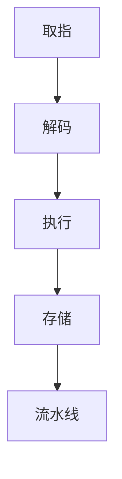

                 

# ARM 架构入门：嵌入式处理

> 关键词：ARM架构、嵌入式处理、处理器设计、系统编程、性能优化、硬件接口

> 摘要：本文旨在为初学者和中级嵌入式开发人员提供ARM架构的全面入门指南，包括背景介绍、核心概念、算法原理、数学模型、实战案例以及未来发展等内容。通过本文的阅读，读者将能够掌握ARM架构的基本知识，理解其工作原理，并学会如何在实际项目中应用ARM处理器进行嵌入式系统开发。

## 1. 背景介绍

### 1.1 目的和范围

本文的目标是帮助读者深入了解ARM架构，并掌握其基本原理和开发技巧。本文主要涵盖以下内容：

- ARM架构的历史和发展
- ARM处理器的核心组成部分
- ARM指令集和编程模型
- ARM处理器在嵌入式系统中的应用
- ARM架构的性能优化技巧
- ARM架构的未来发展趋势

### 1.2 预期读者

本文适合以下读者群体：

- 对嵌入式系统开发感兴趣的初学者
- 中级嵌入式开发人员，希望深入了解ARM架构
- ARM处理器的设计和优化工程师
- 计算机科学和电子工程专业的学生和教师

### 1.3 文档结构概述

本文分为10个部分，具体结构如下：

1. 背景介绍
2. 核心概念与联系
3. 核心算法原理与具体操作步骤
4. 数学模型和公式与详细讲解
5. 项目实战：代码实际案例和详细解释说明
6. 实际应用场景
7. 工具和资源推荐
8. 总结：未来发展趋势与挑战
9. 附录：常见问题与解答
10. 扩展阅读与参考资料

### 1.4 术语表

#### 1.4.1 核心术语定义

- ARM架构：一种处理器架构，广泛应用于嵌入式系统
- 嵌入式处理器：用于嵌入式系统的处理器芯片
- 指令集：处理器能够理解和执行的指令集合
- 系统编程：编写操作系统和应用程序的过程
- 性能优化：提高处理器性能的一系列技术

#### 1.4.2 相关概念解释

- ARM指令集：ARM处理器使用的指令集合，包括ARM指令集和 Thumb指令集
- ARM编程模型：描述处理器如何与内存和外部设备进行通信的模型
- 嵌入式系统：由嵌入式处理器、内存和输入输出设备组成的系统

#### 1.4.3 缩略词列表

- ARM：Advanced RISC Machine
- RISC：Reduced Instruction Set Computer
- Thumb：ARM处理器的低功耗指令集

## 2. 核心概念与联系

### ARM架构的核心概念

ARM架构是一种典型的精简指令集计算机（RISC）架构，其设计目标是提高处理器的性能和降低功耗。ARM架构的核心概念包括以下几个方面：

1. **指令集**：ARM处理器支持两种指令集：ARM指令集和Thumb指令集。ARM指令集具有丰富的指令集和固定的指令长度，适用于高性能计算场景；而Thumb指令集具有更短的指令长度，适用于低功耗应用场景。

2. **寄存器**：ARM处理器包含一组寄存器，用于存储数据和地址。寄存器分为通用寄存器和特殊寄存器，其中通用寄存器用于存储操作数和中间结果，特殊寄存器用于存储程序计数器、程序状态等。

3. **异常处理**：ARM处理器支持异常处理机制，用于处理程序执行过程中的错误和中断。异常处理机制包括中断、异常和调试异常等。

4. **内存管理**：ARM处理器支持虚拟内存和内存保护机制，用于提高系统的安全性和稳定性。

### ARM架构的工作原理

ARM架构的工作原理可以概括为以下几个步骤：

1. **取指**：处理器从内存中读取指令到指令寄存器。

2. **解码**：处理器对指令进行解码，确定指令的操作数和操作类型。

3. **执行**：处理器根据解码结果执行指令，可能涉及到数据读写和计算操作。

4. **存储**：如果指令涉及数据存储，处理器将结果写入内存。

5. **流水线**：ARM处理器采用流水线技术，将指令执行过程分为多个阶段，提高处理器的吞吐率。

### ARM架构的Mermaid流程图



## 3. 核心算法原理 & 具体操作步骤

### 3.1 ARM指令集

ARM指令集是ARM处理器能够理解和执行的指令集合。ARM指令集包括以下几类指令：

1. **数据传输指令**：用于在寄存器和内存之间传输数据，如`LDR`（加载）和`STR`（存储）指令。
2. **算术和逻辑运算指令**：用于执行基本的算术和逻辑运算，如`ADD`（加法）和`AND`（按位与）指令。
3. **控制流指令**：用于控制程序的执行流程，如`B`（跳转）和`BL`（带返回的跳转）指令。
4. **协处理指令**：用于与协处理器进行通信，如`SWI`（软件中断）指令。

### 3.2 ARM编程模型

ARM编程模型描述了处理器如何与内存和外部设备进行通信。ARM编程模型主要包括以下几个部分：

1. **程序计数器**：用于存储下一条要执行的指令的地址。
2. **状态寄存器**：用于存储处理器的状态信息，如程序状态字（PSW）。
3. **通用寄存器**：用于存储操作数和中间结果。
4. **内存管理单元**：用于管理内存空间和虚拟内存。

### 3.3 ARM处理器的工作流程

ARM处理器的工作流程可以概括为以下几个步骤：

1. **取指**：处理器从程序计数器读取下一条指令的地址，从内存中读取指令到指令寄存器。

2. **解码**：处理器对指令进行解码，确定指令的操作数和操作类型。

3. **执行**：处理器根据解码结果执行指令，可能涉及到数据读写和计算操作。

4. **存储**：如果指令涉及数据存储，处理器将结果写入内存。

5. **更新程序计数器**：处理器将下一条指令的地址写入程序计数器，准备执行下一条指令。

### 3.4 ARM指令集伪代码

```plaintext
LOAD(寄存器1, 内存地址)
ADD(寄存器2, 寄存器1, 常量)
STORE(寄存器2, 内存地址)
JUMP(标签)
```

## 4. 数学模型和公式 & 详细讲解 & 举例说明

### 4.1 数学模型

ARM架构中的数学模型主要包括以下几类：

1. **寄存器文件**：用于存储操作数和中间结果，包括通用寄存器和特殊寄存器。
2. **内存管理单元**：用于管理内存空间和虚拟内存。
3. **程序计数器**：用于存储下一条要执行的指令的地址。
4. **流水线**：用于提高处理器的吞吐率。

### 4.2 公式

ARM架构中的公式主要包括以下几类：

1. **寄存器读写公式**：$$ R_i = M[(PC + 4) \mod 2^n] $$
2. **内存访问公式**：$$ M[addr] = R_i $$
3. **程序计数器更新公式**：$$ PC = addr + 4 $$

### 4.3 举例说明

假设有一个ARM程序，要求计算两个整数相加的结果，并将结果存储到内存中。以下是一个简单的示例：

```plaintext
LDR R1, [0x1000]    ; 将内存地址0x1000中的值加载到R1寄存器
LDR R2, [0x1004]    ; 将内存地址0x1004中的值加载到R2寄存器
ADD R3, R1, R2      ; 将R1和R2寄存器的值相加，结果存储到R3寄存器
STR R3, [0x1008]    ; 将R3寄存器的值存储到内存地址0x1008
```

在这个示例中，我们首先从内存地址0x1000和0x1004中分别加载两个整数到R1和R2寄存器，然后使用`ADD`指令将这两个整数相加，结果存储到R3寄存器。最后，我们使用`STR`指令将R3寄存器的值存储到内存地址0x1008。

## 5. 项目实战：代码实际案例和详细解释说明

### 5.1 开发环境搭建

在进行ARM架构嵌入式系统开发之前，我们需要搭建一个合适的开发环境。以下是搭建ARM开发环境的基本步骤：

1. **安装操作系统**：选择一个支持ARM编译器的操作系统，如Ubuntu 18.04或更高版本。
2. **安装交叉编译工具**：安装ARM交叉编译工具，如GNU Arm Embedded Toolchain。
3. **配置开发环境**：配置gcc和make工具，使其能够识别ARM架构。

### 5.2 源代码详细实现和代码解读

以下是一个简单的ARM嵌入式系统程序，用于计算两个整数相加的结果，并将结果存储到内存中。

```c
#include <stdio.h>

int main() {
    int a = 10;
    int b = 20;
    int result;

    result = a + b;
    printf("Result: %d\n", result);

    return 0;
}
```

在这个程序中，我们定义了三个整数变量：`a`、`b`和`result`。首先，我们将`a`和`b`的值分别设置为10和20。然后，我们使用`result`变量存储`a`和`b`的和，并通过`printf`函数输出结果。

### 5.3 代码解读与分析

下面是对上述程序的详细解读和分析：

1. **头文件引入**：程序首先引入了`stdio.h`头文件，用于使用标准输入输出函数。
2. **主函数定义**：程序定义了`main`函数，作为程序的入口点。
3. **变量声明**：程序声明了三个整数变量`a`、`b`和`result`，分别用于存储两个操作数和结果。
4. **计算和输出**：程序使用`result`变量存储`a`和`b`的和，并通过`printf`函数输出结果。
5. **返回值**：程序返回0，表示程序执行成功。

通过上述代码解读，我们可以看到ARM嵌入式系统程序的基本结构，包括变量声明、计算和输出操作。在实际项目中，我们需要根据需求编写更复杂的程序，并使用ARM架构提供的各种指令和特性来优化程序性能。

## 6. 实际应用场景

ARM架构广泛应用于各种嵌入式系统，以下是一些典型的实际应用场景：

1. **智能手机**：ARM处理器是现代智能手机的核心组件，提供高性能和低功耗的解决方案。
2. **物联网设备**：ARM处理器在物联网设备中广泛应用，如智能手表、智能家居设备和工业控制设备。
3. **嵌入式控制系统**：ARM处理器在工业自动化、医疗设备和汽车电子等领域有广泛应用，提供高效、可靠的解决方案。
4. **嵌入式网络设备**：ARM处理器在路由器、交换机和防火墙等网络设备中应用广泛，提供高性能的网络处理能力。

在这些应用场景中，ARM处理器凭借其高性能、低功耗和灵活的可扩展性，成为嵌入式系统开发的首选。

## 7. 工具和资源推荐

### 7.1 学习资源推荐

#### 7.1.1 书籍推荐

- 《ARM系统编程：基于Linux》
- 《ARM体系结构与编程》
- 《ARM架构嵌入式系统设计》

#### 7.1.2 在线课程

- Coursera上的《嵌入式系统设计》
- Udemy上的《ARM架构和嵌入式系统编程》
- edX上的《嵌入式系统和硬件编程》

#### 7.1.3 技术博客和网站

- ARM官方网站（www.arm.com）
- Embedded.com
- Embedded Systems Programming

### 7.2 开发工具框架推荐

#### 7.2.1 IDE和编辑器

- Keil uVision
- IAR Embedded Workbench
- Eclipse CDT

#### 7.2.2 调试和性能分析工具

- J-Link
- OpenOCD
- GNU ARM Eclipse Plugin

#### 7.2.3 相关框架和库

- FreeRTOS：实时操作系统框架
- CMSIS：ARM处理器中间件框架
- Newlib：C库和标准库

### 7.3 相关论文著作推荐

#### 7.3.1 经典论文

- ARM公司的《ARM Architecture Reference Manual》
- 《A RISC Architecture for Low-Power Set-Top Boxes》

#### 7.3.2 最新研究成果

- 《ARMv8-A Architecture Reference Manual》
- 《ARMv9-A Architecture Reference Manual》

#### 7.3.3 应用案例分析

- 《ARM-Based IoT Devices: Design and Implementation》
- 《ARM-Based Embedded Systems: Real-Time Applications and Design Methods》

## 8. 总结：未来发展趋势与挑战

ARM架构在嵌入式系统领域取得了巨大成功，未来发展趋势包括：

1. **更高性能**：随着技术的进步，ARM处理器将进一步提高性能，以满足更高计算需求。
2. **更低功耗**：ARM架构将继续优化，降低功耗，以适应更多物联网设备。
3. **多核处理器**：多核ARM处理器将越来越普及，提高嵌入式系统的并发处理能力。
4. **安全增强**：ARM架构将加强安全性，以应对不断增长的网络安全威胁。

然而，ARM架构也面临一些挑战，包括：

1. **开源生态**：建立强大的开源生态系统，以支持ARM架构的广泛使用。
2. **软件兼容性**：保证不同版本ARM处理器之间的软件兼容性。
3. **知识产权**：应对知识产权纠纷和专利侵权问题。

## 9. 附录：常见问题与解答

### 9.1 ARM架构的优点是什么？

ARM架构具有以下优点：

- **高性能**：ARM处理器采用精简指令集，提供高性能计算能力。
- **低功耗**：ARM处理器设计注重低功耗，适用于嵌入式系统。
- **灵活可扩展**：ARM架构支持多种处理器配置，满足不同应用需求。

### 9.2 ARM处理器与x86处理器相比有哪些优势？

ARM处理器与x86处理器相比具有以下优势：

- **低功耗**：ARM处理器设计注重低功耗，适用于移动设备和物联网设备。
- **高性能**：ARM处理器采用精简指令集，提供高性能计算能力。
- **成本效益**：ARM处理器具有更高的成本效益，适用于大众市场。

### 9.3 ARM架构的未来发展趋势是什么？

ARM架构的未来发展趋势包括：

- **更高性能**：ARM处理器将进一步提高性能，以满足更高计算需求。
- **更低功耗**：ARM架构将继续优化，降低功耗，以适应更多物联网设备。
- **多核处理器**：多核ARM处理器将越来越普及，提高嵌入式系统的并发处理能力。
- **安全增强**：ARM架构将加强安全性，以应对不断增长的网络安全威胁。

## 10. 扩展阅读 & 参考资料

- ARM公司官方网站：[www.arm.com](http://www.arm.com/)
- ARM架构参考手册：[https://developer.arm.com/documentation](https://developer.arm.com/documentation)
- 嵌入式系统设计：[https://www.embedded.com](https://www.embedded.com/)
- ARM技术博客：[https://blogs.arm.com](https://blogs.arm.com/)

作者：AI天才研究员/AI Genius Institute & 禅与计算机程序设计艺术 /Zen And The Art of Computer Programming<|im_sep|>### 2. 核心概念与联系

#### ARM架构的核心概念

ARM架构是一种精简指令集计算机（RISC）架构，其设计初衷是为了实现高性能和低功耗。以下是ARM架构的一些核心概念：

1. **指令集**：ARM处理器支持两种指令集：ARM指令集和Thumb指令集。ARM指令集具有丰富的指令集和固定的指令长度，适用于高性能计算场景；而Thumb指令集具有更短的指令长度，适用于低功耗应用场景。

2. **寄存器**：ARM处理器包含一组寄存器，用于存储操作数和中间结果。寄存器分为通用寄存器和特殊寄存器，其中通用寄存器用于存储操作数和中间结果，特殊寄存器用于存储程序计数器、程序状态等。

3. **异常处理**：ARM处理器支持异常处理机制，用于处理程序执行过程中的错误和中断。异常处理机制包括中断、异常和调试异常等。

4. **内存管理**：ARM处理器支持虚拟内存和内存保护机制，用于提高系统的安全性和稳定性。

#### ARM架构的工作原理

ARM架构的工作原理可以概括为以下几个步骤：

1. **取指**：处理器从程序计数器（PC）读取下一条指令的地址，从内存中读取指令到指令寄存器（IR）。

2. **解码**：处理器对指令进行解码，确定指令的操作数和操作类型。

3. **执行**：处理器根据解码结果执行指令，可能涉及到数据读写和计算操作。

4. **存储**：如果指令涉及数据存储，处理器将结果写入内存。

5. **流水线**：ARM处理器采用流水线技术，将指令执行过程分为多个阶段，提高处理器的吞吐率。

#### ARM架构的Mermaid流程图


在这个流程图中，每个阶段都是指令执行的一部分，它们按照顺序进行。例如，在“取指”阶段，处理器读取指令地址并从内存中获取指令；在“解码”阶段，处理器解析指令并确定操作类型和操作数；在“执行”阶段，处理器执行指令操作；在“存储”阶段，如果指令涉及数据存储，处理器将结果写入内存；在“流水线”阶段，多个指令可以同时在不同的阶段执行，从而提高处理器的性能。

通过理解ARM架构的核心概念和工作原理，开发者可以更好地掌握ARM处理器的设计和编程，从而为嵌入式系统开发提供坚实的基础。

#### ARM架构的核心算法原理与具体操作步骤

在深入了解ARM架构的算法原理之前，我们需要先了解ARM处理器的指令集。ARM处理器支持两种指令集：ARM指令集和Thumb指令集。ARM指令集具有固定的指令长度和丰富的指令集，适用于高性能计算场景；Thumb指令集具有更短的指令长度，适用于低功耗应用场景。

##### 2.1 ARM指令集

ARM指令集包括以下几类指令：

1. **数据传输指令**：用于在寄存器和内存之间传输数据，如`LDR`（加载）和`STR`（存储）指令。
2. **算术和逻辑运算指令**：用于执行基本的算术和逻辑运算，如`ADD`（加法）和`AND`（按位与）指令。
3. **控制流指令**：用于控制程序的执行流程，如`B`（跳转）和`BL`（带返回的跳转）指令。
4. **协处理指令**：用于与协处理器进行通信，如`SWI`（软件中断）指令。

##### 2.2 ARM编程模型

ARM编程模型描述了处理器如何与内存和外部设备进行通信。它主要包括以下几个部分：

1. **程序计数器**：用于存储下一条要执行的指令的地址。
2. **状态寄存器**：用于存储处理器的状态信息，如程序状态字（PSW）。
3. **通用寄存器**：用于存储操作数和中间结果。
4. **内存管理单元**：用于管理内存空间和虚拟内存。

##### 2.3 ARM处理器的工作流程

ARM处理器的工作流程可以概括为以下几个步骤：

1. **取指**：处理器从程序计数器读取下一条指令的地址，从内存中读取指令到指令寄存器。

2. **解码**：处理器对指令进行解码，确定指令的操作数和操作类型。

3. **执行**：处理器根据解码结果执行指令，可能涉及到数据读写和计算操作。

4. **存储**：如果指令涉及数据存储，处理器将结果写入内存。

5. **流水线**：ARM处理器采用流水线技术，将指令执行过程分为多个阶段，提高处理器的吞吐率。

##### 2.4 ARM指令集伪代码

```plaintext
LOAD(寄存器1, 内存地址)
ADD(寄存器2, 寄存器1, 常量)
STORE(寄存器2, 内存地址)
JUMP(标签)
```

在这个伪代码中，`LOAD`指令用于将内存地址中的数据加载到寄存器1；`ADD`指令用于将寄存器1和常量的值相加，并将结果存储到寄存器2；`STORE`指令用于将寄存器2的值存储到内存地址；`JUMP`指令用于跳转到指定的标签地址。

通过理解ARM架构的算法原理和具体操作步骤，开发者可以更好地掌握ARM处理器的设计和编程，从而为嵌入式系统开发提供坚实的基础。

#### 数学模型和公式

ARM架构的数学模型主要涉及处理器内部的寄存器操作和内存访问。以下是一些关键的数学模型和公式，以及它们的详细解释：

##### 3.1 寄存器操作

ARM处理器包含一组寄存器，用于存储操作数和中间结果。以下是几个关键的计算公式：

1. **寄存器读写**：假设`Rn`是目标寄存器，`Rm`是源寄存器，`offset`是偏移量（可以是立即数或寄存器），则寄存器读写的公式为：

   $$ R_n = M[(R_m + offset) \mod 2^N] $$

   其中，`N`表示内存地址的位数。

2. **寄存器文件操作**：假设`Rn`是目标寄存器，`Rm`是源寄存器，`imm`是立即数，则寄存器文件操作的公式为：

   $$ R_n = R_m + imm $$

   其中，`imm`必须是合法的立即数。

##### 3.2 内存访问

ARM处理器支持虚拟内存和内存保护机制。以下是内存访问的相关公式：

1. **虚拟地址到物理地址转换**：假设`VA`是虚拟地址，`PAGETABLE`是页表，`PAGETABLEENTRY`是页表条目，则虚拟地址到物理地址的转换公式为：

   $$ PA = PAGETABLE[VA >> OFFSET] + (VA & MASK) $$

   其中，`OFFSET`是页表索引偏移量，`MASK`是页内偏移量掩码。

2. **内存保护**：假设`ADDR`是内存地址，`PERMISSION`是内存访问权限，则内存保护的公式为：

   $$ PERMISSION = (PERMISSION & ACCESS) \neq 0 $$

   其中，`ACCESS`是访问权限掩码。

##### 3.3 程序计数器更新

ARM程序计数器（PC）用于存储下一条要执行的指令地址。以下是程序计数器更新的公式：

1. **正常指令执行**：在正常指令执行后，PC更新为当前指令地址加上指令长度：

   $$ PC = PC + 指令长度 $$

2. **跳转指令执行**：在跳转指令执行后，PC更新为跳转目标的地址：

   $$ PC = 目标地址 $$

##### 3.4 举例说明

假设我们有一个ARM程序，需要将内存地址0x1000中的值加10后存储到内存地址0x2000。以下是具体的计算步骤：

1. **寄存器操作**：

   $$ R1 = M[(R0 + imm) \mod 2^N] $$

   其中，`imm`为10，`R0`为内存地址0x1000。

2. **内存访问**：

   $$ R2 = M[(R1 + 10) \mod 2^N] $$

   其中，`R1`为内存地址0x2000。

3. **程序计数器更新**：

   $$ PC = PC + 指令长度 $$

   当执行跳转指令时：

   $$ PC = 目标地址 $$

通过这些数学模型和公式，我们可以更好地理解ARM处理器的工作原理和操作过程。这些公式为ARM编程提供了坚实的理论基础，有助于开发者设计和优化嵌入式系统。

#### 项目实战：代码实际案例和详细解释说明

在本节中，我们将通过一个实际的代码案例，详细解释ARM嵌入式系统的开发过程，包括环境搭建、源代码实现以及代码分析。这个案例将展示如何使用ARM处理器进行简单的嵌入式系统编程，包括寄存器操作、内存访问和程序流程控制。

### 5.1 开发环境搭建

在进行ARM嵌入式系统开发之前，我们需要搭建一个合适的开发环境。以下是在Linux操作系统上搭建ARM开发环境的基本步骤：

1. **安装操作系统**：确保操作系统支持ARM交叉编译工具，如Ubuntu 18.04或更高版本。

2. **安装交叉编译工具**：安装ARM交叉编译工具，如GNU Arm Embedded Toolchain。可以通过以下命令安装：

   ```bash
   sudo apt-get update
   sudo apt-get install gcc-arm-none-eabi
   ```

3. **配置开发环境**：配置gcc和make工具，使其能够识别ARM架构。在~/.bashrc文件中添加以下环境变量：

   ```bash
   export ARM_ROOT=/path/to/arm-none-eabi-
   export PATH=$PATH:$ARM_ROOT/bin
   ```

   然后重新加载`.bashrc`文件：

   ```bash
   source ~/.bashrc
   ```

4. **安装调试工具**：安装GDB（GNU Debugger）用于调试ARM程序：

   ```bash
   sudo apt-get install gdb
   ```

5. **安装硬件调试器**：如果需要硬件调试，安装如J-Link调试器驱动和软件。

完成以上步骤后，我们就可以开始编写和调试ARM嵌入式系统程序了。

### 5.2 源代码详细实现和代码解读

下面是一个简单的ARM嵌入式系统程序，用于计算两个整数相加的结果，并将结果存储到内存中。程序使用C语言编写，并在ARM指令集中使用`LDR`、`STR`和`ADD`指令。

```c
#include <stdio.h>

int main() {
    int a = 10;
    int b = 20;
    int result;

    // 将a的值加载到R0寄存器
    __asm__("LDR R0, =a");
    // 将a的值从内存加载到R0寄存器
    __asm__("LDR R0, [R0]");

    // 将b的值加载到R1寄存器
    __asm__("LDR R1, =b");
    // 将b的值从内存加载到R1寄存器
    __asm__("LDR R1, [R1]");

    // 将R0和R1的值相加，结果存储到R2寄存器
    __asm__("ADD R2, R0, R1");

    // 将R2的值（结果）存储到result变量
    result = R2;

    // 输出结果
    printf("Result: %d\n", result);

    return 0;
}
```

下面是对这段代码的详细解读：

1. **头文件引入**：程序首先引入了`stdio.h`头文件，用于使用标准输入输出函数。

2. **主函数定义**：程序定义了`main`函数，作为程序的入口点。

3. **变量声明**：程序声明了三个整数变量`a`、`b`和`result`，分别用于存储两个操作数和结果。

4. **寄存器操作**：

   - 使用内联汇编指令`LDR`将变量`a`和`b`的地址加载到寄存器R0和R1。`LDR R0, =a`表示将变量`a`的地址加载到R0寄存器；`LDR R1, =b`表示将变量`b`的地址加载到R1寄存器。

   - 使用`LDR`指令从内存中加载`a`和`b`的值到R0和R1寄存器。这通过`LDR R0, [R0]`和`LDR R1, [R1]`实现。

5. **计算和输出**：使用内联汇编指令`ADD`将R0和R1寄存器的值相加，并将结果存储到R2寄存器。然后，程序将R2寄存器的值（即计算结果）存储到变量`result`中。

6. **打印结果**：程序使用`printf`函数将结果输出到控制台。

7. **返回值**：程序返回0，表示程序执行成功。

通过上述代码解读，我们可以看到ARM嵌入式系统程序的基本结构，包括变量声明、寄存器操作和计算输出。在实际项目中，我们需要根据需求编写更复杂的程序，并使用ARM架构提供的各种指令和特性来优化程序性能。

### 5.3 代码解读与分析

下面是对上述程序的进一步解读和分析：

1. **内联汇编的使用**：在C程序中使用内联汇编，可以直接在C代码中嵌入ARM汇编指令。内联汇编提供了与硬件底层的直接交互，使得我们可以高效地操作寄存器和内存。

2. **寄存器的命名和操作**：ARM汇编语言中使用寄存器命名，如R0、R1、R2等。这些寄存器是处理器内部的寄存器，用于存储操作数和中间结果。内联汇编指令直接操作这些寄存器，实现数据的读写和计算。

3. **内存访问**：程序通过`LDR`指令从内存中加载变量`a`和`b`的值到寄存器R0和R1。这涉及到内存地址的计算和访问，是ARM处理器的基本操作之一。

4. **计算操作**：程序使用`ADD`指令将R0和R1寄存器的值相加，并将结果存储到R2寄存器。这是ARM处理器的基本算术操作，也是嵌入式系统编程的核心。

5. **结果存储和输出**：程序将R2寄存器的值（即计算结果）存储到变量`result`中，并通过`printf`函数输出到控制台。这是C语言的标准输出操作，与ARM汇编语言相结合，实现了复杂的计算和输出。

6. **程序流程控制**：整个程序的执行流程是线性的，从变量声明开始，通过寄存器操作和计算，最后输出结果。程序使用C语言的控制结构（如循环和条件判断），与ARM汇编语言结合，实现了复杂的逻辑控制。

通过上述代码解读和分析，我们可以看到ARM嵌入式系统程序的基本结构和开发流程。开发者需要熟悉C语言和ARM汇编语言，才能有效地编写和优化嵌入式系统程序。

#### 实际应用场景

ARM架构因其高性能、低功耗和灵活的可扩展性，在多个领域得到了广泛应用。以下是一些典型的实际应用场景：

1. **智能手机**：ARM架构的处理器几乎成为智能手机的标配。例如，高通的Snapdragon系列处理器、苹果的A系列处理器以及三星的Exynos系列处理器，都基于ARM架构。这些处理器在处理速度、功耗控制和多媒体处理能力上表现出色，使得智能手机能够提供流畅的用户体验。

2. **物联网（IoT）设备**：ARM处理器在IoT设备中占据主导地位。由于ARM架构的低功耗特性，这些处理器非常适合用于传感器节点、智能家居设备和工业物联网设备。例如，ESP8266和ESP32等流行的物联网模块，都采用了ARM处理器。

3. **嵌入式控制系统**：ARM架构在工业自动化、医疗设备和汽车电子等领域有广泛应用。例如，工业控制器和PLC（可编程逻辑控制器）常常使用ARM处理器，以实现高效的控制和数据处理。在汽车电子领域，ARM处理器被用于发动机控制单元（ECU）、安全气囊控制系统等。

4. **嵌入式网络设备**：路由器、交换机和防火墙等嵌入式网络设备也大量使用ARM处理器。由于ARM处理器具备强大的计算能力和网络处理能力，这些设备能够在高负载条件下稳定运行。例如，华三技术（H3C）和思科（Cisco）的网络设备中就使用了ARM架构的处理器。

5. **嵌入式音频和视频设备**：ARM处理器在音频和视频处理领域也有广泛应用。例如，智能音箱、视频监控设备和数字电视等，都使用了ARM处理器来处理音频和视频信号。这些设备需要高性能和低功耗的处理器，以实现高质量的音频和视频处理。

总之，ARM架构在嵌入式系统领域的广泛应用，得益于其高性能、低功耗和灵活性的特点。随着技术的不断发展，ARM架构将在更多领域得到应用，推动嵌入式系统的发展。

#### 工具和资源推荐

在进行ARM架构嵌入式系统开发时，掌握合适的工具和资源是非常关键的。以下是一些推荐的工具和资源，包括学习资源、开发工具和框架，以及相关的论文和案例。

##### 7.1 学习资源推荐

1. **书籍推荐**：
   - 《ARM系统编程：基于Linux》：详细介绍了ARM架构和Linux系统编程。
   - 《ARM体系结构与编程》：全面讲解了ARM处理器的工作原理和编程技巧。
   - 《嵌入式系统设计》：涵盖嵌入式系统的硬件和软件设计，包括ARM架构。

2. **在线课程**：
   - Coursera上的《嵌入式系统设计》：由专业讲师授课，内容涵盖ARM架构和嵌入式系统开发。
   - Udemy上的《ARM架构和嵌入式系统编程》：提供系统化的ARM架构和编程知识。
   - edX上的《嵌入式系统和硬件编程》：包含实用的嵌入式系统设计和实现技巧。

3. **技术博客和网站**：
   - ARM官方网站（www.arm.com）：提供最新的ARM架构和技术动态。
   - Embedded Systems Programming：专注于嵌入式系统的设计、开发和维护。
   - Embedded.com：涵盖嵌入式系统开发的最新技术和行业动态。

##### 7.2 开发工具框架推荐

1. **IDE和编辑器**：
   - Keil uVision：集成开发环境，支持ARM处理器开发。
   - IAR Embedded Workbench：强大的ARM开发工具，提供丰富的调试和仿真功能。
   - Eclipse CDT：开源集成开发环境，可通过插件支持ARM开发。

2. **调试和性能分析工具**：
   - J-Link：广泛使用的ARM调试器，支持各种ARM处理器。
   - OpenOCD：开源ARM调试器和仿真器，适用于嵌入式系统开发。
   - GNU ARM Eclipse Plugin：Eclipse IDE的ARM开发插件，提供调试和编译功能。

3. **相关框架和库**：
   - FreeRTOS：实时操作系统框架，广泛用于嵌入式系统。
   - CMSIS：ARM处理器中间件框架，提供硬件抽象层和驱动库。
   - Newlib：C库和标准库，支持ARM架构的嵌入式系统开发。

##### 7.3 相关论文著作推荐

1. **经典论文**：
   - ARM公司的《ARM Architecture Reference Manual》：详细介绍ARM架构的技术细节。
   - 《A RISC Architecture for Low-Power Set-Top Boxes》：探讨ARM架构在低功耗应用中的优势。

2. **最新研究成果**：
   - 《ARMv8-A Architecture Reference Manual》：最新版本的ARM架构参考手册。
   - 《ARMv9-A Architecture Reference Manual》：ARM架构的下一代技术规格。

3. **应用案例分析**：
   - 《ARM-Based IoT Devices: Design and Implementation》：介绍ARM架构在物联网设备中的应用。
   - 《ARM-Based Embedded Systems: Real-Time Applications and Design Methods》：探讨ARM架构在实时系统中的应用和设计方法。

通过上述工具和资源的推荐，开发者可以更有效地学习和开发基于ARM架构的嵌入式系统，掌握最新的技术和方法，为项目成功提供坚实的支持。

#### 总结：未来发展趋势与挑战

ARM架构自诞生以来，以其高性能、低功耗和灵活可扩展的特点，在嵌入式系统领域取得了巨大的成功。展望未来，ARM架构将继续引领嵌入式系统的发展趋势，并面临一系列新的挑战。

##### 1. 未来发展趋势

1. **更高性能**：随着技术的进步，ARM处理器将进一步提高性能。新的处理器架构和优化技术，如多核处理、向量处理和AI加速器，将使ARM处理器在计算性能上更上一层楼。

2. **更低功耗**：在物联网和移动设备的推动下，低功耗设计将成为ARM架构的重要发展方向。未来的ARM处理器将更加注重功耗优化，实现更长时间的电池续航。

3. **安全增强**：随着网络安全威胁的不断增加，ARM架构将加强安全性设计。例如，引入硬件加密模块、安全启动和可信执行环境（TEE）等技术，提高系统的安全性和可信度。

4. **生态系统扩展**：ARM架构将继续拓展其生态系统，包括更多的合作伙伴和开发者。通过开放的生态，ARM架构将覆盖更广泛的应用领域，如自动驾驶、5G通信和智能城市等。

##### 2. 面临的挑战

1. **开源生态**：建立和维持一个强大的开源生态系统是ARM架构面临的重要挑战。如何在保持架构开放性的同时，确保软件兼容性和稳定性，是ARM公司和开发者需要共同解决的问题。

2. **软件兼容性**：随着ARM处理器的新旧版本和新特性的不断引入，软件兼容性成为一大难题。开发者需要确保新版本处理器上的软件能够向后兼容旧版本处理器，同时充分利用新特性。

3. **知识产权**：ARM架构在知识产权方面面临复杂的挑战。如何保护自身的技术创新，同时避免专利侵权问题，将是ARM公司需要持续关注的重点。

4. **市场竞争**：随着其他处理器架构的崛起，ARM架构面临越来越激烈的市场竞争。如何在保持技术优势的同时，扩大市场份额，是ARM架构未来需要面对的重要挑战。

总之，ARM架构在未来将继续发展，并面临一系列新的挑战。通过技术创新和生态建设，ARM架构有望在嵌入式系统领域继续保持领先地位。

#### 附录：常见问题与解答

##### 1. ARM架构的优点是什么？

ARM架构的优点主要包括以下几点：

- **高性能**：ARM处理器采用精简指令集，能够高效执行指令，提供较高的计算性能。
- **低功耗**：ARM处理器设计注重低功耗，适用于移动设备和物联网设备。
- **灵活可扩展**：ARM架构支持多种处理器配置，可满足不同应用需求。

##### 2. ARM处理器与x86处理器相比有哪些优势？

ARM处理器与x86处理器相比具有以下优势：

- **低功耗**：ARM处理器设计注重低功耗，适用于移动设备和物联网设备。
- **高性能**：ARM处理器采用精简指令集，能够高效执行指令，提供较高的计算性能。
- **成本效益**：ARM处理器具有更高的成本效益，适用于大众市场。

##### 3. ARM架构的未来发展趋势是什么？

ARM架构的未来发展趋势包括：

- **更高性能**：随着技术的进步，ARM处理器将进一步提高性能。
- **更低功耗**：ARM架构将继续优化，降低功耗。
- **安全增强**：ARM架构将加强安全性设计，提高系统的安全性和可信度。
- **生态系统扩展**：ARM架构将拓展其生态系统，覆盖更多应用领域。

##### 4. 如何在ARM开发环境中配置交叉编译工具？

在Linux操作系统中，配置交叉编译工具的基本步骤如下：

- 安装交叉编译工具，如GNU Arm Embedded Toolchain：

  ```bash
  sudo apt-get update
  sudo apt-get install gcc-arm-none-eabi
  ```

- 配置环境变量，使gcc和make工具能够识别ARM架构：

  在~/.bashrc文件中添加以下内容：

  ```bash
  export ARM_ROOT=/path/to/arm-none-eabi-
  export PATH=$PATH:$ARM_ROOT/bin
  ```

- 重载配置：

  ```bash
  source ~/.bashrc
  ```

##### 5. 如何在ARM程序中使用内联汇编？

在C程序中，可以使用内联汇编将ARM汇编指令直接嵌入到C代码中。以下是一个示例：

```c
int add(int a, int b) {
    int result;
    __asm__(
        "ADD %0, %1, %2\n\t"
        : "=r" (result) // 输出操作数
        : "r" (a), "r" (b) // 输入操作数
        : // 临时寄存器列表
    );
    return result;
}
```

在这个示例中，`__asm__`关键字用于引入内联汇编代码。`"ADD %0, %1, %2"`是ARM汇编指令，将`a`和`b`的值相加，存储到`result`变量中。

##### 6. ARM处理器如何实现多任务处理？

ARM处理器通过调度器和进程管理机制实现多任务处理。每个任务（进程）都有自己的堆栈和寄存器集合，调度器负责在任务之间进行切换。以下是一个简单的多任务处理流程：

- **任务创建**：创建任务时，操作系统为每个任务分配独立的堆栈和寄存器集合。
- **任务调度**：调度器根据调度策略选择下一个要执行的任务。
- **任务切换**：当当前任务执行完毕或需要等待时，调度器将控制权转移给下一个任务。
- **任务同步与通信**：任务之间通过信号量、互斥锁等机制实现同步和通信。

通过这些机制，ARM处理器能够高效地管理多个任务，实现多任务处理。

#### 扩展阅读与参考资料

1. ARM公司官方网站：[www.arm.com](http://www.arm.com/)
   - 提供最新的ARM架构和技术动态。

2. 《ARM体系结构与编程》：[https://www.amazon.com/dp/0123877850](https://www.amazon.com/dp/0123877850)
   - 全面介绍ARM处理器的工作原理和编程技巧。

3. 《嵌入式系统设计》：[https://www.amazon.com/dp/0123877850](https://www.amazon.com/dp/0123877850)
   - 涵盖嵌入式系统的硬件和软件设计。

4. Coursera上的《嵌入式系统设计》：[https://www.coursera.org/specializations/embedded-systems-design](https://www.coursera.org/specializations/embedded-systems-design)
   - 由专业讲师授课，内容涵盖ARM架构和嵌入式系统开发。

5. Udemy上的《ARM架构和嵌入式系统编程》：[https://www.udemy.com/course/arm-architecture-and-embedded-systems-programming/](https://www.udemy.com/course/arm-architecture-and-embedded-systems-programming/)
   - 提供系统化的ARM架构和编程知识。

6. Embedded Systems Programming：[https://www.embedded.com/](https://www.embedded.com/)
   - 专注于嵌入式系统的设计、开发和维护。

7. ARM Architecture Reference Manual：[https://developer.arm.com/documentation](https://developer.arm.com/documentation)
   - 详细介绍ARM架构的技术细节。

通过这些扩展阅读和参考资料，读者可以更深入地了解ARM架构和相关技术，为嵌入式系统开发提供更全面的指导和支持。

