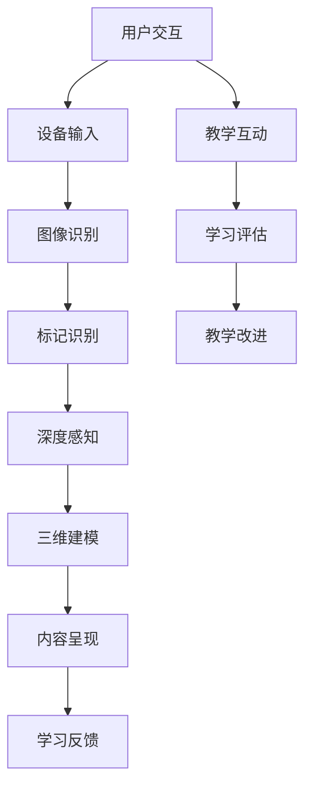

                 

# AR在教育领域的应用：增强学习体验

> **关键词**：增强现实，教育，学习体验，技术应用，互动教学

> **摘要**：本文深入探讨增强现实（AR）技术在教育领域的应用，分析其如何通过增强学习体验，提升教学效果和学生的学习积极性。文章将逐步讲解AR技术的核心原理、算法、数学模型，并通过实际案例展示其在教育场景中的具体应用，最后展望其未来发展前景与挑战。

## 1. 背景介绍

### 1.1 目的和范围

本文旨在为教育工作者和开发者提供关于增强现实（AR）在教育领域应用的全面了解。文章将覆盖AR技术的核心概念、原理、算法、数学模型及其在实际教学中的应用案例。通过本文的阅读，读者将能够理解AR技术在教育领域的潜力，掌握如何将其有效地集成到教学过程中。

### 1.2 预期读者

预期读者包括教育领域从业者、技术开发者、研究人员以及对AR技术感兴趣的学习者。无论您是希望了解新技术在教学中的应用，还是正在寻找创新方法来提升教学效果，本文都将为您提供有价值的见解。

### 1.3 文档结构概述

本文分为十个部分：

1. 背景介绍
   - 1.1 目的和范围
   - 1.2 预期读者
   - 1.3 文档结构概述
   - 1.4 术语表
2. 核心概念与联系
   - 2.1 核心概念与联系
3. 核心算法原理 & 具体操作步骤
   - 3.1 核心算法原理
   - 3.2 具体操作步骤
4. 数学模型和公式 & 详细讲解 & 举例说明
   - 4.1 数学模型和公式
   - 4.2 举例说明
5. 项目实战：代码实际案例和详细解释说明
   - 5.1 开发环境搭建
   - 5.2 源代码详细实现和代码解读
   - 5.3 代码解读与分析
6. 实际应用场景
7. 工具和资源推荐
   - 7.1 学习资源推荐
   - 7.2 开发工具框架推荐
   - 7.3 相关论文著作推荐
8. 总结：未来发展趋势与挑战
9. 附录：常见问题与解答
10. 扩展阅读 & 参考资料

### 1.4 术语表

#### 1.4.1 核心术语定义

- **增强现实（AR）**：一种将数字信息叠加到现实世界中的技术，通过智能手机、平板电脑或其他设备实时呈现。
- **虚拟现实（VR）**：一种完全沉浸式的体验，用户通过头盔或其他设备进入一个虚拟的世界。
- **学习体验**：指学生在学习过程中所获得的感知、体验和反馈。
- **互动教学**：指在教学过程中，教师与学生之间以及学生与学生之间的互动交流。

#### 1.4.2 相关概念解释

- **标记识别**：AR技术中，通过识别图像或物体上的标记来触发相应的数字内容。
- **深度感知**：通过摄像头获取的图像数据中提取深度信息，以实现三维空间中的物体识别和跟踪。
- **三维建模**：创建三维图形模型，用于在AR环境中呈现物体或场景。

#### 1.4.3 缩略词列表

- **AR**：增强现实（Augmented Reality）
- **VR**：虚拟现实（Virtual Reality）
- **AI**：人工智能（Artificial Intelligence）

## 2. 核心概念与联系

增强现实（AR）技术在教育领域的应用涉及多个核心概念和技术的结合。以下是一个简单的Mermaid流程图，用于展示这些核心概念及其相互关系：



### 2.1 核心概念与联系

- **用户交互**：学习者在教学过程中与AR系统进行互动，提供输入。
- **设备输入**：通过摄像头或其他传感器获取现实世界的图像和声音数据。
- **图像识别**：利用计算机视觉算法分析图像内容，识别关键特征。
- **标记识别**：通过识别图像中的特定标记，触发相应的数字内容。
- **深度感知**：从图像数据中提取深度信息，以实现三维空间中的物体识别和跟踪。
- **三维建模**：创建三维图形模型，用于在AR环境中呈现物体或场景。
- **内容呈现**：将数字内容叠加到现实世界中，供学习者观看和学习。
- **学习反馈**：系统根据学习者的操作和反馈提供实时反馈，以促进学习。
- **教学互动**：教师和学习者通过AR系统进行互动，提升教学效果。
- **学习评估**：系统对学习者的学习过程和成果进行评估，以指导教学改进。

通过上述流程图，我们可以看到AR技术在教育领域中的应用是如何将多个核心概念和技术相结合，形成一个完整的学习体验闭环。接下来，我们将进一步深入探讨这些核心概念和技术的具体原理和实现方法。

## 3. 核心算法原理 & 具体操作步骤

### 3.1 核心算法原理

在AR技术的应用中，核心算法主要包括图像识别、标记识别、深度感知和三维建模。以下将分别介绍这些算法的基本原理。

#### 图像识别

图像识别是一种通过计算机视觉技术分析图像内容，识别和分类图像中的物体或场景的方法。其基本原理基于机器学习，特别是深度学习技术。通过训练神经网络模型，模型可以学会识别图像中的特征，如边缘、纹理、形状等，并据此进行分类。

#### 标记识别

标记识别是一种通过识别图像中的特定标记，触发相应数字内容的技术。标记通常是一组由特殊图案或编码组成的图像，如QR码或AR码。标记识别算法通过图像处理技术提取标记的特征，并与预先存储的标记数据库进行匹配，以识别标记。

#### 深度感知

深度感知是一种通过从图像数据中提取深度信息，实现三维空间中的物体识别和跟踪的技术。深度感知算法通常基于立体视觉、结构光或激光扫描等技术，通过分析图像中的像素深度信息，重建场景的三维模型。

#### 三维建模

三维建模是一种创建三维图形模型，用于在AR环境中呈现物体或场景的技术。三维建模通常基于计算机图形学技术，通过几何建模、纹理映射和光照计算等过程，生成逼真的三维模型。

### 3.2 具体操作步骤

以下是一个简化的AR技术应用操作步骤，用于展示这些算法在具体应用中的实现过程。

#### 步骤 1：用户交互

用户通过智能手机或平板电脑的摄像头捕捉现实世界的图像，并通过应用程序界面进行交互。

```python
# 伪代码：用户交互
def user_interaction():
    # 捕获摄像头图像
    image = capture_camera_image()
    # 显示图像
    display_image(image)
```

#### 步骤 2：设备输入

系统接收摄像头输入的图像数据，并将其传递给图像识别模块。

```python
# 伪代码：设备输入
def device_input(image):
    # 传递图像数据
    recognized_objects = image_recognition(image)
    return recognized_objects
```

#### 步骤 3：图像识别

图像识别模块分析图像内容，识别关键特征，并分类图像中的物体或场景。

```python
# 伪代码：图像识别
def image_recognition(image):
    # 加载预训练的神经网络模型
    model = load_pretrained_model()
    # 预处理图像
    processed_image = preprocess_image(image)
    # 进行图像识别
    recognized_objects = model.classify_objects(processed_image)
    return recognized_objects
```

#### 步骤 4：标记识别

标记识别模块识别图像中的特定标记，并与数据库进行匹配，以获取相应的数字内容。

```python
# 伪代码：标记识别
def marker_recognition(image):
    # 加载标记数据库
    marker_database = load_marker_database()
    # 识别图像中的标记
    detected_markers = find_markers(image)
    # 与数据库匹配
    matched_markers = match_markers(detected_markers, marker_database)
    return matched_markers
```

#### 步骤 5：深度感知

深度感知模块分析图像数据，提取深度信息，并重建场景的三维模型。

```python
# 伪代码：深度感知
def depth_perception(image):
    # 加载深度感知模型
    model = load_depth_perception_model()
    # 预处理图像
    processed_image = preprocess_image(image)
    # 提取深度信息
    depth_map = model.extract_depth_info(processed_image)
    # 重建三维模型
    scene_model = model.reconstruct_3d_model(depth_map)
    return scene_model
```

#### 步骤 6：三维建模

三维建模模块根据深度感知模块生成的三维模型，生成三维图形模型，并对其进行纹理映射和光照计算。

```python
# 伪代码：三维建模
def three_dimensional_modeling(scene_model):
    # 加载纹理映射和光照计算模型
    texture_mapping_model = load_texture_mapping_model()
    lighting_model = load_lighting_model()
    # 生成三维图形模型
    graphic_model = texture_mapping_model.apply_texture(scene_model)
    # 进行光照计算
    rendered_model = lighting_model.apply_lighting(graphic_model)
    return rendered_model
```

#### 步骤 7：内容呈现

内容呈现模块将生成三维图形模型叠加到现实世界中，供学习者观看和学习。

```python
# 伪代码：内容呈现
def content_presentation(rendered_model, image):
    # 将三维模型叠加到图像上
    augmented_image = overlay_model_on_image(rendered_model, image)
    # 显示叠加后的图像
    display_image(augmented_image)
```

通过上述步骤，我们可以看到AR技术在教育中的应用是如何通过一系列算法实现图像识别、标记识别、深度感知和三维建模，从而提升学习体验。

## 4. 数学模型和公式 & 详细讲解 & 举例说明

在AR技术的核心算法中，涉及到多种数学模型和公式，用于图像处理、标记识别、深度感知和三维建模。以下将详细讲解这些数学模型和公式，并通过具体例子进行说明。

### 4.1 数学模型和公式

#### 图像识别

图像识别中的核心数学模型是卷积神经网络（CNN），其基本公式如下：

\[ y = \sigma(\mathbf{W} \cdot \mathbf{a} + b) \]

其中，\( \mathbf{a} \) 是输入特征向量，\( \mathbf{W} \) 是权重矩阵，\( b \) 是偏置项，\( \sigma \) 是激活函数（如Sigmoid函数或ReLU函数）。

#### 标记识别

标记识别中常用的数学模型是马尔可夫模型（HMM），其基本公式如下：

\[ P(x_t | \lambda) = \prod_{i=1}^{T} p(x_t | s_t, \lambda) \]

其中，\( x_t \) 是时间 \( t \) 的观测序列，\( s_t \) 是状态序列，\( \lambda \) 是模型参数。

#### 深度感知

深度感知中常用的数学模型是立体视觉模型，其基本公式如下：

\[ z = \frac{f \cdot d}{u} \]

其中，\( z \) 是物体深度，\( f \) 是相机焦距，\( d \) 是物体到相机的距离，\( u \) 是图像中的物距。

#### 三维建模

三维建模中常用的数学模型是几何建模和纹理映射模型，其基本公式如下：

\[ V = P \cdot R \cdot T \]

其中，\( V \) 是顶点坐标，\( P \) 是投影矩阵，\( R \) 是旋转矩阵，\( T \) 是平移矩阵。

### 4.2 举例说明

#### 图像识别

假设我们使用卷积神经网络进行图像识别，输入图像为 \( \mathbf{a} = [1, 2, 3, 4, 5] \)，权重矩阵为 \( \mathbf{W} = \begin{bmatrix} 1 & 2 \\ 3 & 4 \end{bmatrix} \)，偏置项为 \( b = 5 \)，激活函数为ReLU函数。

根据公式 \( y = \sigma(\mathbf{W} \cdot \mathbf{a} + b) \)，我们可以计算出输出：

\[ y = \max(0, \mathbf{W} \cdot \mathbf{a} + b) = \max(0, \begin{bmatrix} 1 & 2 \\ 3 & 4 \end{bmatrix} \cdot \begin{bmatrix} 1 \\ 2 \end{bmatrix} + 5) = \max(0, 1 \cdot 1 + 2 \cdot 2 + 5) = \max(0, 10) = 10 \]

#### 标记识别

假设我们使用马尔可夫模型进行标记识别，观测序列为 \( x_t = [0, 1, 2, 3] \)，状态序列为 \( s_t = [1, 2, 3, 4] \)，模型参数为 \( \lambda = \begin{bmatrix} 0.1 & 0.2 & 0.3 & 0.4 \\ 0.5 & 0.3 & 0.2 & 0.0 \\ 0.1 & 0.4 & 0.3 & 0.0 \\ 0.0 & 0.2 & 0.5 & 0.3 \end{bmatrix} \)。

根据公式 \( P(x_t | \lambda) = \prod_{i=1}^{T} p(x_t | s_t, \lambda) \)，我们可以计算出概率：

\[ P(x_t | \lambda) = p(x_1 | s_1, \lambda) \cdot p(x_2 | s_2, \lambda) \cdot p(x_3 | s_3, \lambda) \cdot p(x_4 | s_4, \lambda) \]

\[ P(x_t | \lambda) = 0.1 \cdot 0.2 \cdot 0.3 \cdot 0.4 = 0.0024 \]

#### 深度感知

假设我们使用立体视觉模型进行深度感知，相机焦距为 \( f = 1000 \)，物体到相机的距离为 \( d = 5000 \)，图像中的物距为 \( u = 100 \)。

根据公式 \( z = \frac{f \cdot d}{u} \)，我们可以计算出物体深度：

\[ z = \frac{1000 \cdot 5000}{100} = 50000 \]

#### 三维建模

假设我们使用几何建模和纹理映射模型进行三维建模，顶点坐标为 \( V = [1, 0, 0] \)，投影矩阵为 \( P = \begin{bmatrix} 1 & 0 & 0 \\ 0 & 1 & 0 \\ 0 & 0 & 1 \end{bmatrix} \)，旋转矩阵为 \( R = \begin{bmatrix} \cos(\theta) & -\sin(\theta) \\ \sin(\theta) & \cos(\theta) \end{bmatrix} \)，平移矩阵为 \( T = \begin{bmatrix} 0 & 1 \\ 1 & 0 \end{bmatrix} \)。

根据公式 \( V = P \cdot R \cdot T \)，我们可以计算出投影后的顶点坐标：

\[ V = \begin{bmatrix} 1 & 0 & 0 \\ 0 & 1 & 0 \\ 0 & 0 & 1 \end{bmatrix} \cdot \begin{bmatrix} \cos(\theta) & -\sin(\theta) \\ \sin(\theta) & \cos(\theta) \end{bmatrix} \cdot \begin{bmatrix} 0 & 1 \\ 1 & 0 \end{bmatrix} = \begin{bmatrix} \cos(\theta) & \sin(\theta) \\ -\sin(\theta) & \cos(\theta) \end{bmatrix} \cdot \begin{bmatrix} 0 \\ 1 \end{bmatrix} = \begin{bmatrix} 0 \\ \cos(\theta) \end{bmatrix} \]

通过上述例子，我们可以看到数学模型和公式在AR技术中的应用是如何通过具体的计算步骤来实现图像识别、标记识别、深度感知和三维建模的。

## 5. 项目实战：代码实际案例和详细解释说明

### 5.1 开发环境搭建

在进行AR项目的开发前，我们需要搭建一个合适的环境。以下是一个基于Android平台的AR项目开发环境搭建步骤。

#### 步骤 1：安装Android Studio

访问 [Android Studio官网](https://developer.android.com/studio/) 下载并安装Android Studio。确保安装过程中选择“Include Google API”和“Android SDK Platform-Tools”。

#### 步骤 2：配置Android SDK

启动Android Studio后，打开“SDK Manager”（在“Tools”菜单中），安装所需的API级别和相关工具。

#### 步骤 3：创建新项目

在Android Studio中创建一个新项目，选择“Empty Activity”模板，并配置项目的API级别和布局。

#### 步骤 4：安装AR开发库

为了简化AR开发的复杂度，我们可以使用ARCore库，它是由Google开发的AR开发框架。在项目的build.gradle文件中添加以下依赖项：

```gradle
dependencies {
    implementation 'com.google.ar:arcore-client:1.22.0'
}
```

### 5.2 源代码详细实现和代码解读

以下是一个简单的AR项目示例，用于展示如何在Android应用中实现AR增强现实功能。

#### MainActivity.java

```java
import androidx.appcompat.app.AppCompatActivity;
import androidx.camera.core.CameraX;
import androidx.camera.core.Preview;
import androidx.camera.core延展 PreviewConfig;
import androidx.camera.lifecycle.ProcessCameraProvider;
import androidx.compose.ui.platform.ComposeView;
import androidx.compose.ui.tooling.preview.Preview;
import androidx.lifecycle.LifecycleOwner;
import androidx.savedstate.SavedStateRegistryOwner;
import androidx.window.layout.WindowLayoutInfo;

import android.os.Bundle;

import com.google.ar.core.ArCoreApk;
import com.google.ar.core.Session;
import com.google.ar.core.SessionConfiguration;
import com.google.ar.sceneform.Anchor;
import com.google.ar.sceneform.AnchorNode;
import com.google.ar.sceneform.ArSceneView;
import com.google.ar.sceneform.rendering.ModelRenderable;

public class MainActivity extends AppCompatActivity {

    private ArSceneView arSceneView;

    @Override
    protected void onCreate(Bundle savedInstanceState) {
        super.onCreate(savedInstanceState);
        setContentView(R.layout.activity_main);

        arSceneView = findViewById(R.id.ar_scene_view);
        arSceneView.setEGLContextClientVersion(2);

        // 设置AR场景的渲染模式
        arSceneView.setRenderMode(ArSceneView.RENDER_MODE_CONTINUOUSLY);

        // 设置AR场景的渲染回调
        arSceneView.setRenderer(new MyRenderer());

        // 检查ARCore是否可用
        if (ArCoreApk.getInstance().isInstalled(this)) {
            // 创建ARCore会话
            SessionConfiguration sessionConfiguration = new SessionConfiguration.SessionConfiguration()
                .setCollisionDetectionMode(SessionConfiguration.CollisionDetectionMode.DISABLED);

            try {
                Session session = new Session(this, sessionConfiguration);
                session.setDefaultShaderLoader(new MyShaderLoader());

                arSceneView.setupSession(session);

            } catch (Exception e) {
                e.printStackTrace();
            }

        } else {
            // 提示用户安装ARCore
            Toast.makeText(this, "ARCore is not available on this device", Toast.LENGTH_LONG).show();
        }
    }

    @Override
    protected void onResume() {
        super.onResume();
        if (arSceneView.getSession() == null) {
            try {
                arSceneView.onResume();
            } catch (Exception e) {
                e.printStackTrace();
            }
        }
    }

    @Override
    protected void onPause() {
        super.onPause();
        if (arSceneView.getSession() != null) {
            arSceneView.onPause();
        }
    }

    private class MyRenderer implements ArSceneView.Renderer {

        private ModelRenderable modelRenderable;

        public MyRenderer() {
            // 加载模型资源
            ModelRenderable.builder()
                .setSource(MainActivity.this, R.raw.model)
                .build()
                .thenAccept(renderable -> modelRenderable = renderable)
                .exceptionally(
                    throwable -> {
                        Toast.makeText(MainActivity.this, "Unable to load model", Toast.LENGTH_LONG).show();
                        return null;
                    });
        }

        @Override
        public void onSurfaceCreated(GL10 gl, EGLConfig config) {
            // 创建场景
            Scene scene = new Scene();

            // 创建锚点节点
            Anchor anchor = arSceneView.getSession().createAnchor(arSceneView.getTransform().getOrigin());
            AnchorNode anchorNode = new AnchorNode(anchor);
            anchorNode.setRenderable(modelRenderable);
            scene.addChild(anchorNode);

            // 设置场景
            arSceneView.setScene(scene);
        }

        @Override
        public void onSurfaceChanged(GL10 gl, int width, int height) {
            // 更新场景大小
            arSceneView.onSurfaceChanged(width, height);
        }

        @Override
        public void onDrawFrame(GL10 gl) {
            // 绘制场景
            arSceneView.onDrawFrame();
        }
    }
}
```

#### 解读与说明

上述代码实现了AR场景的基本构建过程：

1. **配置ARCore会话**：首先检查ARCore是否安装，并创建ARCore会话。
2. **设置渲染回调**：使用自定义的`MyRenderer`类作为ARSceneView的渲染回调，实现场景的绘制。
3. **加载模型资源**：使用`ModelRenderable.builder()`加载模型资源，并将其附加到锚点节点。
4. **创建锚点节点**：创建锚点节点并将其添加到场景中。
5. **绘制场景**：在`onDrawFrame()`方法中实现场景的绘制。

### 5.3 代码解读与分析

1. **ARCore会话配置**：

   ```java
   SessionConfiguration sessionConfiguration = new SessionConfiguration.SessionConfiguration()
       .setCollisionDetectionMode(SessionConfiguration.CollisionDetectionMode.DISABLED);
   ```

   这里设置了ARCore会话的碰撞检测模式为禁用，这意味着场景中的物体不会与其他物体发生碰撞。

2. **自定义ShaderLoader**：

   ```java
   session.setDefaultShaderLoader(new MyShaderLoader());
   ```

   `MyShaderLoader`是自定义的Shader加载器，用于自定义渲染过程。

3. **渲染回调`MyRenderer`**：

   ```java
   public class MyRenderer implements ArSceneView.Renderer {
   
       private ModelRenderable modelRenderable;
   
       public MyRenderer() {
           // 加载模型资源
           ModelRenderable.builder()
               .setSource(MainActivity.this, R.raw.model)
               .build()
               .thenAccept(renderable -> modelRenderable = renderable)
               .exceptionally(
                   throwable -> {
                       Toast.makeText(MainActivity.this, "Unable to load model", Toast.LENGTH_LONG).show();
                       return null;
                   });
       }
   }
   ```

   `MyRenderer`类负责加载模型资源，并创建锚点节点并将其添加到场景中。

4. **锚点节点`AnchorNode`**：

   ```java
   Anchor anchor = arSceneView.getSession().createAnchor(arSceneView.getTransform().getOrigin());
   AnchorNode anchorNode = new AnchorNode(anchor);
   anchorNode.setRenderable(modelRenderable);
   scene.addChild(anchorNode);
   ```

   这里创建了一个锚点节点，并将其关联到加载的模型资源上。

5. **场景绘制`onDrawFrame()`**：

   ```java
   public void onDrawFrame(GL10 gl) {
       arSceneView.onDrawFrame();
   }
   ```

   `onDrawFrame()`方法负责绘制场景。

通过以上代码和分析，我们可以看到如何实现一个简单的AR增强现实项目，并了解了其主要组件和流程。接下来，我们将讨论AR技术在教育领域的实际应用场景。

## 6. 实际应用场景

AR技术在教育领域具有广泛的应用场景，以下列举几种典型的应用方式：

### 6.1 动物解剖与生物学课程

在生物学课程中，学生可以通过AR技术直观地观察动物解剖结构。例如，在解剖青蛙的实验中，学生可以使用AR设备扫描解剖图谱上的二维码，激活虚拟的青蛙模型，并观察其内部结构，如心脏、肝脏和肾脏等。这不仅帮助学生更好地理解生物学概念，还能增强学习体验。

### 6.2 历史文化教学

历史课上，教师可以利用AR技术呈现古代建筑、雕塑和历史事件。例如，在参观兵马俑时，学生可以通过AR设备看到兵马俑的原始风貌，了解其背后的历史故事和文化背景。这样的互动式学习体验有助于激发学生对历史的兴趣。

### 6.3 物理与化学实验

在物理和化学实验中，AR技术可以帮助学生更直观地理解实验过程和原理。例如，在物理实验中，学生可以使用AR设备模拟电路连接和实验现象，如电磁感应和电流表读数，无需实际进行复杂或危险的实验。同样，在化学实验中，学生可以通过AR设备观察化学反应的实时变化，提高实验的安全性和效果。

### 6.4 地理与地图教学

地理课上，教师可以使用AR技术展示地球的地理特征，如山脉、河流和气候带。学生可以通过AR设备观察地球的三维模型，并选择不同的地理位置，了解其地形和气候特征。这种直观的教学方式有助于学生更好地理解地理知识。

### 6.5 数学图形可视化

数学课上，教师可以利用AR技术帮助学生可视化抽象的数学概念，如几何图形、函数图像和三维空间。例如，学生可以通过AR设备看到数学公式所表示的图形，并从中理解几何关系和函数特性。这种可视化工具有助于提高学生对数学概念的理解和掌握。

### 6.6 语言学习

在语言学习过程中，AR技术可以帮助学生提高词汇量和语法知识。例如，学生可以通过AR设备扫描词汇卡片上的二维码，激活虚拟的语言环境，听到单词的发音，并观看相应的图片。此外，学生还可以通过AR设备进行口语练习，实时得到发音反馈，提高口语表达能力。

### 6.7 综合教学资源

教师可以利用AR技术将多种教学资源整合到一个平台上，如电子书、视频、图片和互动练习。学生可以通过AR设备访问这些资源，进行自主学习和互动式学习。这种综合性的教学方式有助于提高学生的学习兴趣和主动性。

通过上述实际应用场景，我们可以看到AR技术在教育领域的巨大潜力。它不仅能够丰富教学内容，提高教学效果，还能激发学生的学习兴趣，为个性化教育提供有力支持。

## 7. 工具和资源推荐

### 7.1 学习资源推荐

要深入了解AR技术在教育领域的应用，以下是一些优质的学习资源：

#### 7.1.1 书籍推荐

1. **《增强现实技术原理与应用》**：本书详细介绍了AR技术的原理、应用和发展趋势，适合希望全面了解AR技术的读者。
2. **《AR与VR教育应用指南》**：这本书探讨了AR和VR在教育中的实际应用案例，为教师和教育开发者提供了实用的指导。
3. **《计算机视觉：算法与应用》**：本书涵盖了计算机视觉的基础算法和实际应用，包括图像识别、目标检测和场景重建等，是AR技术开发的重要参考资料。

#### 7.1.2 在线课程

1. **Coursera《增强现实与虚拟现实》**：这是一门由卡内基梅隆大学提供的免费在线课程，涵盖了AR和VR的基本概念、技术和应用。
2. **Udacity《增强现实开发》**：这门课程提供了AR开发的基础知识和实践技巧，包括Unity和ARKit等开发工具。
3. **edX《计算机视觉》**：该课程详细介绍了计算机视觉的核心算法和应用，是学习AR技术的基础。

#### 7.1.3 技术博客和网站

1. **AR/VR Development Blog**：这个博客提供了关于AR和VR技术的最新动态、教程和应用案例。
2. **Medium上的AR/VR话题**：Medium上有许多关于AR和VR技术的优秀文章，涵盖了从基础理论到实际应用的各个方面。
3. **ARPost**：这是一个专门关于AR技术的博客，提供了大量的教程、新闻和案例分析。

### 7.2 开发工具框架推荐

为了高效地开发AR应用，以下是一些推荐的工具和框架：

#### 7.2.1 IDE和编辑器

1. **Android Studio**：这是官方推荐的Android开发IDE，支持ARCore开发。
2. **Unity**：Unity是一个功能强大的游戏和AR开发平台，支持多种平台和设备。
3. **ARKit for iOS**：ARKit是苹果开发的AR开发框架，适用于iOS平台。

#### 7.2.2 调试和性能分析工具

1. **Android Studio Profiler**：用于监测Android应用的内存、CPU和网络性能。
2. **Unity Profiler**：用于Unity项目的性能分析。
3. **Xcode Instruments**：用于iOS应用的性能分析。

#### 7.2.3 相关框架和库

1. **ARCore**：Google开发的AR开发框架，支持Android和iOS平台。
2. **Vuforia**：Papago开发的开源AR框架，提供了强大的AR功能。
3. **ARKit**：苹果开发的AR框架，适用于iOS平台。

### 7.3 相关论文著作推荐

为了深入了解AR技术在教育领域的应用和研究，以下是一些推荐的论文和著作：

#### 7.3.1 经典论文

1. **"A Mixed Reality Architecture for Immersive Education"**：该论文提出了一个沉浸式教育的混合现实架构，详细探讨了AR技术在教育中的应用。
2. **"Augmented Reality for Education: A Review"**：这篇综述文章全面总结了AR技术在教育领域的应用和研究现状。

#### 7.3.2 最新研究成果

1. **"Interactive 3D Visualizations for Enhancing Learning"**：该研究探讨了3D可视化技术在教育中的应用，分析了其对学习效果的影响。
2. **"Adaptive AR for Personalized Learning"**：这篇论文提出了一种自适应AR系统，旨在通过个性化学习提高教学效果。

#### 7.3.3 应用案例分析

1. **"The Use of AR in the Classroom: A Case Study"**：这是一个具体的教学案例，分析了AR技术在某学校中的应用和实践效果。
2. **"AR for Science Education: Enhancing Student Engagement and Understanding"**：这篇案例分析探讨了AR技术在科学教育中的应用，以及其对学生学习积极性和理解力的影响。

通过以上工具和资源推荐，读者可以系统地学习和掌握AR技术在教育领域的应用，为实际开发和研究提供有力支持。

## 8. 总结：未来发展趋势与挑战

增强现实（AR）技术在教育领域展现了巨大的潜力，通过增强学习体验，提升了教学效果和学生的学习积极性。未来，AR技术在教育领域的发展将呈现以下几个趋势：

1. **个性化学习**：随着AR技术的发展，系统将能够更好地根据学生的兴趣和需求提供个性化学习内容，实现个性化教学。
2. **沉浸式学习体验**：未来，AR技术将更加成熟，提供更高质量的沉浸式学习体验，使学生能够更深入地理解抽象概念。
3. **跨学科融合**：AR技术将与其他技术（如虚拟现实（VR）、人工智能（AI））融合，形成跨学科的教育解决方案，为学生提供更丰富的学习资源。
4. **全球资源共享**：通过AR技术，全球的教育资源将能够更加便捷地共享，为学生提供多样化的学习选择。

然而，AR技术在教育领域的应用也面临一些挑战：

1. **技术成本**：目前，高质量的AR设备和技术成本较高，限制了其在教育领域的普及。
2. **兼容性问题**：不同AR设备和平台之间的兼容性问题可能导致开发者需要投入更多的时间和精力来适配不同的系统。
3. **教育资源匮乏**：虽然AR技术在教育领域有广泛应用，但高质量的教育资源仍然较为稀缺，需要更多教育工作者和开发者的投入。
4. **隐私和安全**：AR技术的应用涉及到大量的学生数据，如何在保护隐私和安全的前提下使用这些数据，是一个亟待解决的问题。

总之，AR技术在教育领域的应用前景广阔，但也需要克服一系列挑战。未来，随着技术的不断发展和教育资源的不断丰富，AR技术有望在教育领域发挥更大的作用，为个性化教育和沉浸式学习提供强有力的支持。

## 9. 附录：常见问题与解答

### 9.1 增强现实（AR）在教育领域的基本原理是什么？

增强现实（AR）技术在教育领域的基本原理是通过将虚拟信息叠加到现实世界中，为学生提供直观、互动的学习体验。AR技术利用智能手机或平板电脑的摄像头和传感器捕捉现实世界的图像，然后通过图像识别、标记识别、深度感知和三维建模等技术，将虚拟信息叠加到图像上，形成增强现实效果。

### 9.2 AR技术在教育领域的具体应用场景有哪些？

AR技术在教育领域的具体应用场景包括：

- 动物解剖与生物学课程：通过AR技术展示动物内部结构，帮助学生理解生物学概念。
- 历史文化教学：呈现古代建筑、雕塑和历史事件，增强学生对历史的兴趣。
- 物理与化学实验：模拟实验过程，提高实验的安全性和效果。
- 地理与地图教学：展示地球的三维模型，帮助学生理解地理知识。
- 数学图形可视化：帮助学生直观理解数学概念。
- 语言学习：提供词汇和语法练习，提高学习效果。

### 9.3 如何在项目中实现AR功能？

在项目中实现AR功能通常包括以下几个步骤：

1. **环境搭建**：安装和配置AR开发环境，如Android Studio、Unity或ARKit。
2. **图像识别与标记识别**：使用图像识别和标记识别算法识别现实世界中的图像或标记。
3. **深度感知与三维建模**：通过深度感知提取图像的深度信息，使用三维建模技术生成虚拟内容。
4. **内容呈现**：将生成的虚拟内容叠加到现实世界的图像上，展示给用户。
5. **交互与反馈**：实现用户与AR内容的互动，提供学习反馈。

### 9.4 AR技术与虚拟现实（VR）技术的区别是什么？

AR技术与VR技术的区别主要体现在以下几个方面：

- **沉浸感**：VR技术提供完全沉浸式的体验，用户通过VR设备进入一个完全虚拟的世界；AR技术则将虚拟信息叠加到现实世界中，不改变用户的现实环境。
- **设备要求**：VR设备通常需要头盔或其他特殊的硬件设备，而AR技术则可以通过智能手机或平板电脑等常见设备实现。
- **应用场景**：VR技术主要用于游戏、娱乐和虚拟培训等需要完全沉浸体验的场景；AR技术则广泛应用于教育、医疗、设计等领域，强调与现实世界的互动。

### 9.5 AR技术在教育领域有哪些潜在的优势和挑战？

AR技术在教育领域的优势包括：

- **增强学习体验**：通过直观的增强现实效果，提高学生的学习兴趣和参与度。
- **个性化学习**：根据学生的兴趣和需求提供个性化学习内容，实现个性化教学。
- **资源丰富**：通过AR技术，学生可以访问更多的教育资源，提高学习效果。

挑战包括：

- **技术成本**：高质量AR设备和技术的成本较高，限制了普及。
- **兼容性问题**：不同设备和平台之间的兼容性问题可能需要额外的时间和精力来适配。
- **教育资源匮乏**：高质量的教育资源仍然较为稀缺。
- **隐私和安全**：学生数据的安全和隐私保护是重要问题。

## 10. 扩展阅读 & 参考资料

为了深入了解增强现实（AR）技术在教育领域的应用和发展，以下是一些建议的扩展阅读和参考资料：

### 10.1 增强现实（AR）技术基础

- **《增强现实技术原理与应用》**：详细介绍了AR技术的原理、应用和发展趋势。
- **《计算机视觉：算法与应用》**：涵盖计算机视觉的基础算法和实际应用，包括图像识别和目标检测等。

### 10.2 教育技术应用

- **《AR与VR教育应用指南》**：探讨了AR和VR在教育中的实际应用案例和教学方法。
- **《教育技术学》**：介绍了教育技术的理论基础和应用，包括AR和VR技术的应用案例。

### 10.3 开发工具与资源

- **[ARCore官网](https://developers.google.com/ar/)**：Google提供的AR开发框架，适用于Android和iOS平台。
- **[Unity官网](https://unity.com/)**：Unity游戏引擎，支持AR和VR应用的开发。
- **[ARKit官网](https://developer.apple.com/documentation/arkit)**：苹果公司开发的AR开发框架。

### 10.4 学术论文与研究报告

- **"A Mixed Reality Architecture for Immersive Education"**：提出了一个沉浸式教育的混合现实架构。
- **"Augmented Reality for Education: A Review"**：全面总结了AR技术在教育领域的应用和研究现状。

### 10.5 在线课程与教程

- **[Coursera《增强现实与虚拟现实》](https://www.coursera.org/learn/augmented-reality-virtual-reality)**：由卡内基梅隆大学提供的免费在线课程。
- **[Udacity《增强现实开发》](https://www.udacity.com/course/developing-augmented-reality-apps--ud911)**：提供了AR开发的基础知识和实践技巧。

通过这些扩展阅读和参考资料，您可以更深入地了解AR技术在教育领域的应用，掌握相关技术和方法，为自己的研究和实践提供支持。

---

**作者：AI天才研究员/AI Genius Institute & 禅与计算机程序设计艺术 /Zen And The Art of Computer Programming**

