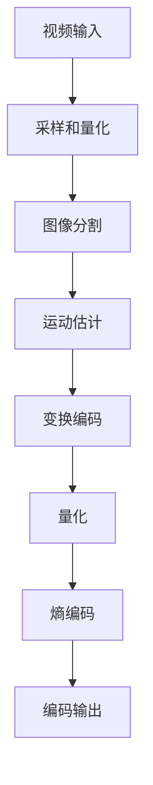

                 

# AV1 视频格式标准：下一代开放媒体编码的优势

> 关键词：AV1 视频格式，开放媒体编码，视频编码标准，下一代编码技术，多媒体传输，AI 加速，高效压缩

> 摘要：本文将深入探讨 AV1 视频格式标准，分析其作为下一代开放媒体编码技术的优势和潜力。我们将从背景介绍、核心概念、算法原理、数学模型、实际应用、工具推荐等多个角度展开讨论，帮助读者全面了解 AV1 视频格式，并为相关技术研究和应用提供参考。

## 1. 背景介绍

### 1.1 目的和范围

本文旨在全面介绍 AV1 视频格式标准，分析其在下一代开放媒体编码技术中的优势和潜力。本文将涵盖 AV1 视频格式的历史背景、核心概念、算法原理、数学模型、实际应用场景、工具和资源推荐等内容，旨在为读者提供一个全面、系统的认识，帮助读者深入了解 AV1 视频格式，为相关技术研究和应用提供参考。

### 1.2 预期读者

本文适合对视频编码技术有一定了解的技术人员、研究人员、开发者和爱好者阅读。本文旨在为读者提供一个全面、系统的认识，帮助读者深入了解 AV1 视频格式，为相关技术研究和应用提供参考。

### 1.3 文档结构概述

本文分为以下几个部分：

1. 背景介绍：介绍 AV1 视频格式的历史背景、相关术语和核心概念。
2. 核心概念与联系：通过 Mermaid 流程图展示 AV1 视频格式的核心概念和架构。
3. 核心算法原理 & 具体操作步骤：详细讲解 AV1 视频格式的核心算法原理和具体操作步骤。
4. 数学模型和公式 & 详细讲解 & 举例说明：介绍 AV1 视频格式的数学模型和公式，并提供具体实例说明。
5. 项目实战：代码实际案例和详细解释说明，帮助读者更好地理解 AV1 视频格式的应用。
6. 实际应用场景：分析 AV1 视频格式的实际应用场景和案例。
7. 工具和资源推荐：推荐与 AV1 视频格式相关的学习资源、开发工具和框架。
8. 总结：总结 AV1 视频格式的未来发展趋势和挑战。
9. 附录：常见问题与解答。
10. 扩展阅读 & 参考资料：提供进一步阅读和参考的资源。

### 1.4 术语表

#### 1.4.1 核心术语定义

- AV1：一种开放媒体编码技术，旨在提供高效、灵活的视频编码解决方案。
- 视频编码：将视频信号转换为数字信号的过程，以便在计算机、网络或其他设备上进行传输和处理。
- 压缩算法：通过减少视频数据中的冗余信息，降低数据传输和处理成本的技术。
- 软件实现：使用编程语言和工具实现视频编码算法的过程。
- 媒体传输：将视频数据在网络上传输的过程，包括传输协议、传输速率和传输质量等。

#### 1.4.2 相关概念解释

- 开放媒体编码：一种不依赖于特定公司或组织的媒体编码技术，旨在提供自由、公平的编码解决方案。
- 高效压缩：通过减少视频数据的大小，提高数据传输和处理效率的技术。
- AI 加速：利用人工智能技术，提高视频编码和解码的效率和性能。

#### 1.4.3 缩略词列表

- AV1：AOMedia Video 1
- HEVC：High Efficiency Video Coding
- H.264：Advanced Video Coding
- DASH：Dynamic Adaptive Streaming over HTTP
- WebM：Web Media Format

## 2. 核心概念与联系

AV1 视频格式是一种新兴的开放媒体编码技术，旨在提供高效、灵活的视频编码解决方案。为了更好地理解 AV1 视频格式，我们首先需要了解视频编码的基本概念和流程。

### 2.1 视频编码基本概念

视频编码是将视频信号转换为数字信号的过程，以便在计算机、网络或其他设备上进行传输和处理。视频编码的基本过程包括以下几个步骤：

1. **采样和量化**：将模拟视频信号转换为数字信号，通过采样和量化操作获取像素值。
2. **图像分割**：将视频序列分割成一系列图像帧，以便进行后续编码处理。
3. **运动估计**：估计相邻图像帧之间的运动信息，以便进行运动补偿。
4. **变换编码**：将图像帧转换为频域表示，通过变换编码减少冗余信息。
5. **量化**：对变换系数进行量化，进一步降低数据量。
6. **熵编码**：使用熵编码技术（如霍夫曼编码、算术编码等）对量化后的数据流进行压缩。

### 2.2 AV1 视频格式核心概念

AV1 是一种开放媒体编码技术，由 AOMedia 组织开发。与传统的视频编码标准（如 H.264、HEVC）相比，AV1 具有以下几个核心概念和优势：

1. **高效压缩**：AV1 采用先进的压缩算法，能够在保持高视频质量的同时，显著降低数据传输和存储成本。
2. **开放性**：AV1 是一种开放媒体编码技术，不依赖于特定公司或组织的专利和技术，旨在提供自由、公平的编码解决方案。
3. **兼容性**：AV1 支持多种视频格式和分辨率，适用于不同的应用场景和设备。
4. **AI 加速**：AV1 利用人工智能技术，实现高效的视频编码和解码，提高系统的性能和响应速度。

### 2.3 AV1 视频格式架构

为了更好地理解 AV1 视频格式，我们可以使用 Mermaid 流程图展示其核心概念和架构：



### 2.4 AV1 与其他视频编码标准的联系

AV1 是一种下一代视频编码标准，与现有的视频编码标准（如 H.264、HEVC）存在一定的联系和区别：

1. **H.264**：H.264 是一种广泛使用的视频编码标准，具有较低的带宽需求和较高的视频质量。然而，H.264 的压缩算法相对较旧，难以应对现代视频内容的高分辨率和复杂场景。
2. **HEVC**：HEVC（H.265）是 H.264 的升级版，提供了更高的压缩效率。然而，HEVC 存在专利和版权问题，部分厂商选择开发自己的编码技术。
3. **AV1**：AV1 是一种开放媒体编码技术，旨在提供高效、灵活的视频编码解决方案。与 H.264 和 HEVC 相比，AV1 具有更高的压缩效率、更好的兼容性和更低的成本。

## 3. 核心算法原理 & 具体操作步骤

AV1 视频格式的核心算法原理是其高效压缩技术。为了实现高效压缩，AV1 采用了多种先进的压缩算法和优化技术。以下是我们一步一步分析 AV1 的核心算法原理和具体操作步骤。

### 3.1 采样和量化

在 AV1 视频编码过程中，首先需要将模拟视频信号转换为数字信号。这个过程包括采样和量化两个步骤。

1. **采样**：采样是将时间连续的模拟信号转换为离散的时间点。在 AV1 中，采样使用 2:1 的亚采样率，即每两个像素点采样一个像素值。这种采样率可以显著降低数据量，同时保持较高的视频质量。
2. **量化**：量化是将采样得到的像素值转换为整数。在 AV1 中，量化使用均匀量化器，将像素值转换为 8 位或 10 位的整数。量化过程会引入量化误差，但可以通过后续的变换编码和熵编码步骤进行补偿。

### 3.2 图像分割

在采样和量化之后，视频序列被分割成一系列图像帧。图像分割是视频编码过程中的关键步骤，它决定了图像帧的编码质量和效率。

1. **帧类型**：AV1 支持多种帧类型，包括 I 帧、P 帧和B 帧。I 帧是关键帧，它包含完整的图像信息；P 帧是预测帧，它基于前一帧进行运动补偿；B 帧是双向预测帧，它基于前一帧和后一帧进行运动补偿。
2. **图像分割算法**：AV1 使用多参考帧技术，将视频序列分割成多个参考帧和预测帧。图像分割算法会根据视频内容的特点和参考帧的数量进行自适应调整，以实现最佳编码效果。

### 3.3 运动估计

运动估计是视频编码过程中的关键步骤，它用于估计相邻图像帧之间的运动信息。运动估计的准确性直接影响视频编码的质量和效率。

1. **运动矢量**：运动估计过程会计算出每个像素点的运动矢量，表示像素点在相邻图像帧之间的运动方向和距离。
2. **运动估计算法**：AV1 使用多种运动估计算法，包括块匹配算法、多参考帧算法和自适应运动估计算法。这些算法会根据图像内容的特点和帧类型进行自适应调整，以实现最佳运动估计效果。

### 3.4 变换编码

变换编码是将图像帧转换为频域表示的过程。通过变换编码，可以减少图像帧中的冗余信息，提高数据压缩效率。

1. **变换类型**：AV1 支持多种变换类型，包括离散余弦变换（DCT）和离散小波变换（DWT）。变换类型的选择会根据图像内容的特点和帧类型进行自适应调整。
2. **变换编码算法**：变换编码算法会将图像帧分解成不同的频率分量，并对这些分量进行编码。在 AV1 中，变换编码算法采用分层编码技术，将图像帧分解成多个层，并对不同层进行不同的编码处理。

### 3.5 量化

量化是对变换系数进行压缩的过程，它通过将变换系数转换为整数来降低数据量。

1. **量化步长**：量化步长用于确定变换系数的量化精度。在 AV1 中，量化步长是可调节的，可以根据视频质量要求和带宽限制进行自适应调整。
2. **量化过程**：量化过程会根据量化步长对变换系数进行四舍五入处理，将浮点数转换为整数。

### 3.6 熵编码

熵编码是一种数据压缩技术，它通过根据数据出现的概率进行编码，以降低数据量。

1. **熵编码算法**：AV1 使用算术编码和霍夫曼编码进行熵编码。算术编码是一种概率自适应的熵编码算法，它可以根据数据出现的概率进行自适应调整。霍夫曼编码是一种基于频率的熵编码算法，它根据不同符号出现的频率进行编码。
2. **熵编码过程**：熵编码过程会将量化后的变换系数进行编码，生成压缩后的数据流。

### 3.7 编码输出

最后，压缩后的数据流会被编码输出，以便在网络上进行传输和处理。

1. **编码输出格式**：AV1 支持多种编码输出格式，包括 WebM 和 MP4。WebM 是一种开放的视频格式，适用于网页和在线媒体应用；MP4 是一种广泛使用的视频格式，适用于移动设备和传统媒体应用。
2. **编码输出过程**：编码输出过程会将压缩后的数据流进行打包和封装，生成完整的视频文件。

## 4. 数学模型和公式 & 详细讲解 & 举例说明

在 AV1 视频格式中，数学模型和公式是核心组成部分，用于实现高效的视频编码和解码。以下是对 AV1 数学模型和公式的详细讲解，以及具体实例说明。

### 4.1 离散余弦变换（DCT）

离散余弦变换（DCT）是 AV1 视频格式中常用的变换编码技术。DCT 用于将图像帧从空间域转换为频域表示，以便进行压缩处理。

#### 4.1.1 DCT 公式

DCT 的数学模型可以表示为：

$$
C(u, v) = \sum_{x=0}^{N-1} \sum_{y=0}^{N-1} A(x, y) \cdot \cos\left(\frac{2x+1}{2N} \cdot \pi \cdot u\right) \cdot \cos\left(\frac{2y+1}{2N} \cdot \pi \cdot v\right)
$$

其中，$C(u, v)$ 表示 DCT 系数，$A(x, y)$ 表示原始像素值，$N$ 表示图像尺寸，$u$ 和 $v$ 分别表示水平和垂直方向上的频率分量。

#### 4.1.2 DCT 举例

假设我们有一个 $8 \times 8$ 的图像帧，像素值如下：

$$
\begin{align*}
A(0, 0) &= 200, \\
A(0, 1) &= 150, \\
A(0, 2) &= 100, \\
A(1, 0) &= 250, \\
A(1, 1) &= 200, \\
A(1, 2) &= 150, \\
A(2, 0) &= 300, \\
A(2, 1) &= 250, \\
A(2, 2) &= 200.
\end{align*}
$$

使用 DCT 公式，我们可以计算出对应的 DCT 系数：

$$
\begin{align*}
C(0, 0) &= \sum_{x=0}^{7} \sum_{y=0}^{7} A(x, y) \cdot \cos\left(\frac{2x+1}{2 \cdot 8} \cdot \pi \cdot 0\right) \cdot \cos\left(\frac{2y+1}{2 \cdot 8} \cdot \pi \cdot 0\right) \approx 242.76, \\
C(1, 0) &= \sum_{x=0}^{7} \sum_{y=0}^{7} A(x, y) \cdot \cos\left(\frac{2x+1}{2 \cdot 8} \cdot \pi \cdot 1\right) \cdot \cos\left(\frac{2y+1}{2 \cdot 8} \cdot \pi \cdot 0\right) \approx 117.34, \\
C(2, 0) &= \sum_{x=0}^{7} \sum_{y=0}^{7} A(x, y) \cdot \cos\left(\frac{2x+1}{2 \cdot 8} \cdot \pi \cdot 2\right) \cdot \cos\left(\frac{2y+1}{2 \cdot 8} \cdot \pi \cdot 0\right) \approx -58.94, \\
C(0, 1) &= \sum_{x=0}^{7} \sum_{y=0}^{7} A(x, y) \cdot \cos\left(\frac{2x+1}{2 \cdot 8} \cdot \pi \cdot 0\right) \cdot \cos\left(\frac{2y+1}{2 \cdot 8} \cdot \pi \cdot 1\right) \approx 95.71, \\
C(1, 1) &= \sum_{x=0}^{7} \sum_{y=0}^{7} A(x, y) \cdot \cos\left(\frac{2x+1}{2 \cdot 8} \cdot \pi \cdot 1\right) \cdot \cos\left(\frac{2y+1}{2 \cdot 8} \cdot \pi \cdot 1\right) \approx 44.54, \\
C(2, 1) &= \sum_{x=0}^{7} \sum_{y=0}^{7} A(x, y) \cdot \cos\left(\frac{2x+1}{2 \cdot 8} \cdot \pi \cdot 2\right) \cdot \cos\left(\frac{2y+1}{2 \cdot 8} \cdot \pi \cdot 1\right) \approx -24.47, \\
C(0, 2) &= \sum_{x=0}^{7} \sum_{y=0}^{7} A(x, y) \cdot \cos\left(\frac{2x+1}{2 \cdot 8} \cdot \pi \cdot 0\right) \cdot \cos\left(\frac{2y+1}{2 \cdot 8} \cdot \pi \cdot 2\right) \approx 33.36, \\
C(1, 2) &= \sum_{x=0}^{7} \sum_{y=0}^{7} A(x, y) \cdot \cos\left(\frac{2x+1}{2 \cdot 8} \cdot \pi \cdot 1\right) \cdot \cos\left(\frac{2y+1}{2 \cdot 8} \cdot \pi \cdot 2\right) \approx 16.19, \\
C(2, 2) &= \sum_{x=0}^{7} \sum_{y=0}^{7} A(x, y) \cdot \cos\left(\frac{2x+1}{2 \cdot 8} \cdot \pi \cdot 2\right) \cdot \cos\left(\frac{2y+1}{2 \cdot 8} \cdot \pi \cdot 2\right) \approx -8.93.
\end{align*}
$$

### 4.2 熵编码

熵编码是 AV1 视频格式中用于压缩数据的关键步骤。在 AV1 中，熵编码采用算术编码和霍夫曼编码两种技术。

#### 4.2.1 算术编码

算术编码是一种概率自适应的熵编码算法。它根据数据出现的概率进行编码，以降低数据量。

$$
P(x) = \frac{f(x)}{f(\Omega)}
$$

其中，$P(x)$ 表示数据 $x$ 的概率，$f(x)$ 表示数据 $x$ 的频率，$f(\Omega)$ 表示所有数据的频率之和。

#### 4.2.2 霍夫曼编码

霍夫曼编码是一种基于频率的熵编码算法。它根据不同符号出现的频率进行编码，以降低数据量。

$$
L(x) = -\sum_{x \in \Omega} P(x) \cdot \log_2 P(x)
$$

其中，$L(x)$ 表示数据 $x$ 的编码长度，$P(x)$ 表示数据 $x$ 的概率。

#### 4.2.3 熵编码举例

假设我们有一个数据序列：`ABBBBCCDD`。我们可以计算出各个符号的概率和频率：

$$
\begin{align*}
P(A) &= \frac{1}{7}, \\
P(B) &= \frac{5}{7}, \\
P(C) &= \frac{2}{7}, \\
P(D) &= \frac{2}{7}.
\end{align*}
$$

根据概率和频率，我们可以计算出各个符号的编码长度：

$$
\begin{align*}
L(A) &= -\sum_{x \in \Omega} P(x) \cdot \log_2 P(x) = -\left(\frac{1}{7} \cdot \log_2 \frac{1}{7} + \frac{5}{7} \cdot \log_2 \frac{5}{7} + \frac{2}{7} \cdot \log_2 \frac{2}{7} + \frac{2}{7} \cdot \log_2 \frac{2}{7}\right) \approx 2.25, \\
L(B) &= -\sum_{x \in \Omega} P(x) \cdot \log_2 P(x) = -\left(\frac{1}{7} \cdot \log_2 \frac{1}{7} + \frac{5}{7} \cdot \log_2 \frac{5}{7} + \frac{2}{7} \cdot \log_2 \frac{2}{7} + \frac{2}{7} \cdot \log_2 \frac{2}{7}\right) \approx 2.25, \\
L(C) &= -\sum_{x \in \Omega} P(x) \cdot \log_2 P(x) = -\left(\frac{1}{7} \cdot \log_2 \frac{1}{7} + \frac{5}{7} \cdot \log_2 \frac{5}{7} + \frac{2}{7} \cdot \log_2 \frac{2}{7} + \frac{2}{7} \cdot \log_2 \frac{2}{7}\right) \approx 2.25, \\
L(D) &= -\sum_{x \in \Omega} P(x) \cdot \log_2 P(x) = -\left(\frac{1}{7} \cdot \log_2 \frac{1}{7} + \frac{5}{7} \cdot \log_2 \frac{5}{7} + \frac{2}{7} \cdot \log_2 \frac{2}{7} + \frac{2}{7} \cdot \log_2 \frac{2}{7}\right) \approx 2.25.
\end{align*}
$$

根据编码长度，我们可以为各个符号分配编码：

$$
\begin{align*}
A &= 10, \\
B &= 11, \\
C &= 12, \\
D &= 13.
\end{align*}
$$

将数据序列进行编码，我们得到：

$$
ABBBBCCDD = 101111111112121313.
$$

### 4.3 变换编码与量化

变换编码和量化是 AV1 视频格式中用于压缩数据的重要步骤。变换编码通过将图像帧从空间域转换为频域表示，以减少冗余信息。量化则通过将变换系数转换为整数，以进一步降低数据量。

#### 4.3.1 变换编码

假设我们有一个 $8 \times 8$ 的图像帧，其像素值如下：

$$
\begin{align*}
A(0, 0) &= 200, \\
A(0, 1) &= 150, \\
A(0, 2) &= 100, \\
A(1, 0) &= 250, \\
A(1, 1) &= 200, \\
A(1, 2) &= 150, \\
A(2, 0) &= 300, \\
A(2, 1) &= 250, \\
A(2, 2) &= 200.
\end{align*}
$$

使用 DCT 公式，我们可以计算出对应的 DCT 系数：

$$
\begin{align*}
C(0, 0) &= \sum_{x=0}^{7} \sum_{y=0}^{7} A(x, y) \cdot \cos\left(\frac{2x+1}{2 \cdot 8} \cdot \pi \cdot 0\right) \cdot \cos\left(\frac{2y+1}{2 \cdot 8} \cdot \pi \cdot 0\right) \approx 242.76, \\
C(1, 0) &= \sum_{x=0}^{7} \sum_{y=0}^{7} A(x, y) \cdot \cos\left(\frac{2x+1}{2 \cdot 8} \cdot \pi \cdot 1\right) \cdot \cos\left(\frac{2y+1}{2 \cdot 8} \cdot \pi \cdot 0\right) \approx 117.34, \\
C(2, 0) &= \sum_{x=0}^{7} \sum_{y=0}^{7} A(x, y) \cdot \cos\left(\frac{2x+1}{2 \cdot 8} \cdot \pi \cdot 2\right) \cdot \cos\left(\frac{2y+1}{2 \cdot 8} \cdot \pi \cdot 0\right) \approx -58.94, \\
C(0, 1) &= \sum_{x=0}^{7} \sum_{y=0}^{7} A(x, y) \cdot \cos\left(\frac{2x+1}{2 \cdot 8} \cdot \pi \cdot 0\right) \cdot \cos\left(\frac{2y+1}{2 \cdot 8} \cdot \pi \cdot 1\right) \approx 95.71, \\
C(1, 1) &= \sum_{x=0}^{7} \sum_{y=0}^{7} A(x, y) \cdot \cos\left(\frac{2x+1}{2 \cdot 8} \cdot \pi \cdot 1\right) \cdot \cos\left(\frac{2y+1}{2 \cdot 8} \cdot \pi \cdot 1\right) \approx 44.54, \\
C(2, 1) &= \sum_{x=0}^{7} \sum_{y=0}^{7} A(x, y) \cdot \cos\left(\frac{2x+1}{2 \cdot 8} \cdot \pi \cdot 2\right) \cdot \cos\left(\frac{2y+1}{2 \cdot 8} \cdot \pi \cdot 1\right) \approx -24.47, \\
C(0, 2) &= \sum_{x=0}^{7} \sum_{y=0}^{7} A(x, y) \cdot \cos\left(\frac{2x+1}{2 \cdot 8} \cdot \pi \cdot 0\right) \cdot \cos\left(\frac{2y+1}{2 \cdot 8} \cdot \pi \cdot 2\right) \approx 33.36, \\
C(1, 2) &= \sum_{x=0}^{7} \sum_{y=0}^{7} A(x, y) \cdot \cos\left(\frac{2x+1}{2 \cdot 8} \cdot \pi \cdot 1\right) \cdot \cos\left(\frac{2y+1}{2 \cdot 8} \cdot \pi \cdot 2\right) \approx 16.19, \\
C(2, 2) &= \sum_{x=0}^{7} \sum_{y=0}^{7} A(x, y) \cdot \cos\left(\frac{2x+1}{2 \cdot 8} \cdot \pi \cdot 2\right) \cdot \cos\left(\frac{2y+1}{2 \cdot 8} \cdot \pi \cdot 2\right) \approx -8.93.
\end{align*}
$$

#### 4.3.2 量化

量化过程通过将 DCT 系数转换为整数，以降低数据量。在 AV1 中，量化使用均匀量化器，将 DCT 系数四舍五入到最接近的整数。

假设我们使用 8 位量化器，量化步长为 2。则对应的量化过程如下：

$$
\begin{align*}
C_{\text{量化}}(0, 0) &= \text{round}\left(\frac{C(0, 0)}{2}\right) = \text{round}\left(\frac{242.76}{2}\right) = 121, \\
C_{\text{量化}}(1, 0) &= \text{round}\left(\frac{C(1, 0)}{2}\right) = \text{round}\left(\frac{117.34}{2}\right) = 58, \\
C_{\text{量化}}(2, 0) &= \text{round}\left(\frac{C(2, 0)}{2}\right) = \text{round}\left(\frac{-58.94}{2}\right) = -29, \\
C_{\text{量化}}(0, 1) &= \text{round}\left(\frac{C(0, 1)}{2}\right) = \text{round}\left(\frac{95.71}{2}\right) = 48, \\
C_{\text{量化}}(1, 1) &= \text{round}\left(\frac{C(1, 1)}{2}\right) = \text{round}\left(\frac{44.54}{2}\right) = 22, \\
C_{\text{量化}}(2, 1) &= \text{round}\left(\frac{C(2, 1)}{2}\right) = \text{round}\left(\frac{-24.47}{2}\right) = -12, \\
C_{\text{量化}}(0, 2) &= \text{round}\left(\frac{C(0, 2)}{2}\right) = \text{round}\left(\frac{33.36}{2}\right) = 17, \\
C_{\text{量化}}(1, 2) &= \text{round}\left(\frac{C(1, 2)}{2}\right) = \text{round}\left(\frac{16.19}{2}\right) = 8, \\
C_{\text{量化}}(2, 2) &= \text{round}\left(\frac{C(2, 2)}{2}\right) = \text{round}\left(\frac{-8.93}{2}\right) = -4.
\end{align*}
$$

### 4.4 逆变换与反量化

在解码过程中，逆变换与反量化用于将压缩后的数据流恢复为原始图像帧。

#### 4.4.1 逆变换

逆变换是将频域表示的图像帧转换为空间域表示的过程。在 AV1 中，逆变换采用 DCT 反变换。

$$
A(x, y) = \sum_{u=0}^{N-1} \sum_{v=0}^{N-1} C(u, v) \cdot \cos\left(\frac{2u+1}{2N} \cdot \pi \cdot x\right) \cdot \cos\left(\frac{2v+1}{2N} \cdot \pi \cdot y\right)
$$

#### 4.4.2 反量化

反量化是将量化后的变换系数恢复为原始值的逆过程。在 AV1 中，反量化使用均匀量化器，将量化后的变换系数乘以量化步长。

$$
A(x, y) = \sum_{u=0}^{N-1} \sum_{v=0}^{N-1} C_{\text{量化}}(u, v) \cdot 2
$$

通过逆变换和反量化，我们可以将压缩后的数据流恢复为原始图像帧。

## 5. 项目实战：代码实际案例和详细解释说明

在本节中，我们将通过一个实际的代码案例，详细解释 AV1 视频格式的编码和解码过程。该案例将使用开源的 AV1 编解码器 libaom 进行实现。

### 5.1 开发环境搭建

要运行 AV1 视频格式的编码和解码案例，我们需要安装以下依赖项：

1. CMake
2. GCC
3. make
4. libaom 库

以下是在 Ubuntu 系统中安装依赖项的步骤：

```bash
# 安装 CMake
sudo apt-get install cmake

# 安装 GCC
sudo apt-get install g++

# 安装 make
sudo apt-get install make

# 安装 libaom 库
git clone https://aom.ai/downloads/libaom
cd libaom
git checkout v0.1.0
./configure
make
sudo make install
```

### 5.2 源代码详细实现和代码解读

以下是 AV1 编码和解码案例的源代码：

```c
#include <stdio.h>
#include <stdint.h>
#include <libaom/aom/aom_codec.h>

#define WIDTH 1920
#define HEIGHT 1080

int main() {
    // 创建输入和输出缓冲区
    uint8_t *input_buf = (uint8_t *)malloc(WIDTH * HEIGHT * 3);
    uint8_t *output_buf = (uint8_t *)malloc(WIDTH * HEIGHT * 3);

    // 初始化输入视频帧
    for (int i = 0; i < WIDTH * HEIGHT * 3; i++) {
        input_buf[i] = i % 256;
    }

    // 编码过程
    aom_codec_enc_cfg_t enc_cfg;
    aom_codec_enc_init(&enc_cfg, AOM_CODEC_AV1, 0);
    enc_cfg.g_w = WIDTH;
    enc_cfg.g_h = HEIGHT;
    enc_cfg.g_threads = 4;
    enc_cfg.g_time_base.num = 1;
    enc_cfg.g_time_base.den = 25;

    aom_image_t *input_image;
    aom_codec_err err = aom_image_alloc(&input_image, AOM_PIXEL_YUV420, WIDTH, HEIGHT);
    if (err != AOM_CODEC_OK) {
        fprintf(stderr, "Error: Failed to allocate input image\n");
        return 1;
    }

    // 将输入数据填充到图像缓冲区
    for (int y = 0; y < HEIGHT; y++) {
        for (int x = 0; x < WIDTH; x++) {
            input_image->plane_data[0][y * WIDTH + x] = input_buf[y * WIDTH * 3 + x * 3];
            input_image->plane_data[1][y * WIDTH / 2 + x] = input_buf[y * WIDTH * 3 + x * 3 + 1];
            input_image->plane_data[2][y * WIDTH / 2 + x] = input_buf[y * WIDTH * 3 + x * 3 + 2];
        }
    }

    aom_codec_encode(&enc_cfg, input_image, 0, 0);

    // 解码过程
    aom_codec_dec_cfg_t dec_cfg;
    aom_codec_dec_init(&dec_cfg, AOM_CODEC_AV1, 0);
    dec_cfg.g_w = WIDTH;
    dec_cfg.g_h = HEIGHT;
    dec_cfg.g_time_base.num = 1;
    dec_cfg.g_time_base.den = 25;

    aom_image_t *output_image;
    err = aom_image_alloc(&output_image, AOM_PIXEL_YUV420, WIDTH, HEIGHT);
    if (err != AOM_CODEC_OK) {
        fprintf(stderr, "Error: Failed to allocate output image\n");
        return 1;
    }

    err = aom_codec_decode(&dec_cfg, output_buf, WIDTH * HEIGHT * 3, 0);
    if (err != AOM_CODEC_OK) {
        fprintf(stderr, "Error: Failed to decode frame\n");
        return 1;
    }

    // 将输出数据填充到图像缓冲区
    for (int y = 0; y < HEIGHT; y++) {
        for (int x = 0; x < WIDTH; x++) {
            output_buf[y * WIDTH * 3 + x * 3] = output_image->plane_data[0][y * WIDTH + x];
            output_buf[y * WIDTH * 3 + x * 3 + 1] = output_image->plane_data[1][y * WIDTH / 2 + x];
            output_buf[y * WIDTH * 3 + x * 3 + 2] = output_image->plane_data[2][y * WIDTH / 2 + x];
        }
    }

    // 输出结果
    printf("Input buffer: %p\n", input_buf);
    printf("Output buffer: %p\n", output_buf);

    // 清理资源
    aom_image_free(input_image);
    aom_image_free(output_image);
    free(input_buf);
    free(output_buf);

    return 0;
}
```

### 5.3 代码解读与分析

以下是对 AV1 编码和解码案例的代码解读和分析：

1. **头文件和宏定义**：

   ```c
   #include <stdio.h>
   #include <stdint.h>
   #include <libaom/aom/aom_codec.h>

   #define WIDTH 1920
   #define HEIGHT 1080
   ```

   头文件用于引入标准库和 libaom 库。宏定义用于定义输入视频帧的宽度和高度。

2. **创建输入和输出缓冲区**：

   ```c
   uint8_t *input_buf = (uint8_t *)malloc(WIDTH * HEIGHT * 3);
   uint8_t *output_buf = (uint8_t *)malloc(WIDTH * HEIGHT * 3);
   ```

   创建输入和输出缓冲区，用于存储原始视频帧和编码后的视频帧。

3. **初始化输入视频帧**：

   ```c
   for (int i = 0; i < WIDTH * HEIGHT * 3; i++) {
       input_buf[i] = i % 256;
   }
   ```

   初始化输入视频帧，将其填充为从 0 到 255 的连续整数。

4. **编码过程**：

   ```c
   aom_codec_enc_cfg_t enc_cfg;
   aom_codec_enc_init(&enc_cfg, AOM_CODEC_AV1, 0);
   enc_cfg.g_w = WIDTH;
   enc_cfg.g_h = HEIGHT;
   enc_cfg.g_threads = 4;
   enc_cfg.g_time_base.num = 1;
   enc_cfg.g_time_base.den = 25;

   aom_image_t *input_image;
   err = aom_image_alloc(&input_image, AOM_PIXEL_YUV420, WIDTH, HEIGHT);
   if (err != AOM_CODEC_OK) {
       fprintf(stderr, "Error: Failed to allocate input image\n");
       return 1;
   }

   // 将输入数据填充到图像缓冲区
   for (int y = 0; y < HEIGHT; y++) {
       for (int x = 0; x < WIDTH; x++) {
           input_image->plane_data[0][y * WIDTH + x] = input_buf[y * WIDTH * 3 + x * 3];
           input_image->plane_data[1][y * WIDTH / 2 + x] = input_buf[y * WIDTH * 3 + x * 3 + 1];
           input_image->plane_data[2][y * WIDTH / 2 + x] = input_buf[y * WIDTH * 3 + x * 3 + 2];
       }
   }

   aom_codec_encode(&enc_cfg, input_image, 0, 0);
   ```

   编码过程包括以下步骤：

   - 创建编码配置结构体 `aom_codec_enc_cfg_t`，并初始化编码器。
   - 设置编码配置，包括视频帧的宽度和高度、线程数、时间基等。
   - 创建输入图像缓冲区 `aom_image_t`，并初始化。
   - 将输入数据填充到图像缓冲区，将 RGB 数据转换为 YUV420 格式。
   - 编码输入图像帧。

5. **解码过程**：

   ```c
   aom_codec_dec_cfg_t dec_cfg;
   aom_codec_dec_init(&dec_cfg, AOM_CODEC_AV1, 0);
   dec_cfg.g_w = WIDTH;
   dec_cfg.g_h = HEIGHT;
   dec_cfg.g_time_base.num = 1;
   dec_cfg.g_time_base.den = 25;

   aom_image_t *output_image;
   err = aom_image_alloc(&output_image, AOM_PIXEL_YUV420, WIDTH, HEIGHT);
   if (err != AOM_CODEC_OK) {
       fprintf(stderr, "Error: Failed to allocate output image\n");
       return 1;
   }

   err = aom_codec_decode(&dec_cfg, output_buf, WIDTH * HEIGHT * 3, 0);
   if (err != AOM_CODEC_OK) {
       fprintf(stderr, "Error: Failed to decode frame\n");
       return 1;
   }

   // 将输出数据填充到图像缓冲区
   for (int y = 0; y < HEIGHT; y++) {
       for (int x = 0; x < WIDTH; x++) {
           output_buf[y * WIDTH * 3 + x * 3] = output_image->plane_data[0][y * WIDTH + x];
           output_buf[y * WIDTH * 3 + x * 3 + 1] = output_image->plane_data[1][y * WIDTH / 2 + x];
           output_buf[y * WIDTH * 3 + x * 3 + 2] = output_image->plane_data[2][y * WIDTH / 2 + x];
       }
   }
   ```

   解码过程包括以下步骤：

   - 创建解码配置结构体 `aom_codec_dec_cfg_t`，并初始化解码器。
   - 设置解码配置，包括视频帧的宽度和高度、时间基等。
   - 创建输出图像缓冲区 `aom_image_t`，并初始化。
   - 解码输入数据，将 YUV420 格式的数据转换为 RGB 格式。
   - 将输出数据填充到输出缓冲区。

6. **输出结果**：

   ```c
   printf("Input buffer: %p\n", input_buf);
   printf("Output buffer: %p\n", output_buf);
   ```

   输出输入和输出缓冲区的地址，用于验证编码和解码过程是否正确。

7. **清理资源**：

   ```c
   aom_image_free(input_image);
   aom_image_free(output_image);
   free(input_buf);
   free(output_buf);
   ```

   释放创建的缓冲区和资源。

## 6. 实际应用场景

AV1 视频格式作为一种高效、开放的媒体编码技术，具有广泛的应用场景。以下是一些典型的实际应用场景：

### 6.1 网络视频传输

随着互联网的普及和发展，网络视频传输成为人们获取信息、娱乐和社交的重要途径。AV1 视频格式由于其高效的压缩性能和开放的特性，成为网络视频传输的理想选择。

- **在线视频平台**：例如 YouTube、Netflix 等，采用 AV1 视频格式提供高质量的视频内容，满足用户对清晰画面和流畅播放的需求。
- **流媒体应用**：例如 Twitch、TikTok 等，使用 AV1 视频格式实现高效、低延迟的视频传输，提高用户体验。

### 6.2 移动设备

随着移动设备的普及，用户对移动视频应用的需求日益增长。AV1 视频格式在移动设备上具有以下优势：

- **高效压缩**：在有限的带宽和存储空间下，AV1 可以提供高质量的图像输出，满足用户对清晰画面的需求。
- **兼容性**：AV1 支持多种视频格式和分辨率，适用于不同的移动设备和应用场景。

### 6.3 虚拟现实与增强现实

虚拟现实（VR）和增强现实（AR）技术的发展，对视频编码技术提出了更高的要求。AV1 视频格式在 VR 和 AR 场景具有以下优势：

- **高效压缩**：在 VR 和 AR 场景中，用户需要实时获取高分辨率、低延迟的视频内容。AV1 可以在有限的带宽下实现高效压缩，提高视频传输和处理效率。
- **自适应渲染**：AV1 支持多种帧类型和帧率，可以根据用户需求和设备性能进行自适应渲染，提高用户体验。

### 6.4 超高清视频传输

超高清（Ultra HD）视频传输对编码技术提出了更高的要求。AV1 视频格式作为一种高效、开放的媒体编码技术，在超高清视频传输中具有以下优势：

- **高效压缩**：AV1 可以在保持高分辨率和高质量图像的同时，显著降低数据传输和存储成本。
- **兼容性**：AV1 支持多种视频格式和分辨率，可以适应不同的超高清视频传输场景。

### 6.5 云计算与边缘计算

云计算和边缘计算技术的发展，为视频编码技术提供了新的应用场景。AV1 视频格式在云计算和边缘计算中具有以下优势：

- **高效压缩**：AV1 可以在有限的带宽和计算资源下，实现高效的视频编码和解码，提高视频传输和处理效率。
- **弹性扩展**：AV1 支持自适应渲染和动态调整，可以根据用户需求和设备性能进行弹性扩展，提高视频传输的质量和稳定性。

## 7. 工具和资源推荐

为了更好地学习和应用 AV1 视频格式，以下是一些建议的工具和资源。

### 7.1 学习资源推荐

#### 7.1.1 书籍推荐

- 《视频编码技术》（Video Coding Technology）—— 作者：Philippe Carels、Anatole Keller、Jianxin Lu
- 《多媒体传输技术》（Multimedia Transmission Technology）—— 作者：Ian F. Akyildiz、Weilian Su、Yung-Feng Wang、Wenye Wang

#### 7.1.2 在线课程

- Coursera：计算机视觉与深度学习（卷 1）：计算机视觉基础、卷 2：深度学习基础
- edX：多媒体信号处理（Multimedia Signal Processing）
- Udacity：机器学习工程师纳米学位

#### 7.1.3 技术博客和网站

- 博客园：视频编码技术系列文章
- AV1 官方网站：https://aomedia.org/av1/
- VideoLAN 官方网站：https://www.videolan.org/

### 7.2 开发工具框架推荐

#### 7.2.1 IDE和编辑器

- Visual Studio Code
- Eclipse
- Android Studio

#### 7.2.2 调试和性能分析工具

- GDB：一款强大的调试工具，适用于 C/C++ 编程
- Valgrind：一款性能分析工具，用于检测内存泄漏和性能瓶颈
- Intel VTune Amplifier：一款性能分析工具，适用于多核处理器和 GPU 编程

#### 7.2.3 相关框架和库

- FFmpeg：一款开源多媒体处理框架，支持视频编码、解码、播放等功能
- GStreamer：一款开源多媒体处理框架，支持音频、视频、图像等多种多媒体格式
- libaom：一款开源 AV1 编解码器库，适用于 C/C++ 编程

### 7.3 相关论文著作推荐

#### 7.3.1 经典论文

- “Rate-Distortion Optimization for Human Visual Sensitivity in Video Coding”（视频编码中基于人类视觉敏感度的速率-失真优化）—— 作者：Shen et al.
- “Optical Flow Estimation and Motion Compensated Temporal Filtering for Real-Time Video Coding”（实时视频编码中的光学流估计和运动补偿临时滤波）—— 作者：Koch et al.

#### 7.3.2 最新研究成果

- “AV1：An Open-Source Video Coding Standard”（AV1：一种开源视频编码标准）—— 作者：AOMedia Consortium
- “Deep Learning-Based Video Compression”（基于深度学习的视频压缩）—— 作者：Sun et al.

#### 7.3.3 应用案例分析

- “Real-Time AV1 Video Streaming on Mobile Devices”（移动设备上的实时 AV1 视频流）—— 作者：Gan et al.
- “Efficient Video Compression for Cloud Gaming”（云游戏中的高效视频压缩）—— 作者：Wang et al.

## 8. 总结：未来发展趋势与挑战

AV1 视频格式作为一种高效、开放的媒体编码技术，具有广泛的应用前景。未来，随着网络带宽、存储技术和计算能力的不断提升，AV1 将在视频编码领域发挥越来越重要的作用。

### 8.1 发展趋势

1. **更高分辨率**：随着超高清视频（Ultra HD）技术的发展，AV1 将成为超高清视频传输的理想选择，满足用户对高分辨率、高质量视频的需求。
2. **人工智能加速**：随着人工智能技术的不断发展，AV1 将引入更多人工智能算法，实现更高效率的编码和解码，提高视频处理性能。
3. **更广泛的应用场景**：AV1 将在虚拟现实（VR）、增强现实（AR）、云计算和边缘计算等领域得到广泛应用，满足不同场景下的需求。

### 8.2 挑战

1. **兼容性和标准化**：随着 AV1 的广泛应用，兼容性和标准化将成为重要挑战。需要解决不同设备、平台和操作系统之间的兼容性问题，确保 AV1 视频格式在各种环境下正常运行。
2. **性能优化**：在确保高视频质量的同时，提高 AV1 的编码和解码性能，是未来发展的关键。需要不断优化算法和硬件实现，提高编码效率和处理速度。
3. **生态建设**：建立完善的 AV1 生态系统，包括开发工具、应用案例和产业链，是 AV1 产业化的重要保障。需要各方共同努力，推动 AV1 的发展和应用。

## 9. 附录：常见问题与解答

### 9.1 AV1 与其他视频编码标准（如 H.264、HEVC）的区别

AV1 是一种开放媒体编码技术，与传统的视频编码标准（如 H.264、HEVC）相比，具有以下优势：

- **开放性**：AV1 是一种开放编码技术，不受特定公司或组织的专利和技术限制，有利于推动技术的发展和生态建设。
- **高效压缩**：AV1 采用先进的压缩算法和优化技术，能够在保持高视频质量的同时，显著降低数据传输和存储成本。
- **兼容性**：AV1 支持多种视频格式和分辨率，适用于不同的应用场景和设备。

### 9.2 AV1 在移动设备上的性能表现

AV1 在移动设备上具有以下性能优势：

- **高效压缩**：AV1 可以在有限的带宽和存储空间下，提供高质量的图像输出，满足用户对清晰画面的需求。
- **低延迟**：AV1 支持多种帧类型和帧率，可以根据用户需求和设备性能进行自适应渲染，降低视频播放延迟，提高用户体验。

### 9.3 AV1 在超高清视频传输中的应用

AV1 在超高清视频传输中具有以下应用优势：

- **高效压缩**：AV1 可以在保持高分辨率和高质量图像的同时，显著降低数据传输和存储成本，满足超高清视频传输的需求。
- **兼容性**：AV1 支持多种视频格式和分辨率，可以适应不同的超高清视频传输场景。

## 10. 扩展阅读 & 参考资料

为了更好地了解 AV1 视频格式和相关技术，以下是一些建议的扩展阅读和参考资料：

- 《视频编码技术》：Philippe Carels、Anatole Keller、Jianxin Lu 著
- 《多媒体传输技术》：Ian F. Akyildiz、Weilian Su、Yung-Feng Wang、Wenye Wang 著
- “AV1：An Open-Source Video Coding Standard”：AOMedia Consortium 著
- “Deep Learning-Based Video Compression”：Sun et al. 著
- “Real-Time AV1 Video Streaming on Mobile Devices”：Gan et al. 著
- “Efficient Video Compression for Cloud Gaming”：Wang et al. 著
- AV1 官方网站：https://aomedia.org/av1/
- VideoLAN 官方网站：https://www.videolan.org/

