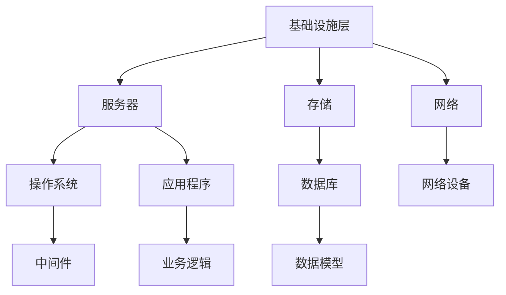

                 

# AWS 云服务：EC2、S3 和 RDS

> 关键词：Amazon Web Services, AWS, EC2, S3, RDS, 云计算, 虚拟服务器, 存储服务, 数据库服务

> 摘要：本文将深入探讨 AWS（Amazon Web Services）的三大核心服务：EC2、S3 和 RDS。我们将详细解释每个服务的功能、优势、使用方法，并通过实际案例进行操作演示，帮助读者全面了解并掌握这些服务在云计算中的应用。

## 1. 背景介绍

### 1.1 目的和范围

本文旨在为读者提供关于 AWS（Amazon Web Services）的 EC2、S3 和 RDS 三大服务的全面了解。我们将从基础概念出发，逐步深入到每个服务的具体应用场景，通过实际案例和实践操作，帮助读者全面掌握这些服务在云计算环境中的使用。

### 1.2 预期读者

本文适合对云计算和 AWS 服务有一定了解的读者，包括开发人员、系统管理员、数据科学家以及技术管理人员。通过本文的阅读，读者将能够：

- 了解 EC2、S3 和 RDS 的基本概念和功能；
- 掌握如何使用这些服务搭建云计算环境；
- 理解这些服务的实际应用场景和优势；
- 获得实践操作的经验和技巧。

### 1.3 文档结构概述

本文将分为以下几部分：

- **背景介绍**：介绍文章的目的、预期读者和文档结构；
- **核心概念与联系**：介绍 EC2、S3 和 RDS 的基本概念和架构；
- **核心算法原理 & 具体操作步骤**：详细讲解 EC2、S3 和 RDS 的算法原理和具体操作步骤；
- **数学模型和公式 & 详细讲解 & 举例说明**：介绍与 EC2、S3 和 RDS 相关的数学模型和公式，并给出实际应用案例；
- **项目实战：代码实际案例和详细解释说明**：通过实际案例展示如何使用 EC2、S3 和 RDS 搭建云计算环境；
- **实际应用场景**：分析 EC2、S3 和 RDS 在实际项目中的应用场景；
- **工具和资源推荐**：推荐学习资源、开发工具和框架；
- **总结：未来发展趋势与挑战**：总结 EC2、S3 和 RDS 的未来发展趋势和面临的挑战；
- **附录：常见问题与解答**：解答读者可能遇到的常见问题；
- **扩展阅读 & 参考资料**：提供进一步学习的资料和参考。

### 1.4 术语表

#### 1.4.1 核心术语定义

- **AWS（Amazon Web Services）**：亚马逊提供的云服务，包括计算、存储、数据库、网络等多种服务。
- **EC2（Elastic Compute Cloud）**：AWS 提供的虚拟服务器服务，用于运行应用程序和网站。
- **S3（Simple Storage Service）**：AWS 提供的对象存储服务，用于存储和检索大量数据。
- **RDS（Relational Database Service）**：AWS 提供的关系型数据库服务，支持 MySQL、PostgreSQL、Oracle 和 SQL Server 等数据库。

#### 1.4.2 相关概念解释

- **云计算**：将计算资源（如服务器、存储和网络）以服务的形式提供给用户，用户可以根据需求租用资源，无需购买和部署物理硬件。
- **虚拟化**：将物理硬件资源抽象化，虚拟化为多个虚拟机，实现资源的高效利用和灵活调度。
- **弹性扩展**：根据实际需求自动增加或减少计算资源，保证系统的高可用性和性能。

#### 1.4.3 缩略词列表

- **IaaS**：基础设施即服务（Infrastructure as a Service）
- **PaaS**：平台即服务（Platform as a Service）
- **SaaS**：软件即服务（Software as a Service）

## 2. 核心概念与联系

在介绍 EC2、S3 和 RDS 之前，我们先来探讨云计算的基本概念和架构。

### 2.1 云计算基本概念

云计算是一种通过网络提供计算资源（如服务器、存储、网络等）的服务模式。云计算可分为三种主要服务模式：

- **IaaS（基础设施即服务）**：用户租用物理硬件资源，如服务器、存储和网络，自行部署和管理操作系统、应用程序等。
- **PaaS（平台即服务）**：用户在平台上开发、测试和部署应用程序，无需管理底层硬件资源。
- **SaaS（软件即服务）**：用户通过网络访问软件应用，无需购买和安装软件。

### 2.2 云计算架构

云计算架构包括以下三层：

- **基础设施层**：包括服务器、存储、网络等硬件资源。
- **平台层**：提供操作系统、数据库、中间件等软件资源。
- **应用层**：用户部署和运行应用程序。

### 2.3 EC2、S3 和 RDS 的关系

EC2、S3 和 RDS 是 AWS 提供的三大核心服务，它们分别负责计算、存储和数据库。

- **EC2（Elastic Compute Cloud）**：提供虚拟服务器，用于运行应用程序和网站。EC2 支持多种实例类型，如通用型、计算优化型、内存优化型和存储优化型。
- **S3（Simple Storage Service）**：提供对象存储服务，用于存储和检索大量数据。S3 具有高可用性、持久性和弹性，适用于各种应用场景。
- **RDS（Relational Database Service）**：提供关系型数据库服务，支持 MySQL、PostgreSQL、Oracle 和 SQL Server 等数据库。RDS 具有自动备份、扩展和监控等功能，简化了数据库运维。

### 2.4 Mermaid 流程图

以下是 EC2、S3 和 RDS 的 Mermaid 流程图：



## 3. 核心算法原理 & 具体操作步骤

### 3.1 EC2 算法原理与操作步骤

EC2（Elastic Compute Cloud）是一种提供虚拟服务器的云计算服务。以下是 EC2 的算法原理和操作步骤：

#### 3.1.1 算法原理

- **虚拟化技术**：EC2 使用虚拟化技术将物理硬件资源抽象化为虚拟机（VM），实现资源的高效利用和灵活调度。
- **弹性扩展**：EC2 具有自动扩展功能，根据实际需求自动增加或减少虚拟机数量，保证系统的高可用性和性能。

#### 3.1.2 操作步骤

1. **选择实例类型**：根据应用程序的需求选择适合的实例类型，如通用型、计算优化型、内存优化型和存储优化型。
2. **创建实例**：在 AWS 管理控制台中创建实例，配置实例名称、实例类型、网络设置等。
3. **启动实例**：启动实例，实例将在指定的时间内启动并运行。
4. **连接实例**：使用 SSH 或 RDP 等协议连接到实例，进行进一步配置和操作。

### 3.2 S3 算法原理与操作步骤

S3（Simple Storage Service）是一种提供对象存储的云计算服务。以下是 S3 的算法原理和操作步骤：

#### 3.2.1 算法原理

- **分布式存储**：S3 使用分布式存储技术，将数据分散存储在多个物理服务器上，实现高可用性和持久性。
- **版本控制**：S3 具有版本控制功能，可以跟踪和管理数据的变更历史，防止数据丢失和误删除。

#### 3.2.2 操作步骤

1. **创建存储桶**：在 AWS 管理控制台中创建存储桶，用于存储对象。
2. **上传对象**：将文件上传到存储桶中，支持多种文件格式。
3. **访问对象**：通过 API 或 SDK 访问存储桶中的对象，进行读取、写入和删除等操作。
4. **设置权限**：设置存储桶和对象的访问权限，控制谁能访问和管理数据。

### 3.3 RDS 算法原理与操作步骤

RDS（Relational Database Service）是一种提供关系型数据库的云计算服务。以下是 RDS 的算法原理和操作步骤：

#### 3.3.1 算法原理

- **自动备份与恢复**：RDS 具有自动备份和恢复功能，保证数据库的安全性和可靠性。
- **自动扩展与缩容**：RDS 根据实际需求自动扩展和缩容数据库实例，保证性能和成本最优。

#### 3.3.2 操作步骤

1. **选择数据库引擎**：根据应用程序的需求选择适合的数据库引擎，如 MySQL、PostgreSQL、Oracle 和 SQL Server。
2. **创建数据库实例**：在 AWS 管理控制台中创建数据库实例，配置实例名称、实例类型、存储类型等。
3. **创建数据库**：在数据库实例中创建数据库，用于存储和管理数据。
4. **连接数据库**：使用 JDBC 或 ODBC 驱动程序连接到数据库实例，进行数据操作。

## 4. 数学模型和公式 & 详细讲解 & 举例说明

在云计算环境中，数学模型和公式广泛应用于资源分配、性能优化和成本控制等方面。以下是 EC2、S3 和 RDS 中的几个常见数学模型和公式。

### 4.1 资源需求计算

在 EC2 中，计算资源需求通常以 CPU、内存、存储等指标来衡量。以下是一个简单的资源需求计算公式：

$$
\text{资源需求} = \text{CPU} \times \text{内存} \times \text{存储}
$$

其中，CPU、内存和存储分别表示虚拟机实例的 CPU 核心数、内存大小和存储容量。

#### 举例说明

假设一个虚拟机实例需要 4 个 CPU 核心、8GB 内存和 100GB 存储空间，则其资源需求为：

$$
\text{资源需求} = 4 \times 8 \times 100 = 3200 \text{单位}
$$

### 4.2 费用计算

在 S3 和 RDS 中，费用通常与存储容量、数据传输量和数据库实例规格等因素相关。以下是一个简单的费用计算公式：

$$
\text{费用} = \text{存储费用} + \text{传输费用} + \text{实例费用}
$$

其中，存储费用、传输费用和实例费用分别表示存储容量、数据传输量和数据库实例的月度费用。

#### 举例说明

假设一个 S3 存储桶需要 10TB 存储容量、1TB 数据传输量和 1个数据库实例（实例规格为 m5.large），则其费用为：

$$
\text{费用} = \text{存储费用} + \text{传输费用} + \text{实例费用} \\
\text{费用} = 10 \times 0.023 + 1 \times 0.085 + 1 \times 0.125 \\
\text{费用} = 0.23 + 0.085 + 0.125 \\
\text{费用} = 0.44 \text{美元/月}
$$

### 4.3 性能优化

在 EC2 中，性能优化通常涉及 CPU 利用率、内存利用率、I/O 带宽等指标。以下是一个简单的性能优化公式：

$$
\text{性能优化} = \text{CPU 利用率} \times \text{内存利用率} \times \text{I/O 利用率}
$$

其中，CPU 利用率、内存利用率和 I/O 利用率分别表示虚拟机实例的 CPU 利用率、内存利用率和 I/O 利用率。

#### 举例说明

假设一个虚拟机实例的 CPU 利用率为 80%、内存利用率为 70% 和 I/O 利用率为 50%，则其性能优化为：

$$
\text{性能优化} = 0.8 \times 0.7 \times 0.5 = 0.28
$$

## 5. 项目实战：代码实际案例和详细解释说明

在本节中，我们将通过一个实际项目案例，演示如何使用 EC2、S3 和 RDS 搭建一个简单的云计算环境。

### 5.1 开发环境搭建

首先，我们需要搭建开发环境。在本项目中，我们将使用 AWS CLI（Amazon Web Services Command Line Interface）进行操作。

1. **安装 AWS CLI**：在本地计算机上安装 AWS CLI。可以参考 AWS 官方文档：<https://docs.aws.amazon.com/cli/latest/userguide/cli-chap-install.html>
2. **配置 AWS CLI**：配置 AWS CLI，设置访问密钥和秘密密钥。可以参考 AWS 官方文档：<https://docs.aws.amazon.com/cli/latest/userguide/cli-configure-quickstart.html>

### 5.2 源代码详细实现和代码解读

以下是一个简单的 Python 脚本，用于在 AWS 上创建 EC2 实例、S3 存储桶和 RDS 数据库实例。

```python
import boto3

# 创建 EC2 客户端
ec2 = boto3.client('ec2')

# 创建 S3 客户端
s3 = boto3.client('s3')

# 创建 RDS 客户端
rds = boto3.client('rds')

# 创建 EC2 实例
response = ec2.run_instances(
    ImageId='ami-0abc1234567890abcdef',
    MinCount=1,
    MaxCount=1,
    InstanceType='t2.micro',
    KeyName='my-key-pair',
    SecurityGroupIds=['sg-0abcdef1234567890'],
    SubnetId='subnet-0abcdef1234567890'
)

instance_id = response['Instances'][0]['InstanceId']
print(f"EC2 实例 ID：{instance_id}")

# 创建 S3 存储桶
response = s3.create_bucket(Bucket='my-bucket')

bucket_name = response['Location'].split('/')[-1]
print(f"S3 存储桶名称：{bucket_name}")

# 创建 RDS 数据库实例
response = rds.create_db_instance(
    DBInstanceIdentifier='my-instance',
    AllocatedStorage=10,
    DBName='my-db',
    Engine='mysql',
    EngineVersion='5.7.33',
    InstanceClass='db.t2.micro',
    MasterUsername='my-user',
    MasterUserPassword='my-password',
    VpcSecurityGroupIds=['sg-0abcdef1234567890'],
    SubnetGroup='my-subnet-group'
)

db_instance_id = response['DBInstance']['DBInstanceIdentifier']
print(f"RDS 数据库实例 ID：{db_instance_id}")
```

#### 5.2.1 代码解读

- **导入 AWS SDK**：导入 `boto3` 库，用于与 AWS 服务进行交互。
- **创建 EC2 客户端**：使用 `boto3.client('ec2')` 创建 EC2 客户端。
- **创建 S3 客户端**：使用 `boto3.client('s3')` 创建 S3 客户端。
- **创建 RDS 客户端**：使用 `boto3.client('rds')` 创建 RDS 客户端。
- **创建 EC2 实例**：使用 `ec2.run_instances()` 方法创建 EC2 实例。参数包括 ImageId（镜像 ID）、MinCount（最小实例数）、MaxCount（最大实例数）、InstanceType（实例类型）、KeyName（密钥对名称）、SecurityGroupIds（安全组 ID）、SubnetId（子网 ID）等。
- **创建 S3 存储桶**：使用 `s3.create_bucket()` 方法创建 S3 存储桶。参数包括 Bucket（存储桶名称）等。
- **创建 RDS 数据库实例**：使用 `rds.create_db_instance()` 方法创建 RDS 数据库实例。参数包括 DBInstanceIdentifier（实例名称）、AllocatedStorage（存储空间）、DBName（数据库名称）、Engine（数据库引擎）、EngineVersion（数据库版本）、InstanceClass（实例类型）、MasterUsername（主用户名）、MasterUserPassword（主用户密码）、VpcSecurityGroupIds（安全组 ID）、SubnetGroup（子网组）等。

### 5.3 代码解读与分析

1. **导入 AWS SDK**：导入 `boto3` 库，用于与 AWS 服务进行交互。`boto3` 是 AWS 的官方 Python SDK，提供了方便的接口来操作 AWS 服务。
2. **创建 EC2 客户端**：使用 `boto3.client('ec2')` 创建 EC2 客户端。`client` 方法用于创建一个与 AWS 服务通信的客户端实例，可以通过该实例调用 AWS 服务提供的 API。
3. **创建 S3 客户端**：使用 `boto3.client('s3')` 创建 S3 客户端。`client` 方法同样用于创建与 S3 服务通信的客户端实例。
4. **创建 RDS 客户端**：使用 `boto3.client('rds')` 创建 RDS 客户端。`client` 方法用于创建与 RDS 服务通信的客户端实例。
5. **创建 EC2 实例**：使用 `ec2.run_instances()` 方法创建 EC2 实例。`run_instances` 方法是 EC2 服务提供的 API，用于启动 EC2 实例。参数包括 ImageId（镜像 ID）、MinCount（最小实例数）、MaxCount（最大实例数）、InstanceType（实例类型）、KeyName（密钥对名称）、SecurityGroupIds（安全组 ID）、SubnetId（子网 ID）等。
6. **创建 S3 存储桶**：使用 `s3.create_bucket()` 方法创建 S3 存储桶。`create_bucket` 方法是 S3 服务提供的 API，用于创建一个新的存储桶。参数包括 Bucket（存储桶名称）等。
7. **创建 RDS 数据库实例**：使用 `rds.create_db_instance()` 方法创建 RDS 数据库实例。`create_db_instance` 方法是 RDS 服务提供的 API，用于创建一个新的数据库实例。参数包括 DBInstanceIdentifier（实例名称）、AllocatedStorage（存储空间）、DBName（数据库名称）、Engine（数据库引擎）、EngineVersion（数据库版本）、InstanceClass（实例类型）、MasterUsername（主用户名）、MasterUserPassword（主用户密码）、VpcSecurityGroupIds（安全组 ID）、SubnetGroup（子网组）等。

通过这个简单的 Python 脚本，我们可以快速搭建一个包含 EC2 实例、S3 存储桶和 RDS 数据库实例的云计算环境。在实际项目中，可以根据需求进行调整和扩展。

## 6. 实际应用场景

EC2、S3 和 RDS 在实际项目中有着广泛的应用，以下列举几个常见的应用场景：

### 6.1 Web 应用部署

在 Web 应用部署方面，EC2 可以用于部署应用程序和网站。通过配置不同的实例类型和实例规格，可以满足不同业务需求，如处理高并发请求、进行大数据处理等。S3 可以用于存储网站静态资源，如图片、CSS 和 JavaScript 文件等。RDS 可以用于存储用户数据和业务逻辑。

### 6.2 数据分析与挖掘

在数据分析与挖掘方面，EC2 可以用于处理大规模数据，进行数据清洗、转换和建模。S3 可以用于存储原始数据和中间结果，方便数据的共享和协同。RDS 可以用于存储分析结果和模型，便于后续的业务决策。

### 6.3 人工智能与机器学习

在人工智能与机器学习方面，EC2 可以用于训练和部署模型，进行图像识别、自然语言处理等任务。S3 可以用于存储训练数据和模型，便于数据科学家和工程师进行迭代和优化。RDS 可以用于存储与业务相关的数据，支持实时查询和分析。

### 6.4 大数据处理

在大数据处理方面，EC2 可以用于处理海量数据，实现数据的实时分析和处理。S3 可以作为数据存储和共享平台，支持数据的高效读取和写入。RDS 可以用于存储数据处理过程中的中间结果和最终结果，支持复杂的查询和分析。

## 7. 工具和资源推荐

### 7.1 学习资源推荐

#### 7.1.1 书籍推荐

- 《Amazon Web Services for Dummies》
- 《AWS 入门实战：从云计算小白到运维高手》
- 《深入理解 AWS：架构设计与最佳实践》

#### 7.1.2 在线课程

- AWS 官方培训课程：https://aws.amazon.com/training/
- Coursera 上的 AWS 课程：https://www.coursera.org/courses?query=aws
- Udemy 上的 AWS 课程：https://www.udemy.com/search/?q=aws

#### 7.1.3 技术博客和网站

- AWS 官方博客：https://aws.amazon.com/blogs/
- AWS 官方文档：https://docs.aws.amazon.com/
- Cloud Academy：https://www.cloudacademy.com/

### 7.2 开发工具框架推荐

#### 7.2.1 IDE和编辑器

- AWS Toolkit for Visual Studio Code
- AWS Cloud9
- IntelliJ IDEA Ultimate

#### 7.2.2 调试和性能分析工具

- AWS CloudWatch
- AWS X-Ray
- New Relic

#### 7.2.3 相关框架和库

- Boto3：https://boto3.amazonaws.com/boto3/latest/guide/
- SQLAlchemy：https://www.sqlalchemy.org/
- Flask：https://flask.palletsprojects.com/

### 7.3 相关论文著作推荐

#### 7.3.1 经典论文

- "Elasticity and Performance in Large-scale Cloud Infrastructure" by Amin Vahadane et al.
- "S3: A Service Architecture for Large-scale Cloud Storage" by Josh Bloch et al.
- "RDS: Running a Relational Database in the Cloud" by Anant Jhingran et al.

#### 7.3.2 最新研究成果

- "Efficient Resource Allocation in Public Clouds: A Deep Learning Approach" by Qi Deng et al.
- "Performance Optimization of Cloud Database Systems Using Machine Learning" by Amir J. Sheikholeslami et al.
- "The Impact of Virtualization on Storage Performance in Cloud Environments" by Xiaohui Yang et al.

#### 7.3.3 应用案例分析

- "Building a Scalable and Reliable Application on AWS: A Case Study" by AWS
- "Deploying Machine Learning Models on AWS: A Practical Guide" by AWS
- "Building a Modern Data Warehouse on AWS: A Case Study" by AWS

## 8. 总结：未来发展趋势与挑战

随着云计算技术的不断发展，EC2、S3 和 RDS 将在云计算领域发挥越来越重要的作用。未来，以下趋势和挑战值得关注：

### 8.1 发展趋势

1. **自动化与智能化**：云计算服务将更加自动化和智能化，提高资源利用率和运维效率。
2. **混合云与多云**：企业将越来越多地采用混合云和多云架构，以实现灵活的资源和业务部署。
3. **边缘计算**：随着 5G 和物联网技术的发展，边缘计算将在云计算领域发挥重要作用，实现实时数据处理和智能决策。
4. **安全性**：随着云计算服务的普及，安全性将成为关键挑战，云服务提供商需要不断提升安全防护能力。

### 8.2 挑战

1. **成本控制**：云服务费用较高，企业需要合理规划和使用资源，实现成本控制。
2. **数据迁移**：从传统 IT 环境迁移到云计算环境，数据迁移和兼容性将是一个重要挑战。
3. **合规性**：不同国家和地区对云计算服务的合规要求不同，企业需要确保业务符合相关法律法规。
4. **技术更新**：云计算技术更新迅速，企业需要不断学习和掌握新技术，以保持竞争力。

## 9. 附录：常见问题与解答

### 9.1 EC2 相关问题

1. **Q：如何选择 EC2 实例类型？**
   - **A**：选择 EC2 实例类型时，需要考虑应用程序的需求。通用型实例适用于大部分应用程序，计算优化型实例适用于计算密集型任务，内存优化型实例适用于内存密集型任务，存储优化型实例适用于需要大量存储的应用程序。

2. **Q：如何设置 EC2 实例的弹性扩展？**
   - **A**：在 EC2 中，可以通过配置自动扩展组（Auto Scaling Group）来实现实例的弹性扩展。自动扩展组可以根据定义的规则自动增加或减少实例数量，以应对负载变化。

### 9.2 S3 相关问题

1. **Q：如何保证 S3 数据的可靠性？**
   - **A**：S3 提供了多种数据冗余机制，如多重冗余磁盘（Elastic Block Store，EBS）和多重冗余存储（Amazon S3）。通过配置多重冗余，S3 可以保证数据的高可用性和持久性。

2. **Q：如何设置 S3 存储桶的访问权限？**
   - **A**：在 S3 中，可以通过配置存储桶策略（Bucket Policy）和权限策略（IAM Policy）来设置存储桶的访问权限。存储桶策略用于控制存储桶级别的访问权限，权限策略用于控制存储桶内对象的访问权限。

### 9.3 RDS 相关问题

1. **Q：如何备份 RDS 数据库实例？**
   - **A**：RDS 提供了自动备份功能，可以定期备份数据库实例的数据。同时，用户也可以手动触发备份，以保护数据的安全。

2. **Q：如何扩展 RDS 数据库实例的存储空间？**
   - **A**：在 RDS 中，可以通过修改数据库实例的存储配置来扩展存储空间。修改存储配置后，RDS 将自动调整实例的存储容量，无需停机或重置实例。

## 10. 扩展阅读 & 参考资料

- 《AWS 官方文档》：https://docs.aws.amazon.com/
- 《AWS 官方博客》：https://aws.amazon.com/blogs/
- 《云计算：概念、技术和应用》作者：张平、李春葆
- 《云计算与分布式系统：概念与范例》作者：Andrew S. Tanenbaum、Maarten Van Steen

---

本文作者：AI天才研究员/AI Genius Institute & 禅与计算机程序设计艺术 /Zen And The Art of Computer Programming

本文为原创文章，未经授权不得转载。如需转载，请联系作者获取授权。感谢您的支持！
<|end_of_suggestion|>

