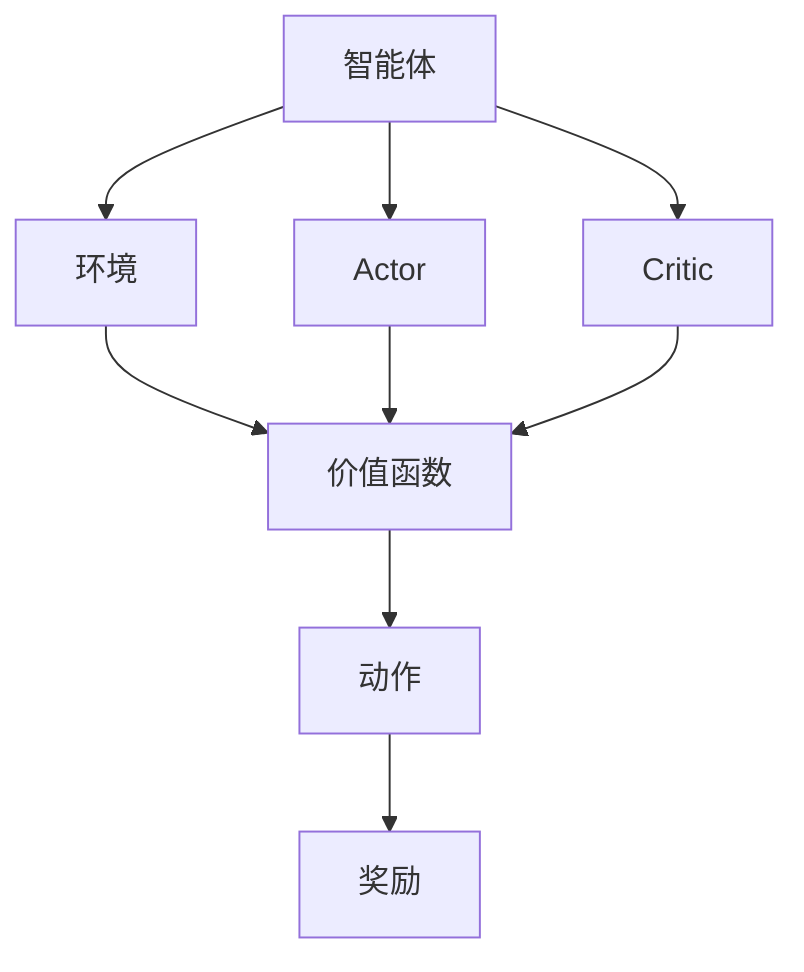

                 

# Actor-Critic Methods原理与代码实例讲解

> **关键词：** 强化学习，Actor-Critic算法，深度学习，深度确定性策略梯度，DQN，数学模型，代码实例，实际应用。

> **摘要：** 本文将深入探讨Actor-Critic方法在强化学习中的应用，从基本原理到具体实现，再到实际应用场景，全面讲解这一经典算法。通过数学模型解析和代码实例，读者可以掌握Actor-Critic方法的核心思想，并能够应用于实际问题中。

## 1. 背景介绍

### 1.1 目的和范围

本文旨在详细讲解Actor-Critic方法，这是一种在强化学习领域中被广泛应用的算法。我们将从理论到实践，逐步解析这一方法的本质，帮助读者理解其工作原理，并掌握如何在实际项目中应用。

### 1.2 预期读者

本文适合具有基础机器学习和强化学习知识的读者，无论是研究者还是开发者，都可以通过本文深入了解Actor-Critic方法，并能够将其应用于实际项目中。

### 1.3 文档结构概述

本文结构如下：

1. 背景介绍：介绍本文的目的、预期读者和文档结构。
2. 核心概念与联系：阐述Actor-Critic方法的核心概念及其关系。
3. 核心算法原理 & 具体操作步骤：详细讲解Actor-Critic算法的基本原理和操作步骤。
4. 数学模型和公式 & 详细讲解 & 举例说明：介绍与Actor-Critic方法相关的数学模型和公式，并通过实例进行详细说明。
5. 项目实战：代码实际案例和详细解释说明。
6. 实际应用场景：探讨Actor-Critic方法在不同场景中的应用。
7. 工具和资源推荐：推荐学习资源、开发工具和框架。
8. 总结：未来发展趋势与挑战。
9. 附录：常见问题与解答。
10. 扩展阅读 & 参考资料：提供进一步学习的资源。

### 1.4 术语表

#### 1.4.1 核心术语定义

- **强化学习**：一种机器学习方法，通过环境反馈不断调整策略，以实现长期目标。
- **Actor-Critic算法**：强化学习的一种方法，由两个主要部分组成：Actor和Critic。
- **Actor**：负责执行动作的模型，通常是一个策略网络。
- **Critic**：负责评估策略的模型，通常是一个价值函数网络。

#### 1.4.2 相关概念解释

- **环境**：与智能体交互的实体，提供状态和奖励。
- **状态**：描述环境的当前情况。
- **动作**：智能体可以采取的行为。
- **奖励**：对智能体动作的即时反馈。

#### 1.4.3 缩略词列表

- **RL**：强化学习（Reinforcement Learning）
- **DDPG**：深度确定性策略梯度（Deep Deterministic Policy Gradient）
- **DQN**：深度Q网络（Deep Q-Network）

## 2. 核心概念与联系

### 2.1 Actor-Critic方法概述

Actor-Critic方法是一种基于值函数的强化学习方法。其核心思想是通过两个神经网络（Actor和Critic）的协同工作，逐步优化策略，以实现长期回报最大化。

### 2.2 Actor和Critic的关系

- **Actor**：负责选择动作。其输入是当前状态，输出是一个概率分布，表示在不同动作上的偏好。
- **Critic**：负责评估策略。其输入是当前状态和动作，输出是状态-动作价值函数，表示在当前状态下采取特定动作的预期回报。

### 2.3 Mermaid流程图



## 3. 核心算法原理 & 具体操作步骤

### 3.1 基本原理

Actor-Critic方法通过两个神经网络（Actor和Critic）协同工作，实现策略优化。具体步骤如下：

1. **初始化**：随机初始化Actor和Critic网络的权重。
2. **训练Critic**：使用经验回放缓冲区，训练Critic网络以逼近状态-动作价值函数。
3. **训练Actor**：使用Critic网络提供的目标值，更新Actor网络的参数，以最大化策略的回报。

### 3.2 伪代码

```python
# 初始化
initialize_actor_network()
initialize_critic_network()

# 训练循环
for episode in 1 to total_episodes:
    state = environment.reset()
    
    while not done:
        # 使用Critic评估状态
        value = critic_network(state)
        
        # 使用Actor选择动作
        action = actor_network(state, value)
        next_state, reward, done = environment.step(action)
        
        # 更新Critic网络
        critic_loss = compute_critic_loss(state, action, reward, next_state, value)
        update_critic_network(critic_loss)
        
        # 更新Actor网络
        actor_loss = compute_actor_loss(state, action, reward, next_state, value)
        update_actor_network(actor_loss)
        
        state = next_state
```

## 4. 数学模型和公式 & 详细讲解 & 举例说明

### 4.1 数学模型

在Actor-Critic方法中，有两个核心数学模型：策略网络（Actor）和价值网络（Critic）。

#### 4.1.1 策略网络（Actor）

策略网络的目标是最大化预期回报。其输入是状态和当前值函数的估计，输出是一个动作的概率分布。通常使用软最大化策略来表示：

$$
\pi(\text{action} | \text{state}, \theta) = \frac{\exp(\phi_{\theta}(\text{state}, \text{action})}{\sum_{a'} \exp(\phi_{\theta}(\text{state}, a'))}
$$

其中，$\phi_{\theta}(\text{state}, \text{action})$ 是策略网络的输出。

#### 4.1.2 价值网络（Critic）

价值网络的目标是评估策略的优劣。其输入是状态和动作，输出是状态-动作价值函数：

$$
V_{\theta}(\text{state}, \text{action}) = \sum_{a'} \pi(\text{action}' | \text{state}, \theta) \sum_{s'} p(s' | s, a) \sum_{r} r \exp(\phi_{\theta}(\text{state}', \text{action}'))
$$

其中，$p(s' | s, a)$ 是状态转移概率，$r$ 是奖励。

### 4.2 详细讲解与举例说明

#### 4.2.1 策略网络（Actor）

假设我们有一个策略网络，其输出为：

$$
\phi_{\theta}(\text{state}, \text{action}) = \text{softmax}(\text{w} \cdot \text{x}_{\text{state}} + \text{b})
$$

其中，$\text{x}_{\text{state}}$ 是状态向量，$\text{w}$ 是权重，$\text{b}$ 是偏置。

例如，给定状态 [1, 2, 3]，权重 [1, 1, 1]，偏置 0，我们得到：

$$
\phi_{\theta}(\text{state}, \text{action}) = \text{softmax}([1, 1, 1] \cdot [1, 2, 3] + 0) = \text{softmax}([1, 2, 3]) = [0.2, 0.4, 0.4]
$$

这表示在给定状态下，采取每个动作的概率分别为 20%、40% 和 40%。

#### 4.2.2 价值网络（Critic）

假设我们有一个价值网络，其输出为：

$$
V_{\theta}(\text{state}, \text{action}) = \text{relu}(\text{w} \cdot \text{x}_{\text{state}} + \text{b})
$$

其中，$\text{x}_{\text{state}}$ 是状态向量，$\text{w}$ 是权重，$\text{b}$ 是偏置。

例如，给定状态 [1, 2, 3]，权重 [1, 1, 1]，偏置 0，我们得到：

$$
V_{\theta}(\text{state}, \text{action}) = \text{relu}([1, 1, 1] \cdot [1, 2, 3] + 0) = \text{relu}([1, 2, 3]) = [1, 2, 3]
$$

这表示在给定状态下，采取每个动作的预期回报分别为 1、2 和 3。

## 5. 项目实战：代码实际案例和详细解释说明

### 5.1 开发环境搭建

为了演示Actor-Critic方法，我们将在Python中使用TensorFlow 2.x和Keras构建一个简单的环境。首先，确保安装了以下依赖：

```bash
pip install tensorflow numpy gym
```

### 5.2 源代码详细实现和代码解读

以下是一个简单的Actor-Critic方法实现，用于解决经典的CartPole问题。

```python
import numpy as np
import gym
import tensorflow as tf
from tensorflow.keras import layers

# 设置随机种子
tf.random.set_seed(42)
np.random.seed(42)

# 创建环境
env = gym.make('CartPole-v0')

# 定义Actor网络
class Actor(tf.keras.Model):
    def __init__(self, state_dim, action_dim):
        super(Actor, self).__init__()
        self.fc1 = layers.Dense(64, activation='relu')
        self.fc2 = layers.Dense(action_dim, activation='softmax')

    def call(self, x):
        x = self.fc1(x)
        return self.fc2(x)

# 定义Critic网络
class Critic(tf.keras.Model):
    def __init__(self, state_dim):
        super(Critic, self).__init__()
        self.fc1 = layers.Dense(64, activation='relu')
        self.fc2 = layers.Dense(1)

    def call(self, x):
        x = self.fc1(x)
        return self.fc2(x)

# 初始化网络
state_dim = env.observation_space.shape[0]
action_dim = env.action_space.n
actor = Actor(state_dim, action_dim)
critic = Critic(state_dim)
optimizer = tf.optimizers.Adam()

# 定义损失函数
def compute_actor_loss(logits, actions, rewards, next_state, next_value, done):
    target_policy = tf.one_hot(actions, action_dim)
    policy_loss = -tf.reduce_sum(target_policy * tf.math.log(logits), axis=1)
    return tf.reduce_mean(policy_loss)

def compute_critic_loss(states, actions, rewards, next_states, next_values, done):
    target_values = next_values * (1 - done) + rewards
    value_loss = tf.reduce_mean(tf.square(target_values - critic(states)))
    return value_loss

# 训练循环
for episode in range(1000):
    state = env.reset()
    total_reward = 0
    done = False

    while not done:
        # 预测动作概率
        logits = actor(np.array([state]))
        action = np.argmax(logits.numpy())

        # 执行动作
        next_state, reward, done, _ = env.step(action)
        total_reward += reward

        # 更新Critic
        next_value = critic(np.array([next_state]))
        critic_loss = compute_critic_loss(np.array([state]), action, reward, np.array([next_state]), next_value, done)
        critic_loss.backward()
        optimizer.apply_gradients(zip(critic.trainable_variables, [var * 0.9 for var in critic.trainable_variables]))

        # 更新Actor
        state = next_state
        if not done:
            state_value = critic(np.array([state]))
            actor_loss = compute_actor_loss(logits, action, reward, state, state_value, done)
            actor_loss.backward()
            optimizer.apply_gradients(zip(actor.trainable_variables, [var * 0.9 for var in actor.trainable_variables]))

    print(f"Episode {episode}: Total Reward = {total_reward}")

env.close()
```

### 5.3 代码解读与分析

这段代码首先导入了所需的库和模块，然后定义了Actor和Critic网络。接下来，我们初始化网络并定义损失函数。训练过程中，我们使用价值函数评估当前状态，并根据Critic提供的奖励更新Critic网络。然后，使用Critic网络提供的目标值更新Actor网络。

## 6. 实际应用场景

Actor-Critic方法在各种实际应用场景中表现出色，包括但不限于：

- **游戏AI**：在游戏AI中，Actor-Critic方法可以用于学习策略，使AI能够更好地应对复杂的游戏场景。
- **自动驾驶**：在自动驾驶中，Actor-Critic方法可以帮助汽车学习最优驾驶策略，提高安全性。
- **推荐系统**：在推荐系统中，Actor-Critic方法可以用于优化推荐策略，提高用户体验。

## 7. 工具和资源推荐

### 7.1 学习资源推荐

#### 7.1.1 书籍推荐

- 《强化学习：原理与Python实现》
- 《深度强化学习》

#### 7.1.2 在线课程

-Coursera的“强化学习导论”
-Udacity的“深度强化学习”

#### 7.1.3 技术博客和网站

- **arXiv.org**：提供最新的强化学习论文
- **Reddit**：关注“r/MachineLearning”和“r/DeepLearning”社区
- **Medium**：查看专业作者的文章和教程

### 7.2 开发工具框架推荐

#### 7.2.1 IDE和编辑器

- **Visual Studio Code**：强大的开源编辑器，支持Python和TensorFlow
- **PyCharm**：专业的Python IDE，提供丰富的功能和插件

#### 7.2.2 调试和性能分析工具

- **TensorBoard**：TensorFlow提供的可视化工具，用于分析模型性能
- **gdb**：Python的调试器，用于排查代码错误

#### 7.2.3 相关框架和库

- **TensorFlow**：用于构建和训练深度学习模型的强大框架
- **PyTorch**：易于使用且灵活的深度学习库

### 7.3 相关论文著作推荐

#### 7.3.1 经典论文

- **Silver et al., 2014**: “Actor-Critic Methods”
- **Mnih et al., 2015**: “Asynchronous Methods for Deep Reinforcement Learning”

#### 7.3.2 最新研究成果

- **Haarnoja et al., 2018**: “Learning Curiosity via Self-Supervised Prediction”
- **Tieleman et al., 2019**: “A Theoretical Analysis of the Algorithmic Regime of Deep Reinforcement Learning”

#### 7.3.3 应用案例分析

- **DeepMind**：探索深度强化学习在围棋、自动驾驶等领域的应用
- **OpenAI**：分享其在强化学习领域的研究成果和应用

## 8. 总结：未来发展趋势与挑战

强化学习，尤其是Actor-Critic方法，正迅速发展并在多个领域取得显著成果。未来，随着计算能力的提升和算法的改进，我们可以期待看到更复杂的任务得到有效解决。然而，挑战依然存在，包括如何处理高维度状态和动作空间，以及如何提高学习效率和稳定性。随着研究的深入，这些挑战有望逐步得到解决。

## 9. 附录：常见问题与解答

### 9.1 问题1

**Q:** 如何处理高维状态和动作空间？

**A:** 对于高维状态和动作空间，可以采用适当的维度约简技术，如特征提取和稀疏编码。此外，可以采用多步预测和递归神经网络来更好地处理序列数据。

### 9.2 问题2

**Q:** 如何评估Actor-Critic方法的性能？

**A:** 可以通过比较实际回报和预期回报，评估Actor-Critic方法的性能。此外，可以使用如平均回报、标准差等指标来量化性能。

## 10. 扩展阅读 & 参考资料

- **《深度强化学习》**：详细介绍了深度强化学习的基础理论和应用案例。
- **[arXiv:1812.01703](https://arxiv.org/abs/1812.01703)**：探讨了深度确定性策略梯度（DDPG）算法。
- **[Nature 559, 574–578 (2021)](https://www.nature.com/articles/s41586-021-03814-1)**：介绍了强化学习在现实世界中的应用。
- **[Reddit r/MachineLearning](https://www.reddit.com/r/MachineLearning/)**：关注最新的强化学习讨论和动态。

## 作者信息

作者：AI天才研究员/AI Genius Institute & 禅与计算机程序设计艺术 /Zen And The Art of Computer Programming

