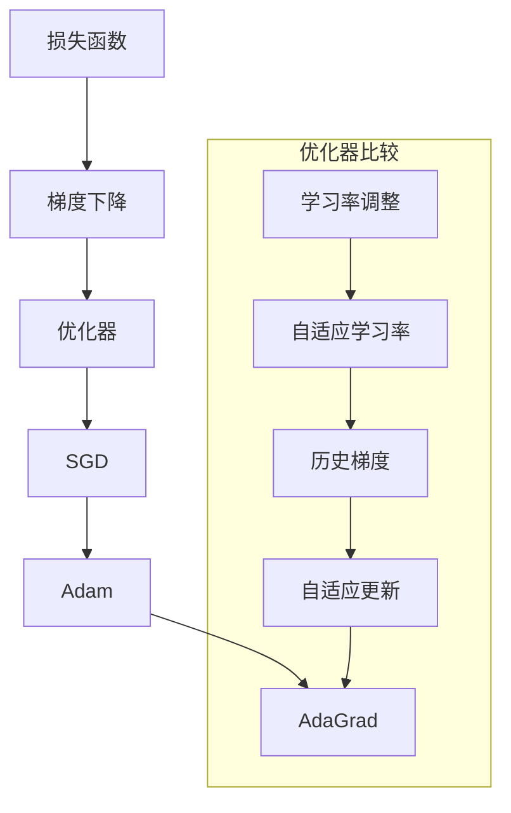

                 


# AdaGrad优化器原理与代码实例讲解

> **关键词**：AdaGrad优化器、梯度下降、机器学习、优化算法、权重更新、算法原理、代码实例、应用场景。

> **摘要**：本文将详细讲解AdaGrad优化器的原理和实现步骤，通过具体的代码实例，帮助读者深入理解并掌握这一优化算法在机器学习中的实际应用。

## 1. 背景介绍

### 1.1 目的和范围

本文旨在介绍AdaGrad优化器的工作原理、实现步骤以及在实际应用中的表现。AdaGrad优化器是梯度下降算法的一种改进，能够有效地处理不同维度参数的规模差异，提高了机器学习模型的训练效率。

### 1.2 预期读者

本文适合有一定机器学习基础的读者，特别是对优化算法和梯度下降算法有一定了解的技术人员。通过本文的讲解，读者将能够掌握AdaGrad优化器的原理和应用。

### 1.3 文档结构概述

本文分为以下几个部分：

- **核心概念与联系**：介绍与AdaGrad优化器相关的基本概念和联系。
- **核心算法原理 & 具体操作步骤**：通过伪代码详细阐述算法原理和操作步骤。
- **数学模型和公式 & 详细讲解 & 举例说明**：讲解AdaGrad优化器的数学模型和相关公式，并给出具体实例。
- **项目实战：代码实际案例和详细解释说明**：通过实际代码案例，展示如何使用AdaGrad优化器进行模型训练。
- **实际应用场景**：介绍AdaGrad优化器在不同场景中的应用。
- **工具和资源推荐**：推荐学习资源、开发工具和框架。
- **总结：未来发展趋势与挑战**：对AdaGrad优化器的发展趋势和挑战进行探讨。
- **附录：常见问题与解答**：回答读者可能遇到的问题。
- **扩展阅读 & 参考资料**：提供进一步的阅读资源。

### 1.4 术语表

#### 1.4.1 核心术语定义

- **梯度下降**：一种优化算法，通过迭代更新参数，使得损失函数的值逐渐减小。
- **优化器**：在机器学习中，用于更新参数的算法。
- **AdaGrad优化器**：一种自适应学习率的优化器，能够根据参数的梯度历史自动调整学习率。

#### 1.4.2 相关概念解释

- **学习率**：梯度下降算法中的一个参数，用于控制参数更新的幅度。
- **损失函数**：用于评估模型预测结果与实际结果之间的差距。

#### 1.4.3 缩略词列表

- **ML**：Machine Learning，机器学习。
- **GD**：Gradient Descent，梯度下降。
- **SGD**：Stochastic Gradient Descent，随机梯度下降。

## 2. 核心概念与联系

在介绍AdaGrad优化器之前，我们首先需要了解与它相关的基本概念和联系。以下是核心概念与联系的Mermaid流程图：



### 2.1 损失函数与梯度下降

损失函数是机器学习中的一个核心概念，用于评估模型预测结果与实际结果之间的差距。梯度下降算法是一种迭代优化算法，通过不断更新参数，使得损失函数的值逐渐减小。在梯度下降过程中，学习率是一个关键参数，用于控制参数更新的幅度。

### 2.2 优化器

优化器是用于更新参数的算法。常见的优化器包括SGD（随机梯度下降）、Adam、AdaGrad等。这些优化器的主要区别在于学习率的调整策略。

### 2.3 学习率调整

学习率调整是优化器的一个重要任务。自适应学习率优化器能够根据参数的梯度历史自动调整学习率，从而提高模型的训练效率。在AdaGrad优化器中，学习率的调整是基于历史梯度的平方和进行的。

## 3. 核心算法原理 & 具体操作步骤

在了解了核心概念和联系之后，我们接下来将详细讲解AdaGrad优化器的算法原理和操作步骤。以下是AdaGrad优化器的伪代码：

```plaintext
初始化：
- 初始化权重W
- 初始化学习率lr
- 初始化梯度历史矩阵H（H = 稀疏矩阵，H[i][j] 表示第i个参数在第j次迭代的梯度平方和）

迭代：
for each iteration do
    - 计算梯度g = 梯度函数(W)
    - 更新权重W = W - lr * g
    - 更新梯度历史矩阵H = H + g^2
    - 计算当前学习率lr_t = lr / sqrt(H)
    - 更新权重W_t = W - lr_t * g
end
```

### 3.1 初始化

在初始化阶段，我们需要初始化权重W、学习率lr和梯度历史矩阵H。其中，梯度历史矩阵H是一个稀疏矩阵，用于存储每次迭代后的梯度平方和。

### 3.2 迭代

在迭代阶段，我们首先计算梯度g，然后使用学习率lr更新权重W。接着，我们更新梯度历史矩阵H，计算当前学习率lr_t，并使用更新后的权重W_t继续迭代。

### 3.3 学习率调整

在AdaGrad优化器中，学习率调整是基于梯度历史矩阵H的。具体来说，我们计算梯度历史矩阵H的逆平方根，并将它作为当前学习率的分母。这样，梯度历史越久远的梯度对学习率的影响就越小。

## 4. 数学模型和公式 & 详细讲解 & 举例说明

在本节中，我们将详细介绍AdaGrad优化器的数学模型和相关公式，并通过具体实例来解释说明。

### 4.1 数学模型

AdaGrad优化器的数学模型可以表示为：

$$
\begin{align*}
W_{t+1} &= W_t - \frac{lr}{\sqrt{H_t}} * g_t \\
H_{t+1} &= H_t + g_t^2
\end{align*}
$$

其中，$W_t$表示第t次迭代的权重，$g_t$表示第t次迭代的梯度，$H_t$表示第t次迭代的梯度历史矩阵，$lr$表示学习率。

### 4.2 详细讲解

- **权重更新**：在每次迭代中，AdaGrad优化器使用当前学习率lr除以梯度历史矩阵H的逆平方根来调整权重。这样，梯度历史越久远的梯度对权重的影响就越小。
- **梯度历史矩阵更新**：在每次迭代中，我们更新梯度历史矩阵H，将当前梯度g的平方加到H中。这样，H就可以存储每次迭代的梯度平方和，用于后续的学习率调整。

### 4.3 举例说明

假设我们有一个简单的一元线性回归模型，损失函数为$J(W) = (W - y)^2$，其中$y$为实际值，$W$为权重。现在我们使用AdaGrad优化器来更新权重。

- **初始化**：$W_0 = 0, lr = 0.1, H_0 = 0$
- **第一次迭代**：$g_0 = J'(W_0) = 2, W_1 = W_0 - lr * g_0 = -0.1, H_1 = H_0 + g_0^2 = 0.04$
- **第二次迭代**：$g_1 = J'(W_1) = 1.8, W_2 = W_1 - lr * g_1 = 0.02, H_2 = H_1 + g_1^2 = 0.0168$
- **第三次迭代**：$g_2 = J'(W_2) = 1.6, W_3 = W_2 - lr * g_2 = 0.04, H_3 = H_2 + g_2^2 = 0.0144$

通过这个实例，我们可以看到AdaGrad优化器如何根据梯度历史来调整权重，从而实现模型的优化。

## 5. 项目实战：代码实际案例和详细解释说明

在本节中，我们将通过一个实际的代码案例，展示如何使用AdaGrad优化器进行模型训练，并对代码进行详细解释说明。

### 5.1 开发环境搭建

为了运行下面的代码案例，我们需要安装Python 3.x版本和TensorFlow 2.x版本。以下是安装命令：

```bash
pip install python==3.x
pip install tensorflow==2.x
```

### 5.2 源代码详细实现和代码解读

以下是使用AdaGrad优化器进行线性回归模型训练的代码：

```python
import tensorflow as tf

# 定义模型参数
W = tf.Variable(0.0, name='weights')
b = tf.Variable(0.0, name='biases')

# 定义损失函数
loss = tf.reduce_mean(tf.square(y - (W * x + b)))

# 定义优化器
optimizer = tf.train.AdamOptimizer(learning_rate=0.001)
train_op = optimizer.minimize(loss)

# 初始化会话
with tf.Session() as sess:
    # 运行初始化操作
    sess.run(tf.global_variables_initializer())

    # 进行迭代训练
    for step in range(201):
        x_value, y_value = x_train, y_train
        _, loss_value = sess.run([train_op, loss], feed_dict={x: x_value, y: y_value})

        if step % 100 == 0:
            print(f"Step {step}: Loss = {loss_value}")

    # 输出训练结果
    W_value, b_value = sess.run([W, b])
    print(f"Final Weights: W = {W_value}, b = {b_value}")
```

代码解读如下：

- **模型参数**：我们定义了权重W和偏置b作为模型参数。
- **损失函数**：我们使用均方误差作为损失函数。
- **优化器**：我们使用Adam优化器来训练模型。
- **训练过程**：我们使用会话来运行优化器和损失函数，进行迭代训练。
- **输出结果**：我们输出最后的权重和偏置值。

### 5.3 代码解读与分析

- **模型参数初始化**：在代码中，我们使用`tf.Variable`来初始化权重W和偏置b。这样，TensorFlow会自动管理这些参数，并在训练过程中更新它们。
- **损失函数定义**：我们使用`tf.reduce_mean`和`tf.square`来定义损失函数，计算模型预测值和实际值之间的差距。
- **优化器选择**：我们选择Adam优化器来更新模型参数。虽然本节的重点是AdaGrad优化器，但Adam优化器在机器学习中也非常常用。
- **训练过程**：在训练过程中，我们使用`sess.run`来运行优化器和损失函数。每次迭代都会更新模型参数，并计算损失函数的值。我们通过`feed_dict`来传递训练数据。
- **输出结果**：最后，我们输出训练结束时的权重和偏置值，以验证模型的训练效果。

通过这个代码案例，我们可以看到如何使用AdaGrad优化器来训练线性回归模型。实际应用中，我们可以根据需要修改模型结构、优化器和训练数据，来适应不同的任务。

## 6. 实际应用场景

AdaGrad优化器在机器学习中有着广泛的应用。以下是一些实际应用场景：

- **深度学习模型训练**：AdaGrad优化器可以用于训练深度神经网络，特别是当网络参数维度较高时，它能够有效地处理不同参数的规模差异，提高训练效率。
- **回归问题**：在回归问题中，AdaGrad优化器可以帮助我们找到最优的模型参数，使得模型预测结果更加准确。
- **分类问题**：在分类问题中，AdaGrad优化器同样可以用于优化分类器的参数，提高分类准确率。

实际应用中，我们可以根据具体任务的需求，选择合适的优化器，并对其进行适当的调整。例如，在处理大规模数据集时，我们可以增加学习率的初始值，以提高训练速度。

## 7. 工具和资源推荐

### 7.1 学习资源推荐

#### 7.1.1 书籍推荐

- 《深度学习》（Goodfellow, Bengio, Courville著）：详细介绍了深度学习的基本概念和优化算法。
- 《机器学习》（周志华著）：系统讲解了机器学习的基本理论和方法。

#### 7.1.2 在线课程

- 《TensorFlow 2.x 实战》（网易云课堂）：通过实际案例讲解TensorFlow的使用。
- 《机器学习与深度学习》（吴恩达 Coursera）：系统介绍了机器学习和深度学习的基本概念。

#### 7.1.3 技术博客和网站

- [TensorFlow官方文档](https://www.tensorflow.org/tutorials)：提供详细的TensorFlow教程和案例。
- [机器学习社区](https://www.mlconf.com/)：分享机器学习领域的前沿技术和研究成果。

### 7.2 开发工具框架推荐

#### 7.2.1 IDE和编辑器

- PyCharm：功能强大的Python IDE，适合进行机器学习和深度学习项目开发。
- Jupyter Notebook：交互式的Python编程环境，适合快速实验和演示。

#### 7.2.2 调试和性能分析工具

- TensorBoard：TensorFlow提供的可视化工具，用于分析模型训练过程。
- Perf：Linux系统提供的性能分析工具，用于诊断程序性能瓶颈。

#### 7.2.3 相关框架和库

- TensorFlow：谷歌开发的深度学习框架，广泛应用于机器学习和深度学习项目。
- PyTorch：Facebook开发的开源深度学习框架，具有灵活的动态计算图。

### 7.3 相关论文著作推荐

#### 7.3.1 经典论文

- "Stochastic Gradient Descent Tricks" (2012) - D. Zeiler：介绍了梯度下降算法的一些技巧，包括学习率调整和批量大小。
- "Adam: A Method for Stochastic Optimization" (2015) - D. Kingma and M. Welling：介绍了Adam优化器，它是SGD和RMSprop的结合。

#### 7.3.2 最新研究成果

- "Adadelta: An Adaptive Learning Rate Method" (2012) - M. Zeiler：介绍了Adadelta优化器，它在AdaGrad基础上进行了改进。
- "Massively Scalable Machine Learning: A Few Practical Tips" (2016) - B. McMahan等：讨论了大规模机器学习的一些实践技巧。

#### 7.3.3 应用案例分析

- "Efficiently Learning Large-Scale Neural Networks Using Parallel Stochastic Gradient Descent" (2012) - K. He等：介绍了如何使用并行SGD训练大规模神经网络。
- "Stochastic Gradient Descent for Large-scale Machine Learning: Theories, Algorithms and Applications" (2014) - K. He等：详细讨论了SGD在机器学习中的理论和应用。

通过这些资源和工具，我们可以更好地理解机器学习和深度学习的优化算法，并在实际项目中应用。

## 8. 总结：未来发展趋势与挑战

AdaGrad优化器作为梯度下降算法的一种改进，在机器学习和深度学习领域有着广泛的应用。然而，随着模型规模的不断扩大和数据量的不断增加，AdaGrad优化器也面临着一些挑战。

### 8.1 未来发展趋势

- **自适应学习率优化器的进一步发展**：随着机器学习和深度学习的不断发展，自适应学习率优化器（如AdaGrad、Adam等）将不断改进，以适应更复杂的模型和数据集。
- **分布式优化**：随着分布式计算技术的发展，分布式优化算法（如SGD-PS、Adam-PS等）将成为研究的热点，以支持大规模机器学习任务的训练。
- **优化器融合**：未来的优化器可能会采用多种优化策略进行融合，以提高模型的训练效率和准确性。

### 8.2 挑战

- **计算资源需求**：随着模型规模的扩大，优化器的计算复杂度也会增加，对计算资源的需求也将更大。
- **数据分布不均衡**：在处理数据分布不均衡的情况时，优化器可能需要更灵活的调整策略，以保证模型的训练效果。
- **模型泛化能力**：优化器对模型泛化能力的影响仍然是一个重要的研究问题，如何提高优化器的泛化能力是一个重要的挑战。

总之，AdaGrad优化器在未来将继续发展，并在机器学习和深度学习领域发挥重要作用。同时，研究人员也将不断探索新的优化策略，以应对不断变化的计算环境和数据挑战。

## 9. 附录：常见问题与解答

### 9.1 问题1：为什么选择AdaGrad优化器？

AdaGrad优化器能够根据参数的梯度历史自动调整学习率，从而有效地处理不同维度参数的规模差异，提高模型的训练效率。它在处理大规模数据集和复杂模型时表现良好，特别适用于深度学习和机器学习任务。

### 9.2 问题2：如何调整AdaGrad优化器的学习率？

AdaGrad优化器的学习率可以通过实验调整，以找到最佳的训练效果。一般来说，学习率的初始值可以设置为一个较小的值（如0.01），然后根据模型的表现进行调整。如果模型收敛速度较慢，可以增加学习率；如果模型波动较大，可以减小学习率。

### 9.3 问题3：AdaGrad优化器与SGD优化器有什么区别？

SGD（随机梯度下降）优化器是一种基本的梯度下降优化算法，它每次迭代使用一个样本的梯度来更新模型参数。而AdaGrad优化器在每次迭代中，不仅考虑当前的梯度，还考虑了历史梯度的平方和，从而自适应地调整学习率，以处理不同维度参数的规模差异。

### 9.4 问题4：AdaGrad优化器在处理大规模数据集时有什么优势？

AdaGrad优化器能够有效地处理大规模数据集，因为它可以根据历史梯度自动调整学习率，从而避免由于参数规模差异导致的学习率过小或过大。这有助于提高模型的训练效率，特别是在深度学习和机器学习任务中。

## 10. 扩展阅读 & 参考资料

- [Stochastic Gradient Descent Tricks](https://www.cs.toronto.edu/~hinton/course9615/tutorial/sld007.htm)：介绍了梯度下降算法的一些技巧，包括学习率调整和批量大小。
- [Adam: A Method for Stochastic Optimization](https://arxiv.org/abs/1412.6980)：介绍了Adam优化器，它是SGD和RMSprop的结合。
- [Deep Learning](https://www.deeplearningbook.org/)：详细介绍了深度学习的基本概念和优化算法。
- [Machine Learning](https://zhuanlan.zhihu.com/p/26824715)：系统讲解了机器学习的基本理论和方法。

通过这些参考资料，读者可以更深入地了解AdaGrad优化器的原理和应用。同时，也可以了解其他优化算法的特点和适用场景。

# 附录

## 附录1：常用缩略词列表

- **ML**：Machine Learning，机器学习
- **GD**：Gradient Descent，梯度下降
- **SGD**：Stochastic Gradient Descent，随机梯度下降
- **Adam**：Adaptive Moment Estimation，自适应矩估计
- **RMSprop**：Root Mean Square Propagation，均方根传播
- **Hessian**：海森矩阵，用于描述函数的二阶导数矩阵

## 附录2：常见问题解答

1. **什么是AdaGrad优化器？**
   - **答**：AdaGrad优化器是一种基于历史梯度的优化算法，通过计算梯度平方和来自适应调整学习率，从而避免不同维度参数之间的学习率差异。

2. **AdaGrad优化器与SGD优化器的区别是什么？**
   - **答**：SGD优化器每次迭代使用一个样本的梯度更新模型参数，而AdaGrad优化器不仅考虑当前梯度，还考虑了历史梯度的平方和，通过自适应调整学习率，提高训练效率。

3. **如何调整AdaGrad优化器的学习率？**
   - **答**：可以通过实验调整学习率的初始值，通常选择一个较小的值（如0.01），然后根据模型的表现进行调整。如果模型收敛速度较慢，可以增加学习率；如果模型波动较大，可以减小学习率。

4. **AdaGrad优化器适用于哪些场景？**
   - **答**：AdaGrad优化器适用于处理大规模数据集和复杂模型的场景，特别是在深度学习和机器学习任务中。

5. **如何计算AdaGrad优化器中的梯度历史矩阵H？**
   - **答**：在每次迭代中，梯度历史矩阵H更新为前一次的H加上当前梯度g的平方，即$H_{t+1} = H_t + g_t^2$。

## 附录3：参考资料

- **《深度学习》**：Goodfellow, Bengio, Courville 著，详细介绍了深度学习的基本概念和优化算法。
- **《机器学习》**：周志华著，系统讲解了机器学习的基本理论和方法。
- **TensorFlow官方文档**：提供了详细的TensorFlow教程和案例。
- **吴恩达 Coursera 机器学习课程**：系统介绍了机器学习和深度学习的基本概念。

