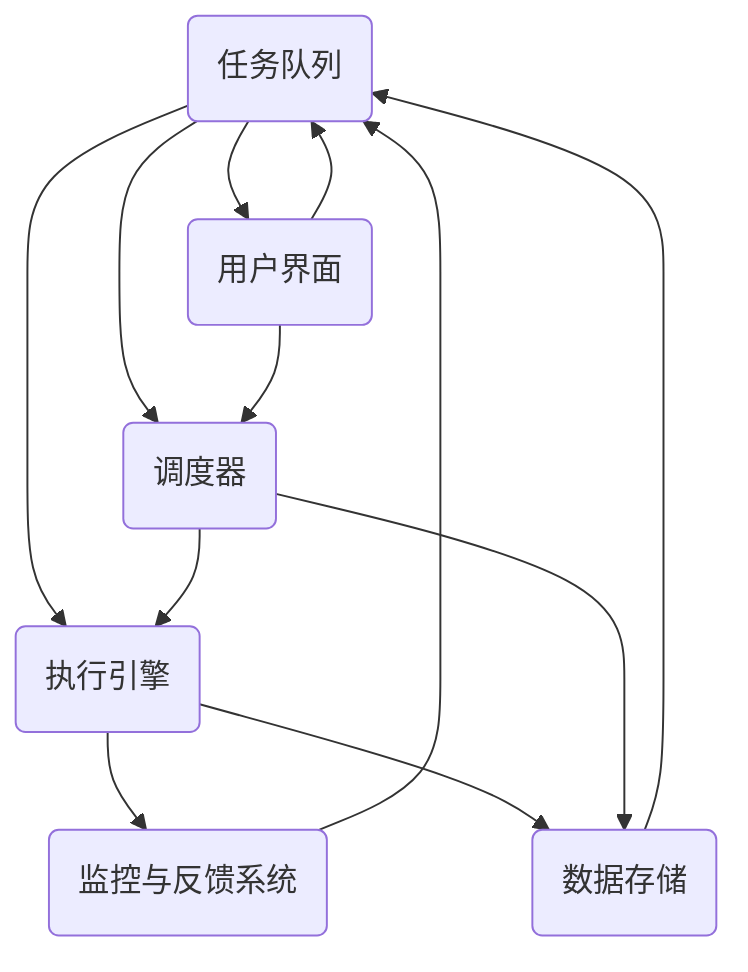
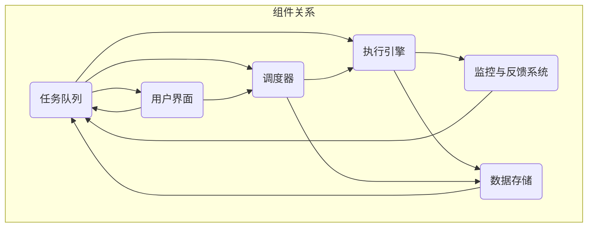

                 

# Agentic Workflow 的组成部分

> **关键词：** Agentic Workflow，组件，自动化，人工智能，协同工作，执行策略

> **摘要：** 本文将深入探讨Agentic Workflow的组成部分，包括其核心概念、执行策略和协同工作模式，并分析其在现代软件开发和运营中的实际应用。我们将通过逻辑清晰、结构紧凑的分析，帮助读者全面理解Agentic Workflow的工作原理和优势。

## 1. 背景介绍

### 1.1 目的和范围

本文旨在介绍Agentic Workflow的核心组成部分，分析其工作原理和应用场景。通过本文的学习，读者将能够：

- 了解Agentic Workflow的基本概念和核心组件。
- 理解Agentic Workflow的执行策略和协同工作模式。
- 掌握Agentic Workflow在实际软件开发和运营中的应用。
- 获取Agentic Workflow相关的学习资源和工具推荐。

### 1.2 预期读者

本文主要面向具有软件开发和自动化背景的读者，尤其是对人工智能和流程自动化有浓厚兴趣的开发者、架构师和项目经理。

### 1.3 文档结构概述

本文将分为以下章节：

- 第1章：背景介绍，包括目的、范围、预期读者和文档结构概述。
- 第2章：核心概念与联系，介绍Agentic Workflow的基本概念和架构。
- 第3章：核心算法原理与具体操作步骤，详细解释Agentic Workflow的执行算法。
- 第4章：数学模型和公式，分析Agentic Workflow的数学基础和公式推导。
- 第5章：项目实战，通过实际代码案例展示Agentic Workflow的应用。
- 第6章：实际应用场景，讨论Agentic Workflow在不同领域的应用。
- 第7章：工具和资源推荐，提供相关学习资源和开发工具推荐。
- 第8章：总结：未来发展趋势与挑战，展望Agentic Workflow的发展前景。
- 第9章：附录：常见问题与解答，解答读者可能遇到的常见问题。
- 第10章：扩展阅读与参考资料，提供进一步学习资源。

### 1.4 术语表

#### 1.4.1 核心术语定义

- **Agentic Workflow：** 一种基于人工智能的自动化工作流，能够实现任务的自动执行和协同工作。
- **执行策略：** Agentic Workflow中的任务执行规则和策略，包括任务分配、优先级和调度。
- **协同工作：** 不同组件或系统之间的协作和交互，实现整体任务的自动化执行。

#### 1.4.2 相关概念解释

- **人工智能（AI）：** 人工智能是一门研究、开发用于模拟、延伸和扩展人的智能的理论、方法、技术及应用。
- **自动化：** 自动化是指通过程序、机器或设备自动执行任务的过程，减少人工干预。

#### 1.4.3 缩略词列表

- **AI：** 人工智能
- **Agentic：** Agentic Workflow的简称
- **IoT：** 物联网
- **API：** 应用程序编程接口

## 2. 核心概念与联系

在深入探讨Agentic Workflow的组成部分之前，我们首先需要了解其核心概念和架构。以下是一个简单的Mermaid流程图，用于展示Agentic Workflow的基本组件和联系。



### 2.1 核心概念解析

- **任务队列（Task Queue）：** 任务队列是Agentic Workflow的核心组件之一，负责管理待执行的任务。任务队列可以存储各种类型和优先级的任务，并根据执行策略进行调度。

- **执行引擎（Execution Engine）：** 执行引擎是Agentic Workflow的执行核心，负责处理任务队列中的任务。执行引擎可以根据任务类型和执行策略，自动执行相应的任务。

- **监控与反馈系统（Monitoring and Feedback System）：** 监控与反馈系统用于监控任务执行过程，收集任务执行状态和性能数据。当任务执行出现异常时，系统会自动触发反馈机制，调整执行策略或通知相关人员。

- **调度器（Scheduler）：** 调度器负责根据任务队列中的任务情况和执行策略，安排任务的执行顺序和优先级。调度器可以根据任务的紧急程度、执行时间和资源占用情况，动态调整任务执行计划。

- **数据存储（Data Storage）：** 数据存储用于存储任务执行过程中产生的数据，包括日志、状态信息和输出结果等。数据存储可以支持数据的持久化存储和查询功能，方便后续分析和处理。

- **用户界面（User Interface）：** 用户界面是Agentic Workflow与用户的交互界面，用于显示任务执行状态、监控数据和系统配置等。用户界面可以支持用户通过简单的操作，对任务执行过程进行监控和调整。

### 2.2 架构关系

Agentic Workflow的各个组件之间通过消息传递和数据共享实现协同工作。以下是一个简化的架构关系图，用于展示各组件之间的联系。



- 任务队列中的任务由执行引擎进行处理，并将执行结果反馈给监控与反馈系统。
- 调度器根据任务执行情况，动态调整任务执行计划，确保任务高效执行。
- 数据存储用于存储任务执行过程中的数据，方便后续分析和处理。
- 用户界面提供任务监控和配置功能，方便用户对任务执行过程进行管理和调整。

通过以上核心概念和架构关系的介绍，我们为后续详细探讨Agentic Workflow的执行算法、数学模型和应用场景奠定了基础。

## 3. 核心算法原理与具体操作步骤

### 3.1 执行算法原理

Agentic Workflow的执行算法主要包括任务调度、任务执行和结果反馈三个核心步骤。以下是一个简单的伪代码，用于展示执行算法的基本原理。

```python
def agentic_workflow():
    while True:
        # 获取下一个待执行任务
        task = task_queue.get_next_task()

        # 判断任务类型和优先级
        if task.is_high_priority():
            execute_task(task)
        else:
            schedule_task(task)

        # 更新监控与反馈系统
        update_monitoring_system(task)

def execute_task(task):
    # 根据任务类型执行具体操作
    if task.is_api_call():
        call_api(task)
    elif task.is_data_processing():
        process_data(task)
    else:
        raise Exception("Unsupported task type")

def schedule_task(task):
    # 调整任务执行时间或优先级
    schedule_algorithm.adjust(task)

def update_monitoring_system(task):
    # 记录任务执行状态和性能数据
    monitoring_system.log_task_status(task)
```

### 3.2 具体操作步骤

以下为Agentic Workflow的详细操作步骤，包括任务调度、任务执行和结果反馈。

#### 3.2.1 任务调度

任务调度的目的是根据任务队列中的任务情况，动态安排任务的执行顺序和优先级。以下为一个简单的任务调度算法伪代码。

```python
def schedule_tasks():
    while True:
        # 获取任务队列中的所有任务
        tasks = task_queue.get_all_tasks()

        # 对任务进行排序（根据优先级、执行时间和资源占用情况）
        sorted_tasks = sort_tasks_by_priority_and_resource_usage(tasks)

        # 遍历排序后的任务，执行任务
        for task in sorted_tasks:
            if can_execute_task(task):
                execute_task(task)
                break
```

- **任务排序：** 根据任务的优先级、执行时间和资源占用情况，对任务进行排序。高优先级、低执行时间、低资源占用的任务优先执行。
- **任务执行：** 遍历排序后的任务，判断当前系统是否有足够的资源执行任务。如果有，则执行任务，否则等待。

#### 3.2.2 任务执行

任务执行的核心是执行具体的任务操作，如API调用、数据处理等。以下为一个简单的任务执行算法伪代码。

```python
def execute_task(task):
    if task.is_api_call():
        response = call_api(task)
        process_api_response(response, task)
    elif task.is_data_processing():
        result = process_data(task)
        process_data_result(result, task)
    else:
        raise Exception("Unsupported task type")
```

- **API调用：** 执行API调用，获取响应数据，并根据响应数据进行后续处理。
- **数据处理：** 执行数据处理操作，如数据清洗、转换等，并根据处理结果进行后续处理。

#### 3.2.3 结果反馈

结果反馈是Agentic Workflow的关键环节，用于记录任务执行状态、性能数据和异常情况。以下为一个简单的结果反馈算法伪代码。

```python
def update_monitoring_system(task):
    if task.status == "Success":
        monitoring_system.log_task_success(task)
    elif task.status == "Failure":
        monitoring_system.log_task_failure(task)
    monitoring_system.record_performance_metrics(task)
```

- **成功反馈：** 当任务执行成功时，记录任务成功信息，如执行时间、资源占用等。
- **失败反馈：** 当任务执行失败时，记录任务失败信息，如异常类型、错误信息等。
- **性能数据记录：** 记录任务执行过程中的性能数据，如执行时间、CPU占用、内存占用等，用于后续分析和优化。

通过以上执行算法和具体操作步骤的介绍，我们可以看出Agentic Workflow的核心原理和流程。在实际应用中，可以根据具体需求对算法和步骤进行调整和优化，以提高系统性能和可靠性。

## 4. 数学模型和公式

### 4.1 任务调度算法

在任务调度过程中，我们需要考虑任务执行的优先级、执行时间和资源占用情况。以下是一个简单的任务调度算法公式，用于计算任务执行顺序。

$$
\text{sorted\_tasks} = \{ \text{task}_{1}, \text{task}_{2}, ..., \text{task}_{n} \}
$$

其中，$\text{sorted\_tasks}$表示按优先级和资源占用情况排序后的任务列表。公式如下：

$$
\text{task}_{i} = \arg\min\left(\frac{\text{priority}\_{i} \times \text{execution\_time}\_{i}}{\text{resource\_usage}\_{i}}\right)
$$

其中，$\text{priority}\_{i}$表示任务$i$的优先级，$\text{execution\_time}\_{i}$表示任务$i$的预计执行时间，$\text{resource\_usage}\_{i}$表示任务$i$的资源占用情况。

### 4.2 调度策略

调度策略是任务调度算法的核心，用于确定任务执行的顺序和优先级。以下是一个简单的调度策略公式，用于计算任务的执行顺序。

$$
\text{task\_order} = \arg\min\left(\text{execution\_time}\right)
$$

其中，$\text{task\_order}$表示任务的执行顺序。该公式表示，在当前系统资源限制下，优先执行预计执行时间最短的任务。

### 4.3 结果反馈

结果反馈用于记录任务执行状态和性能数据。以下是一个简单的结果反馈公式，用于计算任务的成功率和错误率。

$$
\text{success\_rate} = \frac{\text{success\_count}}{\text{total\_count}}
$$

其中，$\text{success\_rate}$表示任务的成功率，$\text{success\_count}$表示任务成功执行的次数，$\text{total\_count}$表示任务执行的总次数。

$$
\text{error\_rate} = \frac{\text{error\_count}}{\text{total\_count}}
$$

其中，$\text{error\_rate}$表示任务的错误率，$\text{error\_count}$表示任务执行失败的次数，$\text{total\_count}$表示任务执行的总次数。

### 4.4 性能指标

性能指标用于评估任务执行过程的效率和质量。以下是一个简单的性能指标公式，用于计算任务的平均执行时间和资源利用率。

$$
\text{average\_execution\_time} = \frac{\sum_{i=1}^{n} \text{execution\_time}\_{i}}{n}
$$

其中，$\text{average\_execution\_time}$表示任务的平均执行时间，$\text{execution\_time}\_{i}$表示第$i$个任务的执行时间，$n$表示任务的总数。

$$
\text{resource\_utilization} = \frac{\sum_{i=1}^{n} \text{resource\_usage}\_{i}}{n}
$$

其中，$\text{resource\_utilization}$表示系统的平均资源利用率，$\text{resource\_usage}\_{i}$表示第$i$个任务执行时的资源占用情况，$n$表示任务的总数。

### 4.5 示例

以下是一个简单的示例，用于说明任务调度、结果反馈和性能指标的运用。

假设任务队列中有三个任务，其优先级、预计执行时间和资源占用情况如下：

| 任务编号 | 优先级 | 预计执行时间 | 资源占用 |
| :----: | :----: | :----: | :----: |
| task1 | 1 | 5s | 50% |
| task2 | 2 | 10s | 40% |
| task3 | 3 | 15s | 30% |

根据调度策略，我们首先执行预计执行时间最短的task1，然后依次执行task2和task3。

在任务执行过程中，task1和task2成功执行，task3因资源不足而失败。根据结果反馈，我们计算任务的成功率和错误率：

$$
\text{success\_rate} = \frac{2}{3} = 0.67
$$

$$
\text{error\_rate} = \frac{1}{3} = 0.33
$$

在任务执行完成后，我们计算任务的平均执行时间和资源利用率：

$$
\text{average\_execution\_time} = \frac{5 + 10 + 15}{3} = 10s
$$

$$
\text{resource\_utilization} = \frac{50 + 40 + 30}{3} = 43.33\%
$$

通过以上示例，我们可以看出数学模型和公式在任务调度、结果反馈和性能评估中的重要作用。在实际应用中，可以根据具体需求对模型和公式进行调整和优化，以提高任务执行效率和系统性能。

## 5. 项目实战：代码实际案例和详细解释说明

在本章节中，我们将通过一个具体的代码案例，展示Agentic Workflow在实际项目中的应用。我们将从开发环境搭建、源代码实现和代码解读三个部分，详细解释Agentic Workflow的工作过程和关键代码。

### 5.1 开发环境搭建

为了演示Agentic Workflow，我们将使用以下技术栈：

- **编程语言：** Python 3.8+
- **框架：** Flask（用于构建Web服务）和Celery（用于任务队列和调度）
- **数据库：** SQLite（用于存储任务和执行结果）
- **前端：** HTML/CSS/JavaScript（用于展示任务执行状态）

首先，我们需要安装相关依赖：

```bash
pip install flask celery[redis] pymysql
```

接下来，创建一个名为`agentic_workflow`的目录，并在该目录下创建以下文件和目录：

- `app.py`：主应用程序
- `tasks.py`：任务处理模块
- `models.py`：数据库模型模块
- `templates/`：HTML模板文件

### 5.2 源代码详细实现和代码解读

#### 5.2.1 主应用程序（`app.py`）

```python
from flask import Flask, render_template, request
from tasks import add, subtract
from models import db, Task

app = Flask(__name__)
app.config['SQLALCHEMY_DATABASE_URI'] = 'sqlite:///tasks.db'
db.init_app(app)

@app.route('/')
def index():
    tasks = Task.query.all()
    return render_template('index.html', tasks=tasks)

@app.route('/add', methods=['POST'])
def add_task():
    task = Task(description=request.form['description'], status='pending')
    db.session.add(task)
    db.session.commit()
    add.apply_async(args=(task.id,))
    return 'Task added successfully'

@app.route('/subtract', methods=['POST'])
def subtract_task():
    task = Task(description=request.form['description'], status='pending')
    db.session.add(task)
    db.session.commit()
    subtract.apply_async(args=(task.id,))
    return 'Task added successfully'

if __name__ == '__main__':
    app.run(debug=True)
```

- **配置数据库：** 我们使用SQLite数据库存储任务和执行结果。首先初始化数据库连接，并定义`Task`模型。
- **定义路由：** `/`路由用于显示任务列表，`/add`和`/subtract`路由用于添加任务。
- **添加任务：** 当用户提交任务时，我们将任务信息存储到数据库，并使用Celery异步调度任务。

#### 5.2.2 任务处理模块（`tasks.py`）

```python
from celery import Celery
from models import db, Task

celery = Celery(__name__)
celery.conf.broker_url = 'redis://localhost:6379/0'
celery.conf.result_backend = 'redis://localhost:6379/0'

@celery.task
def add(task_id):
    task = Task.query.get(task_id)
    result = add_function(task.description)
    task.status = 'completed'
    task.result = result
    db.session.commit()

@celery.task
def subtract(task_id):
    task = Task.query.get(task_id)
    result = subtract_function(task.description)
    task.status = 'completed'
    task.result = result
    db.session.commit()
```

- **初始化Celery：** 配置消息队列和结果存储。
- **定义任务函数：** `add`和`subtract`函数分别用于执行加法和减法操作。当任务被调度时，这些函数将被异步执行。

#### 5.2.3 数据库模型模块（`models.py`）

```python
from flask_sqlalchemy import SQLAlchemy

db = SQLAlchemy()

class Task(db.Model):
    id = db.Column(db.Integer, primary_key=True)
    description = db.Column(db.String(255))
    status = db.Column(db.String(50))
    result = db.Column(db.Numeric)
```

- **定义数据库模型：** `Task`模型用于存储任务信息，包括任务描述、状态和结果。

### 5.3 代码解读与分析

#### 5.3.1 主应用程序（`app.py`）

- **数据库初始化：** `app.config['SQLALCHEMY_DATABASE_URI']`配置了数据库连接URI。`db.init_app(app)`将数据库初始化与应用程序关联。
- **定义路由：** `/`路由用于显示任务列表。`/add`和`/subtract`路由用于处理任务添加。当用户提交任务时，任务信息将被存储到数据库。
- **任务调度：** 当用户提交任务时，`add.apply_async(args=(task.id,))`和`subtract.apply_async(args=(task.id,))`将任务调度到消息队列，由任务处理模块执行。

#### 5.3.2 任务处理模块（`tasks.py`）

- **初始化Celery：** `celery = Celery(__name__)`创建了一个新的Celery实例。`celery.conf.broker_url`和`celery.conf.result_backend`配置了消息队列和结果存储。
- **定义任务函数：** `add`和`subtract`函数分别用于执行加法和减法操作。这些函数将任务信息从数据库查询出来，并执行相应的计算操作，然后将结果更新回数据库。

#### 5.3.3 数据库模型模块（`models.py`）

- **定义数据库模型：** `Task`模型用于存储任务信息。任务描述、状态和结果分别存储在`description`、`status`和`result`列中。

通过以上代码解读，我们可以看到Agentic Workflow在实际项目中的应用。用户可以通过Web界面提交任务，任务将被存储到数据库，并使用Celery异步调度执行。任务执行完成后，结果将更新回数据库，用户可以在Web界面上查看任务执行状态和结果。

## 6. 实际应用场景

Agentic Workflow作为一种基于人工智能的自动化工作流，具有广泛的应用场景。以下列举了几个典型的应用场景：

### 6.1 IT运维自动化

在IT运维领域，Agentic Workflow可以用于自动化部署、监控、故障处理和性能优化等任务。通过定义一系列执行策略和任务流程，系统可以自动执行日常运维任务，减少人工干预，提高运维效率和稳定性。

- **应用实例：** 自动化部署应用程序，根据负载情况动态调整服务器资源，监控系统性能并自动处理异常。

### 6.2 数据处理与分析

在数据处理与分析领域，Agentic Workflow可以用于自动化数据采集、清洗、转换和可视化等任务。通过将数据处理任务分解为一系列子任务，系统可以并行执行，提高数据处理效率。

- **应用实例：** 自动化采集网络日志，清洗数据以去除噪音，转换数据格式以支持数据分析工具，可视化分析结果以辅助决策。

### 6.3 物联网（IoT）平台

在物联网领域，Agentic Workflow可以用于自动化设备监控、数据传输和故障处理等任务。通过集成物联网设备和传感器数据，系统可以实现实时监控和智能处理。

- **应用实例：** 自动化监控设备状态，根据传感器数据触发警报，远程维护和故障处理。

### 6.4 跨平台协同工作

在跨平台协同工作领域，Agentic Workflow可以用于自动化协调不同系统之间的任务执行和数据交互。通过定义一系列执行策略和任务流程，系统可以实现跨平台任务自动化，提高协同工作效率。

- **应用实例：** 自动化集成不同业务系统，实现数据同步和流程自动化，简化跨平台业务流程。

通过以上应用场景的介绍，我们可以看到Agentic Workflow在各个领域都具有广泛的应用前景。在实际应用中，可以根据具体需求对工作流进行定制和优化，实现高效、可靠的自动化任务执行。

## 7. 工具和资源推荐

### 7.1 学习资源推荐

#### 7.1.1 书籍推荐

- **《人工智能：一种现代方法》（Artificial Intelligence: A Modern Approach）**：这是一本经典的AI教材，涵盖了广泛的AI理论和实践方法。
- **《深度学习》（Deep Learning）**：由Ian Goodfellow等编著，详细介绍了深度学习的基本概念和技术。
- **《流程自动化实战》（Workflows for Machine Learning）**：介绍了如何使用自动化工具和框架实现机器学习项目。

#### 7.1.2 在线课程

- **Coursera上的《机器学习》（Machine Learning）**：由Andrew Ng教授主讲，适合初学者入门。
- **Udacity的《深度学习工程师纳米学位》（Deep Learning Engineer Nanodegree）**：提供深度学习的项目实践课程。
- **edX上的《流程自动化与优化》（Workflow Automation and Optimization）**：介绍自动化工具和工作流优化技术。

#### 7.1.3 技术博客和网站

- **Towards Data Science（TDS）**：提供丰富的数据科学和机器学习技术文章。
- **AI缅甸**：一个中文AI技术社区，分享AI相关文章和资源。
- **Stack Overflow**：全球最大的开发社区，可以解决编程和开发中的问题。

### 7.2 开发工具框架推荐

#### 7.2.1 IDE和编辑器

- **Visual Studio Code（VS Code）**：一款开源跨平台IDE，支持Python、JavaScript等多种编程语言。
- **PyCharm**：一款专业的Python IDE，提供丰富的功能和插件。

#### 7.2.2 调试和性能分析工具

- **GDB**：一款功能强大的C/C++调试工具。
- **Wireshark**：一款网络协议分析工具，可以分析网络数据包。

#### 7.2.3 相关框架和库

- **Flask**：一个轻量级的Python Web框架，适合构建简单的Web服务。
- **Celery**：一个分布式任务队列，可以实现任务异步执行。
- **SQLAlchemy**：一个Python SQL工具包和对象关系映射（ORM）系统。

### 7.3 相关论文著作推荐

#### 7.3.1 经典论文

- **“A Few Useful Things to Know About Machine Learning”**：由 Pedro Domingos 撰写，介绍了一些重要的机器学习概念和应用。
- **“Deep Learning”**：由 Ian Goodfellow，Yoshua Bengio 和 Aaron Courville 撰写，详细介绍了深度学习的基本原理。

#### 7.3.2 最新研究成果

- **“An Overview of Workflow Management Systems”**：介绍了工作流管理系统的发展现状和趋势。
- **“Data-Driven Optimization of Deep Neural Networks”**：探讨了基于数据优化的深度神经网络训练方法。

#### 7.3.3 应用案例分析

- **“AI in Healthcare: A Practical Guide”**：探讨了人工智能在医疗领域的应用，包括疾病预测、诊断和患者管理。
- **“AI in Finance: A Practical Guide”**：介绍了人工智能在金融行业的应用，包括风险管理、投资分析和自动化交易。

通过以上工具和资源的推荐，读者可以更好地了解Agentic Workflow的相关技术和实践，为学习和开发提供有力支持。

## 8. 总结：未来发展趋势与挑战

Agentic Workflow作为一种基于人工智能的自动化工作流，展现了巨大的潜力和应用前景。在未来，Agentic Workflow的发展趋势和面临的挑战如下：

### 8.1 未来发展趋势

1. **智能调度与优化：** 随着人工智能技术的发展，未来的Agentic Workflow将更加智能，能够根据实时数据动态调整任务执行策略，实现更高效的资源利用和任务调度。
2. **跨平台与集成：** 随着云计算和物联网技术的普及，Agentic Workflow将逐渐跨越不同平台和系统，实现更广泛的集成和应用。
3. **模块化与可扩展性：** 未来的Agentic Workflow将更加模块化，便于扩展和定制，以适应不同的业务需求和场景。
4. **低代码/无代码平台：** 为了降低开发门槛，未来的Agentic Workflow将更倾向于低代码或无代码平台，使非专业开发者也能轻松构建自动化工作流。

### 8.2 面临的挑战

1. **数据隐私与安全：** 在自动化工作流中，数据的传输和处理涉及到隐私和安全问题。如何保护用户数据，确保数据安全，是Agentic Workflow面临的重要挑战。
2. **可解释性与透明度：** 随着人工智能技术的应用，自动化工作流的决策过程可能变得复杂且不透明。如何提高工作流的可解释性和透明度，增强用户信任，是一个重要的挑战。
3. **系统可靠性与稳定性：** 自动化工作流需要确保系统的可靠性和稳定性，以避免因系统故障导致的任务执行失败。如何提高系统的容错能力和恢复能力，是Agentic Workflow面临的关键挑战。
4. **法规与合规：** 在不同国家和地区，自动化工作流需要遵守不同的法律法规。如何确保Agentic Workflow的合规性，是一个需要关注的问题。

总之，Agentic Workflow在未来具有广阔的发展前景，但也面临着一系列挑战。通过不断的技术创新和优化，相信Agentic Workflow将能够克服这些挑战，为企业和个人带来更多的价值。

## 9. 附录：常见问题与解答

### 9.1 常见问题

1. **什么是Agentic Workflow？**
   Agentic Workflow是一种基于人工智能的自动化工作流，它能够根据执行策略和协同工作模式，自动执行任务并处理任务执行过程中产生的数据。

2. **Agentic Workflow有哪些核心组件？**
   Agentic Workflow的核心组件包括任务队列、执行引擎、监控与反馈系统、调度器、数据存储和用户界面。

3. **如何实现任务调度？**
   任务调度是通过调度器根据任务队列中的任务情况，动态安排任务的执行顺序和优先级。可以使用简单的调度算法，如基于优先级和执行时间的排序算法，来实现任务调度。

4. **如何实现任务执行？**
   任务执行是通过执行引擎根据任务类型和执行策略，自动执行相应的任务操作。例如，对于API调用任务，执行引擎会调用相应的API接口；对于数据处理任务，执行引擎会执行数据处理操作。

5. **如何记录任务执行状态和性能数据？**
   可以使用监控与反馈系统来记录任务执行状态和性能数据。当任务执行成功或失败时，系统会记录相关信息，如执行时间、资源占用和异常信息等。

### 9.2 解答

1. **什么是Agentic Workflow？**
   Agentic Workflow是一种基于人工智能的自动化工作流，它能够根据执行策略和协同工作模式，自动执行任务并处理任务执行过程中产生的数据。通过任务队列、执行引擎、监控与反馈系统、调度器、数据存储和用户界面等组件，实现任务的自动化执行和协同工作。

2. **Agentic Workflow有哪些核心组件？**
   Agentic Workflow的核心组件包括任务队列、执行引擎、监控与反馈系统、调度器、数据存储和用户界面。任务队列负责管理待执行的任务；执行引擎负责处理任务队列中的任务；监控与反馈系统用于监控任务执行过程，记录任务状态和性能数据；调度器负责根据任务队列中的任务情况，动态安排任务的执行顺序和优先级；数据存储用于存储任务执行过程中产生的数据；用户界面提供任务监控和配置功能。

3. **如何实现任务调度？**
   任务调度是通过调度器根据任务队列中的任务情况，动态安排任务的执行顺序和优先级。调度器可以使用简单的调度算法，如基于优先级和执行时间的排序算法，将任务队列中的任务按优先级和预计执行时间排序，然后依次执行任务。调度器还可以根据系统资源占用情况，动态调整任务执行顺序，以确保任务高效执行。

4. **如何实现任务执行？**
   任务执行是通过执行引擎根据任务类型和执行策略，自动执行相应的任务操作。例如，对于API调用任务，执行引擎会调用相应的API接口，获取响应数据；对于数据处理任务，执行引擎会执行数据处理操作，如数据清洗、转换等。执行引擎需要根据任务类型和执行策略，选择合适的执行方法，并将执行结果反馈给监控与反馈系统。

5. **如何记录任务执行状态和性能数据？**
   可以使用监控与反馈系统来记录任务执行状态和性能数据。监控与反馈系统会定期检查任务执行状态，记录任务的执行时间、资源占用、执行结果和异常信息等。当任务执行成功时，系统会记录成功信息；当任务执行失败时，系统会记录失败原因。监控与反馈系统还可以记录任务执行过程中的性能数据，如CPU占用率、内存占用率等，用于后续分析和优化。

通过以上解答，读者可以更好地理解Agentic Workflow的核心概念和组件，以及如何实现任务调度、任务执行和记录任务状态。

## 10. 扩展阅读与参考资料

为了进一步深入理解和应用Agentic Workflow，以下推荐一些扩展阅读和参考资料，涵盖相关书籍、论文、技术博客和在线课程：

### 10.1 书籍推荐

1. **《人工智能：一种现代方法》（Artificial Intelligence: A Modern Approach）**，作者：Peter Norvig 和 Stuart J. Russell。这是一本经典的AI教材，详细介绍了AI的基础理论和算法。

2. **《深度学习》（Deep Learning）**，作者：Ian Goodfellow、Yoshua Bengio 和 Aaron Courville。这本书深入讲解了深度学习的原理和实际应用，适合希望深入了解深度学习的读者。

3. **《流程自动化实战》（Workflows for Machine Learning）**，作者：Andreas C. Dräger。本书提供了大量关于如何在实际项目中实现流程自动化的案例和实践。

### 10.2 论文推荐

1. **“An Overview of Workflow Management Systems”**，作者：Anshul Garg 和 John O. Rommer。这篇论文详细介绍了工作流管理系统的发展现状和关键概念。

2. **“Data-Driven Optimization of Deep Neural Networks”**，作者：Matteo Gori、Fausto Guzzetti 和 Marco Poggi。这篇论文探讨了基于数据优化的深度神经网络训练方法。

### 10.3 技术博客和网站

1. **Towards Data Science（TDS）**：这是一个专门发布数据科学和机器学习文章的博客，涵盖了各种主题和案例研究。

2. **AI缅甸**：一个中文AI技术社区，分享AI相关文章和资源，适合中文读者。

3. **Stack Overflow**：这是一个全球最大的开发社区，可以解决编程和开发中的问题，是寻找解决方案的好去处。

### 10.4 在线课程

1. **Coursera上的《机器学习》（Machine Learning）**：由Andrew Ng教授主讲，适合初学者入门。

2. **Udacity的《深度学习工程师纳米学位》（Deep Learning Engineer Nanodegree）**：提供深度学习的项目实践课程。

3. **edX上的《流程自动化与优化》（Workflow Automation and Optimization）**：介绍自动化工具和工作流优化技术。

通过阅读这些书籍、论文和在线课程，读者可以更全面地了解Agentic Workflow的理论和实践，为自己的项目提供更多启发和指导。

